```mermaid
classDiagram
  direction TB
  
  namespace controllers {
    class SearchController {
      <<Service>>
      +searchByIngredients(dto: SearchByIngredientsDTO) SearchResultDTO
      +searchByName(dto: SearchByNameDTO) SearchResultDTO
    }
    
    class AIRecipeController {
      <<Service>>
      +generateRecipeFromAI(dto: AIRecipeRequestDTO) AIRecipeResponseDTO
    }
    
    class ResultController {
      <<Service>>
      +applyFilterSort(criteria: FilterSortCriteriaDTO) SearchResultDTO
    }
    
    class RecipeDetailController {
      <<Service>>
      +getRecipeDetail(recipeId: UUID, userId?: UUID) RecipeDetailDTO
    }
  }
  
  namespace services {
    class RecipeSearchService {
      <<Service>>
      +rankRecipes(ingredients: string[], filters?: object) Recipe[]
      +scoreAndPrioritize(candidates: Recipe[]) Recipe[]
    }
    
    class TextSearchService {
      <<Service>>
      +search(normalized: string, filters?: object) Recipe[]
      +rankByRelevance(candidates: Recipe[]) Recipe[]
    }
    
    class AIRecipeService {
      <<Service>>
      +generate(ingredients: string[], options?: object) AIRecipeResponseDTO
      +buildPrompt(ingredients: string[], options?: object) string
      +parseAndValidate(aiResponse: string) AIRecipeResponseDTO
    }
    
    class FilterSortService {
      <<Service>>
      +apply(criteria: FilterSortCriteriaDTO, results: Recipe[]) Recipe[]
    }
    
    class RecipeDetailService {
      <<Service>>
      +getRecipeDetail(recipeId: UUID, userId?: UUID) RecipeDetailDTO
    }
    
    class IngredientNormalizer {
      <<Service>>
      +normalize(rawIngredients: string[]) string[]
    }
    
    class TextNormalizer {
      <<Service>>
      +normalizeKeyword(keyword: string) string
    }
    
    class HistoryService {
      <<Service>>
      +saveViewHistory(userId: UUID, recipeId: UUID) void
    }
    
    class IAuthorizationService {
      <<Interface>>
      +checkPermission(userId: UUID, permission: string) boolean
    }
    
    class ICacheService {
      <<Interface>>
      +getCached(key: string) object?
      +setCached(key: string, value: object, ttl: number) void
    }
    
    class IResultStore {
      <<Interface>>
      +loadCurrentResults(sessionId: string) Recipe[]
      +saveState(sessionId: string, criteria: object) void
    }
    
    class ISessionStore {
      <<Interface>>
      +saveTemporary(userId: UUID, recipeJson: object) void
      +getTemporary(userId: UUID) object?
    }
    
    class IAIProvider {
      <<Interface>>
      +callAI(prompt: string) string
    }
  }
  
  namespace domain {
    class Recipe {
      <<Entity>>
      +id: UUID
      +name: string
      +description: string
      +prepTime: number
      +cookTime: number
      +difficulty: DifficultyLevel
      +servings: number
      +status: RecipeStatus
      +createdBy: UUID
      +createdAt: DateTime
      +views: number
      +incrementView()
      +updateStatus()
    }
    
    class Ingredient {
      <<ValueObject>>
      +name: string
      +amount: number
      +unit: string
      +notes: string?
      +validate()
      +equals()
    }
    
    class RecipeStep {
      <<ValueObject>>
      +stepNumber: number
      +instruction: string
      +duration: number?
      +mediaUrls: string[]?
      +validate()
      +equals()
    }
    
    class Rating {
      <<Entity>>
      +id: UUID
      +recipeId: UUID
      +userId: UUID
      +score: number
      +comment: string?
      +createdAt: DateTime
      +validate()
      +equals()
    }
    
    class Comment {
      <<Entity>>
      +id: UUID
      +recipeId: UUID
      +userId: UUID
      +content: string
      +createdAt: DateTime
      +updatedAt: DateTime?
      +update()
      +delete()
    }
    
    class ViewHistory {
      <<Entity>>
      +id: UUID
      +userId: UUID
      +recipeId: UUID
      +viewedAt: DateTime
    }
    
    class RecipeStatus {
      <<Enumeration>>
      DRAFT
      PENDING
      APPROVED
      REJECTED
    }
    
    class DifficultyLevel {
      <<Enumeration>>
      EASY
      MEDIUM
      HARD
    }
  }
  
  namespace infrastructure {
    class IRecipeRepository {
      <<Interface>>
      +findById(recipeId: UUID) Recipe?
      +findByIngredients(ingredients: string[]) Recipe[]
      +findByName(name: string) Recipe[]
      +incrementView(recipeId: UUID) void
    }
    
    class IIngredientRepository {
      <<Interface>>
      +findByRecipeId(recipeId: UUID) Ingredient[]
      +findByNames(names: string[]) Ingredient[]
    }
    
    class IStepRepository {
      <<Interface>>
      +findByRecipeId(recipeId: UUID) RecipeStep[]
    }
    
    class IRatingRepository {
      <<Interface>>
      +findByRecipeId(recipeId: UUID) Rating[]
      +getAverageRating(recipeId: UUID) number
    }
    
    class ICommentRepository {
      <<Interface>>
      +findByRecipeId(recipeId: UUID) Comment[]
      +insert(comment: Comment) UUID
    }
    
    class IViewHistoryRepository {
      <<Interface>>
      +insert(viewHistory: ViewHistory) UUID
      +findByUserId(userId: UUID) ViewHistory[]
    }
  }
  
  namespace dtos {
    class SearchByIngredientsDTO {
      <<ValueObject>>
      +ingredients: string[]
      +filters: object?
      +validate()
    }
    
    class SearchByNameDTO {
      <<ValueObject>>
      +keyword: string
      +filters: object?
      +validate()
    }
    
    class AIRecipeRequestDTO {
      <<ValueObject>>
      +ingredients: string[]
      +options: object?
      +validate()
    }
    
    class FilterSortCriteriaDTO {
      <<ValueObject>>
      +filters: object
      +sort: string
      +validate()
    }
    
    class RecipeDetailDTO {
      <<ValueObject>>
      +recipe: Recipe
      +ingredients: Ingredient[]
      +steps: RecipeStep[]
      +ratings: Rating[]
      +comments: Comment[]
      +averageRating: number
    }
    
    class SearchResultDTO {
      <<ValueObject>>
      +recipes: Recipe[]
      +total: number
      +page: number
      +pageSize: number
    }
    
    class AIRecipeResponseDTO {
      <<ValueObject>>
      +name: string
      +description: string
      +ingredients: Ingredient[]
      +steps: RecipeStep[]
      +prepTime: number
      +cookTime: number
      +difficulty: DifficultyLevel
      +servings: number
    }
  }
  
  %% Relationships
  SearchController --> RecipeSearchService : uses
  SearchController --> TextSearchService : uses
  SearchController --> IAuthorizationService : uses
  
  AIRecipeController --> AIRecipeService : uses
  AIRecipeController --> IAuthorizationService : uses
  
  ResultController --> FilterSortService : uses
  ResultController --> IAuthorizationService : uses
  
  RecipeDetailController --> RecipeDetailService : uses
  RecipeDetailController --> IAuthorizationService : uses
  
  RecipeSearchService --> IRecipeRepository : uses
  RecipeSearchService --> IIngredientRepository : uses
  RecipeSearchService --> ICacheService : uses
  
  TextSearchService --> IRecipeRepository : uses
  
  AIRecipeService --> IAIProvider : uses
  AIRecipeService --> ISessionStore : uses
  
  RecipeDetailService --> IRecipeRepository : uses
  RecipeDetailService --> IIngredientRepository : uses
  RecipeDetailService --> IStepRepository : uses
  RecipeDetailService --> IRatingRepository : uses
  RecipeDetailService --> ICommentRepository : uses
  RecipeDetailService --> IViewHistoryRepository : uses
  
  HistoryService --> IViewHistoryRepository : uses
  
  Recipe "1" o-- "*" Ingredient : contains
  Recipe "1" o-- "*" RecipeStep : contains
  Recipe "1" o-- "*" Rating : has
  Recipe "1" o-- "*" Comment : has
  Recipe "1" o-- "1" RecipeStatus : has
  Recipe "1" o-- "1" DifficultyLevel : has
  
  SearchResultDTO "1" o-- "*" Recipe : contains
  RecipeDetailDTO "1" o-- "1" Recipe : contains
  RecipeDetailDTO "1" o-- "*" Ingredient : contains
  RecipeDetailDTO "1" o-- "*" RecipeStep : contains
  RecipeDetailDTO "1" o-- "*" Rating : contains
  RecipeDetailDTO "1" o-- "*" Comment : contains
  
  AIRecipeResponseDTO "1" o-- "*" Ingredient : contains
  AIRecipeResponseDTO "1" o-- "*" RecipeStep : contains
  AIRecipeResponseDTO "1" o-- "1" DifficultyLevel : has
```

```mermaid
classDiagram
  direction TB
  
  namespace controllers {
    class FavoriteController {
      <<Service>>
      +addToFavorite(userId: UUID, recipeId: UUID) void
      +removeFromFavorite(userId: UUID, recipeId: UUID) void
    }
    
    class FavoriteListController {
      <<Service>>
      +getFavorites(userId: UUID, query: FavoriteQueryDTO) FavoriteListDTO
    }
    
    class ReviewController {
      <<Service>>
      +submitReview(userId: UUID, dto: ReviewSubmitDTO) void
    }
    
    class ReviewsController {
      <<Service>>
      +getReviews(recipeId: UUID, query: ReviewQueryDTO) ReviewListDTO
    }
    
    class ShareController {
      <<Service>>
      +openShareModal(recipeId: UUID) ShareOptionsDTO
      +copyLinkOrQR(recipeId: UUID) ShareResultDTO
    }
  }
  
  namespace services {
    class FavoriteService {
      <<Service>>
      +addFavorite(userId: UUID, recipeId: UUID) void
      +removeFavorite(userId: UUID, recipeId: UUID) void
      +checkFavoriteLimit(userId: UUID) boolean
    }
    
    class FavoriteListService {
      <<Service>>
      +getFavorites(userId: UUID, query: FavoriteQueryDTO) FavoriteListDTO
      +getFavoriteStats(userId: UUID) FavoriteStatsDTO
    }
    
    class ReviewService {
      <<Service>>
      +submitReview(userId: UUID, recipeId: UUID, dto: ReviewSubmitDTO) void
      +updateReview(reviewId: UUID, dto: ReviewUpdateDTO) void
    }
    
    class ReviewsService {
      <<Service>>
      +getReviews(recipeId: UUID, query: ReviewQueryDTO) ReviewListDTO
      +getRatingOverview(recipeId: UUID) RatingOverviewDTO
    }
    
    class ShareService {
      <<Service>>
      +prepareShareContent(recipeId: UUID, channel: ShareChannel) ShareContentDTO
      +generateShareUrl(recipeId: UUID) string
      +createQRCode(url: string) string
    }
    
    class StatsService {
      <<Service>>
      +recordShare(recipeId: UUID, channel: ShareChannel) void
      +updateFavoriteCount(recipeId: UUID, delta: number) void
      +updateRatingStats(recipeId: UUID) void
    }
    
    class ContentValidator {
      <<Service>>
      +validateComment(content: string) ValidationResult
      +sanitizeContent(content: string) string
    }
  }
  
  namespace domain {
    class Favorite {
      <<Entity>>
      +id: UUID
      +userId: UUID
      +recipeId: UUID
      +addedAt: DateTime
      +validate() void
      +equals(other: Favorite) boolean
    }
    
    class Rating {
      <<Entity>>
      +id: UUID
      +userId: UUID
      +recipeId: UUID
      +score: number
      +createdAt: DateTime
      +updatedAt: DateTime?
      +validate() void
      +updateScore(newScore: number) void
    }
    
    class Comment {
      <<Entity>>
      +id: UUID
      +userId: UUID
      +recipeId: UUID
      +content: string
      +photos: string[]
      +tags: string[]
      +createdAt: DateTime
      +updatedAt: DateTime?
      +helpfulCount: number
      +validate() void
      +updateContent(newContent: string) void
      +incrementHelpful() void
    }
    
    class ShareRecord {
      <<Entity>>
      +id: UUID
      +recipeId: UUID
      +userId: UUID?
      +channel: ShareChannel
      +sharedAt: DateTime
      +ipAddress: string?
    }
    
    class ShareChannel {
      <<Enumeration>>
      FACEBOOK
      INSTAGRAM
      TWITTER
      PINTEREST
      WHATSAPP
      TELEGRAM
      EMAIL
      COPY_LINK
      QR_CODE
    }
  }
  
  namespace infrastructure {
    class IAuthorizationService {
      <<Interface>>
      +checkPermission(userId: UUID, permission: string) boolean
    }
    
    class IMediaService {
      <<Interface>>
      +uploadImage(file: File) string
      +validateImage(file: File) boolean
    }
    
    class IFavoriteRepository {
      <<Interface>>
      +insert(favorite: Favorite) UUID
      +delete(userId: UUID, recipeId: UUID) void
      +exists(userId: UUID, recipeId: UUID) boolean
      +findByUserId(userId: UUID, query: FavoriteQueryDTO) Favorite[]
      +countByUserId(userId: UUID) number
    }
    
    class IRatingRepository {
      <<Interface>>
      +upsert(rating: Rating) UUID
      +findByRecipeId(recipeId: UUID) Rating[]
      +findByUserAndRecipe(userId: UUID, recipeId: UUID) Rating?
      +getAverageRating(recipeId: UUID) number
      +getRatingDistribution(recipeId: UUID) RatingDistributionDTO
    }
    
    class ICommentRepository {
      <<Interface>>
      +insert(comment: Comment) UUID
      +findByRecipeId(recipeId: UUID, query: ReviewQueryDTO) Comment[]
      +update(comment: Comment) void
      +incrementHelpful(commentId: UUID) void
    }
    
    class IShareRecordRepository {
      <<Interface>>
      +insert(shareRecord: ShareRecord) UUID
      +findByRecipeId(recipeId: UUID) ShareRecord[]
      +getShareStats(recipeId: UUID) ShareStatsDTO
    }
    
    class IRecipeRepository {
      <<Interface>>
      +findById(recipeId: UUID) Recipe?
      +ensureRecipeApproved(recipeId: UUID) void
      +incrementFavoriteCount(recipeId: UUID) void
      +decrementFavoriteCount(recipeId: UUID) void
      +updateRatingStats(recipeId: UUID, avgRating: number, ratingCount: number) void
    }
  }
  
  namespace dtos {
    class FavoriteQueryDTO {
      <<ValueObject>>
      +page: number
      +pageSize: number
      +filters: object
      +sort: string
      +validate() void
    }
    
    class ReviewSubmitDTO {
      <<ValueObject>>
      +stars: number
      +comment: string?
      +tags: string[]
      +photos: File[]
      +validate() void
    }
    
    class ReviewQueryDTO {
      <<ValueObject>>
      +page: number
      +pageSize: number
      +starFilter: number?
      +sort: string
      +search: string?
      +validate() void
    }
    
    class FavoriteListDTO {
      <<ValueObject>>
      +recipes: Recipe[]
      +total: number
      +page: number
      +pageSize: number
      +stats: FavoriteStatsDTO
    }
    
    class ReviewListDTO {
      <<ValueObject>>
      +reviews: ReviewDetailDTO[]
      +total: number
      +page: number
      +pageSize: number
      +overview: RatingOverviewDTO
    }
    
    class ShareOptionsDTO {
      <<ValueObject>>
      +channels: ShareChannel[]
      +shareUrl: string
      +qrCode: string?
    }
  }
  
  %% Relationships
  FavoriteController --> FavoriteService : uses
  FavoriteController --> IAuthorizationService : uses
  FavoriteListController --> FavoriteListService : uses
  ReviewController --> ReviewService : uses
  ReviewsController --> ReviewsService : uses
  ShareController --> ShareService : uses
  
  FavoriteService --> IFavoriteRepository : uses
  FavoriteService --> IRecipeRepository : uses
  FavoriteListService --> IFavoriteRepository : uses
  ReviewService --> IRatingRepository : uses
  ReviewService --> ICommentRepository : uses
  ReviewsService --> IRatingRepository : uses
  ReviewsService --> ICommentRepository : uses
  ShareService --> IRecipeRepository : uses
  ShareService --> IShareRecordRepository : uses
  
  ReviewService --> ContentValidator : uses
  ReviewService --> IMediaService : uses
  
  StatsService --> IRecipeRepository : uses
  StatsService --> IShareRecordRepository : uses
  
  Favorite "1" o-- "*" Rating : recipe has
  Favorite "1" o-- "*" Comment : recipe has
  ShareRecord "1" o-- "*" ShareChannel : uses
  
  FavoriteListDTO "1" o-- "*" Recipe : contains
  ReviewListDTO "1" o-- "*" ReviewDetailDTO : contains
  ReviewDetailDTO "1" o-- "1" Rating : contains
  ReviewDetailDTO "0..1" o-- "1" Comment : contains
```

```mermaid
classDiagram
  direction TB
  
  namespace controllers {
    class MealPlanController {
      <<Service>>
      +createMealPlan(dto: CreateMealPlanDTO) UUID
      +updateMealPlan(planId: UUID, dto: UpdateMealPlanDTO) void
      +deleteMealPlan(planId: UUID) void
    }
    
    class MealPlanQueryController {
      <<Service>>
      +getMealPlan(planId: UUID) MealPlanDetailDTO
      +getMealPlans(query: MealPlanQueryDTO) MealPlanListDTO
    }
    
    class ShoppingController {
      <<Service>>
      +generateShoppingList(planId: UUID, options: ShoppingListOptionsDTO) UUID
    }
  }
  
  namespace services {
    class MealPlanService {
      <<Service>>
      +create(userId: UUID, dto: CreateMealPlanDTO) UUID
      +update(userId: UUID, planId: UUID, dto: UpdateMealPlanDTO) void
      +delete(userId: UUID, planId: UUID) void
    }
    
    class MealPlanQueryService {
      <<Service>>
      +getMealPlan(userId: UUID, planId: UUID) MealPlanDetailDTO
      +getMealPlans(userId: UUID, query: MealPlanQueryDTO) MealPlanListDTO
    }
    
    class ShoppingService {
      <<Service>>
      +generateFromMealPlan(userId: UUID, planId: UUID, options: ShoppingListOptionsDTO) UUID
      +aggregateIngredients(items: MealPlanItem[]) Map~string, number~
    }
    
    class UnitConversionService {
      <<Service>>
      +convertToStandard(ingredient: string, quantity: number, unit: string) StandardIngredient
      +normalizeUnits(ingredients: Map~string, number~) Map~string, StandardIngredient~
    }
    
    class TemplateService {
      <<Service>>
      +createFromTemplate(userId: UUID, templateId: UUID, startDate: DateTime) UUID
      +getPublicTemplates() MealPlanTemplate[]
    }
  }
  
  namespace domain {
    class MealPlan {
      <<Entity>>
      +id: UUID
      +userId: UUID
      +name: string?
      +startDate: DateTime
      +endDate: DateTime
      +cycle: MealPlanCycle
      +defaultServings: number
      +createdAt: DateTime
      +updatedAt: DateTime?
      +validate() void
      +update() void
      +delete() void
    }
    
    class MealPlanItem {
      <<Entity>>
      +id: UUID
      +mealPlanId: UUID
      +recipeId: UUID
      +date: DateTime
      +mealType: MealType
      +servings: number
      +createdAt: DateTime
      +validate() void
      +updateServings() void
      +moveToDate() void
      +moveToMealType() void
    }
    
    class ShoppingList {
      <<Entity>>
      +id: UUID
      +userId: UUID
      +mealPlanId: UUID
      +name: string
      +items: ShoppingListItem[]
      +minusPantry: boolean
      +createdAt: DateTime
      +status: ShoppingListStatus
      +addItem() void
      +removeItem() void
      +updateItem() void
      +markAsCompleted() void
    }
    
    class ShoppingListItem {
      <<ValueObject>>
      +ingredientName: string
      +quantity: number
      +unit: string
      +category: string
      +purchased: boolean
      +notes: string?
      +validate() void
      +equals() boolean
      +markAsPurchased() void
    }
    
    class MealPlanTemplate {
      <<Entity>>
      +id: UUID
      +name: string
      +description: string
      +items: MealPlanTemplateItem[]
      +isPublic: boolean
      +createdBy: UUID
      +createdAt: DateTime
      +validate() void
      +createFromTemplate() MealPlan
    }
    
    class MealPlanTemplateItem {
      <<ValueObject>>
      +recipeId: UUID
      +mealType: MealType
      +servings: number
      +dayOffset: number
      +validate() void
      +equals() boolean
    }
    
    class StandardIngredient {
      <<ValueObject>>
      +name: string
      +quantity: number
      +unit: string
      +category: string
      +validate() void
      +equals() boolean
    }
    
    class ConversionRule {
      <<ValueObject>>
      +fromUnit: string
      +toUnit: string
      +factor: number
      +ingredient: string?
      +validate() void
      +convert(quantity: number) number
    }
    
    class DateRange {
      <<ValueObject>>
      +startDate: DateTime
      +endDate: DateTime
      +validate() void
      +contains(date: DateTime) boolean
    }
  }
  
  namespace enumerations {
    class MealPlanCycle {
      <<Enumeration>>
      DAILY
      WEEKLY
      MONTHLY
    }
    
    class MealType {
      <<Enumeration>>
      BREAKFAST
      LUNCH
      DINNER
      SNACK
    }
    
    class ShoppingListStatus {
      <<Enumeration>>
      DRAFT
      ACTIVE
      COMPLETED
      ARCHIVED
    }
    
    class UpdateAction {
      <<Enumeration>>
      ADD
      UPDATE
      DELETE
      MOVE
    }
  }
  
  namespace interfaces {
    class IAuthorizationService {
      <<Interface>>
      +checkPermission(userId: UUID, permission: string) boolean
    }
    
    class IMealPlanRepository {
      <<Interface>>
      +insert(mealPlan: MealPlan) UUID
      +findById(planId: UUID) MealPlan?
      +findByUserId(userId: UUID, query: MealPlanQueryDTO) MealPlan[]
      +update(mealPlan: MealPlan) void
      +delete(planId: UUID) void
    }
    
    class IMealPlanItemRepository {
      <<Interface>>
      +insert(item: MealPlanItem) UUID
      +findByPlanId(planId: UUID) MealPlanItem[]
      +findByPlanIdAndDateRange(planId: UUID, startDate: DateTime, endDate: DateTime) MealPlanItem[]
      +update(item: MealPlanItem) void
      +delete(itemId: UUID) void
      +deleteByPlanId(planId: UUID) void
    }
    
    class IShoppingListRepository {
      <<Interface>>
      +insert(shoppingList: ShoppingList) UUID
      +findById(listId: UUID) ShoppingList?
      +findByUserId(userId: UUID) ShoppingList[]
      +update(shoppingList: ShoppingList) void
      +delete(listId: UUID) void
    }
    
    class IUnitConversionRepository {
      <<Interface>>
      +findConversionRule(fromUnit: string, toUnit: string) ConversionRule?
      +getStandardUnit(ingredient: string) string
    }
    
    class IRecipeRepository {
      <<Interface>>
      +findById(recipeId: UUID) Recipe?
      +getIngredients(recipeId: UUID) Ingredient[]
    }
    
    class IPantryRepository {
      <<Interface>>
      +findByUserId(userId: UUID) PantryItem[]
      +findByIngredientName(userId: UUID, ingredientName: string) PantryItem?
    }
  }
  
  namespace dtos {
    class CreateMealPlanDTO {
      <<ValueObject>>
      +name: string?
      +startDate: DateTime
      +endDate: DateTime
      +cycle: MealPlanCycle
      +defaultServings: number
      +items: CreateMealPlanItemDTO[]
      +validate() void
    }
    
    class UpdateMealPlanDTO {
      <<ValueObject>>
      +name: string?
      +defaultServings: number?
      +items: UpdateMealPlanItemDTO[]
      +validate() void
    }
    
    class MealPlanDetailDTO {
      <<ValueObject>>
      +mealPlan: MealPlan
      +items: MealPlanItemDTO[]
      +stats: MealPlanStatsDTO
    }
    
    class ShoppingListOptionsDTO {
      <<ValueObject>>
      +dateRange: DateRange?
      +minusPantry: boolean
      +excludeBasicIngredients: boolean
      +groupByCategory: boolean
      +validate() void
    }
  }
  
  %% Relationships
  MealPlan "1" o-- "*" MealPlanItem : contains
  MealPlan "1" o-- "1" MealPlanCycle : uses
  MealPlanItem "1" o-- "1" MealType : uses
  ShoppingList "1" o-- "*" ShoppingListItem : contains
  ShoppingList "1" o-- "1" ShoppingListStatus : uses
  MealPlanTemplate "1" o-- "*" MealPlanTemplateItem : contains
  MealPlanTemplateItem "1" o-- "1" MealType : uses
  
  %% Service dependencies
  MealPlanController ..|> IMealPlanService : uses
  MealPlanController ..|> IAuthorizationService : uses
  MealPlanQueryController ..|> IMealPlanQueryService : uses
  MealPlanQueryController ..|> IAuthorizationService : uses
  ShoppingController ..|> IShoppingService : uses
  ShoppingController ..|> IAuthorizationService : uses
  
  MealPlanService ..|> IMealPlanRepository : uses
  MealPlanService ..|> IMealPlanItemRepository : uses
  MealPlanQueryService ..|> IMealPlanRepository : uses
  MealPlanQueryService ..|> IMealPlanItemRepository : uses
  MealPlanQueryService ..|> IRecipeRepository : uses
  ShoppingService ..|> IMealPlanItemRepository : uses
  ShoppingService ..|> IUnitConversionService : uses
  ShoppingService ..|> IPantryRepository : uses
  ShoppingService ..|> IShoppingListRepository : uses
  UnitConversionService ..|> IUnitConversionRepository : uses
  TemplateService ..|> IMealPlanTemplateRepository : uses
  
  %% DTO relationships
  CreateMealPlanDTO "1" o-- "*" CreateMealPlanItemDTO : contains
  CreateMealPlanDTO "1" o-- "1" MealPlanCycle : uses
  CreateMealPlanItemDTO "1" o-- "1" MealType : uses
  UpdateMealPlanDTO "1" o-- "*" UpdateMealPlanItemDTO : contains
  UpdateMealPlanItemDTO "1" o-- "1" MealType : uses
  UpdateMealPlanItemDTO "1" o-- "1" UpdateAction : uses
  MealPlanDetailDTO "1" o-- "1" MealPlan : contains
  MealPlanDetailDTO "1" o-- "*" MealPlanItemDTO : contains
  ShoppingListOptionsDTO "1" o-- "0..1" DateRange : uses
```

# Sơ đồ lớp - Tổng hợp tất cả modules

Tài liệu này tổng hợp Class Inventory, Diagrams, và Traceability Matrix từ tất cả 11 modules của hệ thống.

---

## Mô-đun UC1: Xác Thực và Quản Lý Hồ Sơ Người Dùng

### Danh mục lớp

| Name | Stereotype | Responsibilities | Key Attributes | Key Operations | DependsOn | Traceability (UC/SD) |
|---|---|---|---|---|---|---|
| User | <<Entity>> | Đại diện người dùng trong domain | id: UUID; email: Email; phone?: string; passwordHash: string; displayName: string; avatarUrl?: string; status: UserStatus; createdAt: DateTime; lastLoginAt?: DateTime | activate(); deactivate(); updateProfile(); changePassword() | Email, UserStatus | UCS01-1,2,3,4,5,6,7; SD-UCS01-1,2,3,4,5,6,7 |
| Session | <<Entity>> | Quản lý phiên đăng nhập | id: UUID; userId: UUID; token: string; expiresAt: DateTime; remember: boolean; createdAt: DateTime | isExpired(); extend(); revoke() | - | UCS01-2,3; SD-UCS01-2,3 |
| VerificationToken | <<Entity>> | Token xác thực tài khoản | id: UUID; userId: UUID; token: string; type: VerificationType; expiresAt: DateTime; used: boolean; createdAt: DateTime | isExpired(); markAsUsed(); validate() | VerificationType | UCS01-1; SD-UCS01-1 |
| PasswordResetToken | <<Entity>> | Token đặt lại mật khẩu | id: UUID; userId: UUID; token: string; expiresAt: DateTime; used: boolean; createdAt: DateTime | isExpired(); markAsUsed(); validate() | - | UCS01-7; SD-UCS01-7 |
| UserStatus | <<Enumeration>> | Trạng thái tài khoản | PENDING, VERIFIED, LOCKED | - | - | UCS01-1,2; SD-UCS01-1,2 |
| VerificationType | <<Enumeration>> | Loại xác thực | EMAIL, PHONE, OAUTH | - | - | UCS01-1; SD-UCS01-1 |
| Email | <<ValueObject>> | Email với validation | value: string | validate(); equals(); normalize() | - | UCS01-1,2,4,5,7; SD-UCS01-1,2,4,5,7 |
| UserProfile | <<ValueObject>> | Thông tin hồ sơ người dùng | displayName: string; avatarUrl?: string; bio?: string | validate(); equals() | - | UCS01-4,5; SD-UCS01-4,5 |
| AuthController | <<Service>> | Điều phối request xác thực | - | register(dto: RegisterDTO): void; login(dto: LoginDTO): LoginResult; oauthCallback(code: string): LoginResult | IAuthService, IAuthorizationService | UCS01-1,2; SD-UCS01-1,2 |
| ProfileController | <<Service>> | Điều phối request hồ sơ | - | getProfile(userId: UUID): UserDetailDTO; updateProfile(userId: UUID, dto: ProfileUpdateDTO): void | IProfileService, IAuthorizationService | UCS01-4,5; SD-UCS01-4,5 |
| SecurityController | <<Service>> | Điều phối request bảo mật | - | changePassword(userId: UUID, dto: ChangePasswordDTO): void | ISecurityService, IAuthorizationService | UCS01-6; SD-UCS01-6 |
| RecoveryController | <<Service>> | Điều phối request khôi phục | - | requestPasswordReset(dto: PasswordResetRequestDTO): void | IRecoveryService | UCS01-7; SD-UCS01-7 |
| AuthService | <<Service>> | Nghiệp vụ xác thực | - | register(dto: RegisterDTO): void; authenticate(identifier: string, password: string): User; verifyToken(token: string): void | IUserRepository, IVerificationTokenRepository, IEmailService, ISMSService | UCS01-1,2; SD-UCS01-1,2 |
| ProfileService | <<Service>> | Nghiệp vụ hồ sơ người dùng | - | getProfile(userId: UUID): UserDetailDTO; updatePro

## Sơ đồ

### Sơ đồ tổng quan

## Ma trận truy vết

| UC ID | SD ID | Classes Involved | Notes |
|---|---|---|---|
| UCS01-1 | SD-UCS01-1 | AuthController, AuthService, IUserRepository, IVerificationTokenRepository, IEmailService, ISMSService, User, VerificationToken, RegisterDTO | Đăng ký với xác thực email/phone |
| UCS01-2 | SD-UCS01-2 | AuthController, AuthService, SessionService, IUserRepository, ISessionRepository, User, Session, LoginDTO, LoginResult | Đăng nhập với session management |
| UCS01-3 | SD-UCS01-3 | AuthController, SessionService, ISessionRepository, ISecurityLogService, Session | Đăng xuất với cleanup session |
| UCS01-4 | SD-UCS01-4 | ProfileController, ProfileService, IUserRepository, IActivityRepository, UserDetailDTO, UserStatsDTO | Xem thông tin cá nhân với thống kê |
| UCS01-5 | SD-UCS01-5 | ProfileController, ProfileService, IUserRepository, IMediaService, ProfileUpdateDTO | Cập nhật hồ sơ với upload avatar |
| UCS01-6 | SD-UCS01-6 | SecurityController, SecurityService, IUserRepository, SessionService, ISecurityLogService, ChangePasswordDTO | Đổi mật khẩu với revoke sessions |
| UCS01-7 | SD-UCS01-7 | RecoveryController, RecoveryService, IUserRepository, IPasswordResetTokenRepository, IEmailService, ISMSService, PasswordResetToken, PasswordResetRequestDTO | Đặt lại mật khẩu với token |

---

## Mô-đun UC2: Tìm Kiếm và Xem Công Thức

### Class Inventory

| Name | Stereotype | Responsibilities | Key Attributes | Key Operations | DependsOn | Traceability (UC/SD) |
|---|---|---|---|---|---|---|
| Recipe | <<Entity>> | Đại diện công thức trong domain | id: UUID; name: string; description: string; prepTime: number; cookTime: number; difficulty: DifficultyLevel; servings: number; status: RecipeStatus; createdBy: UUID; createdAt: DateTime; views: number | incrementView(); updateStatus() | RecipeStatus, DifficultyLevel | UCS02-1,2,3,4,5; SD-UCS02-1,2,3,4,5 |
| Ingredient | <<ValueObject>> | Nguyên liệu với định lượng | name: string; amount: number; unit: string; notes?: string | validate(); equals() | - | UCS02-1,2,5; SD-UCS02-1,2,5 |
| RecipeStep | <<ValueObject>> | Bước thực hiện công thức | stepNumber: number; instruction: string; duration?: number; mediaUrls?: string[] | validate(); equals() | - | UCS02-3,5; SD-UCS02-3,5 |
| Rating | <<Entity>> | Đánh giá công thức | id: UUID; recipeId: UUID; userId: UUID; score: number; comment?: string; createdAt: DateTime | validate(); equals() | - | UCS02-5; SD-UCS02-5 |
| Comment | <<Entity>> | Bình luận công thức | id: UUID; recipeId: UUID; userId: UUID; content: string; createdAt: DateTime; updatedAt?: DateTime | update(); delete() | - | UCS02-5; SD-UCS02-5 |
| ViewHistory | <<Entity>> | Lịch sử xem công thức | id: UUID; userId: UUID; recipeId: UUID; viewedAt: DateTime | - | - | UCS02-5; SD-UCS02-5 |
| RecipeStatus | <<Enumeration>> | Trạng thái công thức | DRAFT, PENDING, APPROVED, REJECTED | - | - | UCS02-1,2,5; SD-UCS02-1,2,5 |
| DifficultyLevel | <<Enumeration>> | Mức độ khó | EASY, MEDIUM, HARD | - | - | UCS02-3,4,5; SD-UCS02-3,4,5 |
| SearchController | <<Service>> | Điều phối request tìm kiếm | - | searchByIngredients(dto: SearchByIngredientsDTO): SearchResultDTO; searchByName(dto: SearchByNameDTO): SearchResultDTO | IRecipeSearchService, ITextSearchService, IAuthorizationService | UCS02-1,2; SD-UCS02-1,2 |
| AIRecipeController | <<Service>> | Điều phối request tạo công thức AI | - | generateRecipeFromAI(dto: AIRecipeRequestDTO): AIRecipeResponseDTO | IAIRecipeService, IAuthorizationService | UCS02-3; SD-UCS02-3 |
| ResultController | <<Service>> | Điều phối request lọc/sắp xếp | - | applyFilterSort(criteria: FilterSortCriteriaDTO): SearchResultDTO | IFilterSortService, IAuthorizationService | UCS02-4; SD-UCS02-4 |
| RecipeDetailController | <<Service>> | Điều phối request xem chi tiết | - | getRecipeDetail(recipeId: UUID, userId?: UUID): RecipeDetailDTO | IRecipeDetailService, IAuthorizationService | UCS02-5; SD-UCS02-5 |
| RecipeSearchService | <<Service>> | Thuật toán tìm kiếm theo nguyên liệu | - | rankRecipes(ingredients: string[], filters?: object): Recipe[]; scoreAndPrioritize(candidates: Recipe[]): Recipe[] | IRecipeRepository, IIngredientRepository | UCS02-1; SD-UCS02-1 |
| TextSearchService | <<Service>> | Thuật toán tìm kiếm theo tên | - | search(normalized: string, filters?: object): Recipe[]; rankByRelevance(candidates:

## Diagrams

### Overview Diagram

## Traceability Matrix

| UC ID | SD ID | Classes Involved | Notes |
|---|---|---|---|
| UCS02-1 | SD-UCS02-1 | SearchController, RecipeSearchService, IngredientNormalizer, ICacheService, IRecipeRepository, IIngredientRepository, Recipe, SearchByIngredientsDTO, SearchResultDTO | Tìm kiếm theo nguyên liệu với thuật toán ranking 3 mức |
| UCS02-2 | SD-UCS02-2 | SearchController, TextSearchService, TextNormalizer, IRecipeRepository, Recipe, SearchByNameDTO, SearchResultDTO | Tìm kiếm theo tên với exact/partial/fuzzy search |
| UCS02-3 | SD-UCS02-3 | AIRecipeController, AIRecipeService, IAIProvider, ISessionStore, AIRecipeRequestDTO, AIRecipeResponseDTO, Ingredient, RecipeStep | Tạo công thức bằng AI với prompt engineering |
| UCS02-4 | SD-UCS02-4 | ResultController, FilterSortService, IResultStore, FilterSortCriteriaDTO, SearchResultDTO | Lọc và sắp xếp kết quả với criteria |
| UCS02-5 | SD-UCS02-5 | RecipeDetailController, RecipeDetailService, IRecipeRepository, IIngredientRepository, IStepRepository, IRatingRepository, ICommentRepository, IViewHistoryRepository, HistoryService, RecipeDetailDTO, Recipe, Ingredient, RecipeStep, Rating, Comment, ViewHistory | Xem chi tiết công thức với aggregate data và increment view |

---

## Mô-đun UC3: Quản Lý Công Thức Người Dùng

### Class Inventory

| Name | Stereotype | Responsibilities | Key Attributes | Key Operations | DependsOn | Traceability (UC/SD) |
|---|---|---|---|---|---|---|
| Recipe | <<Entity>> | Đại diện công thức trong domain | id: UUID; name: string; description: string; prepTime: number; cookTime: number; difficulty: DifficultyLevel; servings: number; status: RecipeStatus; createdBy: UUID; createdAt: DateTime; updatedAt?: DateTime; views: number | incrementView(); updateStatus(); updateRecipe() | RecipeStatus, DifficultyLevel | UCS03-1,2,3,4; SD-UCS03-1,2,3,4 |
| Ingredient | <<ValueObject>> | Nguyên liệu với định lượng | name: string; amount: number; unit: string; notes?: string | validate(); equals() | - | UCS03-1,3; SD-UCS03-1,3 |
| RecipeStep | <<ValueObject>> | Bước thực hiện công thức | stepNumber: number; instruction: string; duration?: number; mediaUrls?: string[] | validate(); equals() | - | UCS03-1,3; SD-UCS03-1,3 |
| RecipeStatus | <<Enumeration>> | Trạng thái công thức | DRAFT, PENDING, APPROVED, REJECTED | - | - | UCS03-1,2,3,4; SD-UCS03-1,2,3,4 |
| DifficultyLevel | <<Enumeration>> | Mức độ khó | EASY, MEDIUM, HARD | - | - | UCS03-1,3; SD-UCS03-1,3 |
| UserRecipeController | <<Service>> | Điều phối request CRUD công thức | - | createUserRecipe(dto: CreateRecipeDTO): UUID; updateUserRecipe(recipeId: UUID, dto: UpdateRecipeDTO): void; deleteUserRecipe(recipeId: UUID): void | IUserRecipeService, IAuthorizationService | UCS03-1,3,4; SD-UCS03-1,3,4 |
| MyRecipesController | <<Service>> | Điều phối request xem danh sách | - | getMyRecipes(userId: UUID, query: MyRecipesQueryDTO): MyRecipesResultDTO | IMyRecipesService, IAuthorizationService | UCS03-2; SD-UCS03-2 |
| UserRecipeService | <<Service>> | Nghiệp vụ tạo/sửa/xóa công thức | - | create(payload: CreateRecipeDTO, userId: UUID): UUID; update(recipeId: UUID, payload: UpdateRecipeDTO, userId: UUID): void; delete(recipeId: UUID, userId: UUID): void | IRecipeRepository, IMediaService, INotificationService | UCS03-1,3,4; SD-UCS03-1,3,4 |
| MyRecipesService | <<Service>> | Nghiệp vụ truy vấn danh sách và thống kê | - | getMyRecipes(userId: UUID, query: MyRecipesQueryDTO): MyRecipesResultDTO; getStats(userId: UUID): MyRecipesStatsDTO | IRecipeRepository | UCS03-2; SD-UCS03-2 |
| MediaService | <<Service>> | Upload/validate/xóa media | - | uploadAndValidate(files: File[]): string[]; deleteMediaByRecipe(recipeId: UUID): void; validateImage(file: File): boolean | IMediaRepository | UCS03-1,3,4; SD-UCS03-1,3,4 |
| NotificationService | <<Service>> | Gửi thông báo cho admin | - | notifyAdminNewRecipe(recipeId: UUID): void; notifyAdminResubmitted(recipeId: UUID): void | - | UCS03-1,3; SD-UCS03-1,3 |
| StatsService | <<Service>> | Cập nhật thống kê user | - | updateUserStats(userId: UUID): void | IUserRepository | UCS03-4; SD-UCS03-4 |
| IAuthorizationService | <<Interface>> | Kiểm tra quyền truy cập | - | checkPermission(userId: UUID, permission: string): boolean | - | UCS03-1,2,3,4; SD-UCS03-1,2,3,4 |
|

## Diagrams

### Overview Diagram

## Traceability Matrix

| UC ID | SD ID | Classes Involved | Notes |
|---|---|---|---|
| UCS03-1 | SD-UCS03-1 | UserRecipeController, UserRecipeService, MediaService, NotificationService, IRecipeRepository, IIngredientRepository, IStepRepository, IMediaRepository, Recipe, Ingredient, RecipeStep, CreateRecipeDTO | Tạo công thức mới với upload media, validation và notify admin |
| UCS03-2 | SD-UCS03-2 | MyRecipesController, MyRecipesService, IRecipeRepository, MyRecipesQueryDTO, RecipeListItemDTO, MyRecipesStatsDTO, MyRecipesResultDTO | Xem danh sách công thức với filter, pagination và thống kê |
| UCS03-3 | SD-UCS03-3 | UserRecipeController, UserRecipeService, MediaService, NotificationService, IRecipeRepository, IIngredientRepository, IStepRepository, IMediaRepository, Recipe, Ingredient, RecipeStep, UpdateRecipeDTO | Chỉnh sửa công thức với kiểm tra quyền, update media và resubmit |
| UCS03-4 | SD-UCS03-4 | UserRecipeController, UserRecipeService, MediaService, StatsService, IRecipeRepository, IMediaRepository, IRatingRepository, ICommentRepository, Recipe | Xóa công thức với confirmation, cleanup media/engagement và update stats |

---

## Mô-đun UC4: Quản Lý Yêu Thích và Đánh Giá

### Class Inventory

| Name | Stereotype | Responsibilities | Key Attributes | Key Operations | DependsOn | Traceability (UC/SD) |
|---|---|---|---|---|---|---|
| Favorite | <<Entity>> | Đại diện yêu thích công thức của user | id: UUID; userId: UUID; recipeId: UUID; addedAt: DateTime | validate(); equals() | - | UCS04-1,2,3; SD-UCS04-1,2,3 |
| Rating | <<Entity>> | Đánh giá sao của công thức | id: UUID; userId: UUID; recipeId: UUID; score: number; createdAt: DateTime; updatedAt?: DateTime | validate(); updateScore() | - | UCS04-4,5; SD-UCS04-4,5 |
| Comment | <<Entity>> | Bình luận chi tiết về công thức | id: UUID; userId: UUID; recipeId: UUID; content: string; photos?: string[]; tags?: string[]; createdAt: DateTime; updatedAt?: DateTime; helpfulCount: number | validate(); updateContent(); incrementHelpful() | - | UCS04-4,5; SD-UCS04-4,5 |
| ShareRecord | <<Entity>> | Lịch sử chia sẻ công thức | id: UUID; recipeId: UUID; userId?: UUID; channel: ShareChannel; sharedAt: DateTime; ipAddress?: string | - | ShareChannel | UCS04-6; SD-UCS04-6 |
| ShareChannel | <<Enumeration>> | Kênh chia sẻ | FACEBOOK, INSTAGRAM, TWITTER, PINTEREST, WHATSAPP, TELEGRAM, EMAIL, COPY_LINK, QR_CODE | - | - | UCS04-6; SD-UCS04-6 |
| FavoriteController | <<Service>> | Điều phối request yêu thích | - | addToFavorite(userId: UUID, recipeId: UUID): void; removeFromFavorite(userId: UUID, recipeId: UUID): void | IFavoriteService, IAuthorizationService | UCS04-1,2; SD-UCS04-1,2 |
| FavoriteListController | <<Service>> | Điều phối request danh sách yêu thích | - | getFavorites(userId: UUID, query: FavoriteQueryDTO): FavoriteListDTO | IFavoriteListService, IAuthorizationService | UCS04-3; SD-UCS04-3 |
| ReviewController | <<Service>> | Điều phối request đánh giá | - | submitReview(userId: UUID, dto: ReviewSubmitDTO): void | IReviewService, IAuthorizationService | UCS04-4; SD-UCS04-4 |
| ReviewsController | <<Service>> | Điều phối request xem đánh giá | - | getReviews(recipeId: UUID, query: ReviewQueryDTO): ReviewListDTO | IReviewsService | UCS04-5; SD-UCS04-5 |
| ShareController | <<Service>> | Điều phối request chia sẻ | - | openShareModal(recipeId: UUID): ShareOptionsDTO; copyLinkOrQR(recipeId: UUID): ShareResultDTO | IShareService | UCS04-6; SD-UCS04-6 |
| FavoriteService | <<Service>> | Nghiệp vụ quản lý yêu thích | - | addFavorite(userId: UUID, recipeId: UUID): void; removeFavorite(userId: UUID, recipeId: UUID): void; checkFavoriteLimit(userId: UUID): boolean | IFavoriteRepository, IRecipeRepository | UCS04-1,2; SD-UCS04-1,2 |
| FavoriteListService | <<Service>> | Nghiệp vụ danh sách yêu thích | - | getFavorites(userId: UUID, query: FavoriteQueryDTO): FavoriteListDTO; getFavoriteStats(userId: UUID): FavoriteStatsDTO | IFavoriteRepository, IRecipeRepository | UCS04-3; SD-UCS04-3 |
| ReviewService | <<Service>> | Nghiệp vụ đánh giá và bình luận | - | submitReview(userId: UUID, recipeId: UUID, dto: ReviewSubmitDTO): void; updateReview(reviewId: UUID, dto: ReviewUpdateDTO): void |

## Diagrams

### Overview Diagram

### Subpackage/Namespace Diagrams (tùy chọn)

- Khi sơ đồ lớn, tách thêm các sơ đồ con theo `namespace`.

## Traceability Matrix

| UC ID | SD ID | Classes Involved | Notes |
|---|---|---|---|
| UCS04-1 | SD-UCS04-1 | FavoriteController, FavoriteService, IFavoriteRepository, IRecipeRepository, StatsService | Thêm công thức vào yêu thích |
| UCS04-2 | SD-UCS04-2 | FavoriteController, FavoriteService, IFavoriteRepository, IRecipeRepository, StatsService | Gỡ công thức khỏi yêu thích |
| UCS04-3 | SD-UCS04-3 | FavoriteListController, FavoriteListService, IFavoriteRepository, IRecipeRepository | Xem danh sách yêu thích |
| UCS04-4 | SD-UCS04-4 | ReviewController, ReviewService, IRatingRepository, ICommentRepository, ContentValidator, IMediaService | Gửi đánh giá và bình luận |
| UCS04-5 | SD-UCS04-5 | ReviewsController, ReviewsService, IRatingRepository, ICommentRepository | Xem đánh giá và bình luận |
| UCS04-6 | SD-UCS04-6 | ShareController, ShareService, IRecipeRepository, IShareRecordRepository, StatsService | Chia sẻ công thức |

---

## Mô-đun UC5: Quản Lý Tủ Lạnh Ảo

### Class Inventory

| Name | Stereotype | Responsibilities | Key Attributes | Key Operations | DependsOn | Traceability (UC/SD) |
|---|---|---|---|---|---|---|
| PantryItem | <<Entity>> | Quản lý nguyên liệu trong tủ | id: UUID; userId: UUID; catalogId?: UUID; name: string; quantity: number; unit: string; expiryDate?: DateTime; note?: string; addedAt: DateTime; updatedAt?: DateTime | validate(); updateQuantity(); isExpired(); isExpiringSoon() | PantryStatus | UCS05-1,2,3,4; SD-UCS05-1,2,3,4 |
| IngredientCatalog | <<Entity>> | Danh mục nguyên liệu chuẩn hóa | id: UUID; name: string; normalizedName: string; category: string; commonUnits: string[] | normalize(); validate() | - | UCS05-1; SD-UCS05-1 |
| PantryAudit | <<Entity>> | Lịch sử thay đổi | id: UUID; userId: UUID; itemId: UUID; action: string; beforeData?: object; afterData?: object; timestamp: DateTime | - | - | UCS05-1,3,4; SD-UCS05-1,3,4 |
| PantryStatus | <<Enumeration>> | Trạng thái nguyên liệu | FRESH, EXPIRING_SOON, EXPIRED | - | - | UCS05-2; SD-UCS05-2 |
| PantryController | <<Service>> | Điều phối CRUD operations | - | addPantryItem(dto: AddPantryItemDTO): UUID; updatePantryItem(itemId: UUID, dto: UpdatePantryItemDTO): void; requestDelete(itemId: UUID): void | IPantryService, IAuthorizationService | UCS05-1,3,4; SD-UCS05-1,3,4 |
| PantryListController | <<Service>> | Điều phối query operations | - | openPantry(query: PantryQueryDTO): PantryListDTO | IPantryQueryService, IAuthorizationService | UCS05-2; SD-UCS05-2 |
| PantryService | <<Service>> | Nghiệp vụ CRUD | - | addItem(userId: UUID, dto: AddPantryItemDTO): UUID; updateItem(userId: UUID, itemId: UUID, dto: UpdatePantryItemDTO): void; deleteItem(userId: UUID, itemId: UUID): void | IPantryRepository, IPantryAuditRepository | UCS05-1,3,4; SD-UCS05-1,3,4 |
| PantryQueryService | <<Service>> | Nghiệp vụ truy vấn | - | getPantry(userId: UUID, query: PantryQueryDTO): PantryListDTO; getStats(userId: UUID): PantryStatsDTO | IPantryRepository | UCS05-2; SD-UCS05-2 |
| CatalogService | <<Service>> | Chuẩn hóa tên nguyên liệu | - | normalizeName(name: string): string; findCatalogItem(name: string): IngredientCatalog? | ICatalogRepository | UCS05-1; SD-UCS05-1 |
| PantryAuditService | <<Service>> | Ghi lịch sử thay đổi | - | logChange(userId: UUID, itemId: UUID, action: string, beforeData?: object, afterData?: object): void | IPantryAuditRepository | UCS05-1,3,4; SD-UCS05-1,3,4 |
| IAuthorizationService | <<Interface>> | Kiểm tra quyền truy cập | - | checkPermission(userId: UUID, permission: string): boolean | - | UCS05-1,2,3,4; SD-UCS05-1,2,3,4 |
| IPantryRepository | <<Interface>> | Truy cập dữ liệu PantryItem | - | insert(item: PantryItem): UUID; findById(itemId: UUID): PantryItem?; findByUserId(userId: UUID, query: PantryQueryDTO): PantryItem[]; update(item: PantryItem): void; delete(itemId: UUID): void | - | UCS05-1,2,3,4; SD-UCS05-1,2,3,4 |
| ICatalogRepository | <<Interface>> | Truy cập dữ liệu IngredientCatalog | - | findByName(name

## Diagrams

### Overview Diagram

### Subpackage/Namespace Diagrams (tùy chọn)

- Khi sơ đồ lớn, tách thêm các sơ đồ con theo `namespace`.

## Traceability Matrix

| UC ID | SD ID | Classes Involved | Notes |
|---|---|---|---|
| UCS05-1 | SD-UCS05-1 | PantryController, PantryService, CatalogService, PantryAuditService, IPantryRepository, ICatalogRepository, IPantryAuditRepository, PantryItem, IngredientCatalog, AddPantryItemDTO | Thêm nguyên liệu với chuẩn hóa tên, validation và audit |
| UCS05-2 | SD-UCS05-2 | PantryListController, PantryQueryService, IPantryRepository, PantryItem, PantryItemDTO, PantryListDTO, PantryStatsDTO, PantryQueryDTO, PantryStatus | Xem danh sách với filter, sort, pagination và thống kê |
| UCS05-3 | SD-UCS05-3 | PantryController, PantryService, PantryAuditService, IPantryRepository, IPantryAuditRepository, PantryItem, UpdatePantryItemDTO, PantryAudit | Cập nhật số lượng với validation và audit trail |
| UCS05-4 | SD-UCS05-4 | PantryController, PantryService, PantryAuditService, IPantryRepository, IPantryAuditRepository, PantryItem, PantryAudit | Xóa nguyên liệu với confirmation và audit |

---

## Mô-đun UC6: Quản Lý Kế Hoạch Bữa Ăn

### Class Inventory

| Name | Stereotype | Responsibilities | Key Attributes | Key Operations | DependsOn | Traceability (UC/SD) |
|---|---|---|---|---|---|---|
| MealPlan | <<Entity>> | Đại diện kế hoạch bữa ăn | id: UUID; userId: UUID; name?: string; startDate: DateTime; endDate: DateTime; cycle: MealPlanCycle; defaultServings: number; createdAt: DateTime; updatedAt?: DateTime | validate(); update(); delete() | MealPlanCycle | UCS06-1,2,3,4; SD-UCS06-1,2,3,4 |
| MealPlanItem | <<Entity>> | Món ăn trong kế hoạch | id: UUID; mealPlanId: UUID; recipeId: UUID; date: DateTime; mealType: MealType; servings: number; createdAt: DateTime | validate(); updateServings(); moveToDate(); moveToMealType() | MealType | UCS06-1,2,3,4; SD-UCS06-1,2,3,4 |
| ShoppingList | <<Entity>> | Danh sách mua sắm | id: UUID; userId: UUID; mealPlanId: UUID; name: string; items: ShoppingListItem[]; minusPantry: boolean; createdAt: DateTime; status: ShoppingListStatus | addItem(); removeItem(); updateItem(); markAsCompleted() | ShoppingListStatus | UCS06-5; SD-UCS06-5 |
| ShoppingListItem | <<ValueObject>> | Mục trong danh sách mua sắm | ingredientName: string; quantity: number; unit: string; category: string; purchased: boolean; notes?: string | validate(); equals(); markAsPurchased() | - | UCS06-5; SD-UCS06-5 |
| MealPlanTemplate | <<Entity>> | Template kế hoạch mẫu | id: UUID; name: string; description: string; items: MealPlanTemplateItem[]; isPublic: boolean; createdBy: UUID; createdAt: DateTime | validate(); createFromTemplate() | - | UCS06-1; SD-UCS06-1 |
| MealPlanTemplateItem | <<ValueObject>> | Món trong template | recipeId: UUID; mealType: MealType; servings: number; dayOffset: number | validate(); equals() | MealType | UCS06-1; SD-UCS06-1 |
| MealPlanCycle | <<Enumeration>> | Chu kỳ hiển thị | DAILY, WEEKLY, MONTHLY | - | - | UCS06-1,2; SD-UCS06-1,2 |
| MealType | <<Enumeration>> | Loại bữa ăn | BREAKFAST, LUNCH, DINNER, SNACK | - | - | UCS06-1,2,3; SD-UCS06-1,2,3 |
| ShoppingListStatus | <<Enumeration>> | Trạng thái danh sách | DRAFT, ACTIVE, COMPLETED, ARCHIVED | - | - | UCS06-5; SD-UCS06-5 |
| MealPlanController | <<Service>> | Điều phối CRUD kế hoạch | - | createMealPlan(dto: CreateMealPlanDTO): UUID; updateMealPlan(planId: UUID, dto: UpdateMealPlanDTO): void; deleteMealPlan(planId: UUID): void | IMealPlanService, IAuthorizationService | UCS06-1,3,4; SD-UCS06-1,3,4 |
| MealPlanQueryController | <<Service>> | Điều phối truy vấn kế hoạch | - | getMealPlan(planId: UUID): MealPlanDetailDTO; getMealPlans(query: MealPlanQueryDTO): MealPlanListDTO | IMealPlanQueryService, IAuthorizationService | UCS06-2; SD-UCS06-2 |
| ShoppingController | <<Service>> | Điều phối tạo danh sách mua sắm | - | generateShoppingList(planId: UUID, options: ShoppingListOptionsDTO): UUID | IShoppingService, IAuthorizationService | UCS06-5; SD-UCS06-5 |
| MealPlanService | <<Service>> | Nghiệp vụ CRUD kế hoạch | - | create(userId: UUID, dto: CreateMealPlanDTO): UUID; update(userId: UUID, planId:

## Diagrams

### Overview Diagram

### Subpackage/Namespace Diagrams (tùy chọn)

- Khi sơ đồ lớn, tách thêm các sơ đồ con theo `namespace`.

## Traceability Matrix

| UC ID | SD ID | Classes Involved | Notes |
|---|---|---|---|
| UCS06-1 | SD-UCS06-1 | MealPlan, MealPlanItem, MealPlanService, MealPlanController, CreateMealPlanDTO | Tạo kế hoạch với các món ăn |
| UCS06-2 | SD-UCS06-2 | MealPlan, MealPlanItem, MealPlanQueryService, MealPlanQueryController, MealPlanDetailDTO | Xem kế hoạch theo lịch |
| UCS06-3 | SD-UCS06-3 | MealPlanItem, MealPlanService, MealPlanController, UpdateMealPlanDTO | Chỉnh sửa món trong kế hoạch |
| UCS06-4 | SD-UCS06-4 | MealPlan, MealPlanItem, MealPlanService, MealPlanController | Xóa kế hoạch và các món liên quan |
| UCS06-5 | SD-UCS06-5 | ShoppingList, ShoppingListItem, ShoppingService, UnitConversionService, ShoppingController | Tạo danh sách mua sắm từ kế hoạch |

---

## Mô-đun UC-A1: Quản Lý Người Dùng (Admin)

### Class Inventory

| Name | Stereotype | Responsibilities | Key Attributes | Key Operations | DependsOn | Traceability (UC/SD) |
|---|---|---|---|---|---|---|
| User | <<Entity>> | Đại diện người dùng trong domain | id: UUID; email: Email; status: UserStatus; createdAt: DateTime | activate(); deactivate(); isActive() | Email, UserStatus | UCA01-1,2,3,4; SD-UCA01-1,2,3,4 |
| UserStatus | <<Enumeration>> | Định nghĩa trạng thái tài khoản | ACTIVE, LOCKED | - | - | UCA01-3,4; SD-UCA01-3,4 |
| Email | <<ValueObject>> | Email với validation | value: string | validate(); equals() | - | UCA01-1,2 |
| LockInfo | <<ValueObject>> | Thông tin khóa tài khoản | reason: string; lockUntil: DateTime? | isExpired(); getRemainingTime() | - | UCA01-3,4; SD-UCA01-3,4 |
| AuditLog | <<Entity>> | Ghi nhận sự kiện audit | id: UUID; action: string; actorId: UUID; targetId: UUID; timestamp: DateTime | - | - | UCA01-3,4; SD-UCA01-3,4 |
| UserListController | <<Service>> | Điều phối request xem danh sách | - | getUsers(query: UserListQuery): UserListResult | IUserQueryService, IAuthorizationService | UCA01-1; SD-UCA01-1 |
| UserDetailController | <<Service>> | Điều phối request xem chi tiết | - | getUserDetail(userId: UUID): UserDetailDTO | IUserDetailService, IAuthorizationService | UCA01-2; SD-UCA01-2 |
| UserAdminController | <<Service>> | Điều phối request khóa/mở khóa | - | lockUser(userId: UUID, reason: string, ttl?: DateTime): void; unlockUser(userId: UUID, note?: string): void | IUserAdminService, IAuthorizationService | UCA01-3,4; SD-UCA01-3,4 |
| UserQueryService | <<Service>> | Truy vấn danh sách với filter/sort/paging | - | getUsers(query: UserListQuery): UserListResult | IUserRepository | UCA01-1; SD-UCA01-1 |
| UserDetailService | <<Service>> | Tổng hợp thông tin chi tiết | - | getUserDetail(userId: UUID): UserDetailDTO | IUserRepository, IActivityRepository | UCA01-2; SD-UCA01-2 |
| UserAdminService | <<Service>> | Nghiệp vụ khóa/mở khóa tài khoản | - | disableUser(userId: UUID, reason: string, ttl?: DateTime): void; enableUser(userId: UUID, note?: string): void | IUserRepository, ISessionService, IAuditLogService, INotificationService | UCA01-3,4; SD-UCA01-3,4 |
| IAuthorizationService | <<Interface>> | Kiểm tra quyền truy cập | - | checkPermission(userId: UUID, permission: string): boolean | - | UCA01-1,2,3,4; SD-UCA01-1,2,3,4 |
| ISessionService | <<Interface>> | Quản lý session người dùng | - | revokeAllSessions(userId: UUID): void | - | UCA01-3; SD-UCA01-3 |
| IAuditLogService | <<Interface>> | Ghi log audit | - | writeAudit(action: string, actorId: UUID, targetId: UUID, details?: string): void | - | UCA01-3,4; SD-UCA01-3,4 |
| INotificationService | <<Interface>> | Gửi thông báo | - | sendLockEmail(userId: UUID, reason: string, ttl?: DateTime): void; sendUnlockEmail(userId: UUID): void | - | UCA01-3,4; SD-UCA01-3,4 |
| IUserRepository | <<Interface>> | Truy cập dữ liệu User | - | findUsers(query: UserListQuery): UserListResult; findById(userId: UUID):

## Diagrams

### Overview Diagram

## Traceability Matrix

| UC ID | SD ID | Classes Involved | Notes |
|---|---|---|---|
| UCA01-1 | SD-UCA01-1 | UserListController, UserQueryService, IUserRepository, User, UserListQuery, UserListResult | Xem danh sách với filter/sort/paging |
| UCA01-2 | SD-UCA01-2 | UserDetailController, UserDetailService, IUserRepository, IActivityRepository, UserDetailDTO, UserProfile, UserStatsDTO | Xem chi tiết với thống kê và lịch sử |
| UCA01-3 | SD-UCA01-3 | UserAdminController, UserAdminService, IUserRepository, ISessionService, IAuditLogService, INotificationService, LockInfo | Khóa tài khoản với audit và notification |
| UCA01-4 | SD-UCA01-4 | UserAdminController, UserAdminService, IUserRepository, IAuditLogService, INotificationService | Mở khóa tài khoản với audit |

---

## Mô-đun UC-A2: Quản Lý Công Thức Hệ Thống (Admin)

### Class Inventory

| Name | Stereotype | Responsibilities | Key Attributes | Key Operations | DependsOn | Traceability (UC/SD) |
|---|---|---|---|---|---|---|
| Recipe | <<Entity>> | Đại diện công thức trong domain | id: UUID; name: string; status: RecipeStatus; createdBy: UUID; createdAt: DateTime | approve(); reject(); updateStatus() | RecipeStatus, Ingredient, RecipeStep, Media, ModerationInfo | UCA02-1,2,3,4,5,6,7; SD-UCA02-1,2,3,4,5,6,7 |
| RecipeStatus | <<Enumeration>> | Định nghĩa trạng thái công thức | DRAFT, PENDING, APPROVED, REJECTED | - | - | UCA02-1,2,3,4,5,6,7; SD-UCA02-1,2,3,4,5,6,7 |
| Ingredient | <<ValueObject>> | Nguyên liệu với định lượng | name: string; amount: number; unit: string; notes?: string | validate(); equals() | - | UCA02-2,3; SD-UCA02-2,3 |
| RecipeStep | <<ValueObject>> | Bước thực hiện công thức | stepNumber: number; instruction: string; duration?: number; mediaUrls?: string[] | validate(); equals() | - | UCA02-2,3; SD-UCA02-2,3 |
| Media | <<ValueObject>> | Ảnh/video đại diện | url: string; type: MediaType; size: number; uploadedAt: DateTime | validate(); equals() | - | UCA02-2,3,4; SD-UCA02-2,3,4 |
| ModerationInfo | <<ValueObject>> | Thông tin kiểm duyệt | moderatorId: UUID; action: ModerationAction; reason?: string; timestamp: DateTime | validate(); equals() | - | UCA02-6,7; SD-UCA02-6,7 |
| MediaType | <<Enumeration>> | Loại media | IMAGE, VIDEO | - | - | UCA02-2,3,4; SD-UCA02-2,3,4 |
| ModerationAction | <<Enumeration>> | Hành động kiểm duyệt | APPROVE, REJECT | - | - | UCA02-6,7; SD-UCA02-6,7 |
| DifficultyLevel | <<Enumeration>> | Mức độ khó | EASY, MEDIUM, HARD | - | - | UCA02-2,3; SD-UCA02-2,3 |
| RecipeListController | <<Service>> | Điều phối request xem danh sách | - | getRecipes(query: RecipeListQuery): RecipeListResult | IRecipeQueryService, IAuthorizationService | UCA02-1; SD-UCA02-1 |
| RecipeAdminController | <<Service>> | Điều phối request CRUD công thức | - | createRecipe(dto: RecipeCreateDTO): UUID; updateRecipe(id: UUID, dto: RecipeUpdateDTO): void; deleteRecipe(id: UUID): void | IRecipeAdminService, IAuthorizationService | UCA02-2,3,4; SD-UCA02-2,3,4 |
| ModerationController | <<Service>> | Điều phối request kiểm duyệt | - | getPendingRecipes(query: RecipeListQuery): RecipeListResult; approveRecipe(id: UUID): void; rejectRecipe(id: UUID, reason: string): void | IModerationQueryService, IModerationService, IAuthorizationService | UCA02-5,6,7; SD-UCA02-5,6,7 |
| RecipeQueryService | <<Service>> | Truy vấn danh sách với filter/sort/paging | - | getRecipes(query: RecipeListQuery): RecipeListResult | IRecipeRepository | UCA02-1; SD-UCA02-1 |
| RecipeAdminService | <<Service>> | Nghiệp vụ tạo/sửa/xóa công thức | - | createRecipe(dto: RecipeCreateDTO): UUID; updateRecipe(id: UUID, dto: RecipeUpdateDTO): void; deleteRecipe(id: UUID): void | IRecipeRepository, IMediaService, IVersioningService | UCA02-2,3,4; SD-UCA02-2,3,4 |
| ModerationQueryService | <<Service>> | Truy vấn công thức chờ duyệt | -

## Diagrams

### Overview Diagram

## Traceability Matrix

| UC ID | SD ID | Classes Involved | Notes |
|---|---|---|---|
| UCA02-1 | SD-UCA02-1 | RecipeListController, RecipeQueryService, IRecipeRepository, Recipe, RecipeListQuery, RecipeListResult | Xem danh sách với filter/sort/paging |
| UCA02-2 | SD-UCA02-2 | RecipeAdminController, RecipeAdminService, IRecipeRepository, IMediaService, Recipe, Ingredient, RecipeStep, RecipeCreateDTO | Tạo công thức với media upload |
| UCA02-3 | SD-UCA02-3 | RecipeAdminController, RecipeAdminService, IRecipeRepository, IMediaService, IVersioningService, Recipe, RecipeUpdateDTO | Sửa công thức với versioning |
| UCA02-4 | SD-UCA02-4 | RecipeAdminController, RecipeAdminService, IRecipeRepository, IMediaService, IAuditLogService, Recipe | Xóa công thức với audit |
| UCA02-5 | SD-UCA02-5 | ModerationController, ModerationQueryService, IRecipeRepository, Recipe, RecipeListQuery, RecipeListResult | Xem danh sách chờ duyệt |
| UCA02-6 | SD-UCA02-6 | ModerationController, ModerationService, IRecipeRepository, IAuditLogService, INotificationService, Recipe, ModerationInfo | Phê duyệt công thức với thông báo |
| UCA02-7 | SD-UCA02-7 | ModerationController, ModerationService, IRecipeRepository, IAuditLogService, INotificationService, Recipe, ModerationInfo | Từ chối công thức với lý do |

---

## Mô-đun UC-A3: Quản Lý Danh Mục và Nguyên Liệu (Admin)

### Class Inventory

| Name | Stereotype | Responsibilities | Key Attributes | Key Operations | DependsOn | Traceability (UC/SD) |
|---|---|---|---|---|---|---|
| Category | <<Entity>> | Đại diện danh mục món ăn trong domain | id: UUID; name: CategoryName; description: string; createdAt: DateTime; updatedAt: DateTime | updateName(); updateDescription(); getName() | CategoryName | UCA03-1,2,3,4; SD-UCA03-1,2,3,4 |
| Ingredient | <<Entity>> | Đại diện nguyên liệu chuẩn hóa trong domain | id: UUID; name: IngredientName; unit: Unit; category: string; aliases: IngredientAlias[]; createdAt: DateTime; updatedAt: DateTime | updateName(); updateUnit(); addAlias(); removeAlias() | IngredientName, Unit, IngredientAlias | UCA03-5,6,7,8; SD-UCA03-5,6,7,8 |
| CategoryName | <<ValueObject>> | Tên danh mục với validation | value: string | validate(); equals(); normalize() | - | UCA03-1,2,3,4; SD-UCA03-1,2,3,4 |
| IngredientName | <<ValueObject>> | Tên nguyên liệu chuẩn hóa (không dấu, case-insensitive) | value: string | validate(); equals(); normalize(); removeDiacritics() | - | UCA03-5,6,7,8; SD-UCA03-5,6,7,8 |
| Unit | <<ValueObject>> | Đơn vị đo lường | value: string | validate(); equals() | - | UCA03-5,6,7,8; SD-UCA03-5,6,7,8 |
| IngredientAlias | <<ValueObject>> | Tên đồng nghĩa của nguyên liệu | value: string | validate(); equals(); normalize() | - | UCA03-5,6,7,8; SD-UCA03-5,6,7,8 |
| CategoryListController | <<Service>> | Điều phối request xem danh sách danh mục | - | getCategories(query: CategoryListQuery): CategoryListResult | ICategoryQueryService, IAuthorizationService | UCA03-1; SD-UCA03-1 |
| CategoryAdminController | <<Service>> | Điều phối request CRUD danh mục | - | createCategory(dto: CategoryCreateDTO): UUID; updateCategory(id: UUID, dto: CategoryUpdateDTO): void; deleteCategory(id: UUID): void | ICategoryAdminService, IAuthorizationService | UCA03-2,3,4; SD-UCA03-2,3,4 |
| IngredientListController | <<Service>> | Điều phối request xem danh sách nguyên liệu | - | getIngredients(query: IngredientListQuery): IngredientListResult | IIngredientQueryService, IAuthorizationService | UCA03-5; SD-UCA03-5 |
| IngredientAdminController | <<Service>> | Điều phối request CRUD nguyên liệu | - | createIngredient(dto: IngredientCreateDTO): UUID; updateIngredient(id: UUID, dto: IngredientUpdateDTO): void; deleteIngredient(id: UUID): void | IIngredientAdminService, IAuthorizationService | UCA03-6,7,8; SD-UCA03-6,7,8 |
| CategoryQueryService | <<Service>> | Truy vấn danh sách với filter/sort/paging | - | getCategories(query: CategoryListQuery): CategoryListResult | ICategoryRepository, IRecipeRepository | UCA03-1; SD-UCA03-1 |
| CategoryAdminService | <<Service>> | Nghiệp vụ tạo/sửa/xóa danh mục | - | createCategory(dto: CategoryCreateDTO): UUID; updateCategory(id: UUID, dto: CategoryUpdateDTO): void; deleteCategory(id: UUID): void | ICategoryRepository, IRecipeRepository, IAuditLogService | UCA03-2,3,4; SD-UCA03-2,3,4 |
| IngredientQueryService | <<Service>> |

## Diagrams

### Overview Diagram

## Traceability Matrix

| UC ID | SD ID | Classes Involved | Notes |
|---|---|---|---|
| UCA03-1 | SD-UCA03-1 | CategoryListController, CategoryQueryService, ICategoryRepository, IRecipeRepository, Category, CategoryListQuery, CategoryListResult | Xem danh sách danh mục với đếm số công thức |
| UCA03-2 | SD-UCA03-2 | CategoryAdminController, CategoryAdminService, ICategoryRepository, Category, CategoryName, CategoryCreateDTO | Tạo danh mục mới với validation tên duy nhất |
| UCA03-3 | SD-UCA03-3 | CategoryAdminController, CategoryAdminService, ICategoryRepository, Category, CategoryName, CategoryUpdateDTO | Sửa tên/mô tả danh mục với validation |
| UCA03-4 | SD-UCA03-4 | CategoryAdminController, CategoryAdminService, ICategoryRepository, IRecipeRepository, IAuditLogService, Category | Xóa danh mục với kiểm tra ràng buộc và chuyển công thức |
| UCA03-5 | SD-UCA03-5 | IngredientListController, IngredientQueryService, IIngredientRepository, Ingredient, IngredientListQuery, IngredientListResult | Xem danh sách nguyên liệu với filter/sort/paging |
| UCA03-6 | SD-UCA03-6 | IngredientAdminController, IngredientAdminService, IIngredientRepository, Ingredient, IngredientName, Unit, IngredientAlias, IngredientCreateDTO | Tạo nguyên liệu mới với validation tên duy nhất |
| UCA03-7 | SD-UCA03-7 | IngredientAdminController, IngredientAdminService, IIngredientRepository, Ingredient, IngredientName, Unit, IngredientAlias, IngredientUpdateDTO | Sửa thông tin nguyên liệu với validation |
| UCA03-8 | SD-UCA03-8 | IngredientAdminController, IngredientAdminService, IIngredientRepository, IRecipeRepository, IAuditLogService, Ingredient | Xóa nguyên liệu với kiểm tra ràng buộc và thay thế |

---

## Mô-đun UC-A4: Quản Lý Tài Khoản Admin

### Class Inventory

| Name | Stereotype | Responsibilities | Key Attributes | Key Operations | DependsOn | Traceability (UC/SD) |
|---|---|---|---|---|---|---|
| AdminAccount | <<Entity>> | Đại diện tài khoản Admin trong domain | id: UUID; email: Email; displayName: string; status: AdminAccountStatus; createdAt: DateTime; updatedAt: DateTime | activate(); deactivate(); updateDisplayName() | Email, AdminAccountStatus, Role | UCA04-1,2,3,4; SD-UCA04-1,2,3,4 |
| AdminAccountStatus | <<Enumeration>> | Định nghĩa trạng thái tài khoản Admin | ACTIVE, PENDING_ACTIVATION, LOCKED | - | - | UCA04-1,2,3,4; SD-UCA04-1,2,3,4 |
| Role | <<Entity>> | Định nghĩa vai trò và quyền hạn | id: UUID; name: string; permissions: Permission[]; createdAt: DateTime | addPermission(); removePermission(); hasPermission() | Permission | UCA04-3; SD-UCA04-3 |
| Permission | <<Enumeration>> | Định nghĩa các quyền hạn cụ thể | AdminAccount.Read, AdminAccount.Create, AdminAccount.Update, AdminAccount.Delete, AdminAccount.ManageRoles | - | - | UCA04-3; SD-UCA04-3 |
| Email | <<ValueObject>> | Email với validation | value: string | validate(); equals(); normalize() | - | UCA04-1,2; SD-UCA04-1,2 |
| ActivationInfo | <<ValueObject>> | Thông tin kích hoạt tài khoản | token: string; expiresAt: DateTime; createdAt: DateTime | isExpired(); generateToken() | - | UCA04-2; SD-UCA04-2 |
| AuditLog | <<Entity>> | Ghi nhận sự kiện audit | id: UUID; action: string; actorId: UUID; targetId: UUID; details: string; timestamp: DateTime | - | - | UCA04-3,4; SD-UCA04-3,4 |
| AdminAccountListController | <<Service>> | Điều phối request xem danh sách | - | getAdminAccounts(query: AdminAccountListQuery): AdminAccountListResult | IAdminAccountQueryService, IAuthorizationService | UCA04-1; SD-UCA04-1 |
| AdminAccountAdminController | <<Service>> | Điều phối request CRUD tài khoản | - | createAdminAccount(dto: AdminAccountCreateDTO): UUID; deleteAdminAccount(id: UUID): void | IAdminAccountService, IAuthorizationService | UCA04-2,4; SD-UCA04-2,4 |
| RoleManagementController | <<Service>> | Điều phối request phân quyền | - | updateRoles(adminId: UUID, roles: Role[], permissions: Permission[]): void | IRBACService, IAuthorizationService | UCA04-3; SD-UCA04-3 |
| AdminAccountQueryService | <<Service>> | Truy vấn danh sách với filter/sort/paging | - | getAdminAccounts(query: AdminAccountListQuery): AdminAccountListResult | IAdminAccountRepository | UCA04-1; SD-UCA04-1 |
| AdminAccountService | <<Service>> | Nghiệp vụ tạo/xóa tài khoản | - | createAdminAccount(dto: AdminAccountCreateDTO): UUID; deleteAdminAccount(id: UUID): void | IAdminAccountRepository, IEmailService, IAuditLogService | UCA04-2,4; SD-UCA04-2,4 |
| RBACService | <<Service>> | Nghiệp vụ phân quyền RBAC | - | updateRoles(adminId: UUID, roles: Role[], permissions: Permission[]): void; validateSuperAdminInvariant(): void | IAdminAccountRepository, IRoleRepository, IAuditLogService | UCA04-3; SD-UCA04-3 |
| IAuthorizationService | <<Interface>> | Ki

## Diagrams

### Overview Diagram

## Traceability Matrix

| UC ID | SD ID | Classes Involved | Notes |
|---|---|---|---|
| UCA04-1 | SD-UCA04-1 | AdminAccountListController, AdminAccountQueryService, IAdminAccountRepository, AdminAccount, AdminAccountListQuery, AdminAccountListResult | Xem danh sách với filter/sort/paging |
| UCA04-2 | SD-UCA04-2 | AdminAccountAdminController, AdminAccountService, IAdminAccountRepository, IEmailService, AdminAccount, Email, ActivationInfo, AdminAccountCreateDTO | Tạo tài khoản với email kích hoạt |
| UCA04-3 | SD-UCA04-3 | RoleManagementController, RBACService, IAdminAccountRepository, IRoleRepository, IAuditLogService, Role, Permission, RoleAssignmentDTO | Phân quyền với audit và kiểm tra ràng buộc |
| UCA04-4 | SD-UCA04-4 | AdminAccountAdminController, AdminAccountService, IAdminAccountRepository, IAuditLogService, AdminAccount | Xóa tài khoản với kiểm tra SuperAdmin invariant |

---

## Mô-đun UC-A5: Quản Lý Báo Cáo và Thống Kê

### Class Inventory

| Name | Stereotype | Responsibilities | Key Attributes | Key Operations | DependsOn | Traceability (UC/SD) |
|---|---|---|---|---|---|---|
| DashboardWidget | <<Entity>> | Đại diện widget KPI/biểu đồ trong dashboard | id: UUID; type: WidgetType; title: string; config: WidgetConfig; data: ChartData; createdAt: DateTime | updateData(); refresh(); validateConfig() | WidgetType, WidgetConfig, ChartData | UCA05-1; SD-UCA05-1 |
| ReportSchedule | <<Entity>> | Lịch trình gửi báo cáo định kỳ | id: UUID; name: string; frequency: ScheduleFrequency; recipients: string[]; template: ReportTemplate; isActive: boolean; createdAt: DateTime | activate(); deactivate(); updateSchedule() | ScheduleFrequency, ReportTemplate | UCA05-1; SD-UCA05-1 |
| AuditLog | <<Entity>> | Ghi nhận truy cập báo cáo | id: UUID; action: string; actorId: UUID; reportId: UUID; timestamp: DateTime; details: string | - | - | UCA05-1; SD-UCA05-1 |
| TimeRange | <<ValueObject>> | Khoảng thời gian với validation | startDate: DateTime; endDate: DateTime; period: AggregationPeriod | validate(); getDuration(); contains() | AggregationPeriod | UCA05-1; SD-UCA05-1 |
| ReportFilter | <<ValueObject>> | Bộ lọc báo cáo | category: string?; userRole: string?; recipeStatus: string?; customFilters: Map<string, any> | validate(); isEmpty(); addFilter() | - | UCA05-1; SD-UCA05-1 |
| KPIMetric | <<ValueObject>> | Chỉ số KPI với metadata | name: string; value: number; unit: string; trend: TrendDirection; changePercent: number; timestamp: DateTime | validate(); calculateTrend(); formatValue() | TrendDirection | UCA05-1; SD-UCA05-1 |
| ChartData | <<ValueObject>> | Dữ liệu biểu đồ | labels: string[]; datasets: Dataset[]; chartType: ChartType; metadata: ChartMetadata | validate(); addDataset(); getSummary() | Dataset, ChartType, ChartMetadata | UCA05-1; SD-UCA05-1 |
| Dataset | <<ValueObject>> | Dataset cho biểu đồ | label: string; data: number[]; backgroundColor: string[]; borderColor: string[] | validate(); addDataPoint(); getMaxValue() | - | UCA05-1; SD-UCA05-1 |
| WidgetType | <<Enumeration>> | Loại widget | KPI, LINE_CHART, BAR_CHART, PIE_CHART, HEATMAP | - | - | UCA05-1; SD-UCA05-1 |
| ChartType | <<Enumeration>> | Loại biểu đồ | LINE, BAR, PIE, HEATMAP | - | - | UCA05-1; SD-UCA05-1 |
| AggregationPeriod | <<Enumeration>> | Chu kỳ tổng hợp | HOUR, DAY, WEEK, MONTH | - | - | UCA05-1; SD-UCA05-1 |
| TrendDirection | <<Enumeration>> | Hướng xu hướng | UP, DOWN, STABLE | - | - | UCA05-1; SD-UCA05-1 |
| ScheduleFrequency | <<Enumeration>> | Tần suất lịch trình | DAILY, WEEKLY, MONTHLY | - | - | UCA05-1; SD-UCA05-1 |
| ExportFormat | <<Enumeration>> | Định dạng xuất | PDF, CSV, EXCEL | - | - | UCA05-1; SD-UCA05-1 |
| DashboardController | <<Service>> | Điều phối request dashboard | - | getDashboard(query: DashboardQuery): DashboardResult | IReportingService, IAuthorizationService | UCA05-1; SD-UCA05-1 |
| ReportExportController | <<Service>> | Điều phối request export | - | exportReport(req

## Diagrams

### Overview Diagram

## Traceability Matrix

| UC ID | SD ID | Classes Involved | Notes |
|---|---|---|---|
| UCA05-1 | SD-UCA05-1 | DashboardController, ReportingService, IAnalyticsRepository, ICacheService, DashboardWidget, TimeRange, ReportFilter, KPIMetric, ChartData, DashboardQuery, DashboardResult | Xem dashboard với KPIs và biểu đồ tương tác |
| UCA05-1 | SD-UCA05-1 | ReportExportController, ExportService, IExportService, IFileService, ExportRequest, ExportFormat | Xuất báo cáo PDF/CSV với dữ liệu dashboard |
| UCA05-1 | SD-UCA05-1 | DrillDownController, DrillDownService, IAnalyticsRepository, DrillDownQuery, DrillDownResult | Drill-down vào dữ liệu chi tiết từ KPI/biểu đồ |

---
