# Class Diagram - Module UC-A1: Quản Lý Người Dùng

## Overview & Scope

- **Mục tiêu**: Chuẩn hoá tài liệu Class Diagram cho module quản lý người dùng, dùng Mermaid `classDiagram` để mô tả cấu trúc lớp, thuộc tính, operations, và quan hệ.
- **Phạm vi**: Module UC-A1 bao gồm 4 Use Cases: xem danh sách, xem chi tiết, khóa và mở khóa tài khoản người dùng.
- **Tài liệu tham chiếu Mermaid**: [Mermaid Class Diagram](https://mermaid.js.org/syntax/classDiagram.html)

## Notation & Conventions

- **Ngôn ngữ**: tiếng Việt, giữ English cho technical terms/identifiers.
- **Naming**:
  - Tên lớp PascalCase (ví dụ: `UserAccount`), thuộc tính camelCase (ví dụ: `createdAt`), enum PascalCase.
  - Interface tiền tố `I` (ví dụ: `IUserRepository`).
- **Visibility**: `+` public, `-` private, `#` protected, `~` internal/package.
- **Stereotypes/Annotations**: `<<Interface>>`, `<<Service>>`, `<<Entity>>`, `<<ValueObject>>`, `<<Enumeration>>`, `<<Abstract>>`.
- **Multiplicity**: "1", "0..1", "1..*", "*", "0..n", "1..n" (chỉ rõ trên quan hệ).
- **Hướng sơ đồ**: mặc định `direction TB` (Top→Bottom). Tách `namespace` khi sơ đồ lớn.
- **Tuân thủ SOLID**: SRP/OCP/LSP/ISP/DIP; phụ thuộc hạ tầng qua interface (DIP).

## Module Context

- **Mô tả**: Module quản lý người dùng cho phép Admin thực hiện các thao tác quản trị: xem danh sách, xem chi tiết, khóa và mở khóa tài khoản người dùng.
- **Actors chính**: Admin (quản trị viên)
- **Subpackages**: 
  - `controllers` - Presentation layer
  - `services` - Application/Domain layer  
  - `domain` - Domain entities và value objects
  - `infrastructure` - Repository interfaces và implementations
- **Liên kết UC/SD liên quan**: 
  - UC: UCA01-1, UCA01-2, UCA01-3, UCA01-4
  - SD: SD-UCA01-1, SD-UCA01-2, SD-UCA01-3, SD-UCA01-4

## Class Inventory

| Name | Stereotype | Responsibilities | Key Attributes | Key Operations | DependsOn | Traceability (UC/SD) |
|---|---|---|---|---|---|---|
| User | <<Entity>> | Đại diện người dùng trong domain | id: UUID; email: Email; status: UserStatus; createdAt: DateTime | activate(); deactivate(); isActive() | Email, UserStatus | UCA01-1,2,3,4; SD-UCA01-1,2,3,4 |
| UserStatus | <<Enumeration>> | Định nghĩa trạng thái tài khoản | ACTIVE, LOCKED | - | - | UCA01-3,4; SD-UCA01-3,4 |
| Email | <<ValueObject>> | Email với validation | value: string | validate(); equals() | - | UCA01-1,2 |
| LockInfo | <<ValueObject>> | Thông tin khóa tài khoản | reason: string; lockUntil: DateTime? | isExpired(); getRemainingTime() | - | UCA01-3,4; SD-UCA01-3,4 |
| AuditLog | <<Entity>> | Ghi nhận sự kiện audit | id: UUID; action: string; actorId: UUID; targetId: UUID; timestamp: DateTime | - | - | UCA01-3,4; SD-UCA01-3,4 |
| UserListController | <<Service>> | Điều phối request xem danh sách | - | getUsers(query: UserListQuery): UserListResult | IUserQueryService, IAuthorizationService | UCA01-1; SD-UCA01-1 |
| UserDetailController | <<Service>> | Điều phối request xem chi tiết | - | getUserDetail(userId: UUID): UserDetailDTO | IUserDetailService, IAuthorizationService | UCA01-2; SD-UCA01-2 |
| UserAdminController | <<Service>> | Điều phối request khóa/mở khóa | - | lockUser(userId: UUID, reason: string, ttl?: DateTime): void; unlockUser(userId: UUID, note?: string): void | IUserAdminService, IAuthorizationService | UCA01-3,4; SD-UCA01-3,4 |
| UserQueryService | <<Service>> | Truy vấn danh sách với filter/sort/paging | - | getUsers(query: UserListQuery): UserListResult | IUserRepository | UCA01-1; SD-UCA01-1 |
| UserDetailService | <<Service>> | Tổng hợp thông tin chi tiết | - | getUserDetail(userId: UUID): UserDetailDTO | IUserRepository, IActivityRepository | UCA01-2; SD-UCA01-2 |
| UserAdminService | <<Service>> | Nghiệp vụ khóa/mở khóa tài khoản | - | disableUser(userId: UUID, reason: string, ttl?: DateTime): void; enableUser(userId: UUID, note?: string): void | IUserRepository, ISessionService, IAuditLogService, INotificationService | UCA01-3,4; SD-UCA01-3,4 |
| IAuthorizationService | <<Interface>> | Kiểm tra quyền truy cập | - | checkPermission(userId: UUID, permission: string): boolean | - | UCA01-1,2,3,4; SD-UCA01-1,2,3,4 |
| ISessionService | <<Interface>> | Quản lý session người dùng | - | revokeAllSessions(userId: UUID): void | - | UCA01-3; SD-UCA01-3 |
| IAuditLogService | <<Interface>> | Ghi log audit | - | writeAudit(action: string, actorId: UUID, targetId: UUID, details?: string): void | - | UCA01-3,4; SD-UCA01-3,4 |
| INotificationService | <<Interface>> | Gửi thông báo | - | sendLockEmail(userId: UUID, reason: string, ttl?: DateTime): void; sendUnlockEmail(userId: UUID): void | - | UCA01-3,4; SD-UCA01-3,4 |
| IUserRepository | <<Interface>> | Truy cập dữ liệu User | - | findUsers(query: UserListQuery): UserListResult; findById(userId: UUID): User?; updateUserLock(userId: UUID, lockInfo: LockInfo): void; updateUserActive(userId: UUID): void | - | UCA01-1,2,3,4; SD-UCA01-1,2,3,4 |
| IActivityRepository | <<Interface>> | Truy cập lịch sử hoạt động | - | getUserStatsAndRecent(userId: UUID): UserStatsDTO | - | UCA01-2; SD-UCA01-2 |
| UserListQuery | <<ValueObject>> | Query parameters cho danh sách | page: number; pageSize: number; filters: object; sort: string | - | - | UCA01-1; SD-UCA01-1 |
| UserListResult | <<ValueObject>> | Kết quả phân trang | items: User[]; total: number; page: number; pageSize: number | - | User | UCA01-1; SD-UCA01-1 |
| UserDetailDTO | <<ValueObject>> | Chi tiết người dùng | profile: UserProfile; stats: UserStatsDTO; recentActivities: Activity[] | - | UserProfile, UserStatsDTO | UCA01-2; SD-UCA01-2 |
| UserProfile | <<ValueObject>> | Hồ sơ người dùng | displayName: string; avatar: string; joinDate: DateTime; lastLogin: DateTime? | - | - | UCA01-2; SD-UCA01-2 |
| UserStatsDTO | <<ValueObject>> | Thống kê người dùng | totalRecipes: number; approvedRecipes: number; rejectedRecipes: number; totalComments: number | - | - | UCA01-2; SD-UCA01-2 |

## Diagrams

### Overview Diagram

```mermaid
classDiagram
  direction TB
  
  namespace controllers {
    class UserListController {
      <<Service>>
      +getUsers(query: UserListQuery) UserListResult
    }
    
    class UserDetailController {
      <<Service>>
      +getUserDetail(userId: UUID) UserDetailDTO
    }
    
    class UserAdminController {
      <<Service>>
      +lockUser(userId: UUID, reason: string, ttl?: DateTime) void
      +unlockUser(userId: UUID, note?: string) void
    }
  }
  
  namespace services {
    class UserQueryService {
      <<Service>>
      +getUsers(query: UserListQuery) UserListResult
    }
    
    class UserDetailService {
      <<Service>>
      +getUserDetail(userId: UUID) UserDetailDTO
    }
    
    class UserAdminService {
      <<Service>>
      +disableUser(userId: UUID, reason: string, ttl?: DateTime) void
      +enableUser(userId: UUID, note?: string) void
    }
    
    class IAuthorizationService {
      <<Interface>>
      +checkPermission(userId: UUID, permission: string) boolean
    }
    
    class ISessionService {
      <<Interface>>
      +revokeAllSessions(userId: UUID) void
    }
    
    class IAuditLogService {
      <<Interface>>
      +writeAudit(action: string, actorId: UUID, targetId: UUID, details?: string) void
    }
    
    class INotificationService {
      <<Interface>>
      +sendLockEmail(userId: UUID, reason: string, ttl?: DateTime) void
      +sendUnlockEmail(userId: UUID) void
    }
  }
  
  namespace domain {
    class User {
      <<Entity>>
      +id: UUID
      +email: Email
      +status: UserStatus
      +createdAt: DateTime
      +activate()
      +deactivate()
      +isActive()
    }
    
    class UserStatus {
      <<Enumeration>>
      ACTIVE
      LOCKED
    }
    
    class Email {
      <<ValueObject>>
      +value: string
      +validate()
      +equals()
    }
    
    class LockInfo {
      <<ValueObject>>
      +reason: string
      +lockUntil: DateTime?
      +isExpired()
      +getRemainingTime()
    }
    
    class AuditLog {
      <<Entity>>
      +id: UUID
      +action: string
      +actorId: UUID
      +targetId: UUID
      +timestamp: DateTime
    }
  }
  
  namespace infrastructure {
    class IUserRepository {
      <<Interface>>
      +findUsers(query: UserListQuery) UserListResult
      +findById(userId: UUID) User?
      +updateUserLock(userId: UUID, lockInfo: LockInfo) void
      +updateUserActive(userId: UUID) void
    }
    
    class IActivityRepository {
      <<Interface>>
      +getUserStatsAndRecent(userId: UUID) UserStatsDTO
    }
  }
  
  namespace dtos {
    class UserListQuery {
      <<ValueObject>>
      +page: number
      +pageSize: number
      +filters: object
      +sort: string
    }
    
    class UserListResult {
      <<ValueObject>>
      +items: User[]
      +total: number
      +page: number
      +pageSize: number
    }
    
    class UserDetailDTO {
      <<ValueObject>>
      +profile: UserProfile
      +stats: UserStatsDTO
      +recentActivities: Activity[]
    }
    
    class UserProfile {
      <<ValueObject>>
      +displayName: string
      +avatar: string
      +joinDate: DateTime
      +lastLogin: DateTime?
    }
    
    class UserStatsDTO {
      <<ValueObject>>
      +totalRecipes: number
      +approvedRecipes: number
      +rejectedRecipes: number
      +totalComments: number
    }
  }
  
  %% Relationships
  UserListController --> UserQueryService : uses
  UserDetailController --> UserDetailService : uses
  UserAdminController --> UserAdminService : uses
  
  UserListController --> IAuthorizationService : uses
  UserDetailController --> IAuthorizationService : uses
  UserAdminController --> IAuthorizationService : uses
  
  UserQueryService --> IUserRepository : uses
  UserDetailService --> IUserRepository : uses
  UserDetailService --> IActivityRepository : uses
  UserAdminService --> IUserRepository : uses
  UserAdminService --> ISessionService : uses
  UserAdminService --> IAuditLogService : uses
  UserAdminService --> INotificationService : uses
  
  User "1" o-- "1" Email : contains
  User "1" o-- "1" UserStatus : has
  User "0..1" o-- "0..1" LockInfo : has
  
  UserListResult "1" o-- "*" User : contains
  UserDetailDTO "1" o-- "1" UserProfile : contains
  UserDetailDTO "1" o-- "1" UserStatsDTO : contains
```

## Detailed Class Specs

### User

- **Intent**: Entity chính đại diện cho người dùng trong domain, quản lý trạng thái và thông tin cơ bản.
- **Responsibilities**: 
  - Quản lý trạng thái tài khoản (Active/Locked)
  - Cung cấp thông tin cơ bản về người dùng
  - Thực hiện các thao tác thay đổi trạng thái
- **Attributes**:
  - `id: UUID` — Định danh duy nhất; không null, immutable
  - `email: Email` — Email người dùng; không null, unique
  - `status: UserStatus` — Trạng thái hiện tại; không null
  - `createdAt: DateTime` — Thời điểm tạo; không null, immutable
- **Operations (public API)**:
  - `activate(): void` — Chuyển trạng thái sang Active; precondition: status = LOCKED
  - `deactivate(): void` — Chuyển trạng thái sang Locked; precondition: status = ACTIVE  
  - `isActive(): boolean` — Kiểm tra trạng thái Active; return: true nếu ACTIVE
- **Relations**:
  - Composition với Email: 1-1, chiều User → Email
  - Association với UserStatus: 1-1, chiều User → UserStatus
  - Aggregation với LockInfo: 1-0..1, chiều User → LockInfo
- **Invariants**: 
  - Email phải hợp lệ theo format chuẩn
  - Status chỉ có thể là ACTIVE hoặc LOCKED
  - ID không được thay đổi sau khi tạo
- **Design Notes (SOLID)**: 
  - **SRP**: Chỉ quản lý thông tin và trạng thái người dùng
  - **OCP**: Có thể mở rộng thêm trạng thái mới mà không sửa code
  - **DIP**: Phụ thuộc vào abstractions (Email, UserStatus) thay vì concrete types
- **Exceptions/Errors**: 
  - InvalidEmailException khi email không hợp lệ
  - InvalidStateTransitionException khi chuyển trạng thái không hợp lệ

### UserAdminService

- **Intent**: Service xử lý nghiệp vụ khóa và mở khóa tài khoản người dùng.
- **Responsibilities**:
  - Thực hiện khóa tài khoản với lý do và thời hạn
  - Thực hiện mở khóa tài khoản
  - Điều phối các service khác (Session, Audit, Notification)
- **Attributes**: Không có attributes trạng thái (stateless service)
- **Operations (public API)**:
  - `disableUser(userId: UUID, reason: string, ttl?: DateTime): void` — Khóa tài khoản; precondition: user tồn tại và đang ACTIVE
  - `enableUser(userId: UUID, note?: string): void` — Mở khóa tài khoản; precondition: user tồn tại và đang LOCKED
- **Relations**:
  - Dependency với IUserRepository: để cập nhật trạng thái
  - Dependency với ISessionService: để revoke sessions
  - Dependency với IAuditLogService: để ghi log
  - Dependency với INotificationService: để gửi thông báo
- **Invariants**: 
  - Mọi thao tác khóa/mở khóa phải được audit
  - Khi khóa tài khoản, phải revoke tất cả sessions
- **Design Notes (SOLID)**:
  - **SRP**: Chỉ xử lý nghiệp vụ khóa/mở khóa tài khoản
  - **DIP**: Phụ thuộc vào interfaces thay vì concrete implementations
  - **ISP**: Sử dụng các interface nhỏ, chuyên biệt
- **Exceptions/Errors**:
  - UserNotFoundException khi user không tồn tại
  - InvalidUserStateException khi trạng thái không phù hợp
  - AuditLogException khi không thể ghi log

### IUserRepository

- **Intent**: Interface định nghĩa contract cho việc truy cập dữ liệu User.
- **Responsibilities**:
  - Định nghĩa các operations cơ bản cho User entity
  - Hỗ trợ truy vấn phức tạp với filter/sort/paging
  - Cung cấp abstraction cho data access layer
- **Operations (public API)**:
  - `findUsers(query: UserListQuery): UserListResult` — Tìm kiếm với filter/sort/paging
  - `findById(userId: UUID): User?` — Tìm theo ID; return null nếu không tồn tại
  - `updateUserLock(userId: UUID, lockInfo: LockInfo): void` — Cập nhật thông tin khóa
  - `updateUserActive(userId: UUID): void` — Cập nhật trạng thái active
- **Relations**: Không có dependencies (interface thuần túy)
- **Invariants**: 
  - Tất cả operations phải thread-safe
  - findById phải return null thay vì throw exception khi không tìm thấy
- **Design Notes (SOLID)**:
  - **ISP**: Interface nhỏ, chuyên biệt cho User operations
  - **DIP**: Cho phép high-level modules phụ thuộc vào abstraction
- **Exceptions/Errors**: 
  - RepositoryException cho các lỗi database
  - ConcurrencyException cho conflict updates

## Traceability Matrix

| UC ID | SD ID | Classes Involved | Notes |
|---|---|---|---|
| UCA01-1 | SD-UCA01-1 | UserListController, UserQueryService, IUserRepository, User, UserListQuery, UserListResult | Xem danh sách với filter/sort/paging |
| UCA01-2 | SD-UCA01-2 | UserDetailController, UserDetailService, IUserRepository, IActivityRepository, UserDetailDTO, UserProfile, UserStatsDTO | Xem chi tiết với thống kê và lịch sử |
| UCA01-3 | SD-UCA01-3 | UserAdminController, UserAdminService, IUserRepository, ISessionService, IAuditLogService, INotificationService, LockInfo | Khóa tài khoản với audit và notification |
| UCA01-4 | SD-UCA01-4 | UserAdminController, UserAdminService, IUserRepository, IAuditLogService, INotificationService | Mở khóa tài khoản với audit |

## Assumptions & Decisions

- **Giả định chính**: 
  - User entity có thể có nhiều sessions đồng thời
  - Audit log là bắt buộc cho mọi thao tác admin
  - Email là unique identifier cho User
  - LockInfo có thể có thời hạn (TTL) hoặc vĩnh viễn

- **Quyết định thiết kế**: 
  - Tách riêng Controllers cho từng chức năng (SRP)
  - Sử dụng Value Objects cho Email và LockInfo để đảm bảo validation
  - Phụ thuộc vào interfaces thay vì concrete classes (DIP)
  - Tách riêng các service interfaces nhỏ (ISP)

## Open Issues

- **Câu hỏi cần làm rõ**: 
  - Có cần hỗ trợ soft delete cho User entity?
  - Có cần cache cho User queries để tối ưu performance?
  - Có cần hỗ trợ bulk operations cho khóa/mở khóa nhiều users?

- **Hạng mục cần xác thực**: 
  - Multiplicity trong quan hệ User-LockInfo (có thể có nhiều lần khóa?)
  - Có cần thêm trạng thái SUSPENDED ngoài ACTIVE/LOCKED?
  - Có cần hỗ trợ role-based permissions cho các thao tác admin?