# Class Diagram - Module UC-A2: Quản Lý Công Thức Hệ Thống

## Overview & Scope

- **Mục tiêu**: Chuẩn hoá tài liệu Class Diagram cho module quản lý công thức hệ thống, dùng Mermaid `classDiagram` để mô tả cấu trúc lớp, thuộc tính, operations, và quan hệ.
- **Phạm vi**: Module UC-A2 bao gồm 7 Use Cases: xem danh sách, thêm, sửa, xóa công thức hệ thống và các chức năng kiểm duyệt công thức người dùng.
- **Tài liệu tham chiếu Mermaid**: [Mermaid Class Diagram](https://mermaid.js.org/syntax/classDiagram.html)

## Notation & Conventions

- **Ngôn ngữ**: tiếng Việt, giữ English cho technical terms/identifiers.
- **Naming**:
  - Tên lớp PascalCase (ví dụ: `Recipe`), thuộc tính camelCase (ví dụ: `createdAt`), enum PascalCase.
  - Interface tiền tố `I` (ví dụ: `IRecipeRepository`).
- **Visibility**: `+` public, `-` private, `#` protected, `~` internal/package.
- **Stereotypes/Annotations**: `<<Interface>>`, `<<Service>>`, `<<Entity>>`, `<<ValueObject>>`, `<<Enumeration>>`, `<<Abstract>>`.
- **Multiplicity**: "1", "0..1", "1..*", "*", "0..n", "1..n" (chỉ rõ trên quan hệ).
- **Hướng sơ đồ**: mặc định `direction TB` (Top→Bottom). Tách `namespace` khi sơ đồ lớn.
- **Tuân thủ SOLID**: SRP/OCP/LSP/ISP/DIP; phụ thuộc hạ tầng qua interface (DIP).

## Module Context

- **Mô tả**: Module quản lý công thức hệ thống cho phép Admin thực hiện các thao tác quản trị: xem danh sách, thêm, sửa, xóa công thức hệ thống và kiểm duyệt công thức do người dùng gửi lên.
- **Actors chính**: Admin (quản trị viên)
- **Subpackages**: 
  - `controllers` - Presentation layer
  - `services` - Application/Domain layer  
  - `domain` - Domain entities và value objects
  - `infrastructure` - Repository interfaces và implementations
- **Liên kết UC/SD liên quan**: 
  - UC: UCA02-1, UCA02-2, UCA02-3, UCA02-4, UCA02-5, UCA02-6, UCA02-7
  - SD: SD-UCA02-1, SD-UCA02-2, SD-UCA02-3, SD-UCA02-4, SD-UCA02-5, SD-UCA02-6, SD-UCA02-7

## Class Inventory

| Name | Stereotype | Responsibilities | Key Attributes | Key Operations | DependsOn | Traceability (UC/SD) |
|---|---|---|---|---|---|---|
| Recipe | <<Entity>> | Đại diện công thức trong domain | id: UUID; name: string; status: RecipeStatus; createdBy: UUID; createdAt: DateTime | approve(); reject(); updateStatus() | RecipeStatus, Ingredient, RecipeStep, Media, ModerationInfo | UCA02-1,2,3,4,5,6,7; SD-UCA02-1,2,3,4,5,6,7 |
| RecipeStatus | <<Enumeration>> | Định nghĩa trạng thái công thức | DRAFT, PENDING, APPROVED, REJECTED | - | - | UCA02-1,2,3,4,5,6,7; SD-UCA02-1,2,3,4,5,6,7 |
| Ingredient | <<ValueObject>> | Nguyên liệu với định lượng | name: string; amount: number; unit: string; notes?: string | validate(); equals() | - | UCA02-2,3; SD-UCA02-2,3 |
| RecipeStep | <<ValueObject>> | Bước thực hiện công thức | stepNumber: number; instruction: string; duration?: number; mediaUrls?: string[] | validate(); equals() | - | UCA02-2,3; SD-UCA02-2,3 |
| Media | <<ValueObject>> | Ảnh/video đại diện | url: string; type: MediaType; size: number; uploadedAt: DateTime | validate(); equals() | - | UCA02-2,3,4; SD-UCA02-2,3,4 |
| ModerationInfo | <<ValueObject>> | Thông tin kiểm duyệt | moderatorId: UUID; action: ModerationAction; reason?: string; timestamp: DateTime | validate(); equals() | - | UCA02-6,7; SD-UCA02-6,7 |
| MediaType | <<Enumeration>> | Loại media | IMAGE, VIDEO | - | - | UCA02-2,3,4; SD-UCA02-2,3,4 |
| ModerationAction | <<Enumeration>> | Hành động kiểm duyệt | APPROVE, REJECT | - | - | UCA02-6,7; SD-UCA02-6,7 |
| DifficultyLevel | <<Enumeration>> | Mức độ khó | EASY, MEDIUM, HARD | - | - | UCA02-2,3; SD-UCA02-2,3 |
| RecipeListController | <<Service>> | Điều phối request xem danh sách | - | getRecipes(query: RecipeListQuery): RecipeListResult | IRecipeQueryService, IAuthorizationService | UCA02-1; SD-UCA02-1 |
| RecipeAdminController | <<Service>> | Điều phối request CRUD công thức | - | createRecipe(dto: RecipeCreateDTO): UUID; updateRecipe(id: UUID, dto: RecipeUpdateDTO): void; deleteRecipe(id: UUID): void | IRecipeAdminService, IAuthorizationService | UCA02-2,3,4; SD-UCA02-2,3,4 |
| ModerationController | <<Service>> | Điều phối request kiểm duyệt | - | getPendingRecipes(query: RecipeListQuery): RecipeListResult; approveRecipe(id: UUID): void; rejectRecipe(id: UUID, reason: string): void | IModerationQueryService, IModerationService, IAuthorizationService | UCA02-5,6,7; SD-UCA02-5,6,7 |
| RecipeQueryService | <<Service>> | Truy vấn danh sách với filter/sort/paging | - | getRecipes(query: RecipeListQuery): RecipeListResult | IRecipeRepository | UCA02-1; SD-UCA02-1 |
| RecipeAdminService | <<Service>> | Nghiệp vụ tạo/sửa/xóa công thức | - | createRecipe(dto: RecipeCreateDTO): UUID; updateRecipe(id: UUID, dto: RecipeUpdateDTO): void; deleteRecipe(id: UUID): void | IRecipeRepository, IMediaService, IVersioningService | UCA02-2,3,4; SD-UCA02-2,3,4 |
| ModerationQueryService | <<Service>> | Truy vấn công thức chờ duyệt | - | getPendingRecipes(query: RecipeListQuery): RecipeListResult | IRecipeRepository | UCA02-5; SD-UCA02-5 |
| ModerationService | <<Service>> | Nghiệp vụ phê duyệt/từ chối | - | approveRecipe(id: UUID): void; rejectRecipe(id: UUID, reason: string): void | IRecipeRepository, IAuditLogService, INotificationService | UCA02-6,7; SD-UCA02-6,7 |
| IAuthorizationService | <<Interface>> | Kiểm tra quyền truy cập | - | checkPermission(userId: UUID, permission: string): boolean | - | UCA02-1,2,3,4,5,6,7; SD-UCA02-1,2,3,4,5,6,7 |
| IMediaService | <<Interface>> | Upload/validate/delete media | - | uploadAndValidate(files: File[]): string[]; deleteMediaByRecipe(recipeId: UUID): void | - | UCA02-2,3,4; SD-UCA02-2,3,4 |
| IVersioningService | <<Interface>> | Lưu lịch sử phiên bản | - | snapshotVersion(recipeId: UUID, beforeChange: Recipe): UUID | - | UCA02-3; SD-UCA02-3 |
| IAuditLogService | <<Interface>> | Ghi log audit | - | writeAudit(action: string, actorId: UUID, targetId: UUID, details?: string): void | - | UCA02-4,6,7; SD-UCA02-4,6,7 |
| INotificationService | <<Interface>> | Gửi thông báo | - | notifyUser(userId: UUID, type: string, reason?: string): void | - | UCA02-6,7; SD-UCA02-6,7 |
| IRecipeRepository | <<Interface>> | Truy cập dữ liệu Recipe | - | findRecipes(query: RecipeListQuery): RecipeListResult; findById(id: UUID): Recipe?; insert(recipe: Recipe): UUID; update(id: UUID, recipe: Recipe): void; delete(id: UUID): void | - | UCA02-1,2,3,4,5,6,7; SD-UCA02-1,2,3,4,5,6,7 |
| RecipeListQuery | <<ValueObject>> | Query parameters cho danh sách | page: number; pageSize: number; filters: object; sort: string | - | - | UCA02-1,5; SD-UCA02-1,5 |
| RecipeListResult | <<ValueObject>> | Kết quả phân trang | items: Recipe[]; total: number; page: number; pageSize: number | - | Recipe | UCA02-1,5; SD-UCA02-1,5 |
| RecipeDetailDTO | <<ValueObject>> | Chi tiết công thức | recipe: Recipe; ingredients: Ingredient[]; steps: RecipeStep[]; media: Media[] | - | Recipe, Ingredient, RecipeStep, Media | UCA02-1,2,3,5,6,7; SD-UCA02-1,2,3,5,6,7 |
| RecipeCreateDTO | <<ValueObject>> | Dữ liệu tạo mới | name: string; description: string; category: string; prepTime: number; cookTime: number; difficulty: DifficultyLevel; servings: number; ingredients: Ingredient[]; steps: RecipeStep[]; mediaFiles?: File[] | - | Ingredient, RecipeStep | UCA02-2; SD-UCA02-2 |
| RecipeUpdateDTO | <<ValueObject>> | Dữ liệu cập nhật | name?: string; description?: string; category?: string; prepTime?: number; cookTime?: number; difficulty?: DifficultyLevel; servings?: number; ingredients?: Ingredient[]; steps?: RecipeStep[]; mediaFiles?: File[] | - | Ingredient, RecipeStep | UCA02-3; SD-UCA02-3 |

## Diagrams

### Overview Diagram

```mermaid
classDiagram
  direction TB
  
  namespace controllers {
    class RecipeListController {
      <<Service>>
      +getRecipes(query: RecipeListQuery) RecipeListResult
    }
    
    class RecipeAdminController {
      <<Service>>
      +createRecipe(dto: RecipeCreateDTO) UUID
      +updateRecipe(id: UUID, dto: RecipeUpdateDTO) void
      +deleteRecipe(id: UUID) void
    }
    
    class ModerationController {
      <<Service>>
      +getPendingRecipes(query: RecipeListQuery) RecipeListResult
      +approveRecipe(id: UUID) void
      +rejectRecipe(id: UUID, reason: string) void
    }
  }
  
  namespace services {
    class RecipeQueryService {
      <<Service>>
      +getRecipes(query: RecipeListQuery) RecipeListResult
    }
    
    class RecipeAdminService {
      <<Service>>
      +createRecipe(dto: RecipeCreateDTO) UUID
      +updateRecipe(id: UUID, dto: RecipeUpdateDTO) void
      +deleteRecipe(id: UUID) void
    }
    
    class ModerationQueryService {
      <<Service>>
      +getPendingRecipes(query: RecipeListQuery) RecipeListResult
    }
    
    class ModerationService {
      <<Service>>
      +approveRecipe(id: UUID) void
      +rejectRecipe(id: UUID, reason: string) void
    }
    
    class IAuthorizationService {
      <<Interface>>
      +checkPermission(userId: UUID, permission: string) boolean
    }
    
    class IMediaService {
      <<Interface>>
      +uploadAndValidate(files: File[]) string[]
      +deleteMediaByRecipe(recipeId: UUID) void
    }
    
    class IVersioningService {
      <<Interface>>
      +snapshotVersion(recipeId: UUID, beforeChange: Recipe) UUID
    }
    
    class IAuditLogService {
      <<Interface>>
      +writeAudit(action: string, actorId: UUID, targetId: UUID, details?: string) void
    }
    
    class INotificationService {
      <<Interface>>
      +notifyUser(userId: UUID, type: string, reason?: string) void
    }
  }
  
  namespace domain {
    class Recipe {
      <<Entity>>
      +id: UUID
      +name: string
      +description: string
      +category: string
      +prepTime: number
      +cookTime: number
      +difficulty: DifficultyLevel
      +servings: number
      +status: RecipeStatus
      +createdBy: UUID
      +createdAt: DateTime
      +updatedAt: DateTime
      +approve()
      +reject()
      +updateStatus()
    }
    
    class RecipeStatus {
      <<Enumeration>>
      DRAFT
      PENDING
      APPROVED
      REJECTED
    }
    
    class Ingredient {
      <<ValueObject>>
      +name: string
      +amount: number
      +unit: string
      +notes: string?
      +validate()
      +equals()
    }
    
    class RecipeStep {
      <<ValueObject>>
      +stepNumber: number
      +instruction: string
      +duration: number?
      +mediaUrls: string[]?
      +validate()
      +equals()
    }
    
    class Media {
      <<ValueObject>>
      +url: string
      +type: MediaType
      +size: number
      +uploadedAt: DateTime
      +validate()
      +equals()
    }
    
    class ModerationInfo {
      <<ValueObject>>
      +moderatorId: UUID
      +action: ModerationAction
      +reason: string?
      +timestamp: DateTime
      +validate()
      +equals()
    }
    
    class MediaType {
      <<Enumeration>>
      IMAGE
      VIDEO
    }
    
    class ModerationAction {
      <<Enumeration>>
      APPROVE
      REJECT
    }
    
    class DifficultyLevel {
      <<Enumeration>>
      EASY
      MEDIUM
      HARD
    }
  }
  
  namespace infrastructure {
    class IRecipeRepository {
      <<Interface>>
      +findRecipes(query: RecipeListQuery) RecipeListResult
      +findById(id: UUID) Recipe?
      +insert(recipe: Recipe) UUID
      +update(id: UUID, recipe: Recipe) void
      +delete(id: UUID) void
    }
  }
  
  namespace dtos {
    class RecipeListQuery {
      <<ValueObject>>
      +page: number
      +pageSize: number
      +filters: object
      +sort: string
    }
    
    class RecipeListResult {
      <<ValueObject>>
      +items: Recipe[]
      +total: number
      +page: number
      +pageSize: number
    }
    
    class RecipeDetailDTO {
      <<ValueObject>>
      +recipe: Recipe
      +ingredients: Ingredient[]
      +steps: RecipeStep[]
      +media: Media[]
    }
    
    class RecipeCreateDTO {
      <<ValueObject>>
      +name: string
      +description: string
      +category: string
      +prepTime: number
      +cookTime: number
      +difficulty: DifficultyLevel
      +servings: number
      +ingredients: Ingredient[]
      +steps: RecipeStep[]
      +mediaFiles: File[]?
    }
    
    class RecipeUpdateDTO {
      <<ValueObject>>
      +name: string?
      +description: string?
      +category: string?
      +prepTime: number?
      +cookTime: number?
      +difficulty: DifficultyLevel?
      +servings: number?
      +ingredients: Ingredient[]?
      +steps: RecipeStep[]?
      +mediaFiles: File[]?
    }
  }
  
  %% Relationships
  RecipeListController --> RecipeQueryService : uses
  RecipeAdminController --> RecipeAdminService : uses
  ModerationController --> ModerationQueryService : uses
  ModerationController --> ModerationService : uses
  
  RecipeListController --> IAuthorizationService : uses
  RecipeAdminController --> IAuthorizationService : uses
  ModerationController --> IAuthorizationService : uses
  
  RecipeQueryService --> IRecipeRepository : uses
  RecipeAdminService --> IRecipeRepository : uses
  RecipeAdminService --> IMediaService : uses
  RecipeAdminService --> IVersioningService : uses
  ModerationQueryService --> IRecipeRepository : uses
  ModerationService --> IRecipeRepository : uses
  ModerationService --> IAuditLogService : uses
  ModerationService --> INotificationService : uses
  
  Recipe "1" o-- "*" Ingredient : contains
  Recipe "1" o-- "*" RecipeStep : contains
  Recipe "1" o-- "*" Media : has
  Recipe "1" o-- "1" RecipeStatus : has
  Recipe "0..1" o-- "0..1" ModerationInfo : has
  
  RecipeListResult "1" o-- "*" Recipe : contains
  RecipeDetailDTO "1" o-- "1" Recipe : contains
  RecipeDetailDTO "1" o-- "*" Ingredient : contains
  RecipeDetailDTO "1" o-- "*" RecipeStep : contains
  RecipeDetailDTO "1" o-- "*" Media : contains
  RecipeCreateDTO "1" o-- "*" Ingredient : contains
  RecipeCreateDTO "1" o-- "*" RecipeStep : contains
  RecipeUpdateDTO "1" o-- "*" Ingredient : contains
  RecipeUpdateDTO "1" o-- "*" RecipeStep : contains
```

## Detailed Class Specs

### Recipe

- **Intent**: Entity chính đại diện cho công thức trong domain, quản lý thông tin và trạng thái công thức.
- **Responsibilities**: 
  - Quản lý thông tin cơ bản của công thức (tên, mô tả, thời gian, độ khó)
  - Quản lý trạng thái công thức (Draft/Pending/Approved/Rejected)
  - Thực hiện các thao tác thay đổi trạng thái
- **Attributes**:
  - `id: UUID` — Định danh duy nhất; không null, immutable
  - `name: string` — Tên món ăn; không null, không rỗng
  - `description: string` — Mô tả ngắn; không null
  - `category: string` — Danh mục món ăn; không null
  - `prepTime: number` — Thời gian chuẩn bị (phút); >= 0
  - `cookTime: number` — Thời gian nấu (phút); >= 0
  - `difficulty: DifficultyLevel` — Mức độ khó; không null
  - `servings: number` — Khẩu phần; > 0
  - `status: RecipeStatus` — Trạng thái hiện tại; không null
  - `createdBy: UUID` — Người tạo; không null
  - `createdAt: DateTime` — Thời điểm tạo; không null, immutable
  - `updatedAt: DateTime` — Thời điểm cập nhật; không null
- **Operations (public API)**:
  - `approve(): void` — Chuyển trạng thái sang Approved; precondition: status = PENDING
  - `reject(): void` — Chuyển trạng thái sang Rejected; precondition: status = PENDING
  - `updateStatus(newStatus: RecipeStatus): void` — Cập nhật trạng thái; precondition: valid transition
- **Relations**:
  - Composition với Ingredient: 1-*, chiều Recipe → Ingredient
  - Composition với RecipeStep: 1-*, chiều Recipe → RecipeStep
  - Aggregation với Media: 1-*, chiều Recipe → Media
  - Association với RecipeStatus: 1-1, chiều Recipe → RecipeStatus
  - Aggregation với ModerationInfo: 1-0..1, chiều Recipe → ModerationInfo
- **Invariants**: 
  - Tên công thức phải duy nhất trong phạm vi hệ thống
  - Phải có tối thiểu 3 nguyên liệu và 3 bước
  - Thời gian chuẩn bị và nấu phải >= 0
  - Khẩu phần phải > 0
- **Design Notes (SOLID)**: 
  - **SRP**: Chỉ quản lý thông tin và trạng thái công thức
  - **OCP**: Có thể mở rộng thêm trạng thái mới mà không sửa code
  - **DIP**: Phụ thuộc vào abstractions (RecipeStatus, DifficultyLevel) thay vì concrete types
- **Exceptions/Errors**: 
  - InvalidRecipeNameException khi tên không hợp lệ
  - InvalidStatusTransitionException khi chuyển trạng thái không hợp lệ
  - InsufficientIngredientsException khi < 3 nguyên liệu
  - InsufficientStepsException khi < 3 bước

### RecipeAdminService

- **Intent**: Service xử lý nghiệp vụ tạo, sửa và xóa công thức hệ thống.
- **Responsibilities**:
  - Thực hiện tạo công thức mới với validation
  - Thực hiện cập nhật công thức với versioning
  - Thực hiện xóa công thức và media liên quan
  - Điều phối các service khác (Media, Versioning)
- **Attributes**: Không có attributes trạng thái (stateless service)
- **Operations (public API)**:
  - `createRecipe(dto: RecipeCreateDTO): UUID` — Tạo công thức mới; precondition: dto hợp lệ, admin có quyền
  - `updateRecipe(id: UUID, dto: RecipeUpdateDTO): void` — Cập nhật công thức; precondition: recipe tồn tại, admin có quyền
  - `deleteRecipe(id: UUID): void` — Xóa công thức; precondition: recipe tồn tại, admin có quyền
- **Relations**:
  - Dependency với IRecipeRepository: để CRUD operations
  - Dependency với IMediaService: để upload/delete media
  - Dependency với IVersioningService: để lưu lịch sử phiên bản
- **Invariants**: 
  - Mọi thao tác tạo/sửa/xóa phải được audit
  - Khi xóa công thức, phải xóa media liên quan
  - Khi sửa công thức, phải lưu snapshot phiên bản cũ
- **Design Notes (SOLID)**:
  - **SRP**: Chỉ xử lý nghiệp vụ CRUD công thức
  - **DIP**: Phụ thuộc vào interfaces thay vì concrete implementations
  - **ISP**: Sử dụng các interface nhỏ, chuyên biệt
- **Exceptions/Errors**:
  - RecipeNotFoundException khi recipe không tồn tại
  - InvalidRecipeDataException khi dữ liệu không hợp lệ
  - MediaUploadException khi upload media thất bại
  - VersioningException khi không thể lưu phiên bản

### ModerationService

- **Intent**: Service xử lý nghiệp vụ phê duyệt và từ chối công thức do người dùng gửi lên.
- **Responsibilities**:
  - Thực hiện phê duyệt công thức chờ duyệt
  - Thực hiện từ chối công thức với lý do
  - Điều phối các service khác (Audit, Notification)
- **Attributes**: Không có attributes trạng thái (stateless service)
- **Operations (public API)**:
  - `approveRecipe(id: UUID): void` — Phê duyệt công thức; precondition: recipe tồn tại và ở trạng thái PENDING
  - `rejectRecipe(id: UUID, reason: string): void` — Từ chối công thức; precondition: recipe tồn tại và ở trạng thái PENDING
- **Relations**:
  - Dependency với IRecipeRepository: để cập nhật trạng thái
  - Dependency với IAuditLogService: để ghi log kiểm duyệt
  - Dependency với INotificationService: để thông báo người dùng
- **Invariants**: 
  - Mọi hành động kiểm duyệt phải được audit
  - Khi từ chối, phải có lý do rõ ràng
  - Phải thông báo cho người dùng gửi công thức
- **Design Notes (SOLID)**:
  - **SRP**: Chỉ xử lý nghiệp vụ kiểm duyệt
  - **DIP**: Phụ thuộc vào interfaces thay vì concrete implementations
  - **ISP**: Sử dụng các interface nhỏ, chuyên biệt
- **Exceptions/Errors**:
  - RecipeNotFoundException khi recipe không tồn tại
  - InvalidRecipeStatusException khi trạng thái không phù hợp
  - AuditLogException khi không thể ghi log
  - NotificationException khi không thể gửi thông báo

### IRecipeRepository

- **Intent**: Interface định nghĩa contract cho việc truy cập dữ liệu Recipe.
- **Responsibilities**:
  - Định nghĩa các operations cơ bản cho Recipe entity
  - Hỗ trợ truy vấn phức tạp với filter/sort/paging
  - Cung cấp abstraction cho data access layer
- **Operations (public API)**:
  - `findRecipes(query: RecipeListQuery): RecipeListResult` — Tìm kiếm với filter/sort/paging
  - `findById(id: UUID): Recipe?` — Tìm theo ID; return null nếu không tồn tại
  - `insert(recipe: Recipe): UUID` — Thêm mới; return ID của recipe được tạo
  - `update(id: UUID, recipe: Recipe): void` — Cập nhật theo ID
  - `delete(id: UUID): void` — Xóa theo ID
- **Relations**: Không có dependencies (interface thuần túy)
- **Invariants**: 
  - Tất cả operations phải thread-safe
  - findById phải return null thay vì throw exception khi không tìm thấy
  - insert phải return UUID của record được tạo
- **Design Notes (SOLID)**:
  - **ISP**: Interface nhỏ, chuyên biệt cho Recipe operations
  - **DIP**: Cho phép high-level modules phụ thuộc vào abstraction
- **Exceptions/Errors**: 
  - RepositoryException cho các lỗi database
  - ConcurrencyException cho conflict updates
  - DataIntegrityException cho vi phạm ràng buộc

## Traceability Matrix

| UC ID | SD ID | Classes Involved | Notes |
|---|---|---|---|
| UCA02-1 | SD-UCA02-1 | RecipeListController, RecipeQueryService, IRecipeRepository, Recipe, RecipeListQuery, RecipeListResult | Xem danh sách với filter/sort/paging |
| UCA02-2 | SD-UCA02-2 | RecipeAdminController, RecipeAdminService, IRecipeRepository, IMediaService, Recipe, Ingredient, RecipeStep, RecipeCreateDTO | Tạo công thức với media upload |
| UCA02-3 | SD-UCA02-3 | RecipeAdminController, RecipeAdminService, IRecipeRepository, IMediaService, IVersioningService, Recipe, RecipeUpdateDTO | Sửa công thức với versioning |
| UCA02-4 | SD-UCA02-4 | RecipeAdminController, RecipeAdminService, IRecipeRepository, IMediaService, IAuditLogService, Recipe | Xóa công thức với audit |
| UCA02-5 | SD-UCA02-5 | ModerationController, ModerationQueryService, IRecipeRepository, Recipe, RecipeListQuery, RecipeListResult | Xem danh sách chờ duyệt |
| UCA02-6 | SD-UCA02-6 | ModerationController, ModerationService, IRecipeRepository, IAuditLogService, INotificationService, Recipe, ModerationInfo | Phê duyệt công thức với thông báo |
| UCA02-7 | SD-UCA02-7 | ModerationController, ModerationService, IRecipeRepository, IAuditLogService, INotificationService, Recipe, ModerationInfo | Từ chối công thức với lý do |

## Assumptions & Decisions

- **Giả định chính**: 
  - Recipe entity có thể có nhiều media files (ảnh/video)
  - Audit log là bắt buộc cho mọi thao tác admin
  - Tên công thức phải duy nhất trong hệ thống
  - ModerationInfo chỉ có khi recipe được kiểm duyệt
  - Versioning chỉ áp dụng cho sửa công thức, không cho tạo mới

- **Quyết định thiết kế**: 
  - Tách riêng Controllers cho từng nhóm chức năng (SRP)
  - Sử dụng Value Objects cho Ingredient, RecipeStep, Media để đảm bảo validation
  - Phụ thuộc vào interfaces thay vì concrete classes (DIP)
  - Tách riêng các service interfaces nhỏ (ISP)
  - Sử dụng namespace để nhóm các lớp theo layer

## Open Issues

- **Câu hỏi cần làm rõ**: 
  - Có cần hỗ trợ soft delete cho Recipe entity?
  - Có cần cache cho Recipe queries để tối ưu performance?
  - Có cần hỗ trợ bulk operations cho phê duyệt/từ chối nhiều recipes?
  - Có cần hỗ trợ workflow duyệt nội bộ trước khi publish?

- **Hạng mục cần xác thực**: 
  - Multiplicity trong quan hệ Recipe-Media (có giới hạn số lượng?)
  - Có cần thêm trạng thái ARCHIVED ngoài các trạng thái hiện tại?
  - Có cần hỗ trợ role-based permissions cho các thao tác admin?
  - Có cần hỗ trợ import/export công thức từ file JSON/CSV?

