# Class Diagram - Module UC-A3: Quản Lý Danh Mục và Nguyên Liệu

## Overview & Scope

- **Mục tiêu**: Chuẩn hoá tài liệu Class Diagram cho module quản lý danh mục và nguyên liệu, dùng Mermaid `classDiagram` để mô tả cấu trúc lớp, thuộc tính, operations, và quan hệ.
- **Phạm vi**: Module UC-A3 bao gồm 8 Use Cases: quản lý danh mục (UCA03-1 đến UCA03-4) và quản lý nguyên liệu (UCA03-5 đến UCA03-8).
- **Tài liệu tham chiếu Mermaid**: [Mermaid Class Diagram](https://mermaid.js.org/syntax/classDiagram.html)

## Notation & Conventions

- **Ngôn ngữ**: tiếng Việt, giữ English cho technical terms/identifiers.
- **Naming**:
  - Tên lớp PascalCase (ví dụ: `Category`), thuộc tính camelCase (ví dụ: `createdAt`), enum PascalCase.
  - Interface tiền tố `I` (ví dụ: `ICategoryRepository`).
- **Visibility**: `+` public, `-` private, `#` protected, `~` internal/package.
- **Stereotypes/Annotations**: `<<Interface>>`, `<<Service>>`, `<<Entity>>`, `<<ValueObject>>`, `<<Enumeration>>`, `<<Abstract>>`.
- **Multiplicity**: "1", "0..1", "1..*", "*", "0..n", "1..n" (chỉ rõ trên quan hệ).
- **Hướng sơ đồ**: mặc định `direction TB` (Top→Bottom). Tách `namespace` khi sơ đồ lớn.
- **Tuân thủ SOLID**: SRP/OCP/LSP/ISP/DIP; phụ thuộc hạ tầng qua interface (DIP).

## Module Context

- **Mô tả**: Module quản lý danh mục và nguyên liệu cho phép Admin thực hiện các thao tác quản trị: xem danh sách, thêm, sửa, xóa danh mục món ăn và nguyên liệu chuẩn hóa trong hệ thống.
- **Actors chính**: Admin (quản trị viên)
- **Subpackages**: 
  - `controllers` - Presentation layer
  - `services` - Application/Domain layer  
  - `domain` - Domain entities và value objects
  - `infrastructure` - Repository interfaces và implementations
- **Liên kết UC/SD liên quan**: 
  - UC: UCA03-1, UCA03-2, UCA03-3, UCA03-4, UCA03-5, UCA03-6, UCA03-7, UCA03-8
  - SD: SD-UCA03-1, SD-UCA03-2, SD-UCA03-3, SD-UCA03-4, SD-UCA03-5, SD-UCA03-6, SD-UCA03-7, SD-UCA03-8

## Class Inventory

| Name | Stereotype | Responsibilities | Key Attributes | Key Operations | DependsOn | Traceability (UC/SD) |
|---|---|---|---|---|---|---|
| Category | <<Entity>> | Đại diện danh mục món ăn trong domain | id: UUID; name: CategoryName; description: string; createdAt: DateTime; updatedAt: DateTime | updateName(); updateDescription(); getName() | CategoryName | UCA03-1,2,3,4; SD-UCA03-1,2,3,4 |
| Ingredient | <<Entity>> | Đại diện nguyên liệu chuẩn hóa trong domain | id: UUID; name: IngredientName; unit: Unit; category: string; aliases: IngredientAlias[]; createdAt: DateTime; updatedAt: DateTime | updateName(); updateUnit(); addAlias(); removeAlias() | IngredientName, Unit, IngredientAlias | UCA03-5,6,7,8; SD-UCA03-5,6,7,8 |
| CategoryName | <<ValueObject>> | Tên danh mục với validation | value: string | validate(); equals(); normalize() | - | UCA03-1,2,3,4; SD-UCA03-1,2,3,4 |
| IngredientName | <<ValueObject>> | Tên nguyên liệu chuẩn hóa (không dấu, case-insensitive) | value: string | validate(); equals(); normalize(); removeDiacritics() | - | UCA03-5,6,7,8; SD-UCA03-5,6,7,8 |
| Unit | <<ValueObject>> | Đơn vị đo lường | value: string | validate(); equals() | - | UCA03-5,6,7,8; SD-UCA03-5,6,7,8 |
| IngredientAlias | <<ValueObject>> | Tên đồng nghĩa của nguyên liệu | value: string | validate(); equals(); normalize() | - | UCA03-5,6,7,8; SD-UCA03-5,6,7,8 |
| CategoryListController | <<Service>> | Điều phối request xem danh sách danh mục | - | getCategories(query: CategoryListQuery): CategoryListResult | ICategoryQueryService, IAuthorizationService | UCA03-1; SD-UCA03-1 |
| CategoryAdminController | <<Service>> | Điều phối request CRUD danh mục | - | createCategory(dto: CategoryCreateDTO): UUID; updateCategory(id: UUID, dto: CategoryUpdateDTO): void; deleteCategory(id: UUID): void | ICategoryAdminService, IAuthorizationService | UCA03-2,3,4; SD-UCA03-2,3,4 |
| IngredientListController | <<Service>> | Điều phối request xem danh sách nguyên liệu | - | getIngredients(query: IngredientListQuery): IngredientListResult | IIngredientQueryService, IAuthorizationService | UCA03-5; SD-UCA03-5 |
| IngredientAdminController | <<Service>> | Điều phối request CRUD nguyên liệu | - | createIngredient(dto: IngredientCreateDTO): UUID; updateIngredient(id: UUID, dto: IngredientUpdateDTO): void; deleteIngredient(id: UUID): void | IIngredientAdminService, IAuthorizationService | UCA03-6,7,8; SD-UCA03-6,7,8 |
| CategoryQueryService | <<Service>> | Truy vấn danh sách với filter/sort/paging | - | getCategories(query: CategoryListQuery): CategoryListResult | ICategoryRepository, IRecipeRepository | UCA03-1; SD-UCA03-1 |
| CategoryAdminService | <<Service>> | Nghiệp vụ tạo/sửa/xóa danh mục | - | createCategory(dto: CategoryCreateDTO): UUID; updateCategory(id: UUID, dto: CategoryUpdateDTO): void; deleteCategory(id: UUID): void | ICategoryRepository, IRecipeRepository, IAuditLogService | UCA03-2,3,4; SD-UCA03-2,3,4 |
| IngredientQueryService | <<Service>> | Truy vấn danh sách nguyên liệu với filter/sort/paging | - | getIngredients(query: IngredientListQuery): IngredientListResult | IIngredientRepository | UCA03-5; SD-UCA03-5 |
| IngredientAdminService | <<Service>> | Nghiệp vụ tạo/sửa/xóa nguyên liệu | - | createIngredient(dto: IngredientCreateDTO): UUID; updateIngredient(id: UUID, dto: IngredientUpdateDTO): void; deleteIngredient(id: UUID): void | IIngredientRepository, IRecipeRepository, IAuditLogService | UCA03-6,7,8; SD-UCA03-6,7,8 |
| IAuthorizationService | <<Interface>> | Kiểm tra quyền truy cập | - | checkPermission(userId: UUID, permission: string): boolean | - | UCA03-1,2,3,4,5,6,7,8; SD-UCA03-1,2,3,4,5,6,7,8 |
| IAuditLogService | <<Interface>> | Ghi log audit | - | writeAudit(action: string, actorId: UUID, targetId: UUID, details?: string): void | - | UCA03-4,8; SD-UCA03-4,8 |
| ICategoryRepository | <<Interface>> | Truy cập dữ liệu Category | - | findCategories(query: CategoryListQuery): CategoryListResult; findById(id: UUID): Category?; insert(category: Category): UUID; update(id: UUID, category: Category): void; delete(id: UUID): void | - | UCA03-1,2,3,4; SD-UCA03-1,2,3,4 |
| IIngredientRepository | <<Interface>> | Truy cập dữ liệu Ingredient | - | findIngredients(query: IngredientListQuery): IngredientListResult; findById(id: UUID): Ingredient?; insert(ingredient: Ingredient): UUID; update(id: UUID, ingredient: Ingredient): void; softDelete(id: UUID): void; replaceInRecipes(fromId: UUID, toId: UUID): void | - | UCA03-5,6,7,8; SD-UCA03-5,6,7,8 |
| IRecipeRepository | <<Interface>> | Truy cập dữ liệu Recipe để kiểm tra tham chiếu | - | countRecipesByCategory(categoryId: UUID): number; countRecipesUsingIngredient(ingredientId: UUID): number; moveRecipes(fromCategoryId: UUID, toCategoryId: UUID): void; replaceIngredientInRecipes(fromId: UUID, toId: UUID): void | - | UCA03-4,8; SD-UCA03-4,8 |
| CategoryListQuery | <<ValueObject>> | Query parameters cho danh sách danh mục | page: number; pageSize: number; filters: object; sort: string | - | - | UCA03-1; SD-UCA03-1 |
| CategoryListResult | <<ValueObject>> | Kết quả phân trang danh mục | items: Category[]; total: number; page: number; pageSize: number | - | Category | UCA03-1; SD-UCA03-1 |
| IngredientListQuery | <<ValueObject>> | Query parameters cho danh sách nguyên liệu | page: number; pageSize: number; filters: object; sort: string | - | - | UCA03-5; SD-UCA03-5 |
| IngredientListResult | <<ValueObject>> | Kết quả phân trang nguyên liệu | items: Ingredient[]; total: number; page: number; pageSize: number | - | Ingredient | UCA03-5; SD-UCA03-5 |
| CategoryCreateDTO | <<ValueObject>> | Dữ liệu tạo danh mục mới | name: string; description?: string | - | - | UCA03-2; SD-UCA03-2 |
| CategoryUpdateDTO | <<ValueObject>> | Dữ liệu cập nhật danh mục | name?: string; description?: string | - | - | UCA03-3; SD-UCA03-3 |
| IngredientCreateDTO | <<ValueObject>> | Dữ liệu tạo nguyên liệu mới | name: string; unit: string; category: string; aliases?: string[] | - | - | UCA03-6; SD-UCA03-6 |
| IngredientUpdateDTO | <<ValueObject>> | Dữ liệu cập nhật nguyên liệu | name?: string; unit?: string; category?: string; aliases?: string[] | - | - | UCA03-7; SD-UCA03-7 |

## Diagrams

### Overview Diagram

```mermaid
classDiagram
  direction TB
  
  namespace controllers {
    class CategoryListController {
      <<Service>>
      +getCategories(query: CategoryListQuery) CategoryListResult
    }
    
    class CategoryAdminController {
      <<Service>>
      +createCategory(dto: CategoryCreateDTO) UUID
      +updateCategory(id: UUID, dto: CategoryUpdateDTO) void
      +deleteCategory(id: UUID) void
    }
    
    class IngredientListController {
      <<Service>>
      +getIngredients(query: IngredientListQuery) IngredientListResult
    }
    
    class IngredientAdminController {
      <<Service>>
      +createIngredient(dto: IngredientCreateDTO) UUID
      +updateIngredient(id: UUID, dto: IngredientUpdateDTO) void
      +deleteIngredient(id: UUID) void
    }
  }
  
  namespace services {
    class CategoryQueryService {
      <<Service>>
      +getCategories(query: CategoryListQuery) CategoryListResult
    }
    
    class CategoryAdminService {
      <<Service>>
      +createCategory(dto: CategoryCreateDTO) UUID
      +updateCategory(id: UUID, dto: CategoryUpdateDTO) void
      +deleteCategory(id: UUID) void
    }
    
    class IngredientQueryService {
      <<Service>>
      +getIngredients(query: IngredientListQuery) IngredientListResult
    }
    
    class IngredientAdminService {
      <<Service>>
      +createIngredient(dto: IngredientCreateDTO) UUID
      +updateIngredient(id: UUID, dto: IngredientUpdateDTO) void
      +deleteIngredient(id: UUID) void
    }
    
    class IAuthorizationService {
      <<Interface>>
      +checkPermission(userId: UUID, permission: string) boolean
    }
    
    class IAuditLogService {
      <<Interface>>
      +writeAudit(action: string, actorId: UUID, targetId: UUID, details?: string) void
    }
  }
  
  namespace domain {
    class Category {
      <<Entity>>
      +id: UUID
      +name: CategoryName
      +description: string
      +createdAt: DateTime
      +updatedAt: DateTime
      +updateName()
      +updateDescription()
      +getName()
    }
    
    class Ingredient {
      <<Entity>>
      +id: UUID
      +name: IngredientName
      +unit: Unit
      +category: string
      +aliases: IngredientAlias[]
      +createdAt: DateTime
      +updatedAt: DateTime
      +updateName()
      +updateUnit()
      +addAlias()
      +removeAlias()
    }
    
    class CategoryName {
      <<ValueObject>>
      +value: string
      +validate()
      +equals()
      +normalize()
    }
    
    class IngredientName {
      <<ValueObject>>
      +value: string
      +validate()
      +equals()
      +normalize()
      +removeDiacritics()
    }
    
    class Unit {
      <<ValueObject>>
      +value: string
      +validate()
      +equals()
    }
    
    class IngredientAlias {
      <<ValueObject>>
      +value: string
      +validate()
      +equals()
      +normalize()
    }
  }
  
  namespace infrastructure {
    class ICategoryRepository {
      <<Interface>>
      +findCategories(query: CategoryListQuery) CategoryListResult
      +findById(id: UUID) Category?
      +insert(category: Category) UUID
      +update(id: UUID, category: Category) void
      +delete(id: UUID) void
    }
    
    class IIngredientRepository {
      <<Interface>>
      +findIngredients(query: IngredientListQuery) IngredientListResult
      +findById(id: UUID) Ingredient?
      +insert(ingredient: Ingredient) UUID
      +update(id: UUID, ingredient: Ingredient) void
      +softDelete(id: UUID) void
      +replaceInRecipes(fromId: UUID, toId: UUID) void
    }
    
    class IRecipeRepository {
      <<Interface>>
      +countRecipesByCategory(categoryId: UUID) number
      +countRecipesUsingIngredient(ingredientId: UUID) number
      +moveRecipes(fromCategoryId: UUID, toCategoryId: UUID) void
      +replaceIngredientInRecipes(fromId: UUID, toId: UUID) void
    }
  }
  
  namespace dtos {
    class CategoryListQuery {
      <<ValueObject>>
      +page: number
      +pageSize: number
      +filters: object
      +sort: string
    }
    
    class CategoryListResult {
      <<ValueObject>>
      +items: Category[]
      +total: number
      +page: number
      +pageSize: number
    }
    
    class IngredientListQuery {
      <<ValueObject>>
      +page: number
      +pageSize: number
      +filters: object
      +sort: string
    }
    
    class IngredientListResult {
      <<ValueObject>>
      +items: Ingredient[]
      +total: number
      +page: number
      +pageSize: number
    }
    
    class CategoryCreateDTO {
      <<ValueObject>>
      +name: string
      +description: string?
    }
    
    class CategoryUpdateDTO {
      <<ValueObject>>
      +name: string?
      +description: string?
    }
    
    class IngredientCreateDTO {
      <<ValueObject>>
      +name: string
      +unit: string
      +category: string
      +aliases: string[]?
    }
    
    class IngredientUpdateDTO {
      <<ValueObject>>
      +name: string?
      +unit: string?
      +category: string?
      +aliases: string[]?
    }
  }
  
  %% Relationships
  CategoryListController --> CategoryQueryService : uses
  CategoryAdminController --> CategoryAdminService : uses
  IngredientListController --> IngredientQueryService : uses
  IngredientAdminController --> IngredientAdminService : uses
  
  CategoryListController --> IAuthorizationService : uses
  CategoryAdminController --> IAuthorizationService : uses
  IngredientListController --> IAuthorizationService : uses
  IngredientAdminController --> IAuthorizationService : uses
  
  CategoryQueryService --> ICategoryRepository : uses
  CategoryQueryService --> IRecipeRepository : uses
  CategoryAdminService --> ICategoryRepository : uses
  CategoryAdminService --> IRecipeRepository : uses
  CategoryAdminService --> IAuditLogService : uses
  
  IngredientQueryService --> IIngredientRepository : uses
  IngredientAdminService --> IIngredientRepository : uses
  IngredientAdminService --> IRecipeRepository : uses
  IngredientAdminService --> IAuditLogService : uses
  
  Category "1" o-- "1" CategoryName : contains
  Ingredient "1" o-- "1" IngredientName : contains
  Ingredient "1" o-- "1" Unit : contains
  Ingredient "1" o-- "*" IngredientAlias : has
  
  CategoryListResult "1" o-- "*" Category : contains
  IngredientListResult "1" o-- "*" Ingredient : contains
```

## Detailed Class Specs

### Category

- **Intent**: Entity chính đại diện cho danh mục món ăn trong domain, quản lý thông tin và tên danh mục.
- **Responsibilities**: 
  - Quản lý thông tin cơ bản của danh mục (tên, mô tả)
  - Đảm bảo tính duy nhất của tên danh mục
  - Cung cấp thông tin về thời gian tạo và cập nhật
- **Attributes**:
  - `id: UUID` — Định danh duy nhất; không null, immutable
  - `name: CategoryName` — Tên danh mục; không null, unique, immutable
  - `description: string` — Mô tả danh mục; có thể null
  - `createdAt: DateTime` — Thời điểm tạo; không null, immutable
  - `updatedAt: DateTime` — Thời điểm cập nhật; không null
- **Operations (public API)**:
  - `updateName(newName: CategoryName): void` — Cập nhật tên danh mục; precondition: newName hợp lệ và unique
  - `updateDescription(newDescription: string): void` — Cập nhật mô tả; precondition: description có thể null
  - `getName(): CategoryName` — Lấy tên danh mục; return: CategoryName object
- **Relations**:
  - Composition với CategoryName: 1-1, chiều Category → CategoryName
- **Invariants**: 
  - Tên danh mục phải duy nhất trong hệ thống
  - ID không được thay đổi sau khi tạo
  - updatedAt phải >= createdAt
- **Design Notes (SOLID)**: 
  - **SRP**: Chỉ quản lý thông tin và trạng thái danh mục
  - **OCP**: Có thể mở rộng thêm thuộc tính mà không sửa code
  - **DIP**: Phụ thuộc vào abstraction (CategoryName) thay vì concrete types
- **Exceptions/Errors**: 
  - DuplicateCategoryNameException khi tên trùng
  - InvalidCategoryNameException khi tên không hợp lệ

### Ingredient

- **Intent**: Entity chính đại diện cho nguyên liệu chuẩn hóa trong domain, quản lý thông tin và tên nguyên liệu.
- **Responsibilities**: 
  - Quản lý thông tin cơ bản của nguyên liệu (tên, đơn vị, danh mục)
  - Quản lý danh sách tên đồng nghĩa (aliases)
  - Đảm bảo tính duy nhất của tên nguyên liệu (case-insensitive, không dấu)
- **Attributes**:
  - `id: UUID` — Định danh duy nhất; không null, immutable
  - `name: IngredientName` — Tên nguyên liệu chuẩn hóa; không null, unique, immutable
  - `unit: Unit` — Đơn vị đo lường mặc định; không null
  - `category: string` — Danh mục nguyên liệu; không null
  - `aliases: IngredientAlias[]` — Danh sách tên đồng nghĩa; có thể empty
  - `createdAt: DateTime` — Thời điểm tạo; không null, immutable
  - `updatedAt: DateTime` — Thời điểm cập nhật; không null
- **Operations (public API)**:
  - `updateName(newName: IngredientName): void` — Cập nhật tên nguyên liệu; precondition: newName hợp lệ và unique
  - `updateUnit(newUnit: Unit): void` — Cập nhật đơn vị; precondition: newUnit hợp lệ
  - `addAlias(alias: IngredientAlias): void` — Thêm tên đồng nghĩa; precondition: alias không trùng với name hoặc aliases khác
  - `removeAlias(alias: IngredientAlias): void` — Xóa tên đồng nghĩa; precondition: alias tồn tại
- **Relations**:
  - Composition với IngredientName: 1-1, chiều Ingredient → IngredientName
  - Composition với Unit: 1-1, chiều Ingredient → Unit
  - Aggregation với IngredientAlias: 1-*, chiều Ingredient → IngredientAlias
- **Invariants**: 
  - Tên nguyên liệu phải duy nhất (case-insensitive, không dấu)
  - Aliases không được trùng với name hoặc với nhau
  - ID không được thay đổi sau khi tạo
- **Design Notes (SOLID)**: 
  - **SRP**: Chỉ quản lý thông tin và trạng thái nguyên liệu
  - **OCP**: Có thể mở rộng thêm thuộc tính mà không sửa code
  - **DIP**: Phụ thuộc vào abstractions (IngredientName, Unit, IngredientAlias) thay vì concrete types
- **Exceptions/Errors**: 
  - DuplicateIngredientNameException khi tên trùng
  - InvalidIngredientNameException khi tên không hợp lệ
  - DuplicateAliasException khi alias trùng

### CategoryAdminService

- **Intent**: Service xử lý nghiệp vụ tạo, sửa và xóa danh mục với kiểm tra ràng buộc tham chiếu.
- **Responsibilities**:
  - Thực hiện tạo danh mục mới với validation
  - Thực hiện cập nhật danh mục với kiểm tra tên duy nhất
  - Thực hiện xóa danh mục với kiểm tra ràng buộc tham chiếu từ Recipe
  - Điều phối việc chuyển công thức khi xóa danh mục
- **Attributes**: Không có attributes trạng thái (stateless service)
- **Operations (public API)**:
  - `createCategory(dto: CategoryCreateDTO): UUID` — Tạo danh mục mới; precondition: dto hợp lệ, admin có quyền
  - `updateCategory(id: UUID, dto: CategoryUpdateDTO): void` — Cập nhật danh mục; precondition: category tồn tại, admin có quyền
  - `deleteCategory(id: UUID): void` — Xóa danh mục; precondition: category tồn tại, admin có quyền
- **Relations**:
  - Dependency với ICategoryRepository: để CRUD operations
  - Dependency với IRecipeRepository: để kiểm tra và chuyển tham chiếu
  - Dependency với IAuditLogService: để ghi log xóa/chuyển
- **Invariants**: 
  - Mọi thao tác xóa/chuyển phải được audit
  - Không được xóa danh mục nếu còn công thức tham chiếu, trừ khi đã chuyển
  - Tên danh mục phải duy nhất
- **Design Notes (SOLID)**:
  - **SRP**: Chỉ xử lý nghiệp vụ CRUD danh mục
  - **DIP**: Phụ thuộc vào interfaces thay vì concrete implementations
  - **ISP**: Sử dụng các interface nhỏ, chuyên biệt
- **Exceptions/Errors**:
  - CategoryNotFoundException khi category không tồn tại
  - DuplicateCategoryNameException khi tên trùng
  - CategoryInUseException khi còn công thức tham chiếu
  - AuditLogException khi không thể ghi log

### IngredientAdminService

- **Intent**: Service xử lý nghiệp vụ tạo, sửa và xóa nguyên liệu với kiểm tra ràng buộc tham chiếu.
- **Responsibilities**:
  - Thực hiện tạo nguyên liệu mới với validation
  - Thực hiện cập nhật nguyên liệu với kiểm tra tên duy nhất
  - Thực hiện xóa nguyên liệu với kiểm tra ràng buộc tham chiếu từ Recipe
  - Điều phối việc thay thế nguyên liệu trong công thức khi xóa
- **Attributes**: Không có attributes trạng thái (stateless service)
- **Operations (public API)**:
  - `createIngredient(dto: IngredientCreateDTO): UUID` — Tạo nguyên liệu mới; precondition: dto hợp lệ, admin có quyền
  - `updateIngredient(id: UUID, dto: IngredientUpdateDTO): void` — Cập nhật nguyên liệu; precondition: ingredient tồn tại, admin có quyền
  - `deleteIngredient(id: UUID): void` — Xóa nguyên liệu; precondition: ingredient tồn tại, admin có quyền
- **Relations**:
  - Dependency với IIngredientRepository: để CRUD operations
  - Dependency với IRecipeRepository: để kiểm tra và thay thế tham chiếu
  - Dependency với IAuditLogService: để ghi log xóa/thay thế
- **Invariants**: 
  - Mọi thao tác xóa/thay thế phải được audit
  - Không được xóa nguyên liệu nếu còn công thức tham chiếu, trừ khi đã thay thế
  - Tên nguyên liệu phải duy nhất (case-insensitive, không dấu)
- **Design Notes (SOLID)**:
  - **SRP**: Chỉ xử lý nghiệp vụ CRUD nguyên liệu
  - **DIP**: Phụ thuộc vào interfaces thay vì concrete implementations
  - **ISP**: Sử dụng các interface nhỏ, chuyên biệt
- **Exceptions/Errors**:
  - IngredientNotFoundException khi ingredient không tồn tại
  - DuplicateIngredientNameException khi tên trùng
  - IngredientInUseException khi còn công thức tham chiếu
  - AuditLogException khi không thể ghi log

### ICategoryRepository

- **Intent**: Interface định nghĩa contract cho việc truy cập dữ liệu Category.
- **Responsibilities**:
  - Định nghĩa các operations cơ bản cho Category entity
  - Hỗ trợ truy vấn phức tạp với filter/sort/paging
  - Cung cấp abstraction cho data access layer
- **Operations (public API)**:
  - `findCategories(query: CategoryListQuery): CategoryListResult` — Tìm kiếm với filter/sort/paging
  - `findById(id: UUID): Category?` — Tìm theo ID; return null nếu không tồn tại
  - `insert(category: Category): UUID` — Thêm mới; return ID của category được tạo
  - `update(id: UUID, category: Category): void` — Cập nhật theo ID
  - `delete(id: UUID): void` — Xóa theo ID
- **Relations**: Không có dependencies (interface thuần túy)
- **Invariants**: 
  - Tất cả operations phải thread-safe
  - findById phải return null thay vì throw exception khi không tìm thấy
  - insert phải return UUID của record được tạo
- **Design Notes (SOLID)**:
  - **ISP**: Interface nhỏ, chuyên biệt cho Category operations
  - **DIP**: Cho phép high-level modules phụ thuộc vào abstraction
- **Exceptions/Errors**: 
  - RepositoryException cho các lỗi database
  - ConcurrencyException cho conflict updates
  - DataIntegrityException cho vi phạm ràng buộc unique

### IIngredientRepository

- **Intent**: Interface định nghĩa contract cho việc truy cập dữ liệu Ingredient.
- **Responsibilities**:
  - Định nghĩa các operations cơ bản cho Ingredient entity
  - Hỗ trợ truy vấn phức tạp với filter/sort/paging
  - Cung cấp abstraction cho data access layer
  - Hỗ trợ soft delete và thay thế trong công thức
- **Operations (public API)**:
  - `findIngredients(query: IngredientListQuery): IngredientListResult` — Tìm kiếm với filter/sort/paging
  - `findById(id: UUID): Ingredient?` — Tìm theo ID; return null nếu không tồn tại
  - `insert(ingredient: Ingredient): UUID` — Thêm mới; return ID của ingredient được tạo
  - `update(id: UUID, ingredient: Ingredient): void` — Cập nhật theo ID
  - `softDelete(id: UUID): void` — Đánh dấu xóa (không xóa thật)
  - `replaceInRecipes(fromId: UUID, toId: UUID): void` — Thay thế nguyên liệu trong tất cả công thức
- **Relations**: Không có dependencies (interface thuần túy)
- **Invariants**: 
  - Tất cả operations phải thread-safe
  - findById phải return null thay vì throw exception khi không tìm thấy
  - insert phải return UUID của record được tạo
  - softDelete không xóa thật, chỉ đánh dấu deletedAt
- **Design Notes (SOLID)**:
  - **ISP**: Interface nhỏ, chuyên biệt cho Ingredient operations
  - **DIP**: Cho phép high-level modules phụ thuộc vào abstraction
- **Exceptions/Errors**: 
  - RepositoryException cho các lỗi database
  - ConcurrencyException cho conflict updates
  - DataIntegrityException cho vi phạm ràng buộc unique

## Traceability Matrix

| UC ID | SD ID | Classes Involved | Notes |
|---|---|---|---|
| UCA03-1 | SD-UCA03-1 | CategoryListController, CategoryQueryService, ICategoryRepository, IRecipeRepository, Category, CategoryListQuery, CategoryListResult | Xem danh sách danh mục với đếm số công thức |
| UCA03-2 | SD-UCA03-2 | CategoryAdminController, CategoryAdminService, ICategoryRepository, Category, CategoryName, CategoryCreateDTO | Tạo danh mục mới với validation tên duy nhất |
| UCA03-3 | SD-UCA03-3 | CategoryAdminController, CategoryAdminService, ICategoryRepository, Category, CategoryName, CategoryUpdateDTO | Sửa tên/mô tả danh mục với validation |
| UCA03-4 | SD-UCA03-4 | CategoryAdminController, CategoryAdminService, ICategoryRepository, IRecipeRepository, IAuditLogService, Category | Xóa danh mục với kiểm tra ràng buộc và chuyển công thức |
| UCA03-5 | SD-UCA03-5 | IngredientListController, IngredientQueryService, IIngredientRepository, Ingredient, IngredientListQuery, IngredientListResult | Xem danh sách nguyên liệu với filter/sort/paging |
| UCA03-6 | SD-UCA03-6 | IngredientAdminController, IngredientAdminService, IIngredientRepository, Ingredient, IngredientName, Unit, IngredientAlias, IngredientCreateDTO | Tạo nguyên liệu mới với validation tên duy nhất |
| UCA03-7 | SD-UCA03-7 | IngredientAdminController, IngredientAdminService, IIngredientRepository, Ingredient, IngredientName, Unit, IngredientAlias, IngredientUpdateDTO | Sửa thông tin nguyên liệu với validation |
| UCA03-8 | SD-UCA03-8 | IngredientAdminController, IngredientAdminService, IIngredientRepository, IRecipeRepository, IAuditLogService, Ingredient | Xóa nguyên liệu với kiểm tra ràng buộc và thay thế |

## Assumptions & Decisions

- **Giả định chính**: 
  - Category và Ingredient entities có thể có nhiều công thức tham chiếu
  - Audit log là bắt buộc cho mọi thao tác xóa/chuyển/thay thế
  - Tên danh mục phải duy nhất (case-sensitive)
  - Tên nguyên liệu phải duy nhất (case-insensitive, không dấu)
  - Ingredient có thể có nhiều aliases để hỗ trợ tìm kiếm
  - Soft delete cho Ingredient để không phá vỡ tham chiếu từ Recipe

- **Quyết định thiết kế**: 
  - Tách riêng Controllers cho list vs admin operations (SRP)
  - Sử dụng Value Objects cho CategoryName, IngredientName, Unit để đảm bảo validation
  - Phụ thuộc vào interfaces thay vì concrete classes (DIP)
  - Tách riêng các service interfaces nhỏ (ISP)
  - Sử dụng namespace để nhóm các lớp theo layer
  - Hỗ trợ soft delete cho Ingredient thay vì hard delete để bảo toàn dữ liệu
  - Sử dụng IRecipeRepository để kiểm tra và xử lý ràng buộc tham chiếu

## Open Issues

- **Câu hỏi cần làm rõ**: 
  - Có cần hỗ trợ bulk operations cho tạo/sửa/xóa nhiều danh mục/nguyên liệu?
  - Có cần cache cho Category/Ingredient queries để tối ưu performance?
  - Có cần hỗ trợ import/export danh sách từ file CSV/Excel?
  - Có cần hỗ trợ versioning cho Category/Ingredient khi có thay đổi lớn?
  - Có cần hỗ trợ workflow approval cho việc xóa danh mục/nguyên liệu quan trọng?

- **Hạng mục cần xác thực**: 
  - Multiplicity trong quan hệ Ingredient-IngredientAlias (có giới hạn số lượng aliases?)
  - Có cần thêm trạng thái ARCHIVED ngoài ACTIVE cho Category/Ingredient?
  - Có cần hỗ trợ role-based permissions chi tiết hơn (Category.ReadOnly vs Category.FullAccess)?
  - Có cần hỗ trợ audit trail chi tiết hơn (ai sửa gì, khi nào, tại sao)?
  - Có cần hỗ trợ soft delete cho Category thay vì chỉ Ingredient?

