# Class Diagram - Module UC-A4: Quản Lý Tài Khoản Admin

## Overview & Scope

- **Mục tiêu**: Chuẩn hoá tài liệu Class Diagram cho module quản lý tài khoản Admin, dùng Mermaid `classDiagram` để mô tả cấu trúc lớp, thuộc tính, operations, và quan hệ.
- **Phạm vi**: Module UC-A4 bao gồm 4 Use Cases: xem danh sách, tạo mới, phân quyền và xóa tài khoản Admin.
- **Tài liệu tham chiếu Mermaid**: [Mermaid Class Diagram](https://mermaid.js.org/syntax/classDiagram.html)

## Notation & Conventions

- **Ngôn ngữ**: tiếng Việt, giữ English cho technical terms/identifiers.
- **Naming**:
  - Tên lớp PascalCase (ví dụ: `AdminAccount`), thuộc tính camelCase (ví dụ: `createdAt`), enum PascalCase.
  - Interface tiền tố `I` (ví dụ: `IAdminAccountRepository`).
- **Visibility**: `+` public, `-` private, `#` protected, `~` internal/package.
- **Stereotypes/Annotations**: `<<Interface>>`, `<<Service>>`, `<<Entity>>`, `<<ValueObject>>`, `<<Enumeration>>`, `<<Abstract>>`.
- **Multiplicity**: "1", "0..1", "1..*", "*", "0..n", "1..n" (chỉ rõ trên quan hệ).
- **Hướng sơ đồ**: mặc định `direction TB` (Top→Bottom). Tách `namespace` khi sơ đồ lớn.
- **Tuân thủ SOLID**: SRP/OCP/LSP/ISP/DIP; phụ thuộc hạ tầng qua interface (DIP).

## Module Context

- **Mô tả**: Module quản lý tài khoản Admin cho phép Super Admin thực hiện các thao tác quản trị: xem danh sách, tạo mới, phân quyền và xóa tài khoản Admin trong hệ thống.
- **Actors chính**: Super Admin (quản trị viên cấp cao)
- **Subpackages**: 
  - `controllers` - Presentation layer
  - `services` - Application/Domain layer  
  - `domain` - Domain entities và value objects
  - `infrastructure` - Repository interfaces và implementations
- **Liên kết UC/SD liên quan**: 
  - UC: UCA04-1, UCA04-2, UCA04-3, UCA04-4
  - SD: SD-UCA04-1, SD-UCA04-2, SD-UCA04-3, SD-UCA04-4

## Class Inventory

| Name | Stereotype | Responsibilities | Key Attributes | Key Operations | DependsOn | Traceability (UC/SD) |
|---|---|---|---|---|---|---|
| AdminAccount | <<Entity>> | Đại diện tài khoản Admin trong domain | id: UUID; email: Email; displayName: string; status: AdminAccountStatus; createdAt: DateTime; updatedAt: DateTime | activate(); deactivate(); updateDisplayName() | Email, AdminAccountStatus, Role | UCA04-1,2,3,4; SD-UCA04-1,2,3,4 |
| AdminAccountStatus | <<Enumeration>> | Định nghĩa trạng thái tài khoản Admin | ACTIVE, PENDING_ACTIVATION, LOCKED | - | - | UCA04-1,2,3,4; SD-UCA04-1,2,3,4 |
| Role | <<Entity>> | Định nghĩa vai trò và quyền hạn | id: UUID; name: string; permissions: Permission[]; createdAt: DateTime | addPermission(); removePermission(); hasPermission() | Permission | UCA04-3; SD-UCA04-3 |
| Permission | <<Enumeration>> | Định nghĩa các quyền hạn cụ thể | AdminAccount.Read, AdminAccount.Create, AdminAccount.Update, AdminAccount.Delete, AdminAccount.ManageRoles | - | - | UCA04-3; SD-UCA04-3 |
| Email | <<ValueObject>> | Email với validation | value: string | validate(); equals(); normalize() | - | UCA04-1,2; SD-UCA04-1,2 |
| ActivationInfo | <<ValueObject>> | Thông tin kích hoạt tài khoản | token: string; expiresAt: DateTime; createdAt: DateTime | isExpired(); generateToken() | - | UCA04-2; SD-UCA04-2 |
| AuditLog | <<Entity>> | Ghi nhận sự kiện audit | id: UUID; action: string; actorId: UUID; targetId: UUID; details: string; timestamp: DateTime | - | - | UCA04-3,4; SD-UCA04-3,4 |
| AdminAccountListController | <<Service>> | Điều phối request xem danh sách | - | getAdminAccounts(query: AdminAccountListQuery): AdminAccountListResult | IAdminAccountQueryService, IAuthorizationService | UCA04-1; SD-UCA04-1 |
| AdminAccountAdminController | <<Service>> | Điều phối request CRUD tài khoản | - | createAdminAccount(dto: AdminAccountCreateDTO): UUID; deleteAdminAccount(id: UUID): void | IAdminAccountService, IAuthorizationService | UCA04-2,4; SD-UCA04-2,4 |
| RoleManagementController | <<Service>> | Điều phối request phân quyền | - | updateRoles(adminId: UUID, roles: Role[], permissions: Permission[]): void | IRBACService, IAuthorizationService | UCA04-3; SD-UCA04-3 |
| AdminAccountQueryService | <<Service>> | Truy vấn danh sách với filter/sort/paging | - | getAdminAccounts(query: AdminAccountListQuery): AdminAccountListResult | IAdminAccountRepository | UCA04-1; SD-UCA04-1 |
| AdminAccountService | <<Service>> | Nghiệp vụ tạo/xóa tài khoản | - | createAdminAccount(dto: AdminAccountCreateDTO): UUID; deleteAdminAccount(id: UUID): void | IAdminAccountRepository, IEmailService, IAuditLogService | UCA04-2,4; SD-UCA04-2,4 |
| RBACService | <<Service>> | Nghiệp vụ phân quyền RBAC | - | updateRoles(adminId: UUID, roles: Role[], permissions: Permission[]): void; validateSuperAdminInvariant(): void | IAdminAccountRepository, IRoleRepository, IAuditLogService | UCA04-3; SD-UCA04-3 |
| IAuthorizationService | <<Interface>> | Kiểm tra quyền truy cập | - | checkPermission(userId: UUID, permission: string): boolean | - | UCA04-1,2,3,4; SD-UCA04-1,2,3,4 |
| IEmailService | <<Interface>> | Gửi email kích hoạt | - | sendActivationEmail(email: string, token: string): void | - | UCA04-2; SD-UCA04-2 |
| IAuditLogService | <<Interface>> | Ghi log audit | - | writeAudit(action: string, actorId: UUID, targetId: UUID, details?: string): void | - | UCA04-3,4; SD-UCA04-3,4 |
| IAdminAccountRepository | <<Interface>> | Truy cập dữ liệu AdminAccount | - | findAdminAccounts(query: AdminAccountListQuery): AdminAccountListResult; findById(id: UUID): AdminAccount?; insert(adminAccount: AdminAccount): UUID; update(id: UUID, adminAccount: AdminAccount): void; delete(id: UUID): void; updateRoles(adminId: UUID, roles: Role[]): void | - | UCA04-1,2,3,4; SD-UCA04-1,2,3,4 |
| IRoleRepository | <<Interface>> | Truy cập dữ liệu Role | - | findById(id: UUID): Role?; findAll(): Role[]; findByName(name: string): Role? | - | UCA04-3; SD-UCA04-3 |
| AdminAccountListQuery | <<ValueObject>> | Query parameters cho danh sách | page: number; pageSize: number; filters: object; sort: string | - | - | UCA04-1; SD-UCA04-1 |
| AdminAccountListResult | <<ValueObject>> | Kết quả phân trang | items: AdminAccount[]; total: number; page: number; pageSize: number | - | AdminAccount | UCA04-1; SD-UCA04-1 |
| AdminAccountCreateDTO | <<ValueObject>> | Dữ liệu tạo tài khoản mới | email: string; displayName: string; role?: string | - | - | UCA04-2; SD-UCA04-2 |
| AdminAccountDetailDTO | <<ValueObject>> | Chi tiết tài khoản Admin | adminAccount: AdminAccount; roles: Role[]; permissions: Permission[]; lastLogin?: DateTime | - | AdminAccount, Role, Permission | UCA04-1,3; SD-UCA04-1,3 |
| RoleAssignmentDTO | <<ValueObject>> | Dữ liệu phân quyền | adminId: UUID; roles: string[]; permissions: string[]; ttl?: DateTime | - | - | UCA04-3; SD-UCA04-3 |

## Diagrams

### Overview Diagram

```mermaid
classDiagram
  direction TB
  
  namespace controllers {
    class AdminAccountListController {
      <<Service>>
      +getAdminAccounts(query: AdminAccountListQuery) AdminAccountListResult
    }
    
    class AdminAccountAdminController {
      <<Service>>
      +createAdminAccount(dto: AdminAccountCreateDTO) UUID
      +deleteAdminAccount(id: UUID) void
    }
    
    class RoleManagementController {
      <<Service>>
      +updateRoles(adminId: UUID, roles: Role[], permissions: Permission[]) void
    }
  }
  
  namespace services {
    class AdminAccountQueryService {
      <<Service>>
      +getAdminAccounts(query: AdminAccountListQuery) AdminAccountListResult
    }
    
    class AdminAccountService {
      <<Service>>
      +createAdminAccount(dto: AdminAccountCreateDTO) UUID
      +deleteAdminAccount(id: UUID) void
    }
    
    class RBACService {
      <<Service>>
      +updateRoles(adminId: UUID, roles: Role[], permissions: Permission[]) void
      +validateSuperAdminInvariant() void
    }
    
    class IAuthorizationService {
      <<Interface>>
      +checkPermission(userId: UUID, permission: string) boolean
    }
    
    class IEmailService {
      <<Interface>>
      +sendActivationEmail(email: string, token: string) void
    }
    
    class IAuditLogService {
      <<Interface>>
      +writeAudit(action: string, actorId: UUID, targetId: UUID, details?: string) void
    }
  }
  
  namespace domain {
    class AdminAccount {
      <<Entity>>
      +id: UUID
      +email: Email
      +displayName: string
      +status: AdminAccountStatus
      +createdAt: DateTime
      +updatedAt: DateTime
      +activate()
      +deactivate()
      +updateDisplayName()
    }
    
    class AdminAccountStatus {
      <<Enumeration>>
      ACTIVE
      PENDING_ACTIVATION
      LOCKED
    }
    
    class Role {
      <<Entity>>
      +id: UUID
      +name: string
      +permissions: Permission[]
      +createdAt: DateTime
      +addPermission()
      +removePermission()
      +hasPermission()
    }
    
    class Permission {
      <<Enumeration>>
      AdminAccount.Read
      AdminAccount.Create
      AdminAccount.Update
      AdminAccount.Delete
      AdminAccount.ManageRoles
    }
    
    class Email {
      <<ValueObject>>
      +value: string
      +validate()
      +equals()
      +normalize()
    }
    
    class ActivationInfo {
      <<ValueObject>>
      +token: string
      +expiresAt: DateTime
      +createdAt: DateTime
      +isExpired()
      +generateToken()
    }
    
    class AuditLog {
      <<Entity>>
      +id: UUID
      +action: string
      +actorId: UUID
      +targetId: UUID
      +details: string
      +timestamp: DateTime
    }
  }
  
  namespace infrastructure {
    class IAdminAccountRepository {
      <<Interface>>
      +findAdminAccounts(query: AdminAccountListQuery) AdminAccountListResult
      +findById(id: UUID) AdminAccount?
      +insert(adminAccount: AdminAccount) UUID
      +update(id: UUID, adminAccount: AdminAccount) void
      +delete(id: UUID) void
      +updateRoles(adminId: UUID, roles: Role[]) void
    }
    
    class IRoleRepository {
      <<Interface>>
      +findById(id: UUID) Role?
      +findAll() Role[]
      +findByName(name: string) Role?
    }
  }
  
  namespace dtos {
    class AdminAccountListQuery {
      <<ValueObject>>
      +page: number
      +pageSize: number
      +filters: object
      +sort: string
    }
    
    class AdminAccountListResult {
      <<ValueObject>>
      +items: AdminAccount[]
      +total: number
      +page: number
      +pageSize: number
    }
    
    class AdminAccountCreateDTO {
      <<ValueObject>>
      +email: string
      +displayName: string
      +role: string?
    }
    
    class AdminAccountDetailDTO {
      <<ValueObject>>
      +adminAccount: AdminAccount
      +roles: Role[]
      +permissions: Permission[]
      +lastLogin: DateTime?
    }
    
    class RoleAssignmentDTO {
      <<ValueObject>>
      +adminId: UUID
      +roles: string[]
      +permissions: string[]
      +ttl: DateTime?
    }
  }
  
  %% Relationships
  AdminAccountListController --> AdminAccountQueryService : uses
  AdminAccountAdminController --> AdminAccountService : uses
  RoleManagementController --> RBACService : uses
  
  AdminAccountListController --> IAuthorizationService : uses
  AdminAccountAdminController --> IAuthorizationService : uses
  RoleManagementController --> IAuthorizationService : uses
  
  AdminAccountQueryService --> IAdminAccountRepository : uses
  AdminAccountService --> IAdminAccountRepository : uses
  AdminAccountService --> IEmailService : uses
  AdminAccountService --> IAuditLogService : uses
  RBACService --> IAdminAccountRepository : uses
  RBACService --> IRoleRepository : uses
  RBACService --> IAuditLogService : uses
  
  AdminAccount "1" o-- "1" Email : contains
  AdminAccount "1" o-- "1" AdminAccountStatus : has
  AdminAccount "1" o-- "*" Role : has
  AdminAccount "0..1" o-- "0..1" ActivationInfo : has
  Role "*" o-- "*" Permission : grants
  
  AdminAccountListResult "1" o-- "*" AdminAccount : contains
  AdminAccountDetailDTO "1" o-- "1" AdminAccount : contains
  AdminAccountDetailDTO "1" o-- "*" Role : contains
  AdminAccountDetailDTO "1" o-- "*" Permission : contains
```

## Detailed Class Specs

### AdminAccount

- **Intent**: Entity chính đại diện cho tài khoản Admin trong domain, quản lý thông tin và trạng thái tài khoản.
- **Responsibilities**: 
  - Quản lý thông tin cơ bản của tài khoản Admin (email, tên hiển thị)
  - Quản lý trạng thái tài khoản (Active/PendingActivation/Locked)
  - Thực hiện các thao tác thay đổi trạng thái
- **Attributes**:
  - `id: UUID` — Định danh duy nhất; không null, immutable
  - `email: Email` — Email đăng nhập; không null, unique
  - `displayName: string` — Tên hiển thị; không null, không rỗng
  - `status: AdminAccountStatus` — Trạng thái hiện tại; không null
  - `createdAt: DateTime` — Thời điểm tạo; không null, immutable
  - `updatedAt: DateTime` — Thời điểm cập nhật; không null
- **Operations (public API)**:
  - `activate(): void` — Chuyển trạng thái sang Active; precondition: status = PENDING_ACTIVATION
  - `deactivate(): void` — Chuyển trạng thái sang Locked; precondition: status = ACTIVE
  - `updateDisplayName(newName: string): void` — Cập nhật tên hiển thị; precondition: newName không rỗng
- **Relations**:
  - Composition với Email: 1-1, chiều AdminAccount → Email
  - Association với AdminAccountStatus: 1-1, chiều AdminAccount → AdminAccountStatus
  - Association với Role: 1-*, chiều AdminAccount → Role
  - Aggregation với ActivationInfo: 1-0..1, chiều AdminAccount → ActivationInfo
- **Invariants**: 
  - Email phải duy nhất trong hệ thống
  - DisplayName không được rỗng
  - ID không được thay đổi sau khi tạo
- **Design Notes (SOLID)**: 
  - **SRP**: Chỉ quản lý thông tin và trạng thái tài khoản Admin
  - **OCP**: Có thể mở rộng thêm trạng thái mới mà không sửa code
  - **DIP**: Phụ thuộc vào abstractions (Email, AdminAccountStatus) thay vì concrete types
- **Exceptions/Errors**: 
  - InvalidEmailException khi email không hợp lệ
  - DuplicateEmailException khi email đã tồn tại
  - InvalidStateTransitionException khi chuyển trạng thái không hợp lệ

### AdminAccountService

- **Intent**: Service xử lý nghiệp vụ tạo và xóa tài khoản Admin.
- **Responsibilities**:
  - Thực hiện tạo tài khoản Admin mới với email kích hoạt
  - Thực hiện xóa tài khoản Admin với kiểm tra ràng buộc SuperAdmin
  - Điều phối các service khác (Email, Audit)
- **Attributes**: Không có attributes trạng thái (stateless service)
- **Operations (public API)**:
  - `createAdminAccount(dto: AdminAccountCreateDTO): UUID` — Tạo tài khoản mới; precondition: dto hợp lệ, SuperAdmin có quyền
  - `deleteAdminAccount(id: UUID): void` — Xóa tài khoản; precondition: account tồn tại, SuperAdmin có quyền
- **Relations**:
  - Dependency với IAdminAccountRepository: để CRUD operations
  - Dependency với IEmailService: để gửi email kích hoạt
  - Dependency với IAuditLogService: để ghi log
- **Invariants**: 
  - Mọi thao tác tạo/xóa phải được audit
  - Email kích hoạt phải được gửi khi tạo tài khoản
  - Không được xóa SuperAdmin cuối cùng
- **Design Notes (SOLID)**:
  - **SRP**: Chỉ xử lý nghiệp vụ tạo/xóa tài khoản Admin
  - **DIP**: Phụ thuộc vào interfaces thay vì concrete implementations
  - **ISP**: Sử dụng các interface nhỏ, chuyên biệt
- **Exceptions/Errors**:
  - AdminAccountNotFoundException khi account không tồn tại
  - DuplicateEmailException khi email đã tồn tại
  - LastSuperAdminException khi cố gắng xóa SuperAdmin cuối cùng
  - EmailServiceException khi không thể gửi email

### RBACService

- **Intent**: Service xử lý nghiệp vụ phân quyền Role-Based Access Control cho tài khoản Admin.
- **Responsibilities**:
  - Thực hiện cập nhật roles và permissions cho Admin
  - Kiểm tra và đảm bảo ràng buộc SuperAdmin invariant
  - Điều phối audit log cho mọi thay đổi quyền
- **Attributes**: Không có attributes trạng thái (stateless service)
- **Operations (public API)**:
  - `updateRoles(adminId: UUID, roles: Role[], permissions: Permission[]): void` — Cập nhật quyền; precondition: admin tồn tại, SuperAdmin có quyền
  - `validateSuperAdminInvariant(): void` — Kiểm tra ràng buộc SuperAdmin; precondition: trước khi xóa/demote SuperAdmin
- **Relations**:
  - Dependency với IAdminAccountRepository: để cập nhật roles
  - Dependency với IRoleRepository: để truy vấn roles
  - Dependency với IAuditLogService: để ghi log thay đổi quyền
- **Invariants**: 
  - Mọi thay đổi quyền phải được audit
  - Không được để hệ thống thiếu SuperAdmin
  - Không được tự hạ quyền của chính mình nếu là SuperAdmin duy nhất
- **Design Notes (SOLID)**:
  - **SRP**: Chỉ xử lý nghiệp vụ phân quyền RBAC
  - **DIP**: Phụ thuộc vào interfaces thay vì concrete implementations
  - **ISP**: Sử dụng các interface nhỏ, chuyên biệt
- **Exceptions/Errors**:
  - AdminAccountNotFoundException khi admin không tồn tại
  - SuperAdminInvariantViolationException khi vi phạm ràng buộc SuperAdmin
  - InvalidRoleException khi role không hợp lệ
  - AuditLogException khi không thể ghi log

### IAdminAccountRepository

- **Intent**: Interface định nghĩa contract cho việc truy cập dữ liệu AdminAccount.
- **Responsibilities**:
  - Định nghĩa các operations cơ bản cho AdminAccount entity
  - Hỗ trợ truy vấn phức tạp với filter/sort/paging
  - Cung cấp abstraction cho data access layer
  - Hỗ trợ cập nhật roles
- **Operations (public API)**:
  - `findAdminAccounts(query: AdminAccountListQuery): AdminAccountListResult` — Tìm kiếm với filter/sort/paging
  - `findById(id: UUID): AdminAccount?` — Tìm theo ID; return null nếu không tồn tại
  - `insert(adminAccount: AdminAccount): UUID` — Thêm mới; return ID của account được tạo
  - `update(id: UUID, adminAccount: AdminAccount): void` — Cập nhật theo ID
  - `delete(id: UUID): void` — Xóa theo ID
  - `updateRoles(adminId: UUID, roles: Role[]): void` — Cập nhật roles cho admin
- **Relations**: Không có dependencies (interface thuần túy)
- **Invariants**: 
  - Tất cả operations phải thread-safe
  - findById phải return null thay vì throw exception khi không tìm thấy
  - insert phải return UUID của record được tạo
- **Design Notes (SOLID)**:
  - **ISP**: Interface nhỏ, chuyên biệt cho AdminAccount operations
  - **DIP**: Cho phép high-level modules phụ thuộc vào abstraction
- **Exceptions/Errors**: 
  - RepositoryException cho các lỗi database
  - ConcurrencyException cho conflict updates
  - DataIntegrityException cho vi phạm ràng buộc unique

## Traceability Matrix

| UC ID | SD ID | Classes Involved | Notes |
|---|---|---|---|
| UCA04-1 | SD-UCA04-1 | AdminAccountListController, AdminAccountQueryService, IAdminAccountRepository, AdminAccount, AdminAccountListQuery, AdminAccountListResult | Xem danh sách với filter/sort/paging |
| UCA04-2 | SD-UCA04-2 | AdminAccountAdminController, AdminAccountService, IAdminAccountRepository, IEmailService, AdminAccount, Email, ActivationInfo, AdminAccountCreateDTO | Tạo tài khoản với email kích hoạt |
| UCA04-3 | SD-UCA04-3 | RoleManagementController, RBACService, IAdminAccountRepository, IRoleRepository, IAuditLogService, Role, Permission, RoleAssignmentDTO | Phân quyền với audit và kiểm tra ràng buộc |
| UCA04-4 | SD-UCA04-4 | AdminAccountAdminController, AdminAccountService, IAdminAccountRepository, IAuditLogService, AdminAccount | Xóa tài khoản với kiểm tra SuperAdmin invariant |

## Assumptions & Decisions

- **Giả định chính**: 
  - AdminAccount entity có thể có nhiều roles đồng thời
  - Audit log là bắt buộc cho mọi thao tác phân quyền và xóa
  - Email là unique identifier cho AdminAccount
  - ActivationInfo chỉ tồn tại khi tài khoản ở trạng thái PENDING_ACTIVATION
  - Hệ thống phải luôn có ít nhất một SuperAdmin

- **Quyết định thiết kế**: 
  - Tách riêng Controllers cho từng nhóm chức năng (SRP)
  - Sử dụng Value Objects cho Email và ActivationInfo để đảm bảo validation
  - Phụ thuộc vào interfaces thay vì concrete classes (DIP)
  - Tách riêng các service interfaces nhỏ (ISP)
  - Sử dụng namespace để nhóm các lớp theo layer
  - RBACService riêng biệt để quản lý phân quyền phức tạp

## Open Issues

- **Câu hỏi cần làm rõ**: 
  - Có cần hỗ trợ soft delete cho AdminAccount thay vì hard delete?
  - Có cần cache cho AdminAccount queries để tối ưu performance?
  - Có cần hỗ trợ bulk operations cho tạo/xóa/phân quyền nhiều accounts?
  - Có cần hỗ trợ workflow approval cho việc phân quyền quan trọng?
  - Có cần hỗ trợ temporary permissions với TTL?

- **Hạng mục cần xác thực**: 
  - Multiplicity trong quan hệ AdminAccount-Role (có giới hạn số roles?)
  - Có cần thêm trạng thái SUSPENDED ngoài các trạng thái hiện tại?
  - Có cần hỗ trợ role hierarchy (SuperAdmin > Admin > Moderator)?
  - Có cần hỗ trợ permission inheritance từ roles?
  - Có cần hỗ trợ audit trail chi tiết hơn (ai sửa gì, khi nào, tại sao)?

