# Class Diagram - Module UC-A5: Quản Lý Báo Cáo và Thống Kê

## Overview & Scope

- **Mục tiêu**: Chuẩn hoá tài liệu Class Diagram cho module quản lý báo cáo và thống kê, dùng Mermaid `classDiagram` để mô tả cấu trúc lớp, thuộc tính, operations, và quan hệ.
- **Phạm vi**: Module UC-A5 bao gồm 1 Use Case: xem báo cáo và thống kê dashboard với drill-down và export.
- **Tài liệu tham chiếu Mermaid**: [Mermaid Class Diagram](https://mermaid.js.org/syntax/classDiagram.html)

## Notation & Conventions

- **Ngôn ngữ**: tiếng Việt, giữ English cho technical terms/identifiers.
- **Naming**:
  - Tên lớp PascalCase (ví dụ: `DashboardWidget`), thuộc tính camelCase (ví dụ: `createdAt`), enum PascalCase.
  - Interface tiền tố `I` (ví dụ: `IAnalyticsRepository`).
- **Visibility**: `+` public, `-` private, `#` protected, `~` internal/package.
- **Stereotypes/Annotations**: `<<Interface>>`, `<<Service>>`, `<<Entity>>`, `<<ValueObject>>`, `<<Enumeration>>`, `<<Abstract>>`.
- **Multiplicity**: "1", "0..1", "1..*", "*", "0..n", "1..n" (chỉ rõ trên quan hệ).
- **Hướng sơ đồ**: mặc định `direction TB` (Top→Bottom). Tách `namespace` khi sơ đồ lớn.
- **Tuân thủ SOLID**: SRP/OCP/LSP/ISP/DIP; phụ thuộc hạ tầng qua interface (DIP).

## Module Context

- **Mô tả**: Module quản lý báo cáo và thống kê cho phép Admin xem dashboard với KPIs, biểu đồ tương tác, drill-down và export báo cáo theo định dạng PDF/CSV.
- **Actors chính**: Admin (quản trị viên)
- **Subpackages**: 
  - `controllers` - Presentation layer
  - `services` - Application/Domain layer  
  - `domain` - Domain entities và value objects
  - `infrastructure` - Repository interfaces và implementations
- **Liên kết UC/SD liên quan**: 
  - UC: UCA05-1
  - SD: SD-UCA05-1

## Class Inventory

| Name | Stereotype | Responsibilities | Key Attributes | Key Operations | DependsOn | Traceability (UC/SD) |
|---|---|---|---|---|---|---|
| DashboardWidget | <<Entity>> | Đại diện widget KPI/biểu đồ trong dashboard | id: UUID; type: WidgetType; title: string; config: WidgetConfig; data: ChartData; createdAt: DateTime | updateData(); refresh(); validateConfig() | WidgetType, WidgetConfig, ChartData | UCA05-1; SD-UCA05-1 |
| ReportSchedule | <<Entity>> | Lịch trình gửi báo cáo định kỳ | id: UUID; name: string; frequency: ScheduleFrequency; recipients: string[]; template: ReportTemplate; isActive: boolean; createdAt: DateTime | activate(); deactivate(); updateSchedule() | ScheduleFrequency, ReportTemplate | UCA05-1; SD-UCA05-1 |
| AuditLog | <<Entity>> | Ghi nhận truy cập báo cáo | id: UUID; action: string; actorId: UUID; reportId: UUID; timestamp: DateTime; details: string | - | - | UCA05-1; SD-UCA05-1 |
| TimeRange | <<ValueObject>> | Khoảng thời gian với validation | startDate: DateTime; endDate: DateTime; period: AggregationPeriod | validate(); getDuration(); contains() | AggregationPeriod | UCA05-1; SD-UCA05-1 |
| ReportFilter | <<ValueObject>> | Bộ lọc báo cáo | category: string?; userRole: string?; recipeStatus: string?; customFilters: Map<string, any> | validate(); isEmpty(); addFilter() | - | UCA05-1; SD-UCA05-1 |
| KPIMetric | <<ValueObject>> | Chỉ số KPI với metadata | name: string; value: number; unit: string; trend: TrendDirection; changePercent: number; timestamp: DateTime | validate(); calculateTrend(); formatValue() | TrendDirection | UCA05-1; SD-UCA05-1 |
| ChartData | <<ValueObject>> | Dữ liệu biểu đồ | labels: string[]; datasets: Dataset[]; chartType: ChartType; metadata: ChartMetadata | validate(); addDataset(); getSummary() | Dataset, ChartType, ChartMetadata | UCA05-1; SD-UCA05-1 |
| Dataset | <<ValueObject>> | Dataset cho biểu đồ | label: string; data: number[]; backgroundColor: string[]; borderColor: string[] | validate(); addDataPoint(); getMaxValue() | - | UCA05-1; SD-UCA05-1 |
| WidgetType | <<Enumeration>> | Loại widget | KPI, LINE_CHART, BAR_CHART, PIE_CHART, HEATMAP | - | - | UCA05-1; SD-UCA05-1 |
| ChartType | <<Enumeration>> | Loại biểu đồ | LINE, BAR, PIE, HEATMAP | - | - | UCA05-1; SD-UCA05-1 |
| AggregationPeriod | <<Enumeration>> | Chu kỳ tổng hợp | HOUR, DAY, WEEK, MONTH | - | - | UCA05-1; SD-UCA05-1 |
| TrendDirection | <<Enumeration>> | Hướng xu hướng | UP, DOWN, STABLE | - | - | UCA05-1; SD-UCA05-1 |
| ScheduleFrequency | <<Enumeration>> | Tần suất lịch trình | DAILY, WEEKLY, MONTHLY | - | - | UCA05-1; SD-UCA05-1 |
| ExportFormat | <<Enumeration>> | Định dạng xuất | PDF, CSV, EXCEL | - | - | UCA05-1; SD-UCA05-1 |
| DashboardController | <<Service>> | Điều phối request dashboard | - | getDashboard(query: DashboardQuery): DashboardResult | IReportingService, IAuthorizationService | UCA05-1; SD-UCA05-1 |
| ReportExportController | <<Service>> | Điều phối request export | - | exportReport(request: ExportRequest): string | IExportService, IAuthorizationService | UCA05-1; SD-UCA05-1 |
| DrillDownController | <<Service>> | Điều phối request drill-down | - | getDrillDownData(query: DrillDownQuery): DrillDownResult | IDrillDownService, IAuthorizationService | UCA05-1; SD-UCA05-1 |
| ReportingService | <<Service>> | Nghiệp vụ tổng hợp và drill-down | - | getDashboardData(query: DashboardQuery): DashboardResult; getDrillDownData(query: DrillDownQuery): DrillDownResult | IAnalyticsRepository, ICacheService | UCA05-1; SD-UCA05-1 |
| ExportService | <<Service>> | Nghiệp vụ xuất báo cáo | - | generateReport(format: ExportFormat, query: DashboardQuery): string | IReportingService, IFileService | UCA05-1; SD-UCA05-1 |
| DrillDownService | <<Service>> | Nghiệp vụ drill-down chi tiết | - | getDrillDownData(query: DrillDownQuery): DrillDownResult | IAnalyticsRepository | UCA05-1; SD-UCA05-1 |
| CacheService | <<Service>> | Cache KPIs và chart data | - | getCached(key: string): any?; setCached(key: string, data: any, ttl: number): void; invalidate(pattern: string): void | - | UCA05-1; SD-UCA05-1 |
| IAuthorizationService | <<Interface>> | Kiểm tra quyền truy cập | - | checkPermission(userId: UUID, permission: string): boolean | - | UCA05-1; SD-UCA05-1 |
| IAnalyticsRepository | <<Interface>> | Truy cập dữ liệu analytics | - | queryAggregates(query: DashboardQuery): DashboardResult; queryDetails(query: DrillDownQuery): DrillDownResult | - | UCA05-1; SD-UCA05-1 |
| ICacheService | <<Interface>> | Cache operations | - | get(key: string): any?; set(key: string, value: any, ttl: number): void; delete(pattern: string): void | - | UCA05-1; SD-UCA05-1 |
| IExportService | <<Interface>> | Xuất file báo cáo | - | generatePDF(data: DashboardResult): string; generateCSV(data: DashboardResult): string; generateExcel(data: DashboardResult): string | - | UCA05-1; SD-UCA05-1 |
| IFileService | <<Interface>> | Quản lý file | - | saveFile(content: any, filename: string): string; deleteFile(fileId: string): void | - | UCA05-1; SD-UCA05-1 |
| IAuditLogService | <<Interface>> | Ghi log audit | - | writeAudit(action: string, actorId: UUID, targetId: UUID, details?: string): void | - | UCA05-1; SD-UCA05-1 |
| DashboardQuery | <<ValueObject>> | Query parameters cho dashboard | timeRange: TimeRange; filters: ReportFilter; refreshCache: boolean | - | TimeRange, ReportFilter | UCA05-1; SD-UCA05-1 |
| DashboardResult | <<ValueObject>> | Kết quả dashboard | kpis: KPIMetric[]; charts: ChartData[]; metadata: DashboardMetadata; generatedAt: DateTime | - | KPIMetric, ChartData, DashboardMetadata | UCA05-1; SD-UCA05-1 |
| DrillDownQuery | <<ValueObject>> | Query parameters cho drill-down | metricId: UUID; timeRange: TimeRange; filters: ReportFilter; page: number; pageSize: number | TimeRange, ReportFilter | UCA05-1; SD-UCA05-1 |
| DrillDownResult | <<ValueObject>> | Kết quả drill-down | rows: any[]; total: number; page: number; pageSize: number; metadata: DrillDownMetadata | DrillDownMetadata | UCA05-1; SD-UCA05-1 |
| ExportRequest | <<ValueObject>> | Yêu cầu export | format: ExportFormat; query: DashboardQuery; filename?: string; includeCharts: boolean | ExportFormat, DashboardQuery | UCA05-1; SD-UCA05-1 |
| DashboardMetadata | <<ValueObject>> | Metadata dashboard | dataSource: string; lastUpdated: DateTime; cacheExpiry: DateTime; version: string | - | UCA05-1; SD-UCA05-1 |
| DrillDownMetadata | <<ValueObject>> | Metadata drill-down | metricName: string; aggregationLevel: string; queryTime: number; recordCount: number | - | UCA05-1; SD-UCA05-1 |
| WidgetConfig | <<ValueObject>> | Cấu hình widget | size: WidgetSize; position: Position; refreshInterval: number; thresholds: Threshold[] | WidgetSize, Position, Threshold | UCA05-1; SD-UCA05-1 |
| ChartMetadata | <<ValueObject>> | Metadata biểu đồ | title: string; xAxisLabel: string; yAxisLabel: string; legend: boolean; animation: boolean | - | UCA05-1; SD-UCA05-1 |
| ReportTemplate | <<ValueObject>> | Template báo cáo | name: string; widgets: UUID[]; layout: LayoutConfig; styling: StylingConfig | LayoutConfig, StylingConfig | UCA05-1; SD-UCA05-1 |

## Diagrams

### Overview Diagram

```mermaid
classDiagram
  direction TB
  
  namespace controllers {
    class DashboardController {
      <<Service>>
      +getDashboard(query: DashboardQuery) DashboardResult
    }
    
    class ReportExportController {
      <<Service>>
      +exportReport(request: ExportRequest) string
    }
    
    class DrillDownController {
      <<Service>>
      +getDrillDownData(query: DrillDownQuery) DrillDownResult
    }
  }
  
  namespace services {
    class ReportingService {
      <<Service>>
      +getDashboardData(query: DashboardQuery) DashboardResult
      +getDrillDownData(query: DrillDownQuery) DrillDownResult
    }
    
    class ExportService {
      <<Service>>
      +generateReport(format: ExportFormat, query: DashboardQuery) string
    }
    
    class DrillDownService {
      <<Service>>
      +getDrillDownData(query: DrillDownQuery) DrillDownResult
    }
    
    class CacheService {
      <<Service>>
      +getCached(key: string) any?
      +setCached(key: string, data: any, ttl: number) void
      +invalidate(pattern: string) void
    }
    
    class IAuthorizationService {
      <<Interface>>
      +checkPermission(userId: UUID, permission: string) boolean
    }
    
    class IAnalyticsRepository {
      <<Interface>>
      +queryAggregates(query: DashboardQuery) DashboardResult
      +queryDetails(query: DrillDownQuery) DrillDownResult
    }
    
    class ICacheService {
      <<Interface>>
      +get(key: string) any?
      +set(key: string, value: any, ttl: number) void
      +delete(pattern: string) void
    }
    
    class IExportService {
      <<Interface>>
      +generatePDF(data: DashboardResult) string
      +generateCSV(data: DashboardResult) string
      +generateExcel(data: DashboardResult) string
    }
    
    class IFileService {
      <<Interface>>
      +saveFile(content: any, filename: string) string
      +deleteFile(fileId: string) void
    }
    
    class IAuditLogService {
      <<Interface>>
      +writeAudit(action: string, actorId: UUID, targetId: UUID, details?: string) void
    }
  }
  
  namespace domain {
    class DashboardWidget {
      <<Entity>>
      +id: UUID
      +type: WidgetType
      +title: string
      +config: WidgetConfig
      +data: ChartData
      +createdAt: DateTime
      +updateData()
      +refresh()
      +validateConfig()
    }
    
    class ReportSchedule {
      <<Entity>>
      +id: UUID
      +name: string
      +frequency: ScheduleFrequency
      +recipients: string[]
      +template: ReportTemplate
      +isActive: boolean
      +createdAt: DateTime
      +activate()
      +deactivate()
      +updateSchedule()
    }
    
    class AuditLog {
      <<Entity>>
      +id: UUID
      +action: string
      +actorId: UUID
      +reportId: UUID
      +timestamp: DateTime
      +details: string
    }
    
    class TimeRange {
      <<ValueObject>>
      +startDate: DateTime
      +endDate: DateTime
      +period: AggregationPeriod
      +validate()
      +getDuration()
      +contains()
    }
    
    class ReportFilter {
      <<ValueObject>>
      +category: string?
      +userRole: string?
      +recipeStatus: string?
      +customFilters: Map~string, any~
      +validate()
      +isEmpty()
      +addFilter()
    }
    
    class KPIMetric {
      <<ValueObject>>
      +name: string
      +value: number
      +unit: string
      +trend: TrendDirection
      +changePercent: number
      +timestamp: DateTime
      +validate()
      +calculateTrend()
      +formatValue()
    }
    
    class ChartData {
      <<ValueObject>>
      +labels: string[]
      +datasets: Dataset[]
      +chartType: ChartType
      +metadata: ChartMetadata
      +validate()
      +addDataset()
      +getSummary()
    }
    
    class Dataset {
      <<ValueObject>>
      +label: string
      +data: number[]
      +backgroundColor: string[]
      +borderColor: string[]
      +validate()
      +addDataPoint()
      +getMaxValue()
    }
    
    class WidgetType {
      <<Enumeration>>
      KPI
      LINE_CHART
      BAR_CHART
      PIE_CHART
      HEATMAP
    }
    
    class ChartType {
      <<Enumeration>>
      LINE
      BAR
      PIE
      HEATMAP
    }
    
    class AggregationPeriod {
      <<Enumeration>>
      HOUR
      DAY
      WEEK
      MONTH
    }
    
    class TrendDirection {
      <<Enumeration>>
      UP
      DOWN
      STABLE
    }
    
    class ScheduleFrequency {
      <<Enumeration>>
      DAILY
      WEEKLY
      MONTHLY
    }
    
    class ExportFormat {
      <<Enumeration>>
      PDF
      CSV
      EXCEL
    }
  }
  
  namespace infrastructure {
    class IAnalyticsRepository {
      <<Interface>>
      +queryAggregates(query: DashboardQuery) DashboardResult
      +queryDetails(query: DrillDownQuery) DrillDownResult
    }
    
    class ICacheService {
      <<Interface>>
      +get(key: string) any?
      +set(key: string, value: any, ttl: number) void
      +delete(pattern: string) void
    }
    
    class IExportService {
      <<Interface>>
      +generatePDF(data: DashboardResult) string
      +generateCSV(data: DashboardResult) string
      +generateExcel(data: DashboardResult) string
    }
    
    class IFileService {
      <<Interface>>
      +saveFile(content: any, filename: string) string
      +deleteFile(fileId: string) void
    }
    
    class IAuditLogService {
      <<Interface>>
      +writeAudit(action: string, actorId: UUID, targetId: UUID, details?: string) void
    }
  }
  
  namespace dtos {
    class DashboardQuery {
      <<ValueObject>>
      +timeRange: TimeRange
      +filters: ReportFilter
      +refreshCache: boolean
    }
    
    class DashboardResult {
      <<ValueObject>>
      +kpis: KPIMetric[]
      +charts: ChartData[]
      +metadata: DashboardMetadata
      +generatedAt: DateTime
    }
    
    class DrillDownQuery {
      <<ValueObject>>
      +metricId: UUID
      +timeRange: TimeRange
      +filters: ReportFilter
      +page: number
      +pageSize: number
    }
    
    class DrillDownResult {
      <<ValueObject>>
      +rows: any[]
      +total: number
      +page: number
      +pageSize: number
      +metadata: DrillDownMetadata
    }
    
    class ExportRequest {
      <<ValueObject>>
      +format: ExportFormat
      +query: DashboardQuery
      +filename: string?
      +includeCharts: boolean
    }
    
    class DashboardMetadata {
      <<ValueObject>>
      +dataSource: string
      +lastUpdated: DateTime
      +cacheExpiry: DateTime
      +version: string
    }
    
    class DrillDownMetadata {
      <<ValueObject>>
      +metricName: string
      +aggregationLevel: string
      +queryTime: number
      +recordCount: number
    }
    
    class WidgetConfig {
      <<ValueObject>>
      +size: WidgetSize
      +position: Position
      +refreshInterval: number
      +thresholds: Threshold[]
    }
    
    class ChartMetadata {
      <<ValueObject>>
      +title: string
      +xAxisLabel: string
      +yAxisLabel: string
      +legend: boolean
      +animation: boolean
    }
    
    class ReportTemplate {
      <<ValueObject>>
      +name: string
      +widgets: UUID[]
      +layout: LayoutConfig
      +styling: StylingConfig
    }
  }
  
  %% Relationships
  DashboardController --> ReportingService : uses
  ReportExportController --> ExportService : uses
  DrillDownController --> DrillDownService : uses
  
  DashboardController --> IAuthorizationService : uses
  ReportExportController --> IAuthorizationService : uses
  DrillDownController --> IAuthorizationService : uses
  
  ReportingService --> IAnalyticsRepository : uses
  ReportingService --> ICacheService : uses
  ExportService --> IExportService : uses
  ExportService --> IFileService : uses
  DrillDownService --> IAnalyticsRepository : uses
  
  CacheService ..|> ICacheService : implements
  
  DashboardWidget "1" o-- "1" WidgetType : has
  DashboardWidget "1" o-- "1" WidgetConfig : has
  DashboardWidget "1" o-- "1" ChartData : contains
  ChartData "1" o-- "*" Dataset : contains
  ChartData "1" o-- "1" ChartType : has
  ChartData "1" o-- "1" ChartMetadata : has
  
  ReportSchedule "1" o-- "1" ScheduleFrequency : has
  ReportSchedule "1" o-- "1" ReportTemplate : uses
  
  TimeRange "1" o-- "1" AggregationPeriod : has
  KPIMetric "1" o-- "1" TrendDirection : has
  
  DashboardQuery "1" o-- "1" TimeRange : contains
  DashboardQuery "1" o-- "1" ReportFilter : contains
  DashboardResult "1" o-- "*" KPIMetric : contains
  DashboardResult "1" o-- "*" ChartData : contains
  DashboardResult "1" o-- "1" DashboardMetadata : contains
  
  DrillDownQuery "1" o-- "1" TimeRange : contains
  DrillDownQuery "1" o-- "1" ReportFilter : contains
  DrillDownResult "1" o-- "1" DrillDownMetadata : contains
  
  ExportRequest "1" o-- "1" ExportFormat : has
  ExportRequest "1" o-- "1" DashboardQuery : contains
```

## Detailed Class Specs

### DashboardWidget

- **Intent**: Entity chính đại diện cho widget KPI hoặc biểu đồ trong dashboard, quản lý cấu hình và dữ liệu hiển thị.
- **Responsibilities**: 
  - Quản lý thông tin widget (loại, tiêu đề, cấu hình)
  - Quản lý dữ liệu biểu đồ/KPI
  - Thực hiện cập nhật và refresh dữ liệu
- **Attributes**:
  - `id: UUID` — Định danh duy nhất; không null, immutable
  - `type: WidgetType` — Loại widget (KPI, LINE_CHART, BAR_CHART, PIE_CHART, HEATMAP); không null
  - `title: string` — Tiêu đề widget; không null, không rỗng
  - `config: WidgetConfig` — Cấu hình widget (kích thước, vị trí, refresh interval); không null
  - `data: ChartData` — Dữ liệu biểu đồ/KPI; có thể null khi chưa load
  - `createdAt: DateTime` — Thời điểm tạo; không null, immutable
- **Operations (public API)**:
  - `updateData(newData: ChartData): void` — Cập nhật dữ liệu widget; precondition: newData hợp lệ
  - `refresh(): void` — Refresh dữ liệu từ nguồn; precondition: widget có cấu hình hợp lệ
  - `validateConfig(): boolean` — Kiểm tra cấu hình hợp lệ; return: true nếu hợp lệ
- **Relations**:
  - Composition với WidgetType: 1-1, chiều DashboardWidget → WidgetType
  - Composition với WidgetConfig: 1-1, chiều DashboardWidget → WidgetConfig
  - Aggregation với ChartData: 1-0..1, chiều DashboardWidget → ChartData
- **Invariants**: 
  - Title không được rỗng
  - Config phải hợp lệ với loại widget
  - Data phải phù hợp với ChartType
- **Design Notes (SOLID)**: 
  - **SRP**: Chỉ quản lý thông tin và dữ liệu widget
  - **OCP**: Có thể mở rộng thêm loại widget mới mà không sửa code
  - **DIP**: Phụ thuộc vào abstractions (WidgetType, ChartData) thay vì concrete types
- **Exceptions/Errors**: 
  - InvalidWidgetConfigException khi cấu hình không hợp lệ
  - DataMismatchException khi dữ liệu không phù hợp với loại widget

### ReportingService

- **Intent**: Service chính xử lý nghiệp vụ tổng hợp dữ liệu và drill-down cho dashboard.
- **Responsibilities**:
  - Thực hiện truy vấn dữ liệu tổng hợp từ analytics repository
  - Quản lý cache cho KPIs và chart data
  - Thực hiện drill-down queries cho dữ liệu chi tiết
  - Điều phối các service khác (Cache, Analytics)
- **Attributes**: Không có attributes trạng thái (stateless service)
- **Operations (public API)**:
  - `getDashboardData(query: DashboardQuery): DashboardResult` — Lấy dữ liệu dashboard; precondition: query hợp lệ, admin có quyền
  - `getDrillDownData(query: DrillDownQuery): DrillDownResult` — Lấy dữ liệu drill-down; precondition: query hợp lệ, admin có quyền
- **Relations**:
  - Dependency với IAnalyticsRepository: để truy vấn dữ liệu tổng hợp
  - Dependency với ICacheService: để cache KPIs và chart data
- **Invariants**: 
  - Mọi truy vấn phải được cache với TTL phù hợp
  - Dữ liệu drill-down phải có pagination
  - Cache key phải unique theo query parameters
- **Design Notes (SOLID)**:
  - **SRP**: Chỉ xử lý nghiệp vụ tổng hợp và drill-down
  - **DIP**: Phụ thuộc vào interfaces thay vì concrete implementations
  - **ISP**: Sử dụng các interface nhỏ, chuyên biệt
- **Exceptions/Errors**:
  - AnalyticsRepositoryException khi không thể truy vấn dữ liệu
  - CacheException khi không thể cache/retrieve dữ liệu
  - InvalidQueryException khi query không hợp lệ

### IAnalyticsRepository

- **Intent**: Interface định nghĩa contract cho việc truy cập dữ liệu analytics từ OLAP/Data Warehouse.
- **Responsibilities**:
  - Định nghĩa các operations truy vấn dữ liệu tổng hợp
  - Hỗ trợ drill-down queries cho dữ liệu chi tiết
  - Cung cấp abstraction cho analytics data access layer
- **Operations (public API)**:
  - `queryAggregates(query: DashboardQuery): DashboardResult` — Truy vấn dữ liệu tổng hợp; return: KPIs và charts data
  - `queryDetails(query: DrillDownQuery): DrillDownResult` — Truy vấn dữ liệu chi tiết; return: rows với pagination
- **Relations**: Không có dependencies (interface thuần túy)
- **Invariants**: 
  - Tất cả operations phải thread-safe
  - queryDetails phải hỗ trợ pagination
  - Dữ liệu phải consistent với nguồn chính
- **Design Notes (SOLID)**:
  - **ISP**: Interface nhỏ, chuyên biệt cho analytics operations
  - **DIP**: Cho phép high-level modules phụ thuộc vào abstraction
- **Exceptions/Errors**: 
  - AnalyticsException cho các lỗi OLAP/Data Warehouse
  - QueryTimeoutException cho queries quá lâu
  - DataInconsistencyException khi dữ liệu không khớp

### TimeRange

- **Intent**: Value Object đại diện cho khoảng thời gian với validation và các operations tiện ích.
- **Responsibilities**: 
  - Quản lý khoảng thời gian với validation
  - Cung cấp các operations tiện ích (duration, contains)
  - Đảm bảo tính hợp lệ của thời gian
- **Attributes**:
  - `startDate: DateTime` — Ngày bắt đầu; không null
  - `endDate: DateTime` — Ngày kết thúc; không null
  - `period: AggregationPeriod` — Chu kỳ tổng hợp; không null
- **Operations (public API)**:
  - `validate(): boolean` — Kiểm tra tính hợp lệ; precondition: startDate <= endDate
  - `getDuration(): number` — Lấy độ dài khoảng thời gian (ngày); return: số ngày
  - `contains(date: DateTime): boolean` — Kiểm tra ngày có trong khoảng; return: true nếu trong khoảng
- **Relations**:
  - Composition với AggregationPeriod: 1-1, chiều TimeRange → AggregationPeriod
- **Invariants**: 
  - startDate phải <= endDate
  - Duration không được vượt quá giới hạn hệ thống (VD: 1 năm)
  - period phải phù hợp với duration
- **Design Notes (SOLID)**: 
  - **SRP**: Chỉ quản lý khoảng thời gian và validation
  - **OCP**: Có thể mở rộng thêm operations mà không sửa code
  - **DIP**: Phụ thuộc vào abstraction (AggregationPeriod) thay vì concrete types
- **Exceptions/Errors**: 
  - InvalidTimeRangeException khi startDate > endDate
  - TimeRangeTooLargeException khi duration vượt giới hạn

## Traceability Matrix

| UC ID | SD ID | Classes Involved | Notes |
|---|---|---|---|
| UCA05-1 | SD-UCA05-1 | DashboardController, ReportingService, IAnalyticsRepository, ICacheService, DashboardWidget, TimeRange, ReportFilter, KPIMetric, ChartData, DashboardQuery, DashboardResult | Xem dashboard với KPIs và biểu đồ tương tác |
| UCA05-1 | SD-UCA05-1 | ReportExportController, ExportService, IExportService, IFileService, ExportRequest, ExportFormat | Xuất báo cáo PDF/CSV với dữ liệu dashboard |
| UCA05-1 | SD-UCA05-1 | DrillDownController, DrillDownService, IAnalyticsRepository, DrillDownQuery, DrillDownResult | Drill-down vào dữ liệu chi tiết từ KPI/biểu đồ |

## Assumptions & Decisions

- **Giả định chính**: 
  - Có pipeline ETL định kỳ để tổng hợp dữ liệu vào Data Warehouse/OLAP
  - Một số KPI có thể realtime, một số cần tổng hợp theo batch
  - Cache có TTL 5-15 phút để cân bằng performance và data freshness
  - Drill-down queries có thể chậm nên cần pagination
  - Export files được lưu tạm thời và có cleanup job

- **Quyết định thiết kế**: 
  - Tách riêng Controllers cho dashboard view, export, drill-down (SRP)
  - Sử dụng Value Objects cho TimeRange, ReportFilter, KPIMetric để đảm bảo validation
  - Phụ thuộc vào interfaces thay vì concrete classes (DIP)
  - Tách riêng các service interfaces nhỏ (ISP)
  - Sử dụng namespace để nhóm các lớp theo layer
  - CacheService riêng biệt để quản lý cache strategy
  - IAnalyticsRepository abstraction cho OLAP/Data Warehouse access

## Open Issues

- **Câu hỏi cần làm rõ**: 
  - Có cần hỗ trợ custom reports với drag-drop builder?
  - Có cần hỗ trợ scheduled reports với email delivery?
  - Có cần hỗ trợ preset filters theo user preferences?
  - Có cần hỗ trợ real-time dashboard với WebSocket?
  - Có cần hỗ trợ role-based dashboard customization?

- **Hạng mục cần xác thực**: 
  - Performance requirements cho drill-down queries (timeout threshold)
  - Cache strategy chi tiết (Redis vs in-memory, eviction policy)
  - Data retention policy cho analytics data
  - Export file size limits và cleanup schedule
  - Multi-tenant data isolation cho analytics

