# Class Diagram - Module UC1: Xác Thực và Quản Lý Hồ Sơ Người Dùng

## Overview & Scope

- **Mục tiêu**: Chuẩn hoá tài liệu Class Diagram cho module xác thực và quản lý hồ sơ người dùng, dùng Mermaid `classDiagram` để mô tả cấu trúc lớp, thuộc tính, operations, và quan hệ.
- **Phạm vi**: Module UC1 bao gồm 7 Use Cases: đăng ký tài khoản, đăng nhập, đăng xuất, xem thông tin cá nhân, cập nhật thông tin cá nhân, đổi mật khẩu, và đặt lại mật khẩu.
- **Tài liệu tham chiếu Mermaid**: [Mermaid Class Diagram](https://mermaid.js.org/syntax/classDiagram.html)

## Notation & Conventions

- **Ngôn ngữ**: tiếng Việt, giữ English cho technical terms/identifiers.
- **Naming**:
  - Tên lớp PascalCase (ví dụ: `User`), thuộc tính camelCase (ví dụ: `createdAt`), enum PascalCase.
  - Interface tiền tố `I` (ví dụ: `IUserRepository`).
- **Visibility**: `+` public, `-` private, `#` protected, `~` internal/package.
- **Stereotypes/Annotations**: `<<Interface>>`, `<<Service>>`, `<<Entity>>`, `<<ValueObject>>`, `<<Enumeration>>`, `<<Abstract>>`.
- **Multiplicity**: "1", "0..1", "1..*", "*", "0..n", "1..n" (chỉ rõ trên quan hệ).
- **Hướng sơ đồ**: mặc định `direction TB` (Top→Bottom). Tách `namespace` khi sơ đồ lớn.
- **Tuân thủ SOLID**: SRP/OCP/LSP/ISP/DIP; phụ thuộc hạ tầng qua interface (DIP).

## Module Context

- **Mô tả**: Module xác thực và quản lý hồ sơ người dùng cho phép người dùng đăng ký, đăng nhập, quản lý thông tin cá nhân và bảo mật tài khoản. Hỗ trợ xác thực qua email, số điện thoại và OAuth.
- **Actors chính**: User (người dùng)
- **Subpackages**: 
  - `controllers` - Presentation layer
  - `services` - Application/Domain layer  
  - `domain` - Domain entities và value objects
  - `infrastructure` - Repository interfaces và implementations
- **Liên kết UC/SD liên quan**: 
  - UC: UCS01-1, UCS01-2, UCS01-3, UCS01-4, UCS01-5, UCS01-6, UCS01-7
  - SD: SD-UCS01-1, SD-UCS01-2, SD-UCS01-3, SD-UCS01-4, SD-UCS01-5, SD-UCS01-6, SD-UCS01-7

## Class Inventory

| Name | Stereotype | Responsibilities | Key Attributes | Key Operations | DependsOn | Traceability (UC/SD) |
|---|---|---|---|---|---|---|
| User | <<Entity>> | Đại diện người dùng trong domain | id: UUID; email: Email; phone?: string; passwordHash: string; displayName: string; avatarUrl?: string; status: UserStatus; createdAt: DateTime; lastLoginAt?: DateTime | activate(); deactivate(); updateProfile(); changePassword() | Email, UserStatus | UCS01-1,2,3,4,5,6,7; SD-UCS01-1,2,3,4,5,6,7 |
| Session | <<Entity>> | Quản lý phiên đăng nhập | id: UUID; userId: UUID; token: string; expiresAt: DateTime; remember: boolean; createdAt: DateTime | isExpired(); extend(); revoke() | - | UCS01-2,3; SD-UCS01-2,3 |
| VerificationToken | <<Entity>> | Token xác thực tài khoản | id: UUID; userId: UUID; token: string; type: VerificationType; expiresAt: DateTime; used: boolean; createdAt: DateTime | isExpired(); markAsUsed(); validate() | VerificationType | UCS01-1; SD-UCS01-1 |
| PasswordResetToken | <<Entity>> | Token đặt lại mật khẩu | id: UUID; userId: UUID; token: string; expiresAt: DateTime; used: boolean; createdAt: DateTime | isExpired(); markAsUsed(); validate() | - | UCS01-7; SD-UCS01-7 |
| UserStatus | <<Enumeration>> | Trạng thái tài khoản | PENDING, VERIFIED, LOCKED | - | - | UCS01-1,2; SD-UCS01-1,2 |
| VerificationType | <<Enumeration>> | Loại xác thực | EMAIL, PHONE, OAUTH | - | - | UCS01-1; SD-UCS01-1 |
| Email | <<ValueObject>> | Email với validation | value: string | validate(); equals(); normalize() | - | UCS01-1,2,4,5,7; SD-UCS01-1,2,4,5,7 |
| UserProfile | <<ValueObject>> | Thông tin hồ sơ người dùng | displayName: string; avatarUrl?: string; bio?: string | validate(); equals() | - | UCS01-4,5; SD-UCS01-4,5 |
| AuthController | <<Service>> | Điều phối request xác thực | - | register(dto: RegisterDTO): void; login(dto: LoginDTO): LoginResult; oauthCallback(code: string): LoginResult | IAuthService, IAuthorizationService | UCS01-1,2; SD-UCS01-1,2 |
| ProfileController | <<Service>> | Điều phối request hồ sơ | - | getProfile(userId: UUID): UserDetailDTO; updateProfile(userId: UUID, dto: ProfileUpdateDTO): void | IProfileService, IAuthorizationService | UCS01-4,5; SD-UCS01-4,5 |
| SecurityController | <<Service>> | Điều phối request bảo mật | - | changePassword(userId: UUID, dto: ChangePasswordDTO): void | ISecurityService, IAuthorizationService | UCS01-6; SD-UCS01-6 |
| RecoveryController | <<Service>> | Điều phối request khôi phục | - | requestPasswordReset(dto: PasswordResetRequestDTO): void | IRecoveryService | UCS01-7; SD-UCS01-7 |
| AuthService | <<Service>> | Nghiệp vụ xác thực | - | register(dto: RegisterDTO): void; authenticate(identifier: string, password: string): User; verifyToken(token: string): void | IUserRepository, IVerificationTokenRepository, IEmailService, ISMSService | UCS01-1,2; SD-UCS01-1,2 |
| ProfileService | <<Service>> | Nghiệp vụ hồ sơ người dùng | - | getProfile(userId: UUID): UserDetailDTO; updateProfile(userId: UUID, dto: ProfileUpdateDTO): void | IUserRepository, IActivityRepository, IMediaService | UCS01-4,5; SD-UCS01-4,5 |
| SecurityService | <<Service>> | Nghiệp vụ bảo mật | - | changePassword(userId: UUID, currentPassword: string, newPassword: string): void | IUserRepository, ISessionService, ISecurityLogService | UCS01-6; SD-UCS01-6 |
| RecoveryService | <<Service>> | Nghiệp vụ khôi phục mật khẩu | - | requestPasswordReset(identifier: string): void; resetPassword(token: string, newPassword: string): void | IUserRepository, IPasswordResetTokenRepository, IEmailService, ISMSService | UCS01-7; SD-UCS01-7 |
| SessionService | <<Service>> | Quản lý phiên đăng nhập | - | createSession(userId: UUID, remember?: boolean): Session; revokeSession(sessionId: UUID): void; revokeAllSessions(userId: UUID): void | ISessionRepository | UCS01-2,3,6; SD-UCS01-2,3,6 |
| IAuthorizationService | <<Interface>> | Kiểm tra quyền truy cập | - | checkPermission(userId: UUID, permission: string): boolean | - | UCS01-1,2,4,5,6; SD-UCS01-1,2,4,5,6 |
| IEmailService | <<Interface>> | Gửi email | - | sendVerificationEmail(email: string, token: string): void; sendPasswordResetEmail(email: string, token: string): void | - | UCS01-1,7; SD-UCS01-1,7 |
| ISMSService | <<Interface>> | Gửi SMS/OTP | - | sendOTP(phone: string, otp: string): void | - | UCS01-1,7; SD-UCS01-1,7 |
| IMediaService | <<Interface>> | Upload/validate media | - | uploadAvatar(file: File): string; validateImage(file: File): boolean | - | UCS01-5; SD-UCS01-5 |
| ISecurityLogService | <<Interface>> | Ghi log bảo mật | - | logPasswordChange(userId: UUID): void; logLogin(userId: UUID, ip: string): void | - | UCS01-6; SD-UCS01-6 |
| IUserRepository | <<Interface>> | Truy cập dữ liệu User | - | findById(userId: UUID): User?; findByEmail(email: string): User?; findByPhone(phone: string): User?; insert(user: User): UUID; update(user: User): void | - | UCS01-1,2,4,5,6,7; SD-UCS01-1,2,4,5,6,7 |
| ISessionRepository | <<Interface>> | Truy cập dữ liệu Session | - | insert(session: Session): UUID; findById(sessionId: UUID): Session?; findByUserId(userId: UUID): Session[]; delete(sessionId: UUID): void; deleteByUserId(userId: UUID): void | - | UCS01-2,3,6; SD-UCS01-2,3,6 |
| IVerificationTokenRepository | <<Interface>> | Truy cập dữ liệu VerificationToken | - | insert(token: VerificationToken): UUID; findByToken(token: string): VerificationToken?; markAsUsed(tokenId: UUID): void | - | UCS01-1; SD-UCS01-1 |
| IPasswordResetTokenRepository | <<Interface>> | Truy cập dữ liệu PasswordResetToken | - | insert(token: PasswordResetToken): UUID; findByToken(token: string): PasswordResetToken?; markAsUsed(tokenId: UUID): void | - | UCS01-7; SD-UCS01-7 |
| IActivityRepository | <<Interface>> | Truy cập thống kê hoạt động | - | getUserStats(userId: UUID): UserStatsDTO | - | UCS01-4; SD-UCS01-4 |
| RegisterDTO | <<ValueObject>> | Dữ liệu đăng ký | method: string; email?: string; phone?: string; password: string; displayName: string | validate() | - | UCS01-1; SD-UCS01-1 |
| LoginDTO | <<ValueObject>> | Dữ liệu đăng nhập | identifier: string; password: string; remember?: boolean | validate() | - | UCS01-2; SD-UCS01-2 |
| ProfileUpdateDTO | <<ValueObject>> | Dữ liệu cập nhật hồ sơ | displayName?: string; avatarFile?: File | validate() | - | UCS01-5; SD-UCS01-5 |
| ChangePasswordDTO | <<ValueObject>> | Dữ liệu đổi mật khẩu | currentPassword: string; newPassword: string; confirmPassword: string | validate() | - | UCS01-6; SD-UCS01-6 |
| PasswordResetRequestDTO | <<ValueObject>> | Dữ liệu yêu cầu reset | identifier: string | validate() | - | UCS01-7; SD-UCS01-7 |
| UserDetailDTO | <<ValueObject>> | Chi tiết người dùng | profile: UserProfile; stats: UserStatsDTO; joinDate: DateTime; lastLogin: DateTime? | - | UserProfile, UserStatsDTO | UCS01-4; SD-UCS01-4 |
| UserStatsDTO | <<ValueObject>> | Thống kê người dùng | totalRecipes: number; favoriteRecipes: number; totalComments: number | - | - | UCS01-4; SD-UCS01-4 |
| LoginResult | <<ValueObject>> | Kết quả đăng nhập | user: User; session: Session; token: string | - | User, Session | UCS01-2; SD-UCS01-2 |

## Diagrams

### Overview Diagram

```mermaid
classDiagram
  direction TB
  
  namespace controllers {
    class AuthController {
      <<Service>>
      +register(dto: RegisterDTO) void
      +login(dto: LoginDTO) LoginResult
      +oauthCallback(code: string) LoginResult
    }
    
    class ProfileController {
      <<Service>>
      +getProfile(userId: UUID) UserDetailDTO
      +updateProfile(userId: UUID, dto: ProfileUpdateDTO) void
    }
    
    class SecurityController {
      <<Service>>
      +changePassword(userId: UUID, dto: ChangePasswordDTO) void
    }
    
    class RecoveryController {
      <<Service>>
      +requestPasswordReset(dto: PasswordResetRequestDTO) void
    }
  }
  
  namespace services {
    class AuthService {
      <<Service>>
      +register(dto: RegisterDTO) void
      +authenticate(identifier: string, password: string) User
      +verifyToken(token: string) void
    }
    
    class ProfileService {
      <<Service>>
      +getProfile(userId: UUID) UserDetailDTO
      +updateProfile(userId: UUID, dto: ProfileUpdateDTO) void
    }
    
    class SecurityService {
      <<Service>>
      +changePassword(userId: UUID, currentPassword: string, newPassword: string) void
    }
    
    class RecoveryService {
      <<Service>>
      +requestPasswordReset(identifier: string) void
      +resetPassword(token: string, newPassword: string) void
    }
    
    class SessionService {
      <<Service>>
      +createSession(userId: UUID, remember?: boolean) Session
      +revokeSession(sessionId: UUID) void
      +revokeAllSessions(userId: UUID) void
    }
    
    class IAuthorizationService {
      <<Interface>>
      +checkPermission(userId: UUID, permission: string) boolean
    }
    
    class IEmailService {
      <<Interface>>
      +sendVerificationEmail(email: string, token: string) void
      +sendPasswordResetEmail(email: string, token: string) void
    }
    
    class ISMSService {
      <<Interface>>
      +sendOTP(phone: string, otp: string) void
    }
    
    class IMediaService {
      <<Interface>>
      +uploadAvatar(file: File) string
      +validateImage(file: File) boolean
    }
    
    class ISecurityLogService {
      <<Interface>>
      +logPasswordChange(userId: UUID) void
      +logLogin(userId: UUID, ip: string) void
    }
  }
  
  namespace domain {
    class User {
      <<Entity>>
      +id: UUID
      +email: Email
      +phone: string?
      +passwordHash: string
      +displayName: string
      +avatarUrl: string?
      +status: UserStatus
      +createdAt: DateTime
      +lastLoginAt: DateTime?
      +activate()
      +deactivate()
      +updateProfile()
      +changePassword()
    }
    
    class Session {
      <<Entity>>
      +id: UUID
      +userId: UUID
      +token: string
      +expiresAt: DateTime
      +remember: boolean
      +createdAt: DateTime
      +isExpired()
      +extend()
      +revoke()
    }
    
    class VerificationToken {
      <<Entity>>
      +id: UUID
      +userId: UUID
      +token: string
      +type: VerificationType
      +expiresAt: DateTime
      +used: boolean
      +createdAt: DateTime
      +isExpired()
      +markAsUsed()
      +validate()
    }
    
    class PasswordResetToken {
      <<Entity>>
      +id: UUID
      +userId: UUID
      +token: string
      +expiresAt: DateTime
      +used: boolean
      +createdAt: DateTime
      +isExpired()
      +markAsUsed()
      +validate()
    }
    
    class UserStatus {
      <<Enumeration>>
      PENDING
      VERIFIED
      LOCKED
    }
    
    class VerificationType {
      <<Enumeration>>
      EMAIL
      PHONE
      OAUTH
    }
    
    class Email {
      <<ValueObject>>
      e+value: string
      +validate()
      +equals()
      +normalize()
    }
    
    class UserProfile {
      <<ValueObject>>
      +displayName: string
      +avatarUrl: string?
      +bio: string?
      +validate()
      +equals()
    }
  }
  
  namespace infrastructure {
    class IUserRepository {
      <<Interface>>
      +findById(userId: UUID) User?
      +findByEmail(email: string) User?
      +findByPhone(phone: string) User?
      +insert(user: User) UUID
      +update(user: User) void
    }
    
    class ISessionRepository {
      <<Interface>>
      +insert(session: Session) UUID
      +findById(sessionId: UUID) Session?
      +findByUserId(userId: UUID) Session[]
      +delete(sessionId: UUID) void
      +deleteByUserId(userId: UUID) void
    }
    
    class IVerificationTokenRepository {
      <<Interface>>
      +insert(token: VerificationToken) UUID
      +findByToken(token: string) VerificationToken?
      +markAsUsed(tokenId: UUID) void
    }
    
    class IPasswordResetTokenRepository {
      <<Interface>>
      +insert(token: PasswordResetToken) UUID
      +findByToken(token: string) PasswordResetToken?
      +markAsUsed(tokenId: UUID) void
    }
    
    class IActivityRepository {
      <<Interface>>
      +getUserStats(userId: UUID) UserStatsDTO
    }
  }
  
  namespace dtos {
    class RegisterDTO {
      <<ValueObject>>
      +method: string
      +email: string?
      +phone: string?
      +password: string
      +displayName: string
      +validate()
    }
    
    class LoginDTO {
      <<ValueObject>>
      +identifier: string
      +password: string
      +remember: boolean?
      +validate()
    }
    
    class ProfileUpdateDTO {
      <<ValueObject>>
      +displayName: string?
      +avatarFile: File?
      +validate()
    }
    
    class ChangePasswordDTO {
      <<ValueObject>>
      +currentPassword: string
      +newPassword: string
      +confirmPassword: string
      +validate()
    }
    
    class PasswordResetRequestDTO {
      <<ValueObject>>
      +identifier: string
      +validate()
    }
    
    class UserDetailDTO {
      <<ValueObject>>
      +profile: UserProfile
      +stats: UserStatsDTO
      +joinDate: DateTime
      +lastLogin: DateTime?
    }
    
    class UserStatsDTO {
      <<ValueObject>>
      +totalRecipes: number
      +favoriteRecipes: number
      +totalComments: number
    }
    
    class LoginResult {
      <<ValueObject>>
      +user: User
      +session: Session
      +token: string
    }
  }
  
  %% Relationships
  AuthController --> AuthService : uses
  ProfileController --> ProfileService : uses
  SecurityController --> SecurityService : uses
  RecoveryController --> RecoveryService : uses
  
  AuthController --> IAuthorizationService : uses
  ProfileController --> IAuthorizationService : uses
  SecurityController --> IAuthorizationService : uses
  
  AuthService --> IUserRepository : uses
  AuthService --> IVerificationTokenRepository : uses
  AuthService --> IEmailService : uses
  AuthService --> ISMSService : uses
  
  ProfileService --> IUserRepository : uses
  ProfileService --> IActivityRepository : uses
  ProfileService --> IMediaService : uses
  
  SecurityService --> IUserRepository : uses
  SecurityService --> SessionService : uses
  SecurityService --> ISecurityLogService : uses
  
  RecoveryService --> IUserRepository : uses
  RecoveryService --> IPasswordResetTokenRepository : uses
  RecoveryService --> IEmailService : uses
  RecoveryService --> ISMSService : uses
  
  SessionService --> ISessionRepository : uses
  
  User "1" o-- "1" Email : contains
  User "1" o-- "1" UserStatus : has
  User "1" o-- "1" UserProfile : has
  
  Session "1" --> "1" User : belongs to
  
  VerificationToken "1" --> "1" User : belongs to
  VerificationToken "1" o-- "1" VerificationType : has
  
  PasswordResetToken "1" --> "1" User : belongs to
  
  UserDetailDTO "1" o-- "1" UserProfile : contains
  UserDetailDTO "1" o-- "1" UserStatsDTO : contains
  
  LoginResult "1" o-- "1" User : contains
  LoginResult "1" o-- "1" Session : contains
```

## Detailed Class Specs

### User

- **Intent**: Entity chính đại diện cho người dùng trong domain, quản lý thông tin và trạng thái tài khoản.
- **Responsibilities**: 
  - Quản lý thông tin cơ bản của người dùng (email, số điện thoại, tên hiển thị)
  - Quản lý trạng thái tài khoản (Pending/Verified/Locked)
  - Thực hiện các thao tác thay đổi trạng thái và cập nhật thông tin
- **Attributes**:
  - `id: UUID` — Định danh duy nhất; không null, immutable
  - `email: Email` — Email người dùng; không null, unique
  - `phone?: string` — Số điện thoại; có thể null, unique nếu có
  - `passwordHash: string` — Mật khẩu đã hash; không null
  - `displayName: string` — Tên hiển thị; không null, không rỗng
  - `avatarUrl?: string` — URL ảnh đại diện; có thể null
  - `status: UserStatus` — Trạng thái tài khoản; không null
  - `createdAt: DateTime` — Thời điểm tạo; không null, immutable
  - `lastLoginAt?: DateTime` — Lần đăng nhập cuối; có thể null
- **Operations (public API)**:
  - `activate(): void` — Chuyển trạng thái sang Verified; precondition: status = PENDING
  - `deactivate(): void` — Chuyển trạng thái sang Locked; precondition: status = VERIFIED
  - `updateProfile(profile: UserProfile): void` — Cập nhật thông tin hồ sơ; precondition: profile hợp lệ
  - `changePassword(newPasswordHash: string): void` — Cập nhật mật khẩu; precondition: newPasswordHash hợp lệ
- **Relations**:
  - Composition với Email: 1-1, chiều User → Email
  - Association với UserStatus: 1-1, chiều User → UserStatus
  - Aggregation với UserProfile: 1-1, chiều User → UserProfile
- **Invariants**: 
  - Email phải hợp lệ theo format chuẩn
  - Status chỉ có thể là PENDING, VERIFIED hoặc LOCKED
  - ID không được thay đổi sau khi tạo
  - Một trong hai email hoặc phone phải có giá trị
- **Design Notes (SOLID)**: 
  - **SRP**: Chỉ quản lý thông tin và trạng thái người dùng
  - **OCP**: Có thể mở rộng thêm trạng thái mới mà không sửa code
  - **DIP**: Phụ thuộc vào abstractions (Email, UserStatus) thay vì concrete types
- **Exceptions/Errors**: 
  - InvalidEmailException khi email không hợp lệ
  - InvalidStateTransitionException khi chuyển trạng thái không hợp lệ
  - DuplicateUserException khi email/phone đã tồn tại

### AuthService

- **Intent**: Service xử lý nghiệp vụ xác thực người dùng bao gồm đăng ký và đăng nhập.
- **Responsibilities**:
  - Thực hiện đăng ký tài khoản mới với validation
  - Thực hiện xác thực người dùng khi đăng nhập
  - Quản lý token xác thực email/phone
  - Điều phối các service khác (Email, SMS)
- **Attributes**: Không có attributes trạng thái (stateless service)
- **Operations (public API)**:
  - `register(dto: RegisterDTO): void` — Đăng ký tài khoản mới; precondition: dto hợp lệ, email/phone chưa tồn tại
  - `authenticate(identifier: string, password: string): User` — Xác thực đăng nhập; precondition: identifier và password hợp lệ
  - `verifyToken(token: string): void` — Xác thực token; precondition: token hợp lệ và chưa hết hạn
- **Relations**:
  - Dependency với IUserRepository: để CRUD operations
  - Dependency với IVerificationTokenRepository: để quản lý token
  - Dependency với IEmailService: để gửi email xác thực
  - Dependency với ISMSService: để gửi OTP
- **Invariants**: 
  - Mọi đăng ký phải tạo token xác thực tương ứng
  - Mật khẩu phải được hash trước khi lưu
  - Token xác thực có thời hạn 24 giờ
- **Design Notes (SOLID)**:
  - **SRP**: Chỉ xử lý nghiệp vụ xác thực
  - **DIP**: Phụ thuộc vào interfaces thay vì concrete implementations
  - **ISP**: Sử dụng các interface nhỏ, chuyên biệt
- **Exceptions/Errors**:
  - DuplicateUserException khi email/phone đã tồn tại
  - InvalidCredentialsException khi thông tin đăng nhập sai
  - InvalidTokenException khi token không hợp lệ hoặc hết hạn

### SecurityService

- **Intent**: Service xử lý nghiệp vụ bảo mật tài khoản, chủ yếu là đổi mật khẩu.
- **Responsibilities**:
  - Thực hiện đổi mật khẩu với xác thực mật khẩu cũ
  - Thu hồi tất cả session khi đổi mật khẩu
  - Ghi log bảo mật cho audit trail
- **Attributes**: Không có attributes trạng thái (stateless service)
- **Operations (public API)**:
  - `changePassword(userId: UUID, currentPassword: string, newPassword: string): void` — Đổi mật khẩu; precondition: user tồn tại, currentPassword đúng, newPassword hợp lệ
- **Relations**:
  - Dependency với IUserRepository: để cập nhật mật khẩu
  - Dependency với SessionService: để revoke sessions
  - Dependency với ISecurityLogService: để ghi log
- **Invariants**: 
  - Mọi thay đổi mật khẩu phải revoke tất cả sessions
  - Mọi thay đổi mật khẩu phải được ghi log
  - Mật khẩu mới phải khác mật khẩu cũ
- **Design Notes (SOLID)**:
  - **SRP**: Chỉ xử lý nghiệp vụ bảo mật mật khẩu
  - **DIP**: Phụ thuộc vào interfaces thay vì concrete implementations
  - **ISP**: Sử dụng các interface nhỏ, chuyên biệt
- **Exceptions/Errors**:
  - UserNotFoundException khi user không tồn tại
  - InvalidCurrentPasswordException khi mật khẩu cũ sai
  - WeakPasswordException khi mật khẩu mới không đủ mạnh

### IUserRepository

- **Intent**: Interface định nghĩa contract cho việc truy cập dữ liệu User.
- **Responsibilities**:
  - Định nghĩa các operations cơ bản cho User entity
  - Hỗ trợ tìm kiếm theo email và số điện thoại
  - Cung cấp abstraction cho data access layer
- **Operations (public API)**:
  - `findById(userId: UUID): User?` — Tìm theo ID; return null nếu không tồn tại
  - `findByEmail(email: string): User?` — Tìm theo email; return null nếu không tồn tại
  - `findByPhone(phone: string): User?` — Tìm theo số điện thoại; return null nếu không tồn tại
  - `insert(user: User): UUID` — Thêm mới; return ID của user được tạo
  - `update(user: User): void` — Cập nhật theo ID
- **Relations**: Không có dependencies (interface thuần túy)
- **Invariants**: 
  - Tất cả operations phải thread-safe
  - findById, findByEmail, findByPhone phải return null thay vì throw exception khi không tìm thấy
  - insert phải return UUID của record được tạo
- **Design Notes (SOLID)**:
  - **ISP**: Interface nhỏ, chuyên biệt cho User operations
  - **DIP**: Cho phép high-level modules phụ thuộc vào abstraction
- **Exceptions/Errors**: 
  - RepositoryException cho các lỗi database
  - ConcurrencyException cho conflict updates
  - DataIntegrityException cho vi phạm ràng buộc unique

## Traceability Matrix

| UC ID | SD ID | Classes Involved | Notes |
|---|---|---|---|
| UCS01-1 | SD-UCS01-1 | AuthController, AuthService, IUserRepository, IVerificationTokenRepository, IEmailService, ISMSService, User, VerificationToken, RegisterDTO | Đăng ký với xác thực email/phone |
| UCS01-2 | SD-UCS01-2 | AuthController, AuthService, SessionService, IUserRepository, ISessionRepository, User, Session, LoginDTO, LoginResult | Đăng nhập với session management |
| UCS01-3 | SD-UCS01-3 | AuthController, SessionService, ISessionRepository, ISecurityLogService, Session | Đăng xuất với cleanup session |
| UCS01-4 | SD-UCS01-4 | ProfileController, ProfileService, IUserRepository, IActivityRepository, UserDetailDTO, UserStatsDTO | Xem thông tin cá nhân với thống kê |
| UCS01-5 | SD-UCS01-5 | ProfileController, ProfileService, IUserRepository, IMediaService, ProfileUpdateDTO | Cập nhật hồ sơ với upload avatar |
| UCS01-6 | SD-UCS01-6 | SecurityController, SecurityService, IUserRepository, SessionService, ISecurityLogService, ChangePasswordDTO | Đổi mật khẩu với revoke sessions |
| UCS01-7 | SD-UCS01-7 | RecoveryController, RecoveryService, IUserRepository, IPasswordResetTokenRepository, IEmailService, ISMSService, PasswordResetToken, PasswordResetRequestDTO | Đặt lại mật khẩu với token |

## Assumptions & Decisions

- **Giả định chính**: 
  - User có thể đăng ký bằng email hoặc số điện thoại, không bắt buộc cả hai
  - OAuth được hỗ trợ cho Google/Facebook nhưng không được mô tả chi tiết trong SD
  - Session có thời hạn mặc định 24h, 30 ngày nếu chọn "remember"
  - Mật khẩu được hash bằng bcrypt với salt ngẫu nhiên
  - Token xác thực có thời hạn 24 giờ
  - Một user chỉ có thể có 1 session hoạt động tại một thời điểm

- **Quyết định thiết kế**: 
  - Tách riêng Controllers cho từng nhóm chức năng (Auth, Profile, Security, Recovery)
  - Sử dụng Value Objects cho Email, UserProfile để đảm bảo validation
  - Phụ thuộc vào interfaces thay vì concrete classes (DIP)
  - Tách riêng các service interfaces nhỏ (ISP)
  - Sử dụng namespace để nhóm các lớp theo layer
  - Entity Session riêng biệt để quản lý phiên đăng nhập
  - Token entities riêng cho verification và password reset

## Open Issues

- **Câu hỏi cần làm rõ**: 
  - Có cần hỗ trợ MFA (Multi-Factor Authentication) cho bảo mật cao hơn?
  - Có cần hỗ trợ social login với Apple ID, GitHub?
  - Có cần cache cho User queries để tối ưu performance?
  - Có cần hỗ trợ bulk operations cho admin (khóa/mở khóa nhiều users)?
  - Có cần rate limiting cho các API xác thực để chống spam?

- **Hạng mục cần xác thực**: 
  - Multiplicity trong quan hệ User-Session (có thể có nhiều session đồng thời?)
  - Có cần thêm trạng thái SUSPENDED ngoài PENDING/VERIFIED/LOCKED?
  - Có cần hỗ trợ role-based permissions cho các thao tác admin?
  - Có cần hỗ trợ audit trail chi tiết hơn (ai làm gì, khi nào, từ đâu)?
  - Có cần hỗ trợ backup/recovery cho dữ liệu người dùng?

