# Class Diagram - Module UC2: Tìm Kiếm và Xem Công Thức

## Overview & Scope

- **Mục tiêu**: Chuẩn hoá tài liệu Class Diagram cho module tìm kiếm và xem công thức, dùng Mermaid `classDiagram` để mô tả cấu trúc lớp, thuộc tính, operations, và quan hệ.
- **Phạm vi**: Module UC2 bao gồm 5 Use Cases: tìm kiếm theo nguyên liệu, tìm kiếm theo tên món ăn, tạo công thức bằng AI, lọc và sắp xếp kết quả, xem chi tiết công thức.
- **Tài liệu tham chiếu Mermaid**: [Mermaid Class Diagram](https://mermaid.js.org/syntax/classDiagram.html)

## Notation & Conventions

- **Ngôn ngữ**: tiếng Việt, giữ English cho technical terms/identifiers.
- **Naming**:
  - Tên lớp PascalCase (ví dụ: `Recipe`), thuộc tính camelCase (ví dụ: `createdAt`), enum PascalCase.
  - Interface tiền tố `I` (ví dụ: `IRecipeRepository`).
- **Visibility**: `+` public, `-` private, `#` protected, `~` internal/package.
- **Stereotypes/Annotations**: `<<Interface>>`, `<<Service>>`, `<<Entity>>`, `<<ValueObject>>`, `<<Enumeration>>`, `<<Abstract>>`.
- **Multiplicity**: "1", "0..1", "1..*", "*", "0..n", "1..n" (chỉ rõ trên quan hệ).
- **Hướng sơ đồ**: mặc định `direction TB` (Top→Bottom). Tách `namespace` khi sơ đồ lớn.
- **Tuân thủ SOLID**: SRP/OCP/LSP/ISP/DIP; phụ thuộc hạ tầng qua interface (DIP).

## Module Context

- **Mô tả**: Module tìm kiếm và xem công thức cho phép người dùng tìm kiếm công thức theo nguyên liệu hoặc tên món ăn, sử dụng AI để tạo công thức mới khi không tìm thấy kết quả, lọc và sắp xếp kết quả, và xem chi tiết công thức với đầy đủ thông tin.
- **Actors chính**: User (người dùng)
- **Subpackages**: 
  - `controllers` - Presentation layer
  - `services` - Application/Domain layer  
  - `domain` - Domain entities và value objects
  - `infrastructure` - Repository interfaces và implementations
- **Liên kết UC/SD liên quan**: 
  - UC: UCS02-1, UCS02-2, UCS02-3, UCS02-4, UCS02-5
  - SD: SD-UCS02-1, SD-UCS02-2, SD-UCS02-3, SD-UCS02-4, SD-UCS02-5

## Class Inventory

| Name | Stereotype | Responsibilities | Key Attributes | Key Operations | DependsOn | Traceability (UC/SD) |
|---|---|---|---|---|---|---|
| Recipe | <<Entity>> | Đại diện công thức trong domain | id: UUID; name: string; description: string; prepTime: number; cookTime: number; difficulty: DifficultyLevel; servings: number; status: RecipeStatus; createdBy: UUID; createdAt: DateTime; views: number | incrementView(); updateStatus() | RecipeStatus, DifficultyLevel | UCS02-1,2,3,4,5; SD-UCS02-1,2,3,4,5 |
| Ingredient | <<ValueObject>> | Nguyên liệu với định lượng | name: string; amount: number; unit: string; notes?: string | validate(); equals() | - | UCS02-1,2,5; SD-UCS02-1,2,5 |
| RecipeStep | <<ValueObject>> | Bước thực hiện công thức | stepNumber: number; instruction: string; duration?: number; mediaUrls?: string[] | validate(); equals() | - | UCS02-3,5; SD-UCS02-3,5 |
| Rating | <<Entity>> | Đánh giá công thức | id: UUID; recipeId: UUID; userId: UUID; score: number; comment?: string; createdAt: DateTime | validate(); equals() | - | UCS02-5; SD-UCS02-5 |
| Comment | <<Entity>> | Bình luận công thức | id: UUID; recipeId: UUID; userId: UUID; content: string; createdAt: DateTime; updatedAt?: DateTime | update(); delete() | - | UCS02-5; SD-UCS02-5 |
| ViewHistory | <<Entity>> | Lịch sử xem công thức | id: UUID; userId: UUID; recipeId: UUID; viewedAt: DateTime | - | - | UCS02-5; SD-UCS02-5 |
| RecipeStatus | <<Enumeration>> | Trạng thái công thức | DRAFT, PENDING, APPROVED, REJECTED | - | - | UCS02-1,2,5; SD-UCS02-1,2,5 |
| DifficultyLevel | <<Enumeration>> | Mức độ khó | EASY, MEDIUM, HARD | - | - | UCS02-3,4,5; SD-UCS02-3,4,5 |
| SearchController | <<Service>> | Điều phối request tìm kiếm | - | searchByIngredients(dto: SearchByIngredientsDTO): SearchResultDTO; searchByName(dto: SearchByNameDTO): SearchResultDTO | IRecipeSearchService, ITextSearchService, IAuthorizationService | UCS02-1,2; SD-UCS02-1,2 |
| AIRecipeController | <<Service>> | Điều phối request tạo công thức AI | - | generateRecipeFromAI(dto: AIRecipeRequestDTO): AIRecipeResponseDTO | IAIRecipeService, IAuthorizationService | UCS02-3; SD-UCS02-3 |
| ResultController | <<Service>> | Điều phối request lọc/sắp xếp | - | applyFilterSort(criteria: FilterSortCriteriaDTO): SearchResultDTO | IFilterSortService, IAuthorizationService | UCS02-4; SD-UCS02-4 |
| RecipeDetailController | <<Service>> | Điều phối request xem chi tiết | - | getRecipeDetail(recipeId: UUID, userId?: UUID): RecipeDetailDTO | IRecipeDetailService, IAuthorizationService | UCS02-5; SD-UCS02-5 |
| RecipeSearchService | <<Service>> | Thuật toán tìm kiếm theo nguyên liệu | - | rankRecipes(ingredients: string[], filters?: object): Recipe[]; scoreAndPrioritize(candidates: Recipe[]): Recipe[] | IRecipeRepository, IIngredientRepository | UCS02-1; SD-UCS02-1 |
| TextSearchService | <<Service>> | Thuật toán tìm kiếm theo tên | - | search(normalized: string, filters?: object): Recipe[]; rankByRelevance(candidates: Recipe[]): Recipe[] | IRecipeRepository | UCS02-2; SD-UCS02-2 |
| AIRecipeService | <<Service>> | Xử lý tạo công thức bằng AI | - | generate(ingredients: string[], options?: object): AIRecipeResponseDTO; buildPrompt(ingredients: string[], options?: object): string; parseAndValidate(aiResponse: string): AIRecipeResponseDTO | IAIProvider, ISessionStore | UCS02-3; SD-UCS02-3 |
| FilterSortService | <<Service>> | Áp dụng bộ lọc và sắp xếp | - | apply(criteria: FilterSortCriteriaDTO, results: Recipe[]): Recipe[] | - | UCS02-4; SD-UCS02-4 |
| RecipeDetailService | <<Service>> | Tổng hợp thông tin chi tiết công thức | - | getRecipeDetail(recipeId: UUID, userId?: UUID): RecipeDetailDTO | IRecipeRepository, IIngredientRepository, IStepRepository, IRatingRepository, ICommentRepository, IViewHistoryRepository | UCS02-5; SD-UCS02-5 |
| IngredientNormalizer | <<Service>> | Chuẩn hóa danh sách nguyên liệu | - | normalize(rawIngredients: string[]): string[] | - | UCS02-1; SD-UCS02-1 |
| TextNormalizer | <<Service>> | Chuẩn hóa text tiếng Việt | - | normalizeKeyword(keyword: string): string | - | UCS02-2; SD-UCS02-2 |
| HistoryService | <<Service>> | Quản lý lịch sử xem | - | saveViewHistory(userId: UUID, recipeId: UUID): void | IViewHistoryRepository | UCS02-5; SD-UCS02-5 |
| IAuthorizationService | <<Interface>> | Kiểm tra quyền truy cập | - | checkPermission(userId: UUID, permission: string): boolean | - | UCS02-1,2,3,4,5; SD-UCS02-1,2,3,4,5 |
| ICacheService | <<Interface>> | Cache kết quả tìm kiếm | - | getCached(key: string): object?; setCached(key: string, value: object, ttl: number): void | - | UCS02-1; SD-UCS02-1 |
| IResultStore | <<Interface>> | Lưu kết quả trong session | - | loadCurrentResults(sessionId: string): Recipe[]; saveState(sessionId: string, criteria: object): void | - | UCS02-4; SD-UCS02-4 |
| ISessionStore | <<Interface>> | Lưu dữ liệu tạm AI | - | saveTemporary(userId: UUID, recipeJson: object): void; getTemporary(userId: UUID): object? | - | UCS02-3; SD-UCS02-3 |
| IAIProvider | <<Interface>> | External AI API | - | callAI(prompt: string): string | - | UCS02-3; SD-UCS02-3 |
| IRecipeRepository | <<Interface>> | Truy cập dữ liệu Recipe | - | findById(recipeId: UUID): Recipe?; findByIngredients(ingredients: string[]): Recipe[]; findByName(name: string): Recipe[]; incrementView(recipeId: UUID): void | - | UCS02-1,2,5; SD-UCS02-1,2,5 |
| IIngredientRepository | <<Interface>> | Truy cập dữ liệu Ingredient | - | findByRecipeId(recipeId: UUID): Ingredient[]; findByNames(names: string[]): Ingredient[] | - | UCS02-1,5; SD-UCS02-1,5 |
| IStepRepository | <<Interface>> | Truy cập dữ liệu RecipeStep | - | findByRecipeId(recipeId: UUID): RecipeStep[] | - | UCS02-5; SD-UCS02-5 |
| IRatingRepository | <<Interface>> | Truy cập dữ liệu Rating | - | findByRecipeId(recipeId: UUID): Rating[]; getAverageRating(recipeId: UUID): number | - | UCS02-5; SD-UCS02-5 |
| ICommentRepository | <<Interface>> | Truy cập dữ liệu Comment | - | findByRecipeId(recipeId: UUID): Comment[]; insert(comment: Comment): UUID | - | UCS02-5; SD-UCS02-5 |
| IViewHistoryRepository | <<Interface>> | Truy cập dữ liệu ViewHistory | - | insert(viewHistory: ViewHistory): UUID; findByUserId(userId: UUID): ViewHistory[] | - | UCS02-5; SD-UCS02-5 |
| SearchByIngredientsDTO | <<ValueObject>> | Dữ liệu tìm kiếm theo nguyên liệu | ingredients: string[]; filters?: object | validate() | - | UCS02-1; SD-UCS02-1 |
| SearchByNameDTO | <<ValueObject>> | Dữ liệu tìm kiếm theo tên | keyword: string; filters?: object | validate() | - | UCS02-2; SD-UCS02-2 |
| AIRecipeRequestDTO | <<ValueObject>> | Dữ liệu yêu cầu tạo công thức AI | ingredients: string[]; options?: object | validate() | - | UCS02-3; SD-UCS02-3 |
| FilterSortCriteriaDTO | <<ValueObject>> | Tiêu chí lọc và sắp xếp | filters: object; sort: string | validate() | - | UCS02-4; SD-UCS02-4 |
| RecipeDetailDTO | <<ValueObject>> | Chi tiết công thức | recipe: Recipe; ingredients: Ingredient[]; steps: RecipeStep[]; ratings: Rating[]; comments: Comment[]; averageRating: number | - | Recipe, Ingredient, RecipeStep, Rating, Comment | UCS02-5; SD-UCS02-5 |
| SearchResultDTO | <<ValueObject>> | Kết quả tìm kiếm | recipes: Recipe[]; total: number; page: number; pageSize: number | - | Recipe | UCS02-1,2,4; SD-UCS02-1,2,4 |
| AIRecipeResponseDTO | <<ValueObject>> | Phản hồi từ AI | name: string; description: string; ingredients: Ingredient[]; steps: RecipeStep[]; prepTime: number; cookTime: number; difficulty: DifficultyLevel; servings: number | Ingredient, RecipeStep, DifficultyLevel | UCS02-3; SD-UCS02-3 |

## Diagrams

### Overview Diagram

```mermaid
classDiagram
  direction TB
  
  namespace controllers {
    class SearchController {
      <<Service>>
      +searchByIngredients(dto: SearchByIngredientsDTO) SearchResultDTO
      +searchByName(dto: SearchByNameDTO) SearchResultDTO
    }
    
    class AIRecipeController {
      <<Service>>
      +generateRecipeFromAI(dto: AIRecipeRequestDTO) AIRecipeResponseDTO
    }
    
    class ResultController {
      <<Service>>
      +applyFilterSort(criteria: FilterSortCriteriaDTO) SearchResultDTO
    }
    
    class RecipeDetailController {
      <<Service>>
      +getRecipeDetail(recipeId: UUID, userId?: UUID) RecipeDetailDTO
    }
  }
  
  namespace services {
    class RecipeSearchService {
      <<Service>>
      +rankRecipes(ingredients: string[], filters?: object) Recipe[]
      +scoreAndPrioritize(candidates: Recipe[]) Recipe[]
    }
    
    class TextSearchService {
      <<Service>>
      +search(normalized: string, filters?: object) Recipe[]
      +rankByRelevance(candidates: Recipe[]) Recipe[]
    }
    
    class AIRecipeService {
      <<Service>>
      +generate(ingredients: string[], options?: object) AIRecipeResponseDTO
      +buildPrompt(ingredients: string[], options?: object) string
      +parseAndValidate(aiResponse: string) AIRecipeResponseDTO
    }
    
    class FilterSortService {
      <<Service>>
      +apply(criteria: FilterSortCriteriaDTO, results: Recipe[]) Recipe[]
    }
    
    class RecipeDetailService {
      <<Service>>
      +getRecipeDetail(recipeId: UUID, userId?: UUID) RecipeDetailDTO
    }
    
    class IngredientNormalizer {
      <<Service>>
      +normalize(rawIngredients: string[]) string[]
    }
    
    class TextNormalizer {
      <<Service>>
      +normalizeKeyword(keyword: string) string
    }
    
    class HistoryService {
      <<Service>>
      +saveViewHistory(userId: UUID, recipeId: UUID) void
    }
    
    class IAuthorizationService {
      <<Interface>>
      +checkPermission(userId: UUID, permission: string) boolean
    }
    
    class ICacheService {
      <<Interface>>
      +getCached(key: string) object?
      +setCached(key: string, value: object, ttl: number) void
    }
    
    class IResultStore {
      <<Interface>>
      +loadCurrentResults(sessionId: string) Recipe[]
      +saveState(sessionId: string, criteria: object) void
    }
    
    class ISessionStore {
      <<Interface>>
      +saveTemporary(userId: UUID, recipeJson: object) void
      +getTemporary(userId: UUID) object?
    }
    
    class IAIProvider {
      <<Interface>>
      +callAI(prompt: string) string
    }
  }
  
  namespace domain {
    class Recipe {
      <<Entity>>
      +id: UUID
      +name: string
      +description: string
      +prepTime: number
      +cookTime: number
      +difficulty: DifficultyLevel
      +servings: number
      +status: RecipeStatus
      +createdBy: UUID
      +createdAt: DateTime
      +views: number
      +incrementView()
      +updateStatus()
    }
    
    class Ingredient {
      <<ValueObject>>
      +name: string
      +amount: number
      +unit: string
      +notes: string?
      +validate()
      +equals()
    }
    
    class RecipeStep {
      <<ValueObject>>
      +stepNumber: number
      +instruction: string
      +duration: number?
      +mediaUrls: string[]?
      +validate()
      +equals()
    }
    
    class Rating {
      <<Entity>>
      +id: UUID
      +recipeId: UUID
      +userId: UUID
      +score: number
      +comment: string?
      +createdAt: DateTime
      +validate()
      +equals()
    }
    
    class Comment {
      <<Entity>>
      +id: UUID
      +recipeId: UUID
      +userId: UUID
      +content: string
      +createdAt: DateTime
      +updatedAt: DateTime?
      +update()
      +delete()
    }
    
    class ViewHistory {
      <<Entity>>
      +id: UUID
      +userId: UUID
      +recipeId: UUID
      +viewedAt: DateTime
    }
    
    class RecipeStatus {
      <<Enumeration>>
      DRAFT
      PENDING
      APPROVED
      REJECTED
    }
    
    class DifficultyLevel {
      <<Enumeration>>
      EASY
      MEDIUM
      HARD
    }
  }
  
  namespace infrastructure {
    class IRecipeRepository {
      <<Interface>>
      +findById(recipeId: UUID) Recipe?
      +findByIngredients(ingredients: string[]) Recipe[]
      +findByName(name: string) Recipe[]
      +incrementView(recipeId: UUID) void
    }
    
    class IIngredientRepository {
      <<Interface>>
      +findByRecipeId(recipeId: UUID) Ingredient[]
      +findByNames(names: string[]) Ingredient[]
    }
    
    class IStepRepository {
      <<Interface>>
      +findByRecipeId(recipeId: UUID) RecipeStep[]
    }
    
    class IRatingRepository {
      <<Interface>>
      +findByRecipeId(recipeId: UUID) Rating[]
      +getAverageRating(recipeId: UUID) number
    }
    
    class ICommentRepository {
      <<Interface>>
      +findByRecipeId(recipeId: UUID) Comment[]
      +insert(comment: Comment) UUID
    }
    
    class IViewHistoryRepository {
      <<Interface>>
      +insert(viewHistory: ViewHistory) UUID
      +findByUserId(userId: UUID) ViewHistory[]
    }
  }
  
  namespace dtos {
    class SearchByIngredientsDTO {
      <<ValueObject>>
      +ingredients: string[]
      +filters: object?
      +validate()
    }
    
    class SearchByNameDTO {
      <<ValueObject>>
      +keyword: string
      +filters: object?
      +validate()
    }
    
    class AIRecipeRequestDTO {
      <<ValueObject>>
      +ingredients: string[]
      +options: object?
      +validate()
    }
    
    class FilterSortCriteriaDTO {
      <<ValueObject>>
      +filters: object
      +sort: string
      +validate()
    }
    
    class RecipeDetailDTO {
      <<ValueObject>>
      +recipe: Recipe
      +ingredients: Ingredient[]
      +steps: RecipeStep[]
      +ratings: Rating[]
      +comments: Comment[]
      +averageRating: number
    }
    
    class SearchResultDTO {
      <<ValueObject>>
      +recipes: Recipe[]
      +total: number
      +page: number
      +pageSize: number
    }
    
    class AIRecipeResponseDTO {
      <<ValueObject>>
      +name: string
      +description: string
      +ingredients: Ingredient[]
      +steps: RecipeStep[]
      +prepTime: number
      +cookTime: number
      +difficulty: DifficultyLevel
      +servings: number
    }
  }
  
  %% Relationships
  SearchController --> RecipeSearchService : uses
  SearchController --> TextSearchService : uses
  SearchController --> IAuthorizationService : uses
  
  AIRecipeController --> AIRecipeService : uses
  AIRecipeController --> IAuthorizationService : uses
  
  ResultController --> FilterSortService : uses
  ResultController --> IAuthorizationService : uses
  
  RecipeDetailController --> RecipeDetailService : uses
  RecipeDetailController --> IAuthorizationService : uses
  
  RecipeSearchService --> IRecipeRepository : uses
  RecipeSearchService --> IIngredientRepository : uses
  RecipeSearchService --> ICacheService : uses
  
  TextSearchService --> IRecipeRepository : uses
  
  AIRecipeService --> IAIProvider : uses
  AIRecipeService --> ISessionStore : uses
  
  RecipeDetailService --> IRecipeRepository : uses
  RecipeDetailService --> IIngredientRepository : uses
  RecipeDetailService --> IStepRepository : uses
  RecipeDetailService --> IRatingRepository : uses
  RecipeDetailService --> ICommentRepository : uses
  RecipeDetailService --> IViewHistoryRepository : uses
  
  HistoryService --> IViewHistoryRepository : uses
  
  Recipe "1" o-- "*" Ingredient : contains
  Recipe "1" o-- "*" RecipeStep : contains
  Recipe "1" o-- "*" Rating : has
  Recipe "1" o-- "*" Comment : has
  Recipe "1" o-- "1" RecipeStatus : has
  Recipe "1" o-- "1" DifficultyLevel : has
  
  SearchResultDTO "1" o-- "*" Recipe : contains
  RecipeDetailDTO "1" o-- "1" Recipe : contains
  RecipeDetailDTO "1" o-- "*" Ingredient : contains
  RecipeDetailDTO "1" o-- "*" RecipeStep : contains
  RecipeDetailDTO "1" o-- "*" Rating : contains
  RecipeDetailDTO "1" o-- "*" Comment : contains
  
  AIRecipeResponseDTO "1" o-- "*" Ingredient : contains
  AIRecipeResponseDTO "1" o-- "*" RecipeStep : contains
  AIRecipeResponseDTO "1" o-- "1" DifficultyLevel : has
```

## Detailed Class Specs

### Recipe

- **Intent**: Entity chính đại diện cho công thức trong domain, quản lý thông tin cơ bản và trạng thái công thức.
- **Responsibilities**: 
  - Quản lý thông tin cơ bản của công thức (tên, mô tả, thời gian, độ khó)
  - Quản lý trạng thái công thức (Draft/Pending/Approved/Rejected)
  - Thực hiện các thao tác thay đổi trạng thái và tăng lượt xem
- **Attributes**:
  - `id: UUID` — Định danh duy nhất; không null, immutable
  - `name: string` — Tên công thức; không null, không rỗng
  - `description: string` — Mô tả công thức; không null
  - `prepTime: number` — Thời gian chuẩn bị (phút); không null, >= 0
  - `cookTime: number` — Thời gian nấu (phút); không null, >= 0
  - `difficulty: DifficultyLevel` — Mức độ khó; không null
  - `servings: number` — Số khẩu phần; không null, > 0
  - `status: RecipeStatus` — Trạng thái công thức; không null
  - `createdBy: UUID` — ID người tạo; không null
  - `createdAt: DateTime` — Thời điểm tạo; không null, immutable
  - `views: number` — Số lượt xem; không null, >= 0
- **Operations (public API)**:
  - `incrementView(): void` — Tăng số lượt xem lên 1; precondition: recipe tồn tại
  - `updateStatus(newStatus: RecipeStatus): void` — Cập nhật trạng thái; precondition: newStatus hợp lệ
- **Relations**:
  - Composition với Ingredient: 1-*, chiều Recipe → Ingredient
  - Composition với RecipeStep: 1-*, chiều Recipe → RecipeStep
  - Association với Rating: 1-*, chiều Recipe → Rating
  - Association với Comment: 1-*, chiều Recipe → Comment
  - Association với RecipeStatus: 1-1, chiều Recipe → RecipeStatus
  - Association với DifficultyLevel: 1-1, chiều Recipe → DifficultyLevel
- **Invariants**: 
  - Tên công thức không được rỗng
  - Thời gian chuẩn bị và nấu phải >= 0
  - Số khẩu phần phải > 0
  - Status chỉ có thể là DRAFT, PENDING, APPROVED hoặc REJECTED
  - ID không được thay đổi sau khi tạo
- **Design Notes (SOLID)**: 
  - **SRP**: Chỉ quản lý thông tin và trạng thái công thức
  - **OCP**: Có thể mở rộng thêm trạng thái mới mà không sửa code
  - **DIP**: Phụ thuộc vào abstractions (RecipeStatus, DifficultyLevel) thay vì concrete types
- **Exceptions/Errors**: 
  - InvalidRecipeStatusException khi trạng thái không hợp lệ
  - InvalidTimeException khi thời gian < 0
  - InvalidServingsException khi số khẩu phần <= 0

### RecipeSearchService

- **Intent**: Service xử lý thuật toán tìm kiếm công thức theo nguyên liệu với hệ thống ranking 3 mức ưu tiên.
- **Responsibilities**:
  - Thực hiện thuật toán matching nguyên liệu với công thức
  - Áp dụng hệ thống ranking 3 mức ưu tiên (đủ tất cả, thiếu 1, thiếu 2)
  - Cache kết quả tìm kiếm để tối ưu performance
- **Attributes**: Không có attributes trạng thái (stateless service)
- **Operations (public API)**:
  - `rankRecipes(ingredients: string[], filters?: object): Recipe[]` — Tìm và xếp hạng công thức; precondition: ingredients không rỗng
  - `scoreAndPrioritize(candidates: Recipe[]): Recipe[]` — Xếp hạng theo độ ưu tiên; precondition: candidates không null
- **Relations**:
  - Dependency với IRecipeRepository: để truy vấn công thức
  - Dependency với IIngredientRepository: để truy vấn nguyên liệu
  - Dependency với ICacheService: để cache kết quả
- **Invariants**: 
  - Ưu tiên 1: công thức có tất cả nguyên liệu (100% match)
  - Ưu tiên 2: công thức thiếu 1 nguyên liệu (80-90% match)
  - Ưu tiên 3: công thức thiếu 2 nguyên liệu (60-80% match)
  - Gia vị phổ biến có trọng số thấp hơn
- **Design Notes (SOLID)**:
  - **SRP**: Chỉ xử lý thuật toán tìm kiếm theo nguyên liệu
  - **DIP**: Phụ thuộc vào interfaces thay vì concrete implementations
  - **OCP**: Có thể mở rộng thuật toán ranking mà không sửa code hiện tại
- **Exceptions/Errors**:
  - EmptyIngredientsException khi danh sách nguyên liệu rỗng
  - InvalidFilterException khi filter không hợp lệ
  - SearchTimeoutException khi tìm kiếm quá lâu

### AIRecipeService

- **Intent**: Service xử lý tạo công thức mới bằng AI khi không tìm thấy kết quả phù hợp.
- **Responsibilities**:
  - Chuẩn bị prompt cho AI với nguyên liệu và yêu cầu
  - Gọi AI Provider để tạo công thức
  - Parse và validate phản hồi từ AI
  - Lưu công thức tạm thời trong session
- **Attributes**: Không có attributes trạng thái (stateless service)
- **Operations (public API)**:
  - `generate(ingredients: string[], options?: object): AIRecipeResponseDTO` — Tạo công thức bằng AI; precondition: ingredients có ít nhất 2 nguyên liệu
  - `buildPrompt(ingredients: string[], options?: object): string` — Xây dựng prompt cho AI; precondition: ingredients hợp lệ
  - `parseAndValidate(aiResponse: string): AIRecipeResponseDTO` — Parse và validate phản hồi AI; precondition: aiResponse là JSON hợp lệ
- **Relations**:
  - Dependency với IAIProvider: để gọi AI API
  - Dependency với ISessionStore: để lưu công thức tạm thời
- **Invariants**: 
  - Prompt phải được chuẩn hóa để đảm bảo chất lượng output
  - Công thức AI chỉ được lưu tạm thời (24 giờ)
  - Mỗi người dùng chỉ được sử dụng AI tối đa 5 lần/ngày
- **Design Notes (SOLID)**:
  - **SRP**: Chỉ xử lý nghiệp vụ tạo công thức bằng AI
  - **DIP**: Phụ thuộc vào interfaces thay vì concrete implementations
  - **ISP**: Sử dụng các interface nhỏ, chuyên biệt
- **Exceptions/Errors**:
  - InsufficientIngredientsException khi nguyên liệu quá ít
  - AIProviderException khi AI không khả dụng
  - InvalidAIResponseException khi phản hồi AI không hợp lệ
  - DailyLimitExceededException khi vượt quá giới hạn sử dụng

### RecipeDetailService

- **Intent**: Service tổng hợp thông tin chi tiết đầy đủ của công thức từ nhiều nguồn dữ liệu.
- **Responsibilities**:
  - Aggregate dữ liệu từ nhiều repository (Recipe, Ingredient, Step, Rating, Comment)
  - Tính toán điểm đánh giá trung bình
  - Tăng số lượt xem và lưu lịch sử xem
  - Đảm bảo chỉ hiển thị công thức đã được duyệt
- **Attributes**: Không có attributes trạng thái (stateless service)
- **Operations (public API)**:
  - `getRecipeDetail(recipeId: UUID, userId?: UUID): RecipeDetailDTO` — Lấy chi tiết công thức; precondition: recipeId hợp lệ
- **Relations**:
  - Dependency với IRecipeRepository: để lấy thông tin cơ bản
  - Dependency với IIngredientRepository: để lấy nguyên liệu
  - Dependency với IStepRepository: để lấy các bước
  - Dependency với IRatingRepository: để lấy đánh giá
  - Dependency với ICommentRepository: để lấy bình luận
  - Dependency với IViewHistoryRepository: để lưu lịch sử xem
- **Invariants**: 
  - Chỉ hiển thị công thức có status = APPROVED
  - Tác giả có thể xem công thức của mình dù chưa được duyệt
  - Mỗi lần xem phải tăng view count và lưu lịch sử
- **Design Notes (SOLID)**:
  - **SRP**: Chỉ tổng hợp thông tin chi tiết công thức
  - **DIP**: Phụ thuộc vào interfaces thay vì concrete implementations
  - **ISP**: Sử dụng các interface nhỏ, chuyên biệt
- **Exceptions/Errors**:
  - RecipeNotFoundException khi công thức không tồn tại
  - RecipeNotApprovedException khi công thức chưa được duyệt
  - InvalidUserIdException khi userId không hợp lệ

### IRecipeRepository

- **Intent**: Interface định nghĩa contract cho việc truy cập dữ liệu Recipe.
- **Responsibilities**:
  - Định nghĩa các operations cơ bản cho Recipe entity
  - Hỗ trợ tìm kiếm theo nguyên liệu và tên
  - Cung cấp abstraction cho data access layer
- **Operations (public API)**:
  - `findById(recipeId: UUID): Recipe?` — Tìm theo ID; return null nếu không tồn tại
  - `findByIngredients(ingredients: string[]): Recipe[]` — Tìm theo nguyên liệu; return empty array nếu không có
  - `findByName(name: string): Recipe[]` — Tìm theo tên; return empty array nếu không có
  - `incrementView(recipeId: UUID): void` — Tăng số lượt xem; precondition: recipe tồn tại
- **Relations**: Không có dependencies (interface thuần túy)
- **Invariants**: 
  - Tất cả operations phải thread-safe
  - findById phải return null thay vì throw exception khi không tìm thấy
  - findByIngredients và findByName phải return empty array thay vì null
- **Design Notes (SOLID)**:
  - **ISP**: Interface nhỏ, chuyên biệt cho Recipe operations
  - **DIP**: Cho phép high-level modules phụ thuộc vào abstraction
- **Exceptions/Errors**: 
  - RepositoryException cho các lỗi database
  - ConcurrencyException cho conflict updates

## Traceability Matrix

| UC ID | SD ID | Classes Involved | Notes |
|---|---|---|---|
| UCS02-1 | SD-UCS02-1 | SearchController, RecipeSearchService, IngredientNormalizer, ICacheService, IRecipeRepository, IIngredientRepository, Recipe, SearchByIngredientsDTO, SearchResultDTO | Tìm kiếm theo nguyên liệu với thuật toán ranking 3 mức |
| UCS02-2 | SD-UCS02-2 | SearchController, TextSearchService, TextNormalizer, IRecipeRepository, Recipe, SearchByNameDTO, SearchResultDTO | Tìm kiếm theo tên với exact/partial/fuzzy search |
| UCS02-3 | SD-UCS02-3 | AIRecipeController, AIRecipeService, IAIProvider, ISessionStore, AIRecipeRequestDTO, AIRecipeResponseDTO, Ingredient, RecipeStep | Tạo công thức bằng AI với prompt engineering |
| UCS02-4 | SD-UCS02-4 | ResultController, FilterSortService, IResultStore, FilterSortCriteriaDTO, SearchResultDTO | Lọc và sắp xếp kết quả với criteria |
| UCS02-5 | SD-UCS02-5 | RecipeDetailController, RecipeDetailService, IRecipeRepository, IIngredientRepository, IStepRepository, IRatingRepository, ICommentRepository, IViewHistoryRepository, HistoryService, RecipeDetailDTO, Recipe, Ingredient, RecipeStep, Rating, Comment, ViewHistory | Xem chi tiết công thức với aggregate data và increment view |

## Assumptions & Decisions

- **Giả định chính**: 
  - Thuật toán tìm kiếm theo nguyên liệu sử dụng 3 mức ưu tiên với tỷ lệ match khác nhau
  - AI chỉ được kích hoạt khi tìm kiếm không có kết quả
  - Công thức AI chỉ được lưu tạm thời trong session (24 giờ)
  - Mỗi người dùng chỉ được sử dụng AI tối đa 5 lần/ngày
  - Cache kết quả tìm kiếm trong 30 phút để tối ưu performance
  - Chỉ hiển thị công thức có status = APPROVED

- **Quyết định thiết kế**: 
  - Tách riêng Controllers cho từng chức năng (Search, AI, Result, Detail)
  - Sử dụng Strategy pattern cho các thuật toán tìm kiếm khác nhau
  - Phụ thuộc vào interfaces thay vì concrete classes (DIP)
  - Tách riêng các service interfaces nhỏ (ISP)
  - Sử dụng namespace để nhóm các lớp theo layer
  - Value Objects cho DTOs để đảm bảo validation
  - External AI Provider qua interface để dễ thay thế

## Open Issues

- **Câu hỏi cần làm rõ**: 
  - Có cần hỗ trợ tìm kiếm theo từ khóa phức tạp hơn (boolean operators)?
  - Có cần hỗ trợ tìm kiếm theo hình ảnh (image search)?
  - Có cần cache cho các truy vấn phức tạp khác ngoài tìm kiếm?
  - Có cần hỗ trợ real-time search suggestions?
  - Có cần hỗ trợ tìm kiếm theo địa lý (regional recipes)?

- **Hạng mục cần xác thực**: 
  - Multiplicity trong quan hệ Recipe-Ingredient (có thể có nhiều định lượng cho cùng nguyên liệu?)
  - Có cần thêm trạng thái ARCHIVED ngoài DRAFT/PENDING/APPROVED/REJECTED?
  - Có cần hỗ trợ versioning cho công thức (lưu lịch sử thay đổi)?
  - Có cần hỗ trợ bulk operations cho admin (duyệt/từ chối nhiều công thức)?
  - Có cần hỗ trợ analytics cho tìm kiếm (popular keywords, search trends)?
