# Class Diagram - Module UC3: Quản Lý Công Thức Người Dùng

## Overview & Scope

- **Mục tiêu**: Chuẩn hoá tài liệu Class Diagram cho module quản lý công thức người dùng, dùng Mermaid `classDiagram` để mô tả cấu trúc lớp, thuộc tính, operations, và quan hệ.
- **Phạm vi**: Module UC3 bao gồm 4 Use Cases: thêm công thức mới, xem danh sách công thức đã tạo, chỉnh sửa công thức đã tạo, và xóa công thức đã tạo.
- **Tài liệu tham chiếu Mermaid**: [Mermaid Class Diagram](https://mermaid.js.org/syntax/classDiagram.html)

## Notation & Conventions

- **Ngôn ngữ**: tiếng Việt, giữ English cho technical terms/identifiers.
- **Naming**:
  - Tên lớp PascalCase (ví dụ: `Recipe`), thuộc tính camelCase (ví dụ: `createdAt`), enum PascalCase.
  - Interface tiền tố `I` (ví dụ: `IRecipeRepository`).
- **Visibility**: `+` public, `-` private, `#` protected, `~` internal/package.
- **Stereotypes/Annotations**: `<<Interface>>`, `<<Service>>`, `<<Entity>>`, `<<ValueObject>>`, `<<Enumeration>>`, `<<Abstract>>`.
- **Multiplicity**: "1", "0..1", "1..*", "*", "0..n", "1..n" (chỉ rõ trên quan hệ).
- **Hướng sơ đồ**: mặc định `direction TB` (Top→Bottom). Tách `namespace` khi sơ đồ lớn.
- **Tuân thủ SOLID**: SRP/OCP/LSP/ISP/DIP; phụ thuộc hạ tầng qua interface (DIP).

## Module Context

- **Mô tả**: Module quản lý công thức người dùng cho phép người dùng đã đăng nhập tạo, xem, chỉnh sửa và xóa các công thức do mình tạo ra. Hỗ trợ upload media, validation, và quản lý trạng thái công thức (Draft/Pending/Approved/Rejected).
- **Actors chính**: User (người dùng đã đăng nhập)
- **Subpackages**: 
  - `controllers` - Presentation layer
  - `services` - Application/Domain layer  
  - `domain` - Domain entities và value objects
  - `infrastructure` - Repository interfaces và implementations
- **Liên kết UC/SD liên quan**: 
  - UC: UCS03-1, UCS03-2, UCS03-3, UCS03-4
  - SD: SD-UCS03-1, SD-UCS03-2, SD-UCS03-3, SD-UCS03-4

## Class Inventory

| Name | Stereotype | Responsibilities | Key Attributes | Key Operations | DependsOn | Traceability (UC/SD) |
|---|---|---|---|---|---|---|
| Recipe | <<Entity>> | Đại diện công thức trong domain | id: UUID; name: string; description: string; prepTime: number; cookTime: number; difficulty: DifficultyLevel; servings: number; status: RecipeStatus; createdBy: UUID; createdAt: DateTime; updatedAt?: DateTime; views: number | incrementView(); updateStatus(); updateRecipe() | RecipeStatus, DifficultyLevel | UCS03-1,2,3,4; SD-UCS03-1,2,3,4 |
| Ingredient | <<ValueObject>> | Nguyên liệu với định lượng | name: string; amount: number; unit: string; notes?: string | validate(); equals() | - | UCS03-1,3; SD-UCS03-1,3 |
| RecipeStep | <<ValueObject>> | Bước thực hiện công thức | stepNumber: number; instruction: string; duration?: number; mediaUrls?: string[] | validate(); equals() | - | UCS03-1,3; SD-UCS03-1,3 |
| RecipeStatus | <<Enumeration>> | Trạng thái công thức | DRAFT, PENDING, APPROVED, REJECTED | - | - | UCS03-1,2,3,4; SD-UCS03-1,2,3,4 |
| DifficultyLevel | <<Enumeration>> | Mức độ khó | EASY, MEDIUM, HARD | - | - | UCS03-1,3; SD-UCS03-1,3 |
| UserRecipeController | <<Service>> | Điều phối request CRUD công thức | - | createUserRecipe(dto: CreateRecipeDTO): UUID; updateUserRecipe(recipeId: UUID, dto: UpdateRecipeDTO): void; deleteUserRecipe(recipeId: UUID): void | IUserRecipeService, IAuthorizationService | UCS03-1,3,4; SD-UCS03-1,3,4 |
| MyRecipesController | <<Service>> | Điều phối request xem danh sách | - | getMyRecipes(userId: UUID, query: MyRecipesQueryDTO): MyRecipesResultDTO | IMyRecipesService, IAuthorizationService | UCS03-2; SD-UCS03-2 |
| UserRecipeService | <<Service>> | Nghiệp vụ tạo/sửa/xóa công thức | - | create(payload: CreateRecipeDTO, userId: UUID): UUID; update(recipeId: UUID, payload: UpdateRecipeDTO, userId: UUID): void; delete(recipeId: UUID, userId: UUID): void | IRecipeRepository, IMediaService, INotificationService | UCS03-1,3,4; SD-UCS03-1,3,4 |
| MyRecipesService | <<Service>> | Nghiệp vụ truy vấn danh sách và thống kê | - | getMyRecipes(userId: UUID, query: MyRecipesQueryDTO): MyRecipesResultDTO; getStats(userId: UUID): MyRecipesStatsDTO | IRecipeRepository | UCS03-2; SD-UCS03-2 |
| MediaService | <<Service>> | Upload/validate/xóa media | - | uploadAndValidate(files: File[]): string[]; deleteMediaByRecipe(recipeId: UUID): void; validateImage(file: File): boolean | IMediaRepository | UCS03-1,3,4; SD-UCS03-1,3,4 |
| NotificationService | <<Service>> | Gửi thông báo cho admin | - | notifyAdminNewRecipe(recipeId: UUID): void; notifyAdminResubmitted(recipeId: UUID): void | - | UCS03-1,3; SD-UCS03-1,3 |
| StatsService | <<Service>> | Cập nhật thống kê user | - | updateUserStats(userId: UUID): void | IUserRepository | UCS03-4; SD-UCS03-4 |
| IAuthorizationService | <<Interface>> | Kiểm tra quyền truy cập | - | checkPermission(userId: UUID, permission: string): boolean | - | UCS03-1,2,3,4; SD-UCS03-1,2,3,4 |
| IRecipeRepository | <<Interface>> | Truy cập dữ liệu Recipe | - | findById(recipeId: UUID): Recipe?; findByAuthor(authorId: UUID): Recipe[]; insert(recipe: Recipe): UUID; update(recipe: Recipe): void; delete(recipeId: UUID): void; countByStatus(authorId: UUID): object | - | UCS03-1,2,3,4; SD-UCS03-1,2,3,4 |
| IIngredientRepository | <<Interface>> | Truy cập dữ liệu Ingredient | - | findByRecipeId(recipeId: UUID): Ingredient[]; insert(ingredients: Ingredient[], recipeId: UUID): void; update(ingredients: Ingredient[], recipeId: UUID): void; deleteByRecipeId(recipeId: UUID): void | - | UCS03-1,3,4; SD-UCS03-1,3,4 |
| IStepRepository | <<Interface>> | Truy cập dữ liệu RecipeStep | - | findByRecipeId(recipeId: UUID): RecipeStep[]; insert(steps: RecipeStep[], recipeId: UUID): void; update(steps: RecipeStep[], recipeId: UUID): void; deleteByRecipeId(recipeId: UUID): void | - | UCS03-1,3,4; SD-UCS03-1,3,4 |
| IMediaRepository | <<Interface>> | Quản lý media files | - | insert(mediaUrls: string[], recipeId: UUID): void; findByRecipeId(recipeId: UUID): string[]; deleteByRecipeId(recipeId: UUID): void | - | UCS03-1,3,4; SD-UCS03-1,3,4 |
| IRatingRepository | <<Interface>> | Truy cập dữ liệu Rating | - | deleteByRecipeId(recipeId: UUID): void; getEngagementStats(recipeId: UUID): object | - | UCS03-4; SD-UCS03-4 |
| ICommentRepository | <<Interface>> | Truy cập dữ liệu Comment | - | deleteByRecipeId(recipeId: UUID): void | - | UCS03-4; SD-UCS03-4 |
| CreateRecipeDTO | <<ValueObject>> | Dữ liệu tạo công thức | name: string; description: string; prepTime: number; cookTime: number; difficulty: DifficultyLevel; servings: number; categoryId: UUID; ingredients: Ingredient[]; steps: RecipeStep[]; mediaFiles?: File[] | validate() | Ingredient, RecipeStep, DifficultyLevel | UCS03-1; SD-UCS03-1 |
| UpdateRecipeDTO | <<ValueObject>> | Dữ liệu cập nhật công thức | name?: string; description?: string; prepTime?: number; cookTime?: number; difficulty?: DifficultyLevel; servings?: number; categoryId?: UUID; ingredients?: Ingredient[]; steps?: RecipeStep[]; mediaChanges?: object | validate() | Ingredient, RecipeStep, DifficultyLevel | UCS03-3; SD-UCS03-3 |
| MyRecipesQueryDTO | <<ValueObject>> | Query params cho danh sách | page: number; pageSize: number; status?: RecipeStatus; sortBy?: string; sortOrder?: string; search?: string | validate() | RecipeStatus | UCS03-2; SD-UCS03-2 |
| RecipeListItemDTO | <<ValueObject>> | Item trong danh sách | id: UUID; name: string; status: RecipeStatus; createdAt: DateTime; views: number; averageRating?: number; thumbnailUrl?: string | - | RecipeStatus | UCS03-2; SD-UCS03-2 |
| MyRecipesStatsDTO | <<ValueObject>> | Thống kê công thức cá nhân | total: number; approved: number; pending: number; rejected: number; draft: number | - | - | UCS03-2; SD-UCS03-2 |
| MyRecipesResultDTO | <<ValueObject>> | Kết quả danh sách công thức | items: RecipeListItemDTO[]; total: number; page: number; pageSize: number; stats: MyRecipesStatsDTO | RecipeListItemDTO, MyRecipesStatsDTO | UCS03-2; SD-UCS03-2 |

## Diagrams

### Overview Diagram

```mermaid
classDiagram
  direction TB
  
  namespace controllers {
    class UserRecipeController {
      <<Service>>
      +createUserRecipe(dto: CreateRecipeDTO) UUID
      +updateUserRecipe(recipeId: UUID, dto: UpdateRecipeDTO) void
      +deleteUserRecipe(recipeId: UUID) void
    }
    
    class MyRecipesController {
      <<Service>>
      +getMyRecipes(userId: UUID, query: MyRecipesQueryDTO) MyRecipesResultDTO
    }
  }
  
  namespace services {
    class UserRecipeService {
      <<Service>>
      +create(payload: CreateRecipeDTO, userId: UUID) UUID
      +update(recipeId: UUID, payload: UpdateRecipeDTO, userId: UUID) void
      +delete(recipeId: UUID, userId: UUID) void
    }
    
    class MyRecipesService {
      <<Service>>
      +getMyRecipes(userId: UUID, query: MyRecipesQueryDTO) MyRecipesResultDTO
      +getStats(userId: UUID) MyRecipesStatsDTO
    }
    
    class MediaService {
      <<Service>>
      +uploadAndValidate(files: File[]) string[]
      +deleteMediaByRecipe(recipeId: UUID) void
      +validateImage(file: File) boolean
    }
    
    class NotificationService {
      <<Service>>
      +notifyAdminNewRecipe(recipeId: UUID) void
      +notifyAdminResubmitted(recipeId: UUID) void
    }
    
    class StatsService {
      <<Service>>
      +updateUserStats(userId: UUID) void
    }
    
    class IAuthorizationService {
      <<Interface>>
      +checkPermission(userId: UUID, permission: string) boolean
    }
  }
  
  namespace domain {
    class Recipe {
      <<Entity>>
      +id: UUID
      +name: string
      +description: string
      +prepTime: number
      +cookTime: number
      +difficulty: DifficultyLevel
      +servings: number
      +status: RecipeStatus
      +createdBy: UUID
      +createdAt: DateTime
      +updatedAt: DateTime?
      +views: number
      +incrementView()
      +updateStatus()
      +updateRecipe()
    }
    
    class Ingredient {
      <<ValueObject>>
      +name: string
      +amount: number
      +unit: string
      +notes: string?
      +validate()
      +equals()
    }
    
    class RecipeStep {
      <<ValueObject>>
      +stepNumber: number
      +instruction: string
      +duration: number?
      +mediaUrls: string[]?
      +validate()
      +equals()
    }
    
    class RecipeStatus {
      <<Enumeration>>
      DRAFT
      PENDING
      APPROVED
      REJECTED
    }
    
    class DifficultyLevel {
      <<Enumeration>>
      EASY
      MEDIUM
      HARD
    }
  }
  
  namespace infrastructure {
    class IRecipeRepository {
      <<Interface>>
      +findById(recipeId: UUID) Recipe?
      +findByAuthor(authorId: UUID) Recipe[]
      +insert(recipe: Recipe) UUID
      +update(recipe: Recipe) void
      +delete(recipeId: UUID) void
      +countByStatus(authorId: UUID) object
    }
    
    class IIngredientRepository {
      <<Interface>>
      +findByRecipeId(recipeId: UUID) Ingredient[]
      +insert(ingredients: Ingredient[], recipeId: UUID) void
      +update(ingredients: Ingredient[], recipeId: UUID) void
      +deleteByRecipeId(recipeId: UUID) void
    }
    
    class IStepRepository {
      <<Interface>>
      +findByRecipeId(recipeId: UUID) RecipeStep[]
      +insert(steps: RecipeStep[], recipeId: UUID) void
      +update(steps: RecipeStep[], recipeId: UUID) void
      +deleteByRecipeId(recipeId: UUID) void
    }
    
    class IMediaRepository {
      <<Interface>>
      +insert(mediaUrls: string[], recipeId: UUID) void
      +findByRecipeId(recipeId: UUID) string[]
      +deleteByRecipeId(recipeId: UUID) void
    }
    
    class IRatingRepository {
      <<Interface>>
      +deleteByRecipeId(recipeId: UUID) void
      +getEngagementStats(recipeId: UUID) object
    }
    
    class ICommentRepository {
      <<Interface>>
      +deleteByRecipeId(recipeId: UUID) void
    }
  }
  
  namespace dtos {
    class CreateRecipeDTO {
      <<ValueObject>>
      +name: string
      +description: string
      +prepTime: number
      +cookTime: number
      +difficulty: DifficultyLevel
      +servings: number
      +categoryId: UUID
      +ingredients: Ingredient[]
      +steps: RecipeStep[]
      +mediaFiles: File[]?
      +validate()
    }
    
    class UpdateRecipeDTO {
      <<ValueObject>>
      +name: string?
      +description: string?
      +prepTime: number?
      +cookTime: number?
      +difficulty: DifficultyLevel?
      +servings: number?
      +categoryId: UUID?
      +ingredients: Ingredient[]?
      +steps: RecipeStep[]?
      +mediaChanges: object?
      +validate()
    }
    
    class MyRecipesQueryDTO {
      <<ValueObject>>
      +page: number
      +pageSize: number
      +status: RecipeStatus?
      +sortBy: string?
      +sortOrder: string?
      +search: string?
      +validate()
    }
    
    class RecipeListItemDTO {
      <<ValueObject>>
      +id: UUID
      +name: string
      +status: RecipeStatus
      +createdAt: DateTime
      +views: number
      +averageRating: number?
      +thumbnailUrl: string?
    }
    
    class MyRecipesStatsDTO {
      <<ValueObject>>
      +total: number
      +approved: number
      +pending: number
      +rejected: number
      +draft: number
    }
    
    class MyRecipesResultDTO {
      <<ValueObject>>
      +items: RecipeListItemDTO[]
      +total: number
      +page: number
      +pageSize: number
      +stats: MyRecipesStatsDTO
    }
  }
  
  %% Relationships
  UserRecipeController --> UserRecipeService : uses
  UserRecipeController --> IAuthorizationService : uses
  
  MyRecipesController --> MyRecipesService : uses
  MyRecipesController --> IAuthorizationService : uses
  
  UserRecipeService --> IRecipeRepository : uses
  UserRecipeService --> MediaService : uses
  UserRecipeService --> NotificationService : uses
  
  MyRecipesService --> IRecipeRepository : uses
  
  MediaService --> IMediaRepository : uses
  
  StatsService --> IRecipeRepository : uses
  
  Recipe "1" o-- "*" Ingredient : contains
  Recipe "1" o-- "*" RecipeStep : contains
  Recipe "1" o-- "1" RecipeStatus : has
  Recipe "1" o-- "1" DifficultyLevel : has
  
  CreateRecipeDTO "1" o-- "*" Ingredient : contains
  CreateRecipeDTO "1" o-- "*" RecipeStep : contains
  CreateRecipeDTO "1" o-- "1" DifficultyLevel : has
  
  UpdateRecipeDTO "1" o-- "*" Ingredient : contains
  UpdateRecipeDTO "1" o-- "*" RecipeStep : contains
  UpdateRecipeDTO "1" o-- "1" DifficultyLevel : has
  
  MyRecipesQueryDTO "1" o-- "1" RecipeStatus : has
  
  RecipeListItemDTO "1" o-- "1" RecipeStatus : has
  
  MyRecipesResultDTO "1" o-- "*" RecipeListItemDTO : contains
  MyRecipesResultDTO "1" o-- "1" MyRecipesStatsDTO : contains
```

## Detailed Class Specs

### Recipe

- **Intent**: Entity chính đại diện cho công thức trong domain, quản lý thông tin cơ bản và trạng thái công thức.
- **Responsibilities**: 
  - Quản lý thông tin cơ bản của công thức (tên, mô tả, thời gian, độ khó)
  - Quản lý trạng thái công thức (Draft/Pending/Approved/Rejected)
  - Thực hiện các thao tác thay đổi trạng thái và tăng lượt xem
- **Attributes**:
  - `id: UUID` — Định danh duy nhất; không null, immutable
  - `name: string` — Tên công thức; không null, không rỗng
  - `description: string` — Mô tả công thức; không null
  - `prepTime: number` — Thời gian chuẩn bị (phút); không null, >= 0
  - `cookTime: number` — Thời gian nấu (phút); không null, >= 0
  - `difficulty: DifficultyLevel` — Mức độ khó; không null
  - `servings: number` — Số khẩu phần; không null, > 0
  - `status: RecipeStatus` — Trạng thái công thức; không null
  - `createdBy: UUID` — ID người tạo; không null
  - `createdAt: DateTime` — Thời điểm tạo; không null, immutable
  - `updatedAt?: DateTime` — Thời điểm cập nhật cuối; có thể null
  - `views: number` — Số lượt xem; không null, >= 0
- **Operations (public API)**:
  - `incrementView(): void` — Tăng số lượt xem lên 1; precondition: recipe tồn tại
  - `updateStatus(newStatus: RecipeStatus): void` — Cập nhật trạng thái; precondition: newStatus hợp lệ
  - `updateRecipe(updates: object): void` — Cập nhật thông tin công thức; precondition: updates hợp lệ
- **Relations**:
  - Composition với Ingredient: 1-*, chiều Recipe → Ingredient
  - Composition với RecipeStep: 1-*, chiều Recipe → RecipeStep
  - Association với RecipeStatus: 1-1, chiều Recipe → RecipeStatus
  - Association với DifficultyLevel: 1-1, chiều Recipe → DifficultyLevel
- **Invariants**: 
  - Tên công thức không được rỗng
  - Thời gian chuẩn bị và nấu phải >= 0
  - Số khẩu phần phải > 0
  - Status chỉ có thể là DRAFT, PENDING, APPROVED hoặc REJECTED
  - ID không được thay đổi sau khi tạo
- **Design Notes (SOLID)**: 
  - **SRP**: Chỉ quản lý thông tin và trạng thái công thức
  - **OCP**: Có thể mở rộng thêm trạng thái mới mà không sửa code
  - **DIP**: Phụ thuộc vào abstractions (RecipeStatus, DifficultyLevel) thay vì concrete types
- **Exceptions/Errors**: 
  - InvalidRecipeStatusException khi trạng thái không hợp lệ
  - InvalidTimeException khi thời gian < 0
  - InvalidServingsException khi số khẩu phần <= 0

### UserRecipeService

- **Intent**: Service xử lý nghiệp vụ tạo, cập nhật và xóa công thức của người dùng.
- **Responsibilities**:
  - Thực hiện tạo công thức mới với validation và upload media
  - Cập nhật công thức với kiểm tra quyền và trạng thái
  - Xóa công thức với cleanup dữ liệu liên quan
  - Điều phối các service khác (Media, Notification)
- **Attributes**: Không có attributes trạng thái (stateless service)
- **Operations (public API)**:
  - `create(payload: CreateRecipeDTO, userId: UUID): UUID` — Tạo công thức mới; precondition: payload hợp lệ, user tồn tại
  - `update(recipeId: UUID, payload: UpdateRecipeDTO, userId: UUID): void` — Cập nhật công thức; precondition: recipe thuộc về user, status cho phép sửa
  - `delete(recipeId: UUID, userId: UUID): void` — Xóa công thức; precondition: recipe thuộc về user
- **Relations**:
  - Dependency với IRecipeRepository: để CRUD operations
  - Dependency với MediaService: để upload/delete media
  - Dependency với NotificationService: để thông báo admin
- **Invariants**: 
  - Chỉ có thể sửa công thức ở trạng thái DRAFT, PENDING, REJECTED
  - Công thức đã APPROVED không thể sửa
  - Mọi thay đổi phải được validate trước khi lưu
- **Design Notes (SOLID)**:
  - **SRP**: Chỉ xử lý nghiệp vụ CRUD công thức của user
  - **DIP**: Phụ thuộc vào interfaces thay vì concrete implementations
  - **ISP**: Sử dụng các interface nhỏ, chuyên biệt
- **Exceptions/Errors**:
  - RecipeNotFoundException khi công thức không tồn tại
  - UnauthorizedException khi user không có quyền
  - InvalidStatusException khi trạng thái không cho phép thao tác
  - ValidationException khi dữ liệu không hợp lệ

### MyRecipesService

- **Intent**: Service xử lý nghiệp vụ truy vấn danh sách và thống kê công thức của người dùng.
- **Responsibilities**:
  - Truy vấn danh sách công thức với filter và pagination
  - Tính toán thống kê theo trạng thái
  - Hỗ trợ tìm kiếm và sắp xếp
- **Attributes**: Không có attributes trạng thái (stateless service)
- **Operations (public API)**:
  - `getMyRecipes(userId: UUID, query: MyRecipesQueryDTO): MyRecipesResultDTO` — Lấy danh sách công thức; precondition: userId hợp lệ
  - `getStats(userId: UUID): MyRecipesStatsDTO` — Lấy thống kê công thức; precondition: userId hợp lệ
- **Relations**:
  - Dependency với IRecipeRepository: để truy vấn dữ liệu
- **Invariants**: 
  - Chỉ hiển thị công thức của chính người dùng
  - Phân trang tối đa 20 items/trang
  - Thống kê được tính real-time
- **Design Notes (SOLID)**:
  - **SRP**: Chỉ xử lý nghiệp vụ truy vấn và thống kê
  - **DIP**: Phụ thuộc vào interfaces thay vì concrete implementations
  - **OCP**: Có thể mở rộng thêm filter/sort mà không sửa code
- **Exceptions/Errors**:
  - InvalidUserIdException khi userId không hợp lệ
  - InvalidQueryException khi query parameters không hợp lệ

### IRecipeRepository

- **Intent**: Interface định nghĩa contract cho việc truy cập dữ liệu Recipe.
- **Responsibilities**:
  - Định nghĩa các operations cơ bản cho Recipe entity
  - Hỗ trợ tìm kiếm theo author và trạng thái
  - Cung cấp abstraction cho data access layer
- **Operations (public API)**:
  - `findById(recipeId: UUID): Recipe?` — Tìm theo ID; return null nếu không tồn tại
  - `findByAuthor(authorId: UUID): Recipe[]` — Tìm theo tác giả; return empty array nếu không có
  - `insert(recipe: Recipe): UUID` — Thêm mới; return ID của recipe được tạo
  - `update(recipe: Recipe): void` — Cập nhật theo ID
  - `delete(recipeId: UUID): void` — Xóa theo ID
  - `countByStatus(authorId: UUID): object` — Đếm theo trạng thái; return object với counts
- **Relations**: Không có dependencies (interface thuần túy)
- **Invariants**: 
  - Tất cả operations phải thread-safe
  - findById phải return null thay vì throw exception khi không tìm thấy
  - findByAuthor phải return empty array thay vì null
- **Design Notes (SOLID)**:
  - **ISP**: Interface nhỏ, chuyên biệt cho Recipe operations
  - **DIP**: Cho phép high-level modules phụ thuộc vào abstraction
- **Exceptions/Errors**: 
  - RepositoryException cho các lỗi database
  - ConcurrencyException cho conflict updates

## Traceability Matrix

| UC ID | SD ID | Classes Involved | Notes |
|---|---|---|---|
| UCS03-1 | SD-UCS03-1 | UserRecipeController, UserRecipeService, MediaService, NotificationService, IRecipeRepository, IIngredientRepository, IStepRepository, IMediaRepository, Recipe, Ingredient, RecipeStep, CreateRecipeDTO | Tạo công thức mới với upload media, validation và notify admin |
| UCS03-2 | SD-UCS03-2 | MyRecipesController, MyRecipesService, IRecipeRepository, MyRecipesQueryDTO, RecipeListItemDTO, MyRecipesStatsDTO, MyRecipesResultDTO | Xem danh sách công thức với filter, pagination và thống kê |
| UCS03-3 | SD-UCS03-3 | UserRecipeController, UserRecipeService, MediaService, NotificationService, IRecipeRepository, IIngredientRepository, IStepRepository, IMediaRepository, Recipe, Ingredient, RecipeStep, UpdateRecipeDTO | Chỉnh sửa công thức với kiểm tra quyền, update media và resubmit |
| UCS03-4 | SD-UCS03-4 | UserRecipeController, UserRecipeService, MediaService, StatsService, IRecipeRepository, IMediaRepository, IRatingRepository, ICommentRepository, Recipe | Xóa công thức với confirmation, cleanup media/engagement và update stats |

## Assumptions & Decisions

- **Giả định chính**: 
  - Người dùng chỉ có thể chỉnh sửa công thức ở trạng thái DRAFT, PENDING, REJECTED
  - Công thức đã APPROVED không thể chỉnh sửa để đảm bảo tính ổn định
  - Media files được upload và validate trước khi lưu vào database
  - Admin nhận được thông báo khi có công thức mới hoặc được resubmit
  - Phân trang tối đa 20 công thức/trang để đảm bảo hiệu suất
  - Thống kê được tính real-time từ database
  - Công thức có tương tác cao (nhiều views/ratings) cần xác nhận đặc biệt khi xóa

- **Quyết định thiết kế**: 
  - Tách riêng Controllers cho CRUD operations (UserRecipeController) và query operations (MyRecipesController)
  - Sử dụng Value Objects cho DTOs để đảm bảo validation
  - Phụ thuộc vào interfaces thay vì concrete classes (DIP)
  - Tách riêng các service interfaces nhỏ (ISP) - MediaService, NotificationService, StatsService
  - Sử dụng namespace để nhóm các lớp theo layer
  - Reuse các domain entities từ UC2 (Recipe, Ingredient, RecipeStep, RecipeStatus, DifficultyLevel)
  - Tách riêng repository interfaces cho từng entity để tuân thủ ISP
  - MediaService độc lập để có thể reuse cho các module khác
  - NotificationService đơn giản để có thể mở rộng cho các loại thông báo khác

## Open Issues

- **Câu hỏi cần làm rõ**: 
  - Có cần hỗ trợ versioning cho công thức (lưu lịch sử thay đổi)?
  - Có cần hỗ trợ bulk operations (tạo/sửa/xóa nhiều công thức cùng lúc)?
  - Có cần hỗ trợ import công thức từ file Excel/CSV?
  - Có cần hỗ trợ template công thức để người dùng có thể tạo nhanh?
  - Có cần hỗ trợ collaboration (nhiều người cùng chỉnh sửa một công thức)?

- **Hạng mục cần xác thực**: 
  - Multiplicity trong quan hệ Recipe-Ingredient (có thể có nhiều định lượng cho cùng nguyên liệu?)
  - Có cần thêm trạng thái ARCHIVED ngoài DRAFT/PENDING/APPROVED/REJECTED?
  - Có cần hỗ trợ soft delete thay vì hard delete cho công thức?
  - Có cần hỗ trợ backup/recovery cho dữ liệu công thức?
  - Có cần hỗ trợ analytics chi tiết cho người dùng (views, ratings trends)?

