# Class Diagram - Module UC4: Quản Lý Yêu Thích và Đánh Giá

## Overview & Scope

- **Mục tiêu**: Chuẩn hoá tài liệu Class Diagram cho module quản lý yêu thích và đánh giá, dùng Mermaid `classDiagram` để mô tả cấu trúc lớp, thuộc tính, operations, và quan hệ.
- **Phạm vi**: Module UC4 bao gồm 6 Use Cases: thêm công thức vào yêu thích, gỡ công thức khỏi yêu thích, xem danh sách yêu thích, gửi đánh giá và bình luận, xem đánh giá và bình luận, chia sẻ công thức.
- **Tài liệu tham chiếu Mermaid**: [Mermaid Class Diagram](https://mermaid.js.org/syntax/classDiagram.html)

## Notation & Conventions

- **Ngôn ngữ**: tiếng Việt, giữ English cho technical terms/identifiers.
- **Naming**:
  - Tên lớp PascalCase (ví dụ: `Favorite`), thuộc tính camelCase (ví dụ: `createdAt`), enum PascalCase.
  - Interface tiền tố `I` (ví dụ: `IFavoriteRepository`).
- **Visibility**: `+` public, `-` private, `#` protected, `~` internal/package.
- **Stereotypes/Annotations**: `<<Interface>>`, `<<Service>>`, `<<Entity>>`, `<<ValueObject>>`, `<<Enumeration>>`, `<<Abstract>>`.
- **Multiplicity**: "1", "0..1", "1..*", "*", "0..n", "1..n" (chỉ rõ trên quan hệ).
- **Hướng sơ đồ**: mặc định `direction TB` (Top→Bottom). Tách `namespace` khi sơ đồ lớn.
- **Tuân thủ SOLID**: SRP/OCP/LSP/ISP/DIP; phụ thuộc hạ tầng qua interface (DIP).

## Module Context

- **Mô tả**: Module quản lý yêu thích và đánh giá cho phép người dùng lưu công thức vào danh sách yêu thích cá nhân, đánh giá và bình luận về công thức, xem đánh giá từ cộng đồng, và chia sẻ công thức qua các kênh khác nhau.
- **Actors chính**: User (người dùng)
- **Subpackages**: 
  - `controllers` - Presentation layer
  - `services` - Application/Domain layer  
  - `domain` - Domain entities và value objects
  - `infrastructure` - Repository interfaces và implementations
- **Liên kết UC/SD liên quan**: 
  - UC: UCS04-1, UCS04-2, UCS04-3, UCS04-4, UCS04-5, UCS04-6
  - SD: SD-UCS04-1, SD-UCS04-2, SD-UCS04-3, SD-UCS04-4, SD-UCS04-5, SD-UCS04-6

## Class Inventory

| Name | Stereotype | Responsibilities | Key Attributes | Key Operations | DependsOn | Traceability (UC/SD) |
|---|---|---|---|---|---|---|
| Favorite | <<Entity>> | Đại diện yêu thích công thức của user | id: UUID; userId: UUID; recipeId: UUID; addedAt: DateTime | validate(); equals() | - | UCS04-1,2,3; SD-UCS04-1,2,3 |
| Rating | <<Entity>> | Đánh giá sao của công thức | id: UUID; userId: UUID; recipeId: UUID; score: number; createdAt: DateTime; updatedAt?: DateTime | validate(); updateScore() | - | UCS04-4,5; SD-UCS04-4,5 |
| Comment | <<Entity>> | Bình luận chi tiết về công thức | id: UUID; userId: UUID; recipeId: UUID; content: string; photos?: string[]; tags?: string[]; createdAt: DateTime; updatedAt?: DateTime; helpfulCount: number | validate(); updateContent(); incrementHelpful() | - | UCS04-4,5; SD-UCS04-4,5 |
| ShareRecord | <<Entity>> | Lịch sử chia sẻ công thức | id: UUID; recipeId: UUID; userId?: UUID; channel: ShareChannel; sharedAt: DateTime; ipAddress?: string | - | ShareChannel | UCS04-6; SD-UCS04-6 |
| ShareChannel | <<Enumeration>> | Kênh chia sẻ | FACEBOOK, INSTAGRAM, TWITTER, PINTEREST, WHATSAPP, TELEGRAM, EMAIL, COPY_LINK, QR_CODE | - | - | UCS04-6; SD-UCS04-6 |
| FavoriteController | <<Service>> | Điều phối request yêu thích | - | addToFavorite(userId: UUID, recipeId: UUID): void; removeFromFavorite(userId: UUID, recipeId: UUID): void | IFavoriteService, IAuthorizationService | UCS04-1,2; SD-UCS04-1,2 |
| FavoriteListController | <<Service>> | Điều phối request danh sách yêu thích | - | getFavorites(userId: UUID, query: FavoriteQueryDTO): FavoriteListDTO | IFavoriteListService, IAuthorizationService | UCS04-3; SD-UCS04-3 |
| ReviewController | <<Service>> | Điều phối request đánh giá | - | submitReview(userId: UUID, dto: ReviewSubmitDTO): void | IReviewService, IAuthorizationService | UCS04-4; SD-UCS04-4 |
| ReviewsController | <<Service>> | Điều phối request xem đánh giá | - | getReviews(recipeId: UUID, query: ReviewQueryDTO): ReviewListDTO | IReviewsService | UCS04-5; SD-UCS04-5 |
| ShareController | <<Service>> | Điều phối request chia sẻ | - | openShareModal(recipeId: UUID): ShareOptionsDTO; copyLinkOrQR(recipeId: UUID): ShareResultDTO | IShareService | UCS04-6; SD-UCS04-6 |
| FavoriteService | <<Service>> | Nghiệp vụ quản lý yêu thích | - | addFavorite(userId: UUID, recipeId: UUID): void; removeFavorite(userId: UUID, recipeId: UUID): void; checkFavoriteLimit(userId: UUID): boolean | IFavoriteRepository, IRecipeRepository | UCS04-1,2; SD-UCS04-1,2 |
| FavoriteListService | <<Service>> | Nghiệp vụ danh sách yêu thích | - | getFavorites(userId: UUID, query: FavoriteQueryDTO): FavoriteListDTO; getFavoriteStats(userId: UUID): FavoriteStatsDTO | IFavoriteRepository, IRecipeRepository | UCS04-3; SD-UCS04-3 |
| ReviewService | <<Service>> | Nghiệp vụ đánh giá và bình luận | - | submitReview(userId: UUID, recipeId: UUID, dto: ReviewSubmitDTO): void; updateReview(reviewId: UUID, dto: ReviewUpdateDTO): void | IRatingRepository, ICommentRepository, IRecipeRepository | UCS04-4; SD-UCS04-4 |
| ReviewsService | <<Service>> | Nghiệp vụ xem đánh giá | - | getReviews(recipeId: UUID, query: ReviewQueryDTO): ReviewListDTO; getRatingOverview(recipeId: UUID): RatingOverviewDTO | IRatingRepository, ICommentRepository | UCS04-5; SD-UCS04-5 |
| ShareService | <<Service>> | Nghiệp vụ chia sẻ công thức | - | prepareShareContent(recipeId: UUID, channel: ShareChannel): ShareContentDTO; generateShareUrl(recipeId: UUID): string; createQRCode(url: string): string | IRecipeRepository, IShareRecordRepository | UCS04-6; SD-UCS04-6 |
| StatsService | <<Service>> | Cập nhật thống kê | - | recordShare(recipeId: UUID, channel: ShareChannel): void; updateFavoriteCount(recipeId: UUID, delta: number): void; updateRatingStats(recipeId: UUID): void | IRecipeRepository, IShareRecordRepository | UCS04-1,2,4,6; SD-UCS04-1,2,4,6 |
| ContentValidator | <<Service>> | Kiểm tra nội dung bình luận | - | validateComment(content: string): ValidationResult; sanitizeContent(content: string): string | - | UCS04-4; SD-UCS04-4 |
| IAuthorizationService | <<Interface>> | Kiểm tra quyền truy cập | - | checkPermission(userId: UUID, permission: string): boolean | - | UCS04-1,2,3,4; SD-UCS04-1,2,3,4 |
| IMediaService | <<Interface>> | Upload/validate media | - | uploadImage(file: File): string; validateImage(file: File): boolean | - | UCS04-4; SD-UCS04-4 |
| IFavoriteRepository | <<Interface>> | Truy cập dữ liệu Favorite | - | insert(favorite: Favorite): UUID; delete(userId: UUID, recipeId: UUID): void; exists(userId: UUID, recipeId: UUID): boolean; findByUserId(userId: UUID, query: FavoriteQueryDTO): Favorite[]; countByUserId(userId: UUID): number | - | UCS04-1,2,3; SD-UCS04-1,2,3 |
| IRatingRepository | <<Interface>> | Truy cập dữ liệu Rating | - | upsert(rating: Rating): UUID; findByRecipeId(recipeId: UUID): Rating[]; findByUserAndRecipe(userId: UUID, recipeId: UUID): Rating?; getAverageRating(recipeId: UUID): number; getRatingDistribution(recipeId: UUID): RatingDistributionDTO | - | UCS04-4,5; SD-UCS04-4,5 |
| ICommentRepository | <<Interface>> | Truy cập dữ liệu Comment | - | insert(comment: Comment): UUID; findByRecipeId(recipeId: UUID, query: ReviewQueryDTO): Comment[]; update(comment: Comment): void; incrementHelpful(commentId: UUID): void | - | UCS04-4,5; SD-UCS04-4,5 |
| IShareRecordRepository | <<Interface>> | Truy cập dữ liệu ShareRecord | - | insert(shareRecord: ShareRecord): UUID; findByRecipeId(recipeId: UUID): ShareRecord[]; getShareStats(recipeId: UUID): ShareStatsDTO | - | UCS04-6; SD-UCS04-6 |
| IRecipeRepository | <<Interface>> | Truy cập dữ liệu Recipe | - | findById(recipeId: UUID): Recipe?; ensureRecipeApproved(recipeId: UUID): void; incrementFavoriteCount(recipeId: UUID): void; decrementFavoriteCount(recipeId: UUID): void; updateRatingStats(recipeId: UUID, avgRating: number, ratingCount: number): void | - | UCS04-1,2,3,4,5,6; SD-UCS04-1,2,3,4,5,6 |
| FavoriteQueryDTO | <<ValueObject>> | Query cho danh sách yêu thích | page: number; pageSize: number; filters: object; sort: string | validate() | - | UCS04-3; SD-UCS04-3 |
| ReviewSubmitDTO | <<ValueObject>> | Dữ liệu gửi đánh giá | stars: number; comment?: string; tags?: string[]; photos?: File[] | validate() | - | UCS04-4; SD-UCS04-4 |
| ReviewQueryDTO | <<ValueObject>> | Query cho danh sách đánh giá | page: number; pageSize: number; starFilter?: number; sort: string; search?: string | validate() | - | UCS04-5; SD-UCS04-5 |
| FavoriteListDTO | <<ValueObject>> | Danh sách yêu thích | recipes: Recipe[]; total: number; page: number; pageSize: number; stats: FavoriteStatsDTO | - | Recipe, FavoriteStatsDTO | UCS04-3; SD-UCS04-3 |
| FavoriteStatsDTO | <<ValueObject>> | Thống kê yêu thích | totalFavorites: number; recentFavorites: number; unviewedFavorites: number | - | - | UCS04-3; SD-UCS04-3 |
| ReviewListDTO | <<ValueObject>> | Danh sách đánh giá | reviews: ReviewDetailDTO[]; total: number; page: number; pageSize: number; overview: RatingOverviewDTO | ReviewDetailDTO, RatingOverviewDTO | UCS04-5; SD-UCS04-5 |
| ReviewDetailDTO | <<ValueObject>> | Chi tiết đánh giá | rating: Rating; comment?: Comment; user: UserProfileDTO | Rating, Comment, UserProfileDTO | UCS04-5; SD-UCS04-5 |
| RatingOverviewDTO | <<ValueObject>> | Tổng quan đánh giá | averageRating: number; totalRatings: number; distribution: RatingDistributionDTO | RatingDistributionDTO | UCS04-5; SD-UCS04-5 |
| RatingDistributionDTO | <<ValueObject>> | Phân phối điểm đánh giá | fiveStars: number; fourStars: number; threeStars: number; twoStars: number; oneStar: number | - | UCS04-5; SD-UCS04-5 |
| ShareOptionsDTO | <<ValueObject>> | Tùy chọn chia sẻ | channels: ShareChannel[]; shareUrl: string; qrCode?: string | - | ShareChannel | UCS04-6; SD-UCS04-6 |
| ShareContentDTO | <<ValueObject>> | Nội dung chia sẻ | title: string; description: string; imageUrl: string; shareUrl: string | - | - | UCS04-6; SD-UCS04-6 |
| ShareResultDTO | <<ValueObject>> | Kết quả chia sẻ | success: boolean; shareUrl?: string; qrCode?: string; message?: string | - | - | UCS04-6; SD-UCS04-6 |
| UserProfileDTO | <<ValueObject>> | Thông tin user cho review | id: UUID; displayName: string; avatarUrl?: string; isAnonymous: boolean | - | - | UCS04-5; SD-UCS04-5 |
| ValidationResult | <<ValueObject>> | Kết quả validation | isValid: boolean; errors: string[]; sanitizedContent?: string | - | - | UCS04-4; SD-UCS04-4 |

## Diagrams

### Overview Diagram

```mermaid
classDiagram
  direction TB
  
  namespace controllers {
    class FavoriteController {
      <<Service>>
      +addToFavorite(userId: UUID, recipeId: UUID) void
      +removeFromFavorite(userId: UUID, recipeId: UUID) void
    }
    
    class FavoriteListController {
      <<Service>>
      +getFavorites(userId: UUID, query: FavoriteQueryDTO) FavoriteListDTO
    }
    
    class ReviewController {
      <<Service>>
      +submitReview(userId: UUID, dto: ReviewSubmitDTO) void
    }
    
    class ReviewsController {
      <<Service>>
      +getReviews(recipeId: UUID, query: ReviewQueryDTO) ReviewListDTO
    }
    
    class ShareController {
      <<Service>>
      +openShareModal(recipeId: UUID) ShareOptionsDTO
      +copyLinkOrQR(recipeId: UUID) ShareResultDTO
    }
  }
  
  namespace services {
    class FavoriteService {
      <<Service>>
      +addFavorite(userId: UUID, recipeId: UUID) void
      +removeFavorite(userId: UUID, recipeId: UUID) void
      +checkFavoriteLimit(userId: UUID) boolean
    }
    
    class FavoriteListService {
      <<Service>>
      +getFavorites(userId: UUID, query: FavoriteQueryDTO) FavoriteListDTO
      +getFavoriteStats(userId: UUID) FavoriteStatsDTO
    }
    
    class ReviewService {
      <<Service>>
      +submitReview(userId: UUID, recipeId: UUID, dto: ReviewSubmitDTO) void
      +updateReview(reviewId: UUID, dto: ReviewUpdateDTO) void
    }
    
    class ReviewsService {
      <<Service>>
      +getReviews(recipeId: UUID, query: ReviewQueryDTO) ReviewListDTO
      +getRatingOverview(recipeId: UUID) RatingOverviewDTO
    }
    
    class ShareService {
      <<Service>>
      +prepareShareContent(recipeId: UUID, channel: ShareChannel) ShareContentDTO
      +generateShareUrl(recipeId: UUID) string
      +createQRCode(url: string) string
    }
    
    class StatsService {
      <<Service>>
      +recordShare(recipeId: UUID, channel: ShareChannel) void
      +updateFavoriteCount(recipeId: UUID, delta: number) void
      +updateRatingStats(recipeId: UUID) void
    }
    
    class ContentValidator {
      <<Service>>
      +validateComment(content: string) ValidationResult
      +sanitizeContent(content: string) string
    }
  }
  
  namespace domain {
    class Favorite {
      <<Entity>>
      +id: UUID
      +userId: UUID
      +recipeId: UUID
      +addedAt: DateTime
      +validate() void
      +equals(other: Favorite) boolean
    }
    
    class Rating {
      <<Entity>>
      +id: UUID
      +userId: UUID
      +recipeId: UUID
      +score: number
      +createdAt: DateTime
      +updatedAt: DateTime?
      +validate() void
      +updateScore(newScore: number) void
    }
    
    class Comment {
      <<Entity>>
      +id: UUID
      +userId: UUID
      +recipeId: UUID
      +content: string
      +photos: string[]
      +tags: string[]
      +createdAt: DateTime
      +updatedAt: DateTime?
      +helpfulCount: number
      +validate() void
      +updateContent(newContent: string) void
      +incrementHelpful() void
    }
    
    class ShareRecord {
      <<Entity>>
      +id: UUID
      +recipeId: UUID
      +userId: UUID?
      +channel: ShareChannel
      +sharedAt: DateTime
      +ipAddress: string?
    }
    
    class ShareChannel {
      <<Enumeration>>
      FACEBOOK
      INSTAGRAM
      TWITTER
      PINTEREST
      WHATSAPP
      TELEGRAM
      EMAIL
      COPY_LINK
      QR_CODE
    }
  }
  
  namespace infrastructure {
    class IAuthorizationService {
      <<Interface>>
      +checkPermission(userId: UUID, permission: string) boolean
    }
    
    class IMediaService {
      <<Interface>>
      +uploadImage(file: File) string
      +validateImage(file: File) boolean
    }
    
    class IFavoriteRepository {
      <<Interface>>
      +insert(favorite: Favorite) UUID
      +delete(userId: UUID, recipeId: UUID) void
      +exists(userId: UUID, recipeId: UUID) boolean
      +findByUserId(userId: UUID, query: FavoriteQueryDTO) Favorite[]
      +countByUserId(userId: UUID) number
    }
    
    class IRatingRepository {
      <<Interface>>
      +upsert(rating: Rating) UUID
      +findByRecipeId(recipeId: UUID) Rating[]
      +findByUserAndRecipe(userId: UUID, recipeId: UUID) Rating?
      +getAverageRating(recipeId: UUID) number
      +getRatingDistribution(recipeId: UUID) RatingDistributionDTO
    }
    
    class ICommentRepository {
      <<Interface>>
      +insert(comment: Comment) UUID
      +findByRecipeId(recipeId: UUID, query: ReviewQueryDTO) Comment[]
      +update(comment: Comment) void
      +incrementHelpful(commentId: UUID) void
    }
    
    class IShareRecordRepository {
      <<Interface>>
      +insert(shareRecord: ShareRecord) UUID
      +findByRecipeId(recipeId: UUID) ShareRecord[]
      +getShareStats(recipeId: UUID) ShareStatsDTO
    }
    
    class IRecipeRepository {
      <<Interface>>
      +findById(recipeId: UUID) Recipe?
      +ensureRecipeApproved(recipeId: UUID) void
      +incrementFavoriteCount(recipeId: UUID) void
      +decrementFavoriteCount(recipeId: UUID) void
      +updateRatingStats(recipeId: UUID, avgRating: number, ratingCount: number) void
    }
  }
  
  namespace dtos {
    class FavoriteQueryDTO {
      <<ValueObject>>
      +page: number
      +pageSize: number
      +filters: object
      +sort: string
      +validate() void
    }
    
    class ReviewSubmitDTO {
      <<ValueObject>>
      +stars: number
      +comment: string?
      +tags: string[]
      +photos: File[]
      +validate() void
    }
    
    class ReviewQueryDTO {
      <<ValueObject>>
      +page: number
      +pageSize: number
      +starFilter: number?
      +sort: string
      +search: string?
      +validate() void
    }
    
    class FavoriteListDTO {
      <<ValueObject>>
      +recipes: Recipe[]
      +total: number
      +page: number
      +pageSize: number
      +stats: FavoriteStatsDTO
    }
    
    class ReviewListDTO {
      <<ValueObject>>
      +reviews: ReviewDetailDTO[]
      +total: number
      +page: number
      +pageSize: number
      +overview: RatingOverviewDTO
    }
    
    class ShareOptionsDTO {
      <<ValueObject>>
      +channels: ShareChannel[]
      +shareUrl: string
      +qrCode: string?
    }
  }
  
  %% Relationships
  FavoriteController --> FavoriteService : uses
  FavoriteController --> IAuthorizationService : uses
  FavoriteListController --> FavoriteListService : uses
  ReviewController --> ReviewService : uses
  ReviewsController --> ReviewsService : uses
  ShareController --> ShareService : uses
  
  FavoriteService --> IFavoriteRepository : uses
  FavoriteService --> IRecipeRepository : uses
  FavoriteListService --> IFavoriteRepository : uses
  ReviewService --> IRatingRepository : uses
  ReviewService --> ICommentRepository : uses
  ReviewsService --> IRatingRepository : uses
  ReviewsService --> ICommentRepository : uses
  ShareService --> IRecipeRepository : uses
  ShareService --> IShareRecordRepository : uses
  
  ReviewService --> ContentValidator : uses
  ReviewService --> IMediaService : uses
  
  StatsService --> IRecipeRepository : uses
  StatsService --> IShareRecordRepository : uses
  
  Favorite "1" o-- "*" Rating : recipe has
  Favorite "1" o-- "*" Comment : recipe has
  ShareRecord "1" o-- "*" ShareChannel : uses
  
  FavoriteListDTO "1" o-- "*" Recipe : contains
  ReviewListDTO "1" o-- "*" ReviewDetailDTO : contains
  ReviewDetailDTO "1" o-- "1" Rating : contains
  ReviewDetailDTO "0..1" o-- "1" Comment : contains
```

### Subpackage/Namespace Diagrams (tùy chọn)

- Khi sơ đồ lớn, tách thêm các sơ đồ con theo `namespace`.

## Detailed Class Specs

### Favorite

- **Intent**: Đại diện mối quan hệ yêu thích giữa người dùng và công thức trong domain.
- **Responsibilities**: Quản lý thông tin yêu thích, đảm bảo tính duy nhất của cặp user-recipe, validate dữ liệu.
- **Attributes**:
  - `id: UUID` — Định danh duy nhất của bản ghi yêu thích.
  - `userId: UUID` — ID của người dùng thêm vào yêu thích.
  - `recipeId: UUID` — ID của công thức được yêu thích.
  - `addedAt: DateTime` — Thời gian thêm vào yêu thích.
- **Operations (public API)**:
  - `validate(): void` — Kiểm tra tính hợp lệ của dữ liệu yêu thích.
  - `equals(other: Favorite): boolean` — So sánh hai bản ghi yêu thích.
- **Relations**:
  - Quan hệ với `Recipe`: association, multiplicity "1", chiều từ Favorite đến Recipe.
  - Quan hệ với `User`: association, multiplicity "1", chiều từ Favorite đến User.
- **Invariants**: userId và recipeId phải tồn tại và hợp lệ; addedAt phải là thời gian trong quá khứ.
- **Design Notes (SOLID)**: Tuân thủ SRP - chỉ quản lý thông tin yêu thích; DIP - phụ thuộc vào interface repository.
- **Exceptions/Errors**: ValidationError khi dữ liệu không hợp lệ.

### Rating

- **Intent**: Đại diện đánh giá điểm số của người dùng cho công thức.
- **Responsibilities**: Quản lý điểm đánh giá từ 1-5 sao, đảm bảo tính duy nhất của cặp user-recipe, hỗ trợ cập nhật điểm.
- **Attributes**:
  - `id: UUID` — Định danh duy nhất của đánh giá.
  - `userId: UUID` — ID của người dùng đánh giá.
  - `recipeId: UUID` — ID của công thức được đánh giá.
  - `score: number` — Điểm đánh giá từ 1-5.
  - `createdAt: DateTime` — Thời gian tạo đánh giá.
  - `updatedAt: DateTime?` — Thời gian cập nhật cuối (nếu có).
- **Operations (public API)**:
  - `validate(): void` — Kiểm tra điểm đánh giá trong khoảng 1-5.
  - `updateScore(newScore: number): void` — Cập nhật điểm đánh giá mới.
- **Relations**:
  - Quan hệ với `Recipe`: association, multiplicity "1", chiều từ Rating đến Recipe.
  - Quan hệ với `User`: association, multiplicity "1", chiều từ Rating đến User.
- **Invariants**: score phải trong khoảng 1-5; userId và recipeId phải tồn tại.
- **Design Notes (SOLID)**: SRP - chỉ quản lý điểm đánh giá; OCP - có thể mở rộng thêm thuộc tính đánh giá.
- **Exceptions/Errors**: InvalidScoreError khi điểm không hợp lệ.

### Comment

- **Intent**: Đại diện bình luận chi tiết của người dùng về công thức.
- **Responsibilities**: Quản lý nội dung bình luận, ảnh đính kèm, tags, và số lượt hữu ích.
- **Attributes**:
  - `id: UUID` — Định danh duy nhất của bình luận.
  - `userId: UUID` — ID của người dùng viết bình luận.
  - `recipeId: UUID` — ID của công thức được bình luận.
  - `content: string` — Nội dung bình luận (tối đa 1000 ký tự).
  - `photos: string[]` — Danh sách URL ảnh đính kèm.
  - `tags: string[]` — Danh sách tags đánh giá nhanh.
  - `createdAt: DateTime` — Thời gian tạo bình luận.
  - `updatedAt: DateTime?` — Thời gian cập nhật cuối (nếu có).
  - `helpfulCount: number` — Số lượt đánh giá hữu ích.
- **Operations (public API)**:
  - `validate(): void` — Kiểm tra nội dung không vi phạm quy định.
  - `updateContent(newContent: string): void` — Cập nhật nội dung bình luận.
  - `incrementHelpful(): void` — Tăng số lượt hữu ích.
- **Relations**:
  - Quan hệ với `Recipe`: association, multiplicity "1", chiều từ Comment đến Recipe.
  - Quan hệ với `User`: association, multiplicity "1", chiều từ Comment đến User.
- **Invariants**: content không được rỗng và không quá 1000 ký tự; helpfulCount >= 0.
- **Design Notes (SOLID)**: SRP - chỉ quản lý bình luận; ISP - interface riêng cho các operations khác nhau.
- **Exceptions/Errors**: ContentViolationError khi nội dung không phù hợp.

### ShareRecord

- **Intent**: Đại diện lịch sử chia sẻ công thức qua các kênh khác nhau.
- **Responsibilities**: Ghi lại thông tin chia sẻ để thống kê và phân tích.
- **Attributes**:
  - `id: UUID` — Định danh duy nhất của bản ghi chia sẻ.
  - `recipeId: UUID` — ID của công thức được chia sẻ.
  - `userId: UUID?` — ID của người dùng chia sẻ (có thể null nếu chia sẻ công khai).
  - `channel: ShareChannel` — Kênh chia sẻ được sử dụng.
  - `sharedAt: DateTime` — Thời gian chia sẻ.
  - `ipAddress: string?` — Địa chỉ IP của người chia sẻ (để phân tích).
- **Operations (public API)**:
  - Không có operations đặc biệt, chỉ là entity lưu trữ dữ liệu.
- **Relations**:
  - Quan hệ với `Recipe`: association, multiplicity "1", chiều từ ShareRecord đến Recipe.
  - Quan hệ với `ShareChannel`: association, multiplicity "1", chiều từ ShareRecord đến ShareChannel.
- **Invariants**: recipeId phải tồn tại; sharedAt phải là thời gian trong quá khứ.
- **Design Notes (SOLID)**: SRP - chỉ lưu trữ thông tin chia sẻ; đơn giản và tập trung.
- **Exceptions/Errors**: Không có exceptions đặc biệt.

### FavoriteService

- **Intent**: Xử lý nghiệp vụ liên quan đến thêm/gỡ công thức khỏi yêu thích.
- **Responsibilities**: Kiểm tra điều kiện, quản lý giới hạn yêu thích, cập nhật thống kê.
- **Operations (public API)**:
  - `addFavorite(userId: UUID, recipeId: UUID): void` — Thêm công thức vào yêu thích với validation.
  - `removeFavorite(userId: UUID, recipeId: UUID): void` — Gỡ công thức khỏi yêu thích.
  - `checkFavoriteLimit(userId: UUID): boolean` — Kiểm tra người dùng có đạt giới hạn 500 yêu thích không.
- **Relations**:
  - Phụ thuộc vào `IFavoriteRepository` để truy cập dữ liệu yêu thích.
  - Phụ thuộc vào `IRecipeRepository` để kiểm tra trạng thái công thức.
- **Invariants**: Mỗi user chỉ có thể yêu thích tối đa 500 công thức; chỉ công thức đã duyệt mới có thể yêu thích.
- **Design Notes (SOLID)**: SRP - chỉ xử lý nghiệp vụ yêu thích; DIP - phụ thuộc vào interface.
- **Exceptions/Errors**: FavoriteLimitExceededError, RecipeNotApprovedError, DuplicateFavoriteError.

### ReviewService

- **Intent**: Xử lý nghiệp vụ đánh giá và bình luận công thức.
- **Responsibilities**: Validate nội dung, lưu đánh giá và bình luận, cập nhật điểm trung bình.
- **Operations (public API)**:
  - `submitReview(userId: UUID, recipeId: UUID, dto: ReviewSubmitDTO): void` — Gửi đánh giá và bình luận mới.
  - `updateReview(reviewId: UUID, dto: ReviewUpdateDTO): void` — Cập nhật đánh giá đã có.
- **Relations**:
  - Phụ thuộc vào `IRatingRepository` để lưu điểm đánh giá.
  - Phụ thuộc vào `ICommentRepository` để lưu bình luận.
  - Phụ thuộc vào `ContentValidator` để kiểm tra nội dung.
  - Phụ thuộc vào `IMediaService` để upload ảnh.
- **Invariants**: Mỗi user chỉ có thể đánh giá 1 lần/recipe (có thể cập nhật); điểm đánh giá từ 1-5.
- **Design Notes (SOLID)**: SRP - chỉ xử lý nghiệp vụ đánh giá; DIP - phụ thuộc vào interface.
- **Exceptions/Errors**: InvalidRatingError, ContentViolationError, DuplicateReviewError.

### ShareService

- **Intent**: Xử lý nghiệp vụ chia sẻ công thức qua các kênh khác nhau.
- **Responsibilities**: Tạo link chia sẻ, chuẩn bị nội dung cho từng kênh, tạo QR code, ghi thống kê.
- **Operations (public API)**:
  - `prepareShareContent(recipeId: UUID, channel: ShareChannel): ShareContentDTO` — Chuẩn bị nội dung chia sẻ cho kênh cụ thể.
  - `generateShareUrl(recipeId: UUID): string` — Tạo URL chia sẻ công thức.
  - `createQRCode(url: string): string` — Tạo mã QR chứa URL chia sẻ.
- **Relations**:
  - Phụ thuộc vào `IRecipeRepository` để lấy thông tin công thức.
  - Phụ thuộc vào `IShareRecordRepository` để ghi thống kê chia sẻ.
- **Invariants**: Chỉ có thể chia sẻ công thức đã duyệt và công khai.
- **Design Notes (SOLID)**: SRP - chỉ xử lý nghiệp vụ chia sẻ; OCP - có thể mở rộng thêm kênh chia sẻ.
- **Exceptions/Errors**: RecipeNotPublicError, ShareChannelNotSupportedError.

## Traceability Matrix

| UC ID | SD ID | Classes Involved | Notes |
|---|---|---|---|
| UCS04-1 | SD-UCS04-1 | FavoriteController, FavoriteService, IFavoriteRepository, IRecipeRepository, StatsService | Thêm công thức vào yêu thích |
| UCS04-2 | SD-UCS04-2 | FavoriteController, FavoriteService, IFavoriteRepository, IRecipeRepository, StatsService | Gỡ công thức khỏi yêu thích |
| UCS04-3 | SD-UCS04-3 | FavoriteListController, FavoriteListService, IFavoriteRepository, IRecipeRepository | Xem danh sách yêu thích |
| UCS04-4 | SD-UCS04-4 | ReviewController, ReviewService, IRatingRepository, ICommentRepository, ContentValidator, IMediaService | Gửi đánh giá và bình luận |
| UCS04-5 | SD-UCS04-5 | ReviewsController, ReviewsService, IRatingRepository, ICommentRepository | Xem đánh giá và bình luận |
| UCS04-6 | SD-UCS04-6 | ShareController, ShareService, IRecipeRepository, IShareRecordRepository, StatsService | Chia sẻ công thức |

## Assumptions & Decisions

- **Giả định chính**: 
  - Người dùng có thể yêu thích tối đa 500 công thức
  - Chỉ công thức đã duyệt mới có thể yêu thích và chia sẻ
  - Mỗi user chỉ đánh giá 1 lần/recipe (có thể cập nhật)
  - Nội dung bình luận được validate để tránh spam và nội dung không phù hợp
- **Quyết định thiết kế**: 
  - Tách riêng Rating và Comment để linh hoạt trong việc quản lý
  - Sử dụng upsert cho Rating để hỗ trợ cập nhật điểm
  - Tách ShareService để dễ mở rộng thêm kênh chia sẻ
  - Sử dụng StatsService để cập nhật thống kê bất đồng bộ

## Open Issues

- **Câu hỏi/khuyết thiếu cần làm rõ**: 
  - Có cần cache trạng thái yêu thích theo user để tăng performance?
  - Có cần kiểm duyệt AI cho bình luận trước khi hiển thị?
  - Có cần hỗ trợ chia sẻ nhiều công thức cùng lúc?
  - Có cần thống kê chi tiết theo từng kênh chia sẻ?
- **Hạng mục cần xác thực**: 
  - Multiplicity của quan hệ giữa User và Favorite (1 user có thể có nhiều favorite)
  - Ràng buộc domain về giới hạn số lượng yêu thích
  - Chiến lược cache cho danh sách yêu thích và đánh giá

