# Class Diagram - Module UC5: Quản Lý Tủ Lạnh Ảo

## Overview & Scope

- **Mục tiêu**: Chuẩn hoá tài liệu Class Diagram cho module quản lý tủ lạnh ảo, dùng Mermaid `classDiagram` để mô tả cấu trúc lớp, thuộc tính, operations, và quan hệ.
- **Phạm vi**: Module UC5 bao gồm 4 Use Cases: thêm nguyên liệu vào tủ, xem danh sách nguyên liệu trong tủ, cập nhật số lượng nguyên liệu, và xóa nguyên liệu khỏi tủ.
- **Tài liệu tham chiếu Mermaid**: [Mermaid Class Diagram](https://mermaid.js.org/syntax/classDiagram.html)

## Notation & Conventions

- **Ngôn ngữ**: tiếng Việt, giữ English cho technical terms/identifiers.
- **Naming**:
  - Tên lớp PascalCase (ví dụ: `PantryItem`), thuộc tính camelCase (ví dụ: `addedAt`), enum PascalCase.
  - Interface tiền tố `I` (ví dụ: `IPantryRepository`).
- **Visibility**: `+` public, `-` private, `#` protected, `~` internal/package.
- **Stereotypes/Annotations**: `<<Interface>>`, `<<Service>>`, `<<Entity>>`, `<<ValueObject>>`, `<<Enumeration>>`, `<<Abstract>>`.
- **Multiplicity**: "1", "0..1", "1..*", "*", "0..n", "1..n" (chỉ rõ trên quan hệ).
- **Hướng sơ đồ**: mặc định `direction TB` (Top→Bottom). Tách `namespace` khi sơ đồ lớn.
- **Tuân thủ SOLID**: SRP/OCP/LSP/ISP/DIP; phụ thuộc hạ tầng qua interface (DIP).

## Module Context

- **Mô tả**: Module quản lý tủ lạnh ảo cho phép người dùng quản lý nguyên liệu cá nhân trong "tủ lạnh ảo", bao gồm thêm, xem, cập nhật và xóa nguyên liệu với hỗ trợ chuẩn hóa tên, quản lý hạn sử dụng và audit trail.
- **Actors chính**: User (người dùng đã đăng nhập)
- **Subpackages**: 
  - `controllers` - Presentation layer
  - `services` - Application/Domain layer  
  - `domain` - Domain entities và value objects
  - `infrastructure` - Repository interfaces và implementations
- **Liên kết UC/SD liên quan**: 
  - UC: UCS05-1, UCS05-2, UCS05-3, UCS05-4
  - SD: SD-UCS05-1, SD-UCS05-2, SD-UCS05-3, SD-UCS05-4

## Class Inventory

| Name | Stereotype | Responsibilities | Key Attributes | Key Operations | DependsOn | Traceability (UC/SD) |
|---|---|---|---|---|---|---|
| PantryItem | <<Entity>> | Quản lý nguyên liệu trong tủ | id: UUID; userId: UUID; catalogId?: UUID; name: string; quantity: number; unit: string; expiryDate?: DateTime; note?: string; addedAt: DateTime; updatedAt?: DateTime | validate(); updateQuantity(); isExpired(); isExpiringSoon() | PantryStatus | UCS05-1,2,3,4; SD-UCS05-1,2,3,4 |
| IngredientCatalog | <<Entity>> | Danh mục nguyên liệu chuẩn hóa | id: UUID; name: string; normalizedName: string; category: string; commonUnits: string[] | normalize(); validate() | - | UCS05-1; SD-UCS05-1 |
| PantryAudit | <<Entity>> | Lịch sử thay đổi | id: UUID; userId: UUID; itemId: UUID; action: string; beforeData?: object; afterData?: object; timestamp: DateTime | - | - | UCS05-1,3,4; SD-UCS05-1,3,4 |
| PantryStatus | <<Enumeration>> | Trạng thái nguyên liệu | FRESH, EXPIRING_SOON, EXPIRED | - | - | UCS05-2; SD-UCS05-2 |
| PantryController | <<Service>> | Điều phối CRUD operations | - | addPantryItem(dto: AddPantryItemDTO): UUID; updatePantryItem(itemId: UUID, dto: UpdatePantryItemDTO): void; requestDelete(itemId: UUID): void | IPantryService, IAuthorizationService | UCS05-1,3,4; SD-UCS05-1,3,4 |
| PantryListController | <<Service>> | Điều phối query operations | - | openPantry(query: PantryQueryDTO): PantryListDTO | IPantryQueryService, IAuthorizationService | UCS05-2; SD-UCS05-2 |
| PantryService | <<Service>> | Nghiệp vụ CRUD | - | addItem(userId: UUID, dto: AddPantryItemDTO): UUID; updateItem(userId: UUID, itemId: UUID, dto: UpdatePantryItemDTO): void; deleteItem(userId: UUID, itemId: UUID): void | IPantryRepository, IPantryAuditRepository | UCS05-1,3,4; SD-UCS05-1,3,4 |
| PantryQueryService | <<Service>> | Nghiệp vụ truy vấn | - | getPantry(userId: UUID, query: PantryQueryDTO): PantryListDTO; getStats(userId: UUID): PantryStatsDTO | IPantryRepository | UCS05-2; SD-UCS05-2 |
| CatalogService | <<Service>> | Chuẩn hóa tên nguyên liệu | - | normalizeName(name: string): string; findCatalogItem(name: string): IngredientCatalog? | ICatalogRepository | UCS05-1; SD-UCS05-1 |
| PantryAuditService | <<Service>> | Ghi lịch sử thay đổi | - | logChange(userId: UUID, itemId: UUID, action: string, beforeData?: object, afterData?: object): void | IPantryAuditRepository | UCS05-1,3,4; SD-UCS05-1,3,4 |
| IAuthorizationService | <<Interface>> | Kiểm tra quyền truy cập | - | checkPermission(userId: UUID, permission: string): boolean | - | UCS05-1,2,3,4; SD-UCS05-1,2,3,4 |
| IPantryRepository | <<Interface>> | Truy cập dữ liệu PantryItem | - | insert(item: PantryItem): UUID; findById(itemId: UUID): PantryItem?; findByUserId(userId: UUID, query: PantryQueryDTO): PantryItem[]; update(item: PantryItem): void; delete(itemId: UUID): void | - | UCS05-1,2,3,4; SD-UCS05-1,2,3,4 |
| ICatalogRepository | <<Interface>> | Truy cập dữ liệu IngredientCatalog | - | findByName(name: string): IngredientCatalog?; findByNormalizedName(normalizedName: string): IngredientCatalog[]; insert(catalog: IngredientCatalog): UUID | - | UCS05-1; SD-UCS05-1 |
| IPantryAuditRepository | <<Interface>> | Truy cập dữ liệu audit | - | insert(audit: PantryAudit): UUID; findByItemId(itemId: UUID): PantryAudit[] | - | UCS05-1,3,4; SD-UCS05-1,3,4 |
| AddPantryItemDTO | <<ValueObject>> | Dữ liệu thêm nguyên liệu | name: string; quantity: number; unit: string; expiryDate?: DateTime; note?: string | validate() | - | UCS05-1; SD-UCS05-1 |
| UpdatePantryItemDTO | <<ValueObject>> | Dữ liệu cập nhật | quantity?: number; unit?: string; expiryDate?: DateTime; note?: string | validate() | - | UCS05-3; SD-UCS05-3 |
| PantryQueryDTO | <<ValueObject>> | Query parameters | page: number; pageSize: number; filters: object; sort: string; search?: string | validate() | - | UCS05-2; SD-UCS05-2 |
| PantryListDTO | <<ValueObject>> | Danh sách nguyên liệu | items: PantryItemDTO[]; total: number; page: number; pageSize: number; stats: PantryStatsDTO | PantryItemDTO, PantryStatsDTO | UCS05-2; SD-UCS05-2 |
| PantryItemDTO | <<ValueObject>> | Thông tin nguyên liệu | id: UUID; name: string; quantity: number; unit: string; expiryDate?: DateTime; status: PantryStatus; note?: string | - | PantryStatus | UCS05-2; SD-UCS05-2 |
| PantryStatsDTO | <<ValueObject>> | Thống kê tủ | totalItems: number; expiringSoon: number; expired: number; fresh: number | - | - | UCS05-2; SD-UCS05-2 |

## Diagrams

### Overview Diagram

```mermaid
classDiagram
  direction TB
  
  namespace controllers {
    class PantryController {
      <<Service>>
      +addPantryItem(dto: AddPantryItemDTO) UUID
      +updatePantryItem(itemId: UUID, dto: UpdatePantryItemDTO) void
      +requestDelete(itemId: UUID) void
    }
    
    class PantryListController {
      <<Service>>
      +openPantry(query: PantryQueryDTO) PantryListDTO
    }
  }
  
  namespace services {
    class PantryService {
      <<Service>>
      +addItem(userId: UUID, dto: AddPantryItemDTO) UUID
      +updateItem(userId: UUID, itemId: UUID, dto: UpdatePantryItemDTO) void
      +deleteItem(userId: UUID, itemId: UUID) void
    }
    
    class PantryQueryService {
      <<Service>>
      +getPantry(userId: UUID, query: PantryQueryDTO) PantryListDTO
      +getStats(userId: UUID) PantryStatsDTO
    }
    
    class CatalogService {
      <<Service>>
      +normalizeName(name: string) string
      +findCatalogItem(name: string) IngredientCatalog?
    }
    
    class PantryAuditService {
      <<Service>>
      +logChange(userId: UUID, itemId: UUID, action: string, beforeData?: object, afterData?: object) void
    }
  }
  
  namespace domain {
    class PantryItem {
      <<Entity>>
      +id: UUID
      +userId: UUID
      +catalogId: UUID?
      +name: string
      +quantity: number
      +unit: string
      +expiryDate: DateTime?
      +note: string?
      +addedAt: DateTime
      +updatedAt: DateTime?
      +validate() void
      +updateQuantity(newQuantity: number) void
      +isExpired() boolean
      +isExpiringSoon() boolean
    }
    
    class IngredientCatalog {
      <<Entity>>
      +id: UUID
      +name: string
      +normalizedName: string
      +category: string
      +commonUnits: string[]
      +normalize() string
      +validate() void
    }
    
    class PantryAudit {
      <<Entity>>
      +id: UUID
      +userId: UUID
      +itemId: UUID
      +action: string
      +beforeData: object?
      +afterData: object?
      +timestamp: DateTime
    }
    
    class PantryStatus {
      <<Enumeration>>
      FRESH
      EXPIRING_SOON
      EXPIRED
    }
  }
  
  namespace infrastructure {
    class IAuthorizationService {
      <<Interface>>
      +checkPermission(userId: UUID, permission: string) boolean
    }
    
    class IPantryRepository {
      <<Interface>>
      +insert(item: PantryItem) UUID
      +findById(itemId: UUID) PantryItem?
      +findByUserId(userId: UUID, query: PantryQueryDTO) PantryItem[]
      +update(item: PantryItem) void
      +delete(itemId: UUID) void
    }
    
    class ICatalogRepository {
      <<Interface>>
      +findByName(name: string) IngredientCatalog?
      +findByNormalizedName(normalizedName: string) IngredientCatalog[]
      +insert(catalog: IngredientCatalog) UUID
    }
    
    class IPantryAuditRepository {
      <<Interface>>
      +insert(audit: PantryAudit) UUID
      +findByItemId(itemId: UUID) PantryAudit[]
    }
  }
  
  namespace dtos {
    class AddPantryItemDTO {
      <<ValueObject>>
      +name: string
      +quantity: number
      +unit: string
      +expiryDate: DateTime?
      +note: string?
      +validate() void
    }
    
    class UpdatePantryItemDTO {
      <<ValueObject>>
      +quantity: number?
      +unit: string?
      +expiryDate: DateTime?
      +note: string?
      +validate() void
    }
    
    class PantryQueryDTO {
      <<ValueObject>>
      +page: number
      +pageSize: number
      +filters: object
      +sort: string
      +search: string?
      +validate() void
    }
    
    class PantryListDTO {
      <<ValueObject>>
      +items: PantryItemDTO[]
      +total: number
      +page: number
      +pageSize: number
      +stats: PantryStatsDTO
    }
    
    class PantryItemDTO {
      <<ValueObject>>
      +id: UUID
      +name: string
      +quantity: number
      +unit: string
      +expiryDate: DateTime?
      +status: PantryStatus
      +note: string?
    }
    
    class PantryStatsDTO {
      <<ValueObject>>
      +totalItems: number
      +expiringSoon: number
      +expired: number
      +fresh: number
    }
  }
  
  %% Relationships
  PantryController --> PantryService : uses
  PantryController --> IAuthorizationService : uses
  PantryListController --> PantryQueryService : uses
  PantryListController --> IAuthorizationService : uses
  
  PantryService --> IPantryRepository : uses
  PantryService --> PantryAuditService : uses
  PantryQueryService --> IPantryRepository : uses
  CatalogService --> ICatalogRepository : uses
  PantryAuditService --> IPantryAuditRepository : uses
  
  PantryItem "1" o-- "0..1" IngredientCatalog : references
  PantryItem "1" o-- "1" PantryStatus : has
  PantryAudit "1" o-- "1" PantryItem : tracks
  
  PantryListDTO "1" o-- "*" PantryItemDTO : contains
  PantryListDTO "1" o-- "1" PantryStatsDTO : contains
  PantryItemDTO "1" o-- "1" PantryStatus : has
```

### Subpackage/Namespace Diagrams (tùy chọn)

- Khi sơ đồ lớn, tách thêm các sơ đồ con theo `namespace`.

## Detailed Class Specs

### PantryItem

- **Intent**: Entity chính đại diện cho nguyên liệu trong tủ lạnh ảo của người dùng.
- **Responsibilities**: 
  - Quản lý thông tin nguyên liệu cá nhân (tên, số lượng, đơn vị, ngày hết hạn)
  - Thực hiện validation và business rules
  - Tính toán trạng thái nguyên liệu (fresh/expiring/expired)
- **Attributes**:
  - `id: UUID` — Định danh duy nhất; không null, immutable
  - `userId: UUID` — ID chủ sở hữu; không null
  - `catalogId?: UUID` — ID trong danh mục chuẩn; có thể null cho nguyên liệu custom
  - `name: string` — Tên nguyên liệu; không null, không rỗng
  - `quantity: number` — Số lượng; không null, >= 0
  - `unit: string` — Đơn vị đo; không null, không rỗng
  - `expiryDate?: DateTime` — Ngày hết hạn; có thể null
  - `note?: string` — Ghi chú; có thể null
  - `addedAt: DateTime` — Thời gian thêm; không null, immutable
  - `updatedAt?: DateTime` — Thời gian cập nhật cuối; có thể null
- **Operations (public API)**:
  - `validate(): void` — Kiểm tra tính hợp lệ của dữ liệu; precondition: dữ liệu không null
  - `updateQuantity(newQuantity: number): void` — Cập nhật số lượng; precondition: newQuantity >= 0
  - `isExpired(): boolean` — Kiểm tra đã hết hạn; return true nếu expiryDate < now
  - `isExpiringSoon(): boolean` — Kiểm tra sắp hết hạn; return true nếu expiryDate < now + 3 days
- **Relations**:
  - Optional association với IngredientCatalog: 0..1, chiều PantryItem → IngredientCatalog
  - Association với PantryStatus: 1-1, chiều PantryItem → PantryStatus
- **Invariants**: 
  - Tên nguyên liệu không được rỗng
  - Số lượng phải >= 0
  - Đơn vị phải hợp lệ
  - Ngày hết hạn phải trong tương lai khi thêm
- **Design Notes (SOLID)**: 
  - **SRP**: Chỉ quản lý thông tin nguyên liệu trong tủ
  - **OCP**: Có thể mở rộng thêm thuộc tính mà không sửa code
  - **DIP**: Phụ thuộc vào abstractions (PantryStatus) thay vì concrete types
- **Exceptions/Errors**: 
  - InvalidQuantityException khi số lượng < 0
  - InvalidExpiryDateException khi ngày hết hạn trong quá khứ
  - ValidationException khi dữ liệu không hợp lệ

### PantryService

- **Intent**: Service xử lý nghiệp vụ CRUD cho nguyên liệu trong tủ.
- **Responsibilities**:
  - Thực hiện thêm nguyên liệu mới với validation và chuẩn hóa tên
  - Cập nhật thông tin nguyên liệu với kiểm tra quyền
  - Xóa nguyên liệu với audit trail
  - Xử lý trùng lặp nguyên liệu (gộp số lượng)
- **Attributes**: Không có attributes trạng thái (stateless service)
- **Operations (public API)**:
  - `addItem(userId: UUID, dto: AddPantryItemDTO): UUID` — Thêm nguyên liệu; precondition: userId hợp lệ, dto validate
  - `updateItem(userId: UUID, itemId: UUID, dto: UpdatePantryItemDTO): void` — Cập nhật; precondition: item thuộc về user
  - `deleteItem(userId: UUID, itemId: UUID): void` — Xóa nguyên liệu; precondition: item thuộc về user
- **Relations**:
  - Dependency với IPantryRepository: để CRUD operations
  - Dependency với PantryAuditService: để ghi lịch sử
- **Invariants**: 
  - Chỉ chủ sở hữu được thao tác nguyên liệu của mình
  - Mọi thay đổi phải được audit
  - Trùng nguyên liệu sẽ gộp số lượng
- **Design Notes (SOLID)**:
  - **SRP**: Chỉ xử lý nghiệp vụ CRUD nguyên liệu
  - **DIP**: Phụ thuộc vào interfaces thay vì concrete implementations
  - **ISP**: Sử dụng các interface nhỏ, chuyên biệt
- **Exceptions/Errors**:
  - PantryItemNotFoundException khi nguyên liệu không tồn tại
  - UnauthorizedException khi user không có quyền
  - ValidationException khi dữ liệu không hợp lệ

### CatalogService

- **Intent**: Service chuẩn hóa tên nguyên liệu và quản lý danh mục chuẩn.
- **Responsibilities**:
  - Chuẩn hóa tên nguyên liệu từ input của user
  - Tìm kiếm trong danh mục chuẩn hóa
  - Gợi ý nguyên liệu tương tự khi không tìm thấy exact match
- **Attributes**: Không có attributes trạng thái (stateless service)
- **Operations (public API)**:
  - `normalizeName(name: string): string` — Chuẩn hóa tên; precondition: name không null
  - `findCatalogItem(name: string): IngredientCatalog?` — Tìm trong danh mục; precondition: name đã normalize
- **Relations**:
  - Dependency với ICatalogRepository: để truy cập danh mục
- **Invariants**: 
  - Tên chuẩn hóa phải lowercase và loại bỏ dấu
  - Ưu tiên tìm exact match trước fuzzy match
- **Design Notes (SOLID)**:
  - **SRP**: Chỉ xử lý chuẩn hóa và tìm kiếm danh mục
  - **DIP**: Phụ thuộc vào interface repository
- **Exceptions/Errors**:
  - InvalidNameException khi tên không hợp lệ
  - CatalogServiceException khi lỗi truy cập danh mục

### PantryQueryService

- **Intent**: Service xử lý nghiệp vụ truy vấn và thống kê tủ lạnh ảo.
- **Responsibilities**:
  - Truy vấn danh sách nguyên liệu với filter và pagination
  - Tính toán thống kê theo trạng thái (fresh/expiring/expired)
  - Hỗ trợ tìm kiếm và sắp xếp
- **Attributes**: Không có attributes trạng thái (stateless service)
- **Operations (public API)**:
  - `getPantry(userId: UUID, query: PantryQueryDTO): PantryListDTO` — Lấy danh sách nguyên liệu; precondition: userId hợp lệ
  - `getStats(userId: UUID): PantryStatsDTO` — Lấy thống kê tủ; precondition: userId hợp lệ
- **Relations**:
  - Dependency với IPantryRepository: để truy vấn dữ liệu
- **Invariants**: 
  - Chỉ hiển thị nguyên liệu của chính người dùng
  - Phân trang tối đa 50 items/trang
  - Thống kê được tính real-time
- **Design Notes (SOLID)**:
  - **SRP**: Chỉ xử lý nghiệp vụ truy vấn và thống kê
  - **DIP**: Phụ thuộc vào interfaces thay vì concrete implementations
  - **OCP**: Có thể mở rộng thêm filter/sort mà không sửa code
- **Exceptions/Errors**:
  - InvalidUserIdException khi userId không hợp lệ
  - InvalidQueryException khi query parameters không hợp lệ

### IPantryRepository

- **Intent**: Interface định nghĩa contract cho việc truy cập dữ liệu PantryItem.
- **Responsibilities**:
  - Định nghĩa các operations cơ bản cho PantryItem entity
  - Hỗ trợ tìm kiếm theo user và filter
  - Cung cấp abstraction cho data access layer
- **Operations (public API)**:
  - `insert(item: PantryItem): UUID` — Thêm mới; return ID của item được tạo
  - `findById(itemId: UUID): PantryItem?` — Tìm theo ID; return null nếu không tồn tại
  - `findByUserId(userId: UUID, query: PantryQueryDTO): PantryItem[]` — Tìm theo user với filter; return empty array nếu không có
  - `update(item: PantryItem): void` — Cập nhật theo ID
  - `delete(itemId: UUID): void` — Xóa theo ID
- **Relations**: Không có dependencies (interface thuần túy)
- **Invariants**: 
  - Tất cả operations phải thread-safe
  - findById phải return null thay vì throw exception khi không tìm thấy
  - findByUserId phải return empty array thay vì null
- **Design Notes (SOLID)**:
  - **ISP**: Interface nhỏ, chuyên biệt cho PantryItem operations
  - **DIP**: Cho phép high-level modules phụ thuộc vào abstraction
- **Exceptions/Errors**: 
  - RepositoryException cho các lỗi database
  - ConcurrencyException cho conflict updates

## Traceability Matrix

| UC ID | SD ID | Classes Involved | Notes |
|---|---|---|---|
| UCS05-1 | SD-UCS05-1 | PantryController, PantryService, CatalogService, PantryAuditService, IPantryRepository, ICatalogRepository, IPantryAuditRepository, PantryItem, IngredientCatalog, AddPantryItemDTO | Thêm nguyên liệu với chuẩn hóa tên, validation và audit |
| UCS05-2 | SD-UCS05-2 | PantryListController, PantryQueryService, IPantryRepository, PantryItem, PantryItemDTO, PantryListDTO, PantryStatsDTO, PantryQueryDTO, PantryStatus | Xem danh sách với filter, sort, pagination và thống kê |
| UCS05-3 | SD-UCS05-3 | PantryController, PantryService, PantryAuditService, IPantryRepository, IPantryAuditRepository, PantryItem, UpdatePantryItemDTO, PantryAudit | Cập nhật số lượng với validation và audit trail |
| UCS05-4 | SD-UCS05-4 | PantryController, PantryService, PantryAuditService, IPantryRepository, IPantryAuditRepository, PantryItem, PantryAudit | Xóa nguyên liệu với confirmation và audit |

## Assumptions & Decisions

- **Giả định chính**: 
  - Người dùng chỉ có thể thao tác nguyên liệu trong tủ của mình
  - Tên nguyên liệu được chuẩn hóa từ danh mục hệ thống để đồng nhất
  - Hỗ trợ nguyên liệu custom nhưng cần đánh dấu
  - Nguyên liệu sắp hết hạn được tính là < 3 ngày
  - Mọi thay đổi đều được ghi audit trail
  - Phân trang tối đa 50 mục/trang để tối ưu hiệu suất
  - Trùng nguyên liệu sẽ gộp số lượng và cập nhật ngày hết hạn theo FEFO

- **Quyết định thiết kế**: 
  - Tách riêng Controllers cho CRUD operations (PantryController) và query operations (PantryListController)
  - Sử dụng Value Objects cho DTOs để đảm bảo validation
  - Phụ thuộc vào interfaces thay vì concrete classes (DIP)
  - Tách riêng các service interfaces nhỏ (ISP) - CatalogService, PantryAuditService
  - Sử dụng namespace để nhóm các lớp theo layer
  - Reuse các domain entities từ UC2 (Ingredient) khi có thể
  - Tách riêng repository interfaces cho từng entity để tuân thủ ISP
  - CatalogService độc lập để có thể reuse cho các module khác
  - PantryAuditService đơn giản để có thể mở rộng cho các loại audit khác

## Open Issues

- **Câu hỏi/khuyết thiếu cần làm rõ**: 
  - Có cần hỗ trợ quy đổi đơn vị tự động (g ↔ kg, ml ↔ lít)?
  - Có cần hỗ trợ import nguyên liệu từ file CSV/Excel?
  - Có cần hỗ trợ chia sẻ tủ lạnh ảo với người khác?
  - Có cần hỗ trợ thông báo push khi nguyên liệu sắp hết hạn?
  - Có cần hỗ trợ bulk operations (thêm/sửa/xóa nhiều nguyên liệu cùng lúc)?

- **Hạng mục cần xác thực**: 
  - Multiplicity trong quan hệ PantryItem-IngredientCatalog (có thể có nhiều catalog cho cùng nguyên liệu?)
  - Có cần thêm trạng thái ARCHIVED ngoài FRESH/EXPIRING_SOON/EXPIRED?
  - Có cần hỗ trợ soft delete thay vì hard delete cho nguyên liệu?
  - Có cần hỗ trợ backup/recovery cho dữ liệu tủ lạnh ảo?
  - Có cần hỗ trợ analytics chi tiết cho người dùng (xu hướng sử dụng nguyên liệu)?

