# Class Diagram - Module UC6: Quản Lý Kế Hoạch Bữa Ăn

## Overview & Scope

- **Mục tiêu**: Chuẩn hoá tài liệu Class Diagram cho module quản lý kế hoạch bữa ăn, dùng Mermaid `classDiagram` để mô tả cấu trúc lớp, thuộc tính, operations, và quan hệ.
- **Phạm vi**: Module UC6 bao gồm 5 Use Cases: tạo kế hoạch bữa ăn, xem kế hoạch bữa ăn, chỉnh sửa kế hoạch bữa ăn, xóa kế hoạch bữa ăn, và tạo danh sách mua sắm từ kế hoạch.
- **Tài liệu tham chiếu Mermaid**: [Mermaid Class Diagram](https://mermaid.js.org/syntax/classDiagram.html)

## Notation & Conventions

- **Ngôn ngữ**: tiếng Việt, giữ English cho technical terms/identifiers.
- **Naming**:
  - Tên lớp PascalCase (ví dụ: `MealPlan`), thuộc tính camelCase (ví dụ: `createdAt`), enum PascalCase.
  - Interface tiền tố `I` (ví dụ: `IMealPlanRepository`).
- **Visibility**: `+` public, `-` private, `#` protected, `~` internal/package.
- **Stereotypes/Annotations**: `<<Interface>>`, `<<Service>>`, `<<Entity>>`, `<<ValueObject>>`, `<<Enumeration>>`, `<<Abstract>>`.
- **Multiplicity**: "1", "0..1", "1..*", "*", "0..n", "1..n" (chỉ rõ trên quan hệ).
- **Hướng sơ đồ**: mặc định `direction TB` (Top→Bottom). Tách `namespace` khi sơ đồ lớn.
- **Tuân thủ SOLID**: SRP/OCP/LSP/ISP/DIP; phụ thuộc hạ tầng qua interface (DIP).

## Module Context

- **Mô tả**: Module quản lý kế hoạch bữa ăn cho phép người dùng tạo, xem, chỉnh sửa và xóa kế hoạch bữa ăn theo ngày/tuần/tháng, với khả năng tự động tạo danh sách mua sắm từ nguyên liệu trong kế hoạch.
- **Actors chính**: User (người dùng đã đăng nhập)
- **Subpackages**: 
  - `controllers` - Presentation layer
  - `services` - Application/Domain layer  
  - `domain` - Domain entities và value objects
  - `infrastructure` - Repository interfaces và implementations
- **Liên kết UC/SD liên quan**: 
  - UC: UCS06-1, UCS06-2, UCS06-3, UCS06-4, UCS06-5
  - SD: SD-UCS06-1, SD-UCS06-2, SD-UCS06-3, SD-UCS06-4, SD-UCS06-5

## Class Inventory

| Name | Stereotype | Responsibilities | Key Attributes | Key Operations | DependsOn | Traceability (UC/SD) |
|---|---|---|---|---|---|---|
| MealPlan | <<Entity>> | Đại diện kế hoạch bữa ăn | id: UUID; userId: UUID; name?: string; startDate: DateTime; endDate: DateTime; cycle: MealPlanCycle; defaultServings: number; createdAt: DateTime; updatedAt?: DateTime | validate(); update(); delete() | MealPlanCycle | UCS06-1,2,3,4; SD-UCS06-1,2,3,4 |
| MealPlanItem | <<Entity>> | Món ăn trong kế hoạch | id: UUID; mealPlanId: UUID; recipeId: UUID; date: DateTime; mealType: MealType; servings: number; createdAt: DateTime | validate(); updateServings(); moveToDate(); moveToMealType() | MealType | UCS06-1,2,3,4; SD-UCS06-1,2,3,4 |
| ShoppingList | <<Entity>> | Danh sách mua sắm | id: UUID; userId: UUID; mealPlanId: UUID; name: string; items: ShoppingListItem[]; minusPantry: boolean; createdAt: DateTime; status: ShoppingListStatus | addItem(); removeItem(); updateItem(); markAsCompleted() | ShoppingListStatus | UCS06-5; SD-UCS06-5 |
| ShoppingListItem | <<ValueObject>> | Mục trong danh sách mua sắm | ingredientName: string; quantity: number; unit: string; category: string; purchased: boolean; notes?: string | validate(); equals(); markAsPurchased() | - | UCS06-5; SD-UCS06-5 |
| MealPlanTemplate | <<Entity>> | Template kế hoạch mẫu | id: UUID; name: string; description: string; items: MealPlanTemplateItem[]; isPublic: boolean; createdBy: UUID; createdAt: DateTime | validate(); createFromTemplate() | - | UCS06-1; SD-UCS06-1 |
| MealPlanTemplateItem | <<ValueObject>> | Món trong template | recipeId: UUID; mealType: MealType; servings: number; dayOffset: number | validate(); equals() | MealType | UCS06-1; SD-UCS06-1 |
| MealPlanCycle | <<Enumeration>> | Chu kỳ hiển thị | DAILY, WEEKLY, MONTHLY | - | - | UCS06-1,2; SD-UCS06-1,2 |
| MealType | <<Enumeration>> | Loại bữa ăn | BREAKFAST, LUNCH, DINNER, SNACK | - | - | UCS06-1,2,3; SD-UCS06-1,2,3 |
| ShoppingListStatus | <<Enumeration>> | Trạng thái danh sách | DRAFT, ACTIVE, COMPLETED, ARCHIVED | - | - | UCS06-5; SD-UCS06-5 |
| MealPlanController | <<Service>> | Điều phối CRUD kế hoạch | - | createMealPlan(dto: CreateMealPlanDTO): UUID; updateMealPlan(planId: UUID, dto: UpdateMealPlanDTO): void; deleteMealPlan(planId: UUID): void | IMealPlanService, IAuthorizationService | UCS06-1,3,4; SD-UCS06-1,3,4 |
| MealPlanQueryController | <<Service>> | Điều phối truy vấn kế hoạch | - | getMealPlan(planId: UUID): MealPlanDetailDTO; getMealPlans(query: MealPlanQueryDTO): MealPlanListDTO | IMealPlanQueryService, IAuthorizationService | UCS06-2; SD-UCS06-2 |
| ShoppingController | <<Service>> | Điều phối tạo danh sách mua sắm | - | generateShoppingList(planId: UUID, options: ShoppingListOptionsDTO): UUID | IShoppingService, IAuthorizationService | UCS06-5; SD-UCS06-5 |
| MealPlanService | <<Service>> | Nghiệp vụ CRUD kế hoạch | - | create(userId: UUID, dto: CreateMealPlanDTO): UUID; update(userId: UUID, planId: UUID, dto: UpdateMealPlanDTO): void; delete(userId: UUID, planId: UUID): void | IMealPlanRepository, IMealPlanItemRepository | UCS06-1,3,4; SD-UCS06-1,3,4 |
| MealPlanQueryService | <<Service>> | Nghiệp vụ truy vấn kế hoạch | - | getMealPlan(userId: UUID, planId: UUID): MealPlanDetailDTO; getMealPlans(userId: UUID, query: MealPlanQueryDTO): MealPlanListDTO | IMealPlanRepository, IMealPlanItemRepository, IRecipeRepository | UCS06-2; SD-UCS06-2 |
| ShoppingService | <<Service>> | Nghiệp vụ tạo danh sách mua sắm | - | generateFromMealPlan(userId: UUID, planId: UUID, options: ShoppingListOptionsDTO): UUID; aggregateIngredients(items: MealPlanItem[]): Map<string, number> | IMealPlanItemRepository, IUnitConversionService, IPantryRepository, IShoppingListRepository | UCS06-5; SD-UCS06-5 |
| UnitConversionService | <<Service>> | Quy đổi đơn vị nguyên liệu | - | convertToStandard(ingredient: string, quantity: number, unit: string): StandardIngredient; normalizeUnits(ingredients: Map<string, number>): Map<string, StandardIngredient> | IUnitConversionRepository | UCS06-5; SD-UCS06-5 |
| TemplateService | <<Service>> | Quản lý template kế hoạch | - | createFromTemplate(userId: UUID, templateId: UUID, startDate: DateTime): UUID; getPublicTemplates(): MealPlanTemplate[] | IMealPlanTemplateRepository | UCS06-1; SD-UCS06-1 |
| IAuthorizationService | <<Interface>> | Kiểm tra quyền truy cập | - | checkPermission(userId: UUID, permission: string): boolean | - | UCS06-1,2,3,4,5; SD-UCS06-1,2,3,4,5 |
| IMealPlanRepository | <<Interface>> | Truy cập dữ liệu MealPlan | - | insert(mealPlan: MealPlan): UUID; findById(planId: UUID): MealPlan?; findByUserId(userId: UUID, query: MealPlanQueryDTO): MealPlan[]; update(mealPlan: MealPlan): void; delete(planId: UUID): void | - | UCS06-1,2,3,4; SD-UCS06-1,2,3,4 |
| IMealPlanItemRepository | <<Interface>> | Truy cập dữ liệu MealPlanItem | - | insert(item: MealPlanItem): UUID; findByPlanId(planId: UUID): MealPlanItem[]; findByPlanIdAndDateRange(planId: UUID, startDate: DateTime, endDate: DateTime): MealPlanItem[]; update(item: MealPlanItem): void; delete(itemId: UUID): void; deleteByPlanId(planId: UUID): void | - | UCS06-1,2,3,4,5; SD-UCS06-1,2,3,4,5 |
| IShoppingListRepository | <<Interface>> | Truy cập dữ liệu ShoppingList | - | insert(shoppingList: ShoppingList): UUID; findById(listId: UUID): ShoppingList?; findByUserId(userId: UUID): ShoppingList[]; update(shoppingList: ShoppingList): void; delete(listId: UUID): void | - | UCS06-5; SD-UCS06-5 |
| IMealPlanTemplateRepository | <<Interface>> | Truy cập dữ liệu template | - | findById(templateId: UUID): MealPlanTemplate?; findPublicTemplates(): MealPlanTemplate[]; findByUserId(userId: UUID): MealPlanTemplate[] | - | UCS06-1; SD-UCS06-1 |
| IUnitConversionRepository | <<Interface>> | Truy cập bảng quy đổi đơn vị | - | findConversionRule(fromUnit: string, toUnit: string): ConversionRule?; getStandardUnit(ingredient: string): string | - | UCS06-5; SD-UCS06-5 |
| IRecipeRepository | <<Interface>> | Truy cập dữ liệu Recipe | - | findById(recipeId: UUID): Recipe?; getIngredients(recipeId: UUID): Ingredient[] | - | UCS06-1,2,5; SD-UCS06-1,2,5 |
| IPantryRepository | <<Interface>> | Truy cập dữ liệu PantryItem | - | findByUserId(userId: UUID): PantryItem[]; findByIngredientName(userId: UUID, ingredientName: string): PantryItem? | - | UCS06-5; SD-UCS06-5 |
| CreateMealPlanDTO | <<ValueObject>> | Dữ liệu tạo kế hoạch | name?: string; startDate: DateTime; endDate: DateTime; cycle: MealPlanCycle; defaultServings: number; items: CreateMealPlanItemDTO[] | validate() | MealPlanCycle | UCS06-1; SD-UCS06-1 |
| CreateMealPlanItemDTO | <<ValueObject>> | Dữ liệu món trong kế hoạch | recipeId: UUID; date: DateTime; mealType: MealType; servings: number | validate() | MealType | UCS06-1; SD-UCS06-1 |
| UpdateMealPlanDTO | <<ValueObject>> | Dữ liệu cập nhật kế hoạch | name?: string; defaultServings?: number; items: UpdateMealPlanItemDTO[] | validate() | - | UCS06-3; SD-UCS06-3 |
| UpdateMealPlanItemDTO | <<ValueObject>> | Dữ liệu cập nhật món | itemId: UUID; recipeId?: UUID; date?: DateTime; mealType?: MealType; servings?: number; action: UpdateAction | validate() | MealType | UCS06-3; SD-UCS06-3 |
| MealPlanQueryDTO | <<ValueObject>> | Query parameters | page: number; pageSize: number; filters: object; sort: string; search?: string | validate() | - | UCS06-2; SD-UCS06-2 |
| MealPlanDetailDTO | <<ValueObject>> | Chi tiết kế hoạch | mealPlan: MealPlan; items: MealPlanItemDTO[]; stats: MealPlanStatsDTO | MealPlan, MealPlanItemDTO, MealPlanStatsDTO | UCS06-2; SD-UCS06-2 |
| MealPlanListDTO | <<ValueObject>> | Danh sách kế hoạch | mealPlans: MealPlanDTO[]; total: number; page: number; pageSize: number | MealPlanDTO | UCS06-2; SD-UCS06-2 |
| MealPlanDTO | <<ValueObject>> | Thông tin kế hoạch | id: UUID; name?: string; startDate: DateTime; endDate: DateTime; cycle: MealPlanCycle; itemCount: number; createdAt: DateTime | MealPlanCycle | UCS06-2; SD-UCS06-2 |
| MealPlanItemDTO | <<ValueObject>> | Thông tin món trong kế hoạch | id: UUID; recipeId: UUID; recipeName: string; date: DateTime; mealType: MealType; servings: number; prepTime: number; difficulty: DifficultyLevel | MealType | UCS06-2; SD-UCS06-2 |
| MealPlanStatsDTO | <<ValueObject>> | Thống kê kế hoạch | totalItems: number; totalDays: number; averageItemsPerDay: number; mealTypeDistribution: Map<MealType, number> | MealType | UCS06-2; SD-UCS06-2 |
| ShoppingListOptionsDTO | <<ValueObject>> | Tùy chọn tạo danh sách | dateRange?: DateRange; minusPantry: boolean; excludeBasicIngredients: boolean; groupByCategory: boolean | validate() | - | UCS06-5; SD-UCS06-5 |
| StandardIngredient | <<ValueObject>> | Nguyên liệu chuẩn hóa | name: string; quantity: number; unit: string; category: string | validate(); equals() | - | UCS06-5; SD-UCS06-5 |
| ConversionRule | <<ValueObject>> | Quy tắc quy đổi đơn vị | fromUnit: string; toUnit: string; factor: number; ingredient?: string | validate(); convert(quantity: number): number | - | UCS06-5; SD-UCS06-5 |
| UpdateAction | <<Enumeration>> | Hành động cập nhật | ADD, UPDATE, DELETE, MOVE | - | - | UCS06-3; SD-UCS06-3 |
| DateRange | <<ValueObject>> | Khoảng thời gian | startDate: DateTime; endDate: DateTime | validate(); contains(date: DateTime): boolean | - | UCS06-5; SD-UCS06-5 |

## Diagrams

### Overview Diagram

```mermaid
classDiagram
  direction TB
  
  namespace controllers {
    class MealPlanController {
      <<Service>>
      +createMealPlan(dto: CreateMealPlanDTO) UUID
      +updateMealPlan(planId: UUID, dto: UpdateMealPlanDTO) void
      +deleteMealPlan(planId: UUID) void
    }
    
    class MealPlanQueryController {
      <<Service>>
      +getMealPlan(planId: UUID) MealPlanDetailDTO
      +getMealPlans(query: MealPlanQueryDTO) MealPlanListDTO
    }
    
    class ShoppingController {
      <<Service>>
      +generateShoppingList(planId: UUID, options: ShoppingListOptionsDTO) UUID
    }
  }
  
  namespace services {
    class MealPlanService {
      <<Service>>
      +create(userId: UUID, dto: CreateMealPlanDTO) UUID
      +update(userId: UUID, planId: UUID, dto: UpdateMealPlanDTO) void
      +delete(userId: UUID, planId: UUID) void
    }
    
    class MealPlanQueryService {
      <<Service>>
      +getMealPlan(userId: UUID, planId: UUID) MealPlanDetailDTO
      +getMealPlans(userId: UUID, query: MealPlanQueryDTO) MealPlanListDTO
    }
    
    class ShoppingService {
      <<Service>>
      +generateFromMealPlan(userId: UUID, planId: UUID, options: ShoppingListOptionsDTO) UUID
      +aggregateIngredients(items: MealPlanItem[]) Map~string, number~
    }
    
    class UnitConversionService {
      <<Service>>
      +convertToStandard(ingredient: string, quantity: number, unit: string) StandardIngredient
      +normalizeUnits(ingredients: Map~string, number~) Map~string, StandardIngredient~
    }
    
    class TemplateService {
      <<Service>>
      +createFromTemplate(userId: UUID, templateId: UUID, startDate: DateTime) UUID
      +getPublicTemplates() MealPlanTemplate[]
    }
  }
  
  namespace domain {
    class MealPlan {
      <<Entity>>
      +id: UUID
      +userId: UUID
      +name: string?
      +startDate: DateTime
      +endDate: DateTime
      +cycle: MealPlanCycle
      +defaultServings: number
      +createdAt: DateTime
      +updatedAt: DateTime?
      +validate() void
      +update() void
      +delete() void
    }
    
    class MealPlanItem {
      <<Entity>>
      +id: UUID
      +mealPlanId: UUID
      +recipeId: UUID
      +date: DateTime
      +mealType: MealType
      +servings: number
      +createdAt: DateTime
      +validate() void
      +updateServings() void
      +moveToDate() void
      +moveToMealType() void
    }
    
    class ShoppingList {
      <<Entity>>
      +id: UUID
      +userId: UUID
      +mealPlanId: UUID
      +name: string
      +items: ShoppingListItem[]
      +minusPantry: boolean
      +createdAt: DateTime
      +status: ShoppingListStatus
      +addItem() void
      +removeItem() void
      +updateItem() void
      +markAsCompleted() void
    }
    
    class ShoppingListItem {
      <<ValueObject>>
      +ingredientName: string
      +quantity: number
      +unit: string
      +category: string
      +purchased: boolean
      +notes: string?
      +validate() void
      +equals() boolean
      +markAsPurchased() void
    }
    
    class MealPlanTemplate {
      <<Entity>>
      +id: UUID
      +name: string
      +description: string
      +items: MealPlanTemplateItem[]
      +isPublic: boolean
      +createdBy: UUID
      +createdAt: DateTime
      +validate() void
      +createFromTemplate() MealPlan
    }
    
    class MealPlanTemplateItem {
      <<ValueObject>>
      +recipeId: UUID
      +mealType: MealType
      +servings: number
      +dayOffset: number
      +validate() void
      +equals() boolean
    }
    
    class StandardIngredient {
      <<ValueObject>>
      +name: string
      +quantity: number
      +unit: string
      +category: string
      +validate() void
      +equals() boolean
    }
    
    class ConversionRule {
      <<ValueObject>>
      +fromUnit: string
      +toUnit: string
      +factor: number
      +ingredient: string?
      +validate() void
      +convert(quantity: number) number
    }
    
    class DateRange {
      <<ValueObject>>
      +startDate: DateTime
      +endDate: DateTime
      +validate() void
      +contains(date: DateTime) boolean
    }
  }
  
  namespace enumerations {
    class MealPlanCycle {
      <<Enumeration>>
      DAILY
      WEEKLY
      MONTHLY
    }
    
    class MealType {
      <<Enumeration>>
      BREAKFAST
      LUNCH
      DINNER
      SNACK
    }
    
    class ShoppingListStatus {
      <<Enumeration>>
      DRAFT
      ACTIVE
      COMPLETED
      ARCHIVED
    }
    
    class UpdateAction {
      <<Enumeration>>
      ADD
      UPDATE
      DELETE
      MOVE
    }
  }
  
  namespace interfaces {
    class IAuthorizationService {
      <<Interface>>
      +checkPermission(userId: UUID, permission: string) boolean
    }
    
    class IMealPlanRepository {
      <<Interface>>
      +insert(mealPlan: MealPlan) UUID
      +findById(planId: UUID) MealPlan?
      +findByUserId(userId: UUID, query: MealPlanQueryDTO) MealPlan[]
      +update(mealPlan: MealPlan) void
      +delete(planId: UUID) void
    }
    
    class IMealPlanItemRepository {
      <<Interface>>
      +insert(item: MealPlanItem) UUID
      +findByPlanId(planId: UUID) MealPlanItem[]
      +findByPlanIdAndDateRange(planId: UUID, startDate: DateTime, endDate: DateTime) MealPlanItem[]
      +update(item: MealPlanItem) void
      +delete(itemId: UUID) void
      +deleteByPlanId(planId: UUID) void
    }
    
    class IShoppingListRepository {
      <<Interface>>
      +insert(shoppingList: ShoppingList) UUID
      +findById(listId: UUID) ShoppingList?
      +findByUserId(userId: UUID) ShoppingList[]
      +update(shoppingList: ShoppingList) void
      +delete(listId: UUID) void
    }
    
    class IUnitConversionRepository {
      <<Interface>>
      +findConversionRule(fromUnit: string, toUnit: string) ConversionRule?
      +getStandardUnit(ingredient: string) string
    }
    
    class IRecipeRepository {
      <<Interface>>
      +findById(recipeId: UUID) Recipe?
      +getIngredients(recipeId: UUID) Ingredient[]
    }
    
    class IPantryRepository {
      <<Interface>>
      +findByUserId(userId: UUID) PantryItem[]
      +findByIngredientName(userId: UUID, ingredientName: string) PantryItem?
    }
  }
  
  namespace dtos {
    class CreateMealPlanDTO {
      <<ValueObject>>
      +name: string?
      +startDate: DateTime
      +endDate: DateTime
      +cycle: MealPlanCycle
      +defaultServings: number
      +items: CreateMealPlanItemDTO[]
      +validate() void
    }
    
    class UpdateMealPlanDTO {
      <<ValueObject>>
      +name: string?
      +defaultServings: number?
      +items: UpdateMealPlanItemDTO[]
      +validate() void
    }
    
    class MealPlanDetailDTO {
      <<ValueObject>>
      +mealPlan: MealPlan
      +items: MealPlanItemDTO[]
      +stats: MealPlanStatsDTO
    }
    
    class ShoppingListOptionsDTO {
      <<ValueObject>>
      +dateRange: DateRange?
      +minusPantry: boolean
      +excludeBasicIngredients: boolean
      +groupByCategory: boolean
      +validate() void
    }
  }
  
  %% Relationships
  MealPlan "1" o-- "*" MealPlanItem : contains
  MealPlan "1" o-- "1" MealPlanCycle : uses
  MealPlanItem "1" o-- "1" MealType : uses
  ShoppingList "1" o-- "*" ShoppingListItem : contains
  ShoppingList "1" o-- "1" ShoppingListStatus : uses
  MealPlanTemplate "1" o-- "*" MealPlanTemplateItem : contains
  MealPlanTemplateItem "1" o-- "1" MealType : uses
  
  %% Service dependencies
  MealPlanController ..|> IMealPlanService : uses
  MealPlanController ..|> IAuthorizationService : uses
  MealPlanQueryController ..|> IMealPlanQueryService : uses
  MealPlanQueryController ..|> IAuthorizationService : uses
  ShoppingController ..|> IShoppingService : uses
  ShoppingController ..|> IAuthorizationService : uses
  
  MealPlanService ..|> IMealPlanRepository : uses
  MealPlanService ..|> IMealPlanItemRepository : uses
  MealPlanQueryService ..|> IMealPlanRepository : uses
  MealPlanQueryService ..|> IMealPlanItemRepository : uses
  MealPlanQueryService ..|> IRecipeRepository : uses
  ShoppingService ..|> IMealPlanItemRepository : uses
  ShoppingService ..|> IUnitConversionService : uses
  ShoppingService ..|> IPantryRepository : uses
  ShoppingService ..|> IShoppingListRepository : uses
  UnitConversionService ..|> IUnitConversionRepository : uses
  TemplateService ..|> IMealPlanTemplateRepository : uses
  
  %% DTO relationships
  CreateMealPlanDTO "1" o-- "*" CreateMealPlanItemDTO : contains
  CreateMealPlanDTO "1" o-- "1" MealPlanCycle : uses
  CreateMealPlanItemDTO "1" o-- "1" MealType : uses
  UpdateMealPlanDTO "1" o-- "*" UpdateMealPlanItemDTO : contains
  UpdateMealPlanItemDTO "1" o-- "1" MealType : uses
  UpdateMealPlanItemDTO "1" o-- "1" UpdateAction : uses
  MealPlanDetailDTO "1" o-- "1" MealPlan : contains
  MealPlanDetailDTO "1" o-- "*" MealPlanItemDTO : contains
  ShoppingListOptionsDTO "1" o-- "0..1" DateRange : uses
```

### Subpackage/Namespace Diagrams (tùy chọn)

- Khi sơ đồ lớn, tách thêm các sơ đồ con theo `namespace`.

## Detailed Class Specs

### MealPlan

- **Intent**: Đại diện cho một kế hoạch bữa ăn của người dùng trong domain, quản lý thông tin cơ bản và các món ăn theo thời gian.
- **Responsibilities**: 
  - Quản lý thông tin cơ bản của kế hoạch (tên, khoảng thời gian, chu kỳ)
  - Đảm bảo tính hợp lệ của dữ liệu kế hoạch
  - Cung cấp các thao tác cơ bản: tạo, cập nhật, xóa
- **Attributes**:
  - `id: UUID` — Định danh duy nhất của kế hoạch
  - `userId: UUID` — ID của người dùng sở hữu kế hoạch
  - `name?: string` — Tên kế hoạch (tùy chọn)
  - `startDate: DateTime` — Ngày bắt đầu kế hoạch
  - `endDate: DateTime` — Ngày kết thúc kế hoạch
  - `cycle: MealPlanCycle` — Chu kỳ hiển thị (ngày/tuần/tháng)
  - `defaultServings: number` — Số khẩu phần mặc định
  - `createdAt: DateTime` — Thời gian tạo
  - `updatedAt?: DateTime` — Thời gian cập nhật cuối
- **Operations (public API)**:
  - `validate(): void` — Kiểm tra tính hợp lệ của kế hoạch (startDate < endDate, defaultServings > 0)
  - `update(name?: string, defaultServings?: number): void` — Cập nhật thông tin cơ bản
  - `delete(): void` — Đánh dấu kế hoạch để xóa
- **Relations**:
  - Composition với MealPlanItem: 1 kế hoạch có nhiều món ăn
  - Association với MealPlanCycle: sử dụng enum để định nghĩa chu kỳ
- **Invariants**: 
  - startDate phải nhỏ hơn endDate
  - defaultServings phải lớn hơn 0
  - userId phải hợp lệ
- **Design Notes (SOLID)**: 
  - SRP: Chỉ quản lý thông tin cơ bản của kế hoạch
  - DIP: Phụ thuộc vào interface repository thông qua service layer
- **Exceptions/Errors**: 
  - InvalidDateRangeException khi startDate >= endDate
  - InvalidServingsException khi defaultServings <= 0

### MealPlanItem

- **Intent**: Đại diện cho một món ăn cụ thể trong kế hoạch bữa ăn, liên kết với công thức và định nghĩa thời gian, bữa ăn.
- **Responsibilities**:
  - Quản lý thông tin món ăn trong kế hoạch (công thức, ngày, bữa, khẩu phần)
  - Cung cấp các thao tác di chuyển và cập nhật món ăn
  - Đảm bảo tính hợp lệ của dữ liệu món ăn
- **Attributes**:
  - `id: UUID` — Định danh duy nhất của món ăn trong kế hoạch
  - `mealPlanId: UUID` — ID của kế hoạch chứa món này
  - `recipeId: UUID` — ID của công thức
  - `date: DateTime` — Ngày ăn món này
  - `mealType: MealType` — Loại bữa ăn (sáng, trưa, tối, phụ)
  - `servings: number` — Số khẩu phần
  - `createdAt: DateTime` — Thời gian tạo
- **Operations (public API)**:
  - `validate(): void` — Kiểm tra tính hợp lệ (servings > 0, date trong khoảng kế hoạch)
  - `updateServings(newServings: number): void` — Cập nhật số khẩu phần
  - `moveToDate(newDate: DateTime): void` — Di chuyển sang ngày khác
  - `moveToMealType(newMealType: MealType): void` — Di chuyển sang bữa khác
- **Relations**:
  - Association với MealPlan: thuộc về một kế hoạch
  - Association với MealType: sử dụng enum để định nghĩa loại bữa
  - Association với Recipe: tham chiếu đến công thức
- **Invariants**:
  - servings phải lớn hơn 0
  - date phải nằm trong khoảng thời gian của kế hoạch
  - recipeId phải hợp lệ
- **Design Notes (SOLID)**:
  - SRP: Chỉ quản lý thông tin của một món ăn trong kế hoạch
  - OCP: Có thể mở rộng thêm các thuộc tính khác mà không thay đổi interface
- **Exceptions/Errors**:
  - InvalidServingsException khi servings <= 0
  - InvalidDateException khi date nằm ngoài khoảng kế hoạch

### ShoppingList

- **Intent**: Đại diện cho danh sách mua sắm được tạo từ kế hoạch bữa ăn, quản lý các nguyên liệu cần mua.
- **Responsibilities**:
  - Quản lý danh sách nguyên liệu cần mua
  - Theo dõi trạng thái mua sắm
  - Cung cấp các thao tác quản lý danh sách
- **Attributes**:
  - `id: UUID` — Định danh duy nhất của danh sách
  - `userId: UUID` — ID của người dùng sở hữu danh sách
  - `mealPlanId: UUID` — ID của kế hoạch tạo ra danh sách này
  - `name: string` — Tên danh sách mua sắm
  - `items: ShoppingListItem[]` — Danh sách các mục cần mua
  - `minusPantry: boolean` — Có trừ đi nguyên liệu có sẵn trong tủ không
  - `createdAt: DateTime` — Thời gian tạo
  - `status: ShoppingListStatus` — Trạng thái danh sách
- **Operations (public API)**:
  - `addItem(item: ShoppingListItem): void` — Thêm mục vào danh sách
  - `removeItem(itemId: UUID): void` — Xóa mục khỏi danh sách
  - `updateItem(itemId: UUID, updates: Partial<ShoppingListItem>): void` — Cập nhật mục
  - `markAsCompleted(): void` — Đánh dấu danh sách đã hoàn thành
- **Relations**:
  - Composition với ShoppingListItem: 1 danh sách có nhiều mục
  - Association với ShoppingListStatus: sử dụng enum để định nghĩa trạng thái
  - Association với MealPlan: được tạo từ một kế hoạch
- **Invariants**:
  - name không được rỗng
  - items không được null
  - userId phải hợp lệ
- **Design Notes (SOLID)**:
  - SRP: Chỉ quản lý danh sách mua sắm
  - DIP: Phụ thuộc vào interface repository
- **Exceptions/Errors**:
  - EmptyNameException khi name rỗng
  - InvalidItemException khi item không hợp lệ

## Traceability Matrix

| UC ID | SD ID | Classes Involved | Notes |
|---|---|---|---|
| UCS06-1 | SD-UCS06-1 | MealPlan, MealPlanItem, MealPlanService, MealPlanController, CreateMealPlanDTO | Tạo kế hoạch với các món ăn |
| UCS06-2 | SD-UCS06-2 | MealPlan, MealPlanItem, MealPlanQueryService, MealPlanQueryController, MealPlanDetailDTO | Xem kế hoạch theo lịch |
| UCS06-3 | SD-UCS06-3 | MealPlanItem, MealPlanService, MealPlanController, UpdateMealPlanDTO | Chỉnh sửa món trong kế hoạch |
| UCS06-4 | SD-UCS06-4 | MealPlan, MealPlanItem, MealPlanService, MealPlanController | Xóa kế hoạch và các món liên quan |
| UCS06-5 | SD-UCS06-5 | ShoppingList, ShoppingListItem, ShoppingService, UnitConversionService, ShoppingController | Tạo danh sách mua sắm từ kế hoạch |

## Assumptions & Decisions

- **Giả định chính**:
  - Một kế hoạch phải có ít nhất 1 món ăn
  - Hỗ trợ nhiều bữa/ngày, có thể thêm bữa phụ
  - Khẩu phần có thể tùy chỉnh theo bữa hoặc theo kế hoạch
  - Có thể lưu thành template để tái sử dụng
  - Quy đổi đơn vị sử dụng bảng quy đổi chuẩn nội bộ
  - Gộp nguyên liệu theo tên chuẩn hoá (case-insensitive, bỏ dấu)

- **Quyết định thiết kế**:
  - Tách MealPlan và MealPlanItem thành 2 entity riêng để dễ quản lý
  - Sử dụng enum cho MealType và MealPlanCycle để đảm bảo tính nhất quán
  - ShoppingList được tạo độc lập từ MealPlan để có thể quản lý riêng
  - UnitConversionService tách riêng để có thể tái sử dụng
  - TemplateService quản lý các mẫu kế hoạch có sẵn

## Open Issues

- **Câu hỏi/khuyết thiếu cần làm rõ**:
  - Có hỗ trợ bữa phụ linh hoạt không?
  - Audit thay đổi plan cần mức chi tiết nào?
  - Có tách theo cửa hàng mua không?
  - Cần xác nhận đặc biệt khi plan có nhiều items không?

- **Hạng mục cần xác thực**:
  - Multiplicity giữa MealPlan và MealPlanItem
  - Ràng buộc domain cho việc quy đổi đơn vị
  - Performance requirements cho việc tạo danh sách mua sắm

