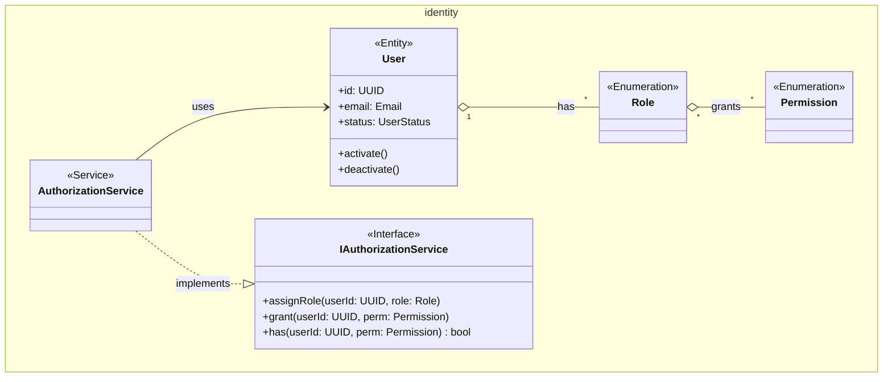
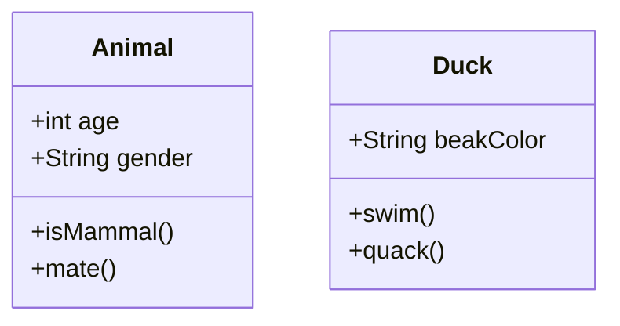
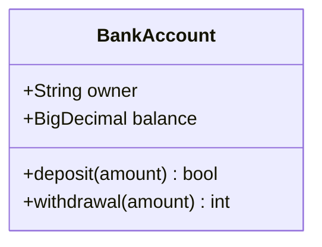
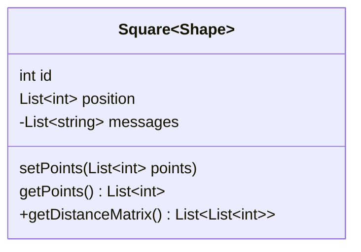
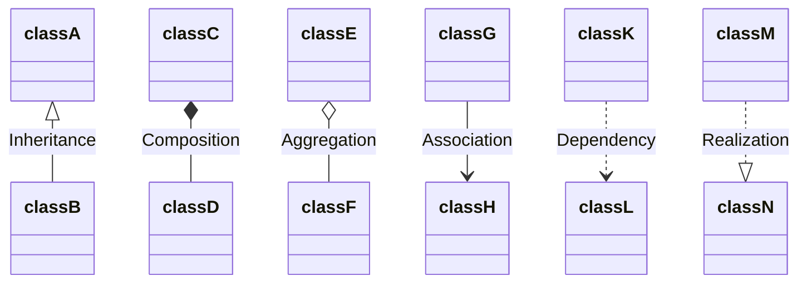
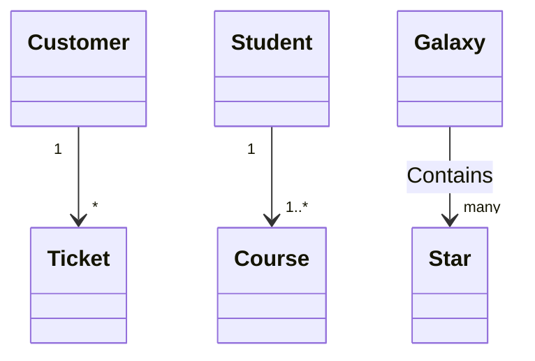
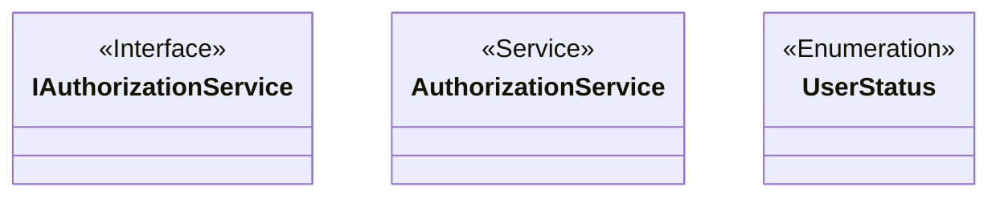
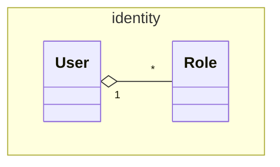
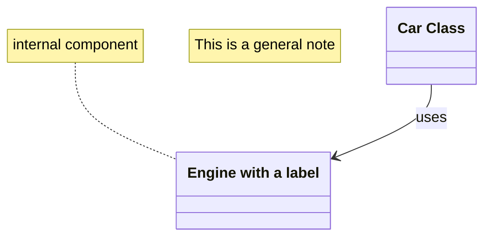

## Overview & Scope

- Mục tiêu: Chuẩn hoá tài liệu Class Diagram cho toàn hệ thống, dùng Mermaid `classDiagram` để mô tả cấu trúc lớp, thuộc tính, operations, và quan hệ.
- Phạm vi: Áp dụng cho từng module (Admin, Instructor, Student, AI, ...); mỗi module có thể dùng một file riêng dựa trên template này.
- Tài liệu tham chiếu Mermaid: [Mermaid Class Diagram](https://mermaid.js.org/syntax/classDiagram.html)

## Notation & Conventions

- Ngôn ngữ: tiếng Việt, giữ English cho technical terms/identifiers.
- Naming:
  - Tên lớp PascalCase (ví dụ: `UserAccount`), thuộc tính camelCase (ví dụ: `createdAt`), enum PascalCase.
  - Interface tiền tố `I` (ví dụ: `IUserRepository`).
- Visibility: `+` public, `-` private, `#` protected, `~` internal/package.
- Stereotypes/Annotations: `<<Interface>>`, `<<Service>>`, `<<Entity>>`, `<<ValueObject>>`, `<<Enumeration>>`, `<<Abstract>>`.
- Multiplicity: "1", "0..1", "1..*", "*", "0..n", "1..n" (chỉ rõ trên quan hệ).
- Hướng sơ đồ: mặc định `direction TB` (Top→Bottom). Tách `namespace` khi sơ đồ lớn.
- Tuân thủ SOLID: SRP/OCP/LSP/ISP/DIP; phụ thuộc hạ tầng qua interface (DIP).

## Module Context

- Mô tả ngắn module, ranh giới, actors chính, các subpackages (nếu có).
- Liên kết UC/SD liên quan: nêu danh sách Use Case IDs và Sequence tương ứng.

## Class Inventory

| Name | Stereotype | Responsibilities | Key Attributes | Key Operations | DependsOn | Traceability (UC/SD) |
|---|---|---|---|---|---|---|
| ExampleClass | <<Entity>> | Vai trò chính | id: UUID; status: Status | activate(); deactivate() | IRepo; DomainService | UCA01; SDA_UCA01_1 |

## Diagrams

### Overview Diagram

### Subpackage/Namespace Diagrams (tùy chọn)

- Khi sơ đồ lớn, tách thêm các sơ đồ con theo `namespace`.

## Detailed Class Specs

### [ClassName]

- Intent: Mục đích tồn tại của lớp trong domain.
- Responsibilities: Trách nhiệm chính, quy tắc nghiệp vụ quản lý.
- Attributes:
  - Tên: Kiểu — mô tả ngắn; ràng buộc/invariant (nếu có).
- Operations (public API):
  - Tên(tham số): Kiểu trả về — điều kiện trước/sau, lỗi có thể phát sinh.
- Relations:
  - Quan hệ với lớp khác: loại (inheritance/composition/aggregation/association), multiplicity, chiều.
- Invariants: Điều kiện luôn đúng (bất biến) cần duy trì.
- Design Notes (SOLID): Lập luận thiết kế, thay thế đã cân nhắc, trade-offs.
- Exceptions/Errors: Trường hợp ngoại lệ và chiến lược xử lý.

## Traceability Matrix

| UC ID | SD ID | Classes Involved | Notes |
|---|---|---|---|
| UCA01 | SDA_UCA01_1 | User, AuthorizationService, IAuthorizationService | Tạo user, gán role |
|...|...|...|...|

## Assumptions & Decisions

- Giả định chính (data types, lifecycle, external deps...).
- Quyết định thiết kế (tách interface, đặt namespace, đơn vị chịu trách nhiệm...).

## Open Issues

- Câu hỏi/khuyết thiếu cần làm rõ từ UC/SD/Stakeholders.
- Hạng mục cần xác thực (multiplicity, ràng buộc domain...).

## Mermaid Class Diagram Cheatsheet

- **Mục đích**: Tóm tắt cú pháp chính của Mermaid `classDiagram` để mô hình hoá lớp theo UML (attributes, operations, relationships, multiplicity, annotations), phục vụ triển khai code tuân thủ SOLID.
- **Ngôn ngữ**: Ghi chú tiếng Việt; giữ English cho technical terms/identifiers.

### Khởi tạo sơ đồ và lớp cơ bản

### Định nghĩa class, attributes, operations

- **Dạng dòng**: `ClassName : +Type field` hoặc `ClassName : +method(params) ReturnType`
- **Dạng block**:

### Visibility và classifiers

- **Visibility**: `+` public, `-` private, `#` protected, `~` package/internal
- **Classifiers**: method `*` abstract, `$` static; field `$` static

### Generics (ký hiệu ~T~)

### Relationships (quan hệ giữa lớp)

- `<|--` Inheritance, `..|>` Realization, `*--` Composition, `o--` Aggregation, `-->` Association, `..>` Dependency, `--` Solid link, `..` Dashed link

### Multiplicity (cardinality)

### Annotations (stereotypes)

### Namespace và direction

### Ghi chú và nhãn

### Liên kết tương tác (optional)

- Có thể gắn `link`/`click` để mở URL hoặc gọi callback khi render trong HTML (phụ thuộc `securityLevel`). Tham khảo `mermaid.initialize` cấu hình.

### Quy ước bổ sung cho dự án

- **Naming**: PascalCase cho class/enum, camelCase cho attribute/operation, tiền tố `I` cho interface (ví dụ: `IUserRepository`).
- **DIP/SOLID**: Service phụ thuộc qua interface (`..>` Dependency), `..|>` thể hiện Realization `Service ..|> Interface`.
- **Traceability**: Chèn ghi chú `UC/SD IDs` gần các lớp chính khi cần.

