# ERD - Tổng Hợp Toàn Hệ Thống

## Overview & Scope

- **Mục tiêu**: Tài liệu ERD tổng hợp tất cả entities và relationships từ 11 modules (UC1-UC6, UC-A1 đến UC-A5) trong hệ thống quản lý công thức nấu ăn.
- **Phạm vi**: Tổng hợp toàn bộ database schema với 11 modules bao gồm authentication, recipe management, social features, pantry, meal planning, và admin functions.
- **Tài liệu tham chiếu**: Tổng hợp từ 11 file ERD module riêng lẻ.

## Notation & Conventions

- **Ngôn ngữ**: Tiếng Việt, giữ English cho technical terms/identifiers
- **Naming**:
  - Tên entity PascalCase trong ERD, snake_case cho database tables
  - Thuộc tính camelCase trong ERD, snake_case trong database
  - Primary key: `id` (UUID)
  - Foreign key: `{referenced_entity}_id`
- **Data Types**: 
  - `UUID` cho primary keys
  - `String`, `Integer`, `Decimal`, `DateTime`, `Boolean`, `JSON`
- **Cardinality**: "1", "0..1", "1..*", "*", "0..n", "1..n"
- **Shared Entities**: Các entity được dùng chung giữa nhiều modules được merge và đánh dấuත

## Entity Inventory

### Module UC1: Xác Thực và Quản Lý Hồ Sơ

| Entity Name | Description | Key Attributes | Used By |
|---|---|---|---|
| USER | Thông tin người dùng, authentication | id, email, phone, password_hash, display_name, status | UC1, UC2, UC3, UC4, UC5, UC6, UC-A1 |
| USER_SESSION | Phiên đăng nhập | id, user_id, token, expires_at, is_active | UC1, UC-A1 |
| VERIFICATION_TOKEN | Token xác thực tài khoản | id, user_id, token, type, expires_at | UC1 |
| PASSWORD_RESET_TOKEN | Token đặt lại mật khẩu | id, user_id, token, expires_at | UC1 |

### Module UC2: Tìm Kiếm và Xem Công Thức

| Entity Name | Description | Key Attributes | Used By |
|---|---|---|---|
| RECIPE | Công thức nấu ăn | id, name, description, prep_time, cook_time, difficulty, status, created_by | UC2, UC3, UC4, UC6, UC-A2 |
| INGREDIENT | Nguyên liệu của công thức | id, recipe_id, name, amount, unit | UC2, UC3, UC6 |
| RECIPE_STEP | Các bước thực hiện | id, recipe_id, step_number, instruction, duration | UC2, UC3 |
| RATING | Đánh giá sao | id, recipe_id, user_id, score | UC2, UC4 |
| COMMENT | Bình luận | id, recipe_id, user_id, content | UC2, UC4 |
| VIEW_HISTORY | Lịch sử xem | id, user_id, recipe_id, viewed_at | UC2 |

### Module UC3: Quản Lý Công Thức Người Dùng

| Entity Name | Description | Key Attributes | Used By |
|---|---|---|---|
| RECIPE_MEDIA | Media files (ảnh/video) | id, recipe_id, step_id, file_url, file_type | UC3 |

### Module UC4: Quản Lý Yêu Thích và Đánh Giá

| Entity Name | Description | Key Attributes | Used By |
|---|---|---|---|
| FAVORITE | Yêu thích công thức | id, user_id, recipe_id, added_at | UC4 |
| SHARE_RECORD | Lịch sử chia sẻ | id, recipe_id, user_id, channel, shared_at | UC4 |
| SHARE_CHANNEL | Kênh chia sẻ | name, display_name, is_active | UC4 |

### Module UC5: Quản Lý Tủ Lạnh Ảo

| Entity Name | Description | Key Attributes | Used By |
|---|---|---|---|
| PANTRY_ITEM | Nguyên liệu trong tủ | id, user_id, catalog_id, name, quantity, unit, expiry_date | UC5 |
| INGREDIENT_CATALOG | Danh mục nguyên liệu chuẩn hóa | id, name, normalized_name, category, common_units | UC5 |
| PANTRY_AUDIT | Lịch sử thay đổi tủ | id, user_id, item_id, action, before_data, after_data | UC5 |
| PANTRY_STATUS | Trạng thái nguyên liệu (enum) | status, description | UC5 |

### Module UC6: Quản Lý Kế Hoạch Bữa Ăn

| Entity Name | Description | Key Attributes | Used By |
|---|---|---|---|
| MEAL_PLAN | Kế hoạch bữa ăn | id, user_id, name, start_date, end_date, cycle | UC6 |
| MEAL_PLAN_ITEM | Món ăn trong kế hoạch | id, meal_plan_id, recipe_id, date, meal_type, servings | UC6 |
| SHOPPING_LIST | Danh sách mua sắm | id, user_id, meal_plan_id, name, minus_pantry, status | UC6 |
| SHOPPING_LIST_ITEM | Mục trong danh sách | id, shopping_list_id, ingredient_name, quantity, unit | UC6 |
| MEAL_PLAN_TEMPLATE | Template kế hoạch | id, name, description, is_public, created_by | UC6 |
| MEAL_PLAN_TEMPLATE_ITEM | Món trong template | id, template_id, recipe_id, meal_type, servings, day_offset | UC6 |
| UNIT_CONVERSION_RULE | Quy tắc quy đổi đơn vị | id, from_unit, to_unit, factor, ingredient | UC6 |
| MEAL_PLAN_CYCLE | Chu kỳ (enum) | cycle, description | UC6 |
| MEAL_TYPE | Loại bữa ăn (enum) | type, description, display_order | UC6 |
| SHOPPING_LIST_STATUS | Trạng thái (enum) | status, description | UC6 |

### Module UC-A1: Quản Lý Người Dùng (Admin)

| Entity Name | Description | Key Attributes | Used By |
|---|---|---|---|
| AUDIT_LOG | Nhật ký audit hệ thống | id, action, actor_id, target_id, timestamp, details | UC-A1, UC-A4, UC-A5 |
| USER_ACTIVITY | Hoạt động người dùng | id, user_id, activity_type, entity_type, entity_id | UC-A1 |

### Module UC-A2: Quản Lý Công Thức Hệ Thống (Admin)

| Entity Name | Description | Key Attributes | Used By |
|---|---|---|---|
| RECIPE_MODERATION | Thông tin kiểm duyệt | id, recipe_id, moderator_id, action, reason, timestamp | UC-A2 |

### Module UC-A3: Quản Lý Danh Mục và Nguyên Liệu (Admin)

| Entity Name | Description | Key Attributes | Used By |
|---|---|---|---|
| CATEGORY | Danh mục món ăn | id, name, description | UC-A3 |
| INGREDIENT_CATALOG_ADMIN | Nguyên liệu chuẩn hóa (admin view) | id, name, normalized_name, unit, category | UC-A3 |
| INGREDIENT_ALIAS | Tên đồng nghĩa | id, ingredient_id, alias_name | UC-A3 |

### Module UC-A4: Quản Lý Tài Khoản Admin

| Entity Name | Description | Key Attributes | Used By |
|---|---|---|---|
| ADMIN_ACCOUNT | Tài khoản Admin | id, email, display_name, status, activation_token | UC-A4 |
| ROLE | Vai trò và quyền hạn | id, name, permissions | UC-A4 |
| ADMIN_ROLE | Phân quyền Admin-Role | id, admin_id, role_id, assigned_by, assigned_at | UC-A4 |

### Module UC-A5: Quản Lý Báo Cáo và Thống Kê (Admin)

| Entity Name | Description | Key Attributes | Used By |
|---|---|---|---|
| DASHBOARD_WIDGET | Widget KPI/biểu đồ | id, user_id, type, title, config, position_x, position_y | UC-A5 |
| REPORT_SCHEDULE | Lịch trình báo cáo | id, created_by, name, frequency, recipients, next_run_at | UC-A5 |
| KPI_METRIC | Cache giá trị KPI | id, widget_id, name, value, trend, expires_at | UC-A5 |
| CHART_DATA | Cache dữ liệu biểu đồ | id, widget_id, chart_type, labels, datasets, expires_at | UC-A5 |
| REPORT_EXPORT | File export báo cáo | id, schedule_id, format, file_url, status, expires_at | UC-A5 |
| DASHBOARD_LAYOUT | Layout dashboard | id, user_id, name, widget_positions, is_default | UC-A5 |
| WIDGET_THRESHOLD | Ngưỡng cảnh báo | id, widget_id, threshold_type, operator, value | UC-A5 |

## Entity Summary Statistics

- **Tổng số entities**: 50+
- **Shared entities** (dùng nhiều modules):
  - `USER`: UC1, UC2, UC3, UC4, UC5, UC6, UC-A1
  - `RECIPE`: UC2, UC3, UC4, UC6, UC-A2
  - `RATING/COMMENT`: UC2, UC4
  - `INGREDIENT` variations: UC2, UC5, UC-A3
  - `AUDIT_LOG`: UC-A1, UC-A4, UC-A5

## Consolidated Relationships Matrix

### Core User & Authentication Relationships

| From | To | Type | Cardinality | Description |
|---|---|---|---|---|
| USER | USER_SESSION | One-to-Many | 1:N | User có nhiều sessions |
| USER | VERIFICATION_TOKEN | One-to-Many | 1:N | User có nhiều verification tokens |
| USER | PASSWORD_RESET_TOKEN | One-to-Many | 1:N | User có nhiều reset tokens |
| USER | USER_ACTIVITY | One-to-Many | 1:N | User có nhiều activities |
| ADMIN_ACCOUNT | ADMIN_ROLE | One-to-Many | 1:N | Admin có nhiều roles |
| ROLE | ADMIN_ROLE | One-to-Many | 1:N | Role được assign cho nhiều admins |

### Recipe & Content Relationships

| From | To | Type | Cardinality | Description |
|---|---|---|---|---|
| USER | RECIPE | One-to-Many | 1:N | User tạo nhiều recipes |
| RECIPE | INGREDIENT | One-to-Many | 1:N | Recipe có nhiều ingredients |
| RECIPE | RECIPE_STEP | One-to-Many | 1:N | Recipe có nhiều steps |
| RECIPE | RECIPE_MEDIA | One-to-Many | 1:N | Recipe có nhiều media files |
| RECIPE | RATING | One-to-Many | 1:N | Recipe nhận nhiều ratings |
| RECIPE | COMMENT | One-to-Many | 1:N | Recipe có nhiều comments |
| RECIPE | FAVORITE | One-to-Many | 1:N | Recipe được nhiều users yêu thích |
| RECIPE | SHARE_RECORD | One-to-Many | 1:N | Recipe được chia sẻ nhiều lần |
| RECIPE | VIEW_HISTORY | One-to-Many | 1:N | Recipe được xem nhiều lần |
| RECIPE | RECIPE_MODERATION | One-to-One | 1:1 | Recipe có 1 moderation record |
| RECIPE | MEAL_PLAN_ITEM | One-to-Many | 1:N | Recipe được dùng trong nhiều meal plans |
| CATEGORY | RECIPE | One-to-Many | 1:N | Category chứa nhiều recipes |

### Social & Engagement Relationships

| From | To | Type | Cardinality | Description |
|---|---|---|---|---|
| USER | RATING | One-to-Many | 1:N | User đánh giá nhiều recipes |
| USER | COMMENT | One-to-Many | 1:N | User bình luận nhiều recipes |
| USER | FAVORITE | One-to-Many | 1:N | User yêu thích nhiều recipes |
| USER | SHARE_RECORD | One-to-Many | 1:N | User chia sẻ nhiều recipes |
| SHARE_CHANNEL | SHARE_RECORD | One-to-Many | 1:N | Channel được dùng trong nhiều shares |

### Pantry & Meal Planning Relationships

| From | To | Type | Cardinality | Description |
|---|---|---|---|---|
| USER | PANTRY_ITEM | One-to-Many | 1:N | User có nhiều pantry items |
| INGREDIENT_CATALOG | PANTRY_ITEM | One-to-Many | 1:N | Catalog được reference bởi nhiều pantry items |
| USER | MEAL_PLAN | One-to-Many | 1:N | User có nhiều meal plans |
| MEAL_PLAN | MEAL_PLAN_ITEM | One-to-Many | 1:N | Meal plan chứa nhiều items |
| MEAL_PLAN | SHOPPING_LIST | One-to-Many | 1:N | Meal plan tạo nhiều shopping lists |
| SHOPPING_LIST | SHOPPING_LIST_ITEM | One-to-Many | 1:N | Shopping list chứa nhiều items |
| USER | MEAL_PLAN_TEMPLATE | One-to-Many | 1:N | User tạo nhiều templates |
| MEAL_PLAN_TEMPLATE | MEAL_PLAN_TEMPLATE_ITEM | One-to-Many | 1:N | Template chứa nhiều items |

### Admin & Analytics Relationships

| From | To | Type | Cardinality | Description |
|---|---|---|---|---|
| USER | DASHBOARD_WIDGET | One-to-Many | 1:N | User có nhiều widgets |
| DASHBOARD_WIDGET | KPI_METRIC | One-to-Many | 1:N | Widget có nhiều KPI metrics |
| DASHBOARD_WIDGET | CHART_DATA | One-to-Many | 1:N | Widget có nhiều chart data |
| DASHBOARD_WIDGET | WIDGET_THRESHOLD | One-to-Many | 1:N | Widget có nhiều thresholds |
| USER | REPORT_SCHEDULE | One-to-Many | 1:N | User tạo nhiều schedules |
| REPORT_SCHEDULE | REPORT_EXPORT | One-to-Many | 1:N | Schedule tạo nhiều exports |
| USER | DASHBOARD_LAYOUT | One-to-Many | 1:N | User có nhiều layouts |
| USER | AUDIT_LOG (actor) | One-to-Many | 1:N | User thực hiện nhiều actions |
| USER | AUDIT_LOG (target) | One-to-Many | 1:N | User là target của nhiều actions |

## Consolidated ERD Diagram

```mermaid
erDiagram
    %% Core User & Authentication
    USER {
        UUID id PK
        String email UK
        String phone UK
        String password_hash
        String display_name
        String avatar_url
        String status "PENDING, VERIFIED, ACTIVE, LOCKED"
        DateTime created_at
        DateTime updated_at
        DateTime last_login_at
    }
    
    USER_SESSION {
        UUID id PK
        UUID user_id FK
        String token UK
        DateTime expires_at
        Boolean is_active
    }
    
    VERIFICATION_TOKEN {
        UUID id PK
        UUID user_id FK
        String token UK
        String type
        DateTime expires_at
    }
    
    PASSWORD_RESET_TOKEN {
        UUID id PK
        UUID user_id FK
        String token UK
        DateTime expires_at
    }
    
    %% Recipe & Content
    RECIPE {
        UUID id PK
        String name
        String description
        Integer prep_time
        Integer cook_time
        String difficulty
        Integer servings
        String status
        UUID created_by FK
        DateTime created_at
        DateTime updated_at
        Integer views
        Boolean is_deleted
    }
    
    INGREDIENT {
        UUID id PK
        UUID recipe_id FK
        String name
        Decimal amount
        String unit
        String notes
        Integer order_index
    }
    
    RECIPE_STEP {
        UUID id PK
        UUID recipe_id FK
        Integer step_number
        String instruction
        Integer duration
        JSON media_urls
    }
    
    RECIPE_MEDIA {
        UUID id PK
        UUID recipe_id FK
        UUID step_id FK
        String file_url
        String file_type
        Integer file_size
    }
    
    CATEGORY {
        UUID id PK
        String name UK
        String description
    }
    
    %% Social & Engagement
    RATING {
        UUID id PK
        UUID recipe_id FK
        UUID user_id FK
        Integer score
        String comment
        DateTime created_at
    }
    
    COMMENT {
        UUID id PK
        UUID recipe_id FK
        UUID user_id FK
        String content
        JSON photos
        JSON tags
        DateTime created_at
        DateTime updated_at
        Boolean is_deleted
    }
    
    FAVORITE {
        UUID id PK
        UUID user_id FK
        UUID recipe_id FK
        DateTime added_at
    }
    
    SHARE_RECORD {
        UUID id PK
        UUID recipe_id FK
        UUID user_id FK
        String channel
        DateTime shared_at
    }
    
    SHARE_CHANNEL {
        String name PK
        String display_name
        Boolean is_active
    }
    
    VIEW_HISTORY {
        UUID id PK
        UUID user_id FK
        UUID recipe_id FK
        DateTime viewed_at
    }
    
    %% Pantry Management
    PANTRY_ITEM {
        UUID id PK
        UUID user_id FK
        UUID catalog_id FK
        String name
        Decimal quantity
        String unit
        DateTime expiry_date
        String status
    }
    
    INGREDIENT_CATALOG {
        UUID id PK
        String name UK
        String normalized_name UK
        String category
        JSON common_units
    }
    
    PANTRY_AUDIT {
        UUID id PK
        UUID user_id FK
        UUID item_id FK
        String action
        JSON before_data
        JSON after_data
        DateTime timestamp
    }
    
    %% Meal Planning
    MEAL_PLAN {
        UUID id PK
        UUID user_id FK
        String name
        DateTime start_date
        DateTime end_date
        String cycle
        Integer default_servings
    }
    
    MEAL_PLAN_ITEM {
        UUID id PK
        UUID meal_plan_id FK
        UUID recipe_id FK
        DateTime date
        String meal_type
        Integer servings
    }
    
    SHOPPING_LIST {
        UUID id PK
        UUID user_id FK
        UUID meal_plan_id FK
        String name
        Boolean minus_pantry
        String status
    }
    
    SHOPPING_LIST_ITEM {
        UUID id PK
        UUID shopping_list_id FK
        String ingredient_name
        Decimal quantity
        String unit
        String category
        Boolean purchased
    }
    
    MEAL_PLAN_TEMPLATE {
        UUID id PK
        UUID created_by FK
        String name
        String description
        Boolean is_public
    }
    
    MEAL_PLAN_TEMPLATE_ITEM {
        UUID id PK
        UUID template_id FK
        UUID recipe_id FK
        String meal_type
        Integer servings
        Integer day_offset
    }
    
    UNIT_CONVERSION_RULE {
        UUID id PK
        String from_unit
        String to_unit
        Decimal factor
        String ingredient
    }
    
    %% Admin Management
    ADMIN_ACCOUNT {
        UUID id PK
        String email UK
        String display_name
        String status
        String activation_token
    }
    
    ROLE {
        UUID id PK
        String name UK
        JSON permissions
    }
    
    ADMIN_ROLE {
        UUID id PK
        UUID admin_id FK
        UUID role_id FK
        UUID assigned_by FK
        DateTime assigned_at
    }
    
    RECIPE_MODERATION {
        UUID id PK
        UUID recipe_id FK
        UUID moderator_id FK
        String action
        String reason
        DateTime timestamp
    }
    
    INGREDIENT_ALIAS {
        UUID id PK
        UUID ingredient_id FK
        String alias_name
    }
    
    %% Analytics & Reporting
    DASHBOARD_WIDGET {
        UUID id PK
        UUID user_id FK
        String type
        String title
        JSON config
        Integer position_x
        Integer position_y
    }
    
    KPI_METRIC {
        UUID id PK
        UUID widget_id FK
        String name
        Decimal value
        String trend
        DateTime expires_at
    }
    
    CHART_DATA {
        UUID id PK
        UUID widget_id FK
        String chart_type
        JSON labels
        JSON datasets
        DateTime expires_at
    }
    
    REPORT_SCHEDULE {
        UUID id PK
        UUID created_by FK
        String name
        String frequency
        JSON recipients
        DateTime next_run_at
    }
    
    REPORT_EXPORT {
        UUID id PK
        UUID schedule_id FK
        String format
        String file_url
        String status
        DateTime expires_at
    }
    
    DASHBOARD_LAYOUT {
        UUID id PK
        UUID user_id FK
        String name
        JSON widget_positions
        Boolean is_default
    }
    
    WIDGET_THRESHOLD {
        UUID id PK
        UUID widget_id FK
        String threshold_type
        String operator
        Decimal value
    }
    
    %% Audit & Activity
    AUDIT_LOG {
        UUID id PK
        String action
        UUID actor_id FK
        UUID target_id FK
        JSON details
        DateTime timestamp
    }
    
    USER_ACTIVITY {
        UUID id PK
        UUID user_id FK
        String activity_type
        String entity_type
        UUID entity_id
        JSON metadata
        DateTime created_at
    }
    
    %% Relationships - User & Authentication
    USER ||--o{ USER_SESSION : "has"
    USER ||--o{ VERIFICATION_TOKEN : "creates"
    USER ||--o{ PASSWORD_RESET_TOKEN : "requests"
    USER ||--o{ USER_ACTIVITY : "performs"
    
    %% Relationships - Recipe & Content
    USER ||--o{ RECIPE : "creates"
    RECIPE ||--o{ INGREDIENT : "contains"
    RECIPE ||--o{ RECIPE_STEP : "has"
    RECIPE ||--o{ RECIPE_MEDIA : "has_media"
    RECIPE_STEP ||--o{ RECIPE_MEDIA : "has_step_media"
    CATEGORY ||--o{ RECIPE : "categorizes"
    
    %% Relationships - Social & Engagement
    USER ||--o{ RATING : "gives"
    RECIPE ||--o{ RATING : "receives"
    USER ||--o{ COMMENT : "writes"
    RECIPE ||--o{ COMMENT : "has"
    USER ||--o{ FAVORITE : "creates"
    RECIPE ||--o{ FAVORITE : "favorited_by"
    USER ||--o{ SHARE_RECORD : "shares"
    RECIPE ||--o{ SHARE_RECORD : "shared_as"
    SHARE_CHANNEL ||--o{ SHARE_RECORD : "used_in"
    USER ||--o{ VIEW_HISTORY : "generates"
    RECIPE ||--o{ VIEW_HISTORY : "tracked_by"
    
    %% Relationships - Pantry
    USER ||--o{ PANTRY_ITEM : "owns"
    INGREDIENT_CATALOG ||--o{ PANTRY_ITEM : "standardizes"
    PANTRY_ITEM ||--o{ PANTRY_AUDIT : "has_changes"
    
    %% Relationships - Meal Planning
    USER ||--o{ MEAL_PLAN : "owns"
    MEAL_PLAN ||--o{ MEAL_PLAN_ITEM : "contains"
    MEAL_PLAN ||--o{ SHOPPING_LIST : "generates"
    RECIPE ||--o{ MEAL_PLAN_ITEM : "references"
    SHOPPING_LIST ||--o{ SHOPPING_LIST_ITEM : "contains"
    USER ||--o{ MEAL_PLAN_TEMPLATE : "creates"
    MEAL_PLAN_TEMPLATE ||--o{ MEAL_PLAN_TEMPLATE_ITEM : "contains"
    RECIPE ||--o{ MEAL_PLAN_TEMPLATE_ITEM : "references"
    
    %% Relationships - Admin
    ADMIN_ACCOUNT ||--o{ ADMIN_ROLE : "has"
    ROLE ||--o{ ADMIN_ROLE : "assigned_to"
    ADMIN_ACCOUNT ||--o{ ADMIN_ROLE : "assigned_by"
    RECIPE ||--|| RECIPE_MODERATION : "moderated_by"
    INGREDIENT_CATALOG ||--o{ INGREDIENT_ALIAS : "has"
    
    %% Relationships - Analytics
    USER ||--o{ DASHBOARD_WIDGET : "owns"
    DASHBOARD_WIDGET ||--o{ KPI_METRIC : "contains"
    DASHBOARD_WIDGET ||--o{ CHART_DATA : "displays"
    DASHBOARD_WIDGET ||--o{ WIDGET_THRESHOLD : "has"
    USER ||--o{ REPORT_SCHEDULE : "creates"
    REPORT_SCHEDULE ||--o{ REPORT_EXPORT : "generates"
    USER ||--o{ DASHBOARD_LAYOUT : "has"
    
    %% Relationships - Audit
    USER ||--o{ AUDIT_LOG : "actor"
    USER ||--o{ AUDIT_LOG : "target"
```



## Cross-Module Dependencies

### Shared Entities Map

#### 1. USER Entity
- **Defined in**: UC1
- **Used by**: 
  - UC2: created_by in RECIPE, user_id in RATING/COMMENT/VIEW_HISTORY
  - UC3: created_by in RECIPE
  - UC4: user_id in FAVORITE/SHARE_RECORD
  - UC5: user_id in PANTRY_ITEM
  - UC6: user_id in MEAL_PLAN/SHOPPING_LIST
  - UC-A1: target_id in AUDIT_LOG, user_id in USER_ACTIVITY
- **Key Relationships**: 
  - One-to-Many với RECIPE, RATING, COMMENT, FAVORITE, PANTRY_ITEM, MEAL_PLAN

#### 2. RECIPE Entity
- **Defined in**: UC2
- **Extended by**: UC3 (RECIPE_MEDIA), UC-A2 (RECIPE_MODERATION)
- **Used by**:
  - UC4: recipe_id in FAVORITE/RATING/COMMENT/SHARE_RECORD
  - UC6: recipe_id in MEAL_PLAN_ITEM
  - UC-A2: recipe_id in RECIPE_MODERATION
- **Key Relationships**:
  - One-to-Many với INGREDIENT, RECIPE_STEP, RATING, COMMENT, FAVORITE
  - One-to-One với RECIPE_MODERATION

#### 3. RATING/COMMENT Entities
- **Defined in**: UC2
- **Also used in**: UC4 (social features)
- **Note**: Hai module có thể có cách triển khai khác nhau, cần thống nhất schema

#### 4. INGREDIENT Variations
- **UC2**: INGREDIENT (recipe-level, recipe_id FK)
- **UC5**: INGREDIENT_CATALOG (master catalog)
- **UC-A3**: INGREDIENT_CATALOG_ADMIN (admin view), INGREDIENT_ALIAS
- **Note**: Cần hợp nhất thành một master catalog system

#### 5. AUDIT_LOG Entity
- **Defined in**: UC-A1
- **Used by**: UC-A4, UC-A5
- **Purpose**: Centralized audit trail cho tất cả admin actions

### Module Dependency Graph

```
UC1 (User/Auth)
  ├──> UC2, UC3, UC4, UC5, UC6 (tất cả cần USER)
  └──> UC-A1 (admin management)

UC2 (Recipe Search/View)
  ├──> UC3 (extends RECIPE với media)
  ├──> UC4 (social features trên RECIPE)
  └──> UC6 (references RECIPE trong meal plans)

UC3 (Recipe Management)
  └──> UC-A2 (admin moderation)

UC4 (Social/Engagement)
  └──> UC2 (depends on RECIPE)

UC5 (Pantry)
  └──> UC6 (có thể integrate với shopping list)

UC6 (Meal Planning)
  └──> UC2/UC3 (references RECIPE)

UC-A1 (User Management)
  └──> UC1 (extends USER)

UC-A2 (Recipe Admin)
  └──> UC2/UC3 (moderates RECIPE)

UC-A3 (Category/Ingredient Admin)
  └──> UC2, UC5 (manages master data)

UC-A4 (Admin Account Management)
  └──> UC-A1 (uses AUDIT_LOG)

UC-A5 (Analytics/Reporting)
  └──> Tất cả modules (aggregates data)
```

## Entity Summary Table

| Module | Entity Count | Key Entities | Shared? |
|---|---|---|---|
| UC1 | 4 | USER, USER_SESSION, VERIFICATION_TOKEN, PASSWORD_RESET_TOKEN | USER shared |
| UC2 | 6 | RECIPE, INGREDIENT, RECIPE_STEP, RATING, COMMENT, VIEW_HISTORY | RECIPE, RATING, COMMENT shared |
| UC3 | 1 | RECIPE_MEDIA | Extends RECIPE |
| UC4 | 3 | FAVORITE, SHARE_RECORD, SHARE_CHANNEL | Uses RECIPE |
| UC5 | 4 | PANTRY_ITEM, INGREDIENT_CATALOG, PANTRY_AUDIT, PANTRY_STATUS | - |
| UC6 | 10 | MEAL_PLAN, MEAL_PLAN_ITEM, SHOPPING_LIST, ... | Uses RECIPE |
| UC-A1 | 2 | AUDIT_LOG, USER_ACTIVITY | AUDIT_LOG shared |
| UC-A2 | 1 | RECIPE_MODERATION | Uses RECIPE |
| UC-A3 | 3 | CATEGORY, INGREDIENT_CATALOG_ADMIN, INGREDIENT_ALIAS | - |
| UC-A4 | 3 | ADMIN_ACCOUNT, ROLE, ADMIN_ROLE | Uses AUDIT_LOG |
| UC-A5 | 7 | DASHBOARD_WIDGET, REPORT_SCHEDULE, ... | Uses AUDIT_LOG |
| **TOTAL** | **44+** | | **6 shared entities** |

## Design Notes & Considerations

### Schema Consolidation Recommendations

1. **USER Entity**: 
   - Cần mở rộng để support cả user và admin features
   - Consider role-based approach thay vì separate ADMIN_ACCOUNT

2. **RECIPE Entity**:
   - Core entity, được extend ở nhiều modules
   - Ensure consistency trong status values

3. **INGREDIENT Catalog**:
   - Cần hợp nhất INGREDIENT từ UC2, INGREDIENT_CATALOG từ UC5, và admin version
   - Nên có master catalog với aliases

4. **RATING/COMMENT**:
   - Cần thống nhất schema giữent UC2 và UC4
   - Consider làm thành một entity set duy nhất

5. **AUDIT_LOG**:
   - Đã được thiết kế tốt để share across modules
   - Cần ensure consistent action types

### Performance Considerations

- **Indexes**: Các foreign keys cần được index
- **Caching**: Consider cache cho frequently accessed entities (USER, RECIPE)
- **Partitioning**: Consider partition cho audit logs và activity tables
- **Soft Deletes**: Một số tables sử dụng soft delete (RECIPE, COMMENT)

### Data Integrity

- **Cascade Rules**: 
  - RECIPE deletion → cascade INGREDIENT, RECIPE_STEP
  - USER deletion → consider RESTRICT (not CASCADE) để preserve data
- **Constraints**: 
  - Unique constraints trên (user_id, recipe_id) cho FAVORITE, RATING
  - Check constraints cho status enums

---

*Tài liệu này tổng hợp từ 11 ERD modules riêng lẻ. Tham chiếu các file ERD-UC*.md và ERD-UC-A*.md để biết chi tiết theo từng module.*

