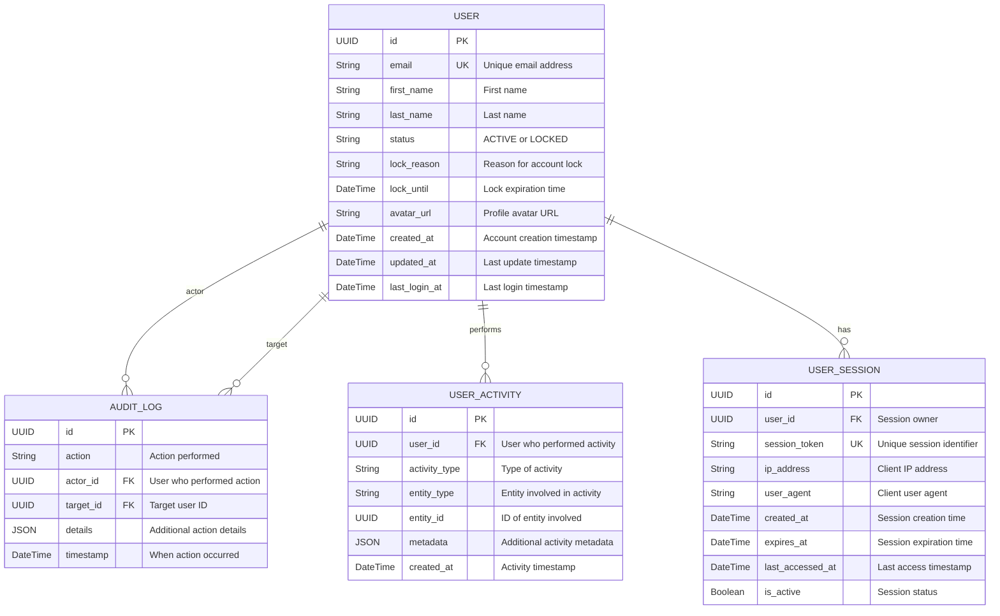

# ERD - Module UC-A1: Quản Lý Người Dùng

## Overview & Scope

- **Mục tiêu**: Chuẩn hoá tài liệu ERD cho module UC-A1 (Quản Lý Người Dùng), dùng Mermaid `erDiagram` để mô tả cấu trúc database, entities, attributes, và relationships.
- **Phạm vi**: Module UC-A1 bao gồm 4 Use Cases: xem danh sách người dùng, xem chi tiết người dùng, vô hiệu hóa tài khoản, kích hoạt lại tài khoản người dùng.
- **Tài liệu tham chiếu Mermaid**: [Mermaid ER Diagram](https://mermaid.js.org/syntax/entityRelationshipDiagram.html)

## Notation & Conventions

- **Ngôn ngữ**: tiếng Việt, giữ English cho technical terms/identifiers.
- **Naming**:
  - Tên entity PascalCase trong ERD, snake_case cho database tables (ví dụ: `USER` → `users`)
  - Thuộc tính camelCase trong ERD, snake_case trong database (ví dụ: `createdAt` → `created_at`)
  - Primary key: `id` (UUID)
  - Foreign key: `{referenced_entity}_id`
- **Data Types**: 
  - `UUID` cho primary keys
  - `String` cho text fields
  - `DateTime` cho timestamps
  - `Boolean` cho flags
  - `JSON` cho complex data
- **Cardinality**: "1", "0..1", "1..*", "*", "0..n", "1..n"
- **Constraints**: NOT NULL, UNIQUE, DEFAULT values
- **Indexes**: Primary Key (PK), Foreign Key (FK), Unique Index (UQ)

## Module Context

- **Mô tả**: Module quản lý người dùng cho phép Admin thực hiện các thao tác quản trị: xem danh sách người dùng với filter/sort/paging, xem chi tiết thông tin người dùng kèm thống kê hoạt động, khóa tài khoản người dùng với lý do và thời hạn, mở khóa tài khoản người dùng.
- **Actors chính**: Admin (quản trị viên)
- **Database layers**: 
  - Core entities: `users`, `audit_logs`
  - Supporting data: `user_activities`, `user_sessions`
  - Lookup/enum tables: Embedded trong core entities
- **Liên kết UC/SD liên quan**: 
  - UC: UCA01-1 (Xem danh sách), UCA01-2 (Xem chi tiết), UCA01-3 (Vô hiệu hóa), UCA01-4 (Kích hoạt lại)
  - SD: SD-UCA01-1, SD-UCA01-2, SD-UCA01-3, SD-UCA01-4

## Entity Inventory

| Entity Name | Description | Key Attributes | Relationships | Traceability (UC/SD) |
|---|---|---|---|---|
| USER | Quản lý thông tin người dùng và trạng thái tài khoản | id, email, status, lock_reason, lock_until | has USER_ACTIVITIES, creates AUDIT_LOGS | UCA01-1,2,3,4; SD-UCA01-1,2,3,4 |
| AUDIT_LOG | Ghi nhận mọi sự kiện audit trong hệ thống | id, action, actor_id, target_id, timestamp | references USER | UCA01-3,4; SD-UCA01-3,4 |
| USER_ACTIVITY | Lưu trữ hoạt động của người dùng cho thống kê | id, user_id, activity_type, created_at | belongs to USER | UCA01-2; SD-UCA01-2 |
| USER_SESSION | Quản lý sessions của người dùng | id, user_id, session_token, expires_at | belongs to USER | UCA01-3; SD-UCA01-3 |

## Diagrams

### Overview ERD

## Detailed Entity Specifications

### USER

- **Intent**: Entity chính đại diện cho người dùng trong hệ thống, quản lý thông tin cá nhân và trạng thái tài khoản.
- **Responsibilities**: 
  - Lưu trữ thông tin định danh và hồ sơ người dùng
  - Quản lý trạng thái tài khoản (Active/Locked)
  - Theo dõi thời gian khóa và lý do khóa tài khoản
- **Attributes**:
  - `id: UUID` — Primary key, định danh duy nhất; NOT NULL, UNIQUE
  - `email: String` — Email người dùng; NOT NULL, UNIQUE, INDEX
  - `first_name: String` — Tên; NOT NULL
  - `last_name: String` — Họ; NOT NULL  
  - `status: String` — Trạng thái tài khoản (ACTIVE/LOCKED); NOT NULL, DEFAULT 'ACTIVE'
  - `lock_reason: String` — Lý do khóa tài khoản; NULLABLE
  - `lock_until: DateTime` — Thời hạn khóa; NULLABLE
  - `avatar_url: String` — URL ảnh đại diện; NULLABLE
  - `created_at: DateTime` — Thời điểm tạo; NOT NULL, DEFAULT CURRENT_TIMESTAMP
  - `updated_at: DateTime` — Thời điểm cập nhật cuối; NOT NULL, DEFAULT CURRENT_TIMESTAMP ON UPDATE
  - `last_login_at: DateTime` — Lần đăng nhập cuối; NULLABLE
- **Relationships**:
  - One-to-Many với AUDIT_LOG (actor_id): 1 user có thể thực hiện nhiều actions
  - One-to-Many với AUDIT_LOG (target_id): 1 user có thể là target của nhiều actions
  - One-to-Many với USER_ACTIVITY: 1 user có nhiều activities
  - One-to-Many với USER_SESSION: 1 user có nhiều sessions
- **Constraints**: 
  - Email phải tuân thủ format email hợp lệ
  - Status chỉ có thể là 'ACTIVE' hoặc 'LOCKED'
  - Khi status = 'LOCKED', lock_reason phải có giá trị
  - Khi status = 'ACTIVE', lock_reason và lock_until phải NULL
- **Indexes**: 
  - PRIMARY KEY (id)
  - UNIQUE INDEX (email)
  - INDEX (status) — cho filter theo trạng thái
  - INDEX (created_at) — cho sort theo thời gian tạo
- **Design Notes**: 
  - Embed LockInfo (lock_reason, lock_until) vào table thay vì tách riêng để đơn giản hóa queries
  - Dùng String enum cho status thay vì separate lookup table cho performance
  - avatar_url lưu URL thay vì binary data để tối ưu storage

### AUDIT_LOG

- **Intent**: Ghi nhận tất cả các hành động quan trọng của admin đối với user accounts để audit và compliance.
- **Responsibilities**:
  - Lưu trữ chi tiết các actions (lock, unlock, view, etc.)
  - Theo dõi actor (admin) và target (user) của mỗi action
  - Cung cấp audit trail cho compliance
- **Attributes**:
  - `id: UUID` — Primary key; NOT NULL, UNIQUE
  - `action: String` — Loại hành động (USER_LOCK, USER_UNLOCK, USER_VIEW, etc.); NOT NULL
  - `actor_id: UUID` — ID của admin thực hiện; NOT NULL, FK → users.id
  - `target_id: UUID` — ID của user bị impact; NOT NULL, FK → users.id
  - `details: JSON` — Chi tiết bổ sung (reason, notes, etc.); NULLABLE
  - `timestamp: DateTime` — Thời điểm thực hiện; NOT NULL, DEFAULT CURRENT_TIMESTAMP
- **Relationships**:
  - Many-to-One với USER (actor_id): nhiều audit logs từ 1 admin
  - Many-to-One với USER (target_id): nhiều audit logs cho 1 user
- **Constraints**:
  - actor_id và target_id phải reference existing users
  - action phải thuộc danh sách actions được định nghĩa
  - timestamp không được future date
- **Indexes**:
  - PRIMARY KEY (id)
  - INDEX (actor_id) — query by admin
  - INDEX (target_id) — query by target user
  - INDEX (action) — filter by action type
  - INDEX (timestamp) — sort chronologically
- **Design Notes**:
  - JSON details cho flexibility mà không cần schema changes
  - Generic table có thể dùng cho các modules khác
  - Immutable records (insert-only) để đảm bảo audit integrity

### USER_ACTIVITY

- **Intent**: Lưu trữ các hoạt động của người dùng để tạo thống kê và hiển thị recent activities.
- **Responsibilities**:
  - Theo dõi activities như tạo recipe, comment, login, etc.
  - Cung cấp dữ liệu cho UserStatsDTO (total recipes, comments, etc.)
  - Hỗ trợ tính năng "recent activities" trong user detail view
- **Attributes**:
  - `id: UUID` — Primary key; NOT NULL, UNIQUE
  - `user_id: UUID` — User thực hiện activity; NOT NULL, FK → users.id
  - `activity_type: String` — Loại hoạt động (RECIPE_CREATE, COMMENT_POST, etc.); NOT NULL
  - `entity_type: String` — Loại entity liên quan (RECIPE, COMMENT, etc.); NULLABLE
  - `entity_id: UUID` — ID của entity liên quan; NULLABLE
  - `metadata: JSON` — Metadata bổ sung; NULLABLE
  - `created_at: DateTime` — Thời điểm activity; NOT NULL, DEFAULT CURRENT_TIMESTAMP
- **Relationships**:
  - Many-to-One với USER: nhiều activities từ 1 user
- **Constraints**:
  - user_id phải reference existing user
  - Nếu có entity_type thì phải có entity_id
- **Indexes**:
  - PRIMARY KEY (id)
  - INDEX (user_id, created_at) — query user's recent activities
  - INDEX (activity_type) — aggregate by activity type
  - INDEX (created_at) — time-based queries
- **Design Notes**:
  - Generic structure để support nhiều loại activities
  - Metadata JSON cho flexibility
  - Có thể partition by created_at để optimize performance

### USER_SESSION

- **Intent**: Quản lý sessions của người dùng để hỗ trợ tính năng revoke sessions khi khóa tài khoản.
- **Responsibilities**:
  - Lưu trữ thông tin sessions đang active
  - Hỗ trợ session management và security
  - Cho phép revoke tất cả sessions khi khóa user
- **Attributes**:
  - `id: UUID` — Primary key; NOT NULL, UNIQUE
  - `user_id: UUID` — User sở hữu session; NOT NULL, FK → users.id
  - `session_token: String` — Token định danh session; NOT NULL, UNIQUE
  - `ip_address: String` — IP address của client; NULLABLE
  - `user_agent: String` — User agent của client; NULLABLE
  - `created_at: DateTime` — Thời điểm tạo session; NOT NULL, DEFAULT CURRENT_TIMESTAMP
  - `expires_at: DateTime` — Thời điểm hết hạn; NOT NULL
  - `last_accessed_at: DateTime` — Lần truy cập cuối; NULLABLE
  - `is_active: Boolean` — Trạng thái session; NOT NULL, DEFAULT TRUE
- **Relationships**:
  - Many-to-One với USER: nhiều sessions từ 1 user
- **Constraints**:
  - session_token phải unique globally
  - expires_at phải lớn hơn created_at
  - user_id phải reference existing user
- **Indexes**:
  - PRIMARY KEY (id)
  - UNIQUE INDEX (session_token)
  - INDEX (user_id, is_active) — query active sessions by user
  - INDEX (expires_at) — cleanup expired sessions
- **Design Notes**:
  - Support cho multiple concurrent sessions per user
  - Cleanup strategy cho expired sessions
  - Security info (IP, user agent) cho audit purposes

## Database Schema Details

### Tables

| Table Name | Description | Primary Key | Foreign Keys | Indexes |
|---|---|---|---|---|
| users | User information and account status | id | - | email (UQ), status, created_at |
| audit_logs | System audit trail | id | actor_id → users.id, target_id → users.id | actor_id, target_id, action, timestamp |
| user_activities | User activity tracking | id | user_id → users.id | user_id + created_at, activity_type, created_at |
| user_sessions | User session management | id | user_id → users.id | session_token (UQ), user_id + is_active, expires_at |

### Relationships

| From Table | To Table | Type | Cardinality | Description |
|---|---|---|---|---|
| audit_logs | users | Many-to-One | N:1 | Actor relationship - admin performing action |
| audit_logs | users | Many-to-One | N:1 | Target relationship - user being acted upon |
| user_activities | users | Many-to-One | N:1 | User performs multiple activities |
| user_sessions | users | Many-to-One | N:1 | User can have multiple active sessions |

## Traceability Matrix

| UC ID | SD ID | Entities Involved | Notes |
|---|---|---|---|
| UCA01-1 | SD-UCA01-1 | USER | Xem danh sách người dùng với filter/sort/paging - query users table với various conditions |
| UCA01-2 | SD-UCA01-2 | USER, USER_ACTIVITY | Xem chi tiết người dùng - JOIN users với user_activities để tạo UserStatsDTO và recent activities |
| UCA01-3 | SD-UCA01-3 | USER, AUDIT_LOG, USER_SESSION | Vô hiệu hóa tài khoản - UPDATE users.status, INSERT audit_log, UPDATE user_sessions.is_active |
| UCA01-4 | SD-UCA01-4 | USER, AUDIT_LOG | Kích hoạt lại tài khoản - UPDATE users.status/lock_*, INSERT audit_log |

## Assumptions & Decisions

- **Giả định chính**: 
  - User có thể có nhiều sessions đồng thời
  - Audit log là immutable và bắt buộc cho mọi admin action
  - Email là unique identifier cho User
  - LockInfo có thể có thời hạn (lock_until) hoặc vĩnh viễn (NULL)
  - User activities được track để tạo statistics và recent activity feed

- **Quyết định thiết kế**: 
  - Embed LockInfo vào users table thay vì separate table để đơn giản hóa queries
  - Dùng String enum cho UserStatus thay vì lookup table cho performance
  - Generic audit_logs table có thể reuse cho các modules khác
  - JSON columns cho flexible metadata storage
  - UUID primary keys cho better distribution và security

## Open Issues

- **Câu hỏi cần làm rõ**: 
  - Có cần soft delete cho User entity hay chỉ deactivate?
  - Có cần partition user_activities table theo thời gian?
  - Có cấu hình retention policy cho audit_logs?
  - Có cần cache layer cho user queries?

- **Hạng mục cần xác thực**: 
  - Performance impact của JSON columns trong production
  - Index strategy cho large-scale user base  
  - Backup và archival strategy cho audit logs
  - Session cleanup mechanism và frequency
