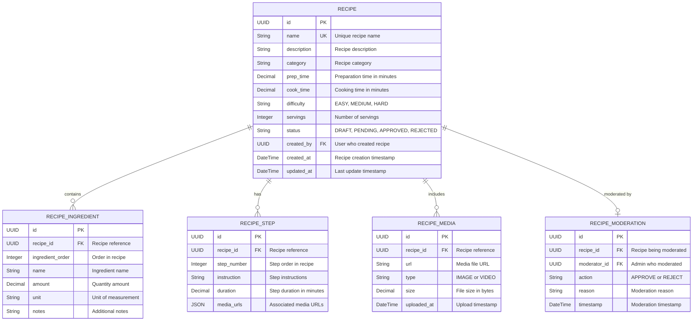

# ERD - Module UC-A2: Quản Lý Công Thức Hệ Thống

## Overview & Scope

- **Mục tiêu**: Chuẩn hoá tài liệu ERD cho module UC-A2 (Quản Lý Công Thức Hệ Thống), dùng Mermaid `erDiagram` để mô tả cấu trúc database, entities, attributes, và relationships.
- **Phạm vi**: Module UC-A2 bao gồm 7 Use Cases: xem danh sách, thêm, sửa, xóa công thức hệ thống và các chức năng kiểm duyệt công thức người dùng.
- **Tài liệu tham chiếu Mermaid**: [Mermaid ER Diagram](https://mermaid.js.org/syntax/entityRelationshipDiagram.html)

## Notation & Conventions

- **Ngôn ngữ**: tiếng Việt, giữ English cho technical terms/identifiers.
- **Naming**:
  - Tên entity PascalCase trong ERD, snake_case cho database tables (ví dụ: `RECIPE` → `recipes`)
  - Thuộc tính camelCase trong ERD, snake_case trong database (ví dụ: `createdAt` → `created_at`)
  - Primary key: `id` (UUID)
  - Foreign key: `{referenced_entity}_id`
- **Data Types**: 
  - `UUID` cho primary keys
  - `String` cho text fields
  - `DateTime` cho timestamps
  - `Decimal` cho số thập phân
  - `Boolean` cho flags
  - `JSON` cho complex data
- **Cardinality**: "1", "0..1", "1..*", "*", "0..n", "1..n"
- **Constraints**: NOT NULL, UNIQUE, DEFAULT values
- **Indexes**: Primary Key (PK), Foreign Key (FK), Unique Index (UQ)

## Module Context

- **Mô tả**: Module quản lý công thức hệ thống cho phép Admin thực hiện các thao tác quản trị: xem danh sách công thức với filter/sort/paging, thêm công thức mới với nguyên liệu và bước thực hiện, sửa công thức hiện có với versioning, xóa công thức và media liên quan, xem danh sách công thức chờ duyệt, phê duyệt/từ chối công thức người dùng.
- **Actors chính**: Admin (quản trị viên)
- **Database layers**: 
  - Core entities: `recipes`, `recipe_ingredients`, `recipe_steps`
  - Supporting data: `recipe_media`, `recipe_moderation`
  - Lookup/enum tables: Embedded trong core entities
- **Liên kết UC/SD liên quan**: 
  - UC: UCA02-1 (Xem danh sách), UCA02-2 (Thêm mới), UCA02-3 (Sửa đổi), UCA02-4 (Xóa), UCA02-5 (Xem chờ duyệt), UCA02-6 (Phê duyệt), UCA02-7 (Từ chối)
  - SD: SD-UCA02-1, SD-UCA02-2, SD-UCA02-3, SD-UCA02-4, SD-UCA02-5, SD-UCA02-6, SD-UCA02-7

## Entity Inventory

| Entity Name | Description | Key Attributes | Relationships | Traceability (UC/SD) |
|---|---|---|---|---|
| RECIPE | Quản lý thông tin công thức và trạng thái | id, name, status, difficulty, created_by | has RECIPE_INGREDIENTS, RECIPE_STEPS, RECIPE_MEDIA, RECIPE_MODERATION | UCA02-1,2,3,4,5,6,7; SD-UCA02-1,2,3,4,5,6,7 |
| RECIPE_INGREDIENT | Lưu trữ nguyên liệu với định lượng cho từng công thức | recipe_id, name, amount, unit, notes | belongs to RECIPE | UCA02-2,3; SD-UCA02-2,3 |
| RECIPE_STEP | Lưu trữ các bước thực hiện công thức theo thứ tự | recipe_id, step_number, instruction, duration | belongs to RECIPE | UCA02-2,3; SD-UCA02-2,3 |
| RECIPE_MEDIA | Quản lý ảnh/video đính kèm công thức | recipe_id, url, type, size, uploaded_at | belongs to RECIPE | UCA02-2,3,4; SD-UCA02-2,3,4 |
| RECIPE_MODERATION | Lưu trữ thông tin kiểm duyệt công thức | recipe_id, moderator_id, action, reason, timestamp | belongs to RECIPE | UCA02-6,7; SD-UCA02-6,7 |

## Diagrams

### Overview ERD

## Detailed Entity Specifications

### RECIPE

- **Intent**: Entity chính đại diện cho công thức trong domain, quản lý thông tin cơ bản và trạng thái công thức.
- **Responsibilities**: 
  - Lưu trữ thông tin định danh và chi tiết công thức
  - Quản lý trạng thái công thức trong quy trình kiểm duyệt
  - Theo dõi thông tin tạo và cập nhật
- **Attributes**:
  - `id: UUID` — Primary key, định danh duy nhất; NOT NULL, UNIQUE
  - `name: String` — Tên công thức; NOT NULL, UNIQUE, INDEX
  - `description: String` — Mô tả chi tiết công thức; NOT NULL
  - `category: String` — Danh mục công thức; NOT NULL
  - `prep_time: Decimal` — Thời gian chuẩn bị (phút); NOT NULL, >= 0
  - `cook_time: Decimal` — Thời gian nấu (phút); NOT NULL, >= 0
  - `difficulty: String` — Độ khó (EASY/MEDIUM/HARD); NOT NULL
  - `servings: Integer` — Số khẩu phần; NOT NULL, > 0
  - `status: String` — Trạng thái (DRAFT/PENDING/APPROVED/REJECTED); NOT NULL, DEFAULT 'DRAFT'
  - `created_by: UUID` — ID người tạo; NOT NULL, FK
  - `created_at: DateTime` — Thời điểm tạo; NOT NULL, DEFAULT CURRENT_TIMESTAMP
  - `updated_at: DateTime` — Thời điểm cập nhật cuối; NOT NULL, DEFAULT CURRENT_TIMESTAMP ON UPDATE
- **Relationships**:
  - One-to-Many với RECIPE_INGREDIENT: 1 recipe có nhiều ingredients
  - One-to-Many với RECIPE_STEP: 1 recipe có nhiều steps
  - One-to-Many với RECIPE_MEDIA: 1 recipe có nhiều media files
  - One-to-One với RECIPE_MODERATION: 1 recipe có thể có 1 moderation record
- **Constraints**: 
  - Tên công thức phải unique trong hệ thống
  - Status chỉ có thể là 'DRAFT', 'PENDING', 'APPROVED', 'REJECTED'
  - Difficulty chỉ có thể là 'EASY', 'MEDIUM', 'HARD'
  - prep_time và cook_time phải >= 0
  - servings phải > 0
- **Indexes**: 
  - PRIMARY KEY (id)
  - UNIQUE INDEX (name)
  - INDEX (status) — cho filter theo trạng thái
  - INDEX (category) — cho filter theo danh mục
  - INDEX (created_by) — cho query theo người tạo
  - INDEX (created_at) — cho sort theo thời gian tạo
- **Design Notes**: 
  - Embed status và difficulty như String enum để đơn giản hóa queries
  - Tách các thành phần phức tạp (ingredients, steps, media) ra separate tables
  - Dùng UUID cho better distribution và security

### RECIPE_INGREDIENT

- **Intent**: Lưu trữ thông tin nguyên liệu với định lượng cho từng công thức.
- **Responsibilities**:
  - Quản lý danh sách nguyên liệu theo thứ tự
  - Lưu trữ định lượng và đơn vị đo
  - Hỗ trợ ghi chú bổ sung cho nguyên liệu
- **Attributes**:
  - `id: UUID` — Primary key; NOT NULL, UNIQUE
  - `recipe_id: UUID` — Recipe chứa ingredient; NOT NULL, FK → recipes.id
  - `ingredient_order: Integer` — Thứ tự trong danh sách; NOT NULL, >= 1
  - `name: String` — Tên nguyên liệu; NOT NULL
  - `amount: Decimal` — Số lượng; NOT NULL, > 0
  - `unit: String` — Đơn vị đo (kg, g, ml, cup, etc.); NOT NULL
  - `notes: String` — Ghi chú bổ sung; NULLABLE
- **Relationships**:
  - Many-to-One với RECIPE: nhiều ingredients thuộc 1 recipe
- **Constraints**:
  - recipe_id phải reference existing recipe
  - amount phải > 0
  - Combination (recipe_id, ingredient_order) phải unique
- **Indexes**:
  - PRIMARY KEY (id)
  - UNIQUE INDEX (recipe_id, ingredient_order)
  - INDEX (recipe_id) — query ingredients by recipe
- **Design Notes**:
  - ingredient_order để maintain ordering của nguyên liệu
  - Flexible unit field để support các đơn vị đo khác nhau
  - notes field cho các thông tin bổ sung (tùy chọn, thay thế, etc.)

### RECIPE_STEP

- **Intent**: Lưu trữ các bước thực hiện công thức theo thứ tự có hệ thống.
- **Responsibilities**:
  - Quản lý thứ tự các bước thực hiện
  - Lưu trữ hướng dẫn chi tiết cho từng bước
  - Theo dõi thời gian thực hiện (nếu có)
- **Attributes**:
  - `id: UUID` — Primary key; NOT NULL, UNIQUE
  - `recipe_id: UUID` — Recipe chứa step; NOT NULL, FK → recipes.id
  - `step_number: Integer` — Số thứ tự bước; NOT NULL, >= 1
  - `instruction: String` — Hướng dẫn thực hiện; NOT NULL
  - `duration: Decimal` — Thời gian thực hiện (phút); NULLABLE, >= 0
  - `media_urls: JSON` — URLs của ảnh/video minh họa; NULLABLE
- **Relationships**:
  - Many-to-One với RECIPE: nhiều steps thuộc 1 recipe
- **Constraints**:
  - recipe_id phải reference existing recipe
  - duration phải >= 0 nếu có giá trị
  - Combination (recipe_id, step_number) phải unique
- **Indexes**:
  - PRIMARY KEY (id)
  - UNIQUE INDEX (recipe_id, step_number)
  - INDEX (recipe_id) — query steps by recipe
- **Design Notes**:
  - step_number để maintain ordering của các bước
  - JSON media_urls cho flexibility trong việc đính kèm media
  - duration optional vì không phải bước nào cũng có thời gian cụ thể

### RECIPE_MEDIA

- **Intent**: Quản lý các file media (ảnh/video) đính kèm công thức.
- **Responsibilities**:
  - Lưu trữ thông tin file media
  - Phân loại media theo type
  - Theo dõi thông tin upload và kích thước file
- **Attributes**:
  - `id: UUID` — Primary key; NOT NULL, UNIQUE
  - `recipe_id: UUID` — Recipe chứa media; NOT NULL, FK → recipes.id
  - `url: String` — URL của media file; NOT NULL, UNIQUE
  - `type: String` — Loại media (IMAGE/VIDEO); NOT NULL
  - `size: Decimal` — Kích thước file (bytes); NOT NULL, > 0
  - `uploaded_at: DateTime` — Thời điểm upload; NOT NULL, DEFAULT CURRENT_TIMESTAMP
- **Relationships**:
  - Many-to-One với RECIPE: nhiều media files thuộc 1 recipe
- **Constraints**:
  - recipe_id phải reference existing recipe
  - type chỉ có thể là 'IMAGE' hoặc 'VIDEO'
  - size phải > 0
  - url phải unique globally
- **Indexes**:
  - PRIMARY KEY (id)
  - UNIQUE INDEX (url)
  - INDEX (recipe_id) — query media by recipe
  - INDEX (type) — filter by media type
- **Design Notes**:
  - URL-based storage cho flexibility trong storage backend
  - size tracking để quản lý storage usage
  - Global unique URL để tránh duplicates

### RECIPE_MODERATION

- **Intent**: Lưu trữ thông tin kiểm duyệt cho các công thức do người dùng gửi lên.
- **Responsibilities**:
  - Ghi nhận quyết định kiểm duyệt (approve/reject)
  - Theo dõi moderator thực hiện kiểm duyệt
  - Lưu trữ lý do từ chối (nếu có)
- **Attributes**:
  - `id: UUID` — Primary key; NOT NULL, UNIQUE
  - `recipe_id: UUID` — Recipe được kiểm duyệt; NOT NULL, FK → recipes.id, UNIQUE
  - `moderator_id: UUID` — Admin thực hiện kiểm duyệt; NOT NULL, FK
  - `action: String` — Hành động (APPROVE/REJECT); NOT NULL
  - `reason: String` — Lý do kiểm duyệt; NULLABLE
  - `timestamp: DateTime` — Thời điểm kiểm duyệt; NOT NULL, DEFAULT CURRENT_TIMESTAMP
- **Relationships**:
  - One-to-One với RECIPE: 1 recipe có tối đa 1 moderation record
- **Constraints**:
  - recipe_id phải reference existing recipe và unique
  - action chỉ có thể là 'APPROVE' hoặc 'REJECT'
  - Khi action = 'REJECT', reason nên có giá trị
- **Indexes**:
  - PRIMARY KEY (id)
  - UNIQUE INDEX (recipe_id)
  - INDEX (moderator_id) — query by moderator
  - INDEX (action) — filter by action type
  - INDEX (timestamp) — sort chronologically
- **Design Notes**:
  - One-to-one relationship với recipe vì mỗi recipe chỉ cần 1 moderation record
  - Optional reason field nhưng business rule yêu cầu khi reject
  - Immutable records để maintain audit trail

## Database Schema Details

### Tables

| Table Name | Description | Primary Key | Foreign Keys | Indexes |
|---|---|---|---|---|
| recipes | Recipe information and status | id | created_by → users.id | name (UQ), status, category, created_by, created_at |
| recipe_ingredients | Recipe ingredients with quantities | id | recipe_id → recipes.id | recipe_id + ingredient_order (UQ), recipe_id |
| recipe_steps | Recipe preparation steps | id | recipe_id → recipes.id | recipe_id + step_number (UQ), recipe_id |
| recipe_media | Recipe media files | id | recipe_id → recipes.id | url (UQ), recipe_id, type |
| recipe_moderation | Recipe moderation records | id | recipe_id → recipes.id, moderator_id → users.id | recipe_id (UQ), moderator_id, action, timestamp |

### Relationships

| From Table | To Table | Type | Cardinality | Description |
|---|---|---|---|---|
| recipe_ingredients | recipes | Many-to-One | N:1 | Recipe contains multiple ingredients |
| recipe_steps | recipes | Many-to-One | N:1 | Recipe has multiple preparation steps |
| recipe_media | recipes | Many-to-One | N:1 | Recipe can have multiple media files |
| recipe_moderation | recipes | One-to-One | 1:1 | Recipe can have one moderation record |
| recipes | users | Many-to-One | N:1 | User can create multiple recipes |
| recipe_moderation | users | Many-to-One | N:1 | User (admin) can moderate multiple recipes |

## Traceability Matrix

| UC ID | SD ID | Entities Involved | Notes |
|---|---|---|---|
| UCA02-1 | SD-UCA02-1 | RECIPE | Xem danh sách công thức - query recipes table với filter/sort/paging |
| UCA02-2 | SD-UCA02-2 | RECIPE, RECIPE_INGREDIENT, RECIPE_STEP, RECIPE_MEDIA | Tạo công thức mới - INSERT vào recipes và các related tables |
| UCA02-3 | SD-UCA02-3 | RECIPE, RECIPE_INGREDIENT, RECIPE_STEP, RECIPE_MEDIA | Sửa công thức - UPDATE recipes và related records |
| UCA02-4 | SD-UCA02-4 | RECIPE, RECIPE_INGREDIENT, RECIPE_STEP, RECIPE_MEDIA | Xóa công thức - DELETE cascade từ recipes |
| UCA02-5 | SD-UCA02-5 | RECIPE | Xem danh sách chờ duyệt - query recipes với status = 'PENDING' |
| UCA02-6 | SD-UCA02-6 | RECIPE, RECIPE_MODERATION | Phê duyệt công thức - UPDATE recipe.status, INSERT moderation record |
| UCA02-7 | SD-UCA02-7 | RECIPE, RECIPE_MODERATION | Từ chối công thức - UPDATE recipe.status, INSERT moderation record với reason |

## Assumptions & Decisions

- **Giả định chính**: 
  - Recipe có thể có nhiều media files (ảnh/video)
  - Mỗi recipe cần ít nhất 3 nguyên liệu và 3 bước thực hiện
  - Tên công thức phải unique trong toàn hệ thống
  - Moderation chỉ áp dụng cho recipes có status PENDING
  - Media files được lưu trữ external, database chỉ lưu URLs

- **Quyết định thiết kế**: 
  - Embed enums (status, difficulty, media type) như String values cho performance
  - Tách ingredients, steps, media ra separate tables để flexibility
  - Dùng UUID primary keys cho better distribution
  - JSON column cho media_urls trong steps để flexibility
  - One-to-one relationship cho moderation để đơn giản hóa

## Open Issues

- **Câu hỏi cần làm rõ**: 
  - Có cần soft delete cho Recipe entity hay hard delete?
  - Có giới hạn số lượng media files per recipe?
  - Có cần versioning cho recipe updates?
  - Có cần full-text search cho recipe names và descriptions?

- **Hạng mục cần xác thực**: 
  - Performance impact của JSON columns cho media_urls
  - Index strategy cho large-scale recipe database
  - Storage strategy và cleanup cho orphaned media files
  - Cascade delete behavior cho related tables
