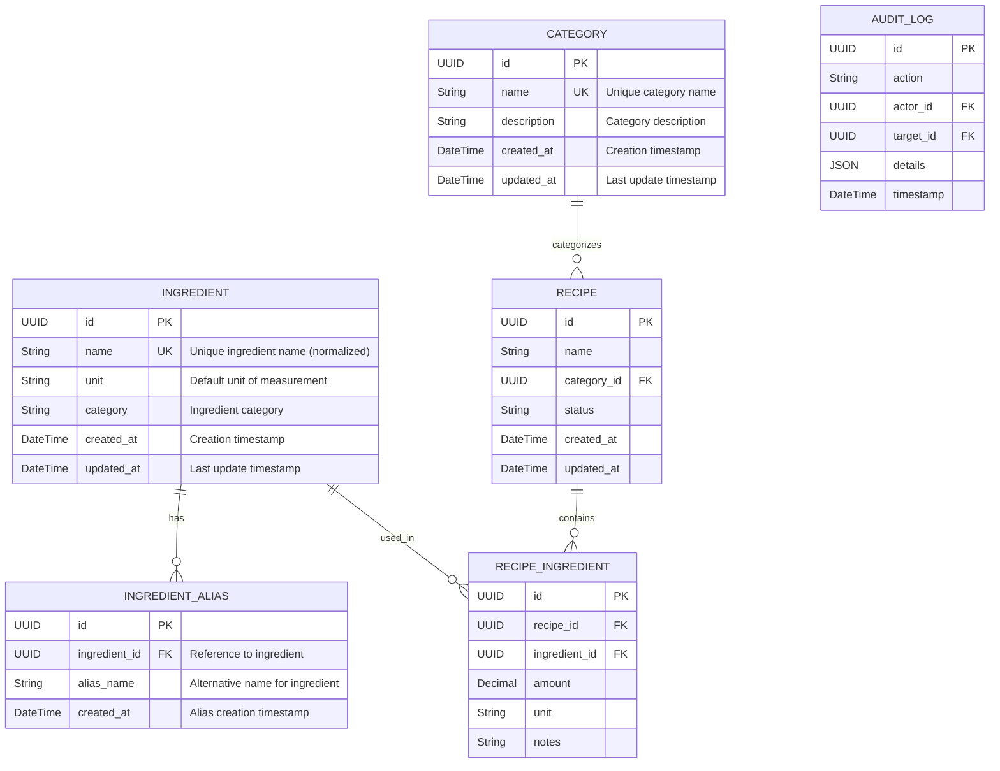

# ERD - Module UC-A3: Quản Lý Danh Mục và Nguyên Liệu

## Overview & Scope

- **Mục tiêu**: Chuẩn hoá tài liệu ERD cho module UC-A3 (Quản Lý Danh Mục và Nguyên Liệu), dùng Mermaid `erDiagram` để mô tả cấu trúc database, entities, attributes, và relationships.
- **Phạm vi**: Module UC-A3 bao gồm 8 Use Cases: quản lý danh mục (UCA03-1 đến UCA03-4) và quản lý nguyên liệu (UCA03-5 đến UCA03-8).
- **Tài liệu tham chiếu Mermaid**: [Mermaid ER Diagram](https://mermaid.js.org/syntax/entityRelationshipDiagram.html)

## Notation & Conventions

- **Ngôn ngữ**: tiếng Việt, giữ English cho technical terms/identifiers.
- **Naming**:
  - Tên entity PascalCase trong ERD, snake_case cho database tables (ví dụ: `CATEGORY` → `categories`)
  - Thuộc tính camelCase trong ERD, snake_case trong database (ví dụ: `createdAt` → `created_at`)
  - Primary key: `id` (UUID)
  - Foreign key: `{referenced_entity}_id`
- **Data Types**: 
  - `UUID` cho primary keys
  - `String` cho text fields
  - `DateTime` cho timestamps
  - `Boolean` cho flags
  - `JSON` cho complex data
- **Cardinality**: "1", "0..1", "1..*", "*", "0..n", "1..n"
- **Constraints**: NOT NULL, UNIQUE, DEFAULT values
- **Indexes**: Primary Key (PK), Foreign Key (FK), Unique Index (UQ)

## Module Context

- **Mô tả**: Module quản lý danh mục và nguyên liệu cho phép Admin thực hiện các thao tác quản trị: xem danh sách danh mục/nguyên liệu với filter/sort/paging, thêm mới danh mục/nguyên liệu với validation, sửa thông tin danh mục/nguyên liệu, xóa danh mục/nguyên liệu với kiểm tra ràng buộc tham chiếu từ công thức.
- **Actors chính**: Admin (quản trị viên)
- **Database layers**: 
  - Core entities: `categories`, `ingredients`, `ingredient_aliases`
  - Supporting data: `audit_logs` (shared table)
  - External references: `recipes`, `recipe_ingredients`, `users`
- **Liên kết UC/SD liên quan**: 
  - UC: UCA03-1 (Xem danh sách danh mục), UCA03-2 (Thêm danh mục), UCA03-3 (Sửa danh mục), UCA03-4 (Xóa danh mục), UCA03-5 (Xem danh sách nguyên liệu), UCA03-6 (Thêm nguyên liệu), UCA03-7 (Sửa nguyên liệu), UCA03-8 (Xóa nguyên liệu)
  - SD: SD-UCA03-1, SD-UCA03-2, SD-UCA03-3, SD-UCA03-4, SD-UCA03-5, SD-UCA03-6, SD-UCA03-7, SD-UCA03-8

## Entity Inventory

| Entity Name | Description | Key Attributes | Relationships | Traceability (UC/SD) |
|---|---|---|---|---|
| CATEGORY | Quản lý danh mục món ăn và thông tin cơ bản | id, name, description, created_at, updated_at | references RECIPES | UCA03-1,2,3,4; SD-UCA03-1,2,3,4 |
| INGREDIENT | Quản lý nguyên liệu chuẩn hóa và thông tin chi tiết | id, name, unit, category, created_at, updated_at | has INGREDIENT_ALIASES, references RECIPE_INGREDIENTS | UCA03-5,6,7,8; SD-UCA03-5,6,7,8 |
| INGREDIENT_ALIAS | Lưu trữ tên đồng nghĩa của nguyên liệu để hỗ trợ tìm kiếm | id, ingredient_id, alias_name, created_at | belongs to INGREDIENT | UCA03-6,7; SD-UCA03-6,7 |

## Diagrams

### Overview ERD

## Detailed Entity Specifications

### CATEGORY

- **Intent**: Entity chính đại diện cho danh mục món ăn trong domain, quản lý phân loại và tổ chức công thức.
- **Responsibilities**: 
  - Lưu trữ thông tin danh mục món ăn (tên, mô tả)
  - Đảm bảo tính duy nhất của tên danh mục
  - Cung cấp cấu trúc phân loại cho công thức
  - Hỗ trợ navigation và filter trong ứng dụng
- **Attributes**:
  - `id: UUID` — Primary key, định danh duy nhất; NOT NULL, UNIQUE
  - `name: String` — Tên danh mục; NOT NULL, UNIQUE, INDEX
  - `description: String` — Mô tả chi tiết danh mục; NULLABLE
  - `created_at: DateTime` — Thời điểm tạo; NOT NULL, DEFAULT CURRENT_TIMESTAMP
  - `updated_at: DateTime` — Thời điểm cập nhật cuối; NOT NULL, DEFAULT CURRENT_TIMESTAMP ON UPDATE
- **Relationships**:
  - One-to-Many với RECIPE: 1 category có nhiều recipes
- **Constraints**: 
  - Tên danh mục phải duy nhất trong hệ thống (case-sensitive)
  - Tên danh mục không được chứa ký tự đặc biệt không hợp lệ
  - Mô tả có thể null nhưng nếu có thì phải >= 10 ký tự
- **Indexes**: 
  - PRIMARY KEY (id)
  - UNIQUE INDEX (name)
  - INDEX (created_at) — cho sort theo thời gian tạo
- **Design Notes**: 
  - Embed validation logic trong application layer thay vì database constraints phức tạp
  - Dùng simple String cho name thay vì separate CategoryName table để tối ưu performance
  - Hỗ trợ hierarchical categories trong tương lai bằng cách thêm parent_id field

### INGREDIENT

- **Intent**: Entity chính đại diện cho nguyên liệu chuẩn hóa trong domain, quản lý thông tin nguyên liệu với tên chuẩn hóa.
- **Responsibilities**:
  - Lưu trữ thông tin nguyên liệu chuẩn hóa (tên, đơn vị, danh mục)
  - Đảm bảo tính duy nhất của tên nguyên liệu (case-insensitive, không dấu)
  - Cung cấp đơn vị đo lường mặc định
  - Hỗ trợ phân loại nguyên liệu theo category
- **Attributes**:
  - `id: UUID` — Primary key, định danh duy nhất; NOT NULL, UNIQUE
  - `name: String` — Tên nguyên liệu chuẩn hóa (không dấu, lowercase); NOT NULL, UNIQUE, INDEX
  - `unit: String` — Đơn vị đo lường mặc định (g, ml, cup, etc.); NOT NULL
  - `category: String` — Phân loại nguyên liệu (rau, thịt, gia vị, etc.); NOT NULL
  - `created_at: DateTime` — Thời điểm tạo; NOT NULL, DEFAULT CURRENT_TIMESTAMP
  - `updated_at: DateTime` — Thời điểm cập nhật cuối; NOT NULL, DEFAULT CURRENT_TIMESTAMP ON UPDATE
- **Relationships**:
  - One-to-Many với INGREDIENT_ALIAS: 1 ingredient có nhiều aliases
  - One-to-Many với RECIPE_INGREDIENT: 1 ingredient được dùng trong nhiều recipes
- **Constraints**:
  - Tên nguyên liệu phải duy nhất (case-insensitive, không dấu Vietnamese)
  - Unit phải thuộc danh sách units được định nghĩa trước
  - Category phải thuộc danh sách categories được định nghĩa trước
- **Indexes**:
  - PRIMARY KEY (id)
  - UNIQUE INDEX (name)
  - INDEX (category) — filter by category
  - INDEX (unit) — filter by unit
  - INDEX (created_at) — sort chronologically
- **Design Notes**:
  - Name được normalize về dạng không dấu, lowercase để đảm bảo uniqueness
  - Category as String enum thay vì foreign key để đơn giản hóa
  - Unit validation logic trong application layer
  - Full-text search có thể được implement qua search engine external

### INGREDIENT_ALIAS

- **Intent**: Lưu trữ các tên đồng nghĩa (aliases) của nguyên liệu để hỗ trợ tìm kiếm và nhận diện nguyên liệu.
- **Responsibilities**:
  - Lưu trữ các tên gọi khác nhau của cùng một nguyên liệu
  - Hỗ trợ tìm kiếm nguyên liệu bằng nhiều tên gọi khác nhau
  - Chuẩn hóa việc nhập liệu từ người dùng
- **Attributes**:
  - `id: UUID` — Primary key; NOT NULL, UNIQUE
  - `ingredient_id: UUID` — Reference tới ingredient; NOT NULL, FK → ingredients.id
  - `alias_name: String` — Tên đồng nghĩa; NOT NULL
  - `created_at: DateTime` — Thời điểm tạo alias; NOT NULL, DEFAULT CURRENT_TIMESTAMP
- **Relationships**:
  - Many-to-One với INGREDIENT: nhiều aliases thuộc 1 ingredient
- **Constraints**:
  - ingredient_id phải reference existing ingredient
  - Combination (ingredient_id, alias_name) phải unique để tránh duplicate aliases
  - alias_name không được trùng với ingredient.name của chính nó
  - alias_name phải khác với tất cả alias_name khác của cùng ingredient
- **Indexes**:
  - PRIMARY KEY (id)
  - UNIQUE INDEX (ingredient_id, alias_name)
  - INDEX (ingredient_id) — query aliases by ingredient
  - INDEX (alias_name) — search by alias name
- **Design Notes**:
  - Separate table thay vì JSON array để hỗ trợ indexing và searching tốt hơn
  - alias_name có thể có dấu và case khác nhau để user-friendly
  - Search logic sẽ normalize alias_name khi query
  - Immutable aliases - chỉ có thể thêm hoặc xóa, không sửa

## Database Schema Details

### Tables

| Table Name | Description | Primary Key | Foreign Keys | Indexes |
|---|---|---|---|---|
| categories | Category information | id | - | name (UQ), created_at |
| ingredients | Ingredient master data | id | - | name (UQ), category, unit, created_at |
| ingredient_aliases | Ingredient alternative names | id | ingredient_id → ingredients.id | ingredient_id + alias_name (UQ), ingredient_id, alias_name |

### Relationships

| From Table | To Table | Type | Cardinality | Description |
|---|---|---|---|---|
| recipes | categories | Many-to-One | N:1 | Recipe belongs to one category |
| ingredient_aliases | ingredients | Many-to-One | N:1 | Alias belongs to one ingredient |
| recipe_ingredients | ingredients | Many-to-One | N:1 | Recipe ingredient references one ingredient |

## Traceability Matrix

| UC ID | SD ID | Entities Involved | Notes |
|---|---|---|---|
| UCA03-1 | SD-UCA03-1 | CATEGORY | Xem danh sách danh mục - query categories table với filter/sort/paging, JOIN với recipes để đếm số công thức |
| UCA03-2 | SD-UCA03-2 | CATEGORY | Tạo danh mục mới - INSERT vào categories với validation tên duy nhất |
| UCA03-3 | SD-UCA03-3 | CATEGORY | Sửa thông tin danh mục - UPDATE categories với validation tên duy nhất |
| UCA03-4 | SD-UCA03-4 | CATEGORY, RECIPE, AUDIT_LOG | Xóa danh mục - kiểm tra recipes tham chiếu, chuyển hoặc từ chối, DELETE category, INSERT audit_log |
| UCA03-5 | SD-UCA03-5 | INGREDIENT, INGREDIENT_ALIAS | Xem danh sách nguyên liệu - query ingredients với LEFT JOIN ingredient_aliases để hiển thị aliases |
| UCA03-6 | SD-UCA03-6 | INGREDIENT, INGREDIENT_ALIAS | Tạo nguyên liệu mới - INSERT vào ingredients, INSERT aliases vào ingredient_aliases |
| UCA03-7 | SD-UCA03-7 | INGREDIENT, INGREDIENT_ALIAS | Sửa thông tin nguyên liệu - UPDATE ingredients, DELETE/INSERT aliases trong ingredient_aliases |
| UCA03-8 | SD-UCA03-8 | INGREDIENT, INGREDIENT_ALIAS, RECIPE_INGREDIENT, AUDIT_LOG | Xóa nguyên liệu - kiểm tra recipe_ingredients, thay thế hoặc từ chối, DELETE ingredient (cascade aliases), INSERT audit_log |

## Assumptions & Decisions

- **Giả định chính**: 
  - Category names phải unique và case-sensitive để tránh confusion
  - Ingredient names được normalize về dạng không dấu, lowercase để đảm bảo uniqueness
  - Mỗi ingredient có thể có nhiều aliases để hỗ trợ search flexibility
  - Soft delete không cần thiết vì có audit trail và reference checking
  - Category và Ingredient có thể được tham chiếu bởi nhiều recipes

- **Quyết định thiết kế**: 
  - Embed CategoryName và IngredientName validation logic vào application layer thay vì database
  - Dùng String enums cho category và unit thay vì separate lookup tables để tối ưu performance
  - Tách INGREDIENT_ALIAS ra separate table thay vì JSON array để hỗ trợ indexing và search
  - Sử dụng UUID primary keys cho better distribution và security
  - Hard delete với cascade cho ingredient_aliases khi xóa ingredient
  - Reference checking qua application layer thay vì database foreign key constraints để flexibility

## Open Issues

- **Câu hỏi cần làm rõ**: 
  - Có cần hierarchical categories (parent-child relationship)?
  - Có giới hạn số lượng aliases per ingredient?
  - Có cần full-text search indexing cho ingredient names và aliases?
  - Có cần versioning khi update ingredient information?
  - Có cần approval workflow khi thêm/sửa ingredients?

- **Hạng mục cần xác thực**: 
  - Performance impact của normalization cho ingredient names
  - Index strategy cho large-scale ingredient database với nhiều aliases
  - Backup và recovery strategy cho category/ingredient master data
  - Data migration strategy khi có changes về normalization rules
  - Monitoring và alerting cho data integrity violations
