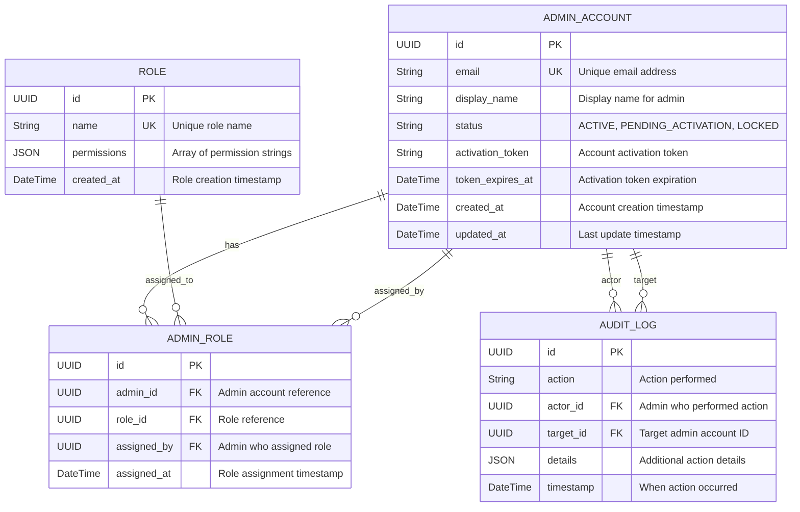

# ERD - Module UC-A4: Quản Lý Tài Khoản Admin

## Overview & Scope

- **Mục tiêu**: Chuẩn hoá tài liệu ERD cho module UC-A4 (Quản Lý Tài Khoản Admin), dùng Mermaid `erDiagram` để mô tả cấu trúc database, entities, attributes, và relationships.
- **Phạm vi**: Module UC-A4 bao gồm 4 Use Cases: xem danh sách tài khoản Admin, tạo tài khoản Admin mới, phân quyền cho tài khoản Admin, xóa tài khoản Admin.
- **Tài liệu tham chiếu Mermaid**: [Mermaid ER Diagram](https://mermaid.js.org/syntax/entityRelationshipDiagram.html)

## Notation & Conventions

- **Ngôn ngữ**: tiếng Việt, giữ English cho technical terms/identifiers.
- **Naming**:
  - Tên entity PascalCase trong ERD, snake_case cho database tables (ví dụ: `ADMIN_ACCOUNT` → `admin_accounts`)
  - Thuộc tính camelCase trong ERD, snake_case trong database (ví dụ: `createdAt` → `created_at`)
  - Primary key: `id` (UUID)
  - Foreign key: `{referenced_entity}_id`
- **Data Types**: 
  - `UUID` cho primary keys
  - `String` cho text fields
  - `DateTime` cho timestamps
  - `Boolean` cho flags
  - `JSON` cho complex data
- **Cardinality**: "1", "0..1", "1..*", "*", "0..n", "1..n"
- **Constraints**: NOT NULL, UNIQUE, DEFAULT values
- **Indexes**: Primary Key (PK), Foreign Key (FK), Unique Index (UQ)

## Module Context

- **Mô tả**: Module quản lý tài khoản Admin cho phép Super Admin thực hiện các thao tác quản trị: xem danh sách tài khoản Admin với filter/sort/paging, tạo tài khoản Admin mới với email kích hoạt, phân quyền Role-Based Access Control, xóa tài khoản Admin với kiểm tra ràng buộc SuperAdmin invariant.
- **Actors chính**: Super Admin (quản trị viên cấp cao)
- **Database layers**: 
  - Core entities: `admin_accounts`, `roles`, `admin_roles`
  - Supporting data: `audit_logs` (shared table)
  - Lookup/enum tables: Embedded trong core entities
- **Liên kết UC/SD liên quan**: 
  - UC: UCA04-1 (Xem danh sách), UCA04-2 (Tạo mới), UCA04-3 (Phân quyền), UCA04-4 (Xóa)
  - SD: SD-UCA04-1, SD-UCA04-2, SD-UCA04-3, SD-UCA04-4

## Entity Inventory

| Entity Name | Description | Key Attributes | Relationships | Traceability (UC/SD) |
|---|---|---|---|---|
| ADMIN_ACCOUNT | Quản lý thông tin tài khoản Admin và trạng thái | id, email, display_name, status, activation_token | has ADMIN_ROLES, creates AUDIT_LOGS | UCA04-1,2,3,4; SD-UCA04-1,2,3,4 |
| ROLE | Định nghĩa vai trò và quyền hạn trong hệ thống | id, name, permissions, created_at | assigned via ADMIN_ROLES | UCA04-3; SD-UCA04-3 |
| ADMIN_ROLE | Junction table quản lý phân quyền Admin-Role | admin_id, role_id, assigned_at, assigned_by | connects ADMIN_ACCOUNT and ROLE | UCA04-3; SD-UCA04-3 |
| AUDIT_LOG | Ghi nhận mọi sự kiện audit trong hệ thống Admin | id, action, actor_id, target_id, timestamp | references ADMIN_ACCOUNT | UCA04-3,4; SD-UCA04-3,4 |

## Diagrams

### Overview ERD

## Detailed Entity Specifications

### ADMIN_ACCOUNT

- **Intent**: Entity chính đại diện cho tài khoản Admin trong domain, quản lý thông tin định danh, trạng thái, và kích hoạt tài khoản.
- **Responsibilities**: 
  - Lưu trữ thông tin định danh Admin (email, display name)
  - Quản lý trạng thái tài khoản (Active/PendingActivation/Locked)
  - Xử lý quy trình kích hoạt tài khoản với token và thời hạn
  - Theo dõi thời gian tạo và cập nhật
- **Attributes**:
  - `id: UUID` — Primary key, định danh duy nhất; NOT NULL, UNIQUE
  - `email: String` — Email đăng nhập; NOT NULL, UNIQUE, INDEX
  - `display_name: String` — Tên hiển thị; NOT NULL
  - `status: String` — Trạng thái (ACTIVE/PENDING_ACTIVATION/LOCKED); NOT NULL, DEFAULT 'PENDING_ACTIVATION'
  - `activation_token: String` — Token kích hoạt tài khoản; NULLABLE, UNIQUE khi có giá trị
  - `token_expires_at: DateTime` — Thời hạn token; NULLABLE
  - `created_at: DateTime` — Thời điểm tạo; NOT NULL, DEFAULT CURRENT_TIMESTAMP
  - `updated_at: DateTime` — Thời điểm cập nhật cuối; NOT NULL, DEFAULT CURRENT_TIMESTAMP ON UPDATE
- **Relationships**:
  - One-to-Many với ADMIN_ROLE: 1 admin có thể có nhiều roles
  - One-to-Many với AUDIT_LOG (actor_id): 1 admin có thể thực hiện nhiều actions
  - One-to-Many với AUDIT_LOG (target_id): 1 admin có thể là target của nhiều actions
  - One-to-Many với ADMIN_ROLE (assigned_by): 1 admin có thể assign roles cho nhiều admins khác
- **Constraints**: 
  - Email phải tuân thủ format email hợp lệ và unique
  - Status chỉ có thể là 'ACTIVE', 'PENDING_ACTIVATION', 'LOCKED'
  - Khi status = 'PENDING_ACTIVATION', activation_token và token_expires_at phải có giá trị
  - Khi status = 'ACTIVE', activation_token và token_expires_at phải NULL
  - display_name không được rỗng
- **Indexes**: 
  - PRIMARY KEY (id)
  - UNIQUE INDEX (email)
  - UNIQUE INDEX (activation_token) WHERE activation_token IS NOT NULL
  - INDEX (status) — cho filter theo trạng thái
  - INDEX (created_at) — cho sort theo thời gian tạo
- **Design Notes**: 
  - Embed Email validation logic vào application layer để tuân thủ DDD
  - Embed ActivationInfo (token, expires_at) vào table thay vì tách riêng để đơn giản hóa queries
  - Dùng String enum cho AdminAccountStatus thay vì separate lookup table cho performance
  - UUID primary key cho better security và distribution

### ROLE

- **Intent**: Entity định nghĩa vai trò và quyền hạn trong hệ thống RBAC, quản lý tập hợp permissions.
- **Responsibilities**:
  - Lưu trữ thông tin vai trò (tên, mô tả)
  - Quản lý danh sách permissions thuộc vai trò
  - Cung cấp cấu trúc phân quyền linh hoạt
- **Attributes**:
  - `id: UUID` — Primary key; NOT NULL, UNIQUE
  - `name: String` — Tên vai trò; NOT NULL, UNIQUE, INDEX
  - `permissions: JSON` — Array các permission strings; NOT NULL
  - `created_at: DateTime` — Thời điểm tạo; NOT NULL, DEFAULT CURRENT_TIMESTAMP
- **Relationships**:
  - One-to-Many với ADMIN_ROLE: 1 role có thể được assign cho nhiều admins
- **Constraints**:
  - Tên role phải unique trong hệ thống
  - permissions JSON array không được empty
  - Mỗi permission trong array phải thuộc danh sách permissions được định nghĩa
- **Indexes**:
  - PRIMARY KEY (id)
  - UNIQUE INDEX (name)
  - INDEX (created_at) — sort chronologically
- **Design Notes**:
  - JSON permissions cho flexibility mà không cần separate Permission table
  - Permission validation logic trong application layer
  - Immutable roles - chỉ có thể tạo mới hoặc xóa, không sửa permissions
  - Support cho role hierarchy trong tương lai

### ADMIN_ROLE

- **Intent**: Junction table quản lý many-to-many relationship giữa Admin accounts và Roles với audit trail.
- **Responsibilities**:
  - Liên kết Admin accounts với Roles
  - Theo dõi thời gian và người thực hiện phân quyền
  - Hỗ trợ audit trail cho role assignments
- **Attributes**:
  - `id: UUID` — Primary key; NOT NULL, UNIQUE
  - `admin_id: UUID` — Reference tới admin account; NOT NULL, FK → admin_accounts.id
  - `role_id: UUID` — Reference tới role; NOT NULL, FK → roles.id
  - `assigned_by: UUID` — Admin thực hiện phân quyền; NOT NULL, FK → admin_accounts.id
  - `assigned_at: DateTime` — Thời điểm phân quyền; NOT NULL, DEFAULT CURRENT_TIMESTAMP
- **Relationships**:
  - Many-to-One với ADMIN_ACCOUNT (admin_id): nhiều role assignments thuộc 1 admin
  - Many-to-One với ROLE (role_id): nhiều assignments cho 1 role
  - Many-to-One với ADMIN_ACCOUNT (assigned_by): nhiều assignments được thực hiện bởi 1 admin
- **Constraints**:
  - admin_id phải reference existing admin account
  - role_id phải reference existing role
  - assigned_by phải reference existing admin account
  - Combination (admin_id, role_id) phải unique để tránh duplicate assignments
  - assigned_by không được là chính admin_id (không thể tự phân quyền cho mình)
- **Indexes**:
  - PRIMARY KEY (id)
  - UNIQUE INDEX (admin_id, role_id)
  - INDEX (admin_id) — query roles by admin
  - INDEX (role_id) — query admins by role
  - INDEX (assigned_by) — audit trail by assigner
  - INDEX (assigned_at) — sort chronologically
- **Design Notes**:
  - Junction table với additional audit fields thay vì simple foreign key table
  - assigned_by field để track SuperAdmin performing role changes
  - Immutable records - chỉ có thể INSERT hoặc DELETE, không UPDATE
  - Support business rule: không thể tự phân quyền cho chính mình

### AUDIT_LOG

- **Intent**: Shared entity ghi nhận tất cả các hành động quan trọng của admin trong hệ thống để audit và compliance.
- **Responsibilities**:
  - Lưu trữ chi tiết các actions (create, delete, assign_role, etc.)
  - Theo dõi actor (admin thực hiện) và target (admin bị impact)
  - Cung cấp audit trail cho compliance và investigation
- **Attributes**:
  - `id: UUID` — Primary key; NOT NULL, UNIQUE
  - `action: String` — Loại hành động (ADMIN_CREATE, ADMIN_DELETE, ROLE_ASSIGN, etc.); NOT NULL
  - `actor_id: UUID` — ID của admin thực hiện; NOT NULL, FK → admin_accounts.id
  - `target_id: UUID` — ID của admin bị impact; NULLABLE, FK → admin_accounts.id
  - `details: JSON` — Chi tiết bổ sung (role info, reason, etc.); NULLABLE
  - `timestamp: DateTime` — Thời điểm thực hiện; NOT NULL, DEFAULT CURRENT_TIMESTAMP
- **Relationships**:
  - Many-to-One với ADMIN_ACCOUNT (actor_id): nhiều audit logs từ 1 admin
  - Many-to-One với ADMIN_ACCOUNT (target_id): nhiều audit logs cho 1 admin target
- **Constraints**:
  - actor_id phải reference existing admin account
  - target_id phải reference existing admin account nếu có giá trị
  - action phải thuộc danh sách actions được định nghĩa
  - timestamp không được future date
- **Indexes**:
  - PRIMARY KEY (id)
  - INDEX (actor_id) — query by admin performing action
  - INDEX (target_id) — query by target admin
  - INDEX (action) — filter by action type
  - INDEX (timestamp) — sort chronologically
- **Design Notes**:
  - Shared table được sử dụng bởi tất cả modules trong hệ thống
  - JSON details cho flexibility mà không cần schema changes
  - Immutable records (insert-only) để đảm bảo audit integrity
  - target_id nullable để support system-level actions không có target cụ thể

## Database Schema Details

### Tables

| Table Name | Description | Primary Key | Foreign Keys | Indexes |
|---|---|---|---|---|
| admin_accounts | Admin account information and status | id | - | email (UQ), activation_token (UQ), status, created_at |
| roles | Role definitions with permissions | id | - | name (UQ), created_at |
| admin_roles | Admin-Role assignments with audit | id | admin_id → admin_accounts.id, role_id → roles.id, assigned_by → admin_accounts.id | admin_id + role_id (UQ), admin_id, role_id, assigned_by, assigned_at |
| audit_logs | System audit trail | id | actor_id → admin_accounts.id, target_id → admin_accounts.id | actor_id, target_id, action, timestamp |

### Relationships

| From Table | To Table | Type | Cardinality | Description |
|---|---|---|---|---|
| admin_roles | admin_accounts | Many-to-One | N:1 | Admin can have multiple role assignments |
| admin_roles | roles | Many-to-One | N:1 | Role can be assigned to multiple admins |
| admin_roles | admin_accounts | Many-to-One | N:1 | Assignment performed by admin (assigned_by) |
| audit_logs | admin_accounts | Many-to-One | N:1 | Actor relationship - admin performing action |
| audit_logs | admin_accounts | Many-to-One | N:1 | Target relationship - admin being acted upon |

## Traceability Matrix

| UC ID | SD ID | Entities Involved | Notes |
|---|---|---|---|
| UCA04-1 | SD-UCA04-1 | ADMIN_ACCOUNT, ADMIN_ROLE, ROLE | Xem danh sách tài khoản Admin - query admin_accounts với LEFT JOIN admin_roles và roles để hiển thị roles assigned |
| UCA04-2 | SD-UCA04-2 | ADMIN_ACCOUNT | Tạo tài khoản Admin mới - INSERT vào admin_accounts với status = 'PENDING_ACTIVATION', generate activation_token |
| UCA04-3 | SD-UCA04-3 | ADMIN_ACCOUNT, ROLE, ADMIN_ROLE, AUDIT_LOG | Phân quyền cho Admin - INSERT/DELETE trong admin_roles, INSERT audit_log với action = 'ROLE_ASSIGN'/'ROLE_REVOKE' |
| UCA04-4 | SD-UCA04-4 | ADMIN_ACCOUNT, ADMIN_ROLE, AUDIT_LOG | Xóa tài khoản Admin - kiểm tra SuperAdmin invariant, DELETE từ admin_accounts (cascade admin_roles), INSERT audit_log |

## Assumptions & Decisions

- **Giả định chính**: 
  - Admin có thể có nhiều roles đồng thời (many-to-many relationship)
  - Audit log là bắt buộc cho mọi thao tác tạo, xóa, phân quyền
  - Email là unique identifier cho Admin Account
  - ActivationInfo chỉ tồn tại khi account ở trạng thái PENDING_ACTIVATION
  - Hệ thống phải luôn có ít nhất một SuperAdmin (business rule)
  - Role assignments có thể được revoke và reassign

- **Quyết định thiết kế**: 
  - Embed Email và ActivationInfo vào admin_accounts table để đơn giản hóa queries
  - Many-to-many relationship qua junction table admin_roles với audit fields
  - JSON permissions trong roles table cho flexibility
  - UUID primary keys cho better security và distribution
  - Shared audit_logs table để tái sử dụng cho các modules khác
  - Immutable audit records và role assignments để maintain integrity
  - Hard delete với cascade cho admin_roles khi xóa admin account

## Open Issues

- **Câu hỏi cần làm rõ**: 
  - Có cần soft delete cho Admin Account thay vì hard delete?
  - Có giới hạn số lượng roles per admin?
  - Có cần role hierarchy (SuperAdmin > Admin > Moderator)?
  - Có cần temporary role assignments với TTL?
  - Có cần approval workflow cho sensitive role assignments?

- **Hạng mục cần xác thực**: 
  - Performance impact của JSON permissions column trong production
  - Index strategy cho large-scale admin base với nhiều role assignments
  - Backup và recovery strategy cho admin accounts master data
  - Session invalidation strategy khi revoke roles
  - Monitoring và alerting cho SuperAdmin invariant violations
