# ERD - Module UC-A5: Quản Lý Báo Cáo và Thống Kê

## Overview & Scope

- **Mục tiêu**: Chuẩn hoá tài liệu ERD cho module UC-A5 (Quản Lý Báo Cáo và Thống Kê), dùng Mermaid `erDiagram` để mô tả cấu trúc database, entities, attributes, và relationships.
- **Phạm vi**: Module UC-A5 bao gồm 1 Use Case: xem báo cáo và thống kê dashboard với drill-down và export.
- **Tài liệu tham chiếu Mermaid**: [Mermaid ER Diagram](https://mermaid.js.org/syntax/entityRelationshipDiagram.html)

## Notation & Conventions

- **Ngôn ngữ**: tiếng Việt, giữ English cho technical terms/identifiers.
- **Naming**:
  - Tên entity PascalCase trong ERD, snake_case cho database tables (ví dụ: `DASHBOARD_WIDGET` → `dashboard_widgets`)
  - Thuộc tính camelCase trong ERD, snake_case trong database (ví dụ: `createdAt` → `created_at`)
  - Primary key: `id` (UUID)
  - Foreign key: `{referenced_entity}_id`
- **Data Types**: 
  - `UUID` cho primary keys
  - `String` cho text fields
  - `DateTime` cho timestamps
  - `Decimal` cho số thập phân
  - `Boolean` cho flags
  - `JSON` cho complex data
- **Cardinality**: "1", "0..1", "1..*", "*", "0..n", "1..n"
- **Constraints**: NOT NULL, UNIQUE, DEFAULT values
- **Indexes**: Primary Key (PK), Foreign Key (FK), Unique Index (UQ)

## Module Context

- **Mô tả**: Module quản lý báo cáo và thống kê cho phép Admin xem dashboard với KPIs, biểu đồ tương tác, drill-down chi tiết, và export báo cáo theo định dạng PDF/CSV. Hệ thống hỗ trợ cache để tối ưu performance và scheduled reports.
- **Actors chính**: Admin (quản trị viên)
- **Database layers**: 
  - Core entities: `dashboard_widgets`, `report_schedules`, `audit_logs`
  - Cache data: `kpi_metrics`, `chart_data`
  - Supporting data: `report_exports`, `dashboard_layouts`, `widget_thresholds`
- **Liên kết UC/SD liên quan**: 
  - UC: UCA05-1 (Xem báo cáo thống kê)
  - SD: SD-UCA05-1

## Entity Inventory

| Entity Name | Description | Key Attributes | Relationships | Traceability (UC/SD) |
|---|---|---|---|---|
| DASHBOARD_WIDGET | Quản lý widget KPI/biểu đồ trong dashboard | id, type, title, config, position | belongs to USER, has KPI_METRICS, CHART_DATA | UCA05-1; SD-UCA05-1 |
| REPORT_SCHEDULE | Lịch trình gửi báo cáo định kỳ | id, name, frequency, recipients, template_config | created by USER, generates REPORT_EXPORTS | UCA05-1; SD-UCA05-1 |
| AUDIT_LOG | Ghi nhận truy cập báo cáo | id, action, actor_id, target_id, timestamp | references USER | UCA05-1; SD-UCA05-1 |
| KPI_METRIC | Cache giá trị KPI với metadata | id, widget_id, name, value, trend, timestamp | belongs to DASHBOARD_WIDGET | UCA05-1; SD-UCA05-1 |
| CHART_DATA | Cache dữ liệu biểu đồ | id, widget_id, chart_type, labels, datasets | belongs to DASHBOARD_WIDGET | UCA05-1; SD-UCA05-1 |
| REPORT_EXPORT | Lưu trữ file exports | id, schedule_id, format, file_url, generated_at | belongs to REPORT_SCHEDULE | UCA05-1; SD-UCA05-1 |
| DASHBOARD_LAYOUT | Custom dashboard layouts cho users | id, user_id, name, widget_positions | belongs to USER, contains DASHBOARD_WIDGETS | UCA05-1; SD-UCA05-1 |
| WIDGET_THRESHOLD | Alert thresholds cho KPI widgets | id, widget_id, threshold_type, value, alert_config | belongs to DASHBOARD_WIDGET | UCA05-1; SD-UCA05-1 |

## Diagrams

### Overview ERD

```mermaid
erDiagram
    DASHBOARD_WIDGET {
        UUID id PK
        UUID user_id FK "Widget owner"
        String type "KPI, LINE_CHART, BAR_CHART, PIE_CHART, HEATMAP"
        String title "Widget title"
        JSON config "Widget configuration"
        Integer position_x "X position in layout"
        Integer position_y "Y position in layout"
        Integer width "Widget width"
        Integer height "Widget height"
        Integer refresh_interval "Refresh interval in seconds"
        Boolean is_active "Widget active status"
        DateTime created_at "Widget creation timestamp"
        DateTime updated_at "Last update timestamp"
    }
    
    REPORT_SCHEDULE {
        UUID id PK
        UUID created_by FK "User who created schedule"
        String name "Schedule name"
        String frequency "DAILY, WEEKLY, MONTHLY"
        JSON recipients "Email recipients list"
        JSON template_config "Report template configuration"
        JSON widget_ids "Widget IDs to include"
        String timezone "Schedule timezone"
        DateTime next_run_at "Next scheduled execution"
        Boolean is_active "Schedule active status"
        DateTime created_at "Schedule creation timestamp"
        DateTime updated_at "Last update timestamp"
    }
    
    AUDIT_LOG {
        UUID id PK
        String action "Action performed"
        UUID actor_id FK "User who performed action"
        String target_type "Target entity type"
        UUID target_id "Target entity ID"
        JSON details "Additional action details"
        String ip_address "Client IP address"
        String user_agent "Client user agent"
        DateTime timestamp "When action occurred"
    }
    
    KPI_METRIC {
        UUID id PK
        UUID widget_id FK "Associated widget"
        String name "Metric name"
        Decimal value "Metric value"
        String unit "Value unit"
        String trend "UP, DOWN, STABLE"
        Decimal change_percent "Change percentage"
        JSON metadata "Additional metric metadata"
        DateTime timestamp "Metric timestamp"
        DateTime expires_at "Cache expiration time"
    }
    
    CHART_DATA {
        UUID id PK
        UUID widget_id FK "Associated widget"
        String chart_type "LINE, BAR, PIE, HEATMAP"
        JSON labels "Chart labels array"
        JSON datasets "Chart datasets array"
        JSON metadata "Chart configuration metadata"
        DateTime timestamp "Data timestamp"
        DateTime expires_at "Cache expiration time"
    }
    
    REPORT_EXPORT {
        UUID id PK
        UUID schedule_id FK "Schedule that generated this export"
        String format "PDF, CSV, EXCEL"
        String file_url "Export file URL"
        String filename "Original filename"
        Decimal file_size "File size in bytes"
        JSON export_config "Export configuration used"
        String status "GENERATING, COMPLETED, FAILED"
        DateTime generated_at "Export generation timestamp"
        DateTime expires_at "File expiration time"
    }
    
    DASHBOARD_LAYOUT {
        UUID id PK
        UUID user_id FK "Layout owner"
        String name "Layout name"
        JSON widget_positions "Widget positions configuration"
        JSON grid_config "Grid layout configuration"
        Boolean is_default "Default layout for user"
        DateTime created_at "Layout creation timestamp"
        DateTime updated_at "Last update timestamp"
    }
    
    WIDGET_THRESHOLD {
        UUID id PK
        UUID widget_id FK "Associated widget"
        String threshold_type "WARNING, CRITICAL, TARGET"
        String operator "GT, LT, EQ, GTE, LTE"
        Decimal value "Threshold value"
        String color "Alert color"
        JSON alert_config "Alert configuration"
        Boolean is_active "Threshold active status"
        DateTime created_at "Threshold creation timestamp"
    }
    
    %% External reference to users table from other modules
    USER {
        UUID id PK
        String email UK
        String status
    }
    
    %% Relationships
    USER ||--o{ DASHBOARD_WIDGET : "owns"
    USER ||--o{ REPORT_SCHEDULE : "creates"
    USER ||--o{ AUDIT_LOG : "actor"
    USER ||--o{ DASHBOARD_LAYOUT : "has"
    
    DASHBOARD_WIDGET ||--o{ KPI_METRIC : "contains"
    DASHBOARD_WIDGET ||--o{ CHART_DATA : "displays"
    DASHBOARD_WIDGET ||--o{ WIDGET_THRESHOLD : "has"
    
    REPORT_SCHEDULE ||--o{ REPORT_EXPORT : "generates"
    
    DASHBOARD_LAYOUT ||--o{ DASHBOARD_WIDGET : "positions"
```

## Detailed Entity Specifications

### DASHBOARD_WIDGET

- **Intent**: Entity chính đại diện cho widget KPI hoặc biểu đồ trong dashboard, quản lý cấu hình và vị trí hiển thị.
- **Responsibilities**: 
  - Lưu trữ thông tin widget (loại, tiêu đề, cấu hình)
  - Quản lý vị trí và kích thước widget trong dashboard
  - Theo dõi trạng thái active và refresh interval
- **Attributes**:
  - `id: UUID` — Primary key, định danh duy nhất; NOT NULL, UNIQUE
  - `user_id: UUID` — ID người sở hữu widget; NOT NULL, FK → users.id
  - `type: String` — Loại widget (KPI, LINE_CHART, BAR_CHART, PIE_CHART, HEATMAP); NOT NULL
  - `title: String` — Tiêu đề widget; NOT NULL
  - `config: JSON` — Cấu hình chi tiết widget; NOT NULL
  - `position_x: Integer` — Vị trí X trong layout; NOT NULL, >= 0
  - `position_y: Integer` — Vị trí Y trong layout; NOT NULL, >= 0
  - `width: Integer` — Chiều rộng widget; NOT NULL, > 0
  - `height: Integer` — Chiều cao widget; NOT NULL, > 0
  - `refresh_interval: Integer` — Interval refresh (giây); NOT NULL, >= 30
  - `is_active: Boolean` — Trạng thái hoạt động; NOT NULL, DEFAULT TRUE
  - `created_at: DateTime` — Thời điểm tạo; NOT NULL, DEFAULT CURRENT_TIMESTAMP
  - `updated_at: DateTime` — Thời điểm cập nhật cuối; NOT NULL, DEFAULT CURRENT_TIMESTAMP ON UPDATE
- **Relationships**:
  - Many-to-One với USER: nhiều widgets thuộc 1 user
  - One-to-Many với KPI_METRIC: 1 widget có thể có nhiều KPI metrics
  - One-to-Many với CHART_DATA: 1 widget có thể có nhiều chart data records
  - One-to-Many với WIDGET_THRESHOLD: 1 widget có thể có nhiều thresholds
  - Many-to-Many với DASHBOARD_LAYOUT: widget có thể xuất hiện trong nhiều layouts
- **Constraints**: 
  - Type phải thuộc danh sách: 'KPI', 'LINE_CHART', 'BAR_CHART', 'PIE_CHART', 'HEATMAP'
  - Title không được rỗng
  - Position và size phải >= 0
  - refresh_interval phải >= 30 seconds
- **Indexes**: 
  - PRIMARY KEY (id)
  - INDEX (user_id) — query widgets by user
  - INDEX (type) — filter by widget type
  - INDEX (is_active) — filter active widgets
  - INDEX (created_at) — sort by creation time
- **Design Notes**: 
  - JSON config cho flexibility trong widget configuration
  - Position fields để support drag-drop dashboard layout
  - refresh_interval để control cache TTL và performance

### REPORT_SCHEDULE

- **Intent**: Quản lý lịch trình gửi báo cáo định kỳ với cấu hình recipients và template.
- **Responsibilities**:
  - Lưu trữ thông tin schedule (tần suất, recipients)
  - Quản lý template configuration cho reports  
  - Theo dõi next run time và trạng thái active
- **Attributes**:
  - `id: UUID` — Primary key; NOT NULL, UNIQUE
  - `created_by: UUID` — ID người tạo schedule; NOT NULL, FK → users.id
  - `name: String` — Tên schedule; NOT NULL
  - `frequency: String` — Tần suất (DAILY, WEEKLY, MONTHLY); NOT NULL
  - `recipients: JSON` — Danh sách email recipients; NOT NULL
  - `template_config: JSON` — Cấu hình template báo cáo; NOT NULL
  - `widget_ids: JSON` — Danh sách widget IDs để include; NOT NULL
  - `timezone: String` — Timezone cho schedule; NOT NULL, DEFAULT 'UTC'
  - `next_run_at: DateTime` — Thời điểm chạy tiếp theo; NOT NULL
  - `is_active: Boolean` — Trạng thái hoạt động; NOT NULL, DEFAULT TRUE
  - `created_at: DateTime` — Thời điểm tạo; NOT NULL, DEFAULT CURRENT_TIMESTAMP
  - `updated_at: DateTime` — Thời điểm cập nhật cuối; NOT NULL, DEFAULT CURRENT_TIMESTAMP ON UPDATE
- **Relationships**:
  - Many-to-One với USER: nhiều schedules từ 1 user
  - One-to-Many với REPORT_EXPORT: 1 schedule tạo nhiều exports
- **Constraints**:
  - created_by phải reference existing user
  - frequency phải thuộc: 'DAILY', 'WEEKLY', 'MONTHLY'
  - recipients phải là valid JSON array
  - next_run_at phải >= current timestamp
- **Indexes**:
  - PRIMARY KEY (id)
  - INDEX (created_by) — query schedules by user
  - INDEX (next_run_at, is_active) — scheduler queries
  - INDEX (frequency) — filter by frequency
- **Design Notes**:
  - JSON recipients cho flexibility trong email management
  - widget_ids để reference specific widgets for export
  - timezone support cho global users

### KPI_METRIC

- **Intent**: Cache giá trị KPI với trend analysis và metadata để tối ưu dashboard performance.
- **Responsibilities**:
  - Lưu trữ cached KPI values với timestamp
  - Theo dõi trend direction và change percentage
  - Quản lý cache expiration
- **Attributes**:
  - `id: UUID` — Primary key; NOT NULL, UNIQUE
  - `widget_id: UUID` — Widget chứa metric; NOT NULL, FK → dashboard_widgets.id
  - `name: String` — Tên metric; NOT NULL
  - `value: Decimal` — Giá trị metric; NOT NULL
  - `unit: String` — Đơn vị đo; NOT NULL
  - `trend: String` — Hướng xu hướng (UP, DOWN, STABLE); NOT NULL
  - `change_percent: Decimal` — Phần trăm thay đổi; NOT NULL
  - `metadata: JSON` — Metadata bổ sung; NULLABLE
  - `timestamp: DateTime` — Thời điểm data; NOT NULL
  - `expires_at: DateTime` — Thời điểm hết hạn cache; NOT NULL
- **Relationships**:
  - Many-to-One với DASHBOARD_WIDGET: nhiều metrics thuộc 1 widget
- **Constraints**:
  - widget_id phải reference existing widget
  - trend phải thuộc: 'UP', 'DOWN', 'STABLE'
  - expires_at phải > timestamp
- **Indexes**:
  - PRIMARY KEY (id)
  - INDEX (widget_id, timestamp) — query metrics by widget chronologically
  - INDEX (expires_at) — cleanup expired cache
- **Design Notes**:
  - Cache strategy với TTL để balance performance vs data freshness
  - Trend calculation để support visual indicators
  - JSON metadata cho flexibility

### CHART_DATA

- **Intent**: Cache dữ liệu biểu đồ với labels và datasets để tối ưu rendering performance.
- **Responsibilities**:
  - Lưu trữ cached chart data với proper structure
  - Quản lý chart type và configuration metadata
  - Theo dõi cache expiration
- **Attributes**:
  - `id: UUID` — Primary key; NOT NULL, UNIQUE
  - `widget_id: UUID` — Widget chứa chart; NOT NULL, FK → dashboard_widgets.id
  - `chart_type: String` — Loại biểu đồ (LINE, BAR, PIE, HEATMAP); NOT NULL
  - `labels: JSON` — Labels array cho chart; NOT NULL
  - `datasets: JSON` — Datasets array với data points; NOT NULL
  - `metadata: JSON` — Chart configuration metadata; NULLABLE
  - `timestamp: DateTime` — Thời điểm data; NOT NULL
  - `expires_at: DateTime` — Thời điểm hết hạn cache; NOT NULL
- **Relationships**:
  - Many-to-One với DASHBOARD_WIDGET: nhiều chart data records thuộc 1 widget
- **Constraints**:
  - widget_id phải reference existing widget
  - chart_type phải thuộc: 'LINE', 'BAR', 'PIE', 'HEATMAP'
  - labels và datasets phải là valid JSON arrays
  - expires_at phải > timestamp
- **Indexes**:
  - PRIMARY KEY (id)
  - INDEX (widget_id, timestamp) — query chart data by widget chronologically
  - INDEX (expires_at) — cleanup expired cache
- **Design Notes**:
  - JSON structure để support flexible chart libraries
  - Cache strategy tương tự KPI metrics
  - metadata cho chart customization

### REPORT_EXPORT

- **Intent**: Lưu trữ thông tin các file export được tạo từ scheduled reports.
- **Responsibilities**:
  - Theo dõi export files và metadata
  - Quản lý file lifecycle và cleanup
  - Lưu trữ export configuration và status
- **Attributes**:
  - `id: UUID` — Primary key; NOT NULL, UNIQUE
  - `schedule_id: UUID` — Schedule tạo export; NOT NULL, FK → report_schedules.id
  - `format: String` — Định dạng file (PDF, CSV, EXCEL); NOT NULL
  - `file_url: String` — URL file export; NOT NULL, UNIQUE
  - `filename: String` — Tên file gốc; NOT NULL
  - `file_size: Decimal` — Kích thước file (bytes); NOT NULL, > 0
  - `export_config: JSON` — Configuration sử dụng cho export; NOT NULL
  - `status: String` — Trạng thái (GENERATING, COMPLETED, FAILED); NOT NULL
  - `generated_at: DateTime` — Thời điểm tạo; NOT NULL, DEFAULT CURRENT_TIMESTAMP
  - `expires_at: DateTime` — Thời điểm file hết hạn; NOT NULL
- **Relationships**:
  - Many-to-One với REPORT_SCHEDULE: nhiều exports từ 1 schedule
- **Constraints**:
  - schedule_id phải reference existing schedule
  - format phải thuộc: 'PDF', 'CSV', 'EXCEL'
  - status phải thuộc: 'GENERATING', 'COMPLETED', 'FAILED'
  - file_size phải > 0
  - expires_at phải > generated_at
- **Indexes**:
  - PRIMARY KEY (id)
  - UNIQUE INDEX (file_url)
  - INDEX (schedule_id, generated_at) — query exports by schedule
  - INDEX (expires_at) — cleanup expired files
  - INDEX (status) — filter by status
- **Design Notes**:
  - URL-based file storage cho flexibility
  - Status tracking cho async export processing
  - Expiration để tự động cleanup

### DASHBOARD_LAYOUT

- **Intent**: Lưu trữ custom dashboard layouts cho từng user với widget positioning.
- **Responsibilities**:
  - Quản lý multiple layouts per user
  - Lưu trữ widget positions và grid configuration
  - Support default layout per user
- **Attributes**:
  - `id: UUID` — Primary key; NOT NULL, UNIQUE
  - `user_id: UUID` — User sở hữu layout; NOT NULL, FK → users.id
  - `name: String` — Tên layout; NOT NULL
  - `widget_positions: JSON` — Vị trí các widgets; NOT NULL
  - `grid_config: JSON` — Cấu hình grid layout; NOT NULL
  - `is_default: Boolean` — Default layout cho user; NOT NULL, DEFAULT FALSE
  - `created_at: DateTime` — Thời điểm tạo; NOT NULL, DEFAULT CURRENT_TIMESTAMP
  - `updated_at: DateTime` — Thời điểm cập nhật cuối; NOT NULL, DEFAULT CURRENT_TIMESTAMP ON UPDATE
- **Relationships**:
  - Many-to-One với USER: nhiều layouts thuộc 1 user
  - Many-to-Many với DASHBOARD_WIDGET: layout references widgets
- **Constraints**:
  - user_id phải reference existing user
  - Chỉ có 1 default layout per user
  - widget_positions và grid_config phải là valid JSON
- **Indexes**:
  - PRIMARY KEY (id)
  - UNIQUE INDEX (user_id, name) — unique layout name per user
  - INDEX (user_id, is_default) — find default layout
- **Design Notes**:
  - JSON positions cho flexibility trong layout management
  - Multiple layouts per user để support different views
  - Default layout concept để user experience

### WIDGET_THRESHOLD

- **Intent**: Quản lý alert thresholds cho KPI widgets với configuration linh hoạt.
- **Responsibilities**:
  - Định nghĩa threshold values và operators
  - Cấu hình visual alerts (colors, notifications)
  - Support multiple threshold types per widget
- **Attributes**:
  - `id: UUID` — Primary key; NOT NULL, UNIQUE
  - `widget_id: UUID` — Widget áp dụng threshold; NOT NULL, FK → dashboard_widgets.id
  - `threshold_type: String` — Loại threshold (WARNING, CRITICAL, TARGET); NOT NULL
  - `operator: String` — Toán tử so sánh (GT, LT, EQ, GTE, LTE); NOT NULL
  - `value: Decimal` — Giá trị threshold; NOT NULL
  - `color: String` — Màu alert; NOT NULL
  - `alert_config: JSON` — Cấu hình alert bổ sung; NULLABLE
  - `is_active: Boolean` — Trạng thái hoạt động; NOT NULL, DEFAULT TRUE
  - `created_at: DateTime` — Thời điểm tạo; NOT NULL, DEFAULT CURRENT_TIMESTAMP
- **Relationships**:
  - Many-to-One với DASHBOARD_WIDGET: nhiều thresholds thuộc 1 widget
- **Constraints**:
  - widget_id phải reference existing widget
  - threshold_type phải thuộc: 'WARNING', 'CRITICAL', 'TARGET'
  - operator phải thuộc: 'GT', 'LT', 'EQ', 'GTE', 'LTE'
  - color phải là valid color format
- **Indexes**:
  - PRIMARY KEY (id)
  - INDEX (widget_id, is_active) — query active thresholds by widget
  - INDEX (threshold_type) — filter by threshold type
- **Design Notes**:
  - Flexible threshold system với multiple operators
  - Visual configuration cho dashboard UX
  - JSON alert_config cho advanced features

## Database Schema Details

### Tables

| Table Name | Description | Primary Key | Foreign Keys | Indexes |
|---|---|---|---|---|
| dashboard_widgets | Widget definitions and configurations | id | user_id → users.id | user_id, type, is_active, created_at |
| report_schedules | Scheduled report configurations | id | created_by → users.id | created_by, next_run_at + is_active, frequency |
| audit_logs | System audit trail | id | actor_id → users.id | actor_id, target_type + target_id, timestamp |
| kpi_metrics | Cached KPI values | id | widget_id → dashboard_widgets.id | widget_id + timestamp, expires_at |
| chart_data | Cached chart datasets | id | widget_id → dashboard_widgets.id | widget_id + timestamp, expires_at |
| report_exports | Export file records | id | schedule_id → report_schedules.id | file_url (UQ), schedule_id + generated_at, expires_at, status |
| dashboard_layouts | User dashboard layouts | id | user_id → users.id | user_id + name (UQ), user_id + is_default |
| widget_thresholds | KPI widget alert thresholds | id | widget_id → dashboard_widgets.id | widget_id + is_active, threshold_type |

### Relationships

| From Table | To Table | Type | Cardinality | Description |
|---|---|---|---|---|
| dashboard_widgets | users | Many-to-One | N:1 | User can own multiple dashboard widgets |
| report_schedules | users | Many-to-One | N:1 | User can create multiple report schedules |
| audit_logs | users | Many-to-One | N:1 | User actions are recorded in audit log |
| kpi_metrics | dashboard_widgets | Many-to-One | N:1 | Widget can have multiple cached KPI metrics |
| chart_data | dashboard_widgets | Many-to-One | N:1 | Widget can have multiple cached chart data records |
| report_exports | report_schedules | Many-to-One | N:1 | Schedule can generate multiple export files |
| dashboard_layouts | users | Many-to-One | N:1 | User can have multiple dashboard layouts |
| widget_thresholds | dashboard_widgets | Many-to-One | N:1 | Widget can have multiple alert thresholds |

## Traceability Matrix

| UC ID | SD ID | Entities Involved | Notes |
|---|---|---|---|
| UCA05-1 | SD-UCA05-1 | DASHBOARD_WIDGET, KPI_METRIC, CHART_DATA | Xem dashboard - query widgets với cached metrics và chart data |
| UCA05-1 | SD-UCA05-1 | DASHBOARD_WIDGET, WIDGET_THRESHOLD | Hiển thị KPI alerts - check thresholds cho visual indicators |
| UCA05-1 | SD-UCA05-1 | AUDIT_LOG | Ghi nhận truy cập dashboard - INSERT audit record |
| UCA05-1 | SD-UCA05-1 | REPORT_SCHEDULE, REPORT_EXPORT | Export báo cáo - tạo export từ dashboard data |
| UCA05-1 | SD-UCA05-1 | DASHBOARD_LAYOUT | Load custom layout - query user's preferred dashboard arrangement |

## Assumptions & Decisions

- **Giả định chính**: 
  - Dashboard data cần cache để optimize performance
  - Multiple users có thể có overlapping widgets nhưng separate configurations
  - Export files có limited lifetime và cần cleanup mechanism
  - Audit trail bắt buộc cho compliance requirements
  - Users có thể customize dashboard layouts

- **Quyết định thiết kế**: 
  - Separate cache tables (kpi_metrics, chart_data) thay vì JSON trong widgets để query performance
  - JSON columns cho flexible configurations (widget config, alert config, etc.)
  - UUID primary keys cho consistency với project standards
  - Generic audit_logs table có thể reuse cho modules khác
  - Time-based cache expiration với cleanup jobs
  - URL-based file storage cho scalability

## Open Issues

- **Câu hỏi cần làm rõ**: 
  - Có cần real-time dashboard updates với WebSocket?
  - Có cần role-based widget visibility controls?
  - Có cần widget sharing giữa users?
  - Có cần dashboard templates/presets?
  - Có cần drill-down data caching strategy?

- **Hạng mục cần xác thực**: 
  - Cache TTL values cho different widget types
  - File retention policy cho exports (30 days? 90 days?)
  - Performance impact của JSON queries ở scale
  - Index strategy cho large datasets
  - Multi-tenant data isolation requirements
