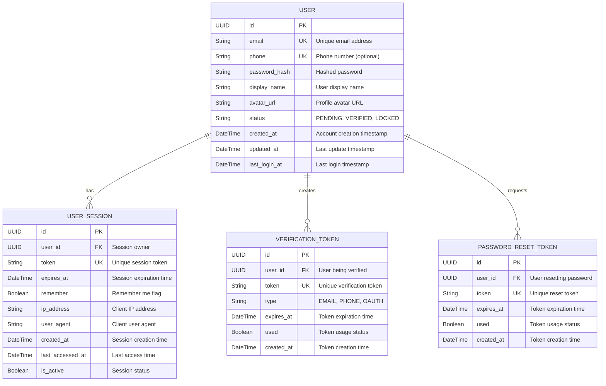

# ERD - Module UC1: Xác Thực và Quản Lý Hồ Sơ Người Dùng

## Overview & Scope

- **Mục tiêu**: Chuẩn hoá tài liệu ERD cho module UC1 (Xác Thực và Quản Lý Hồ Sơ Người Dùng), dùng Mermaid `erDiagram` để mô tả cấu trúc database, entities, attributes, và relationships.
- **Phạm vi**: Module UC1 bao gồm 7 Use Cases: đăng ký tài khoản, đăng nhập hệ thống, đăng xuất hệ thống, xem thông tin cá nhân, cập nhật thông tin cá nhân, đổi mật khẩu, đặt lại mật khẩu.
- **Tài liệu tham chiếu Mermaid**: [Mermaid ER Diagram](https://mermaid.js.org/syntax/entityRelationshipDiagram.html)

## Notation & Conventions

- **Ngôn ngữ**: tiếng Việt, giữ English cho technical terms/identifiers.
- **Naming**:
  - Tên entity PascalCase trong ERD, snake_case cho database tables (ví dụ: `USER` → `users`)
  - Thuộc tính camelCase trong ERD, snake_case trong database (ví dụ: `createdAt` → `created_at`)
  - Primary key: `id` (UUID)
  - Foreign key: `{referenced_entity}_id`
- **Data Types**: 
  - `UUID` cho primary keys
  - `String` cho text fields
  - `DateTime` cho timestamps
  - `Boolean` cho flags
  - `JSON` cho complex data
- **Cardinality**: "1", "0..1", "1..*", "*", "0..n", "1..n"
- **Constraints**: NOT NULL, UNIQUE, DEFAULT values
- **Indexes**: Primary Key (PK), Foreign Key (FK), Unique Index (UQ)

## Module Context

- **Mô tả**: Module xác thực và quản lý hồ sơ người dùng cho phép người dùng đăng ký tài khoản, đăng nhập hệ thống, quản lý thông tin cá nhân và bảo mật tài khoản. Hỗ trợ xác thực qua email, số điện thoại và OAuth với các tính năng bảo mật như session management, token verification và password reset.
- **Actors chính**: User (người dùng)
- **Database layers**: 
  - Core entities: `users`, `user_sessions`
  - Security entities: `verification_tokens`, `password_reset_tokens`
  - Audit/tracking: Embedded trong các tables chính
- **Liên kết UC/SD liên quan**: 
  - UC: UCS01-1 (Đăng ký), UCS01-2 (Đăng nhập), UCS01-3 (Đăng xuất), UCS01-4 (Xem thông tin), UCS01-5 (Cập nhật thông tin), UCS01-6 (Đổi mật khẩu), UCS01-7 (Đặt lại mật khẩu)
  - SD: SD-UCS01-1, SD-UCS01-2, SD-UCS01-3, SD-UCS01-4, SD-UCS01-5, SD-UCS01-6, SD-UCS01-7

## Entity Inventory

| Entity Name | Description | Key Attributes | Relationships | Traceability (UC/SD) |
|---|---|---|---|---|
| USER | Quản lý thông tin người dùng, xác thực và trạng thái tài khoản | id, email, phone, password_hash, display_name, status | has USER_SESSIONS, VERIFICATION_TOKENS, PASSWORD_RESET_TOKENS | UCS01-1,2,3,4,5,6,7; SD-UCS01-1,2,3,4,5,6,7 |
| USER_SESSION | Quản lý phiên đăng nhập của người dùng | id, user_id, token, expires_at, remember | belongs to USER | UCS01-2,3,6; SD-UCS01-2,3,6 |
| VERIFICATION_TOKEN | Lưu trữ token xác thực tài khoản qua email/phone | id, user_id, token, type, expires_at, used | belongs to USER | UCS01-1; SD-UCS01-1 |
| PASSWORD_RESET_TOKEN | Lưu trữ token đặt lại mật khẩu | id, user_id, token, expires_at, used | belongs to USER | UCS01-7; SD-UCS01-7 |

## Diagrams

### Overview ERD

## Detailed Entity Specifications

### USER

- **Intent**: Entity chính đại diện cho người dùng trong domain, quản lý thông tin định danh, xác thực và trạng thái tài khoản.
- **Responsibilities**: 
  - Lưu trữ thông tin định danh và hồ sơ người dùng (email, phone, display name, avatar)
  - Quản lý trạng thái tài khoản trong quy trình xác thực (Pending/Verified/Locked)
  - Lưu trữ thông tin xác thực (password hash) một cách bảo mật
  - Theo dõi hoạt động đăng nhập và cập nhật thông tin
- **Attributes**:
  - `id: UUID` — Primary key, định danh duy nhất; NOT NULL, UNIQUE
  - `email: String` — Email người dùng; NOT NULL, UNIQUE, INDEX
  - `phone: String` — Số điện thoại; NULLABLE, UNIQUE khi có giá trị
  - `password_hash: String` — Mật khẩu đã hash (bcrypt); NOT NULL
  - `display_name: String` — Tên hiển thị; NOT NULL, không rỗng
  - `avatar_url: String` — URL ảnh đại diện; NULLABLE
  - `status: String` — Trạng thái tài khoản (PENDING/VERIFIED/LOCKED); NOT NULL, DEFAULT 'PENDING'
  - `created_at: DateTime` — Thời điểm tạo tài khoản; NOT NULL, DEFAULT CURRENT_TIMESTAMP
  - `updated_at: DateTime` — Thời điểm cập nhật cuối; NOT NULL, DEFAULT CURRENT_TIMESTAMP ON UPDATE
  - `last_login_at: DateTime` — Lần đăng nhập cuối cùng; NULLABLE
- **Relationships**:
  - One-to-Many với USER_SESSION: 1 user có thể có nhiều sessions đồng thời
  - One-to-Many với VERIFICATION_TOKEN: 1 user có thể có nhiều tokens (email, phone)
  - One-to-Many với PASSWORD_RESET_TOKEN: 1 user có thể request nhiều password resets
- **Constraints**: 
  - Email phải tuân thủ format email hợp lệ và unique trong hệ thống
  - Phone phải unique khi có giá trị (partial unique index)
  - Status chỉ có thể là 'PENDING', 'VERIFIED', hoặc 'LOCKED'
  - Một trong hai email hoặc phone phải có giá trị (check constraint)
  - Password hash phải là bcrypt format
- **Indexes**: 
  - PRIMARY KEY (id)
  - UNIQUE INDEX (email)
  - PARTIAL UNIQUE INDEX (phone) WHERE phone IS NOT NULL
  - INDEX (status) — cho filter theo trạng thái
  - INDEX (created_at) — cho sort theo thời gian tạo
- **Design Notes**: 
  - Embed UserProfile (display_name, avatar_url) và Email vào chính bảng USER thay vì tách riêng để đơn giản hóa queries
  - Dùng String enum cho status thay vì separate lookup table cho performance
  - UUID primary key cho better distribution và security
  - Hỗ trợ đăng ký bằng email hoặc phone (không bắt buộc cả hai)

### USER_SESSION

- **Intent**: Quản lý phiên đăng nhập của người dùng, hỗ trợ session-based authentication và security features.
- **Responsibilities**:
  - Lưu trữ thông tin session với token định danh unique
  - Quản lý thời hạn session và "remember me" functionality
  - Theo dõi thông tin client (IP, user agent) cho security audit
  - Hỗ trợ revoke sessions khi đổi mật khẩu hoặc logout
- **Attributes**:
  - `id: UUID` — Primary key; NOT NULL, UNIQUE
  - `user_id: UUID` — User sở hữu session; NOT NULL, FK → users.id
  - `token: String` — Token định danh session; NOT NULL, UNIQUE
  - `expires_at: DateTime` — Thời điểm hết hạn; NOT NULL
  - `remember: Boolean` — Remember me flag; NOT NULL, DEFAULT FALSE
  - `ip_address: String` — IP address của client; NULLABLE
  - `user_agent: String` — User agent của client; NULLABLE  
  - `created_at: DateTime` — Thời điểm tạo session; NOT NULL, DEFAULT CURRENT_TIMESTAMP
  - `last_accessed_at: DateTime` — Lần truy cập cuối; NULLABLE
  - `is_active: Boolean` — Trạng thái session; NOT NULL, DEFAULT TRUE
- **Relationships**:
  - Many-to-One với USER: nhiều sessions thuộc 1 user
- **Constraints**:
  - user_id phải reference existing user
  - token phải unique globally
  - expires_at phải lớn hơn created_at
  - remember = TRUE thì expires_at phải là 30 ngày, FALSE thì 24 giờ
- **Indexes**:
  - PRIMARY KEY (id)
  - UNIQUE INDEX (token)
  - INDEX (user_id, is_active) — query active sessions by user
  - INDEX (expires_at) — cleanup expired sessions
- **Design Notes**:
  - Support multiple concurrent sessions per user cho flexibility
  - ip_address và user_agent cho security monitoring
  - is_active flag để soft revoke sessions mà không xóa record
  - Cleanup strategy cần có cho expired sessions

### VERIFICATION_TOKEN

- **Intent**: Lưu trữ token xác thực tài khoản qua email, số điện thoại hoặc OAuth trong quy trình đăng ký.
- **Responsibilities**:
  - Tạo và quản lý token unique cho xác thực tài khoản
  - Phân biệt loại xác thực (EMAIL, PHONE, OAUTH)
  - Theo dõi trạng thái sử dụng và thời hạn token
  - Hỗ trợ activate tài khoản khi xác thực thành công
- **Attributes**:
  - `id: UUID` — Primary key; NOT NULL, UNIQUE
  - `user_id: UUID` — User cần xác thực; NOT NULL, FK → users.id
  - `token: String` — Token xác thực; NOT NULL, UNIQUE
  - `type: String` — Loại xác thực (EMAIL/PHONE/OAUTH); NOT NULL
  - `expires_at: DateTime` — Thời điểm hết hạn; NOT NULL
  - `used: Boolean` — Trạng thái đã sử dụng; NOT NULL, DEFAULT FALSE
  - `created_at: DateTime` — Thời điểm tạo token; NOT NULL, DEFAULT CURRENT_TIMESTAMP
- **Relationships**:
  - Many-to-One với USER: nhiều verification tokens thuộc 1 user
- **Constraints**:
  - user_id phải reference existing user
  - type chỉ có thể là 'EMAIL', 'PHONE', hoặc 'OAUTH'
  - token phải unique globally
  - expires_at phải lớn hơn created_at
  - Token có thời hạn 24 giờ từ lúc tạo
- **Indexes**:
  - PRIMARY KEY (id)
  - UNIQUE INDEX (token)
  - INDEX (user_id, type) — query tokens by user and type
  - INDEX (expires_at, used) — cleanup expired/used tokens
- **Design Notes**:
  - Support nhiều loại xác thực trong cùng 1 table để đơn giản hóa
  - used flag để mark token đã sử dụng, tránh replay attacks
  - Immutable records sau khi used = TRUE
  - Cleanup policy cho expired và used tokens

### PASSWORD_RESET_TOKEN

- **Intent**: Lưu trữ token đặt lại mật khẩu trong quy trình password recovery.
- **Responsibilities**:
  - Tạo và quản lý token unique cho reset mật khẩu
  - Theo dõi trạng thái sử dụng và thời hạn token
  - Hỗ trợ xác thực token trong quy trình đổi mật khẩu
  - Đảm bảo security cho password reset flow
- **Attributes**:
  - `id: UUID` — Primary key; NOT NULL, UNIQUE
  - `user_id: UUID` — User request reset password; NOT NULL, FK → users.id
  - `token: String` — Token reset mật khẩu; NOT NULL, UNIQUE
  - `expires_at: DateTime` — Thời điểm hết hạn; NOT NULL
  - `used: Boolean` — Trạng thái đã sử dụng; NOT NULL, DEFAULT FALSE
  - `created_at: DateTime` — Thời điểm tạo token; NOT NULL, DEFAULT CURRENT_TIMESTAMP
- **Relationships**:
  - Many-to-One với USER: nhiều reset tokens thuộc 1 user
- **Constraints**:
  - user_id phải reference existing user
  - token phải unique globally
  - expires_at phải lớn hơn created_at
  - Token có thời hạn 24 giờ từ lúc tạo
  - Mỗi user chỉ có 1 token active tại một thời điểm
- **Indexes**:
  - PRIMARY KEY (id)
  - UNIQUE INDEX (token)
  - INDEX (user_id, used) — query active tokens by user
  - INDEX (expires_at, used) — cleanup expired/used tokens
- **Design Notes**:
  - Tương tự VERIFICATION_TOKEN nhưng riêng biệt cho password reset
  - used flag để đảm bảo token chỉ dùng 1 lần
  - Business rule: revoke tất cả tokens cũ khi tạo token mới
  - Immutable records sau khi used = TRUE

## Database Schema Details

### Tables

| Table Name | Description | Primary Key | Foreign Keys | Indexes |
|---|---|---|---|---|
| users | User information, authentication and account status | id | - | email (UQ), phone (UQ partial), status, created_at |
| user_sessions | User session management and tracking | id | user_id → users.id | token (UQ), user_id + is_active, expires_at |
| verification_tokens | Account verification tokens for email/phone/OAuth | id | user_id → users.id | token (UQ), user_id + type, expires_at + used |
| password_reset_tokens | Password reset tokens for recovery flow | id | user_id → users.id | token (UQ), user_id + used, expires_at + used |

### Relationships

| From Table | To Table | Type | Cardinality | Description |
|---|---|---|---|---|
| user_sessions | users | Many-to-One | N:1 | User can have multiple active sessions |
| verification_tokens | users | Many-to-One | N:1 | User can have multiple verification tokens (email, phone) |
| password_reset_tokens | users | Many-to-One | N:1 | User can request multiple password resets over time |

## Traceability Matrix

| UC ID | SD ID | Entities Involved | Notes |
|---|---|---|---|
| UCS01-1 | SD-UCS01-1 | USER, VERIFICATION_TOKEN | Đăng ký tài khoản - INSERT user với status PENDING, tạo verification token, gửi email/SMS |
| UCS01-2 | SD-UCS01-2 | USER, USER_SESSION | Đăng nhập - xác thực user, tạo session với token và expiration |
| UCS01-3 | SD-UCS01-3 | USER_SESSION | Đăng xuất - UPDATE session.is_active = FALSE hoặc DELETE session |
| UCS01-4 | SD-UCS01-4 | USER | Xem thông tin cá nhân - SELECT user profile, embedded UserProfile data |
| UCS01-5 | SD-UCS01-5 | USER | Cập nhật thông tin cá nhân - UPDATE display_name, avatar_url trong users table |
| UCS01-6 | SD-UCS01-6 | USER, USER_SESSION | Đổi mật khẩu - UPDATE password_hash, revoke all sessions (UPDATE is_active = FALSE) |
| UCS01-7 | SD-UCS01-7 | USER, PASSWORD_RESET_TOKEN | Đặt lại mật khẩu - tạo reset token, gửi email/SMS, UPDATE password khi verify token |

## Assumptions & Decisions

- **Giả định chính**: 
  - User có thể đăng ký bằng email hoặc số điện thoại (không bắt buộc cả hai)
  - Hỗ trợ OAuth authentication với Google/Facebook (token type OAUTH)
  - User có thể có nhiều sessions đồng thời (multi-device support)
  - Session có thời hạn mặc định 24h, 30 ngày nếu chọn "remember me"
  - Verification tokens và password reset tokens có thời hạn 24 giờ
  - Mật khẩu được hash bằng bcrypt với salt ngẫu nhiên

- **Quyết định thiết kế**: 
  - Embed Email và UserProfile (display_name, avatar_url) vào users table thay vì separate entities để đơn giản hóa queries
  - Dùng String enums cho UserStatus và VerificationType thay vì lookup tables cho performance
  - UUID primary keys cho better distribution và security
  - Soft revoke sessions bằng is_active flag thay vì hard delete để maintain audit trail
  - Separate tables cho verification và password reset tokens để rõ ràng về purpose
  - Support multiple concurrent sessions per user cho flexibility (mobile + web + tablet)
  - Token cleanup strategy: batch job cleanup expired/used tokens định kỳ

## Open Issues

- **Câu hỏi cần làm rõ**: 
  - Có cần hỗ trợ MFA (Multi-Factor Authentication) cho security cao hơn?
  - Có giới hạn số lượng sessions đồng thời per user?
  - Có cần rate limiting cho các API authentication để chống brute force?
  - Có cần audit log riêng cho authentication events (login attempts, password changes)?
  - Có cần hỗ trợ social login với Apple ID, GitHub, Microsoft?

- **Hạng mục cần xác thực**: 
  - Session cleanup frequency và retention policy
  - Token generation algorithm và entropy requirements
  - Password strength policy và validation rules
  - Email/SMS service integration requirements
  - Performance impact của UUID vs auto-increment IDs
  - Index optimization strategy cho high-volume queries
  - Backup và recovery procedures cho authentication data

