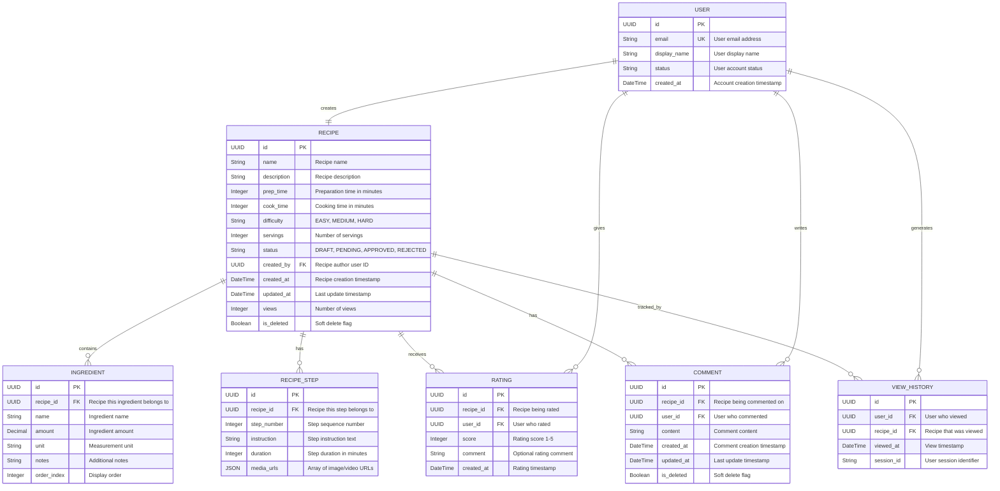

# ERD - Module UC2: Tìm Kiếm và Xem Công Thức

## Overview & Scope

- **Mục tiêu**: Chuẩn hoá tài liệu ERD cho module UC2 (Tìm Kiếm và Xem Công Thức), dùng Mermaid `erDiagram` để mô tả cấu trúc database, entities, attributes, và relationships.
- **Phạm vi**: Module UC2 bao gồm 5 Use Cases: tìm kiếm theo nguyên liệu, tìm kiếm theo tên món ăn, tạo công thức bằng AI, lọc và sắp xếp kết quả, xem chi tiết công thức.
- **Tài liệu tham chiếu Mermaid**: [Mermaid ER Diagram](https://mermaid.js.org/syntax/entityRelationshipDiagram.html)

## Notation & Conventions

- **Ngôn ngữ**: tiếng Việt, giữ English cho technical terms/identifiers.
- **Naming**:
  - Tên entity PascalCase trong ERD, snake_case cho database tables (ví dụ: `RECIPE` → `recipes`)
  - Thuộc tính camelCase trong ERD, snake_case trong database (ví dụ: `createdAt` → `created_at`)
  - Primary key: `id` (UUID)
  - Foreign key: `{referenced_entity}_id`
- **Data Types**: 
  - `UUID` cho primary keys
  - `String` cho text fields
  - `DateTime` cho timestamps
  - `Boolean` cho flags
  - `JSON` cho complex data
  - `Integer` cho numeric values
  - `Decimal` cho ratings/scores
- **Cardinality**: "1", "0..1", "1..*", "*", "0..n", "1..n"
- **Constraints**: NOT NULL, UNIQUE, DEFAULT values
- **Indexes**: Primary Key (PK), Foreign Key (FK), Unique Index (UQ), Composite Index (IDX)

## Module Context

- **Mô tả**: Module tìm kiếm và xem công thức cho phép người dùng tìm kiếm công thức theo nguyên liệu hoặc tên món ăn với thuật toán ranking 3 mức ưu tiên, sử dụng AI để tạo công thức mới khi không tìm thấy kết quả phù hợp, lọc và sắp xếp kết quả theo nhiều tiêu chí, và xem chi tiết công thức với đầy đủ thông tin bao gồm nguyên liệu, các bước thực hiện, đánh giá và bình luận.
- **Actors chính**: User (người dùng)
- **Database layers**: 
  - Core entities: `recipes`, `ingredients`, `recipe_steps`
  - Rating/social entities: `ratings`, `comments`, `view_history`
  - Supporting tables: Enum lookups embedded trong core entities
- **Liên kết UC/SD liên quan**: 
  - UC: UCS02-1 (Tìm kiếm theo nguyên liệu), UCS02-2 (Tìm kiếm theo tên), UCS02-3 (Tạo công thức AI), UCS02-4 (Lọc và sắp xếp), UCS02-5 (Xem chi tiết)
  - SD: SD-UCS02-1, SD-UCS02-2, SD-UCS02-3, SD-UCS02-4, SD-UCS02-5

## Entity Inventory

| Entity Name | Description | Key Attributes | Relationships | Traceability (UC/SD) |
|---|---|---|---|---|
| RECIPE | Quản lý thông tin công thức, trạng thái và metadata | id, name, description, prep_time, cook_time, difficulty, status, views | has INGREDIENTS, RECIPE_STEPS, RATINGS, COMMENTS, VIEW_HISTORY | UCS02-1,2,3,4,5; SD-UCS02-1,2,3,4,5 |
| INGREDIENT | Lưu trữ nguyên liệu của từng công thức với định lượng | id, recipe_id, name, amount, unit, notes | belongs to RECIPE | UCS02-1,2,5; SD-UCS02-1,2,5 |
| RECIPE_STEP | Quản lý các bước thực hiện công thức theo thứ tự | id, recipe_id, step_number, instruction, duration, media_urls | belongs to RECIPE | UCS02-3,5; SD-UCS02-3,5 |
| RATING | Lưu trữ đánh giá của người dùng cho công thức | id, recipe_id, user_id, score, comment, created_at | belongs to RECIPE | UCS02-5; SD-UCS02-5 |
| COMMENT | Quản lý bình luận của người dùng trên công thức | id, recipe_id, user_id, content, created_at, updated_at | belongs to RECIPE | UCS02-5; SD-UCS02-5 |
| VIEW_HISTORY | Theo dõi lịch sử xem công thức của người dùng | id, user_id, recipe_id, viewed_at | belongs to RECIPE and USER | UCS02-5; SD-UCS02-5 |

## Diagrams

### Overview ERD



## Detailed Entity Specs

### RECIPE

- **Intent**: Entity chính đại diện cho công thức nấu ăn trong hệ thống, quản lý thông tin cơ bản, trạng thái phê duyệt và metadata.
- **Responsibilities**: 
  - Lưu trữ thông tin cơ bản của công thức (tên, mô tả, thời gian, độ khó)
  - Quản lý trạng thái phê duyệt (Draft/Pending/Approved/Rejected)
  - Theo dõi số lượt xem và thống kê
  - Hỗ trợ soft delete để bảo toàn dữ liệu lịch sử
- **Attributes**:
  - `id: UUID` — Primary key, định danh duy nhất; NOT NULL, UNIQUE
  - `name: String` — Tên công thức; NOT NULL, LENGTH(1,200)
  - `description: String` — Mô tả chi tiết công thức; NOT NULL, LENGTH(1,2000)
  - `prep_time: Integer` — Thời gian chuẩn bị (phút); NOT NULL, >= 0
  - `cook_time: Integer` — Thời gian nấu (phút); NOT NULL, >= 0
  - `difficulty: String` — Mức độ khó (EASY/MEDIUM/HARD); NOT NULL
  - `servings: Integer` — Số khẩu phần; NOT NULL, > 0
  - `status: String` — Trạng thái (DRAFT/PENDING/APPROVED/REJECTED); NOT NULL, DEFAULT 'DRAFT'
  - `created_by: UUID` — ID người tạo; NOT NULL, FK to USER(id)
  - `created_at: DateTime` — Thời điểm tạo; NOT NULL, DEFAULT NOW()
  - `updated_at: DateTime` — Lần cập nhật cuối; NOT NULL, DEFAULT NOW()
  - `views: Integer` — Số lượt xem; NOT NULL, DEFAULT 0, >= 0
  - `is_deleted: Boolean` — Cờ soft delete; NOT NULL, DEFAULT FALSE
- **Indexes**:
  - PRIMARY KEY (id)
  - INDEX idx_recipe_status_created (status, created_at) -- for admin listing
  - INDEX idx_recipe_search_name (name) -- for text search
  - INDEX idx_recipe_views (views DESC) -- for popular recipes
  - INDEX idx_recipe_author (created_by) -- for user's recipes
  - INDEX idx_recipe_difficulty (difficulty) -- for filtering
- **Constraints**:
  - CHECK (prep_time >= 0)
  - CHECK (cook_time >= 0)
  - CHECK (servings > 0)
  - CHECK (views >= 0)
  - CHECK (difficulty IN ('EASY', 'MEDIUM', 'HARD'))
  - CHECK (status IN ('DRAFT', 'PENDING', 'APPROVED', 'REJECTED'))
- **Relations**:
  - 1-to-many với INGREDIENT: recipe_id foreign key
  - 1-to-many với RECIPE_STEP: recipe_id foreign key
  - 1-to-many với RATING: recipe_id foreign key
  - 1-to-many với COMMENT: recipe_id foreign key
  - 1-to-many với VIEW_HISTORY: recipe_id foreign key
  - Many-to-1 với USER: created_by foreign key

### RATING

- **Intent**: Entity lưu trữ đánh giá của người dùng cho công thức, hỗ trợ tính toán điểm trung bình và thống kê.
- **Responsibilities**:
  - Lưu trữ điểm đánh giá từ 1-5 sao
  - Ghi nhận comment tùy chọn kèm đánh giá
  - Đảm bảo mỗi user chỉ đánh giá 1 lần cho 1 công thức
  - Hỗ trợ tính toán điểm trung bình và thống kê
- **Attributes**:
  - `id: UUID` — Primary key; NOT NULL, UNIQUE
  - `recipe_id: UUID` — ID công thức được đánh giá; NOT NULL, FK to RECIPE(id)
  - `user_id: UUID` — ID người đánh giá; NOT NULL, FK to USER(id)
  - `score: Integer` — Điểm đánh giá 1-5; NOT NULL, RANGE(1,5)
  - `comment: String` — Bình luận tùy chọn; NULL, LENGTH(0,1000)
  - `created_at: DateTime` — Thời điểm đánh giá; NOT NULL, DEFAULT NOW()
- **Indexes**:
  - PRIMARY KEY (id)
  - UNIQUE KEY uk_rating_user_recipe (user_id, recipe_id) -- prevent duplicate ratings
  - INDEX idx_rating_recipe (recipe_id) -- for aggregation queries
  - INDEX idx_rating_score (score) -- for filtering by rating
- **Constraints**:
  - CHECK (score >= 1 AND score <= 5)
  - FOREIGN KEY (recipe_id) REFERENCES recipes(id) ON DELETE CASCADE
  - FOREIGN KEY (user_id) REFERENCES users(id) ON DELETE CASCADE
- **Relations**:
  - Many-to-1 với RECIPE: recipe_id foreign key
  - Many-to-1 với USER: user_id foreign key

### COMMENT

- **Intent**: Entity quản lý bình luận của người dùng trên công thức, hỗ trợ tương tác xã hội.
- **Responsibilities**:
  - Lưu trữ nội dung bình luận từ người dùng
  - Quản lý thời gian tạo và cập nhật
  - Hỗ trợ soft delete để bảo toàn context
  - Theo dõi lịch sử chỉnh sửa bình luận
- **Attributes**:
  - `id: UUID` — Primary key; NOT NULL, UNIQUE
  - `recipe_id: UUID` — ID công thức được bình luận; NOT NULL, FK to RECIPE(id)
  - `user_id: UUID` — ID người bình luận; NOT NULL, FK to USER(id)
  - `content: String` — Nội dung bình luận; NOT NULL, LENGTH(1,2000)
  - `created_at: DateTime` — Thời điểm tạo; NOT NULL, DEFAULT NOW()
  - `updated_at: DateTime` — Lần cập nhật cuối; NULL
  - `is_deleted: Boolean` — Cờ soft delete; NOT NULL, DEFAULT FALSE
- **Indexes**:
  - PRIMARY KEY (id)
  - INDEX idx_comment_recipe_created (recipe_id, created_at DESC) -- for recipe comments listing
  - INDEX idx_comment_user (user_id) -- for user's comments
- **Constraints**:
  - CHECK (LENGTH(content) >= 1)
  - FOREIGN KEY (recipe_id) REFERENCES recipes(id) ON DELETE CASCADE
  - FOREIGN KEY (user_id) REFERENCES users(id) ON DELETE CASCADE
- **Relations**:
  - Many-to-1 với RECIPE: recipe_id foreign key
  - Many-to-1 với USER: user_id foreign key

## Relationships & Constraints

### Primary Relationships

1. **RECIPE → INGREDIENT** (1:many)
   - Một công thức có nhiều nguyên liệu
   - CASCADE DELETE: xóa công thức sẽ xóa tất cả nguyên liệu
   - Business rule: Mỗi công thức phải có ít nhất 2 nguyên liệu

2. **RECIPE → RECIPE_STEP** (1:many)
   - Một công thức có nhiều bước thực hiện
   - CASCADE DELETE: xóa công thức sẽ xóa tất cả bước
   - Business rule: Mỗi công thức phải có ít nhất 1 bước

3. **RECIPE → RATING** (1:many)
   - Một công thức có thể có nhiều đánh giá
   - CASCADE DELETE: xóa công thức sẽ xóa tất cả đánh giá
   - Business rule: Mỗi user chỉ được đánh giá 1 lần cho 1 công thức

4. **USER → RECIPE** (1:many)
   - Một user có thể tạo nhiều công thức
   - RESTRICT DELETE: không được xóa user nếu còn công thức
   - Business rule: Chỉ tác giả mới được sửa/xóa công thức DRAFT

### Database Indexes Strategy

```sql
-- Search performance indexes
CREATE INDEX idx_recipe_search_fulltext ON recipes USING gin(to_tsvector('vietnamese', name || ' ' || description));
CREATE INDEX idx_ingredient_search ON ingredients(name);

-- Filtering and sorting indexes  
CREATE INDEX idx_recipe_filter_multi ON recipes(status, difficulty, servings, prep_time, cook_time);
CREATE INDEX idx_recipe_popular ON recipes(views DESC, created_at DESC);
CREATE INDEX idx_recipe_rating_avg ON ratings(recipe_id, score); -- for aggregation

-- Performance critical indexes
CREATE INDEX idx_view_history_user_recent ON view_history(user_id, viewed_at DESC);
CREATE INDEX idx_comment_recipe_timeline ON comments(recipe_id, created_at DESC) WHERE is_deleted = FALSE;
```

### Data Integrity Rules

1. **Recipe Status Workflow**:
   - DRAFT → PENDING (user submits)
   - PENDING → APPROVED|REJECTED (admin decides)  
   - APPROVED → REJECTED (admin can reject later)
   - Only APPROVED recipes visible in search

2. **Rating Constraints**:
   - Score must be 1-5 integer
   - One rating per user per recipe
   - Can update existing rating

3. **Soft Delete Policy**:
   - Recipes: set is_deleted = TRUE, keep in database
   - Comments: set is_deleted = TRUE, show "[deleted]" in UI
   - Ratings/Views: hard delete (no referential impact)

## Traceability Matrix

| UC ID | SD ID | Entities Involved | Key Operations | Notes |
|---|---|---|---|---|
| UCS02-1 | SD-UCS02-1 | RECIPE, INGREDIENT | SELECT with JOIN, ingredient matching algorithm | Tìm kiếm theo nguyên liệu với thuật toán ranking 3 mức |
| UCS02-2 | SD-UCS02-2 | RECIPE | SELECT with fulltext search, similarity scoring | Tìm kiếm theo tên với fuzzy matching |
| UCS02-3 | SD-UCS02-3 | RECIPE, INGREDIENT, RECIPE_STEP | INSERT new recipe with related entities | Tạo công thức bằng AI, lưu tạm thời 24h |
| UCS02-4 | SD-UCS02-4 | RECIPE | SELECT with WHERE/ORDER BY clauses | Lọc và sắp xếp kết quả theo tiêu chí |
| UCS02-5 | SD-UCS02-5 | RECIPE, INGREDIENT, RECIPE_STEP, RATING, COMMENT, VIEW_HISTORY | SELECT aggregation, INSERT view record, UPDATE view count | Xem chi tiết với tăng view count |

## Database Considerations

### Performance Assumptions

- **Read-heavy workload**: 90% SELECT, 10% INSERT/UPDATE
- **Search frequency**: Ingredient search 60%, name search 40%
- **Concurrent users**: ~1000 active users peak
- **Recipe volume**: ~100k recipes, 1M ingredients, 500k ratings
- **Growth rate**: 20% per year

### Scaling Strategies

1. **Caching Strategy**:
   - Redis for search results (30 minutes TTL)
   - Application-level cache for popular recipes
   - CDN for recipe images/media

2. **Search Optimization**:
   - PostgreSQL full-text search for Vietnamese
   - Elasticsearch for advanced search features
   - Pre-computed aggregations for ratings

3. **Database Partitioning**:
   - Partition VIEW_HISTORY by date (monthly)
   - Consider partitioning RECIPES by status for admin queries

### Data Retention Policies

- **View History**: Keep 2 years, then archive
- **Ratings/Comments**: Keep indefinitely (business value)
- **Soft-deleted Recipes**: Keep 1 year, then hard delete
- **AI-generated temp recipes**: Auto-delete after 24 hours

## Open Issues

- **Câu hỏi cần làm rõ**: 
  - Có cần hỗ trợ recipe variations/versions (v1, v2, v3)?
  - Có cần category/tags cho recipes ngoài difficulty?
  - Có cần hỗ trợ recipe collections/favorites?
  - Có cần nutrition information per recipe?
  - Có cần recipe sharing/privacy settings?

- **Hạng mục cần xác thực**: 
  - Text search performance với tiếng Việt
  - Ingredient matching algorithm complexity
  - AI recipe temporary storage duration
  - View counting accuracy vs performance trade-off
  - Comment threading/reply structure cần thiết không?
