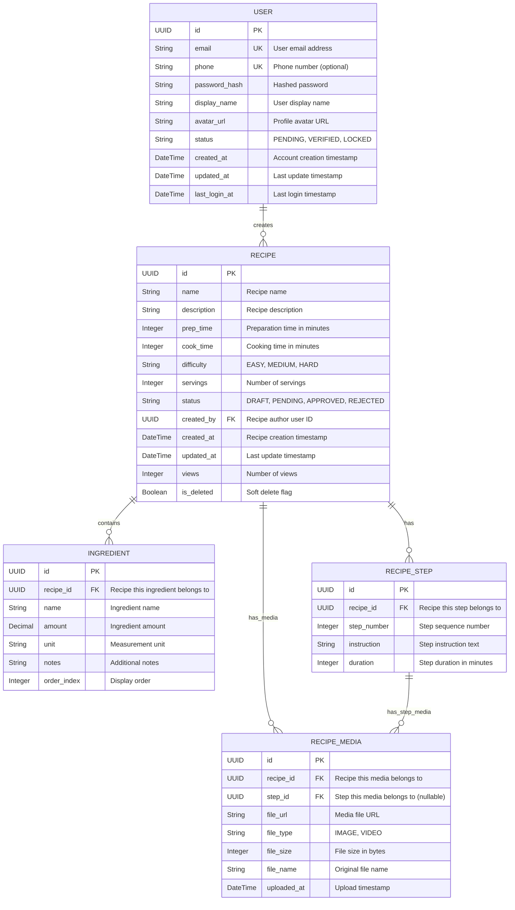

# ERD - Module UC3: Quản Lý Công Thức Người Dùng

## Overview & Scope

- **Mục tiêu**: Chuẩn hoá tài liệu ERD cho module UC3 (Quản Lý Công Thức Người Dùng), dùng Mermaid `erDiagram` để mô tả cấu trúc database, entities, attributes, và relationships.
- **Phạm vi**: Module UC3 bao gồm 4 Use Cases: thêm công thức mới, xem danh sách công thức đã tạo, chỉnh sửa công thức đã tạo, và xóa công thức đã tạo.
- **Tài liệu tham chiếu Mermaid**: [Mermaid ER Diagram](https://mermaid.js.org/syntax/entityRelationshipDiagram.html)

## Notation & Conventions

- **Ngôn ngữ**: tiếng Việt, giữ English cho technical terms/identifiers.
- **Naming**:
  - Tên entity PascalCase trong ERD, snake_case cho database tables (ví dụ: `RECIPE` → `recipes`)
  - Thuộc tính camelCase trong ERD, snake_case trong database (ví dụ: `createdAt` → `created_at`)
  - Primary key: `id` (UUID)
  - Foreign key: `{referenced_entity}_id`
- **Data Types**: 
  - `UUID` cho primary keys
  - `String` cho text fields
  - `DateTime` cho timestamps
  - `Boolean` cho flags
  - `JSON` cho complex data
  - `Integer` cho numeric values
  - `Decimal` cho amounts
- **Cardinality**: "1", "0..1", "1..*", "*", "0..n", "1..n"
- **Constraints**: NOT NULL, UNIQUE, DEFAULT values
- **Indexes**: Primary Key (PK), Foreign Key (FK), Unique Index (UQ), Composite Index (IDX)

## Module Context

- **Mô tả**: Module quản lý công thức người dùng cho phép người dùng đã đăng nhập tạo, xem, chỉnh sửa và xóa các công thức do mình tạo ra. Hỗ trợ upload media, validation, và quản lý trạng thái công thức (Draft/Pending/Approved/Rejected). Module này tập trung vào CRUD operations cho công thức cá nhân của người dùng.
- **Actors chính**: User (người dùng đã đăng nhập)
- **Database layers**: 
  - Core entities: `recipes` (shared với UC2), `ingredients`, `recipe_steps`
  - Media management: `recipe_media`
  - User reference: `users` (từ UC1 module)
  - Audit/tracking: Embedded trong các tables chính
- **Liên kết UC/SD liên quan**: 
  - UC: UCS03-1 (Thêm công thức mới), UCS03-2 (Xem danh sách công thức đã tạo), UCS03-3 (Chỉnh sửa công thức đã tạo), UCS03-4 (Xóa công thức đã tạo)
  - SD: SD-UCS03-1, SD-UCS03-2, SD-UCS03-3, SD-UCS03-4

## Entity Inventory

| Entity Name | Description | Key Attributes | Relationships | Traceability (UC/SD) |
|---|---|---|---|---|
| RECIPE | Quản lý thông tin công thức của người dùng, trạng thái và metadata | id, name, description, prep_time, cook_time, difficulty, status, created_by | has INGREDIENTS, RECIPE_STEPS, RECIPE_MEDIA; belongs to USER | UCS03-1,2,3,4; SD-UCS03-1,2,3,4 |
| INGREDIENT | Lưu trữ nguyên liệu của từng công thức với định lượng | id, recipe_id, name, amount, unit, notes, order_index | belongs to RECIPE | UCS03-1,3; SD-UCS03-1,3 |
| RECIPE_STEP | Quản lý các bước thực hiện công thức theo thứ tự | id, recipe_id, step_number, instruction, duration | belongs to RECIPE | UCS03-1,3; SD-UCS03-1,3 |
| RECIPE_MEDIA | Quản lý media files (ảnh, video) liên quan đến công thức và steps | id, recipe_id, step_id, file_url, file_type, file_size | belongs to RECIPE or RECIPE_STEP | UCS03-1,3,4; SD-UCS03-1,3,4 |
| USER | Reference đến user information từ UC1 module | id, email, phone, password_hash, display_name, status | creates RECIPE | UCS03-1,2,3,4; SD-UCS03-1,2,3,4 |

## Diagrams

### Overview ERD

## Detailed Entity Specifications

### RECIPE

- **Intent**: Entity chính đại diện cho công thức do người dùng tạo trong hệ thống, quản lý thông tin cơ bản, trạng thái phê duyệt và ownership.
- **Responsibilities**: 
  - Lưu trữ thông tin cơ bản của công thức (tên, mô tả, thời gian, độ khó)
  - Quản lý trạng thái trong workflow phê duyệt (Draft/Pending/Approved/Rejected)
  - Theo dõi ownership và thống kê (lượt xem)
  - Hỗ trợ soft delete để bảo toàn dữ liệu và references
- **Attributes**:
  - `id: UUID` — Primary key, định danh duy nhất; NOT NULL, UNIQUE
  - `name: String` — Tên công thức; NOT NULL, LENGTH(1,200)
  - `description: String` — Mô tả chi tiết công thức; NOT NULL, LENGTH(1,2000)
  - `prep_time: Integer` — Thời gian chuẩn bị (phút); NOT NULL, >= 0
  - `cook_time: Integer` — Thời gian nấu (phút); NOT NULL, >= 0
  - `difficulty: String` — Mức độ khó (EASY/MEDIUM/HARD); NOT NULL
  - `servings: Integer` — Số khẩu phần; NOT NULL, > 0
  - `status: String` — Trạng thái (DRAFT/PENDING/APPROVED/REJECTED); NOT NULL, DEFAULT 'DRAFT'
  - `created_by: UUID` — ID người tạo; NOT NULL, FK to USER(id)
  - `created_at: DateTime` — Thời điểm tạo; NOT NULL, DEFAULT NOW()
  - `updated_at: DateTime` — Lần cập nhật cuối; NOT NULL, DEFAULT NOW()
  - `views: Integer` — Số lượt xem; NOT NULL, DEFAULT 0, >= 0
  - `is_deleted: Boolean` — Cờ soft delete; NOT NULL, DEFAULT FALSE
- **Relationships**:
  - One-to-Many với INGREDIENT: 1 recipe có nhiều nguyên liệu
  - One-to-Many với RECIPE_STEP: 1 recipe có nhiều bước thực hiện
  - One-to-Many với RECIPE_MEDIA: 1 recipe có thể có nhiều media files
  - Many-to-One với USER: nhiều recipes thuộc 1 user
- **Constraints**: 
  - CHECK (prep_time >= 0)
  - CHECK (cook_time >= 0)
  - CHECK (servings > 0)
  - CHECK (views >= 0)
  - CHECK (difficulty IN ('EASY', 'MEDIUM', 'HARD'))
  - CHECK (status IN ('DRAFT', 'PENDING', 'APPROVED', 'REJECTED'))
  - FOREIGN KEY (created_by) REFERENCES users(id) ON DELETE RESTRICT
- **Indexes**: 
  - PRIMARY KEY (id)
  - INDEX idx_recipe_user_status (created_by, status, created_at DESC) -- for user's recipes listing
  - INDEX idx_recipe_name_search (name) -- for text search within user recipes
  - INDEX idx_recipe_status (status) -- for admin/system queries
  - INDEX idx_recipe_updated (updated_at DESC) -- for recent updates
- **Design Notes**: 
  - Extend RECIPE table từ UC2 với ownership (created_by) và user-specific features
  - Soft delete để preserve references và audit trail
  - Status workflow: DRAFT → PENDING → APPROVED/REJECTED
  - views counter để track popularity trong personal recipes

### INGREDIENT

- **Intent**: Entity lưu trữ nguyên liệu của từng công thức với thông tin định lượng và ghi chú.
- **Responsibilities**:
  - Lưu trữ tên nguyên liệu và định lượng cụ thể
  - Quản lý đơn vị đo lường và ghi chú bổ sung
  - Duy trì thứ tự hiển thị trong công thức
  - Cascade delete khi recipe bị xóa
- **Attributes**:
  - `id: UUID` — Primary key; NOT NULL, UNIQUE
  - `recipe_id: UUID` — ID công thức chứa nguyên liệu; NOT NULL, FK to RECIPE(id)
  - `name: String` — Tên nguyên liệu; NOT NULL, LENGTH(1,100)
  - `amount: Decimal` — Số lượng nguyên liệu; NOT NULL, > 0, PRECISION(10,3)
  - `unit: String` — Đơn vị đo (kg, gram, ml, cup, etc.); NOT NULL, LENGTH(1,20)
  - `notes: String` — Ghi chú bổ sung; NULL, LENGTH(0,500)
  - `order_index: Integer` — Thứ tự hiển thị; NOT NULL, >= 0
- **Relationships**:
  - Many-to-One với RECIPE: nhiều ingredients thuộc 1 recipe
- **Constraints**:
  - CHECK (amount > 0)
  - CHECK (order_index >= 0)
  - FOREIGN KEY (recipe_id) REFERENCES recipes(id) ON DELETE CASCADE
  - UNIQUE KEY uk_ingredient_recipe_order (recipe_id, order_index) -- prevent duplicate order within recipe
- **Indexes**:
  - PRIMARY KEY (id)
  - INDEX idx_ingredient_recipe_order (recipe_id, order_index) -- for ordered listing
  - INDEX idx_ingredient_name (name) -- for ingredient search
- **Design Notes**:
  - Value object từ Class Diagram được normalize thành separate table
  - order_index để maintain display order khi edit recipe
  - Cascade delete để đảm bảo data consistency
  - Decimal type cho amount để support fractional quantities

### RECIPE_STEP

- **Intent**: Entity quản lý các bước thực hiện công thức theo thứ tự, với hướng dẫn chi tiết.
- **Responsibilities**:
  - Lưu trữ instruction text cho từng bước
  - Quản lý thứ tự các bước (step_number)
  - Theo dõi thời gian thực hiện ước tính cho mỗi bước
  - Liên kết với media files qua RECIPE_MEDIA table
- **Attributes**:
  - `id: UUID` — Primary key; NOT NULL, UNIQUE
  - `recipe_id: UUID` — ID công thức chứa bước này; NOT NULL, FK to RECIPE(id)
  - `step_number: Integer` — Số thứ tự bước; NOT NULL, > 0
  - `instruction: String` — Hướng dẫn thực hiện; NOT NULL, LENGTH(1,1000)
  - `duration: Integer` — Thời gian thực hiện ước tính (phút); NULL, >= 0
- **Relationships**:
  - Many-to-One với RECIPE: nhiều steps thuộc 1 recipe
  - One-to-Many với RECIPE_MEDIA: 1 step có thể có nhiều media files
- **Constraints**:
  - CHECK (step_number > 0)
  - CHECK (duration >= 0 OR duration IS NULL)
  - FOREIGN KEY (recipe_id) REFERENCES recipes(id) ON DELETE CASCADE
  - UNIQUE KEY uk_step_recipe_number (recipe_id, step_number) -- prevent duplicate step numbers
- **Indexes**:
  - PRIMARY KEY (id)
  - INDEX idx_step_recipe_number (recipe_id, step_number) -- for ordered listing
- **Design Notes**:
  - Value object được normalize để support media attachments per step
  - step_number ensures proper ordering và prevents gaps
  - duration optional cho flexible recipe creation
  - Media files handled separately trong RECIPE_MEDIA table

### RECIPE_MEDIA

- **Intent**: Entity quản lý media files (ảnh, video) liên quan đến công thức và các bước thực hiện.
- **Responsibilities**:
  - Lưu trữ metadata của media files (URL, type, size)
  - Liên kết media với recipe hoặc specific recipe step
  - Theo dõi thông tin file cho cleanup operations
  - Hỗ trợ multiple media types (IMAGE, VIDEO)
- **Attributes**:
  - `id: UUID` — Primary key; NOT NULL, UNIQUE
  - `recipe_id: UUID` — ID công thức chứa media; NOT NULL, FK to RECIPE(id)
  - `step_id: UUID` — ID bước chứa media; NULL, FK to RECIPE_STEP(id)
  - `file_url: String` — URL đến media file; NOT NULL, LENGTH(1,500)
  - `file_type: String` — Loại file (IMAGE/VIDEO); NOT NULL
  - `file_size: Integer` — Kích thước file (bytes); NOT NULL, > 0
  - `file_name: String` — Tên file gốc; NOT NULL, LENGTH(1,255)
  - `uploaded_at: DateTime` — Thời điểm upload; NOT NULL, DEFAULT NOW()
- **Relationships**:
  - Many-to-One với RECIPE: nhiều media thuộc 1 recipe
  - Many-to-One với RECIPE_STEP: nhiều media có thể thuộc 1 step (optional)
- **Constraints**:
  - CHECK (file_size > 0)
  - CHECK (file_type IN ('IMAGE', 'VIDEO'))
  - FOREIGN KEY (recipe_id) REFERENCES recipes(id) ON DELETE CASCADE
  - FOREIGN KEY (step_id) REFERENCES recipe_steps(id) ON DELETE CASCADE
  - CHECK (step_id IS NULL OR EXISTS(SELECT 1 FROM recipe_steps WHERE id = step_id AND recipe_id = RECIPE_MEDIA.recipe_id))
- **Indexes**:
  - PRIMARY KEY (id)
  - INDEX idx_media_recipe (recipe_id) -- for recipe media listing
  - INDEX idx_media_step (step_id) -- for step media listing
  - INDEX idx_media_type (file_type) -- for filtering by media type
- **Design Notes**:
  - Separate table để handle complex media relationships
  - step_id nullable để support recipe-level media (thumbnails, etc.)
  - file metadata để support cleanup và validation
  - Cascade delete để maintain data consistency

## Database Schema Details

### Tables

| Table Name | Description | Primary Key | Foreign Keys | Indexes |
|---|---|---|---|---|
| recipes | User recipe information and metadata | id | created_by → users.id | created_by + status, name, updated_at |
| ingredients | Recipe ingredients with quantities | id | recipe_id → recipes.id | recipe_id + order_index, name |
| recipe_steps | Recipe preparation steps in order | id | recipe_id → recipes.id | recipe_id + step_number |
| recipe_media | Media files for recipes and steps | id | recipe_id → recipes.id, step_id → recipe_steps.id | recipe_id, step_id, file_type |

### Relationships

| From Table | To Table | Type | Cardinality | Description |
|---|---|---|---|---|
| recipes | users | Many-to-One | N:1 | User can create multiple recipes |
| ingredients | recipes | Many-to-One | N:1 | Recipe contains multiple ingredients |
| recipe_steps | recipes | Many-to-One | N:1 | Recipe has multiple preparation steps |
| recipe_media | recipes | Many-to-One | N:1 | Recipe can have multiple media files |
| recipe_media | recipe_steps | Many-to-One | N:1 | Step can have multiple media files (optional) |

## Traceability Matrix

| UC ID | SD ID | Entities Involved | Key Operations | Notes |
|---|---|---|---|---|
| UCS03-1 | SD-UCS03-1 | RECIPE, INGREDIENT, RECIPE_STEP, RECIPE_MEDIA, USER | INSERT recipe with related entities, media upload | Tạo công thức mới với ingredients, steps và media files |
| UCS03-2 | SD-UCS03-2 | RECIPE, USER | SELECT recipes by user with filtering, pagination, stats aggregation | Xem danh sách công thức cá nhân với filter và thống kê |
| UCS03-3 | SD-UCS03-3 | RECIPE, INGREDIENT, RECIPE_STEP, RECIPE_MEDIA | UPDATE recipe và related entities, media management | Chỉnh sửa công thức với validation và media updates |
| UCS03-4 | SD-UCS03-4 | RECIPE, INGREDIENT, RECIPE_STEP, RECIPE_MEDIA | Soft DELETE recipe, CASCADE delete related data, media cleanup | Xóa công thức với confirmation và cleanup |

## Assumptions & Decisions

- **Giả định chính**: 
  - User chỉ có thể CRUD công thức do mình tạo (ownership-based access control)
  - Recipe có workflow trạng thái: DRAFT → PENDING → APPROVED/REJECTED
  - Soft delete cho recipes để preserve audit trail và references
  - Media files được stored externally (S3, CDN), database chỉ lưu metadata
  - Mỗi recipe phải có ít nhất 1 ingredient và 1 step
  - User có thể có unlimited số lượng recipes (no quotas)
  - Integration với existing USER table từ UC1 (authentication module)
  
- **Quyết định thiết kế**: 
  - Reuse RECIPE table từ UC2 với extended ownership và user-specific features
  - Normalize Ingredient và RecipeStep value objects thành separate tables để support ordering và media attachments
  - Separate RECIPE_MEDIA table để handle complex media relationships (recipe-level và step-level media)
  - Use order_index cho ingredients và step_number cho recipe_steps để maintain display order
  - Cascade delete cho related entities khi recipe bị xóa để ensure data consistency
  - Status workflow tuân theo business rules từ Class Diagram UC3
  - UUID primary keys để consistent với UC1/UC2 và better security
  - Reference USER table từ UC1 module để maintain consistency across modules

## Open Issues

- **Câu hỏi cần làm rõ**: 
  - Có cần hỗ trợ recipe versioning khi user update recipes?
  - Có giới hạn số lượng ingredients/steps per recipe không?
  - Có cần hỗ trợ recipe templates hoặc duplication features?
  - Có cần track detailed edit history cho recipes?
  - Có cần hỗ trợ collaborative editing (multiple users per recipe)?
  
- **Hạng mục cần xác thực**: 
  - Media file size limits và storage quotas per user
  - Recipe approval workflow timing và notifications
  - Search performance trong personal recipe collections
  - Data retention policy cho soft-deleted recipes
  - Integration với UC2 cho approved recipes visibility
  - Backup strategy cho user-generated content