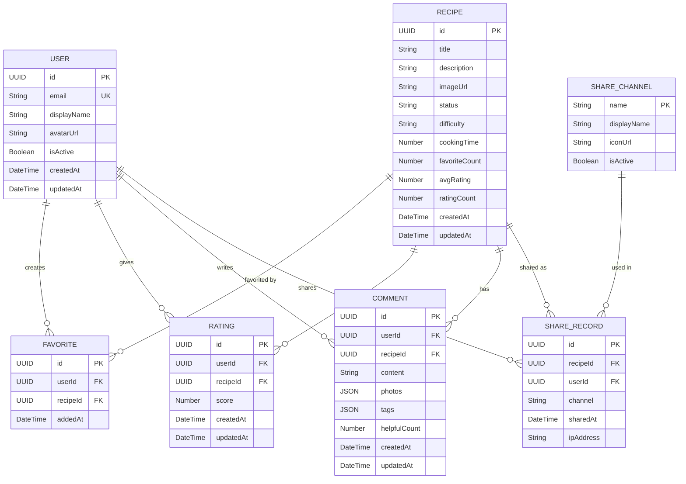

# ERD UC4 - Entity Relationship Diagram: Quản Lý Yêu Thích và Đánh Giá

## Overview & Scope

- **Mục tiêu**: Chuẩn hoá tài liệu ERD (Entity Relationship Diagram) cho module UC4 - Quản lý yêu thích và đánh giá, dùng Mermaid `erDiagram` để mô tả cấu trúc database, entities, attributes, và relationships.
- **Phạm vi**: Module UC4 bao gồm 6 Use Cases: thêm/gỡ công thức yêu thích, xem danh sách yêu thích, gửi và xem đánh giá/bình luận, chia sẻ công thức qua các kênh khác nhau.
- **Tài liệu tham chiếu Mermaid**: [Mermaid ER Diagram](https://mermaid.js.org/syntax/entityRelationshipDiagram.html)

## Notation & Conventions

- **Ngôn ngữ**: tiếng Việt, giữ English cho technical terms/identifiers.
- **Naming**:
  - Tên entity PascalCase (ví dụ: `Favorite`), thuộc tính camelCase (ví dụ: `createdAt`).
  - Primary key: `id` hoặc `{entityName}Id`
  - Foreign key: `{referencedEntity}Id`
- **Data Types**: 
  - `UUID` cho primary keys
  - `String` cho text fields
  - `DateTime` cho timestamps
  - `Decimal` cho số thập phân
  - `Boolean` cho flags
  - `JSON` cho complex data
- **Cardinality**: "1", "0..1", "1..*", "*", "0..n", "1..n"
- **Constraints**: NOT NULL, UNIQUE, DEFAULT values
- **Indexes**: Primary Key (PK), Foreign Key (FK), Unique Index (UQ)

## Module Context

- **Mô tả**: Module UC4 quản lý tính năng yêu thích và đánh giá, cho phép người dùng lưu công thức yêu thích, đánh giá và bình luận về công thức, xem phản hồi từ cộng đồng, và chia sẻ công thức qua các kênh khác nhau như mạng xã hội, email, QR code.
- **Actors chính**: User (người dùng đã đăng nhập), Anonymous User (chia sẻ không cần đăng nhập)
- **Submodules**: 
  - Favorite Management - Quản lý danh sách yêu thích
  - Rating & Review System - Hệ thống đánh giá và bình luận
  - Share & Social Integration - Tích hợp chia sẻ và mạng xã hội
- **Liên kết UC/SD liên quan**: 
  - UC: UCS04-1 (Thêm yêu thích), UCS04-2 (Gỡ yêu thích), UCS04-3 (Xem danh sách yêu thích), UCS04-4 (Gửi đánh giá), UCS04-5 (Xem đánh giá), UCS04-6 (Chia sẻ)
  - SD: SD-UCS04-1, SD-UCS04-2, SD-UCS04-3, SD-UCS04-4, SD-UCS04-5, SD-UCS04-6

## Entity Inventory

| Entity Name | Description | Key Attributes | Relationships | Traceability (UC/SD) |
|---|---|---|---|---|
| Favorite | Mối quan hệ yêu thích giữa người dùng và công thức | id, userId, recipeId, addedAt | belongs to User, refers to Recipe | UCS04-1,2,3; SD-UCS04-1,2,3 |
| Rating | Đánh giá sao của người dùng cho công thức | id, userId, recipeId, score, createdAt, updatedAt | belongs to User, refers to Recipe | UCS04-4,5; SD-UCS04-4,5 |
| Comment | Bình luận chi tiết về công thức | id, userId, recipeId, content, photos, tags, helpfulCount | belongs to User, refers to Recipe | UCS04-4,5; SD-UCS04-4,5 |
| ShareRecord | Lịch sử chia sẻ công thức qua các kênh | id, recipeId, userId, channel, sharedAt, ipAddress | belongs to User, refers to Recipe, uses ShareChannel | UCS04-6; SD-UCS04-6 |
| ShareChannel | Kênh chia sẻ (Facebook, Instagram, etc.) | enumeration values | used by ShareRecord | UCS04-6; SD-UCS04-6 |

## Diagrams

### Overview ERD

## Detailed Entity Specifications

### Favorite

- **Intent**: Đại diện mối quan hệ yêu thích giữa người dùng và công thức trong domain, đảm bảo tính duy nhất và quản lý danh sách yêu thích cá nhân.
- **Responsibilities**: Lưu trữ thông tin yêu thích, đảm bảo constraint unique (userId, recipeId), hỗ trợ truy vấn danh sách yêu thích theo thời gian.
- **Attributes**:
  - `id: UUID` — Primary key duy nhất của bản ghi yêu thích
  - `userId: UUID` — Foreign key tham chiếu đến User, NOT NULL
  - `recipeId: UUID` — Foreign key tham chiếu đến Recipe, NOT NULL
  - `addedAt: DateTime` — Timestamp khi thêm vào yêu thích, DEFAULT CURRENT_TIMESTAMP
- **Relationships**:
  - Quan hệ với User: Many-to-One, một user có thể có nhiều favorite
  - Quan hệ với Recipe: Many-to-One, một recipe có thể được nhiều user yêu thích
- **Constraints**: 
  - UNIQUE (userId, recipeId) - mỗi user chỉ yêu thích 1 lần/recipe
  - Business rule: mỗi user tối đa 500 favorites
- **Indexes**: 
  - Primary key index trên id
  - Unique composite index trên (userId, recipeId)
  - Index trên userId cho truy vấn danh sách yêu thích
  - Index trên addedAt cho sắp xếp theo thời gian
- **Design Notes**: Entity đơn giản chỉ lưu mối quan hệ, tuân thủ SRP; sử dụng composite unique constraint để đảm bảo tính toàn vẹn dữ liệu.

### Rating

- **Intent**: Đại diện đánh giá sao (1-5) của người dùng cho công thức, hỗ trợ tính toán điểm trung bình và thống kê phân phối.
- **Responsibilities**: Lưu trữ điểm đánh giá, đảm bảo tính duy nhất per user per recipe, hỗ trợ cập nhật điểm, validate range 1-5.
- **Attributes**:
  - `id: UUID` — Primary key duy nhất của đánh giá
  - `userId: UUID` — Foreign key tham chiếu đến User, NOT NULL
  - `recipeId: UUID` — Foreign key tham chiếu đến Recipe, NOT NULL
  - `score: Number` — Điểm đánh giá từ 1-5, NOT NULL, CHECK (score >= 1 AND score <= 5)
  - `createdAt: DateTime` — Timestamp tạo đánh giá, DEFAULT CURRENT_TIMESTAMP
  - `updatedAt: DateTime` — Timestamp cập nhật cuối, NULL cho lần đầu
- **Relationships**:
  - Quan hệ với User: Many-to-One, một user có thể đánh giá nhiều recipe
  - Quan hệ với Recipe: Many-to-One, một recipe có thể nhận nhiều rating
- **Constraints**: 
  - UNIQUE (userId, recipeId) - mỗi user chỉ đánh giá 1 lần/recipe (có thể update)
  - CHECK constraint cho score trong khoảng 1-5
- **Indexes**: 
  - Primary key index trên id
  - Unique composite index trên (userId, recipeId)
  - Index trên recipeId cho tính toán average rating
  - Index trên score cho phân phối đánh giá
- **Design Notes**: Sử dụng upsert pattern để hỗ trợ update rating; tách biệt với Comment để linh hoạt trong quản lý.

### Comment

- **Intent**: Đại diện bình luận chi tiết của người dùng về công thức, bao gồm text, ảnh, tags và tính năng "hữu ích".
- **Responsibilities**: Lưu trữ nội dung bình luận, quản lý ảnh đính kèm, tags đánh giá nhanh, đếm số lượt "hữu ích", validate content.
- **Attributes**:
  - `id: UUID` — Primary key duy nhất của bình luận
  - `userId: UUID` — Foreign key tham chiếu đến User, NOT NULL
  - `recipeId: UUID` — Foreign key tham chiếu đến Recipe, NOT NULL
  - `content: String` — Nội dung bình luận, VARCHAR(1000), NOT NULL
  - `photos: JSON` — Array URLs ảnh đính kèm, nullable
  - `tags: JSON` — Array tags đánh giá nhanh, nullable
  - `helpfulCount: Number` — Số lượt đánh dấu "hữu ích", DEFAULT 0, NOT NULL
  - `createdAt: DateTime` — Timestamp tạo bình luận, DEFAULT CURRENT_TIMESTAMP
  - `updatedAt: DateTime` — Timestamp cập nhật cuối, NULL cho lần đầu
- **Relationships**:
  - Quan hệ với User: Many-to-One, một user có thể viết nhiều comment
  - Quan hệ với Recipe: Many-to-One, một recipe có thể nhận nhiều comment
- **Constraints**: 
  - content length <= 1000 characters
  - helpfulCount >= 0
- **Indexes**: 
  - Primary key index trên id
  - Index trên recipeId cho truy vấn comment theo recipe
  - Index trên createdAt cho sắp xếp theo thời gian
  - Index trên helpfulCount cho sắp xếp theo độ hữu ích
- **Design Notes**: Cho phép multiple comments per user per recipe; sử dụng JSON cho photos và tags để linh hoạt; helpfulCount denormalized cho performance.

### ShareRecord

- **Intent**: Ghi lại lịch sử chia sẻ công thức qua các kênh khác nhau, phục vụ thống kê và phân tích xu hướng chia sẻ.
- **Responsibilities**: Tracking share activities, lưu trữ metadata (IP, timestamp), hỗ trợ analytics và reporting, không ràng buộc với user authentication.
- **Attributes**:
  - `id: UUID` — Primary key duy nhất của bản ghi chia sẻ
  - `recipeId: UUID` — Foreign key tham chiếu đến Recipe, NOT NULL
  - `userId: UUID` — Foreign key tham chiếu đến User, nullable (anonymous share)
  - `channel: String` — Kênh chia sẻ (FACEBOOK, INSTAGRAM, etc.), NOT NULL
  - `sharedAt: DateTime` — Timestamp chia sẻ, DEFAULT CURRENT_TIMESTAMP
  - `ipAddress: String` — IP address của người chia sẻ, nullable, VARCHAR(45) for IPv6
- **Relationships**:
  - Quan hệ với Recipe: Many-to-One, một recipe có thể được share nhiều lần
  - Quan hệ với User: Many-to-One, một user có thể share nhiều recipe (nullable)
  - Quan hệ với ShareChannel: Many-to-One, mỗi share record thuộc về một channel
- **Constraints**: 
  - channel phải match với valid ShareChannel values
- **Indexes**: 
  - Primary key index trên id
  - Index trên recipeId cho thống kê share per recipe
  - Index trên channel cho thống kê per channel
  - Index trên sharedAt cho analytics theo thời gian
- **Design Notes**: Cho phép anonymous sharing (userId nullable); denormalize channel name để tránh join; lưu IP cho security và analytics.

### ShareChannel

- **Intent**: Định nghĩa các kênh chia sẻ có sẵn trong hệ thống, metadata cho từng loại kênh và cấu hình hiển thị.
- **Responsibilities**: Quản lý danh sách channels, metadata hiển thị (tên, icon), trạng thái active/inactive, validation cho ShareRecord.
- **Attributes**:
  - `name: String` — Primary key, tên kênh (FACEBOOK, INSTAGRAM, etc.), VARCHAR(50)
  - `displayName: String` — Tên hiển thị thân thiện, NOT NULL
  - `iconUrl: String` — URL icon của kênh, nullable
  - `isActive: Boolean` — Trạng thái hoạt động, DEFAULT TRUE
- **Relationships**:
  - Quan hệ với ShareRecord: One-to-Many, một channel có thể có nhiều share records
- **Constraints**: 
  - Primary key trên name
- **Indexes**: 
  - Primary key index trên name
  - Index trên isActive cho query active channels
- **Design Notes**: Sử dụng string enum thay vì numeric để dễ đọc; có thể extend thêm channels mới; isActive cho phép tắt channels mà không mất dữ liệu history.

## Database Schema Details

### Tables

| Table Name | Description | Primary Key | Foreign Keys | Indexes |
|---|---|---|---|---|
| favorites | User favorite recipes relationship | id | userId → users.id, recipeId → recipes.id | (userId, recipeId) UK, userId, addedAt |
| ratings | User ratings for recipes | id | userId → users.id, recipeId → recipes.id | (userId, recipeId) UK, recipeId, score |
| comments | User comments on recipes | id | userId → users.id, recipeId → recipes.id | recipeId, createdAt, helpfulCount |
| share_records | Recipe sharing activity tracking | id | userId → users.id, recipeId → recipes.id, channel → share_channels.name | recipeId, channel, sharedAt |
| share_channels | Available sharing channels | name | - | isActive |

### Relationships

| From Table | To Table | Type | Cardinality | Description |
|---|---|---|---|---|
| users | favorites | One-to-Many | 1:N | User can favorite multiple recipes |
| recipes | favorites | One-to-Many | 1:N | Recipe can be favorited by multiple users |
| users | ratings | One-to-Many | 1:N | User can rate multiple recipes |
| recipes | ratings | One-to-Many | 1:N | Recipe can receive multiple ratings |
| users | comments | One-to-Many | 1:N | User can comment on multiple recipes |
| recipes | comments | One-to-Many | 1:N | Recipe can have multiple comments |
| users | share_records | One-to-Many | 1:N | User can share multiple recipes |
| recipes | share_records | One-to-Many | 1:N | Recipe can be shared multiple times |
| share_channels | share_records | One-to-Many | 1:N | Channel can be used in multiple shares |

## Traceability Matrix

| UC ID | SD ID | Entities Involved | Notes |
|---|---|---|---|
| UCS04-1 | SD-UCS04-1 | Favorite, User, Recipe | Thêm công thức vào yêu thích, validate giới hạn 500 |
| UCS04-2 | SD-UCS04-2 | Favorite, User, Recipe | Gỡ công thức khỏi yêu thích, cập nhật favoriteCount |
| UCS04-3 | SD-UCS04-3 | Favorite, User, Recipe | Xem danh sách yêu thích với phân trang và filter |
| UCS04-4 | SD-UCS04-4 | Rating, Comment, User, Recipe | Gửi đánh giá sao và bình luận, validate content |
| UCS04-5 | SD-UCS04-5 | Rating, Comment, User, Recipe | Xem đánh giá và bình luận với thống kê overview |
| UCS04-6 | SD-UCS04-6 | ShareRecord, ShareChannel, Recipe, User | Chia sẻ công thức qua các kênh, ghi tracking |

## Assumptions & Decisions

- **Giả định chính**: 
  - Người dùng có thể yêu thích tối đa 500 công thức (business rule)
  - Mỗi user chỉ đánh giá 1 lần per recipe nhưng có thể update
  - Comments không bị giới hạn số lượng per user per recipe
  - Chia sẻ có thể anonymous (không cần đăng nhập)
  - Tất cả timestamps sử dụng UTC
- **Quyết định thiết kế**: 
  - Tách Rating và Comment thành entities riêng để linh hoạt
  - Sử dụng JSON cho photos và tags thay vì tables riêng
  - Denormalize favoriteCount, avgRating, ratingCount trong Recipe table
  - Sử dụng string enum cho ShareChannel thay vì foreign key table
  - Lưu trữ IP address trong ShareRecord cho analytics và security

## Open Issues

- **Câu hỏi/khuyết thiếu cần làm rõ**: 
  - Có cần implement "helpful" voting cho comments (many-to-many với users)?
  - Có cần versioning cho comments khi user update?
  - Có cần soft delete cho favorites/ratings/comments?
  - Có cần rate limiting cho share actions để tránh spam?
- **Hạng mục cần xác thực**: 
  - Performance impact của JSON fields trong Comments table
  - Indexing strategy cho full-text search trong comment content
  - Archival strategy cho ShareRecord (có thể grow rất lớn)
  - Cache strategy cho favorite counts và rating averages

---

*Tài liệu ERD này tuân thủ template chuẩn và đồng bộ với Class Diagram UC4, đảm bảo tính nhất quán trong thiết kế hệ thống.*
