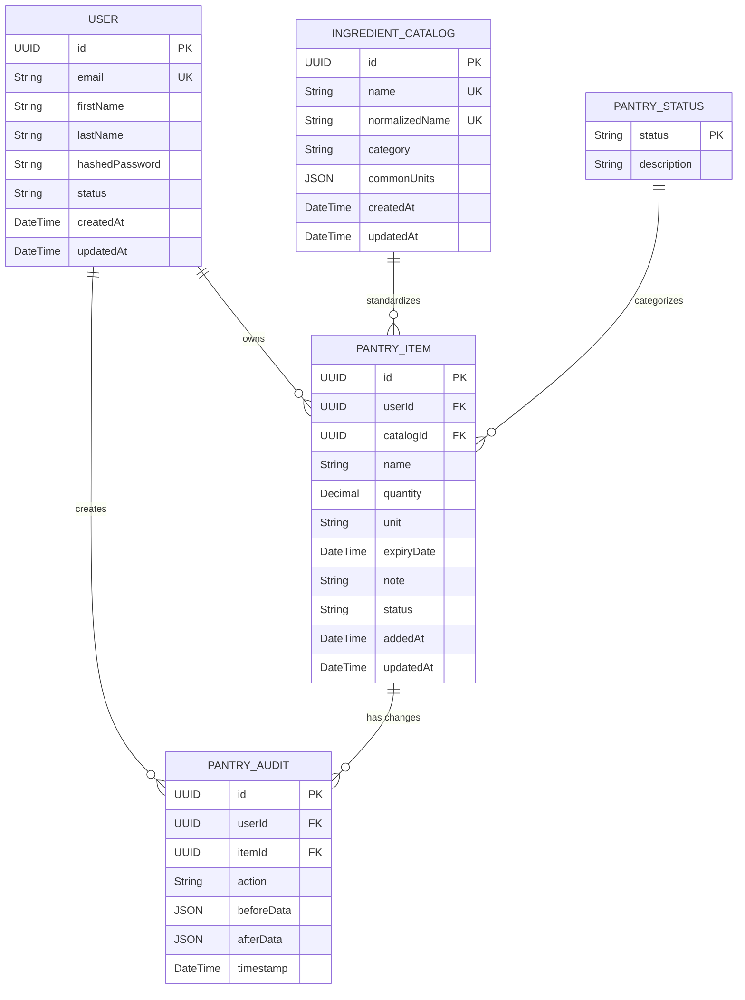

# ERD - Module UC5: Quản Lý Tủ Lạnh Ảo

## Overview & Scope

- **Mục tiêu**: Chuẩn hoá tài liệu ERD (Entity Relationship Diagram) cho module quản lý tủ lạnh ảo, dùng Mermaid `erDiagram` để mô tả cấu trúc database, entities, attributes, và relationships.
- **Phạm vi**: Module UC5 bao gồm 4 Use Cases: thêm nguyên liệu vào tủ (UCS05-1), xem danh sách nguyên liệu trong tủ (UCS05-2), cập nhật số lượng nguyên liệu (UCS05-3), và xóa nguyên liệu khỏi tủ (UCS05-4).
- **Tài liệu tham chiếu Mermaid**: [Mermaid ER Diagram](https://mermaid.js.org/syntax/entityRelationshipDiagram.html)

## Notation & Conventions

- **Ngôn ngữ**: tiếng Việt, giữ English cho technical terms/identifiers.
- **Naming**:
  - Tên entity PascalCase (ví dụ: `PantryItem`), thuộc tính camelCase (ví dụ: `addedAt`).
  - Primary key: `id` hoặc `{entityName}Id`
  - Foreign key: `{referencedEntity}Id`
- **Data Types**: 
  - `UUID` cho primary keys
  - `String` cho text fields
  - `DateTime` cho timestamps
  - `Decimal` cho số thập phân
  - `Boolean` cho flags
  - `JSON` cho complex data
- **Cardinality**: "1", "0..1", "1..*", "*", "0..n", "1..n"
- **Constraints**: NOT NULL, UNIQUE, DEFAULT values
- **Indexes**: Primary Key (PK), Foreign Key (FK), Unique Index (UQ)

## Module Context

- **Mô tả**: Module quản lý tủ lạnh ảo cho phép người dùng quản lý nguyên liệu cá nhân trong "tủ lạnh ảo", bao gồm thêm, xem, cập nhật và xóa nguyên liệu với hỗ trợ chuẩn hóa tên, quản lý hạn sử dụng và audit trail.
- **Actors chính**: User (người dùng đã đăng nhập)
- **Liên kết UC/SD liên quan**: 
  - UC: UCS05-1 (Thêm nguyên liệu vào tủ), UCS05-2 (Xem danh sách nguyên liệu), UCS05-3 (Cập nhật số lượng), UCS05-4 (Xóa nguyên liệu)
  - SD: SD-UCS05-1, SD-UCS05-2, SD-UCS05-3, SD-UCS05-4

## Entity Inventory

| Entity Name | Description | Key Attributes | Relationships | Traceability (UC/SD) |
|---|---|---|---|---|
| User | Quản lý thông tin người dùng | id, email, firstName, lastName | owns PantryItems, creates PantryAudit | UCS05-1,2,3,4; SD-UCS05-1,2,3,4 |
| PantryItem | Quản lý nguyên liệu trong tủ lạnh ảo | id, userId, catalogId, name, quantity, unit, expiryDate, addedAt | belongs to User, references IngredientCatalog, has PantryAudit | UCS05-1,2,3,4; SD-UCS05-1,2,3,4 |
| IngredientCatalog | Danh mục nguyên liệu chuẩn hóa | id, name, normalizedName, category, commonUnits | referenced by PantryItem | UCS05-1; SD-UCS05-1 |
| PantryAudit | Lịch sử thay đổi nguyên liệu | id, userId, itemId, action, beforeData, afterData, timestamp | belongs to User, tracks PantryItem | UCS05-1,3,4; SD-UCS05-1,3,4 |
| PantryStatus | Trạng thái nguyên liệu (enum) | status: FRESH, EXPIRING_SOON, EXPIRED | used by PantryItem | UCS05-2; SD-UCS05-2 |

## Diagrams

### Overview ERD

## Detailed Entity Specifications

### PantryItem

- **Intent**: Entity chính đại diện cho nguyên liệu trong tủ lạnh ảo của người dùng.
- **Responsibilities**: 
  - Lưu trữ thông tin chi tiết về nguyên liệu (tên, số lượng, đơn vị, hạn sử dụng)
  - Liên kết với danh mục chuẩn hóa để đồng nhất tên nguyên liệu
  - Theo dõi trạng thái nguyên liệu (tươi, sắp hết hạn, hết hạn)
- **Attributes**:
  - `id: UUID` — Primary key, định danh duy nhất; NOT NULL
  - `userId: UUID` — Foreign key tới User, chủ sở hữu; NOT NULL
  - `catalogId: UUID` — Foreign key tới IngredientCatalog, có thể NULL cho nguyên liệu custom
  - `name: String` — Tên nguyên liệu; NOT NULL, VARCHAR(255)
  - `quantity: Decimal` — Số lượng; NOT NULL, >= 0, DECIMAL(10,3)
  - `unit: String` — Đơn vị đo; NOT NULL, VARCHAR(50)
  - `expiryDate: DateTime` — Ngày hết hạn; có thể NULL
  - `note: String` — Ghi chú; có thể NULL, TEXT
  - `status: String` — Trạng thái; NOT NULL, DEFAULT 'FRESH'
  - `addedAt: DateTime` — Thời gian thêm; NOT NULL, DEFAULT CURRENT_TIMESTAMP
  - `updatedAt: DateTime` — Thời gian cập nhật; có thể NULL
- **Relationships**:
  - Many-to-One với User: nhiều PantryItem thuộc về một User
  - Many-to-One với IngredientCatalog: nhiều PantryItem có thể reference một IngredientCatalog (optional)
  - One-to-Many với PantryAudit: một PantryItem có nhiều audit records
  - Many-to-One với PantryStatus: nhiều PantryItem có cùng status
- **Constraints**: 
  - `quantity >= 0`
  - `name NOT EMPTY`
  - `unit NOT EMPTY`
  - `status IN ('FRESH', 'EXPIRING_SOON', 'EXPIRED')`
- **Indexes**: 
  - PRIMARY KEY (id)
  - INDEX (userId) cho performance query theo user
  - INDEX (catalogId) cho lookup danh mục
  - INDEX (expiryDate) cho tìm kiếm theo hạn sử dụng
  - INDEX (status) cho filter theo trạng thái
- **Design Notes**: 
  - Sử dụng Decimal thay vì Float cho quantity để đảm bảo độ chính xác
  - Status được normalize thành lookup table để consistency
  - catalogId có thể NULL để hỗ trợ nguyên liệu custom không có trong danh mục

### IngredientCatalog

- **Intent**: Danh mục chuẩn hóa tên nguyên liệu để đảm bảo consistency.
- **Responsibilities**:
  - Lưu trữ tên nguyên liệu chuẩn hóa
  - Phân loại nguyên liệu theo category
  - Cung cấp danh sách đơn vị đo phổ biến
- **Attributes**:
  - `id: UUID` — Primary key; NOT NULL
  - `name: String` — Tên hiển thị; NOT NULL, UNIQUE, VARCHAR(255)
  - `normalizedName: String` — Tên đã chuẩn hóa (lowercase, no accents); NOT NULL, UNIQUE, VARCHAR(255)
  - `category: String` — Danh mục (rau, thịt, gia vị...); NOT NULL, VARCHAR(100)
  - `commonUnits: JSON` — Danh sách đơn vị phổ biến; NOT NULL
  - `createdAt: DateTime` — Thời gian tạo; NOT NULL
  - `updatedAt: DateTime` — Thời gian cập nhật; có thể NULL
- **Relationships**:
  - One-to-Many với PantryItem: một catalog có thể được reference bởi nhiều PantryItem
- **Constraints**: 
  - `name UNIQUE`
  - `normalizedName UNIQUE`
  - `commonUnits` phải là valid JSON array
- **Indexes**: 
  - PRIMARY KEY (id)
  - UNIQUE INDEX (name)
  - UNIQUE INDEX (normalizedName)
  - INDEX (category) cho filter theo loại
- **Design Notes**: 
  - normalizedName để hỗ trợ tìm kiếm fuzzy matching
  - commonUnits dạng JSON để flexible, ví dụ: ["g", "kg", "ounce"]

### PantryAudit

- **Intent**: Ghi lại lịch sử thay đổi của nguyên liệu để audit trail.
- **Responsibilities**:
  - Theo dõi tất cả thay đổi trên PantryItem (thêm, sửa, xóa)
  - Lưu trữ dữ liệu trước và sau khi thay đổi
  - Hỗ trợ truy vết và rollback nếu cần
- **Attributes**:
  - `id: UUID` — Primary key; NOT NULL
  - `userId: UUID` — Foreign key tới User thực hiện thay đổi; NOT NULL
  - `itemId: UUID` — Foreign key tới PantryItem bị thay đổi; NOT NULL
  - `action: String` — Loại hành động (CREATE, UPDATE, DELETE); NOT NULL, VARCHAR(20)
  - `beforeData: JSON` — Dữ liệu trước khi thay đổi; có thể NULL
  - `afterData: JSON` — Dữ liệu sau khi thay đổi; có thể NULL
  - `timestamp: DateTime` — Thời gian thay đổi; NOT NULL, DEFAULT CURRENT_TIMESTAMP
- **Relationships**:
  - Many-to-One với User: nhiều audit record thuộc về một user
  - Many-to-One với PantryItem: nhiều audit record track một PantryItem
- **Constraints**: 
  - `action IN ('CREATE', 'UPDATE', 'DELETE')`
  - Ít nhất một trong `beforeData` hoặc `afterData` phải NOT NULL
- **Indexes**: 
  - PRIMARY KEY (id)
  - INDEX (userId) cho query theo user
  - INDEX (itemId) cho query theo item
  - INDEX (timestamp) cho query theo thời gian
  - INDEX (action) cho filter theo loại hành động
- **Design Notes**: 
  - beforeData và afterData dạng JSON để flexible lưu trữ full object state
  - Không xóa audit records khi xóa PantryItem để giữ lịch sử

### User

- **Intent**: Entity người dùng được reference từ các modules khác (UC1).
- **Responsibilities**: 
  - Quản lý thông tin cơ bản của người dùng
  - Authentication và authorization
- **Attributes**:
  - `id: UUID` — Primary key; NOT NULL
  - `email: String` — Email đăng nhập; NOT NULL, UNIQUE, VARCHAR(255)
  - `firstName: String` — Tên; NOT NULL, VARCHAR(100)
  - `lastName: String` — Họ; NOT NULL, VARCHAR(100)
  - `hashedPassword: String` — Mật khẩu đã hash; NOT NULL
  - `status: String` — Trạng thái tài khoản; NOT NULL, DEFAULT 'ACTIVE'
  - `createdAt: DateTime` — Thời gian tạo; NOT NULL
  - `updatedAt: DateTime` — Thời gian cập nhật; có thể NULL
- **Relationships**:
  - One-to-Many với PantryItem: một user có nhiều nguyên liệu
  - One-to-Many với PantryAudit: một user có nhiều audit records
- **Design Notes**: 
  - Entity này được define trong UC1, chỉ reference ở đây
  - Cần coordinate với team UC1 về schema changes

### PantryStatus

- **Intent**: Lookup table cho trạng thái nguyên liệu.
- **Responsibilities**: 
  - Định nghĩa các trạng thái hợp lệ của nguyên liệu
  - Cung cấp mô tả cho UI display
- **Attributes**:
  - `status: String` — Primary key, mã trạng thái; NOT NULL, VARCHAR(20)
  - `description: String` — Mô tả hiển thị; NOT NULL, VARCHAR(255)
- **Data**:
  - ('FRESH', 'Tươi ngon')
  - ('EXPIRING_SOON', 'Sắp hết hạn')
  - ('EXPIRED', 'Đã hết hạn')
- **Relationships**:
  - One-to-Many với PantryItem: một status có nhiều items
- **Design Notes**: 
  - Lookup table tĩnh, ít thay đổi
  - Có thể implement như enum trong application thay vì separate table

## Database Schema Details

### Tables

| Table Name | Description | Primary Key | Foreign Keys | Indexes |
|---|---|---|---|---|
| users | User information (from UC1) | id | - | email (UQ), status |
| ingredient_catalog | Standardized ingredient catalog | id | - | name (UQ), normalizedName (UQ), category |
| pantry_items | User's pantry items | id | userId → users.id, catalogId → ingredient_catalog.id | userId, catalogId, expiryDate, status |
| pantry_audit | Audit trail for pantry changes | id | userId → users.id, itemId → pantry_items.id | userId, itemId, timestamp, action |
| pantry_status | Status lookup table | status | - | - |

### Relationships

| From Table | To Table | Type | Cardinality | Description |
|---|---|---|---|---|
| users | pantry_items | One-to-Many | 1:N | User owns multiple pantry items |
| users | pantry_audit | One-to-Many | 1:N | User creates multiple audit records |
| ingredient_catalog | pantry_items | One-to-Many | 1:N | Catalog item referenced by multiple pantry items |
| pantry_items | pantry_audit | One-to-Many | 1:N | Pantry item has multiple audit records |
| pantry_status | pantry_items | One-to-Many | 1:N | Status applied to multiple pantry items |

## Traceability Matrix

| UC ID | SD ID | Entities Involved | Notes |
|---|---|---|---|
| UCS05-1 | SD-UCS05-1 | User, PantryItem, IngredientCatalog, PantryAudit, PantryStatus | Thêm nguyên liệu mới với chuẩn hóa tên và audit |
| UCS05-2 | SD-UCS05-2 | User, PantryItem, IngredientCatalog, PantryStatus | Xem danh sách nguyên liệu với filter và pagination |
| UCS05-3 | SD-UCS05-3 | User, PantryItem, PantryAudit | Cập nhật số lượng nguyên liệu với audit trail |
| UCS05-4 | SD-UCS05-4 | User, PantryItem, PantryAudit | Xóa nguyên liệu với audit trail |

## Assumptions & Decisions

- **Giả định chính**: 
  - User entity đã được định nghĩa trong UC1 với schema tương thích
  - Hệ thống hỗ trợ UUID làm primary key
  - Database hỗ trợ JSON data type cho flexible storage
  - Audit trail được giữ vĩnh viễn, không delete
  - Trạng thái nguyên liệu được tính toán realtime dựa trên expiryDate
  - Nguyên liệu trùng tên sẽ được gộp số lượng (handled by application logic)

- **Quyết định thiết kế**: 
  - Sử dụng separate audit table thay vì temporal tables để đơn giản
  - JSON cho beforeData/afterData để flexible với schema changes
  - Decimal cho quantity thay vì Float để tránh rounding errors
  - Optional reference tới IngredientCatalog để hỗ trợ custom ingredients
  - Status lookup table cho consistency và extensibility
  - Soft delete không implement ở database level, handle bởi application
  - Index strategy focus vào query patterns: userId, expiryDate, status

## Open Issues

- **Câu hỏi/khuyết thiếu cần làm rõ**: 
  - User schema từ UC1 có compatible với requirements không?
  - Có cần hỗ trợ soft delete cho PantryItem không?
  - Có cần partition audit table theo thời gian không?
  - Có cần hỗ trợ bulk operations trong schema không?
  - Database platform nào sẽ được sử dụng (PostgreSQL, MySQL, SQL Server)?

- **Hạng mục cần xác thực**: 
  - Performance requirements cho audit table khi data lớn
  - Retention policy cho audit records
  - Backup/recovery strategy cho user data
  - Data migration strategy từ existing systems
  - Security requirements cho sensitive data (PII trong audit logs)
