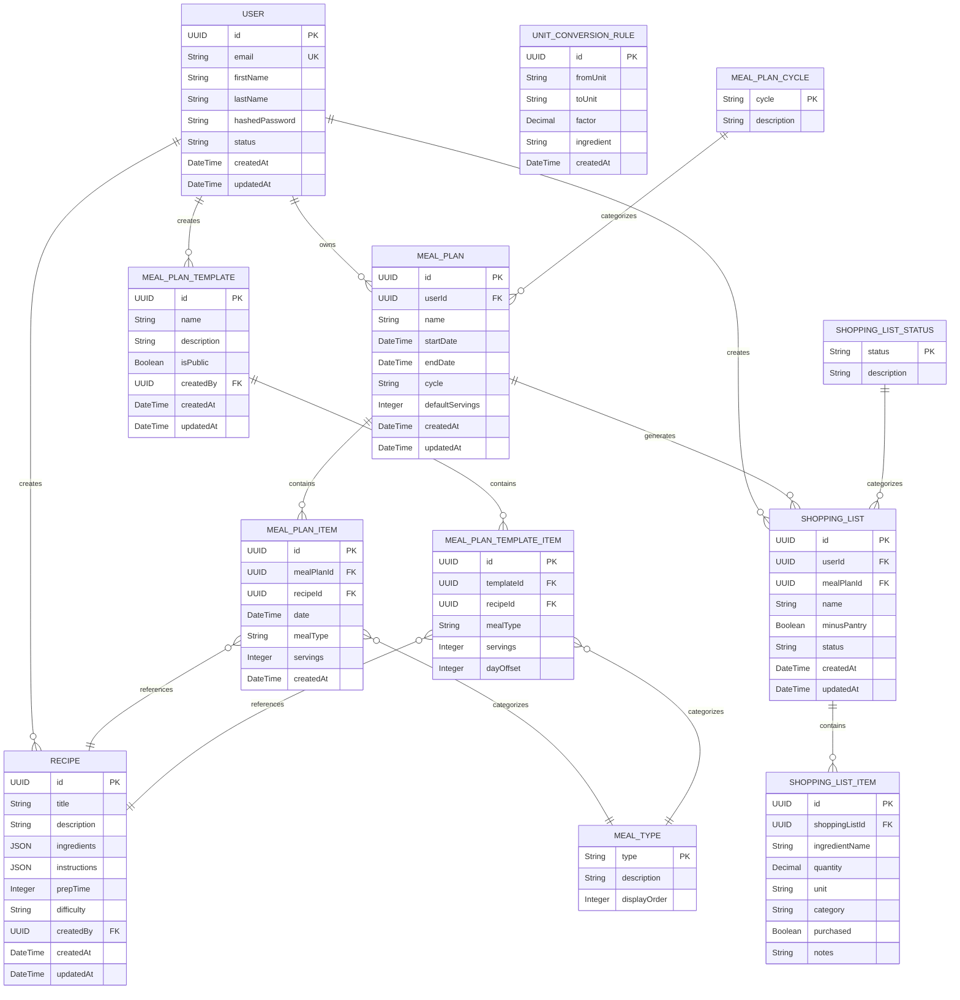

# ERD - Module UC6: Quản Lý Kế Hoạch Bữa Ăn

## Overview & Scope

- **Mục tiêu**: Chuẩn hoá tài liệu ERD (Entity Relationship Diagram) cho module quản lý kế hoạch bữa ăn, dùng Mermaid `erDiagram` để mô tả cấu trúc database, entities, attributes, và relationships.
- **Phạm vi**: Module UC6 bao gồm 5 Use Cases: tạo kế hoạch bữa ăn (UCS06-1), xem kế hoạch bữa ăn (UCS06-2), chỉnh sửa kế hoạch bữa ăn (UCS06-3), xóa kế hoạch bữa ăn (UCS06-4), và tạo danh sách mua sắm từ kế hoạch (UCS06-5).
- **Tài liệu tham chiếu Mermaid**: [Mermaid ER Diagram](https://mermaid.js.org/syntax/entityRelationshipDiagram.html)

## Notation & Conventions

- **Ngôn ngữ**: tiếng Việt, giữ English cho technical terms/identifiers.
- **Naming**:
  - Tên entity PascalCase (ví dụ: `MealPlan`), thuộc tính camelCase (ví dụ: `createdAt`).
  - Primary key: `id` hoặc `{entityName}Id`
  - Foreign key: `{referencedEntity}Id`
- **Data Types**: 
  - `UUID` cho primary keys
  - `String` cho text fields
  - `DateTime` cho timestamps
  - `Decimal` cho số thập phân
  - `Boolean` cho flags
  - `JSON` cho complex data
- **Cardinality**: "1", "0..1", "1..*", "*", "0..n", "1..n"
- **Constraints**: NOT NULL, UNIQUE, DEFAULT values
- **Indexes**: Primary Key (PK), Foreign Key (FK), Unique Index (UQ)

## Module Context

- **Mô tả**: Module quản lý kế hoạch bữa ăn cho phép người dùng tạo, xem, chỉnh sửa và xóa kế hoạch bữa ăn theo ngày/tuần/tháng, với khả năng tự động tạo danh sách mua sắm từ nguyên liệu trong kế hoạch.
- **Actors chính**: User (người dùng đã đăng nhập)
- **Liên kết UC/SD liên quan**: 
  - UC: UCS06-1 (Tạo kế hoạch bữa ăn), UCS06-2 (Xem kế hoạch bữa ăn), UCS06-3 (Chỉnh sửa kế hoạch bữa ăn), UCS06-4 (Xóa kế hoạch bữa ăn), UCS06-5 (Tạo danh sách mua sắm)
  - SD: SD-UCS06-1, SD-UCS06-2, SD-UCS06-3, SD-UCS06-4, SD-UCS06-5

## Entity Inventory

| Entity Name | Description | Key Attributes | Relationships | Traceability (UC/SD) |
|---|---|---|---|---|
| User | Quản lý thông tin người dùng (từ UC1) | id, email, firstName, lastName | owns MealPlans, creates ShoppingLists | UCS06-1,2,3,4,5; SD-UCS06-1,2,3,4,5 |
| Recipe | Công thức nấu ăn (từ UC2/UC3) | id, title, description, ingredients | referenced by MealPlanItems | UCS06-1,2,3,5; SD-UCS06-1,2,3,5 |
| MealPlan | Kế hoạch bữa ăn của người dùng | id, userId, name, startDate, endDate, cycle, defaultServings | belongs to User, contains MealPlanItems, generates ShoppingLists | UCS06-1,2,3,4,5; SD-UCS06-1,2,3,4,5 |
| MealPlanItem | Món ăn trong kế hoạch bữa ăn | id, mealPlanId, recipeId, date, mealType, servings | belongs to MealPlan, references Recipe | UCS06-1,2,3,4,5; SD-UCS06-1,2,3,4,5 |
| ShoppingList | Danh sách mua sắm tạo từ kế hoạch | id, userId, mealPlanId, name, minusPantry, status | belongs to User, generated from MealPlan, contains ShoppingListItems | UCS06-5; SD-UCS06-5 |
| ShoppingListItem | Mục trong danh sách mua sắm | id, shoppingListId, ingredientName, quantity, unit, category, purchased | belongs to ShoppingList | UCS06-5; SD-UCS06-5 |
| MealPlanTemplate | Template kế hoạch mẫu có thể tái sử dụng | id, name, description, isPublic, createdBy | created by User, contains MealPlanTemplateItems | UCS06-1; SD-UCS06-1 |
| MealPlanTemplateItem | Món ăn trong template kế hoạch | id, templateId, recipeId, mealType, servings, dayOffset | belongs to MealPlanTemplate, references Recipe | UCS06-1; SD-UCS06-1 |
| UnitConversionRule | Quy tắc quy đổi đơn vị nguyên liệu | id, fromUnit, toUnit, factor, ingredient | supports unit conversion in shopping list generation | UCS06-5; SD-UCS06-5 |
| MealPlanCycle | Chu kỳ hiển thị kế hoạch (enum) | cycle: DAILY, WEEKLY, MONTHLY | used by MealPlan | UCS06-1,2; SD-UCS06-1,2 |
| MealType | Loại bữa ăn (enum) | type: BREAKFAST, LUNCH, DINNER, SNACK | used by MealPlanItem, MealPlanTemplateItem | UCS06-1,2,3; SD-UCS06-1,2,3 |
| ShoppingListStatus | Trạng thái danh sách mua sắm (enum) | status: DRAFT, ACTIVE, COMPLETED, ARCHIVED | used by ShoppingList | UCS06-5; SD-UCS06-5 |

## Diagrams

### Overview ERD

## Detailed Entity Specifications

### MealPlan

- **Intent**: Entity chính đại diện cho kế hoạch bữa ăn của người dùng, quản lý thông tin cơ bản và khoảng thời gian.
- **Responsibilities**: 
  - Lưu trữ thông tin cơ bản của kế hoạch (tên, khoảng thời gian, chu kỳ hiển thị)
  - Quản lý các món ăn trong kế hoạch thông qua MealPlanItem
  - Làm cơ sở để tạo danh sách mua sắm
- **Attributes**:
  - `id: UUID` — Primary key, định danh duy nhất; NOT NULL
  - `userId: UUID` — Foreign key tới User, chủ sở hữu kế hoạch; NOT NULL
  - `name: String` — Tên kế hoạch; có thể NULL, VARCHAR(255)
  - `startDate: DateTime` — Ngày bắt đầu kế hoạch; NOT NULL
  - `endDate: DateTime` — Ngày kết thúc kế hoạch; NOT NULL
  - `cycle: String` — Chu kỳ hiển thị (DAILY/WEEKLY/MONTHLY); NOT NULL, VARCHAR(20)
  - `defaultServings: Integer` — Số khẩu phần mặc định; NOT NULL, DEFAULT 2
  - `createdAt: DateTime` — Thời gian tạo; NOT NULL, DEFAULT CURRENT_TIMESTAMP
  - `updatedAt: DateTime` — Thời gian cập nhật cuối; có thể NULL
- **Relationships**:
  - Many-to-One với User: nhiều MealPlan thuộc về một User
  - One-to-Many với MealPlanItem: một MealPlan có nhiều MealPlanItem
  - One-to-Many với ShoppingList: một MealPlan có thể tạo nhiều ShoppingList
  - Many-to-One với MealPlanCycle: nhiều MealPlan có cùng cycle
- **Constraints**: 
  - `startDate < endDate`
  - `defaultServings > 0`
  - `cycle IN ('DAILY', 'WEEKLY', 'MONTHLY')`
- **Indexes**: 
  - PRIMARY KEY (id)
  - INDEX (userId) cho performance query theo user
  - INDEX (startDate, endDate) cho range queries
  - INDEX (cycle) cho filter theo chu kỳ
- **Design Notes**: 
  - name có thể NULL để hỗ trợ kế hoạch tự động tạo
  - cycle được normalize thành lookup table để consistency
  - Sử dụng separate table cho items để flexibility trong quản lý

### MealPlanItem

- **Intent**: Đại diện cho một món ăn cụ thể trong kế hoạch bữa ăn, liên kết với công thức và định nghĩa thời gian, bữa ăn.
- **Responsibilities**:
  - Quản lý thông tin món ăn trong kế hoạch (công thức, ngày, bữa, khẩu phần)
  - Liên kết với Recipe để lấy thông tin chi tiết món ăn
  - Cung cấp dữ liệu để tạo danh sách mua sắm
- **Attributes**:
  - `id: UUID` — Primary key, định danh duy nhất; NOT NULL
  - `mealPlanId: UUID` — Foreign key tới MealPlan; NOT NULL
  - `recipeId: UUID` — Foreign key tới Recipe; NOT NULL
  - `date: DateTime` — Ngày ăn món này; NOT NULL
  - `mealType: String` — Loại bữa ăn (BREAKFAST/LUNCH/DINNER/SNACK); NOT NULL, VARCHAR(20)
  - `servings: Integer` — Số khẩu phần; NOT NULL, DEFAULT 2
  - `createdAt: DateTime` — Thời gian tạo; NOT NULL, DEFAULT CURRENT_TIMESTAMP
- **Relationships**:
  - Many-to-One với MealPlan: nhiều MealPlanItem thuộc về một MealPlan
  - Many-to-One với Recipe: nhiều MealPlanItem có thể reference một Recipe
  - Many-to-One với MealType: nhiều MealPlanItem có cùng mealType
- **Constraints**:
  - `servings > 0`
  - `date` phải nằm trong khoảng [startDate, endDate] của MealPlan
  - `mealType IN ('BREAKFAST', 'LUNCH', 'DINNER', 'SNACK')`
  - UNIQUE (mealPlanId, recipeId, date, mealType) để tránh duplicate
- **Indexes**:
  - PRIMARY KEY (id)
  - INDEX (mealPlanId) cho query theo kế hoạch
  - INDEX (recipeId) cho query theo công thức
  - INDEX (date) cho query theo ngày
  - INDEX (mealType) cho filter theo bữa
  - COMPOSITE INDEX (mealPlanId, date, mealType) cho calendar view
- **Design Notes**:
  - Sử dụng separate record cho mỗi món/ngày/bữa để flexibility
  - servings có thể override defaultServings của MealPlan
  - Constraint để đảm bảo date trong range của parent MealPlan

### ShoppingList

- **Intent**: Đại diện cho danh sách mua sắm được tạo từ kế hoạch bữa ăn, quản lý các nguyên liệu cần mua.
- **Responsibilities**:
  - Quản lý danh sách nguyên liệu cần mua được tổng hợp từ kế hoạch
  - Theo dõi trạng thái mua sắm (draft, active, completed, archived)
  - Hỗ trợ tính năng trừ nguyên liệu có sẵn trong tủ (minusPantry)
- **Attributes**:
  - `id: UUID` — Primary key, định danh duy nhất; NOT NULL
  - `userId: UUID` — Foreign key tới User, chủ sở hữu danh sách; NOT NULL
  - `mealPlanId: UUID` — Foreign key tới MealPlan nguồn; NOT NULL
  - `name: String` — Tên danh sách mua sắm; NOT NULL, VARCHAR(255)
  - `minusPantry: Boolean` — Có trừ nguyên liệu trong tủ không; NOT NULL, DEFAULT false
  - `status: String` — Trạng thái danh sách; NOT NULL, DEFAULT 'DRAFT', VARCHAR(20)
  - `createdAt: DateTime` — Thời gian tạo; NOT NULL, DEFAULT CURRENT_TIMESTAMP
  - `updatedAt: DateTime` — Thời gian cập nhật cuối; có thể NULL
- **Relationships**:
  - Many-to-One với User: nhiều ShoppingList thuộc về một User
  - Many-to-One với MealPlan: nhiều ShoppingList có thể tạo từ một MealPlan
  - One-to-Many với ShoppingListItem: một ShoppingList có nhiều ShoppingListItem
  - Many-to-One với ShoppingListStatus: nhiều ShoppingList có cùng status
- **Constraints**:
  - `name NOT EMPTY`
  - `status IN ('DRAFT', 'ACTIVE', 'COMPLETED', 'ARCHIVED')`
- **Indexes**:
  - PRIMARY KEY (id)
  - INDEX (userId) cho query theo user
  - INDEX (mealPlanId) cho query theo kế hoạch
  - INDEX (status) cho filter theo trạng thái
  - INDEX (createdAt) cho sort theo thời gian
- **Design Notes**:
  - minusPantry flag để hỗ trợ tính năng trừ nguyên liệu có sẵn
  - Có thể tạo nhiều shopping list từ cùng một meal plan (với date range khác nhau)
  - Status workflow: DRAFT → ACTIVE → COMPLETED → ARCHIVED

### ShoppingListItem

- **Intent**: Đại diện cho một mục cụ thể trong danh sách mua sắm, chứa thông tin nguyên liệu cần mua.
- **Responsibilities**:
  - Lưu trữ thông tin nguyên liệu cần mua (tên, số lượng, đơn vị)
  - Phân loại nguyên liệu theo category để dễ mua sắm
  - Theo dõi trạng thái đã mua/chưa mua
- **Attributes**:
  - `id: UUID` — Primary key, định danh duy nhất; NOT NULL
  - `shoppingListId: UUID` — Foreign key tới ShoppingList; NOT NULL
  - `ingredientName: String` — Tên nguyên liệu đã chuẩn hóa; NOT NULL, VARCHAR(255)
  - `quantity: Decimal` — Số lượng cần mua; NOT NULL, DECIMAL(10,3)
  - `unit: String` — Đơn vị đo; NOT NULL, VARCHAR(50)
  - `category: String` — Danh mục nguyên liệu (rau, thịt, gia vị...); NOT NULL, VARCHAR(100)
  - `purchased: Boolean` — Đã mua hay chưa; NOT NULL, DEFAULT false
  - `notes: String` — Ghi chú bổ sung; có thể NULL, TEXT
- **Relationships**:
  - Many-to-One với ShoppingList: nhiều ShoppingListItem thuộc về một ShoppingList
- **Constraints**:
  - `quantity > 0`
  - `ingredientName NOT EMPTY`
  - `unit NOT EMPTY`
  - `category NOT EMPTY`
- **Indexes**:
  - PRIMARY KEY (id)
  - INDEX (shoppingListId) cho query theo danh sách
  - INDEX (category) cho group theo danh mục
  - INDEX (purchased) cho filter đã mua/chưa mua
  - INDEX (ingredientName) cho search
- **Design Notes**:
  - quantity dùng Decimal để tránh rounding errors
  - category để hỗ trợ group items khi mua sắm (dairy, produce, meat, etc.)
  - notes để ghi thông tin bổ sung (thương hiệu, ghi chú đặc biệt)

### MealPlanTemplate

- **Intent**: Template kế hoạch bữa ăn có thể tái sử dụng, giúp người dùng nhanh chóng tạo kế hoạch mới.
- **Responsibilities**:
  - Lưu trữ mẫu kế hoạch với các món ăn định sẵn
  - Hỗ trợ chia sẻ template công khai giữa các user
  - Cung cấp base để tạo MealPlan mới
- **Attributes**:
  - `id: UUID` — Primary key, định danh duy nhất; NOT NULL
  - `name: String` — Tên template; NOT NULL, VARCHAR(255)
  - `description: String` — Mô tả template; có thể NULL, TEXT
  - `isPublic: Boolean` — Template công khai hay riêng tư; NOT NULL, DEFAULT false
  - `createdBy: UUID` — Foreign key tới User tạo template; NOT NULL
  - `createdAt: DateTime` — Thời gian tạo; NOT NULL, DEFAULT CURRENT_TIMESTAMP
  - `updatedAt: DateTime` — Thời gian cập nhật cuối; có thể NULL
- **Relationships**:
  - Many-to-One với User: nhiều MealPlanTemplate được tạo bởi một User
  - One-to-Many với MealPlanTemplateItem: một MealPlanTemplate có nhiều MealPlanTemplateItem
- **Constraints**:
  - `name NOT EMPTY`
- **Indexes**:
  - PRIMARY KEY (id)
  - INDEX (createdBy) cho query theo người tạo
  - INDEX (isPublic) cho filter template công khai
  - INDEX (name) cho search theo tên
  - INDEX (createdAt) cho sort theo thời gian
- **Design Notes**:
  - isPublic để hỗ trợ template được chia sẻ trong cộng đồng
  - Có thể implement rating/popularity system cho public templates
  - Template chỉ chứa structure, không bind với specific dates

### MealPlanTemplateItem

- **Intent**: Món ăn trong template kế hoạch, định nghĩa recipe và thông tin bữa ăn tương đối.
- **Responsibilities**:
  - Lưu trữ thông tin món ăn trong template (recipe, meal type, servings)
  - Sử dụng dayOffset để định nghĩa vị trí tương đối trong template
  - Cung cấp data để tạo MealPlanItem khi apply template
- **Attributes**:
  - `id: UUID` — Primary key, định danh duy nhất; NOT NULL
  - `templateId: UUID` — Foreign key tới MealPlanTemplate; NOT NULL
  - `recipeId: UUID` — Foreign key tới Recipe; NOT NULL
  - `mealType: String` — Loại bữa ăn; NOT NULL, VARCHAR(20)
  - `servings: Integer` — Số khẩu phần đề xuất; NOT NULL, DEFAULT 2
  - `dayOffset: Integer` — Ngày thứ mấy trong template (0-based); NOT NULL
- **Relationships**:
  - Many-to-One với MealPlanTemplate: nhiều MealPlanTemplateItem thuộc về một MealPlanTemplate
  - Many-to-One với Recipe: nhiều MealPlanTemplateItem có thể reference một Recipe
  - Many-to-One với MealType: nhiều MealPlanTemplateItem có cùng mealType
- **Constraints**:
  - `servings > 0`
  - `dayOffset >= 0`
  - `mealType IN ('BREAKFAST', 'LUNCH', 'DINNER', 'SNACK')`
  - UNIQUE (templateId, recipeId, mealType, dayOffset) để tránh duplicate
- **Indexes**:
  - PRIMARY KEY (id)
  - INDEX (templateId) cho query theo template
  - INDEX (recipeId) cho query theo recipe
  - INDEX (dayOffset) cho sort theo thứ tự ngày
  - COMPOSITE INDEX (templateId, dayOffset, mealType) cho template view
- **Design Notes**:
  - dayOffset sử dụng 0-based indexing (0 = ngày đầu tiên)
  - Khi apply template, dayOffset sẽ được convert thành actual dates
  - Template có thể span nhiều ngày (7 ngày cho weekly template)

### UnitConversionRule

- **Intent**: Quy tắc quy đổi đơn vị nguyên liệu để chuẩn hóa và tính toán chính xác số lượng trong shopping list.
- **Responsibilities**:
  - Lưu trữ các quy tắc quy đổi giữa các đơn vị đo
  - Hỗ trợ quy đổi đơn vị theo từng loại nguyên liệu cụ thể
  - Cung cấp dữ liệu để UnitConversionService thực hiện quy đổi
- **Attributes**:
  - `id: UUID` — Primary key, định danh duy nhất; NOT NULL
  - `fromUnit: String` — Đơn vị nguồn; NOT NULL, VARCHAR(50)
  - `toUnit: String` — Đơn vị đích; NOT NULL, VARCHAR(50)
  - `factor: Decimal` — Hệ số quy đổi; NOT NULL, DECIMAL(15,6)
  - `ingredient: String` — Nguyên liệu cụ thể (nullable cho general rules); có thể NULL, VARCHAR(255)
  - `createdAt: DateTime` — Thời gian tạo; NOT NULL, DEFAULT CURRENT_TIMESTAMP
- **Relationships**:
  - Standalone entity, không có direct relationships
- **Constraints**:
  - `factor > 0`
  - `fromUnit != toUnit`
  - `fromUnit NOT EMPTY`
  - `toUnit NOT EMPTY`
  - UNIQUE (fromUnit, toUnit, ingredient) để tránh duplicate rules
- **Indexes**:
  - PRIMARY KEY (id)
  - UNIQUE INDEX (fromUnit, toUnit, ingredient)
  - INDEX (fromUnit) cho lookup conversion từ unit
  - INDEX (toUnit) cho lookup conversion đến unit
  - INDEX (ingredient) cho ingredient-specific rules
- **Design Notes**:
  - ingredient NULL cho general conversion rules (1 kg = 1000 g)
  - ingredient NOT NULL cho specific rules (1 cup flour = 120g, 1 cup sugar = 200g)
  - factor là số thập phân chính xác để tránh rounding errors
  - Có thể implement bidirectional conversion bằng cách lưu reverse rules

## Database Schema Details

### Tables

| Table Name | Description | Primary Key | Foreign Keys | Indexes |
|---|---|---|---|---|
| users | User information (from UC1) | id | - | email (UQ), status |
| recipes | Recipe information (from UC2/UC3) | id | createdBy → users.id | title, createdBy, difficulty |
| meal_plans | User's meal plans | id | userId → users.id | userId, startDate, endDate, cycle |
| meal_plan_items | Items in meal plans | id | mealPlanId → meal_plans.id, recipeId → recipes.id | mealPlanId, recipeId, date, mealType |
| shopping_lists | Shopping lists generated from meal plans | id | userId → users.id, mealPlanId → meal_plans.id | userId, mealPlanId, status |
| shopping_list_items | Items in shopping lists | id | shoppingListId → shopping_lists.id | shoppingListId, category, purchased |
| meal_plan_templates | Reusable meal plan templates | id | createdBy → users.id | createdBy, isPublic, name |
| meal_plan_template_items | Items in meal plan templates | id | templateId → meal_plan_templates.id, recipeId → recipes.id | templateId, recipeId, dayOffset |
| unit_conversion_rules | Unit conversion rules for ingredients | id | - | fromUnit, toUnit, ingredient |
| meal_plan_cycles | Meal plan cycle lookup table | cycle | - | - |
| meal_types | Meal type lookup table | type | - | displayOrder |
| shopping_list_statuses | Shopping list status lookup table | status | - | - |

### Relationships

| From Table | To Table | Type | Cardinality | Description |
|---|---|---|---|---|
| users | meal_plans | One-to-Many | 1:N | User owns multiple meal plans |
| users | shopping_lists | One-to-Many | 1:N | User creates multiple shopping lists |
| users | meal_plan_templates | One-to-Many | 1:N | User creates multiple templates |
| users | recipes | One-to-Many | 1:N | User creates multiple recipes |
| meal_plans | meal_plan_items | One-to-Many | 1:N | Meal plan contains multiple items |
| meal_plans | shopping_lists | One-to-Many | 1:N | Meal plan generates multiple shopping lists |
| recipes | meal_plan_items | One-to-Many | 1:N | Recipe referenced by multiple meal plan items |
| shopping_lists | shopping_list_items | One-to-Many | 1:N | Shopping list contains multiple items |
| meal_plan_templates | meal_plan_template_items | One-to-Many | 1:N | Template contains multiple items |
| recipes | meal_plan_template_items | One-to-Many | 1:N | Recipe referenced by multiple template items |
| meal_plan_cycles | meal_plans | One-to-Many | 1:N | Cycle applied to multiple meal plans |
| meal_types | meal_plan_items | One-to-Many | 1:N | Meal type applied to multiple meal plan items |
| meal_types | meal_plan_template_items | One-to-Many | 1:N | Meal type applied to multiple template items |
| shopping_list_statuses | shopping_lists | One-to-Many | 1:N | Status applied to multiple shopping lists |

## Traceability Matrix

| UC ID | SD ID | Entities Involved | Notes |
|---|---|---|---|
| UCS06-1 | SD-UCS06-1 | User, MealPlan, MealPlanItem, Recipe, MealPlanTemplate, MealPlanTemplateItem, MealPlanCycle, MealType | Tạo kế hoạch bữa ăn mới với các món ăn, có thể từ template |
| UCS06-2 | SD-UCS06-2 | User, MealPlan, MealPlanItem, Recipe, MealPlanCycle, MealType | Xem kế hoạch bữa ăn theo lịch với filter và pagination |
| UCS06-3 | SD-UCS06-3 | User, MealPlan, MealPlanItem, Recipe, MealType | Chỉnh sửa kế hoạch: thêm/sửa/xóa/di chuyển món ăn |
| UCS06-4 | SD-UCS06-4 | User, MealPlan, MealPlanItem | Xóa kế hoạch bữa ăn và tất cả món ăn liên quan |
| UCS06-5 | SD-UCS06-5 | User, MealPlan, MealPlanItem, Recipe, ShoppingList, ShoppingListItem, UnitConversionRule, ShoppingListStatus | Tạo danh sách mua sắm từ kế hoạch với quy đổi đơn vị và group ingredients |

## Assumptions & Decisions

- **Giả định chính**: 
  - User entity đã được định nghĩa trong UC1 với schema tương thích
  - Recipe entity đã được định nghĩa trong UC2/UC3 với ingredients information
  - Hệ thống hỗ trợ UUID làm primary key
  - Database hỗ trợ JSON data type cho complex data
  - Meal plans có thể span từ 1 ngày đến nhiều tháng
  - Shopping lists được tạo từ meal plans và có thể customize sau
  - Unit conversion rules có thể general hoặc ingredient-specific

- **Quyết định thiết kế**: 
  - Tách MealPlan và MealPlanItem để flexibility trong quản lý items
  - Sử dụng enum lookup tables cho consistency và extensibility
  - Shopping list tách riêng để có thể quản lý độc lập
  - Template system để hỗ trợ reusability
  - Unit conversion rules trong database để flexible configuration
  - Decimal cho quantities để tránh floating point errors
  - Composite indexes cho common query patterns
  - Foreign key constraints để đảm bảo data integrity
  - Soft delete không implement ở database level, handle bởi application

## Open Issues

- **Câu hỏi/khuyết thiếu cần làm rõ**: 
  - User và Recipe schemas từ UC1/UC2/UC3 có compatible với requirements không?
  - Có cần hỗ trợ recurring meal plans (weekly/monthly patterns) không?
  - Có cần audit trail cho meal plan changes không?
  - Có cần hỗ trợ collaborative meal planning (shared plans) không?
  - Shopping list có cần integrate với grocery stores/delivery services không?
  - Database platform nào sẽ được sử dụng (PostgreSQL, MySQL, SQL Server)?

- **Hạng mục cần xác thực**: 
  - Performance requirements cho meal plan calendar views
  - Retention policy cho completed shopping lists
  - Backup/recovery strategy cho user meal plans
  - Data migration strategy từ existing systems
  - Security requirements cho shared templates
  - Scalability considerations cho large meal plans
  - Unit conversion accuracy requirements
