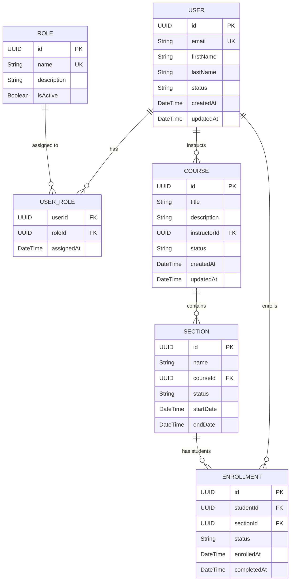
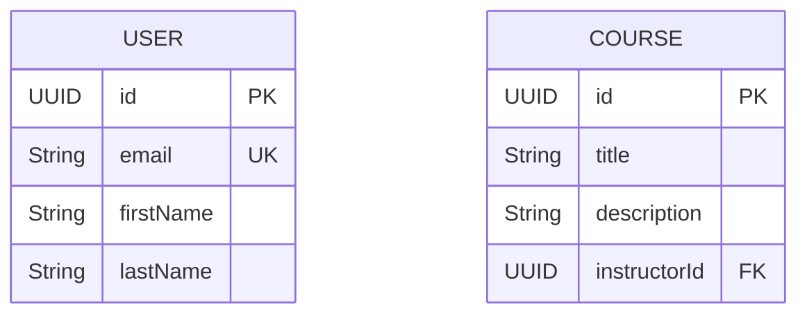
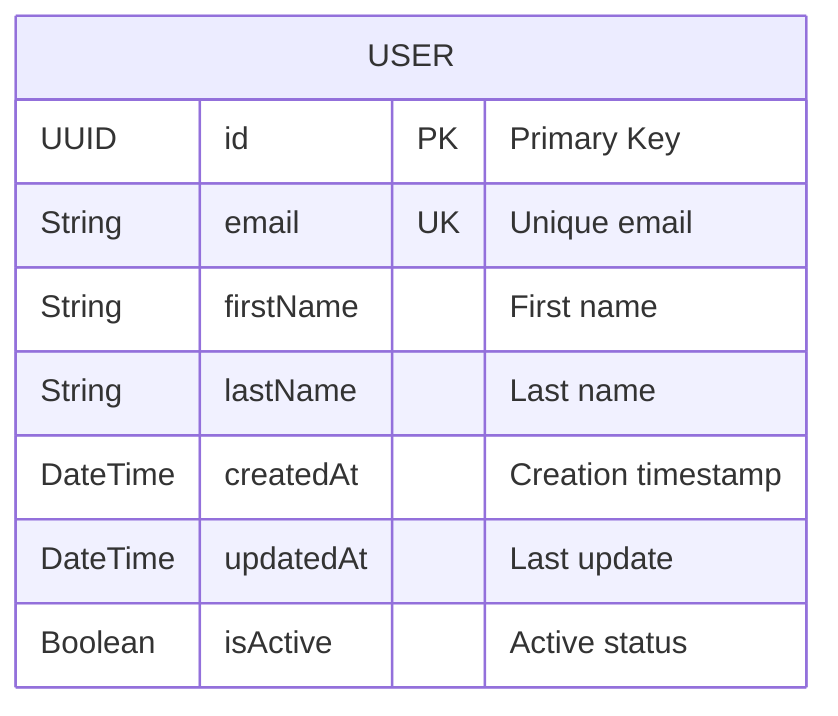
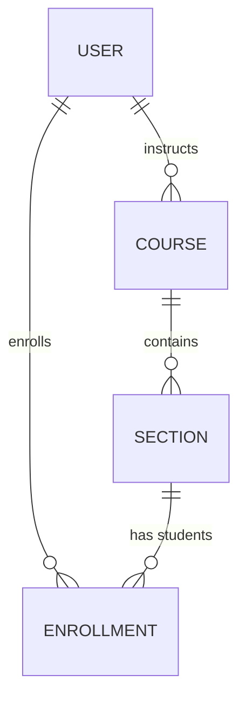
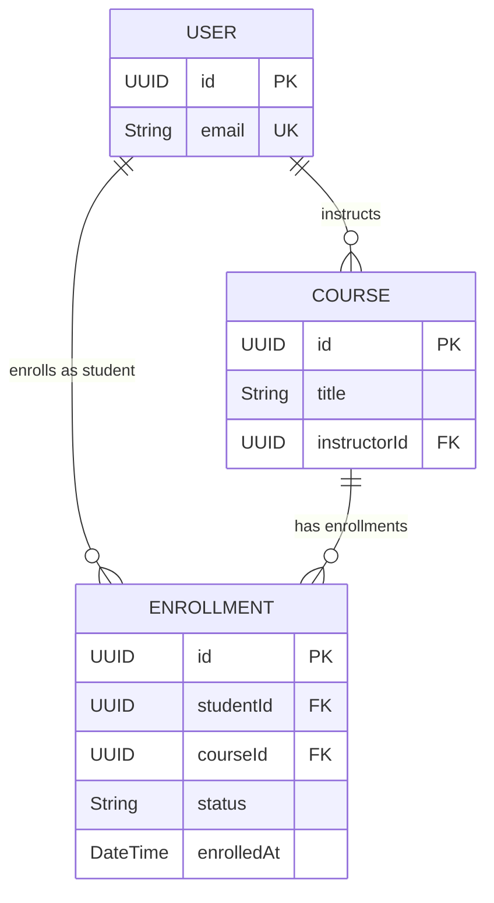

# ERD Template - Entity Relationship Diagram

## Overview & Scope

- **Mục tiêu**: Chuẩn hoá tài liệu ERD (Entity Relationship Diagram) cho toàn hệ thống, dùng Mermaid `erDiagram` để mô tả cấu trúc database, entities, attributes, và relationships.
- **Phạm vi**: Áp dụng cho từng module (Admin, Instructor, Student, AI, ...); mỗi module có thể dùng một file riêng dựa trên template này.
- **Tài liệu tham chiếu Mermaid**: [Mermaid ER Diagram](https://mermaid.js.org/syntax/entityRelationshipDiagram.html)

## Notation & Conventions

- **Ngôn ngữ**: tiếng Việt, giữ English cho technical terms/identifiers.
- **Naming**:
  - Tên entity PascalCase (ví dụ: `UserAccount`), thuộc tính camelCase (ví dụ: `createdAt`).
  - Primary key: `id` hoặc `{entityName}Id`
  - Foreign key: `{referencedEntity}Id`
- **Data Types**: 
  - `UUID` cho primary keys
  - `String` cho text fields
  - `DateTime` cho timestamps
  - `Decimal` cho số thập phân
  - `Boolean` cho flags
  - `JSON` cho complex data
- **Cardinality**: "1", "0..1", "1..*", "*", "0..n", "1..n"
- **Constraints**: NOT NULL, UNIQUE, DEFAULT values
- **Indexes**: Primary Key (PK), Foreign Key (FK), Unique Index (UQ)

## Module Context

- Mô tả ngắn module, ranh giới, actors chính, các submodules (nếu có).
- Liên kết UC/SD liên quan: nêu danh sách Use Case IDs và Sequence tương ứng.

## Entity Inventory

| Entity Name | Description | Key Attributes | Relationships | Traceability (UC/SD) |
|---|---|---|---|---|
| User | Quản lý thông tin người dùng | id, email, status | has Role, creates Course | UCA01; SDA_UCA01_1 |
| Course | Quản lý khóa học | id, title, description | belongs to User, has Sections | UCA02; SDA_UCA02_1 |

## Diagrams

### Overview ERD

### Submodule ERDs (tùy chọn)

- Khi sơ đồ lớn, tách thêm các sơ đồ con theo module.

## Detailed Entity Specifications

### [EntityName]

- **Intent**: Mục đích tồn tại của entity trong domain.
- **Responsibilities**: Trách nhiệm chính, quy tắc nghiệp vụ quản lý.
- **Attributes**:
  - Tên: Kiểu — mô tả ngắn; ràng buộc/invariant (nếu có).
- **Relationships**:
  - Quan hệ với entity khác: loại (one-to-one/one-to-many/many-to-many), cardinality, chiều.
- **Constraints**: 
  - Business rules, data validation rules
- **Indexes**: 
  - Primary keys, foreign keys, unique constraints, performance indexes
- **Design Notes**: Lập luận thiết kế, thay thế đã cân nhắc, trade-offs.

## Database Schema Details

### Tables

| Table Name | Description | Primary Key | Foreign Keys | Indexes |
|---|---|---|---|---|
| users | User information | id | - | email (UQ), status |
| courses | Course information | id | instructor_id → users.id | instructor_id, status |
| sections | Section information | id | course_id → courses.id | course_id, status |

### Relationships

| From Table | To Table | Type | Cardinality | Description |
|---|---|---|---|---|
| users | user_roles | One-to-Many | 1:N | User can have multiple roles |
| roles | user_roles | One-to-Many | 1:N | Role can be assigned to multiple users |
| users | courses | One-to-Many | 1:N | User can instruct multiple courses |
| courses | sections | One-to-Many | 1:N | Course can have multiple sections |

## Traceability Matrix

| UC ID | SD ID | Entities Involved | Notes |
|---|---|---|---|
| UCA01 | SDA_UCA01_1 | User, Role, UserRole | Tạo user, gán role |
| UCA02 | SDA_UCA02_1 | Course, User | Tạo course, assign instructor |
|...|...|...|...|

## Assumptions & Decisions

- **Giả định chính**: Data types, lifecycle, external dependencies...
- **Quyết định thiết kế**: Normalization level, indexing strategy, relationship design...

## Open Issues

- Câu hỏi/khuyết thiếu cần làm rõ từ UC/SD/Stakeholders.
- Hạng mục cần xác thực (cardinality, business rules...).

---

## Mermaid ER Diagram Cheatsheet

- **Mục đích**: Tóm tắt cú pháp chính của Mermaid `erDiagram` để mô hình hoá database schema theo chuẩn ERD (entities, attributes, relationships, cardinality).
- **Ngôn ngữ**: Ghi chú tiếng Việt; giữ English cho technical terms/identifiers.

### Khởi tạo sơ đồ và entity cơ bản

### Định nghĩa attributes và data types

### Relationships và cardinality

### Relationship types

- `||--o{` : One-to-Many (One user can have many courses)
- `||--||` : One-to-One (One user has one profile)
- `}o--o{` : Many-to-Many (Many users can enroll in many courses)

### Complex relationships

### Naming conventions

- **Entity names**: PascalCase (User, Course, Enrollment)
- **Attribute names**: camelCase (firstName, createdAt)
- **Primary keys**: `id` hoặc `{entityName}Id`
- **Foreign keys**: `{referencedEntity}Id`
- **Constraints**: PK (Primary Key), FK (Foreign Key), UK (Unique Key)

### Quy ước bổ sung cho dự án

- **Naming**: PascalCase cho entities, camelCase cho attributes
- **Traceability**: Chèn ghi chú `UC/SD IDs` gần các entities chính khi cần
- **Performance**: Ghi chú indexes quan trọng cho performance
- **Business Rules**: Mô tả constraints và validation rules
