# UC-A1 - SD-UCA01-1

> Extracted from: `DOCS/SD/UC-A1/SD-UCA01-1.md`

## II. Danh Sách Đối Tượng Tham Gia (Participants / Lifelines)

| ID | Tên Đối tượng (Lifeline) | Vai trò/Loại (Stereotype) | Chủ quản (Ownership) | Giao thức/Interface (Protocol) | Phiên bản API | Mô tả chi tiết |
| :--- | :--- | :--- | :--- | :--- | :--- | :--- |
| L1 | Admin GUI | Boundary | Web Admin | HTTP | n/a | Giao diện trang "Quản lý Người dùng" |
| L2 | UserListController | Control | Core | Internal | v1 | Điều phối request/response, xác thực quyền |
| L3 | UserQueryService | Service | Core | Internal | v1 | Nghiệp vụ truy vấn danh sách, áp dụng filter/sort/paging |
| L4 | AuthZService | Service | Core | Internal | v1 | Kiểm tra quyền `User.Read` |
| L5 | UserRepository | Entity/DAO | Data | SQL | n/a | Truy cập bảng `User`, truy vấn theo tiêu chí |

---

## III. Biểu Đồ Sequence Diagram (Visual Model)

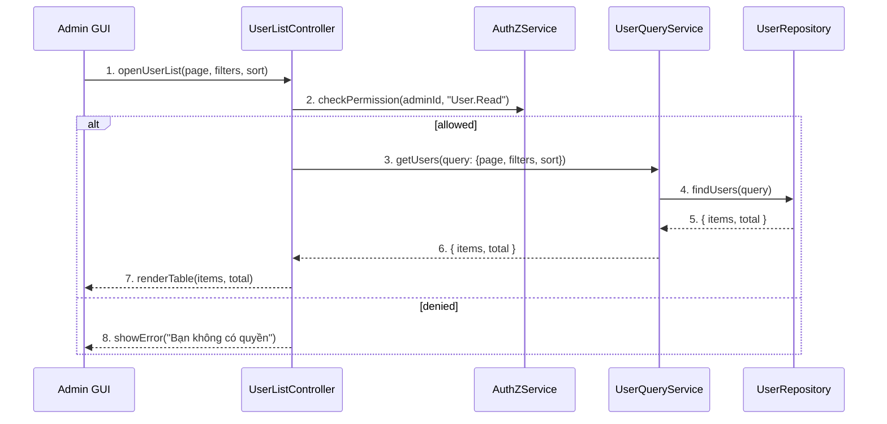

---

## IV. Đặc Tả Chi Tiết Luồng Tương Tác (Interaction Flow Specification)

### A. Luồng Thành công Chính (Basic Success Flow)

| STT | Hành động | Thông điệp (Message) | Sync/Async | Định nghĩa Input | Định nghĩa Output | Nguồn (Source) | Đích (Target) | Lỗi/Timeout | Giao dịch (Txn) |
| :--- | :--- | :--- | :--- | :--- | :--- | :--- | :--- | :--- | :--- |
| 1 | Admin mở trang danh sách | `openUserList(page, filters, sort)` | Sync | `{ page:number, filters:object, sort:string }` | `200 OK` | L1 | L2 | 401 | N/A |
| 2 | Kiểm tra quyền | `checkPermission(adminId, "User.Read")` | Sync | `{ adminId:string }` | `{ allowed:boolean }` | L2 | L4 | 403 | N/A |
| 3 | Gọi service truy vấn | `getUsers(query)` | Sync | `{ page, filters, sort }` | `{ items[], total }` | L2 | L3 | 5xx | Đọc |
| 4 | Truy vấn CSDL | `findUsers(query)` | Sync | `{ ... }` | `{ items[], total }` | L3 | L5 | 5xx | Đọc |
| 5 | Trả kết quả và hiển thị | `renderTable(items, total)` | Sync | `{ items[], total }` | UI updated | L2 | L1 | - | N/A |

### B. Luồng Thay thế / Ngoại lệ (Alternative / Exception Flows)

| Fragment ID | Loại | Guard Condition | Ảnh hưởng bước | Error Code/Type | Chiến lược khôi phục | Thông điệp hiển thị | Telemetry |
| :--- | :--- | :--- | :--- | :--- | :--- | :--- | :--- |
| AF-1 | [alt] | Không có dữ liệu | Thay thế bước 5 | EMPTY | Hiển thị bảng rỗng | "Không tìm thấy người dùng" | log: info |
| EF-1 | [alt] | Thiếu quyền | Thay thế 3-5 | PERMISSION_DENIED | Dừng luồng | "Bạn không có quyền" | log: warn |
| EF-2 | [alt] | Lỗi tải dữ liệu | Thay thế 5 | SERVER_ERROR | Cho phép thử lại | "Không thể tải danh sách" | log: error |

---


---

# UC-A1 - SD-UCA01-2

> Extracted from: `DOCS/SD/UC-A1/SD-UCA01-2.md`

## II. Danh Sách Đối Tượng Tham Gia (Participants / Lifelines)

| ID | Tên Đối tượng (Lifeline) | Vai trò/Loại (Stereotype) | Chủ quản (Ownership) | Giao thức/Interface (Protocol) | Phiên bản API | Mô tả chi tiết |
| :--- | :--- | :--- | :--- | :--- | :--- | :--- |
| L1 | Admin GUI | Boundary | Web Admin | HTTP | n/a | Giao diện trang chi tiết người dùng |
| L2 | UserDetailController | Control | Core | Internal | v1 | Điều phối request/response, breadcrumb |
| L3 | UserDetailService | Service | Core | Internal | v1 | Nghiệp vụ tổng hợp dữ liệu chi tiết |
| L4 | AuthZService | Service | Core | Internal | v1 | Kiểm tra quyền `User.Read` |
| L5 | UserRepository | Entity/DAO | Data | SQL | n/a | Đọc hồ sơ và trạng thái người dùng |
| L6 | ActivityRepository | Entity/DAO | Data | SQL | n/a | Lịch sử hoạt động, thống kê |

---

## III. Biểu Đồ Sequence Diagram (Visual Model)

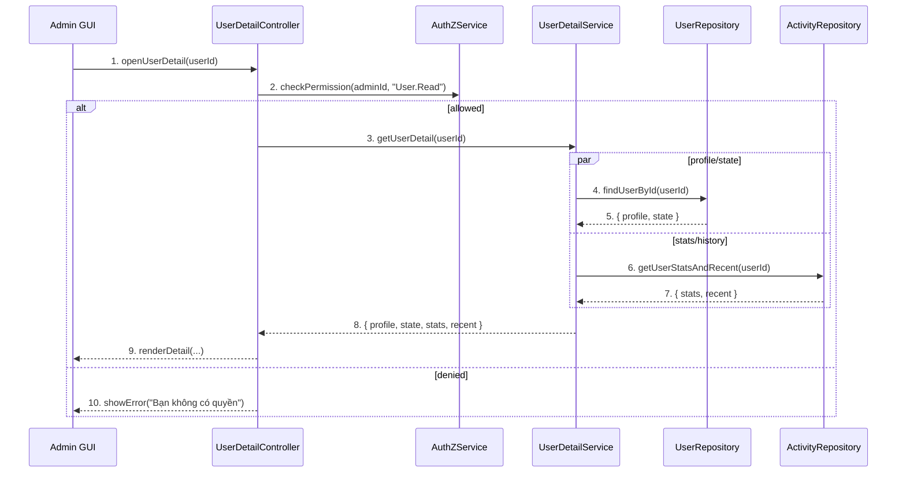

---

## IV. Đặc Tả Chi Tiết Luồng Tương Tác (Interaction Flow Specification)

### A. Luồng Thành công Chính (Basic Success Flow)

| STT | Hành động | Thông điệp (Message) | Sync/Async | Định nghĩa Input | Định nghĩa Output | Nguồn (Source) | Đích (Target) | Lỗi/Timeout | Giao dịch (Txn) |
| :--- | :--- | :--- | :--- | :--- | :--- | :--- | :--- | :--- | :--- |
| 1 | Admin mở trang chi tiết | `openUserDetail(userId)` | Sync | `{ userId:string }` | `200 OK` | L1 | L2 | 401 | N/A |
| 2 | Kiểm tra quyền | `checkPermission(adminId, "User.Read")` | Sync | `{ adminId:string }` | `{ allowed:boolean }` | L2 | L4 | 403 | N/A |
| 3 | Tổng hợp dữ liệu | `getUserDetail(userId)` | Sync | `{ userId }` | `{ profile, state, stats, recent }` | L2 | L3 | 5xx | Đọc |
| 4 | Đọc hồ sơ | `findUserById(userId)` | Sync | `{ userId }` | `{ profile, state }` | L3 | L5 | 404/5xx | Đọc |
| 5 | Đọc thống kê/lịch sử | `getUserStatsAndRecent(userId)` | Sync | `{ userId }` | `{ stats, recent }` | L3 | L6 | 5xx | Đọc |
| 6 | Trả kết quả và hiển thị | `renderDetail(...)` | Sync | `{ all }` | UI updated | L2 | L1 | - | N/A |

### B. Luồng Thay thế / Ngoại lệ (Alternative / Exception Flows)

| Fragment ID | Loại | Guard Condition | Ảnh hưởng bước | Error Code/Type | Chiến lược khôi phục | Thông điệp hiển thị | Telemetry |
| :--- | :--- | :--- | :--- | :--- | :--- | :--- | :--- |
| EF-1 | [alt] | Người dùng không tồn tại | Thay thế 4-6 | NOT_FOUND | Dừng luồng | "Người dùng không tồn tại" | log: warn |
| EF-2 | [alt] | Thiếu quyền | Thay thế 3-6 | PERMISSION_DENIED | Dừng luồng | "Bạn không có quyền" | log: warn |
| EF-3 | [alt] | Lỗi tải dữ liệu | Thay thế 6 | SERVER_ERROR | Cho phép thử lại | "Không thể tải thông tin" | log: error |

---


---

# UC-A1 - SD-UCA01-3

> Extracted from: `DOCS/SD/UC-A1/SD-UCA01-3.md`

## II. Danh Sách Đối Tượng Tham Gia (Participants / Lifelines)

| ID | Tên Đối tượng (Lifeline) | Vai trò/Loại (Stereotype) | Chủ quản (Ownership) | Giao thức/Interface (Protocol) | Phiên bản API | Mô tả chi tiết |
| :--- | :--- | :--- | :--- | :--- | :--- | :--- |
| L1 | Admin GUI | Boundary | Web Admin | HTTP | n/a | Giao diện hành động khóa |
| L2 | UserAdminController | Control | Core | Internal | v1 | Điều phối xác nhận và gọi service |
| L3 | UserAdminService | Service | Core | Internal | v1 | Nghiệp vụ khóa tài khoản |
| L4 | AuthZService | Service | Core | Internal | v1 | Kiểm tra quyền `User.Disable` |
| L5 | UserRepository | Entity/DAO | Data | SQL | n/a | Cập nhật trạng thái `locked`, lý do, hạn |
| L6 | SessionService | Service | Core | Internal | v1 | Đăng xuất toàn bộ phiên của người dùng |
| L7 | AuditLogService | Service | Core | Internal | v1 | Ghi nhận sự kiện khóa |
| L8 | NotificationService | Service | Core | Internal | v1 | Gửi email thông báo (tuỳ chọn) |

---

## III. Biểu Đồ Sequence Diagram (Visual Model)

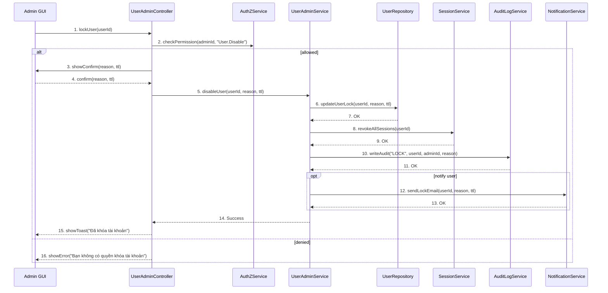

---

## IV. Đặc Tả Chi Tiết Luồng Tương Tác (Interaction Flow Specification)

### A. Luồng Thành công Chính (Basic Success Flow)

| STT | Hành động | Thông điệp (Message) | Sync/Async | Định nghĩa Input | Định nghĩa Output | Nguồn (Source) | Đích (Target) | Lỗi/Timeout | Giao dịch (Txn) |
| :--- | :--- | :--- | :--- | :--- | :--- | :--- | :--- | :--- | :--- |
| 1 | Admin yêu cầu khóa | `lockUser(userId)` | Sync | `{ userId }` | `200 OK` | L1 | L2 | 401 | N/A |
| 2 | Kiểm tra quyền | `checkPermission(adminId, "User.Disable")` | Sync | `{ adminId }` | `{ allowed }` | L2 | L4 | 403 | N/A |
| 3 | Xác nhận | `showConfirm(...)` | Sync | `{ reason, ttl }` | `confirm` | L2 | L1 | - | N/A |
| 4 | Gọi service khóa | `disableUser(userId, reason, ttl)` | Sync | `{ userId, reason, ttl }` | `OK` | L2 | L3 | 5xx | Bắt đầu |
| 5 | Cập nhật DB | `updateUserLock(...)` | Sync | `{ ... }` | `OK` | L3 | L5 | 5xx | Ghi |
| 6 | Thu hồi phiên | `revokeAllSessions(userId)` | Sync | `{ userId }` | `OK` | L3 | L6 | 5xx | Ghi |
| 7 | Audit | `writeAudit("LOCK", ...)` | Sync | `{ ... }` | `OK` | L3 | L7 | 5xx | Ghi |
| 8 | Thông báo (opt) | `sendLockEmail(...)` | Async | `{ ... }` | `Accepted` | L3 | L8 | timeout | N/A |
| 9 | Trả về UI | `showToast("Đã khóa tài khoản")` | Sync | `-` | UI updated | L2 | L1 | - | Kết thúc |

### B. Luồng Thay thế / Ngoại lệ (Alternative / Exception Flows)

| Fragment ID | Loại | Guard Condition | Ảnh hưởng bước | Error Code/Type | Chiến lược khôi phục | Thông điệp hiển thị | Telemetry |
| :--- | :--- | :--- | :--- | :--- | :--- | :--- | :--- |
| EF-1 | [alt] | Thiếu quyền | Thay thế 3-9 | PERMISSION_DENIED | Dừng luồng | "Bạn không có quyền khóa tài khoản" | log: warn |
| EF-2 | [alt] | Tài khoản đã bị khóa | Thay thế 4-9 | ALREADY_LOCKED | Dừng luồng | "Tài khoản đã ở trạng thái bị khóa" | log: info |
| EF-3 | [alt] | Lỗi cập nhật CSDL | Thay thế 6-9 | DB_ERROR | Cho phép thử lại | "Không thể cập nhật trạng thái" | log: error |

---


---

# UC-A1 - SD-UCA01-4

> Extracted from: `DOCS/SD/UC-A1/SD-UCA01-4.md`

## II. Danh Sách Đối Tượng Tham Gia (Participants / Lifelines)

| ID | Tên Đối tượng (Lifeline) | Vai trò/Loại (Stereotype) | Chủ quản (Ownership) | Giao thức/Interface (Protocol) | Phiên bản API | Mô tả chi tiết |
| :--- | :--- | :--- | :--- | :--- | :--- | :--- |
| L1 | Admin GUI | Boundary | Web Admin | HTTP | n/a | Giao diện hành động mở khóa |
| L2 | UserAdminController | Control | Core | Internal | v1 | Điều phối xác nhận và gọi service |
| L3 | UserAdminService | Service | Core | Internal | v1 | Nghiệp vụ mở khóa tài khoản |
| L4 | AuthZService | Service | Core | Internal | v1 | Kiểm tra quyền `User.Enable` |
| L5 | UserRepository | Entity/DAO | Data | SQL | n/a | Cập nhật trạng thái `active`, ghi chú |
| L6 | AuditLogService | Service | Core | Internal | v1 | Ghi nhận sự kiện mở khóa |
| L7 | NotificationService | Service | Core | Internal | v1 | Gửi email thông báo (tuỳ chọn) |

---

## III. Biểu Đồ Sequence Diagram (Visual Model)

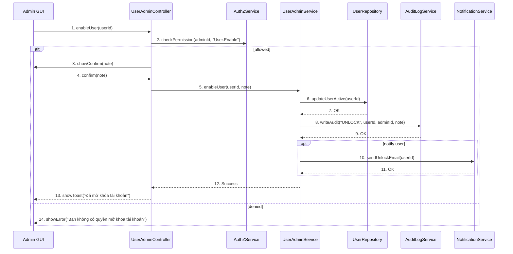

---

## IV. Đặc Tả Chi Tiết Luồng Tương Tác (Interaction Flow Specification)

### A. Luồng Thành công Chính (Basic Success Flow)

| STT | Hành động | Thông điệp (Message) | Sync/Async | Định nghĩa Input | Định nghĩa Output | Nguồn (Source) | Đích (Target) | Lỗi/Timeout | Giao dịch (Txn) |
| :--- | :--- | :--- | :--- | :--- | :--- | :--- | :--- | :--- | :--- |
| 1 | Admin yêu cầu mở khóa | `enableUser(userId)` | Sync | `{ userId }` | `200 OK` | L1 | L2 | 401 | N/A |
| 2 | Kiểm tra quyền | `checkPermission(adminId, "User.Enable")` | Sync | `{ adminId }` | `{ allowed }` | L2 | L4 | 403 | N/A |
| 3 | Xác nhận | `showConfirm(note)` | Sync | `{ note? }` | `confirm` | L2 | L1 | - | N/A |
| 4 | Gọi service mở khóa | `enableUser(userId, note)` | Sync | `{ userId, note }` | `OK` | L2 | L3 | 5xx | Bắt đầu |
| 5 | Cập nhật DB | `updateUserActive(userId)` | Sync | `{ userId }` | `OK` | L3 | L5 | 5xx | Ghi |
| 6 | Audit | `writeAudit("UNLOCK", ...)` | Sync | `{ ... }` | `OK` | L3 | L6 | 5xx | Ghi |
| 7 | Thông báo (opt) | `sendUnlockEmail(...)` | Async | `{ userId }` | `Accepted` | L3 | L7 | timeout | N/A |
| 8 | Trả về UI | `showToast("Đã mở khóa tài khoản")` | Sync | `-` | UI updated | L2 | L1 | - | Kết thúc |

### B. Luồng Thay thế / Ngoại lệ (Alternative / Exception Flows)

| Fragment ID | Loại | Guard Condition | Ảnh hưởng bước | Error Code/Type | Chiến lược khôi phục | Thông điệp hiển thị | Telemetry |
| :--- | :--- | :--- | :--- | :--- | :--- | :--- | :--- |
| EF-1 | [alt] | Thiếu quyền | Thay thế 3-8 | PERMISSION_DENIED | Dừng luồng | "Bạn không có quyền mở khóa tài khoản" | log: warn |
| EF-2 | [alt] | Tài khoản đang hoạt động | Thay thế 4-8 | ALREADY_ACTIVE | Dừng luồng | "Tài khoản đang hoạt động" | log: info |
| EF-3 | [alt] | Lỗi cập nhật CSDL | Thay thế 6-8 | DB_ERROR | Cho phép thử lại | "Không thể cập nhật trạng thái" | log: error |

---


---

# UC-A2 - SD-UCA02-1

> Extracted from: `DOCS/SD/UC-A2/SD-UCA02-1.md`

## II. Danh Sách Đối Tượng Tham Gia (Participants / Lifelines)

| ID | Tên Đối tượng (Lifeline) | Vai trò/Loại (Stereotype) | Chủ quản (Ownership) | Giao thức/Interface (Protocol) | Phiên bản API | Mô tả chi tiết |
| :--- | :--- | :--- | :--- | :--- | :--- | :--- |
| L1 | Admin GUI | Boundary | Web Admin | HTTP | n/a | Trang "Quản lý Công thức" |
| L2 | RecipeListController | Control | Core | Internal | v1 | Điều phối request/response |
| L3 | RecipeQueryService | Service | Core | Internal | v1 | Nghiệp vụ filter/sort/paging |
| L4 | AuthZService | Service | Core | Internal | v1 | Kiểm tra quyền `Recipe.Read` |
| L5 | RecipeRepository | Entity/DAO | Data | SQL | n/a | Truy cập bảng `Recipe` |

---

## III. Biểu Đồ Sequence Diagram (Visual Model)

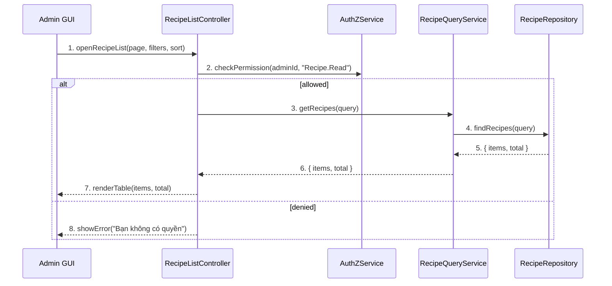

---

## IV. Đặc Tả Chi Tiết Luồng Tương Tác (Interaction Flow Specification)

### A. Luồng Thành công Chính (Basic Success Flow)

| STT | Hành động | Thông điệp (Message) | Sync/Async | Input | Output | Nguồn | Đích | Lỗi/Timeout | Txn |
| :--- | :--- | :--- | :--- | :--- | :--- | :--- | :--- | :--- | :--- |
| 1 | Admin mở trang | `openRecipeList(...)` | Sync | `{ page, filters, sort }` | `200 OK` | L1 | L2 | 401 | N/A |
| 2 | Kiểm tra quyền | `checkPermission(..., "Recipe.Read")` | Sync | `{ adminId }` | `{ allowed }` | L2 | L4 | 403 | N/A |
| 3 | Gọi service | `getRecipes(query)` | Sync | `{ ... }` | `{ items, total }` | L2 | L3 | 5xx | Đọc |
| 4 | Truy vấn DB | `findRecipes(query)` | Sync | `{ ... }` | `{ items, total }` | L3 | L5 | 5xx | Đọc |
| 5 | Render UI | `renderTable(...)` | Sync | `{ items, total }` | UI updated | L2 | L1 | - | N/A |

### B. Luồng Thay thế / Ngoại lệ (Alternative / Exception Flows)

| Fragment ID | Loại | Guard Condition | Ảnh hưởng bước | Error Code/Type | Chiến lược khôi phục | Thông điệp hiển thị | Telemetry |
| :--- | :--- | :--- | :--- | :--- | :--- | :--- | :--- |
| AF-1 | [alt] | Không có dữ liệu | Thay thế 5 | EMPTY | Hiển thị bảng rỗng | "Không tìm thấy công thức" | log: info |
| EF-1 | [alt] | Thiếu quyền | Thay thế 3-5 | PERMISSION_DENIED | Dừng luồng | "Bạn không có quyền" | log: warn |
| EF-2 | [alt] | Lỗi tải dữ liệu | Thay thế 5 | SERVER_ERROR | Cho phép thử lại | "Không thể tải danh sách" | log: error |

---


---

# UC-A2 - SD-UCA02-2

> Extracted from: `DOCS/SD/UC-A2/SD-UCA02-2.md`

## II. Danh Sách Đối Tượng Tham Gia (Participants / Lifelines)

| ID | Tên Đối tượng (Lifeline) | Vai trò/Loại (Stereotype) | Chủ quản (Ownership) | Giao thức/Interface (Protocol) | Phiên bản API | Mô tả chi tiết |
| :--- | :--- | :--- | :--- | :--- | :--- | :--- |
| L1 | Admin GUI | Boundary | Web Admin | HTTP | n/a | Form tạo công thức |
| L2 | RecipeAdminController | Control | Core | Internal | v1 | Điều phối tạo/sửa |
| L3 | RecipeAdminService | Service | Core | Internal | v1 | Nghiệp vụ tạo công thức |
| L4 | AuthZService | Service | Core | Internal | v1 | Kiểm tra quyền `Recipe.Create` |
| L5 | MediaService | Service | Core | Internal | v1 | Upload/validate media |
| L6 | RecipeRepository | Entity/DAO | Data | SQL | n/a | Lưu công thức |

---

## III. Biểu Đồ Sequence Diagram (Visual Model)

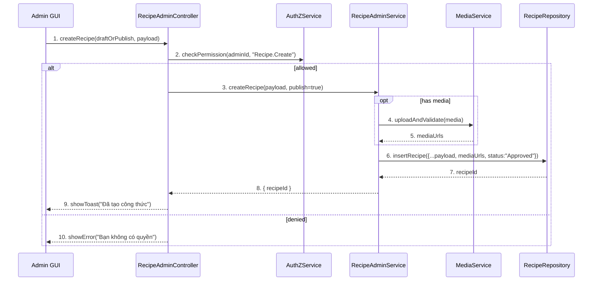

---

## IV. Đặc Tả Chi Tiết Luồng Tương Tác (Interaction Flow Specification)

### A. Luồng Thành công Chính (Basic Success Flow)

| STT | Hành động | Thông điệp (Message) | Sync/Async | Input | Output | Nguồn | Đích | Lỗi/Timeout | Txn |
| :--- | :--- | :--- | :--- | :--- | :--- | :--- | :--- | :--- | :--- |
| 1 | Submit tạo | `createRecipe(...)` | Sync | `{ payload }` | `202/200` | L1 | L2 | 401 | N/A |
| 2 | Kiểm tra quyền | `checkPermission(..., "Recipe.Create")` | Sync | `{ adminId }` | `{ allowed }` | L2 | L4 | 403 | N/A |
| 3 | Xử lý media | `uploadAndValidate(media)` | Sync | `{ files }` | `{ urls }` | L3 | L5 | timeout | Đang mở |
| 4 | Ghi CSDL | `insertRecipe(...)` | Sync | `{ data }` | `{ recipeId }` | L3 | L6 | 5xx | Ghi |
| 5 | Phản hồi UI | `showToast(...)` | Sync | `{ message }` | UI updated | L2 | L1 | - | Kết thúc |

### B. Luồng Thay thế / Ngoại lệ (Alternative / Exception Flows)

| Fragment ID | Loại | Guard Condition | Ảnh hưởng bước | Error Code/Type | Chiến lược khôi phục | Thông điệp hiển thị | Telemetry |
| :--- | :--- | :--- | :--- | :--- | :--- | :--- | :--- |
| AF-1 | [opt] | Lưu nháp | Thay thế 4 | DRAFT | Lưu trạng thái nháp | "Đã lưu nháp" | log: info |
| EF-1 | [alt] | Thiếu quyền | Thay thế 3-5 | PERMISSION_DENIED | Dừng luồng | "Bạn không có quyền" | log: warn |
| EF-2 | [alt] | Lỗi media | Thay thế 4-5 | MEDIA_INVALID | Yêu cầu chọn lại | "Media không hợp lệ" | log: warn |
| EF-3 | [alt] | Lỗi CSDL | Thay thế 5 | DB_ERROR | Cho phép thử lại | "Không thể lưu" | log: error |

---


---

# UC-A2 - SD-UCA02-3

> Extracted from: `DOCS/SD/UC-A2/SD-UCA02-3.md`

## II. Danh Sách Đối Tượng Tham Gia (Participants / Lifelines)

| ID | Tên Đối tượng (Lifeline) | Vai trò/Loại (Stereotype) | Chủ quản (Ownership) | Giao thức/Interface (Protocol) | Phiên bản API | Mô tả chi tiết |
| :--- | :--- | :--- | :--- | :--- | :--- | :--- |
| L1 | Admin GUI | Boundary | Web Admin | HTTP | n/a | Form sửa công thức |
| L2 | RecipeAdminController | Control | Core | Internal | v1 | Điều phối |
| L3 | RecipeAdminService | Service | Core | Internal | v1 | Nghiệp vụ cập nhật |
| L4 | AuthZService | Service | Core | Internal | v1 | Kiểm tra quyền `Recipe.Update` |
| L5 | RecipeRepository | Entity/DAO | Data | SQL | n/a | Đọc/ghi công thức |
| L6 | MediaService | Service | Core | Internal | v1 | Upload/validate media |
| L7 | VersioningService | Service | Core | Internal | v1 | Ghi lịch sử/phiên bản |

---

## III. Biểu Đồ Sequence Diagram (Visual Model)

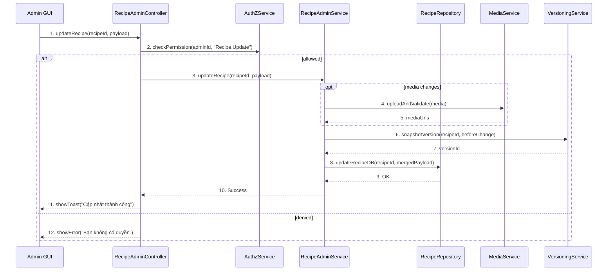

---

## IV. Đặc Tả Chi Tiết Luồng Tương Tác (Interaction Flow Specification)

### A. Luồng Thành công Chính (Basic Success Flow)

| STT | Hành động | Thông điệp (Message) | Sync/Async | Input | Output | Nguồn | Đích | Lỗi/Timeout | Txn |
| :--- | :--- | :--- | :--- | :--- | :--- | :--- | :--- | :--- | :--- |
| 1 | Submit sửa | `updateRecipe(...)` | Sync | `{ recipeId, payload }` | `200` | L1 | L2 | 401 | N/A |
| 2 | Kiểm tra quyền | `checkPermission(..., "Recipe.Update")` | Sync | `{ adminId }` | `{ allowed }` | L2 | L4 | 403 | N/A |
| 3 | Ảnh/media | `uploadAndValidate(...)` | Sync | `{ files }` | `{ urls }` | L3 | L6 | timeout | Đang mở |
| 4 | Versioning | `snapshotVersion(...)` | Sync | `{ recipeId }` | `{ versionId }` | L3 | L7 | 5xx | Ghi |
| 5 | Cập nhật DB | `updateRecipeDB(...)` | Sync | `{ recipeId, data }` | `OK` | L3 | L5 | 5xx | Ghi |
| 6 | Phản hồi UI | `showToast(...)` | Sync | `{ message }` | UI updated | L2 | L1 | - | Kết thúc |

### B. Luồng Thay thế / Ngoại lệ (Alternative / Exception Flows)

| Fragment ID | Loại | Guard Condition | Ảnh hưởng bước | Error Code/Type | Chiến lược khôi phục | Thông điệp hiển thị | Telemetry |
| :--- | :--- | :--- | :--- | :--- | :--- | :--- | :--- |
| AF-1 | [opt] | Lưu nháp | Thay thế 5 | DRAFT | Lưu draft | "Đã lưu nháp" | log: info |
| EF-1 | [alt] | Thiếu quyền | Thay thế 3-6 | PERMISSION_DENIED | Dừng | "Bạn không có quyền" | log: warn |
| EF-2 | [alt] | Dữ liệu không hợp lệ | Thay thế 5-6 | VALIDATION_ERROR | Sửa lỗi | "Dữ liệu không hợp lệ" | log: warn |
| EF-3 | [alt] | Lỗi CSDL | Thay thế 6 | DB_ERROR | Retry | "Không thể cập nhật" | log: error |

---


---

# UC-A2 - SD-UCA02-4

> Extracted from: `DOCS/SD/UC-A2/SD-UCA02-4.md`

## II. Danh Sách Đối Tượng Tham Gia (Participants / Lifelines)

| ID | Tên Đối tượng (Lifeline) | Vai trò/Loại (Stereotype) | Chủ quản (Ownership) | Giao thức/Interface (Protocol) | Phiên bản API | Mô tả chi tiết |
| :--- | :--- | :--- | :--- | :--- | :--- | :--- |
| L1 | Admin GUI | Boundary | Web Admin | HTTP | n/a | UI xác nhận xóa |
| L2 | RecipeAdminController | Control | Core | Internal | v1 | Điều phối |
| L3 | RecipeAdminService | Service | Core | Internal | v1 | Nghiệp vụ xóa |
| L4 | AuthZService | Service | Core | Internal | v1 | Quyền `Recipe.Delete` |
| L5 | RecipeRepository | Entity/DAO | Data | SQL | n/a | Xóa bản ghi |
| L6 | MediaService | Service | Core | Internal | v1 | Xóa file media |
| L7 | AuditLogService | Service | Core | Internal | v1 | Ghi audit |

---

## III. Biểu Đồ Sequence Diagram (Visual Model)

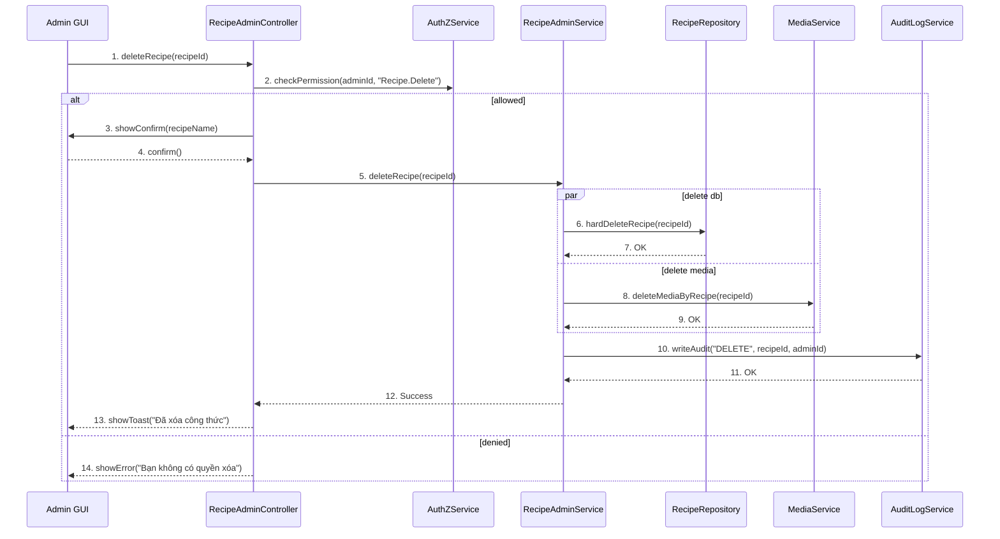

---

## IV. Đặc Tả Chi Tiết Luồng Tương Tác (Interaction Flow Specification)

### A. Luồng Thành công Chính (Basic Success Flow)

| STT | Hành động | Thông điệp (Message) | Sync/Async | Input | Output | Nguồn | Đích | Lỗi/Timeout | Txn |
| :--- | :--- | :--- | :--- | :--- | :--- | :--- | :--- | :--- | :--- |
| 1 | Yêu cầu xóa | `deleteRecipe(recipeId)` | Sync | `{ recipeId }` | `200` | L1 | L2 | 401 | N/A |
| 2 | Kiểm tra quyền | `checkPermission(..., "Recipe.Delete")` | Sync | `{ adminId }` | `{ allowed }` | L2 | L4 | 403 | N/A |
| 3 | Xác nhận | `showConfirm(name)` | Sync | `{ name }` | `confirm` | L2 | L1 | - | N/A |
| 4 | Xóa DB | `hardDeleteRecipe(recipeId)` | Sync | `{ recipeId }` | `OK` | L3 | L5 | 5xx | Ghi |
| 5 | Xóa media | `deleteMediaByRecipe(recipeId)` | Sync | `{ recipeId }` | `OK` | L3 | L6 | timeout | Ghi |
| 6 | Audit | `writeAudit("DELETE", ...)` | Sync | `{ ... }` | `OK` | L3 | L7 | 5xx | Ghi |
| 7 | Phản hồi UI | `showToast(...)` | Sync | `{ message }` | UI updated | L2 | L1 | - | Kết thúc |

### B. Luồng Thay thế / Ngoại lệ (Alternative / Exception Flows)

| Fragment ID | Loại | Guard Condition | Ảnh hưởng bước | Error Code/Type | Chiến lược khôi phục | Thông điệp hiển thị | Telemetry |
| :--- | :--- | :--- | :--- | :--- | :--- | :--- | :--- |
| AF-1 | [opt] | Soft delete | Thay thế 4 | SOFT_DELETE | Cho phép khôi phục | "Đã ẩn công thức" | log: info |
| EF-1 | [alt] | Thiếu quyền | Thay thế 3-7 | PERMISSION_DENIED | Dừng | "Bạn không có quyền" | log: warn |
| EF-2 | [alt] | Không tồn tại | Thay thế 4-7 | NOT_FOUND | Dừng | "Công thức không tồn tại" | log: warn |
| EF-3 | [alt] | Lỗi CSDL/Storage | Thay thế 6-7 | SYSTEM_ERROR | Retry | "Không thể xóa" | log: error |

---


---

# UC-A2 - SD-UCA02-5

> Extracted from: `DOCS/SD/UC-A2/SD-UCA02-5.md`

## II. Danh Sách Đối Tượng Tham Gia (Participants / Lifelines)

| ID | Tên Đối tượng (Lifeline) | Vai trò/Loại (Stereotype) | Chủ quản (Ownership) | Giao thức/Interface (Protocol) | Phiên bản API | Mô tả chi tiết |
| :--- | :--- | :--- | :--- | :--- | :--- | :--- |
| L1 | Admin GUI | Boundary | Web Admin | HTTP | n/a | Trang "Công thức chờ duyệt" |
| L2 | ModerationController | Control | Core | Internal | v1 | Điều phối kiểm duyệt |
| L3 | ModerationQueryService | Service | Core | Internal | v1 | Truy vấn danh sách chờ duyệt |
| L4 | AuthZService | Service | Core | Internal | v1 | Quyền `Recipe.Moderate` |
| L5 | RecipeRepository | Entity/DAO | Data | SQL | n/a | Truy vấn theo trạng thái |

---

## III. Biểu Đồ Sequence Diagram (Visual Model)

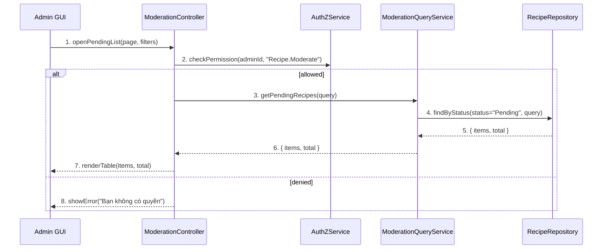

---

## IV. Đặc Tả Chi Tiết Luồng Tương Tác (Interaction Flow Specification)

### A. Luồng Thành công Chính (Basic Success Flow)

| STT | Hành động | Thông điệp (Message) | Sync/Async | Input | Output | Nguồn | Đích | Lỗi/Timeout | Txn |
| :--- | :--- | :--- | :--- | :--- | :--- | :--- | :--- | :--- | :--- |
| 1 | Mở danh sách | `openPendingList(...)` | Sync | `{ page, filters }` | `200` | L1 | L2 | 401 | N/A |
| 2 | Kiểm tra quyền | `checkPermission(..., "Recipe.Moderate")` | Sync | `{ adminId }` | `{ allowed }` | L2 | L4 | 403 | N/A |
| 3 | Gọi service | `getPendingRecipes(query)` | Sync | `{ ... }` | `{ items, total }` | L2 | L3 | 5xx | Đọc |
| 4 | Truy vấn DB | `findByStatus("Pending", ...)` | Sync | `{ ... }` | `{ items, total }` | L3 | L5 | 5xx | Đọc |
| 5 | Render UI | `renderTable(...)` | Sync | `{ items, total }` | UI updated | L2 | L1 | - | N/A |

### B. Luồng Thay thế / Ngoại lệ (Alternative / Exception Flows)

| Fragment ID | Loại | Guard Condition | Ảnh hưởng bước | Error Code/Type | Chiến lược khôi phục | Thông điệp hiển thị | Telemetry |
| :--- | :--- | :--- | :--- | :--- | :--- | :--- | :--- |
| AF-1 | [alt] | Không có công thức chờ duyệt | Thay thế 5 | EMPTY | Hiển thị bảng rỗng | "Không có công thức nào trong hàng đợi" | log: info |
| EF-1 | [alt] | Thiếu quyền | Thay thế 3-5 | PERMISSION_DENIED | Dừng | "Bạn không có quyền" | log: warn |
| EF-2 | [alt] | Lỗi tải dữ liệu | Thay thế 5 | SERVER_ERROR | Retry | "Không thể tải danh sách" | log: error |

---


---

# UC-A2 - SD-UCA02-6

> Extracted from: `DOCS/SD/UC-A2/SD-UCA02-6.md`

## II. Danh Sách Đối Tượng Tham Gia (Participants / Lifelines)

| ID | Tên Đối tượng (Lifeline) | Vai trò/Loại (Stereotype) | Chủ quản (Ownership) | Giao thức/Interface (Protocol) | Phiên bản API | Mô tả chi tiết |
| :--- | :--- | :--- | :--- | :--- | :--- | :--- |
| L1 | Admin GUI | Boundary | Web Admin | HTTP | n/a | UI chi tiết công thức |
| L2 | ModerationController | Control | Core | Internal | v1 | Điều phối |
| L3 | ModerationService | Service | Core | Internal | v1 | Nghiệp vụ phê duyệt/từ chối |
| L4 | AuthZService | Service | Core | Internal | v1 | Quyền `Recipe.Moderate` |
| L5 | RecipeRepository | Entity/DAO | Data | SQL | n/a | Cập nhật trạng thái |
| L6 | AuditLogService | Service | Core | Internal | v1 | Ghi log kiểm duyệt |
| L7 | NotificationService | Service | Core | Internal | v1 | Gửi thông báo |

---

## III. Biểu Đồ Sequence Diagram (Visual Model)

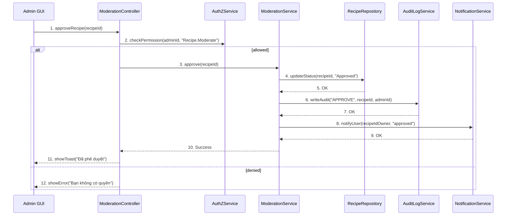

---

## IV. Đặc Tả Chi Tiết Luồng Tương Tác (Interaction Flow Specification)

### A. Luồng Thành công Chính (Basic Success Flow)

| STT | Hành động | Thông điệp (Message) | Sync/Async | Input | Output | Nguồn | Đích | Lỗi/Timeout | Txn |
| :--- | :--- | :--- | :--- | :--- | :--- | :--- | :--- | :--- | :--- |
| 1 | Yêu cầu phê duyệt | `approveRecipe(recipeId)` | Sync | `{ recipeId }` | `200` | L1 | L2 | 401 | N/A |
| 2 | Kiểm tra quyền | `checkPermission(..., "Recipe.Moderate")` | Sync | `{ adminId }` | `{ allowed }` | L2 | L4 | 403 | N/A |
| 3 | Cập nhật trạng thái | `updateStatus(..., "Approved")` | Sync | `{ recipeId }` | `OK` | L3 | L5 | 5xx | Ghi |
| 4 | Audit | `writeAudit("APPROVE", ...)` | Sync | `{ ... }` | `OK` | L3 | L6 | 5xx | Ghi |
| 5 | Thông báo | `notifyUser(...)` | Async | `{ userId, type }` | `Accepted` | L3 | L7 | timeout | N/A |
| 6 | Phản hồi UI | `showToast(...)` | Sync | `{ message }` | UI updated | L2 | L1 | - | Kết thúc |

### B. Luồng Thay thế / Ngoại lệ (Alternative / Exception Flows)

| Fragment ID | Loại | Guard Condition | Ảnh hưởng bước | Error Code/Type | Chiến lược khôi phục | Thông điệp hiển thị | Telemetry |
| :--- | :--- | :--- | :--- | :--- | :--- | :--- | :--- |
| EF-1 | [alt] | Thiếu quyền | Thay thế 3-6 | PERMISSION_DENIED | Dừng | "Bạn không có quyền" | log: warn |
| EF-2 | [alt] | Trạng thái không hợp lệ | Thay thế 3-6 | INVALID_STATE | Dừng | "Trạng thái không hợp lệ" | log: warn |
| EF-3 | [alt] | Lỗi CSDL | Thay thế 4-6 | DB_ERROR | Retry | "Không thể cập nhật" | log: error |

---


---

# UC-A2 - SD-UCA02-7

> Extracted from: `DOCS/SD/UC-A2/SD-UCA02-7.md`

## II. Danh Sách Đối Tượng Tham Gia (Participants / Lifelines)

| ID | Tên Đối tượng (Lifeline) | Vai trò/Loại (Stereotype) | Chủ quản (Ownership) | Giao thức/Interface (Protocol) | Phiên bản API | Mô tả chi tiết |
| :--- | :--- | :--- | :--- | :--- | :--- | :--- |
| L1 | Admin GUI | Boundary | Web Admin | HTTP | n/a | UI chi tiết công thức |
| L2 | ModerationController | Control | Core | Internal | v1 | Điều phối |
| L3 | ModerationService | Service | Core | Internal | v1 | Nghiệp vụ từ chối |
| L4 | AuthZService | Service | Core | Internal | v1 | Quyền `Recipe.Moderate` |
| L5 | RecipeRepository | Entity/DAO | Data | SQL | n/a | Cập nhật trạng thái và lý do |
| L6 | AuditLogService | Service | Core | Internal | v1 | Ghi log kiểm duyệt |
| L7 | NotificationService | Service | Core | Internal | v1 | Gửi thông báo |

---

## III. Biểu Đồ Sequence Diagram (Visual Model)

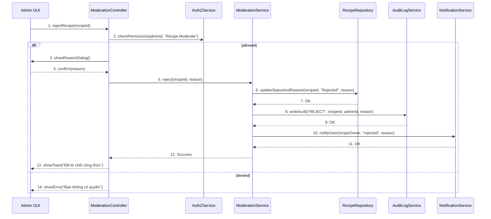

---

## IV. Đặc Tả Chi Tiết Luồng Tương Tác (Interaction Flow Specification)

### A. Luồng Thành công Chính (Basic Success Flow)

| STT | Hành động | Thông điệp (Message) | Sync/Async | Input | Output | Nguồn | Đích | Lỗi/Timeout | Txn |
| :--- | :--- | :--- | :--- | :--- | :--- | :--- | :--- | :--- | :--- |
| 1 | Yêu cầu từ chối | `rejectRecipe(recipeId)` | Sync | `{ recipeId }` | `200` | L1 | L2 | 401 | N/A |
| 2 | Kiểm tra quyền | `checkPermission(..., "Recipe.Moderate")` | Sync | `{ adminId }` | `{ allowed }` | L2 | L4 | 403 | N/A |
| 3 | Hộp thoại lý do | `showReasonDialog()` | Sync | `-` | `confirm(reason)` | L2 | L1 | - | N/A |
| 4 | Cập nhật trạng thái+lý do | `updateStatusAndReason(...)` | Sync | `{ recipeId, reason }` | `OK` | L3 | L5 | 5xx | Ghi |
| 5 | Audit | `writeAudit("REJECT", ...)` | Sync | `{ ... }` | `OK` | L3 | L6 | 5xx | Ghi |
| 6 | Thông báo | `notifyUser(...)` | Async | `{ userId, type, reason }` | `Accepted` | L3 | L7 | timeout | N/A |
| 7 | Phản hồi UI | `showToast(...)` | Sync | `{ message }` | UI updated | L2 | L1 | - | Kết thúc |

### B. Luồng Thay thế / Ngoại lệ (Alternative / Exception Flows)

| Fragment ID | Loại | Guard Condition | Ảnh hưởng bước | Error Code/Type | Chiến lược khôi phục | Thông điệp hiển thị | Telemetry |
| :--- | :--- | :--- | :--- | :--- | :--- | :--- | :--- |
| EF-1 | [alt] | Thiếu quyền | Thay thế 3-7 | PERMISSION_DENIED | Dừng | "Bạn không có quyền" | log: warn |
| EF-2 | [alt] | Trạng thái không hợp lệ | Thay thế 4-7 | INVALID_STATE | Dừng | "Trạng thái không hợp lệ" | log: warn |
| EF-3 | [alt] | Lỗi CSDL | Thay thế 5-7 | DB_ERROR | Retry | "Không thể cập nhật" | log: error |

---


---

# UC-A3 - SD-UCA03-1

> Extracted from: `DOCS/SD/UC-A3/SD-UCA03-1.md`

## II. Danh Sách Đối Tượng Tham Gia (Participants / Lifelines)

| ID | Tên Đối tượng (Lifeline) | Vai trò/Loại (Stereotype) | Chủ quản (Ownership) | Giao thức/Interface (Protocol) | Phiên bản API | Mô tả chi tiết |
| :--- | :--- | :--- | :--- | :--- | :--- | :--- |
| L1 | Admin GUI | Boundary | Web Admin | HTTP | n/a | Trang "Quản lý Danh mục" |
| L2 | CategoryController | Control | Core | Internal | v1 | Điều phối |
| L3 | CategoryQueryService | Service | Core | Internal | v1 | Truy vấn danh mục |
| L4 | AuthZService | Service | Core | Internal | v1 | Quyền `Category.Read` |
| L5 | CategoryRepository | Entity/DAO | Data | SQL | n/a | Truy cập `Category` |
| L6 | RecipeRepository | Entity/DAO | Data | SQL | n/a | Đếm số công thức theo danh mục |

---

## III. Biểu Đồ Sequence Diagram (Visual Model)

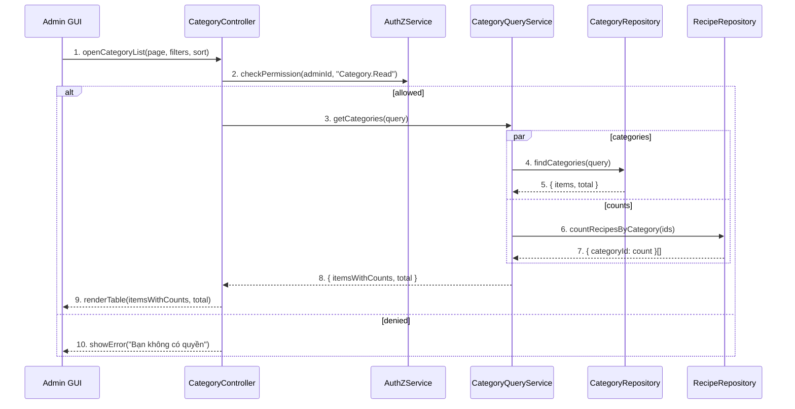

---

## IV. Đặc Tả Chi Tiết Luồng Tương Tác (Interaction Flow Specification)

### A. Luồng Thành công Chính (Basic Success Flow)

| STT | Hành động | Thông điệp (Message) | Sync/Async | Input | Output | Nguồn | Đích | Lỗi/Timeout | Txn |
| :--- | :--- | :--- | :--- | :--- | :--- | :--- | :--- | :--- | :--- |
| 1 | Mở danh sách | `openCategoryList(...)` | Sync | `{ page, filters, sort }` | `200` | L1 | L2 | 401 | N/A |
| 2 | Kiểm tra quyền | `checkPermission(..., "Category.Read")` | Sync | `{ adminId }` | `{ allowed }` | L2 | L4 | 403 | N/A |
| 3 | Truy vấn | `getCategories(query)` | Sync | `{ ... }` | `{ items, total }` | L2 | L3 | 5xx | Đọc |
| 4 | DB categories | `findCategories(query)` | Sync | `{ ... }` | `{ items, total }` | L3 | L5 | 5xx | Đọc |
| 5 | Đếm công thức | `countRecipesByCategory(ids)` | Sync | `{ ids[] }` | `{ id:count }[]` | L3 | L6 | 5xx | Đọc |
| 6 | Render UI | `renderTable(...)` | Sync | `{ itemsWithCounts, total }` | UI updated | L2 | L1 | - | N/A |

### B. Luồng Thay thế / Ngoại lệ (Alternative / Exception Flows)

| Fragment ID | Loại | Guard Condition | Ảnh hưởng bước | Error Code/Type | Chiến lược khôi phục | Thông điệp hiển thị | Telemetry |
| :--- | :--- | :--- | :--- | :--- | :--- | :--- | :--- |
| AF-1 | [alt] | Không có dữ liệu | Thay thế 6 | EMPTY | Bảng rỗng | "Chưa có danh mục" | log: info |
| EF-1 | [alt] | Thiếu quyền | Thay thế 3-6 | PERMISSION_DENIED | Dừng | "Bạn không có quyền" | log: warn |
| EF-2 | [alt] | Lỗi tải dữ liệu | Thay thế 6 | SERVER_ERROR | Retry | "Không thể tải danh sách" | log: error |

---


---

# UC-A3 - SD-UCA03-2

> Extracted from: `DOCS/SD/UC-A3/SD-UCA03-2.md`

## II. Danh Sách Đối Tượng Tham Gia (Participants / Lifelines)

| ID | Tên Đối tượng (Lifeline) | Vai trò/Loại (Stereotype) | Chủ quản (Ownership) | Giao thức/Interface (Protocol) | Phiên bản API | Mô tả chi tiết |
| :--- | :--- | :--- | :--- | :--- | :--- | :--- |
| L1 | Admin GUI | Boundary | Web Admin | HTTP | n/a | Form tạo danh mục |
| L2 | CategoryAdminController | Control | Core | Internal | v1 | Điều phối |
| L3 | CategoryAdminService | Service | Core | Internal | v1 | Nghiệp vụ tạo |
| L4 | AuthZService | Service | Core | Internal | v1 | Quyền `Category.Create` |
| L5 | CategoryRepository | Entity/DAO | Data | SQL | n/a | Lưu danh mục |

---

## III. Biểu Đồ Sequence Diagram (Visual Model)

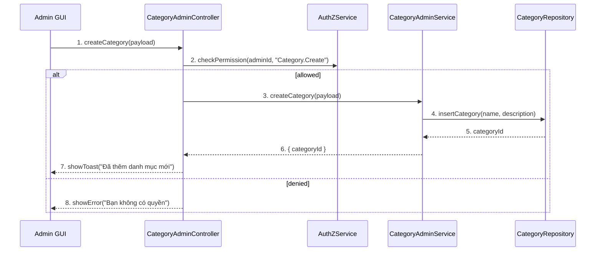

---

## IV. Đặc Tả Chi Tiết Luồng Tương Tác (Interaction Flow Specification)

### A. Luồng Thành công Chính (Basic Success Flow)

| STT | Hành động | Thông điệp (Message) | Sync/Async | Input | Output | Nguồn | Đích | Lỗi/Timeout | Txn |
| :--- | :--- | :--- | :--- | :--- | :--- | :--- | :--- | :--- | :--- |
| 1 | Submit tạo | `createCategory(payload)` | Sync | `{ name, description? }` | `200` | L1 | L2 | 401 | N/A |
| 2 | Kiểm tra quyền | `checkPermission(..., "Category.Create")` | Sync | `{ adminId }` | `{ allowed }` | L2 | L4 | 403 | N/A |
| 3 | Ghi DB | `insertCategory(...)` | Sync | `{ name, description }` | `{ categoryId }` | L3 | L5 | 409/5xx | Ghi |
| 4 | Phản hồi UI | `showToast(...)` | Sync | `{ message }` | UI updated | L2 | L1 | - | Kết thúc |

### B. Luồng Thay thế / Ngoại lệ (Alternative / Exception Flows)

| Fragment ID | Loại | Guard Condition | Ảnh hưởng bước | Error Code/Type | Chiến lược khôi phục | Thông điệp hiển thị | Telemetry |
| :--- | :--- | :--- | :--- | :--- | :--- | :--- | :--- |
| EF-1 | [alt] | Thiếu quyền | Thay thế 3-4 | PERMISSION_DENIED | Dừng | "Bạn không có quyền" | log: warn |
| EF-2 | [alt] | Tên trùng | Thay thế 3-4 | DUPLICATE_NAME | Sửa tên | "Tên danh mục đã tồn tại" | log: warn |
| EF-3 | [alt] | Lỗi CSDL | Thay thế 4 | DB_ERROR | Retry | "Không thể lưu" | log: error |

---


---

# UC-A3 - SD-UCA03-3

> Extracted from: `DOCS/SD/UC-A3/SD-UCA03-3.md`

## II. Danh Sách Đối Tượng Tham Gia (Participants / Lifelines)

| ID | Tên Đối tượng | Stereotype | Ownership | Protocol | API Ver | Mô tả |
| :--- | :--- | :--- | :--- | :--- | :--- | :--- |
| L1 | Admin GUI | Boundary | Web Admin | HTTP | n/a | Form sửa danh mục |
| L2 | CategoryAdminController | Control | Core | Internal | v1 | Điều phối |
| L3 | CategoryAdminService | Service | Core | Internal | v1 | Nghiệp vụ cập nhật |
| L4 | AuthZService | Service | Core | Internal | v1 | Quyền `Category.Update` |
| L5 | CategoryRepository | Entity/DAO | Data | SQL | n/a | Cập nhật danh mục |

---

## III. Biểu Đồ Sequence Diagram (Visual Model)

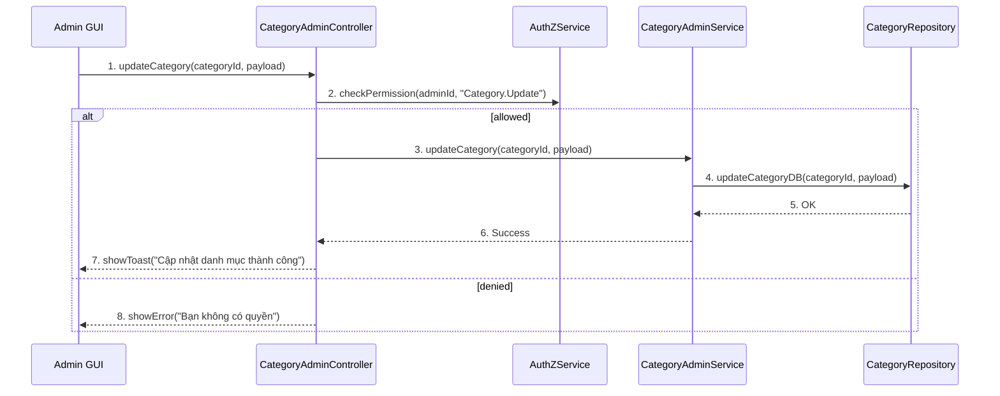

---

## IV. Đặc Tả Chi Tiết Luồng Tương Tác (Interaction Flow Specification)

### A. Luồng Thành công Chính (Basic Success Flow)

| STT | Hành động | Message | Sync/Async | Input | Output | Source | Target | Error/Timeout | Txn |
| :--- | :--- | :--- | :--- | :--- | :--- | :--- | :--- | :--- | :--- |
| 1 | Submit sửa | `updateCategory(...)` | Sync | `{ id, name?, description? }` | `200` | L1 | L2 | 401 | N/A |
| 2 | Kiểm tra quyền | `checkPermission(..., "Category.Update")` | Sync | `{ adminId }` | `{ allowed }` | L2 | L4 | 403 | N/A |
| 3 | Cập nhật DB | `updateCategoryDB(...)` | Sync | `{ id, data }` | `OK` | L3 | L5 | 409/5xx | Ghi |
| 4 | Phản hồi UI | `showToast(...)` | Sync | `{ message }` | UI updated | L2 | L1 | - | Kết thúc |

### B. Alternative/Exception Flows

| ID | Type | Guard | Affect | Error | Recovery | UI Message | Telemetry |
| :--- | :--- | :--- | :--- | :--- | :--- | :--- | :--- |
| EF-1 | [alt] | Thiếu quyền | Thay thế 3-4 | PERMISSION_DENIED | Dừng | "Bạn không có quyền" | log: warn |
| EF-2 | [alt] | Tên trùng | Thay thế 3-4 | DUPLICATE_NAME | Sửa tên | "Tên danh mục đã tồn tại" | log: warn |
| EF-3 | [alt] | Lỗi CSDL | Thay thế 4 | DB_ERROR | Retry | "Không thể cập nhật" | log: error |

---


---

# UC-A3 - SD-UCA03-4

> Extracted from: `DOCS/SD/UC-A3/SD-UCA03-4.md`

## II. Danh Sách Đối Tượng Tham Gia (Participants / Lifelines)

| ID | Tên Đối tượng | Stereotype | Ownership | Protocol | API Ver | Mô tả |
| :--- | :--- | :--- | :--- | :--- | :--- | :--- |
| L1 | Admin GUI | Boundary | Web Admin | HTTP | n/a | UI xác nhận xóa |
| L2 | CategoryAdminController | Control | Core | Internal | v1 | Điều phối |
| L3 | CategoryAdminService | Service | Core | Internal | v1 | Nghiệp vụ xóa/chuyển |
| L4 | AuthZService | Service | Core | Internal | v1 | Quyền `Category.Delete` |
| L5 | CategoryRepository | Entity/DAO | Data | SQL | n/a | Xóa danh mục |
| L6 | RecipeRepository | Entity/DAO | Data | SQL | n/a | Kiểm tra/chuyển tham chiếu |
| L7 | AuditLogService | Service | Core | Internal | v1 | Audit |

---

## III. Biểu Đồ Sequence Diagram (Visual Model)

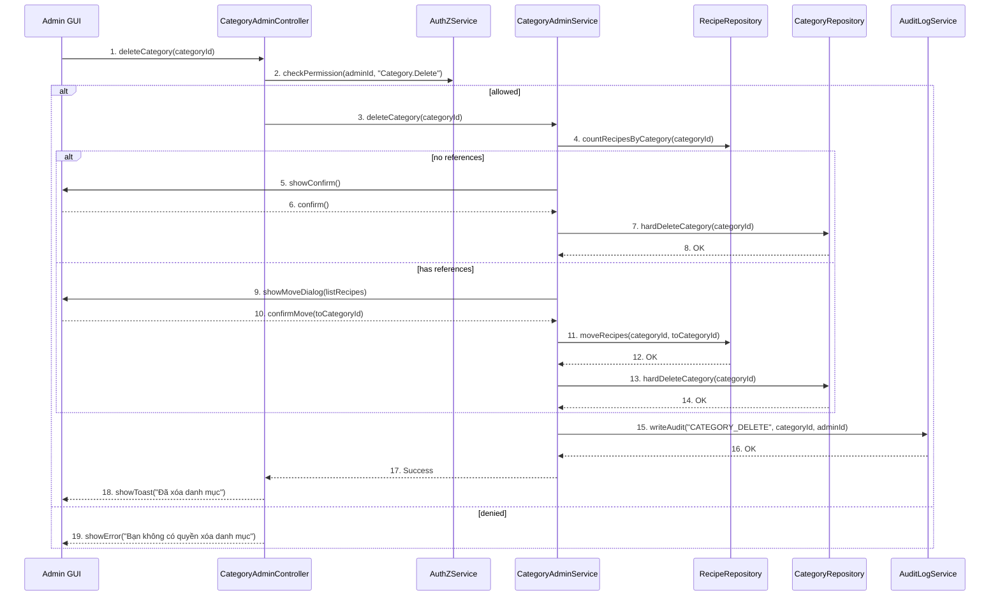

---

## IV. Đặc Tả Chi Tiết Luồng Tương Tác (Interaction Flow Specification)

### A. Luồng Thành công Chính (Basic Success Flow)

| STT | Hành động | Message | Sync/Async | Input | Output | Source | Target | Error/Timeout | Txn |
| :--- | :--- | :--- | :--- | :--- | :--- | :--- | :--- | :--- | :--- |
| 1 | Yêu cầu xóa | `deleteCategory(categoryId)` | Sync | `{ categoryId }` | `200` | L1 | L2 | 401 | N/A |
| 2 | Kiểm tra quyền | `checkPermission(..., "Category.Delete")` | Sync | `{ adminId }` | `{ allowed }` | L2 | L4 | 403 | N/A |
| 3 | Kiểm tra tham chiếu | `countRecipesByCategory(...)` | Sync | `{ categoryId }` | `{ count }` | L3 | L6 | 5xx | Đọc |
| 4 | Xóa/Chuyển | `hardDeleteCategory`/`moveRecipes` | Sync | `{ ... }` | `OK` | L3 | L5/L6 | 5xx | Ghi |
| 5 | Audit | `writeAudit(...)` | Sync | `{ action }` | `OK` | L3 | L7 | 5xx | Ghi |
| 6 | Phản hồi UI | `showToast(...)` | Sync | `{ message }` | UI updated | L2 | L1 | - | Kết thúc |

### B. Alternative/Exception Flows

| ID | Type | Guard | Affect | Error | Recovery | UI Message | Telemetry |
| :--- | :--- | :--- | :--- | :--- | :--- | :--- | :--- |
| EF-1 | [alt] | Thiếu quyền | Thay thế 3-6 | PERMISSION_DENIED | Dừng | "Bạn không có quyền" | log: warn |
| EF-2 | [alt] | Còn tham chiếu, không chuyển | Thay thế 4-6 | FK_CONSTRAINT | Bắt buộc chuyển | "Danh mục đang được sử dụng" | log: warn |
| EF-3 | [alt] | Lỗi CSDL | Thay thế 6 | DB_ERROR | Retry | "Không thể xóa" | log: error |

---


---

# UC-A3 - SD-UCA03-5

> Extracted from: `DOCS/SD/UC-A3/SD-UCA03-5.md`

## II. Danh Sách Đối Tượng Tham Gia (Participants / Lifelines)

| ID | Tên Đối tượng | Stereotype | Ownership | Protocol | API Ver | Mô tả |
| :--- | :--- | :--- | :--- | :--- | :--- | :--- |
| L1 | Admin GUI | Boundary | Web Admin | HTTP | n/a | Trang "Quản lý Nguyên liệu" |
| L2 | IngredientController | Control | Core | Internal | v1 | Điều phối |
| L3 | IngredientQueryService | Service | Core | Internal | v1 | Truy vấn nguyên liệu |
| L4 | AuthZService | Service | Core | Internal | v1 | Quyền `Ingredient.Read` |
| L5 | IngredientRepository | Entity/DAO | Data | SQL | n/a | Truy cập `Ingredient` |

---

## III. Biểu Đồ Sequence Diagram (Visual Model)

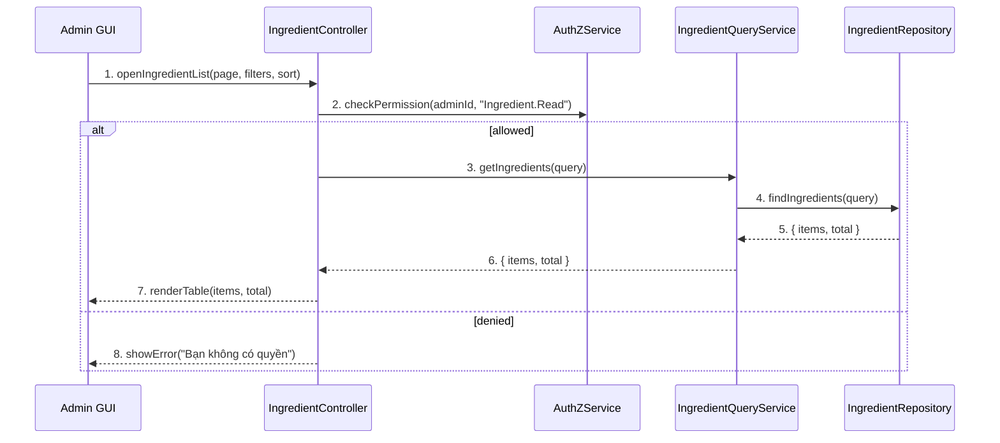

---

## IV. Đặc Tả Chi Tiết Luồng Tương Tác (Interaction Flow Specification)

### A. Luồng Thành công Chính (Basic Success Flow)

| STT | Hành động | Message | Sync/Async | Input | Output | Source | Target | Error/Timeout | Txn |
| :--- | :--- | :--- | :--- | :--- | :--- | :--- | :--- | :--- | :--- |
| 1 | Mở danh sách | `openIngredientList(...)` | Sync | `{ page, filters, sort }` | `200` | L1 | L2 | 401 | N/A |
| 2 | Kiểm tra quyền | `checkPermission(..., "Ingredient.Read")` | Sync | `{ adminId }` | `{ allowed }` | L2 | L4 | 403 | N/A |
| 3 | Gọi service | `getIngredients(query)` | Sync | `{ ... }` | `{ items, total }` | L2 | L3 | 5xx | Đọc |
| 4 | Truy vấn DB | `findIngredients(query)` | Sync | `{ ... }` | `{ items, total }` | L3 | L5 | 5xx | Đọc |
| 5 | Render UI | `renderTable(...)` | Sync | `{ items, total }` | UI updated | L2 | L1 | - | N/A |

### B. Alternative/Exception Flows

| ID | Type | Guard | Affect | Error | Recovery | UI Message | Telemetry |
| :--- | :--- | :--- | :--- | :--- | :--- | :--- | :--- |
| AF-1 | [alt] | Không có dữ liệu | Thay thế 5 | EMPTY | Bảng rỗng | "Chưa có nguyên liệu" | log: info |
| EF-1 | [alt] | Thiếu quyền | Thay thế 3-5 | PERMISSION_DENIED | Dừng | "Bạn không có quyền" | log: warn |
| EF-2 | [alt] | Lỗi tải dữ liệu | Thay thế 5 | SERVER_ERROR | Retry | "Không thể tải danh sách" | log: error |

---


---

# UC-A3 - SD-UCA03-6

> Extracted from: `DOCS/SD/UC-A3/SD-UCA03-6.md`

## II. Danh Sách Đối Tượng Tham Gia (Participants / Lifelines)

| ID | Tên Đối tượng | Stereotype | Ownership | Protocol | API Ver | Mô tả |
| :--- | :--- | :--- | :--- | :--- | :--- | :--- |
| L1 | Admin GUI | Boundary | Web Admin | HTTP | n/a | Form tạo nguyên liệu |
| L2 | IngredientAdminController | Control | Core | Internal | v1 | Điều phối |
| L3 | IngredientAdminService | Service | Core | Internal | v1 | Nghiệp vụ tạo |
| L4 | AuthZService | Service | Core | Internal | v1 | Quyền `Ingredient.Create` |
| L5 | IngredientRepository | Entity/DAO | Data | SQL | n/a | Lưu nguyên liệu |

---

## III. Biểu Đồ Sequence Diagram (Visual Model)

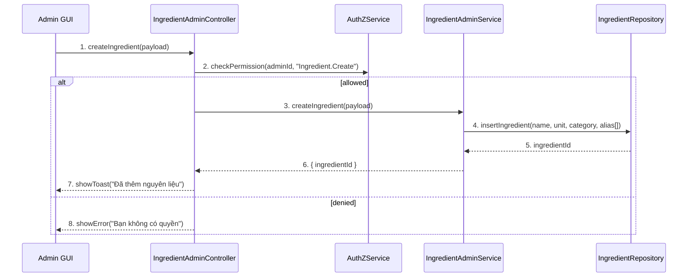

---

## IV. Đặc Tả Chi Tiết Luồng Tương Tác (Interaction Flow Specification)

### A. Luồng Thành công Chính (Basic Success Flow)

| STT | Hành động | Message | Sync/Async | Input | Output | Source | Target | Error/Timeout | Txn |
| :--- | :--- | :--- | :--- | :--- | :--- | :--- | :--- | :--- | :--- |
| 1 | Submit tạo | `createIngredient(payload)` | Sync | `{ name, unit, category, alias? }` | `200` | L1 | L2 | 401 | N/A |
| 2 | Kiểm tra quyền | `checkPermission(..., "Ingredient.Create")` | Sync | `{ adminId }` | `{ allowed }` | L2 | L4 | 403 | N/A |
| 3 | Ghi DB | `insertIngredient(...)` | Sync | `{ ... }` | `{ ingredientId }` | L3 | L5 | 409/5xx | Ghi |
| 4 | Phản hồi UI | `showToast(...)` | Sync | `{ message }` | UI updated | L2 | L1 | - | Kết thúc |

### B. Alternative/Exception Flows

| ID | Type | Guard | Affect | Error | Recovery | UI Message | Telemetry |
| :--- | :--- | :--- | :--- | :--- | :--- | :--- | :--- |
| EF-1 | [alt] | Thiếu quyền | Thay thế 3-4 | PERMISSION_DENIED | Dừng | "Bạn không có quyền" | log: warn |
| EF-2 | [alt] | Tên trùng | Thay thế 3-4 | DUPLICATE_NAME | Sửa tên | "Nguyên liệu đã tồn tại" | log: warn |
| EF-3 | [alt] | Lỗi CSDL | Thay thế 4 | DB_ERROR | Retry | "Không thể lưu" | log: error |

---


---

# UC-A3 - SD-UCA03-7

> Extracted from: `DOCS/SD/UC-A3/SD-UCA03-7.md`

## II. Danh Sách Đối Tượng Tham Gia (Participants / Lifelines)

| ID | Tên Đối tượng | Stereotype | Ownership | Protocol | API Ver | Mô tả |
| :--- | :--- | :--- | :--- | :--- | :--- | :--- |
| L1 | Admin GUI | Boundary | Web Admin | HTTP | n/a | Form sửa nguyên liệu |
| L2 | IngredientAdminController | Control | Core | Internal | v1 | Điều phối |
| L3 | IngredientAdminService | Service | Core | Internal | v1 | Nghiệp vụ cập nhật |
| L4 | AuthZService | Service | Core | Internal | v1 | Quyền `Ingredient.Update` |
| L5 | IngredientRepository | Entity/DAO | Data | SQL | n/a | Cập nhật nguyên liệu |

---

## III. Biểu Đồ Sequence Diagram (Visual Model)

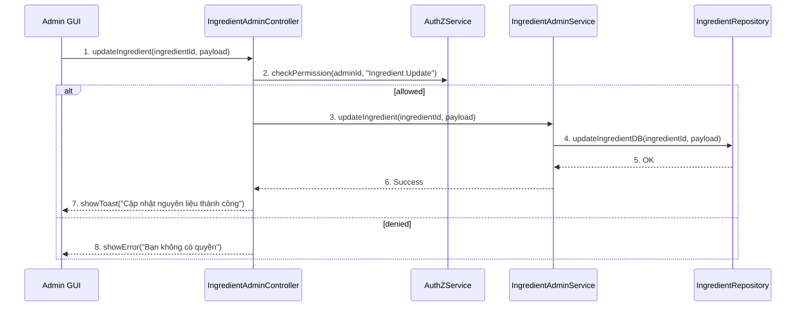

---

## IV. Đặc Tả Chi Tiết Luồng Tương Tác (Interaction Flow Specification)

### A. Luồng Thành công Chính (Basic Success Flow)

| STT | Hành động | Message | Sync/Async | Input | Output | Source | Target | Error/Timeout | Txn |
| :--- | :--- | :--- | :--- | :--- | :--- | :--- | :--- | :--- | :--- |
| 1 | Submit sửa | `updateIngredient(...)` | Sync | `{ id, name?, unit?, category?, alias? }` | `200` | L1 | L2 | 401 | N/A |
| 2 | Kiểm tra quyền | `checkPermission(..., "Ingredient.Update")` | Sync | `{ adminId }` | `{ allowed }` | L2 | L4 | 403 | N/A |
| 3 | Cập nhật DB | `updateIngredientDB(...)` | Sync | `{ id, data }` | `OK` | L3 | L5 | 409/5xx | Ghi |
| 4 | Phản hồi UI | `showToast(...)` | Sync | `{ message }` | UI updated | L2 | L1 | - | Kết thúc |

### B. Alternative/Exception Flows

| ID | Type | Guard | Affect | Error | Recovery | UI Message | Telemetry |
| :--- | :--- | :--- | :--- | :--- | :--- | :--- | :--- |
| EF-1 | [alt] | Thiếu quyền | Thay thế 3-4 | PERMISSION_DENIED | Dừng | "Bạn không có quyền" | log: warn |
| EF-2 | [alt] | Tên trùng | Thay thế 3-4 | DUPLICATE_NAME | Sửa tên | "Nguyên liệu đã tồn tại" | log: warn |
| EF-3 | [alt] | Lỗi CSDL | Thay thế 4 | DB_ERROR | Retry | "Không thể cập nhật" | log: error |

---


---

# UC-A3 - SD-UCA03-8

> Extracted from: `DOCS/SD/UC-A3/SD-UCA03-8.md`

## II. Danh Sách Đối Tượng Tham Gia (Participants / Lifelines)

| ID | Tên Đối tượng | Stereotype | Ownership | Protocol | API Ver | Mô tả |
| :--- | :--- | :--- | :--- | :--- | :--- | :--- |
| L1 | Admin GUI | Boundary | Web Admin | HTTP | n/a | UI xác nhận xóa |
| L2 | IngredientAdminController | Control | Core | Internal | v1 | Điều phối |
| L3 | IngredientAdminService | Service | Core | Internal | v1 | Nghiệp vụ xóa/thay thế |
| L4 | AuthZService | Service | Core | Internal | v1 | Quyền `Ingredient.Delete` |
| L5 | IngredientRepository | Entity/DAO | Data | SQL | n/a | Xóa nguyên liệu |
| L6 | RecipeRepository | Entity/DAO | Data | SQL | n/a | Kiểm tra/thay thế tham chiếu |
| L7 | AuditLogService | Service | Core | Internal | v1 | Audit |

---

## III. Biểu Đồ Sequence Diagram (Visual Model)

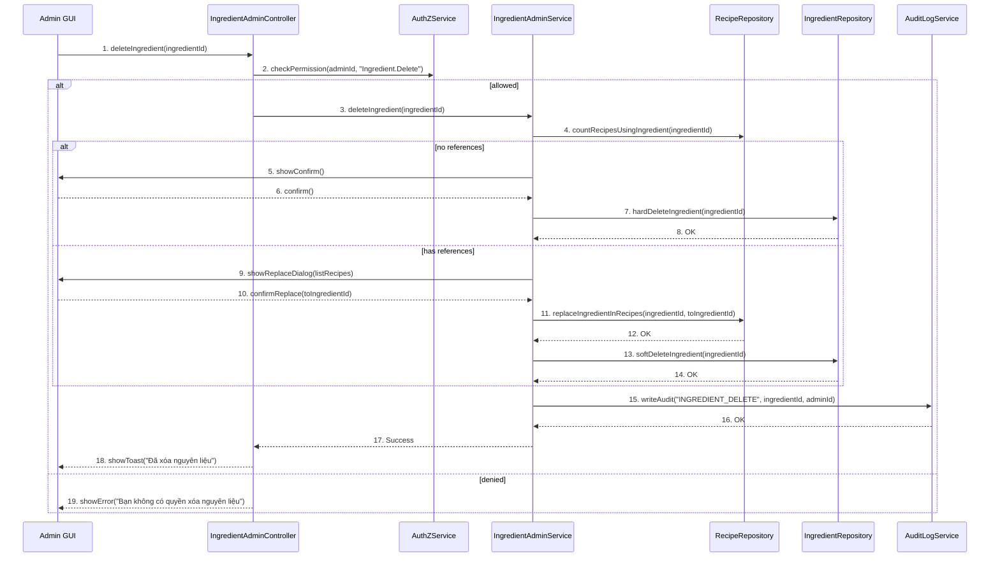

---

## IV. Đặc Tả Chi Tiết Luồng Tương Tác (Interaction Flow Specification)

### A. Luồng Thành công Chính (Basic Success Flow)

| STT | Hành động | Message | Sync/Async | Input | Output | Source | Target | Error/Timeout | Txn |
| :--- | :--- | :--- | :--- | :--- | :--- | :--- | :--- | :--- | :--- |
| 1 | Yêu cầu xóa | `deleteIngredient(ingredientId)` | Sync | `{ ingredientId }` | `200` | L1 | L2 | 401 | N/A |
| 2 | Kiểm tra quyền | `checkPermission(..., "Ingredient.Delete")` | Sync | `{ adminId }` | `{ allowed }` | L2 | L4 | 403 | N/A |
| 3 | Kiểm tra tham chiếu | `countRecipesUsingIngredient(...)` | Sync | `{ ingredientId }` | `{ count }` | L3 | L6 | 5xx | Đọc |
| 4 | Xóa/Thay thế | `hardDeleteIngredient`/`replaceIngredientInRecipes` | Sync | `{ ... }` | `OK` | L3 | L5/L6 | 5xx | Ghi |
| 5 | Audit | `writeAudit(...)` | Sync | `{ action }` | `OK` | L3 | L7 | 5xx | Ghi |
| 6 | Phản hồi UI | `showToast(...)` | Sync | `{ message }` | UI updated | L2 | L1 | - | Kết thúc |

### B. Alternative/Exception Flows

| ID | Type | Guard | Affect | Error | Recovery | UI Message | Telemetry |
| :--- | :--- | :--- | :--- | :--- | :--- | :--- | :--- |
| EF-1 | [alt] | Thiếu quyền | Thay thế 3-6 | PERMISSION_DENIED | Dừng | "Bạn không có quyền" | log: warn |
| EF-2 | [alt] | Còn tham chiếu, không thay thế | Thay thế 4-6 | FK_CONSTRAINT | Bắt buộc thay thế | "Nguyên liệu đang được sử dụng" | log: warn |
| EF-3 | [alt] | Lỗi CSDL | Thay thế 6 | DB_ERROR | Retry | "Không thể xóa" | log: error |

---


---

# UC-A4 - SD-UCA04-1

> Extracted from: `DOCS/SD/UC-A4/SD-UCA04-1.md`

## II. Danh Sách Đối Tượng Tham Gia (Participants / Lifelines)

| ID | Tên Đối tượng (Lifeline) | Vai trò/Loại (Stereotype) | Chủ quản (Ownership) | Giao thức/Interface (Protocol) | Phiên bản API | Mô tả chi tiết |
| :--- | :--- | :--- | :--- | :--- | :--- | :--- |
| L1 | SuperAdmin GUI | Boundary | Web Admin | HTTP | n/a | Trang "Quản lý Tài khoản Admin" |
| L2 | AdminAccountController | Control | Core | Internal | v1 | Điều phối |
| L3 | AdminAccountQueryService | Service | Core | Internal | v1 | Truy vấn danh sách, filter/sort/paging |
| L4 | AuthZService | Service | Core | Internal | v1 | Quyền `AdminAccount.Read` |
| L5 | AdminAccountRepository | Entity/DAO | Data | SQL | n/a | Truy cập `AdminAccount` |

---

## III. Biểu Đồ Sequence Diagram (Visual Model)

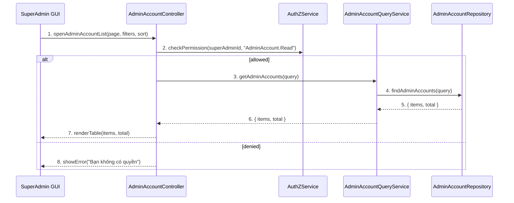

---

## IV. Đặc Tả Chi Tiết Luồng Tương Tác (Interaction Flow Specification)

### A. Luồng Thành công Chính (Basic Success Flow)

| STT | Hành động | Thông điệp (Message) | Sync/Async | Input | Output | Nguồn | Đích | Lỗi/Timeout | Txn |
| :--- | :--- | :--- | :--- | :--- | :--- | :--- | :--- | :--- | :--- |
| 1 | Mở danh sách | `openAdminAccountList(...)` | Sync | `{ page, filters, sort }` | `200` | L1 | L2 | 401 | N/A |
| 2 | Kiểm tra quyền | `checkPermission(..., "AdminAccount.Read")` | Sync | `{ superAdminId }` | `{ allowed }` | L2 | L4 | 403 | N/A |
| 3 | Gọi service | `getAdminAccounts(query)` | Sync | `{ ... }` | `{ items, total }` | L2 | L3 | 5xx | Đọc |
| 4 | Truy vấn DB | `findAdminAccounts(query)` | Sync | `{ ... }` | `{ items, total }` | L3 | L5 | 5xx | Đọc |
| 5 | Render UI | `renderTable(...)` | Sync | `{ items, total }` | UI updated | L2 | L1 | - | N/A |

### B. Luồng Thay thế / Ngoại lệ (Alternative / Exception Flows)

| Fragment ID | Loại | Guard Condition | Ảnh hưởng bước | Error Code/Type | Chiến lược khôi phục | Thông điệp hiển thị | Telemetry |
| :--- | :--- | :--- | :--- | :--- | :--- | :--- | :--- |
| AF-1 | [alt] | Không có dữ liệu | Thay thế 5 | EMPTY | Bảng rỗng | "Chưa có tài khoản Admin" | log: info |
| EF-1 | [alt] | Thiếu quyền | Thay thế 3-5 | PERMISSION_DENIED | Dừng | "Bạn không có quyền" | log: warn |
| EF-2 | [alt] | Lỗi tải dữ liệu | Thay thế 5 | SERVER_ERROR | Retry | "Không thể tải danh sách" | log: error |

---


---

# UC-A4 - SD-UCA04-2

> Extracted from: `DOCS/SD/UC-A4/SD-UCA04-2.md`

## II. Danh Sách Đối Tượng Tham Gia (Participants / Lifelines)

| ID | Tên Đối tượng | Stereotype | Ownership | Protocol | API Ver | Mô tả |
| :--- | :--- | :--- | :--- | :--- | :--- | :--- |
| L1 | SuperAdmin GUI | Boundary | Web Admin | HTTP | n/a | Form tạo admin |
| L2 | AdminAccountController | Control | Core | Internal | v1 | Điều phối |
| L3 | AdminAccountService | Service | Core | Internal | v1 | Nghiệp vụ tạo tài khoản |
| L4 | AuthZService | Service | Core | Internal | v1 | Quyền `AdminAccount.Create` |
| L5 | AdminAccountRepository | Entity/DAO | Data | SQL | n/a | Lưu tài khoản |
| L6 | EmailService | Service | Core | External | v1 | Gửi email kích hoạt |

---

## III. Biểu Đồ Sequence Diagram (Visual Model)

```mermaid
sequenceDiagram
  participant L1 as SuperAdmin GUI
  participant L2 as AdminAccountController
  participant L4 as AuthZService
  participant L3 as AdminAccountService
  participant L5 as AdminAccountRepository
  participant L6 as EmailService

  L1->>L2: 1. createAdmin(payload)
  L2->>L4: 2. checkPermission(superAdminId, "AdminAccount.Create")
  alt allowed
    L2->>L3: 3. createAdminAccount(payload)
    L3->>L5: 4. insertAdminAccount({...payload, status:"PendingActivation"})
    L5-->>L3: 5. adminId
    L3->>L6: 6. sendActivationEmail(adminId, email)
    L6-->>L3: 7. Accepted
    L3-->>L2: 8. { adminId }
    L2-->>L1: 9. showToast("Đã tạo tài khoản và gửi email kích hoạt")
  else denied
    L2-->>L1: 10. showError("Bạn không có quyền")
  end
```

---

## IV. Đặc Tả Chi Tiết Luồng Tương Tác (Interaction Flow Specification)

### A. Luồng Thành công Chính (Basic Success Flow)

| STT | Hành động | Message | Sync/Async | Input | Output | Source | Target | Error/Timeout | Txn |
| :--- | :--- | :--- | :--- | :--- | :--- | :--- | :--- | :--- | :--- |
| 1 | Submit tạo | `createAdmin(payload)` | Sync | `{ name, email, role? }` | `200` | L1 | L2 | 401 | N/A |
| 2 | Kiểm tra quyền | `checkPermission(..., "AdminAccount.Create")` | Sync | `{ superAdminId }` | `{ allowed }` | L2 | L4 | 403 | N/A |
| 3 | Ghi DB | `insertAdminAccount(...)` | Sync | `{ ... }` | `{ adminId }` | L3 | L5 | 409/5xx | Ghi |
| 4 | Gửi email | `sendActivationEmail(...)` | Async | `{ adminId, email }` | `Accepted` | L3 | L6 | timeout | N/A |
| 5 | Phản hồi UI | `showToast(...)` | Sync | `{ message }` | UI updated | L2 | L1 | - | Kết thúc |

### B. Alternative/Exception Flows

| ID | Type | Guard | Affect | Error | Recovery | UI Message | Telemetry |
| :--- | :--- | :--- | :--- | :--- | :--- | :--- | :--- |
| EF-1 | [alt] | Thiếu quyền | Thay thế 3-5 | PERMISSION_DENIED | Dừng | "Bạn không có quyền" | log: warn |
| EF-2 | [alt] | Email trùng | Thay thế 3-5 | DUPLICATE_EMAIL | Sửa email | "Email đã tồn tại" | log: warn |
| EF-3 | [opt] | Lỗi gửi email | Thay thế 5 | EMAIL_ERROR | Cho phép gửi lại | "Không gửi được email kích hoạt" | log: error |

---


---

# UC-A4 - SD-UCA04-3

> Extracted from: `DOCS/SD/UC-A4/SD-UCA04-3.md`

## II. Danh Sách Đối Tượng Tham Gia (Participants / Lifelines)

| ID | Tên Đối tượng | Stereotype | Ownership | Protocol | API Ver | Mô tả |
| :--- | :--- | :--- | :--- | :--- | :--- | :--- |
| L1 | SuperAdmin GUI | Boundary | Web Admin | HTTP | n/a | UI phân quyền |
| L2 | AdminAccountController | Control | Core | Internal | v1 | Điều phối |
| L3 | RBACService | Service | Core | Internal | v1 | Quản lý roles/permissions |
| L4 | AuthZService | Service | Core | Internal | v1 | Quyền `AdminAccount.ManageRoles` |
| L5 | AdminAccountRepository | Entity/DAO | Data | SQL | n/a | Cập nhật role mapping |
| L6 | AuditLogService | Service | Core | Internal | v1 | Audit thay đổi quyền |

---

## III. Biểu Đồ Sequence Diagram (Visual Model)

```mermaid
sequenceDiagram
  participant L1 as SuperAdmin GUI
  participant L2 as AdminAccountController
  participant L4 as AuthZService
  participant L3 as RBACService
  participant L5 as AdminAccountRepository
  participant L6 as AuditLogService

  L1->>L2: 1. updateRoles(adminId, roles, perms, ttl?)
  L2->>L4: 2. checkPermission(superAdminId, "AdminAccount.ManageRoles")
  alt allowed
    L2->>L3: 3. validateRoleChanges(adminId, roles, perms)
    L3-->>L2: 4. { ok, warnings }
    L2->>L3: 5. enforceSuperAdminInvariant()
    L3-->>L2: 6. { ok }
    L2->>L5: 7. updateAdminRoles(adminId, roles, perms, ttl?)
    L5-->>L2: 8. OK
    L2->>L6: 9. writeAudit("ADMIN_ROLE_UPDATE", adminId, superAdminId, beforeAfter)
    L6-->>L2: 10. OK
    L2-->>L1: 11. showToast("Cập nhật phân quyền thành công")
  else denied
    L2-->>L1: 12. showError("Bạn không có quyền")
  end
```

---

## IV. Đặc Tả Chi Tiết Luồng Tương Tác (Interaction Flow Specification)

### A. Luồng Thành công Chính (Basic Success Flow)

| STT | Hành động | Message | Sync/Async | Input | Output | Source | Target | Error/Timeout | Txn |
| :--- | :--- | :--- | :--- | :--- | :--- | :--- | :--- | :--- | :--- |
| 1 | Submit phân quyền | `updateRoles(...)` | Sync | `{ adminId, roles[], perms[], ttl? }` | `200` | L1 | L2 | 401 | N/A |
| 2 | Kiểm tra quyền | `checkPermission(..., "AdminAccount.ManageRoles")` | Sync | `{ superAdminId }` | `{ allowed }` | L2 | L4 | 403 | N/A |
| 3 | Validate | `validateRoleChanges(...)` | Sync | `{ ... }` | `{ ok }` | L2 | L3 | 409 | Đang mở |
| 4 | Bảo toàn Super Admin | `enforceSuperAdminInvariant()` | Sync | `-` | `{ ok }` | L2 | L3 | 409 | Đang mở |
| 5 | Cập nhật DB | `updateAdminRoles(...)` | Sync | `{ ... }` | `OK` | L2 | L5 | 5xx | Ghi |
| 6 | Audit | `writeAudit(...)` | Sync | `{ ... }` | `OK` | L2 | L6 | 5xx | Ghi |
| 7 | Phản hồi UI | `showToast(...)` | Sync | `{ message }` | UI updated | L2 | L1 | - | Kết thúc |

### B. Alternative/Exception Flows

| ID | Type | Guard | Affect | Error | Recovery | UI Message | Telemetry |
| :--- | :--- | :--- | :--- | :--- | :--- | :--- | :--- |
| EF-1 | [alt] | Thiếu quyền | Thay thế 3-7 | PERMISSION_DENIED | Dừng | "Bạn không có quyền" | log: warn |
| EF-2 | [alt] | Xung đột vai trò | Thay thế 5-7 | ROLE_CONFLICT | Điều chỉnh | "Vai trò mâu thuẫn" | log: warn |
| EF-3 | [alt] | Hạ quyền Super Admin cuối | Thay thế 5-7 | SUPERADMIN_LAST | Chặn | "Không thể hạ quyền Super Admin cuối" | log: error |

---


---

# UC-A4 - SD-UCA04-4

> Extracted from: `DOCS/SD/UC-A4/SD-UCA04-4.md`

## II. Danh Sách Đối Tượng Tham Gia (Participants / Lifelines)

| ID | Tên Đối tượng | Stereotype | Ownership | Protocol | API Ver | Mô tả |
| :--- | :--- | :--- | :--- | :--- | :--- | :--- |
| L1 | SuperAdmin GUI | Boundary | Web Admin | HTTP | n/a | UI xác nhận xóa |
| L2 | AdminAccountController | Control | Core | Internal | v1 | Điều phối |
| L3 | AdminAccountService | Service | Core | Internal | v1 | Nghiệp vụ xóa |
| L4 | AuthZService | Service | Core | Internal | v1 | Quyền `AdminAccount.Delete` |
| L5 | AdminAccountRepository | Entity/DAO | Data | SQL | n/a | Xóa tài khoản |
| L6 | AuditLogService | Service | Core | Internal | v1 | Audit |

---

## III. Biểu Đồ Sequence Diagram (Visual Model)

```mermaid
sequenceDiagram
  participant L1 as SuperAdmin GUI
  participant L2 as AdminAccountController
  participant L4 as AuthZService
  participant L3 as AdminAccountService
  participant L5 as AdminAccountRepository
  participant L6 as AuditLogService

  L1->>L2: 1. deleteAdmin(adminId)
  L2->>L4: 2. checkPermission(superAdminId, "AdminAccount.Delete")
  alt allowed
    L2->>L3: 3. deleteAdminAccount(adminId)
    L3->>L3: 4. ensureNotLastSuperAdmin(adminId)
    alt not last super admin
      L2->>L1: 5. showConfirm()
      L1-->>L2: 6. confirm()
      L3->>L5: 7. hardDeleteAdmin(adminId)
      L5-->>L3: 8. OK
      L3->>L6: 9. writeAudit("ADMIN_DELETE", adminId, superAdminId)
      L6-->>L3: 10. OK
      L3-->>L2: 11. Success
      L2-->>L1: 12. showToast("Đã xóa tài khoản Admin")
    else last super admin
      L3-->>L2: 13. Error(SUPERADMIN_LAST)
      L2-->>L1: 14. showError("Không thể xóa Super Admin cuối cùng")
    end
  else denied
    L2-->>L1: 15. showError("Bạn không có quyền")
  end
```

---

## IV. Đặc Tả Chi Tiết Luồng Tương Tác (Interaction Flow Specification)

### A. Luồng Thành công Chính (Basic Success Flow)

| STT | Hành động | Message | Sync/Async | Input | Output | Source | Target | Error/Timeout | Txn |
| :--- | :--- | :--- | :--- | :--- | :--- | :--- | :--- | :--- | :--- |
| 1 | Yêu cầu xóa | `deleteAdmin(adminId)` | Sync | `{ adminId }` | `200` | L1 | L2 | 401 | N/A |
| 2 | Kiểm tra quyền | `checkPermission(..., "AdminAccount.Delete")` | Sync | `{ superAdminId }` | `{ allowed }` | L2 | L4 | 403 | N/A |
| 3 | Ràng buộc Super Admin | `ensureNotLastSuperAdmin(...)` | Sync | `{ adminId }` | `{ ok }` | L3 | L3 | 409 | Đang mở |
| 4 | Xóa DB | `hardDeleteAdmin(...)` | Sync | `{ adminId }` | `OK` | L3 | L5 | 5xx | Ghi |
| 5 | Audit | `writeAudit("ADMIN_DELETE", ...)` | Sync | `{ ... }` | `OK` | L3 | L6 | 5xx | Ghi |
| 6 | Phản hồi UI | `showToast(...)` | Sync | `{ message }` | UI updated | L2 | L1 | - | Kết thúc |

### B. Alternative/Exception Flows

| ID | Type | Guard | Affect | Error | Recovery | UI Message | Telemetry |
| :--- | :--- | :--- | :--- | :--- | :--- | :--- | :--- |
| EF-1 | [alt] | Thiếu quyền | Thay thế 3-6 | PERMISSION_DENIED | Dừng | "Bạn không có quyền" | log: warn |
| EF-2 | [alt] | Super Admin cuối cùng | Thay thế 4-6 | SUPERADMIN_LAST | Chặn | "Không thể xóa Super Admin cuối cùng" | log: error |
| EF-3 | [alt] | Lỗi CSDL | Thay thế 6 | DB_ERROR | Retry | "Không thể xóa" | log: error |

---


---

# UC-A5 - SD-UCA05-1

> Extracted from: `DOCS/SD/UC-A5/SD-UCA05-1.md`

## II. Danh Sách Đối Tượng Tham Gia (Participants / Lifelines)

| ID | Tên Đối tượng | Stereotype | Ownership | Protocol | API Ver | Mô tả |
| :--- | :--- | :--- | :--- | :--- | :--- | :--- |
| L1 | Admin GUI | Boundary | Web Admin | HTTP | n/a | Dashboard & Thống kê |
| L2 | ReportController | Control | Core | Internal | v1 | Điều phối yêu cầu báo cáo |
| L3 | AuthZService | Service | Core | Internal | v1 | Quyền `Report.Read` |
| L4 | ReportingService | Service | Analytics | Internal | v1 | Nghiệp vụ tổng hợp, drill-down |
| L5 | CacheService | Service | Core | Internal | v1 | Cache kết quả KPI/biểu đồ |
| L6 | AnalyticsRepository | Entity/DAO | Data | SQL/OLAP | n/a | Truy vấn bảng tổng hợp |
| L7 | ExportService | Service | Core | Internal | v1 | Xuất PDF/CSV |

---

## III. Biểu Đồ Sequence Diagram (Visual Model)

```mermaid
sequenceDiagram
  participant L1 as Admin GUI
  participant L2 as ReportController
  participant L3 as AuthZService
  participant L4 as ReportingService
  participant L5 as CacheService
  participant L6 as AnalyticsRepository
  participant L7 as ExportService

  L1->>L2: 1. openDashboard(range, filters)
  L2->>L3: 2. checkPermission(adminId, "Report.Read")
  alt allowed
    L2->>L4: 3. getDashboardData(range, filters)
    alt cache hit
      L4->>L5: 4. getCached(range, filters)
      L5-->>L4: 5. { kpis, charts }
    else cache miss
      L4->>L6: 6. queryAggregates(range, filters)
      L6-->>L4: 7. { kpis, charts }
      L4->>L5: 8. setCached(range, filters, data)
    end
    L4-->>L2: 9. { kpis, charts }
    L2-->>L1: 10. renderDashboard(kpis, charts)
  else denied
    L2-->>L1: 11. showError("Bạn không có quyền truy cập báo cáo")
  end

  %% Drill-down
  L1->>L2: 12. drillDown(metricId, drillFilters)
  L2->>L4: 13. getDrillDownData(metricId, drillFilters)
  L4->>L6: 14. queryDetails(metricId, drillFilters)
  L6-->>L4: 15. { rows }
  L4-->>L2: 16. { rows }
  L2-->>L1: 17. renderDetailTable(rows)

  %% Export
  L1->>L2: 18. exportReport(format, range, filters)
  L2->>L7: 19. generateReport(format, range, filters)
  L7-->>L2: 20. fileUrl
  L2-->>L1: 21. download(fileUrl)
```

---

## IV. Đặc Tả Chi Tiết Luồng Tương Tác (Interaction Flow Specification)

### A. Luồng Thành công Chính (Basic Success Flow)

| STT | Hành động | Message | Sync/Async | Input | Output | Source | Target | Error/Timeout | Txn |
| :--- | :--- | :--- | :--- | :--- | :--- | :--- | :--- | :--- | :--- |
| 1 | Mở dashboard | `openDashboard(range, filters)` | Sync | `{ range, filters }` | `200` | L1 | L2 | 401 | N/A |
| 2 | Kiểm tra quyền | `checkPermission(..., "Report.Read")` | Sync | `{ adminId }` | `{ allowed }` | L2 | L3 | 403 | N/A |
| 3 | Lấy dữ liệu | `getDashboardData(...)` | Sync | `{ range, filters }` | `{ kpis, charts }` | L2 | L4 | 5xx | Đọc |
| 4 | Cache | `getCached/setCached` | Sync | `{ key }` | `{ data }` | L4 | L5 | timeout | Đang mở |
| 5 | Truy vấn OLAP | `queryAggregates(...)` | Sync | `{ ... }` | `{ kpis, charts }` | L4 | L6 | 5xx | Đọc |
| 6 | Hiển thị | `renderDashboard(...)` | Sync | `{ data }` | UI updated | L2 | L1 | - | N/A |

### B. Drill-down & Export

| STT | Hành động | Message | Sync/Async | Input | Output | Source | Target | Error/Timeout | Txn |
| :--- | :--- | :--- | :--- | :--- | :--- | :--- | :--- | :--- | :--- |
| D1 | Drill-down | `getDrillDownData(...)` | Sync | `{ metricId, filters }` | `{ rows }` | L2 | L4 | 5xx | Đọc |
| D2 | Truy vấn chi tiết | `queryDetails(...)` | Sync | `{ metricId, filters }` | `{ rows }` | L4 | L6 | 5xx | Đọc |
| E1 | Export | `generateReport(format, ...)` | Async | `{ format, range, filters }` | `{ fileUrl }` | L2 | L7 | timeout | N/A |

### C. Luồng Thay thế / Ngoại lệ (Alternative / Exception Flows)

| ID | Type | Guard | Affect | Error | Recovery | UI Message | Telemetry |
| :--- | :--- | :--- | :--- | :--- | :--- | :--- | :--- |
| EF-1 | [alt] | Thiếu quyền | Thay thế 3-6 | PERMISSION_DENIED | Dừng | "Bạn không có quyền truy cập báo cáo" | log: warn |
| EF-2 | [alt] | Không có dữ liệu | Thay thế 6 | EMPTY | Gợi ý đổi phạm vi | "Không có dữ liệu" | log: info |
| EF-3 | [alt] | Lỗi OLAP/Service | Thay thế 6 | UPSTREAM_ERROR | Fallback cache | "Không thể tải dữ liệu" | log: error |

---


---

# UC1 - SD-UCS01-1

> Extracted from: `DOCS/SD/UC1/SD-UCS01-1.md`

## II. Danh Sách Đối Tượng Tham Gia (Participants / Lifelines)

| ID | Tên Đối tượng | Stereotype | Ownership | Protocol | API Ver | Mô tả |
| :--- | :--- | :--- | :--- | :--- | :--- | :--- |
| L1 | User App/Web | Boundary | Client | HTTP | n/a | UI đăng ký |
| L2 | AuthController | Control | Core | Internal | v1 | Điều phối đăng ký |
| L3 | AuthService | Service | Core | Internal | v1 | Nghiệp vụ đăng ký/verify |
| L4 | UserRepository | Entity/DAO | Data | SQL | n/a | Lưu tài khoản |
| L5 | TokenRepository | Entity/DAO | Data | SQL | n/a | Lưu token verify/OTP |
| L6 | EmailService | Service | Core | External | v1 | Gửi email verify |
| L7 | SMSService | Service | Core | External | v1 | Gửi OTP SMS |
| L8 | OAuthProvider | External Service | Third-party | OAuth | v2 | Google/Facebook |

---

## III. Biểu Đồ Sequence Diagram (Visual Model)

```mermaid
sequenceDiagram
  participant L1 as User App/Web
  participant L2 as AuthController
  participant L3 as AuthService
  participant L4 as UserRepository
  participant L5 as TokenRepository
  participant L6 as EmailService
  participant L7 as SMSService
  participant L8 as OAuthProvider

  alt email/phone signup
    L1->>L2: 1. signup(method, payload)
    L2->>L3: 2. signup(payload)
    L3->>L4: 3. createUser({...status:"Pending"})
    L4-->>L3: 4. userId
    alt method == email
      L3->>L5: 5. createVerificationToken(userId, ttl=24h)
      L5-->>L3: 6. token
      L3->>L6: 7. sendVerifyEmail(email, token)
      L6-->>L3: 8. Accepted
    else method == phone
      L3->>L5: 9. createOTP(userId, ttl=5m)
      L5-->>L3: 10. otp
      L3->>L7: 11. sendOTP(phone, otp)
      L7-->>L3: 12. Accepted
    end
    L3-->>L2: 13. Success
    L2-->>L1: 14. showSuccessAndRedirectToLogin()
  else OAuth signup
    L1->>L8: 15. oauthAuth()
    L8-->>L1: 16. authCode
    L1->>L2: 17. oauthCallback(authCode)
    L2->>L3: 18. upsertOauthUser(profile)
    L3->>L4: 19. createUserIfNotExists({...status:"Verified"})
    L4-->>L3: 20. userId
    L3-->>L2: 21. { userId }
    L2-->>L1: 22. autoLogin()
  end
```

---

## IV. Đặc Tả Chi Tiết Luồng Tương Tác (Interaction Flow Specification)

### A. Luồng Thành công Chính (Basic Success Flow)

| STT | Hành động | Message | Sync/Async | Input | Output | Source | Target | Error/Timeout | Txn |
| :--- | :--- | :--- | :--- | :--- | :--- | :--- | :--- | :--- | :--- |
| 1 | Gửi form đăng ký | `signup(method, payload)` | Sync | `{ email/phone, password, name }` | `200` | L1 | L2 | 4xx | N/A |
| 2 | Tạo user | `createUser(...)` | Sync | `{ ... }` | `{ userId }` | L3 | L4 | 409/5xx | Ghi |
| 3 | Tạo token/OTP | `createVerificationToken/createOTP` | Sync | `{ userId }` | `{ token/otp }` | L3 | L5 | 5xx | Ghi |
| 4 | Gửi verify | `sendVerifyEmail/sendOTP` | Async | `{ email/phone, token }` | `Accepted` | L3 | L6/L7 | timeout | N/A |
| 5 | Phản hồi UI | `showSuccessAndRedirectToLogin()` | Sync | `-` | UI updated | L2 | L1 | - | Kết thúc |

### B. Alternative/Exception Flows

| ID | Type | Guard | Affect | Error | Recovery | UI Message | Telemetry |
| :--- | :--- | :--- | :--- | :--- | :--- | :--- | :--- |
| AF-1 | [alt] | OAuth signup | Thay thế 2-5 | - | Auto-verify | Auto login | log: info |
| EF-1 | [alt] | Email/SĐT tồn tại | Thay thế 2-5 | DUPLICATE | Chỉnh thông tin | Thông báo trùng | log: warn |
| EF-2 | [alt] | Mật khẩu yếu | Thay thế 2-5 | WEAK_PASSWORD | Sửa mật khẩu | Nhắc yêu cầu | log: warn |
| EF-3 | [alt] | Lỗi gửi email/SMS | Thay thế 5 | SEND_ERROR | Cho gửi lại | Thông báo gửi lỗi | log: error |

---


---

# UC1 - SD-UCS01-2

> Extracted from: `DOCS/SD/UC1/SD-UCS01-2.md`

## II. Danh Sách Đối Tượng Tham Gia (Participants / Lifelines)

| ID | Tên Đối tượng | Stereotype | Ownership | Protocol | API Ver | Mô tả |
| :--- | :--- | :--- | :--- | :--- | :--- | :--- |
| L1 | User App/Web | Boundary | Client | HTTP | n/a | UI đăng nhập |
| L2 | AuthController | Control | Core | Internal | v1 | Điều phối đăng nhập |
| L3 | AuthService | Service | Core | Internal | v1 | Xác thực/kiểm tra trạng thái |
| L4 | UserRepository | Entity/DAO | Data | SQL | n/a | Đọc user |
| L5 | SessionService | Service | Core | Internal | v1 | Tạo/quản lý session |
| L6 | OAuthProvider | External | Third-party | OAuth | v2 | Google/Facebook |

---

## III. Biểu Đồ Sequence Diagram (Visual Model)

```mermaid
sequenceDiagram
  participant L1 as User App/Web
  participant L2 as AuthController
  participant L3 as AuthService
  participant L4 as UserRepository
  participant L5 as SessionService
  participant L6 as OAuthProvider

  alt password login
    L1->>L2: 1. login(identifier, password, remember?)
    L2->>L3: 2. authenticate(identifier, password)
    L3->>L4: 3. findUserByIdentifier(identifier)
    L4-->>L3: 4. user
    L3->>L3: 5. verifyPasswordAndStatus(user)
    L3-->>L2: 6. ok(user)
    L2->>L5: 7. createSession(userId, remember?)
    L5-->>L2: 8. { sessionId, cookie }
    L2-->>L1: 9. setCookieAndRedirect()
  else oauth login
    L1->>L6: 10. oauthAuth()
    L6-->>L1: 11. authCode
    L1->>L2: 12. oauthCallback(authCode)
    L2->>L3: 13. authenticateOAuth(authCode)
    L3->>L4: 14. upsertUserFromOAuth(profile)
    L4-->>L3: 15. user
    L2->>L5: 16. createSession(userId)
    L5-->>L2: 17. cookie
    L2-->>L1: 18. setCookieAndRedirect()
  end
```

---

## IV. Đặc Tả Chi Tiết Luồng Tương Tác (Interaction Flow Specification)

### A. Luồng Thành công Chính (Basic Success Flow)

| STT | Hành động | Message | Sync/Async | Input | Output | Source | Target | Error/Timeout | Txn |
| :--- | :--- | :--- | :--- | :--- | :--- | :--- | :--- | :--- | :--- |
| 1 | Gửi form | `login(...)` | Sync | `{ id, password, remember? }` | `200` | L1 | L2 | 4xx | N/A |
| 2 | Tìm user | `findUserByIdentifier(...)` | Sync | `{ id }` | `{ user }` | L3 | L4 | 404/5xx | Đọc |
| 3 | Kiểm tra | `verifyPasswordAndStatus` | Sync | `{ user }` | `ok` | L3 | L3 | 4xx | - |
| 4 | Tạo session | `createSession(...)` | Sync | `{ userId, remember? }` | `{ cookie }` | L2 | L5 | 5xx | Ghi |
| 5 | Chuyển hướng | `setCookieAndRedirect()` | Sync | `-` | UI updated | L2 | L1 | - | N/A |

### B. Alternative/Exception Flows

| ID | Type | Guard | Affect | Error | Recovery | UI Message | Telemetry |
| :--- | :--- | :--- | :--- | :--- | :--- | :--- | :--- |
| EF-1 | [alt] | Sai thông tin | Thay thế 4-5 | INVALID_CREDENTIALS | Nhập lại | "Sai thông tin đăng nhập" | log: warn |
| EF-2 | [alt] | Chưa xác thực | Thay thế 4-5 | UNVERIFIED | Gợi ý verify | "Tài khoản chưa xác thực" | log: info |
| EF-3 | [alt] | Tài khoản khóa | Thay thế 4-5 | LOCKED | Hỗ trợ | "Tài khoản bị khóa" | log: warn |
| AF-1 | [alt] | OAuth | Thay thế 1-5 | - | Auto upsert | Auto redirect | log: info |

---


---

# UC1 - SD-UCS01-3

> Extracted from: `DOCS/SD/UC1/SD-UCS01-3.md`

## II. Danh Sách Đối Tượng Tham Gia (Participants / Lifelines)

| ID | Tên Đối tượng | Stereotype | Ownership | Protocol | API Ver | Mô tả |
| :--- | :--- | :--- | :--- | :--- | :--- | :--- |
| L1 | User App/Web | Boundary | Client | HTTP | n/a | UI đăng xuất |
| L2 | AuthController | Control | Core | Internal | v1 | Điều phối |
| L3 | SessionService | Service | Core | Internal | v1 | Hủy session |
| L4 | AuditLogService | Service | Core | Internal | v1 | Ghi log |

---

## III. Biểu Đồ Sequence Diagram (Visual Model)

```mermaid
sequenceDiagram
  participant L1 as User App/Web
  participant L2 as AuthController
  participant L3 as SessionService
  participant L4 as AuditLogService

  L1->>L2: 1. requestLogout()
  L2->>L1: 2. showConfirm()
  alt confirmed
    L1-->>L2: 3. confirm()
    L2->>L3: 4. revokeSession(sessionId)
    L3-->>L2: 5. OK
    L2->>L4: 6. writeAudit("LOGOUT", userId)
    L4-->>L2: 7. OK
    L2-->>L1: 8. clearCookieAndRedirectToLogin()
  else canceled
    L1-->>L2: 9. cancel()
    L2-->>L1: 10. closeDialog()
  end
```

---

## IV. Đặc Tả Chi Tiết Luồng Tương Tác (Interaction Flow Specification)

### A. Luồng Thành công Chính (Basic Success Flow)

| STT | Hành động | Message | Sync/Async | Input | Output | Source | Target | Error/Timeout | Txn |
| :--- | :--- | :--- | :--- | :--- | :--- | :--- | :--- | :--- | :--- |
| 1 | Yêu cầu đăng xuất | `requestLogout()` | Sync | `-` | `200` | L1 | L2 | - | N/A |
| 2 | Xác nhận | `showConfirm()` | Sync | `-` | `confirm` | L2 | L1 | - | N/A |
| 3 | Hủy session | `revokeSession(sessionId)` | Sync | `{ sessionId }` | `OK` | L2 | L3 | 5xx | Ghi |
| 4 | Audit | `writeAudit("LOGOUT", ...)` | Sync | `{ userId }` | `OK` | L2 | L4 | 5xx | Ghi |
| 5 | Xóa cookie & điều hướng | `clearCookieAndRedirectToLogin()` | Sync | `-` | UI updated | L2 | L1 | - | Kết thúc |

### B. Alternative/Exception Flows

| ID | Type | Guard | Affect | Error | Recovery | UI Message | Telemetry |
| :--- | :--- | :--- | :--- | :--- | :--- | :--- | :--- |
| AF-1 | [opt] | Người dùng hủy | Thay thế 3-5 | - | Đóng hộp thoại | "Đã hủy" | log: info |
| EF-1 | [alt] | Lỗi hủy session | Thay thế 4-5 | SESSION_ERROR | Thử lại | "Đăng xuất lỗi, thử lại" | log: error |

---


---

# UC1 - SD-UCS01-4

> Extracted from: `DOCS/SD/UC1/SD-UCS01-4.md`

## II. Danh Sách Đối Tượng Tham Gia (Participants / Lifelines)

| ID | Tên Đối tượng | Stereotype | Ownership | Protocol | API Ver | Mô tả |
| :--- | :--- | :--- | :--- | :--- | :--- | :--- |
| L1 | User App/Web | Boundary | Client | HTTP | n/a | UI profile |
| L2 | ProfileController | Control | Core | Internal | v1 | Điều phối |
| L3 | ProfileService | Service | Core | Internal | v1 | Tổng hợp dữ liệu profile |
| L4 | UserRepository | Entity/DAO | Data | SQL | n/a | Đọc thông tin user |
| L5 | StatsRepository | Entity/DAO | Data | SQL | n/a | Thống kê hoạt động |

---

## III. Biểu Đồ Sequence Diagram (Visual Model)

```mermaid
sequenceDiagram
  participant L1 as User App/Web
  participant L2 as ProfileController
  participant L3 as ProfileService
  participant L4 as UserRepository
  participant L5 as StatsRepository

  L1->>L2: 1. openProfile()
  L2->>L3: 2. getProfile(userId)
  par profile
    L3->>L4: 3. findUserById(userId)
    L4-->>L3: 4. user
  and stats
    L3->>L5: 5. getUserStats(userId)
    L5-->>L3: 6. { recipes, favorites, comments }
  end
  L3-->>L2: 7. { user, stats }
  L2-->>L1: 8. renderProfile(user, stats)
```

---

## IV. Đặc Tả Chi Tiết Luồng Tương Tác (Interaction Flow Specification)

### A. Luồng Thành công Chính (Basic Success Flow)

| STT | Hành động | Message | Sync/Async | Input | Output | Source | Target | Error/Timeout | Txn |
| :--- | :--- | :--- | :--- | :--- | :--- | :--- | :--- | :--- | :--- |
| 1 | Mở profile | `openProfile()` | Sync | `-` | `200` | L1 | L2 | 401 | N/A |
| 2 | Lấy profile | `getProfile(userId)` | Sync | `{ userId }` | `{ user, stats }` | L2 | L3 | 5xx | Đọc |
| 3 | Đọc user | `findUserById(userId)` | Sync | `{ userId }` | `{ user }` | L3 | L4 | 404/5xx | Đọc |
| 4 | Đọc stats | `getUserStats(userId)` | Sync | `{ userId }` | `{ counts }` | L3 | L5 | 5xx | Đọc |
| 5 | Render UI | `renderProfile(...)` | Sync | `{ user, stats }` | UI updated | L2 | L1 | - | N/A |

### B. Alternative/Exception Flows

| ID | Type | Guard | Affect | Error | Recovery | UI Message | Telemetry |
| :--- | :--- | :--- | :--- | :--- | :--- | :--- | :--- |
| EF-1 | [alt] | Không tìm thấy user | Thay thế 5 | NOT_FOUND | Thử lại | "Không thể tải thông tin" | log: warn |
| EF-2 | [alt] | Session hết hạn | Thay thế 2-5 | UNAUTHORIZED | Login lại | "Phiên hết hạn" | log: info |

---


---

# UC1 - SD-UCS01-5

> Extracted from: `DOCS/SD/UC1/SD-UCS01-5.md`

## II. Danh Sách Đối Tượng Tham Gia (Participants / Lifelines)

| ID | Tên Đối tượng | Stereotype | Ownership | Protocol | API Ver | Mô tả |
| :--- | :--- | :--- | :--- | :--- | :--- | :--- |
| L1 | User App/Web | Boundary | Client | HTTP | n/a | UI chỉnh sửa |
| L2 | ProfileController | Control | Core | Internal | v1 | Điều phối |
| L3 | ProfileService | Service | Core | Internal | v1 | Nghiệp vụ cập nhật |
| L4 | MediaService | Service | Core | Internal | v1 | Upload/validate ảnh |
| L5 | UserRepository | Entity/DAO | Data | SQL | n/a | Cập nhật user |

---

## III. Biểu Đồ Sequence Diagram (Visual Model)

```mermaid
sequenceDiagram
  participant L1 as User App/Web
  participant L2 as ProfileController
  participant L3 as ProfileService
  participant L4 as MediaService
  participant L5 as UserRepository

  L1->>L2: 1. updateProfile(payload, avatarFile?)
  L2->>L3: 2. updateProfile(payload)
  opt has avatarFile
    L3->>L4: 3. uploadAndValidate(avatarFile)
    L4-->>L3: 4. avatarUrl
  end
  L3->>L5: 5. updateUser(userId, name?, avatarUrl?)
  L5-->>L3: 6. OK
  L3-->>L2: 7. Success
  L2-->>L1: 8. showToast("Cập nhật thông tin thành công")
```

---

## IV. Đặc Tả Chi Tiết Luồng Tương Tác (Interaction Flow Specification)

### A. Luồng Thành công Chính (Basic Success Flow)

| STT | Hành động | Message | Sync/Async | Input | Output | Source | Target | Error/Timeout | Txn |
| :--- | :--- | :--- | :--- | :--- | :--- | :--- | :--- | :--- | :--- |
| 1 | Submit cập nhật | `updateProfile(...)` | Sync | `{ name?, avatarFile? }` | `200` | L1 | L2 | 401 | N/A |
| 2 | Upload ảnh | `uploadAndValidate(...)` | Sync | `{ file }` | `{ url }` | L3 | L4 | timeout | Đang mở |
| 3 | Cập nhật DB | `updateUser(...)` | Sync | `{ fields }` | `OK` | L3 | L5 | 5xx | Ghi |
| 4 | Phản hồi UI | `showToast(...)` | Sync | `{ message }` | UI updated | L2 | L1 | - | Kết thúc |

### B. Alternative/Exception Flows

| ID | Type | Guard | Affect | Error | Recovery | UI Message | Telemetry |
| :--- | :--- | :--- | :--- | :--- | :--- | :--- | :--- |
| AF-1 | [opt] | Chỉ đổi tên/ảnh | Thay thế 2-3 | - | Bỏ bước không cần | - | log: info |
| EF-1 | [alt] | Tên không hợp lệ | Thay thế 3-4 | VALIDATION_ERROR | Sửa tên | "Tên hiển thị không hợp lệ" | log: warn |
| EF-2 | [alt] | Ảnh không hợp lệ | Thay thế 3-4 | MEDIA_INVALID | Chọn lại | "Ảnh không hợp lệ" | log: warn |
| EF-3 | [alt] | Lỗi upload | Thay thế 3-4 | UPLOAD_ERROR | Thử lại | "Upload ảnh thất bại" | log: error |
| EF-4 | [alt] | Lỗi DB | Thay thế 4 | DB_ERROR | Retry | "Không thể cập nhật" | log: error |

---


---

# UC1 - SD-UCS01-6

> Extracted from: `DOCS/SD/UC1/SD-UCS01-6.md`

## II. Danh Sách Đối Tượng Tham Gia (Participants / Lifelines)

| ID | Tên Đối tượng | Stereotype | Ownership | Protocol | API Ver | Mô tả |
| :--- | :--- | :--- | :--- | :--- | :--- | :--- |
| L1 | User App/Web | Boundary | Client | HTTP | n/a | UI đổi mật khẩu |
| L2 | SecurityController | Control | Core | Internal | v1 | Điều phối |
| L3 | SecurityService | Service | Core | Internal | v1 | Xác thực và cập nhật mật khẩu |
| L4 | UserRepository | Entity/DAO | Data | SQL | n/a | Đọc/cập nhật user |
| L5 | SessionService | Service | Core | Internal | v1 | Thu hồi session |
| L6 | SecurityLogService | Service | Core | Internal | v1 | Ghi log bảo mật |

---

## III. Biểu Đồ Sequence Diagram (Visual Model)

```mermaid
sequenceDiagram
  participant L1 as User App/Web
  participant L2 as SecurityController
  participant L3 as SecurityService
  participant L4 as UserRepository
  participant L5 as SessionService
  participant L6 as SecurityLogService

  L1->>L2: 1. changePassword(currentPwd, newPwd)
  L2->>L3: 2. changePassword(userId, currentPwd, newPwd)
  L3->>L4: 3. findUserById(userId)
  L4-->>L3: 4. user
  L3->>L3: 5. verifyCurrentAndValidateNew(user, currentPwd, newPwd)
  L3->>L3: 6. hashNewPassword(newPwd)
  L3->>L4: 7. updatePassword(userId, passwordHash)
  L4-->>L3: 8. OK
  L3->>L5: 9. revokeAllSessions(userId)
  L5-->>L3: 10. OK
  L3->>L6: 11. writeSecurityLog("PASSWORD_CHANGE", userId)
  L6-->>L3: 12. OK
  L3-->>L2: 13. Success
  L2-->>L1: 14. showToastAndRedirectToLogin()
```

---

## IV. Đặc Tả Chi Tiết Luồng Tương Tác (Interaction Flow Specification)

### A. Luồng Thành công Chính (Basic Success Flow)

| STT | Hành động | Message | Sync/Async | Input | Output | Source | Target | Error/Timeout | Txn |
| :--- | :--- | :--- | :--- | :--- | :--- | :--- | :--- | :--- | :--- |
| 1 | Submit | `changePassword(...)` | Sync | `{ currentPwd, newPwd }` | `200` | L1 | L2 | 401 | N/A |
| 2 | Đọc user | `findUserById(...)` | Sync | `{ userId }` | `{ user }` | L3 | L4 | 404/5xx | Đọc |
| 3 | Xác thực/validate | `verifyCurrentAndValidateNew(...)` | Sync | `{ ... }` | `ok` | L3 | L3 | 4xx | - |
| 4 | Cập nhật DB | `updatePassword(...)` | Sync | `{ userId, hash }` | `OK` | L3 | L4 | 5xx | Ghi |
| 5 | Thu hồi session | `revokeAllSessions(...)` | Sync | `{ userId }` | `OK` | L3 | L5 | 5xx | Ghi |
| 6 | Log bảo mật | `writeSecurityLog(...)` | Sync | `{ ... }` | `OK` | L3 | L6 | 5xx | Ghi |
| 7 | Phản hồi UI | `showToastAndRedirectToLogin()` | Sync | `-` | UI updated | L2 | L1 | - | Kết thúc |

### B. Alternative/Exception Flows

| ID | Type | Guard | Affect | Error | Recovery | UI Message | Telemetry |
| :--- | :--- | :--- | :--- | :--- | :--- | :--- | :--- |
| EF-1 | [alt] | Sai mật khẩu hiện tại | Thay thế 4-7 | INVALID_CURRENT | Nhập lại | "Mật khẩu hiện tại không đúng" | log: warn |
| EF-2 | [alt] | Mật khẩu mới yếu | Thay thế 4-7 | WEAK_PASSWORD | Sửa mật khẩu | "Mật khẩu không đủ mạnh" | log: warn |
| EF-3 | [alt] | Lỗi DB | Thay thế 5-7 | DB_ERROR | Retry | "Không thể cập nhật" | log: error |

---


---

# UC1 - SD-UCS01-7

> Extracted from: `DOCS/SD/UC1/SD-UCS01-7.md`

## II. Danh Sách Đối Tượng Tham Gia (Participants / Lifelines)

| ID | Tên Đối tượng | Stereotype | Ownership | Protocol | API Ver | Mô tả |
| :--- | :--- | :--- | :--- | :--- | :--- | :--- |
| L1 | User App/Web | Boundary | Client | HTTP | n/a | UI quên mật khẩu |
| L2 | RecoveryController | Control | Core | Internal | v1 | Điều phối |
| L3 | RecoveryService | Service | Core | Internal | v1 | Tạo token/OTP và gửi |
| L4 | UserRepository | Entity/DAO | Data | SQL | n/a | Tra cứu user |
| L5 | ResetTokenRepository | Entity/DAO | Data | SQL | n/a | Lưu token reset |
| L6 | EmailService | Service | Core | External | v1 | Gửi email |
| L7 | SMSService | Service | Core | External | v1 | Gửi SMS OTP |

---

## III. Biểu Đồ Sequence Diagram (Visual Model)

```mermaid
sequenceDiagram
  participant L1 as User App/Web
  participant L2 as RecoveryController
  participant L3 as RecoveryService
  participant L4 as UserRepository
  participant L5 as ResetTokenRepository
  participant L6 as EmailService
  participant L7 as SMSService

  L1->>L2: 1. requestPasswordReset(identifier)
  L2->>L3: 2. createReset(identifier)
  L3->>L4: 3. findUser(identifier)
  alt exists and verified
    L4-->>L3: 4. user
    L3->>L5: 5. createToken(userId, ttl=24h)
    L5-->>L3: 6. token/otp
    alt email
      L3->>L6: 7. sendResetEmail(email, token)
      L6-->>L3: 8. Accepted
    else phone
      L3->>L7: 9. sendOTP(phone, otp)
      L7-->>L3: 10. Accepted
    end
    L3-->>L2: 11. Success
    L2-->>L1: 12. showInstructionSent()
  else not found/locked
    L3-->>L2: 13. Error
    L2-->>L1: 14. showError("Không thể xử lý yêu cầu")
  end
```

---

## IV. Đặc Tả Chi Tiết Luồng Tương Tác (Interaction Flow Specification)

### A. Luồng Thành công Chính (Basic Success Flow)

| STT | Hành động | Message | Sync/Async | Input | Output | Source | Target | Error/Timeout | Txn |
| :--- | :--- | :--- | :--- | :--- | :--- | :--- | :--- | :--- | :--- |
| 1 | Yêu cầu reset | `requestPasswordReset(identifier)` | Sync | `{ email/phone }` | `200` | L1 | L2 | 4xx | N/A |
| 2 | Tìm user | `findUser(identifier)` | Sync | `{ id }` | `{ user }` | L3 | L4 | 404 | Đọc |
| 3 | Tạo token | `createToken(userId)` | Sync | `{ userId }` | `{ token }` | L3 | L5 | 5xx | Ghi |
| 4 | Gửi hướng dẫn | `sendResetEmail/sendOTP` | Async | `{ email/phone, token }` | `Accepted` | L3 | L6/L7 | timeout | N/A |
| 5 | Phản hồi UI | `showInstructionSent()` | Sync | `-` | UI updated | L2 | L1 | - | Kết thúc |

### B. Alternative/Exception Flows

| ID | Type | Guard | Affect | Error | Recovery | UI Message | Telemetry |
| :--- | :--- | :--- | :--- | :--- | :--- | :--- | :--- |
| EF-1 | [alt] | Không tồn tại | Thay thế 3-5 | NOT_FOUND | Nhắc đăng ký | "Email/SĐT không tồn tại" | log: warn |
| EF-2 | [alt] | Tài khoản khóa | Thay thế 3-5 | LOCKED | Hỗ trợ | "Tài khoản bị khóa" | log: warn |
| EF-3 | [alt] | Quá nhiều yêu cầu | Thay thế 3-5 | RATE_LIMIT | Chờ | "Thử lại sau" | log: warn |
| EF-4 | [alt] | Lỗi gửi | Thay thế 5 | SEND_ERROR | Cho gửi lại | "Không thể gửi" | log: error |

---


---

# UC2 - SD-UCS02-1

> Extracted from: `DOCS/SD/UC2/SD-UCS02-1.md`

## II. Danh Sách Đối Tượng Tham Gia (Participants / Lifelines)

| ID | Tên Đối tượng | Stereotype | Ownership | Protocol | API Ver | Mô tả |
| :--- | :--- | :--- | :--- | :--- | :--- | :--- |
| L1 | User App/Web | Boundary | Client | HTTP | n/a | UI tìm kiếm |
| L2 | SearchController | Control | Core | Internal | v1 | Điều phối tìm kiếm |
| L3 | IngredientNormalizer | Service | Core | Internal | v1 | Chuẩn hóa danh sách nguyên liệu |
| L4 | RecipeSearchService | Service | Core | Internal | v1 | Thuật toán matching/ranking |
| L5 | CacheService | Service | Core | Internal | v1 | Cache kết quả tìm kiếm |
| L6 | RecipeRepository | Entity/DAO | Data | SQL | n/a | Truy vấn công thức |

---

## III. Biểu Đồ Sequence Diagram (Visual Model)

```mermaid
sequenceDiagram
  participant L1 as User App/Web
  participant L2 as SearchController
  participant L3 as IngredientNormalizer
  participant L5 as CacheService
  participant L4 as RecipeSearchService
  participant L6 as RecipeRepository

  L1->>L2: 1. searchByIngredients(rawIngredients, filters?)
  L2->>L3: 2. normalize(rawIngredients)
  L3-->>L2: 3. normalizedIngredients
  L2->>L5: 4. getCached(normalizedIngredients, filters)
  alt cache hit
    L5-->>L2: 5. results
    L2-->>L1: 6. renderResults(results)
  else cache miss
    L2->>L4: 7. rankRecipes(normalizedIngredients, filters)
    L4->>L6: 8. queryRecipesByIngredients(normalizedIngredients, filters)
    L6-->>L4: 9. candidates
    L4->>L4: 10. scoreAndPrioritize(candidates) %% priority 1/2/3
    L4-->>L2: 11. results
    L2->>L5: 12. setCached(key, results, ttl=30m)
    L2-->>L1: 13. renderResults(results)
  end
  opt no results
    L2-->>L1: 14. suggestAIFlow()
  end
```

---

## IV. Đặc Tả Chi Tiết Luồng Tương Tác (Interaction Flow Specification)

### A. Luồng Thành công Chính (Basic Success Flow)

| STT | Hành động | Message | Sync/Async | Input | Output | Source | Target | Error/Timeout | Txn |
| :--- | :--- | :--- | :--- | :--- | :--- | :--- | :--- | :--- | :--- |
| 1 | Gửi tìm kiếm | `searchByIngredients(...)` | Sync | `{ ingredients[], filters? }` | `200` | L1 | L2 | 4xx | N/A |
| 2 | Chuẩn hóa | `normalize(...)` | Sync | `{ raw }` | `{ normalized }` | L2 | L3 | 4xx | - |
| 3 | Cache | `getCached/setCached` | Sync | `{ key }` | `{ results }` | L2 | L5 | timeout | Đang mở |
| 4 | Truy vấn | `queryRecipesByIngredients(...)` | Sync | `{ normalized, filters }` | `{ candidates }` | L4 | L6 | 5xx | Đọc |
| 5 | Xếp hạng | `scoreAndPrioritize(...)` | Sync | `{ candidates }` | `{ results }` | L4 | L4 | 5xx | - |
| 6 | Hiển thị | `renderResults(...)` | Sync | `{ results }` | UI updated | L2 | L1 | - | N/A |

### B. Alternative/Exception Flows

| ID | Type | Guard | Affect | Error | Recovery | UI Message | Telemetry |
| :--- | :--- | :--- | :--- | :--- | :--- | :--- | :--- |
| AF-1 | [opt] | Import từ Tủ lạnh ảo | Thay thế 1 | - | Prefill | Prefill form | log: info |
| EF-1 | [alt] | Không tìm thấy | Thay thế 6 | EMPTY | Gợi ý AI | "Không tìm thấy" | log: info |
| EF-2 | [alt] | Nguyên liệu không hợp lệ | Thay thế 2 | INVALID_INGREDIENT | Gợi ý gần đúng | Thông báo gợi ý | log: warn |
| EF-3 | [alt] | Timeout | Thay thế 6 | TIMEOUT | Gợi ý giảm input | "Quá lâu, thử ít nguyên liệu" | log: warn |

---


---

# UC2 - SD-UCS02-2

> Extracted from: `DOCS/SD/UC2/SD-UCS02-2.md`

## II. Danh Sách Đối Tượng Tham Gia (Participants / Lifelines)

| ID | Tên Đối tượng | Stereotype | Ownership | Protocol | API Ver | Mô tả |
| :--- | :--- | :--- | :--- | :--- | :--- | :--- |
| L1 | User App/Web | Boundary | Client | HTTP | n/a | UI tìm kiếm |
| L2 | SearchController | Control | Core | Internal | v1 | Điều phối tìm kiếm |
| L3 | TextNormalizer | Service | Core | Internal | v1 | Chuẩn hóa từ khóa (VN có/không dấu, lower) |
| L4 | TextSearchService | Service | Core | Internal | v1 | Exact/partial/fuzzy search |
| L5 | RecipeRepository | Entity/DAO | Data | SQL | n/a | Truy vấn công thức |

---

## III. Biểu Đồ Sequence Diagram (Visual Model)

```mermaid
sequenceDiagram
  participant L1 as User App/Web
  participant L2 as SearchController
  participant L3 as TextNormalizer
  participant L4 as TextSearchService
  participant L5 as RecipeRepository

  L1->>L2: 1. searchByName(keyword, filters?)
  L2->>L3: 2. normalizeKeyword(keyword)
  L3-->>L2: 3. normalized
  L2->>L4: 4. search(normalized, filters)
  L4->>L5: 5. queryByName(normalized, filters)
  L5-->>L4: 6. candidates
  L4->>L4: 7. rankByRelevance(candidates)
  L4-->>L2: 8. results
  L2-->>L1: 9. renderResults(results)
```

---

## IV. Đặc Tả Chi Tiết Luồng Tương Tác (Interaction Flow Specification)

### A. Luồng Thành công Chính (Basic Success Flow)

| STT | Hành động | Message | Sync/Async | Input | Output | Source | Target | Error/Timeout | Txn |
| :--- | :--- | :--- | :--- | :--- | :--- | :--- | :--- | :--- | :--- |
| 1 | Gửi tìm kiếm | `searchByName(...)` | Sync | `{ keyword, filters? }` | `200` | L1 | L2 | 4xx | N/A |
| 2 | Chuẩn hóa | `normalizeKeyword(...)` | Sync | `{ keyword }` | `{ normalized }` | L2 | L3 | 4xx | - |
| 3 | Truy vấn | `queryByName(...)` | Sync | `{ normalized, filters }` | `{ candidates }` | L4 | L5 | 5xx | Đọc |
| 4 | Xếp hạng | `rankByRelevance(...)` | Sync | `{ candidates }` | `{ results }` | L4 | L4 | 5xx | - |
| 5 | Hiển thị | `renderResults(...)` | Sync | `{ results }` | UI updated | L2 | L1 | - | N/A |

### B. Alternative/Exception Flows

| ID | Type | Guard | Affect | Error | Recovery | UI Message | Telemetry |
| :--- | :--- | :--- | :--- | :--- | :--- | :--- | :--- |
| EF-1 | [alt] | Không có kết quả | Thay thế 5 | EMPTY | Gợi ý phổ biến | "Không tìm thấy kết quả" | log: info |
| EF-2 | [alt] | Từ khóa quá ngắn | Thay thế 1-5 | KEYWORD_TOO_SHORT | Nhắc ≥3 ký tự | "Từ khóa quá ngắn" | log: warn |
| EF-3 | [alt] | Lỗi hệ thống | Thay thế 5 | SERVER_ERROR | Retry | "Đã xảy ra lỗi" | log: error |

---


---

# UC2 - SD-UCS02-3

> Extracted from: `DOCS/SD/UC2/SD-UCS02-3.md`

## II. Danh Sách Đối Tượng Tham Gia (Participants / Lifelines)

| ID | Tên Đối tượng | Stereotype | Ownership | Protocol | API Ver | Mô tả |
| :--- | :--- | :--- | :--- | :--- | :--- | :--- |
| L1 | User App/Web | Boundary | Client | HTTP | n/a | UI AI recipe |
| L2 | AIRecipeController | Control | Core | Internal | v1 | Điều phối |
| L3 | AIRecipeService | Service | Core | Internal | v1 | Chuẩn bị prompt, gọi AI, parse/validate |
| L4 | AIProvider | External Service | AI Platform | HTTPS | v1 | GPT/LLM API |
| L5 | SessionStore | Entity | Core | Internal | n/a | Lưu công thức AI tạm thời |

---

## III. Biểu Đồ Sequence Diagram (Visual Model)

```mermaid
sequenceDiagram
  participant L1 as User App/Web
  participant L2 as AIRecipeController
  participant L3 as AIRecipeService
  participant L4 as AIProvider
  participant L5 as SessionStore

  L1->>L2: 1. generateRecipeFromAI(ingredients, options?)
  L2->>L3: 2. generate(ingredients, options)
  L3->>L3: 3. buildPrompt(ingredients, options)
  L3->>L4: 4. callAI(prompt)
  alt success
    L4-->>L3: 5. aiResponse(JSON)
    L3->>L3: 6. parseAndValidate(aiResponse)
    L3->>L5: 7. saveTemporary(userId, recipeJson)
    L5-->>L3: 8. OK
    L3-->>L2: 9. recipeJson
    L2-->>L1: 10. renderAIRecipe(recipeJson)
  else error/timeout
    L4-->>L3: 11. Error/Timeout
    L3-->>L2: 12. Error
    L2-->>L1: 13. showErrorAndRetry()
  end
```

---

## IV. Đặc Tả Chi Tiết Luồng Tương Tác (Interaction Flow Specification)

### A. Luồng Thành công Chính (Basic Success Flow)

| STT | Hành động | Message | Sync/Async | Input | Output | Source | Target | Error/Timeout | Txn |
| :--- | :--- | :--- | :--- | :--- | :--- | :--- | :--- | :--- | :--- |
| 1 | Kích hoạt AI | `generateRecipeFromAI(...)` | Sync | `{ ingredients[], options? }` | `202/200` | L1 | L2 | 4xx | N/A |
| 2 | Gọi AI | `callAI(prompt)` | Async | `{ prompt }` | `{ aiResponse }` | L3 | L4 | timeout | Đang mở |
| 3 | Parse/validate | `parseAndValidate(...)` | Sync | `{ aiResponse }` | `{ recipeJson }` | L3 | L3 | 4xx | - |
| 4 | Lưu tạm | `saveTemporary(...)` | Sync | `{ userId, json }` | `OK` | L3 | L5 | 5xx | Ghi |
| 5 | Hiển thị | `renderAIRecipe(...)` | Sync | `{ json }` | UI updated | L2 | L1 | - | N/A |

### B. Alternative/Exception Flows

| ID | Type | Guard | Affect | Error | Recovery | UI Message | Telemetry |
| :--- | :--- | :--- | :--- | :--- | :--- | :--- | :--- |
| EF-1 | [alt] | AI quá tải | Thay thế 3-5 | UPSTREAM_TIMEOUT | Retry/backoff | "AI quá tải" | log: error |
| EF-2 | [alt] | JSON không hợp lệ | Thay thế 4-5 | INVALID_JSON | Prompt khác | "Không thể xử lý kết quả" | log: warn |
| EF-3 | [alt] | Kết quả không hợp lý | Thay thế 5 | LOW_QUALITY | Cho báo cáo | "Kết quả có thể cần chỉnh" | log: info |

---


---

# UC2 - SD-UCS02-4

> Extracted from: `DOCS/SD/UC2/SD-UCS02-4.md`

## II. Danh Sách Đối Tượng Tham Gia (Participants / Lifelines)

| ID | Tên Đối tượng | Stereotype | Ownership | Protocol | API Ver | Mô tả |
| :--- | :--- | :--- | :--- | :--- | :--- | :--- |
| L1 | User App/Web | Boundary | Client | HTTP | n/a | UI kết quả |
| L2 | ResultController | Control | Core | Internal | v1 | Điều phối |
| L3 | FilterSortService | Service | Core | Internal | v1 | Áp dụng filter/sort |
| L4 | ResultStore | Entity | Core | Internal | n/a | Lưu kết quả và trạng thái |

---

## III. Biểu Đồ Sequence Diagram (Visual Model)

```mermaid
sequenceDiagram
  participant L1 as User App/Web
  participant L2 as ResultController
  participant L3 as FilterSortService
  participant L4 as ResultStore

  L1->>L2: 1. applyFilterSort(criteria)
  L2->>L4: 2. loadCurrentResults(sessionId)
  L4-->>L2: 3. results
  L2->>L3: 4. apply(criteria, results)
  L3-->>L2: 5. filteredSorted
  L2->>L4: 6. saveState(sessionId, criteria)
  L2-->>L1: 7. renderResults(filteredSorted)
```

---

## IV. Đặc Tả Chi Tiết Luồng Tương Tác (Interaction Flow Specification)

### A. Luồng Thành công Chính (Basic Success Flow)

| STT | Hành động | Message | Sync/Async | Input | Output | Source | Target | Error/Timeout | Txn |
| :--- | :--- | :--- | :--- | :--- | :--- | :--- | :--- | :--- | :--- |
| 1 | Áp dụng tiêu chí | `applyFilterSort(criteria)` | Sync | `{ filters, sort }` | `200` | L1 | L2 | 4xx | N/A |
| 2 | Tải kết quả hiện tại | `loadCurrentResults(sessionId)` | Sync | `{ sessionId }` | `{ results }` | L2 | L4 | 404 | Đọc |
| 3 | Lọc & sắp xếp | `apply(criteria, results)` | Sync | `{ criteria, results }` | `{ newResults }` | L2 | L3 | 5xx | - |
| 4 | Lưu trạng thái | `saveState(sessionId, criteria)` | Sync | `{ sessionId, criteria }` | `OK` | L2 | L4 | 5xx | Ghi |
| 5 | Hiển thị | `renderResults(newResults)` | Sync | `{ newResults }` | UI updated | L2 | L1 | - | N/A |

### B. Alternative/Exception Flows

| ID | Type | Guard | Affect | Error | Recovery | UI Message | Telemetry |
| :--- | :--- | :--- | :--- | :--- | :--- | :--- | :--- |
| EF-1 | [alt] | Không có kết quả | Thay thế 5 | EMPTY | Gợi ý xóa filter | "Không có kết quả" | log: info |
| EF-2 | [alt] | Bộ lọc mâu thuẫn | Thay thế 3 | INVALID_FILTER | Nhắc sửa | "Bộ lọc không hợp lệ" | log: warn |
| EF-3 | [alt] | Session hết hạn | Thay thế 2-5 | EXPIRED | Làm mới | "Phiên hết hạn" | log: info |

---


---

# UC2 - SD-UCS02-5

> Extracted from: `DOCS/SD/UC2/SD-UCS02-5.md`

## II. Danh Sách Đối Tượng Tham Gia (Participants / Lifelines)

| ID | Tên Đối tượng | Stereotype | Ownership | Protocol | API Ver | Mô tả |
| :--- | :--- | :--- | :--- | :--- | :--- | :--- |
| L1 | User App/Web | Boundary | Client | HTTP | n/a | UI chi tiết |
| L2 | RecipeDetailController | Control | Core | Internal | v1 | Điều phối |
| L3 | RecipeDetailService | Service | Core | Internal | v1 | Tổng hợp chi tiết |
| L4 | RecipeRepository | Entity/DAO | Data | SQL | n/a | Thông tin cơ bản |
| L5 | IngredientRepository | Entity/DAO | Data | SQL | n/a | Nguyên liệu |
| L6 | StepRepository | Entity/DAO | Data | SQL | n/a | Các bước |
| L7 | RatingRepository | Entity/DAO | Data | SQL | n/a | Đánh giá |
| L8 | CommentRepository | Entity/DAO | Data | SQL | n/a | Bình luận |
| L9 | HistoryService | Service | Core | Internal | v1 | Lưu lịch sử xem |

---

## III. Biểu Đồ Sequence Diagram (Visual Model)

```mermaid
sequenceDiagram
  participant L1 as User App/Web
  participant L2 as RecipeDetailController
  participant L3 as RecipeDetailService
  participant L4 as RecipeRepository
  participant L5 as IngredientRepository
  participant L6 as StepRepository
  participant L7 as RatingRepository
  participant L8 as CommentRepository
  participant L9 as HistoryService

  L1->>L2: 1. openRecipeDetail(recipeId)
  L2->>L3: 2. getRecipeDetail(recipeId, userId?)
  par core
    L3->>L4: 3. getRecipeInfo(recipeId)
    L4-->>L3: 4. recipe
  and ingredients
    L3->>L5: 5. getIngredients(recipeId)
    L5-->>L3: 6. ingredients
  and steps
    L3->>L6: 7. getSteps(recipeId)
    L6-->>L3: 8. steps
  and ratings
    L3->>L7: 9. getRatings(recipeId)
    L7-->>L3: 10. ratings
  and comments
    L3->>L8: 11. getComments(recipeId)
    L8-->>L3: 12. comments
  end
  L3-->>L2: 13. { recipe, ingredients, steps, ratings, comments }
  L2-->>L1: 14. renderRecipeDetail(...)
  L3->>L4: 15. incrementView(recipeId)
  opt logged-in
    L3->>L9: 16. saveViewHistory(userId, recipeId)
  end
```

---

## IV. Đặc Tả Chi Tiết Luồng Tương Tác (Interaction Flow Specification)

### A. Luồng Thành công Chính (Basic Success Flow)

| STT | Hành động | Message | Sync/Async | Input | Output | Source | Target | Error/Timeout | Txn |
| :--- | :--- | :--- | :--- | :--- | :--- | :--- | :--- | :--- | :--- |
| 1 | Mở chi tiết | `openRecipeDetail(recipeId)` | Sync | `{ recipeId }` | `200` | L1 | L2 | 4xx | N/A |
| 2 | Tổng hợp | `getRecipeDetail(...)` | Sync | `{ recipeId, userId? }` | `{ detail }` | L2 | L3 | 5xx | Đọc |
| 3 | Đọc dữ liệu | `getRecipeInfo/...` | Sync | `{ ids }` | `{ data }` | L3 | L4-8 | 404/5xx | Đọc |
| 4 | Hiển thị | `renderRecipeDetail(...)` | Sync | `{ detail }` | UI updated | L2 | L1 | - | N/A |
| 5 | Tăng view | `incrementView(...)` | Async | `{ recipeId }` | `OK` | L3 | L4 | 5xx | Ghi |
| 6 | Lưu lịch sử | `saveViewHistory(...)` | Async | `{ userId, recipeId }` | `OK` | L3 | L9 | 5xx | Ghi |

### B. Alternative/Exception Flows

| ID | Type | Guard | Affect | Error | Recovery | UI Message | Telemetry |
| :--- | :--- | :--- | :--- | :--- | :--- | :--- | :--- |
| EF-1 | [alt] | Không tồn tại | Thay thế 4-6 | NOT_FOUND | Quay lại | "Công thức không tồn tại" | log: warn |
| EF-2 | [alt] | Chưa duyệt | Thay thế 4-6 | NOT_APPROVED | Ẩn nội dung | "Chưa được duyệt" | log: info |
| EF-3 | [alt] | Lỗi tải dữ liệu | Thay thế 4-6 | SERVER_ERROR | Retry | "Không thể tải thông tin" | log: error |

---


---

# UC3 - SD-UCS03-1

> Extracted from: `DOCS/SD/UC3/SD-UCS03-1.md`

## II. Danh Sách Đối Tượng Tham Gia (Participants / Lifelines)

| ID | Tên Đối tượng | Stereotype | Ownership | Protocol | API Ver | Mô tả |
| :--- | :--- | :--- | :--- | :--- | :--- | :--- |
| L1 | User App/Web | Boundary | Client | HTTP | n/a | UI tạo công thức |
| L2 | UserRecipeController | Control | Core | Internal | v1 | Điều phối |
| L3 | UserRecipeService | Service | Core | Internal | v1 | Nghiệp vụ tạo |
| L4 | MediaService | Service | Core | Internal | v1 | Upload/validate media |
| L5 | RecipeRepository | Entity/DAO | Data | SQL | n/a | Lưu công thức |
| L6 | NotificationService | Service | Core | Internal | v1 | Thông báo admin |

---

## III. Biểu Đồ Sequence Diagram (Visual Model)

```mermaid
sequenceDiagram
  participant L1 as User App/Web
  participant L2 as UserRecipeController
  participant L3 as UserRecipeService
  participant L4 as MediaService
  participant L5 as RecipeRepository
  participant L6 as NotificationService

  L1->>L2: 1. createUserRecipe(payload, media[])
  L2->>L3: 2. create(payload)
  opt has media
    L3->>L4: 3. uploadAndValidate(media[])
    L4-->>L3: 4. mediaUrls
  end
  L3->>L5: 5. insertRecipe({...payload, mediaUrls, status:"Pending", author:userId})
  L5-->>L3: 6. recipeId
  L3->>L6: 7. notifyAdminNewRecipe(recipeId)
  L6-->>L3: 8. Accepted
  L3-->>L2: 9. { recipeId }
  L2-->>L1: 10. showSuccess("Gửi duyệt thành công")

  %% Save draft
  L1->>L2: 11. saveDraft(payload)
  L2->>L3: 12. saveDraft(payload)
  L3->>L5: 13. upsertDraft(userId, payload)
  L5-->>L3: 14. draftId
  L3-->>L2: 15. { draftId }
  L2-->>L1: 16. showSavedDraft()
```

---

## IV. Đặc Tả Chi Tiết Luồng Tương Tác (Interaction Flow Specification)

### A. Luồng Thành công Chính (Basic Success Flow)

| STT | Hành động | Message | Sync/Async | Input | Output | Source | Target | Error/Timeout | Txn |
| :--- | :--- | :--- | :--- | :--- | :--- | :--- | :--- | :--- | :--- |
| 1 | Submit | `createUserRecipe(...)` | Sync | `{ payload, media? }` | `200` | L1 | L2 | 401 | N/A |
| 2 | Upload | `uploadAndValidate(...)` | Sync | `{ files }` | `{ urls }` | L3 | L4 | timeout | Đang mở |
| 3 | Ghi DB | `insertRecipe(...)` | Sync | `{ data }` | `{ recipeId }` | L3 | L5 | 5xx | Ghi |
| 4 | Notify | `notifyAdminNewRecipe(...)` | Async | `{ recipeId }` | `Accepted` | L3 | L6 | timeout | N/A |
| 5 | Phản hồi | `showSuccess(...)` | Sync | `{ msg }` | UI updated | L2 | L1 | - | Kết thúc |

### B. Alternative/Exception Flows

| ID | Type | Guard | Affect | Error | Recovery | UI Message | Telemetry |
| :--- | :--- | :--- | :--- | :--- | :--- | :--- | :--- |
| AF-1 | [opt] | Lưu nháp | Thay thế 3-5 | DRAFT | Lưu draft | "Đã lưu nháp" | log: info |
| EF-1 | [alt] | Thiếu thông tin | Thay thế 3-5 | VALIDATION_ERROR | Sửa form | "Thiếu thông tin bắt buộc" | log: warn |
| EF-2 | [alt] | Ảnh không hợp lệ | Thay thế 3-5 | MEDIA_INVALID | Chọn lại | "Ảnh không hợp lệ" | log: warn |
| EF-3 | [alt] | Lỗi DB | Thay thế 5 | DB_ERROR | Retry | "Không thể lưu" | log: error |

---


---

# UC3 - SD-UCS03-2

> Extracted from: `DOCS/SD/UC3/SD-UCS03-2.md`

## II. Danh Sách Đối Tượng Tham Gia (Participants / Lifelines)

| ID | Tên Đối tượng | Stereotype | Ownership | Protocol | API Ver | Mô tả |
| :--- | :--- | :--- | :--- | :--- | :--- | :--- |
| L1 | User App/Web | Boundary | Client | HTTP | n/a | UI "Công thức của tôi" |
| L2 | MyRecipesController | Control | Core | Internal | v1 | Điều phối |
| L3 | MyRecipesService | Service | Core | Internal | v1 | Truy vấn danh sách và thống kê |
| L4 | RecipeRepository | Entity/DAO | Data | SQL | n/a | Truy cập `Recipe` |

---

## III. Biểu Đồ Sequence Diagram (Visual Model)

```mermaid
sequenceDiagram
  participant L1 as User App/Web
  participant L2 as MyRecipesController
  participant L3 as MyRecipesService
  participant L4 as RecipeRepository

  L1->>L2: 1. openMyRecipes(page, filters, sort)
  L2->>L3: 2. getMyRecipes(userId, query)
  par list
    L3->>L4: 3. findByAuthor(userId, query)
    L4-->>L3: 4. { items, total }
  and stats
    L3->>L4: 5. countByStatus(userId)
    L4-->>L3: 6. { approved, pending, rejected }
  end
  L3-->>L2: 7. { items, total, stats }
  L2-->>L1: 8. renderMyRecipes(...)
```

---

## IV. Đặc Tả Chi Tiết Luồng Tương Tác (Interaction Flow Specification)

### A. Luồng Thành công Chính (Basic Success Flow)

| STT | Hành động | Message | Sync/Async | Input | Output | Source | Target | Error/Timeout | Txn |
| :--- | :--- | :--- | :--- | :--- | :--- | :--- | :--- | :--- | :--- |
| 1 | Mở danh sách | `openMyRecipes(...)` | Sync | `{ page, filters, sort }` | `200` | L1 | L2 | 401 | N/A |
| 2 | Truy vấn | `findByAuthor(...)` | Sync | `{ userId, query }` | `{ items, total }` | L3 | L4 | 5xx | Đọc |
| 3 | Thống kê | `countByStatus(...)` | Sync | `{ userId }` | `{ stats }` | L3 | L4 | 5xx | Đọc |
| 4 | Render | `renderMyRecipes(...)` | Sync | `{ items, stats }` | UI updated | L2 | L1 | - | N/A |

### B. Alternative/Exception Flows

| ID | Type | Guard | Affect | Error | Recovery | UI Message | Telemetry |
| :--- | :--- | :--- | :--- | :--- | :--- | :--- | :--- |
| EF-1 | [alt] | Chưa có công thức | Thay thế 4 | EMPTY | Gợi ý tạo mới | "Bạn chưa tạo công thức nào" | log: info |
| EF-2 | [alt] | Lỗi tải | Thay thế 4 | SERVER_ERROR | Retry | "Không thể tải danh sách" | log: error |

---


---

# UC3 - SD-UCS03-3

> Extracted from: `DOCS/SD/UC3/SD-UCS03-3.md`

## II. Danh Sách Đối Tượng Tham Gia (Participants / Lifelines)

| ID | Tên Đối tượng | Stereotype | Ownership | Protocol | API Ver | Mô tả |
| :--- | :--- | :--- | :--- | :--- | :--- | :--- |
| L1 | User App/Web | Boundary | Client | HTTP | n/a | UI chỉnh sửa |
| L2 | UserRecipeController | Control | Core | Internal | v1 | Điều phối |
| L3 | UserRecipeService | Service | Core | Internal | v1 | Nghiệp vụ cập nhật |
| L4 | MediaService | Service | Core | Internal | v1 | Upload/validate media |
| L5 | RecipeRepository | Entity/DAO | Data | SQL | n/a | Cập nhật công thức |
| L6 | NotificationService | Service | Core | Internal | v1 | Thông báo admin khi resubmit |

---

## III. Biểu Đồ Sequence Diagram (Visual Model)

```mermaid
sequenceDiagram
  participant L1 as User App/Web
  participant L2 as UserRecipeController
  participant L3 as UserRecipeService
  participant L4 as MediaService
  participant L5 as RecipeRepository
  participant L6 as NotificationService

  L1->>L2: 1. updateUserRecipe(recipeId, payload, mediaChanges?)
  L2->>L3: 2. update(recipeId, payload)
  opt media changes
    L3->>L4: 3. uploadAndValidate(mediaChanges)
    L4-->>L3: 4. mediaUrls
  end
  L3->>L5: 5. updateRecipe(recipeId, mergedPayload)
  L5-->>L3: 6. OK
  opt wasRejected
    L3->>L5: 7. setStatus(recipeId, "Pending")
    L5-->>L3: 8. OK
    L3->>L6: 9. notifyAdminResubmitted(recipeId)
    L6-->>L3: 10. Accepted
  end
  L3-->>L2: 11. Success
  L2-->>L1: 12. showToast("Cập nhật công thức thành công")
```

---

## IV. Đặc Tả Chi Tiết Luồng Tương Tác (Interaction Flow Specification)

### A. Luồng Thành công Chính (Basic Success Flow)

| STT | Hành động | Message | Sync/Async | Input | Output | Source | Target | Error/Timeout | Txn |
| :--- | :--- | :--- | :--- | :--- | :--- | :--- | :--- | :--- | :--- |
| 1 | Submit | `updateUserRecipe(...)` | Sync | `{ recipeId, payload, media? }` | `200` | L1 | L2 | 401 | N/A |
| 2 | Upload media | `uploadAndValidate(...)` | Sync | `{ files }` | `{ urls }` | L3 | L4 | timeout | Đang mở |
| 3 | Cập nhật DB | `updateRecipe(...)` | Sync | `{ recipeId, data }` | `OK` | L3 | L5 | 5xx | Ghi |
| 4 | Resubmit (opt) | `setStatus("Pending")` | Sync | `{ recipeId }` | `OK` | L3 | L5 | 5xx | Ghi |
| 5 | Notify (opt) | `notifyAdminResubmitted(...)` | Async | `{ recipeId }` | `Accepted` | L3 | L6 | timeout | N/A |
| 6 | Phản hồi | `showToast(...)` | Sync | `{ message }` | UI updated | L2 | L1 | - | Kết thúc |

### B. Alternative/Exception Flows

| ID | Type | Guard | Affect | Error | Recovery | UI Message | Telemetry |
| :--- | :--- | :--- | :--- | :--- | :--- | :--- | :--- |
| EF-1 | [alt] | Không có quyền | Thay thế 3-6 | FORBIDDEN | Dừng | "Không có quyền chỉnh sửa" | log: warn |
| EF-2 | [alt] | Lỗi media | Thay thế 3-6 | MEDIA_INVALID | Bỏ media | "Ảnh không hợp lệ" | log: warn |
| EF-3 | [alt] | Lỗi DB | Thay thế 6 | DB_ERROR | Retry | "Không thể cập nhật" | log: error |

---


---

# UC3 - SD-UCS03-4

> Extracted from: `DOCS/SD/UC3/SD-UCS03-4.md`

## II. Danh Sách Đối Tượng Tham Gia (Participants / Lifelines)

| ID | Tên Đối tượng | Stereotype | Ownership | Protocol | API Ver | Mô tả |
| :--- | :--- | :--- | :--- | :--- | :--- | :--- |
| L1 | User App/Web | Boundary | Client | HTTP | n/a | UI xác nhận xóa |
| L2 | UserRecipeController | Control | Core | Internal | v1 | Điều phối |
| L3 | UserRecipeService | Service | Core | Internal | v1 | Nghiệp vụ xóa |
| L4 | RecipeRepository | Entity/DAO | Data | SQL | n/a | Xóa công thức |
| L5 | MediaService | Service | Core | Internal | v1 | Xóa media |
| L6 | EngagementRepository | Entity/DAO | Data | SQL | n/a | Đánh giá/bình luận |
| L7 | StatsService | Service | Core | Internal | v1 | Cập nhật thống kê user |

---

## III. Biểu Đồ Sequence Diagram (Visual Model)

```mermaid
sequenceDiagram
  participant L1 as User App/Web
  participant L2 as UserRecipeController
  participant L3 as UserRecipeService
  participant L4 as RecipeRepository
  participant L5 as MediaService
  participant L6 as EngagementRepository
  participant L7 as StatsService

  L1->>L2: 1. deleteUserRecipe(recipeId)
  L2->>L3: 2. delete(recipeId)
  L3->>L4: 3. getRecipeMeta(recipeId)
  L4-->>L3: 4. { status, views, ratingsCount }
  alt high engagement requires confirm name
    L2->>L1: 5. showConfirm(nameRequired=true)
    L1-->>L2: 6. confirm(name)
  else normal confirm
    L2->>L1: 7. showConfirm()
    L1-->>L2: 8. confirm()
  end
  L3->>L4: 9. hardDeleteRecipe(recipeId)
  L4-->>L3: 10. OK
  par cleanup
    L3->>L5: 11. deleteMediaByRecipe(recipeId)
    L5-->>L3: 12. OK
  and engagement
    L3->>L6: 13. deleteRatingsAndComments(recipeId)
    L6-->>L3: 14. OK
  end
  L3->>L7: 15. updateUserStats(userId)
  L7-->>L3: 16. OK
  L3-->>L2: 17. Success
  L2-->>L1: 18. showToast("Đã xóa công thức")
```

---

## IV. Đặc Tả Chi Tiết Luồng Tương Tác (Interaction Flow Specification)

### A. Luồng Thành công Chính (Basic Success Flow)

| STT | Hành động | Message | Sync/Async | Input | Output | Source | Target | Error/Timeout | Txn |
| :--- | :--- | :--- | :--- | :--- | :--- | :--- | :--- | :--- | :--- |
| 1 | Yêu cầu xóa | `deleteUserRecipe(recipeId)` | Sync | `{ recipeId }` | `200` | L1 | L2 | 401 | N/A |
| 2 | Đọc meta | `getRecipeMeta(...)` | Sync | `{ recipeId }` | `{ meta }` | L3 | L4 | 404/5xx | Đọc |
| 3 | Xác nhận | `showConfirm(...)` | Sync | `{ nameRequired? }` | `confirm` | L2 | L1 | - | N/A |
| 4 | Xóa DB | `hardDeleteRecipe(...)` | Sync | `{ recipeId }` | `OK` | L3 | L4 | 5xx | Ghi |
| 5 | Dọn dẹp | `deleteMedia.../deleteRatingsAndComments` | Async | `{ recipeId }` | `OK` | L3 | L5/L6 | 5xx | Ghi |
| 6 | Cập nhật thống kê | `updateUserStats(...)` | Async | `{ userId }` | `OK` | L3 | L7 | 5xx | Ghi |
| 7 | Phản hồi UI | `showToast(...)` | Sync | `{ message }` | UI updated | L2 | L1 | - | Kết thúc |

### B. Alternative/Exception Flows

| ID | Type | Guard | Affect | Error | Recovery | UI Message | Telemetry |
| :--- | :--- | :--- | :--- | :--- | :--- | :--- | :--- |
| EF-1 | [alt] | Không có quyền | Thay thế 3-7 | FORBIDDEN | Dừng | "Bạn không có quyền xóa" | log: warn |
| EF-2 | [alt] | Nhập sai tên | Thay thế 4-7 | NAME_MISMATCH | Nhập lại | "Tên không khớp" | log: warn |
| EF-3 | [alt] | Lỗi DB | Thay thế 7 | DB_ERROR | Retry | "Không thể xóa" | log: error |

---


---

# UC4 - SD-UCS04-1

> Extracted from: `DOCS/SD/UC4/SD-UCS04-1.md`

## II. Danh Sách Đối Tượng Tham Gia (Participants / Lifelines)

| ID | Tên Đối tượng | Stereotype | Ownership | Protocol | API Ver | Mô tả |
| :--- | :--- | :--- | :--- | :--- | :--- | :--- |
| L1 | User App/Web | Boundary | Client | HTTP | n/a | UI chi tiết/danh sách |
| L2 | FavoriteController | Control | Core | Internal | v1 | Điều phối add favorite |
| L3 | AuthZService | Service | Core | Internal | v1 | Kiểm tra login/quyền |
| L4 | FavoriteService | Service | Core | Internal | v1 | Kiểm tra điều kiện & ghi DB |
| L5 | FavoriteRepository | Entity/DAO | Data | SQL | n/a | Ghi bản ghi yêu thích |
| L6 | RecipeRepository | Entity/DAO | Data | SQL | n/a | Cập nhật/lấy đếm yêu thích |

---

## III. Biểu Đồ Sequence Diagram (Visual Model)

```mermaid
sequenceDiagram
  participant L1 as User App/Web
  participant L2 as FavoriteController
  participant L3 as AuthZService
  participant L4 as FavoriteService
  participant L5 as FavoriteRepository
  participant L6 as RecipeRepository

  L1->>L2: 1. addToFavorite(recipeId)
  L2->>L3: 2. ensureAuthenticated(userId)
  alt authenticated
    L2->>L4: 3. addFavorite(userId, recipeId)
    L4->>L5: 4. exists(userId, recipeId)?
    alt not exists
      L4->>L6: 5. ensureRecipeApproved(recipeId)
      L6-->>L4: 6. OK
      L4->>L5: 7. insertFavorite(userId, recipeId, addedAt)
      L5-->>L4: 8. OK
      L4->>L6: 9. incrementFavoriteCount(recipeId)
      L6-->>L4: 10. OK
      L4-->>L2: 11. Success
      L2-->>L1: 12. setFavoritedState()+toast
    else already exists
      L4-->>L2: 13. Duplicate
      L2-->>L1: 14. showInfo("Đã có trong yêu thích")
    end
  else not logged in
    L2-->>L1: 15. promptLogin()
  end
```

---

## IV. Đặc Tả Chi Tiết Luồng Tương Tác (Interaction Flow Specification)

### A. Luồng Thành công Chính (Basic Success Flow)

| STT | Hành động | Message | Sync/Async | Input | Output | Source | Target | Error/Timeout | Txn |
| :--- | :--- | :--- | :--- | :--- | :--- | :--- | :--- | :--- | :--- |
| 1 | Yêu cầu thêm | `addToFavorite(recipeId)` | Sync | `{ recipeId }` | `200` | L1 | L2 | 401 | N/A |
| 2 | Kiểm tra login | `ensureAuthenticated(userId)` | Sync | `{ userId }` | `OK` | L2 | L3 | 401 | N/A |
| 3 | Kiểm tra tồn tại | `exists(userId, recipeId)` | Sync | `{ u, r }` | `{ bool }` | L4 | L5 | 5xx | Đọc |
| 4 | Kiểm tra trạng thái | `ensureRecipeApproved(...)` | Sync | `{ recipeId }` | `OK` | L4 | L6 | 404/409 | Đọc |
| 5 | Ghi yêu thích | `insertFavorite(...)` | Sync | `{ u, r, t }` | `OK` | L4 | L5 | 5xx | Ghi |
| 6 | Tăng đếm | `incrementFavoriteCount(...)` | Async | `{ recipeId }` | `OK` | L4 | L6 | 5xx | Ghi |
| 7 | Phản hồi UI | `setFavoritedState()` | Sync | `-` | UI updated | L2 | L1 | - | Kết thúc |

### B. Alternative/Exception Flows

| ID | Type | Guard | Affect | Error | Recovery | UI Message | Telemetry |
| :--- | :--- | :--- | :--- | :--- | :--- | :--- | :--- |
| EF-1 | [alt] | Đã tồn tại | Thay thế 4-7 | DUPLICATE | No-op | "Đã có trong yêu thích" | log: info |
| EF-2 | [alt] | Đạt giới hạn | Thay thế 5-7 | LIMIT_REACHED | Hướng dẫn quản lý | "Đạt giới hạn 500" | log: warn |
| EF-3 | [alt] | Công thức chưa duyệt | Thay thế 5-7 | NOT_APPROVED | Ẩn nút | "Chưa được duyệt" | log: warn |
| EF-4 | [alt] | Lỗi DB | Thay thế 7 | DB_ERROR | Retry | "Không thể thêm" | log: error |

---


---

# UC4 - SD-UCS04-2

> Extracted from: `DOCS/SD/UC4/SD-UCS04-2.md`

## II. Danh Sách Đối Tượng Tham Gia (Participants / Lifelines)

| ID | Tên Đối tượng | Stereotype | Ownership | Protocol | API Ver | Mô tả |
| :--- | :--- | :--- | :--- | :--- | :--- | :--- |
| L1 | User App/Web | Boundary | Client | HTTP | n/a | UI chi tiết/danh sách |
| L2 | FavoriteController | Control | Core | Internal | v1 | Điều phối remove favorite |
| L3 | AuthZService | Service | Core | Internal | v1 | Kiểm tra login |
| L4 | FavoriteService | Service | Core | Internal | v1 | Kiểm tra/ghi DB |
| L5 | FavoriteRepository | Entity/DAO | Data | SQL | n/a | Xóa bản ghi yêu thích |
| L6 | RecipeRepository | Entity/DAO | Data | SQL | n/a | Giảm đếm yêu thích |

---

## III. Biểu Đồ Sequence Diagram (Visual Model)

```mermaid
sequenceDiagram
  participant L1 as User App/Web
  participant L2 as FavoriteController
  participant L3 as AuthZService
  participant L4 as FavoriteService
  participant L5 as FavoriteRepository
  participant L6 as RecipeRepository

  L1->>L2: 1. removeFromFavorite(recipeId)
  L2->>L3: 2. ensureAuthenticated(userId)
  alt authenticated
    L2->>L4: 3. removeFavorite(userId, recipeId)
    L4->>L5: 4. exists(userId, recipeId)?
    alt exists
      L4->>L5: 5. deleteFavorite(userId, recipeId)
      L5-->>L4: 6. OK
      L4->>L6: 7. decrementFavoriteCount(recipeId)
      L6-->>L4: 8. OK
      L4-->>L2: 9. Success
      L2-->>L1: 10. setUnfavoritedState()+toast
    else not exists
      L4-->>L2: 11. NotFound
      L2-->>L1: 12. showInfo("Không có trong yêu thích")
    end
  else not logged in
    L2-->>L1: 13. promptLogin()
  end
```

---

## IV. Đặc Tả Chi Tiết Luồng Tương Tác (Interaction Flow Specification)

### A. Luồng Thành công Chính (Basic Success Flow)

| STT | Hành động | Message | Sync/Async | Input | Output | Source | Target | Error/Timeout | Txn |
| :--- | :--- | :--- | :--- | :--- | :--- | :--- | :--- | :--- | :--- |
| 1 | Yêu cầu gỡ | `removeFromFavorite(recipeId)` | Sync | `{ recipeId }` | `200` | L1 | L2 | 401 | N/A |
| 2 | Kiểm tra login | `ensureAuthenticated(userId)` | Sync | `{ userId }` | `OK` | L2 | L3 | 401 | N/A |
| 3 | Kiểm tra tồn tại | `exists(userId, recipeId)` | Sync | `{ u, r }` | `{ bool }` | L4 | L5 | 5xx | Đọc |
| 4 | Xóa yêu thích | `deleteFavorite(...)` | Sync | `{ u, r }` | `OK` | L4 | L5 | 5xx | Ghi |
| 5 | Giảm đếm | `decrementFavoriteCount(...)` | Async | `{ recipeId }` | `OK` | L4 | L6 | 5xx | Ghi |
| 6 | Phản hồi UI | `setUnfavoritedState()` | Sync | `-` | UI updated | L2 | L1 | - | Kết thúc |

### B. Alternative/Exception Flows

| ID | Type | Guard | Affect | Error | Recovery | UI Message | Telemetry |
| :--- | :--- | :--- | :--- | :--- | :--- | :--- | :--- |
| EF-1 | [alt] | Không tồn tại | Thay thế 4-6 | NOT_FOUND | No-op | "Không có trong yêu thích" | log: info |
| EF-2 | [alt] | Lỗi DB | Thay thế 6 | DB_ERROR | Retry | "Không thể gỡ" | log: error |

---


---

# UC4 - SD-UCS04-3

> Extracted from: `DOCS/SD/UC4/SD-UCS04-3.md`

## II. Danh Sách Đối Tượng Tham Gia (Participants / Lifelines)

| ID | Tên Đối tượng | Stereotype | Ownership | Protocol | API Ver | Mô tả |
| :--- | :--- | :--- | :--- | :--- | :--- | :--- |
| L1 | User App/Web | Boundary | Client | HTTP | n/a | UI Favorites |
| L2 | FavoriteListController | Control | Core | Internal | v1 | Điều phối |
| L3 | FavoriteListService | Service | Core | Internal | v1 | Truy vấn danh sách & thống kê |
| L4 | FavoriteRepository | Entity/DAO | Data | SQL | n/a | Lấy favorite theo user |
| L5 | RecipeRepository | Entity/DAO | Data | SQL | n/a | Lấy thông tin công thức |

---

## III. Biểu Đồ Sequence Diagram (Visual Model)

```mermaid
sequenceDiagram
  participant L1 as User App/Web
  participant L2 as FavoriteListController
  participant L3 as FavoriteListService
  participant L4 as FavoriteRepository
  participant L5 as RecipeRepository

  L1->>L2: 1. openFavorites(page, filters, sort)
  L2->>L3: 2. getFavorites(userId, query)
  L3->>L4: 3. findFavoritesByUser(userId, query)
  L4-->>L3: 4. { favoriteRecipeIds, total }
  L3->>L5: 5. getRecipes(favoriteRecipeIds)
  L5-->>L3: 6. recipes
  L3-->>L2: 7. { recipes, total }
  L2-->>L1: 8. renderFavorites(recipes, total)
```

---

## IV. Đặc Tả Chi Tiết Luồng Tương Tác (Interaction Flow Specification)

### A. Luồng Thành công Chính (Basic Success Flow)

| STT | Hành động | Message | Sync/Async | Input | Output | Source | Target | Error/Timeout | Txn |
| :--- | :--- | :--- | :--- | :--- | :--- | :--- | :--- | :--- | :--- |
| 1 | Mở favorites | `openFavorites(...)` | Sync | `{ page, filters, sort }` | `200` | L1 | L2 | 401 | N/A |
| 2 | Lấy favorites | `findFavoritesByUser(...)` | Sync | `{ userId, query }` | `{ ids, total }` | L3 | L4 | 5xx | Đọc |
| 3 | Lấy recipes | `getRecipes(ids)` | Sync | `{ ids[] }` | `{ recipes }` | L3 | L5 | 5xx | Đọc |
| 4 | Render | `renderFavorites(...)` | Sync | `{ recipes, total }` | UI updated | L2 | L1 | - | N/A |

### B. Alternative/Exception Flows

| ID | Type | Guard | Affect | Error | Recovery | UI Message | Telemetry |
| :--- | :--- | :--- | :--- | :--- | :--- | :--- | :--- |
| EF-1 | [alt] | Trống | Thay thế 4 | EMPTY | Gợi ý khám phá | "Chưa có yêu thích" | log: info |
| EF-2 | [alt] | Lỗi tải | Thay thế 4 | SERVER_ERROR | Retry | "Không thể tải" | log: error |

---


---

# UC4 - SD-UCS04-4

> Extracted from: `DOCS/SD/UC4/SD-UCS04-4.md`

## II. Danh Sách Đối Tượng Tham Gia (Participants / Lifelines)

| ID | Tên Đối tượng | Stereotype | Ownership | Protocol | API Ver | Mô tả |
| :--- | :--- | :--- | :--- | :--- | :--- | :--- |
| L1 | User App/Web | Boundary | Client | HTTP | n/a | UI review/comment |
| L2 | ReviewController | Control | Core | Internal | v1 | Điều phối |
| L3 | AuthZService | Service | Core | Internal | v1 | Kiểm tra login |
| L4 | ReviewService | Service | Core | Internal | v1 | Validate & lưu |
| L5 | RatingRepository | Entity/DAO | Data | SQL | n/a | Lưu/đọc điểm |
| L6 | CommentRepository | Entity/DAO | Data | SQL | n/a | Lưu/đọc bình luận |
| L7 | RecipeRepository | Entity/DAO | Data | SQL | n/a | Cập nhật ratingAvg |

---

## III. Biểu Đồ Sequence Diagram (Visual Model)

```mermaid
sequenceDiagram
  participant L1 as User App/Web
  participant L2 as ReviewController
  participant L3 as AuthZService
  participant L4 as ReviewService
  participant L5 as RatingRepository
  participant L6 as CommentRepository
  participant L7 as RecipeRepository

  L1->>L2: 1. submitReview(recipeId, stars, comment?, tags?, photos?)
  L2->>L3: 2. ensureAuthenticated(userId)
  alt authenticated
    L2->>L4: 3. submit(userId, recipeId, stars, comment, tags, photos)
    L4->>L5: 4. upsertRating(userId, recipeId, stars)
    L5-->>L4: 5. OK
    opt has comment/photos
      L4->>L6: 6. insertComment(userId, recipeId, comment, photos, tags)
      L6-->>L4: 7. OK
    end
    L4->>L7: 8. recalcAndUpdateRatingAvg(recipeId)
    L7-->>L4: 9. OK
    L4-->>L2: 10. Success
    L2-->>L1: 11. renderNewReview()
  else not logged in
    L2-->>L1: 12. promptLogin()
  end
```

---

## IV. Đặc Tả Chi Tiết Luồng Tương Tác (Interaction Flow Specification)

### A. Luồng Thành công Chính (Basic Success Flow)

| STT | Hành động | Message | Sync/Async | Input | Output | Source | Target | Error/Timeout | Txn |
| :--- | :--- | :--- | :--- | :--- | :--- | :--- | :--- | :--- | :--- |
| 1 | Gửi form | `submitReview(...)` | Sync | `{ stars, comment? }` | `200` | L1 | L2 | 401 | N/A |
| 2 | Kiểm tra login | `ensureAuthenticated(userId)` | Sync | `{ userId }` | `OK` | L2 | L3 | 401 | N/A |
| 3 | Ghi rating | `upsertRating(...)` | Sync | `{ u, r, stars }` | `OK` | L4 | L5 | 5xx | Ghi |
| 4 | Ghi comment | `insertComment(...)` | Sync | `{ u, r, text, photos }` | `OK` | L4 | L6 | 5xx | Ghi |
| 5 | Cập nhật avg | `recalcAndUpdateRatingAvg(...)` | Async | `{ recipeId }` | `OK` | L4 | L7 | 5xx | Ghi |
| 6 | Phản hồi UI | `renderNewReview()` | Sync | `{ review }` | UI updated | L2 | L1 | - | Kết thúc |

### B. Alternative/Exception Flows

| ID | Type | Guard | Affect | Error | Recovery | UI Message | Telemetry |
| :--- | :--- | :--- | :--- | :--- | :--- | :--- | :--- |
| EF-1 | [alt] | Chưa chọn sao | Thay thế 3-6 | MISSING_STARS | Nhắc chọn | "Chọn số sao" | log: warn |
| EF-2 | [alt] | Đã đánh giá trước | Thay thế 4 | DUPLICATE | Chuyển sang cập nhật | "Bạn đã đánh giá" | log: info |
| EF-3 | [alt] | Nội dung vi phạm | Thay thế 4-6 | CONTENT_VIOLATION | Sửa nội dung | "Nội dung không phù hợp" | log: warn |
| EF-4 | [alt] | Lỗi DB | Thay thế 6 | DB_ERROR | Retry | "Không thể gửi" | log: error |

---


---

# UC4 - SD-UCS04-5

> Extracted from: `DOCS/SD/UC4/SD-UCS04-5.md`

## II. Danh Sách Đối Tượng Tham Gia (Participants / Lifelines)

| ID | Tên Đối tượng | Stereotype | Ownership | Protocol | API Ver | Mô tả |
| :--- | :--- | :--- | :--- | :--- | :--- | :--- |
| L1 | User App/Web | Boundary | Client | HTTP | n/a | UI reviews tab |
| L2 | ReviewsController | Control | Core | Internal | v1 | Điều phối |
| L3 | ReviewsService | Service | Core | Internal | v1 | Tổng hợp dữ liệu |
| L4 | RatingRepository | Entity/DAO | Data | SQL | n/a | Tổng quan rating |
| L5 | CommentRepository | Entity/DAO | Data | SQL | n/a | Danh sách review/comment |

---

## III. Biểu Đồ Sequence Diagram (Visual Model)

```mermaid
sequenceDiagram
  participant L1 as User App/Web
  participant L2 as ReviewsController
  participant L3 as ReviewsService
  participant L4 as RatingRepository
  participant L5 as CommentRepository

  L1->>L2: 1. openReviewsTab(recipeId, filters, sort, page)
  L2->>L3: 2. getReviews(recipeId, query)
  par overview
    L3->>L4: 3. getRatingOverview(recipeId)
    L4-->>L3: 4. { avg, total, distribution }
  and list
    L3->>L5: 5. getComments(recipeId, query)
    L5-->>L3: 6. { items, total }
  end
  L3-->>L2: 7. { overview, items, total }
  L2-->>L1: 8. renderReviews(...)
```

---

## IV. Đặc Tả Chi Tiết Luồng Tương Tác (Interaction Flow Specification)

### A. Luồng Thành công Chính (Basic Success Flow)

| STT | Hành động | Message | Sync/Async | Input | Output | Source | Target | Error/Timeout | Txn |
| :--- | :--- | :--- | :--- | :--- | :--- | :--- | :--- | :--- | :--- |
| 1 | Mở tab | `openReviewsTab(...)` | Sync | `{ recipeId, query }` | `200` | L1 | L2 | 4xx | N/A |
| 2 | Tổng quan | `getRatingOverview(...)` | Sync | `{ recipeId }` | `{ avg, total, dist }` | L3 | L4 | 5xx | Đọc |
| 3 | Danh sách | `getComments(...)` | Sync | `{ recipeId, query }` | `{ items, total }` | L3 | L5 | 5xx | Đọc |
| 4 | Render | `renderReviews(...)` | Sync | `{ data }` | UI updated | L2 | L1 | - | N/A |

### B. Alternative/Exception Flows

| ID | Type | Guard | Affect | Error | Recovery | UI Message | Telemetry |
| :--- | :--- | :--- | :--- | :--- | :--- | :--- | :--- |
| EF-1 | [alt] | Chưa có review | Thay thế 4 | EMPTY | Gợi ý viết review | "Chưa có đánh giá" | log: info |
| EF-2 | [alt] | Lỗi tải | Thay thế 4 | SERVER_ERROR | Retry | "Không thể tải" | log: error |

---


---

# UC4 - SD-UCS04-6

> Extracted from: `DOCS/SD/UC4/SD-UCS04-6.md`

## II. Danh Sách Đối Tượng Tham Gia (Participants / Lifelines)

| ID | Tên Đối tượng | Stereotype | Ownership | Protocol | API Ver | Mô tả |
| :--- | :--- | :--- | :--- | :--- | :--- | :--- |
| L1 | User App/Web | Boundary | Client | HTTP | n/a | UI share modal |
| L2 | ShareController | Control | Core | Internal | v1 | Điều phối |
| L3 | ShareService | Service | Core | Internal | v1 | Tạo link/chuẩn bị nội dung |
| L4 | RecipeRepository | Entity/DAO | Data | SQL | n/a | Kiểm tra công khai/duyệt |
| L5 | StatsService | Service | Core | Internal | v1 | Cập nhật thống kê chia sẻ |

---

## III. Biểu Đồ Sequence Diagram (Visual Model)

```mermaid
sequenceDiagram
  participant L1 as User App/Web
  participant L2 as ShareController
  participant L3 as ShareService
  participant L4 as RecipeRepository
  participant L5 as StatsService

  L1->>L2: 1. openShareModal(recipeId)
  L2->>L4: 2. ensureRecipePublicApproved(recipeId)
  alt ok
    L2->>L3: 3. prepareShareContent(recipeId, channel)
    L3-->>L2: 4. { url, title, desc, image }
    L2-->>L1: 5. openChannel(url, payload)
    L2->>L5: 6. recordShare(recipeId, channel)
    L5-->>L2: 7. OK
  else not allowed
    L2-->>L1: 8. showError("Chưa được duyệt/không công khai")
  end

  %% Copy link / QR
  L1->>L2: 9. copyLinkOrQR(recipeId)
  L2->>L3: 10. getShareUrl(recipeId)
  L3-->>L2: 11. url
  L2-->>L1: 12. copyToClipboardOrShowQR(url)
  L2->>L5: 13. recordShare(recipeId, "copy|qr")
```

---

## IV. Đặc Tả Chi Tiết Luồng Tương Tác (Interaction Flow Specification)

### A. Luồng Thành công Chính (Basic Success Flow)

| STT | Hành động | Message | Sync/Async | Input | Output | Source | Target | Error/Timeout | Txn |
| :--- | :--- | :--- | :--- | :--- | :--- | :--- | :--- | :--- | :--- |
| 1 | Mở share | `openShareModal(recipeId)` | Sync | `{ recipeId }` | `200` | L1 | L2 | 4xx | N/A |
| 2 | Kiểm tra | `ensureRecipePublicApproved(...)` | Sync | `{ recipeId }` | `OK` | L2 | L4 | 404/409 | Đọc |
| 3 | Chuẩn bị nội dung | `prepareShareContent(...)` | Sync | `{ recipeId, channel }` | `{ url, meta }` | L2 | L3 | 5xx | - |
| 4 | Mở kênh/copy | `openChannel(...)` | Sync | `{ payload }` | UI updated | L2 | L1 | - | N/A |
| 5 | Ghi thống kê | `recordShare(...)` | Async | `{ recipeId, channel }` | `OK` | L2 | L5 | 5xx | Ghi |

### B. Alternative/Exception Flows

| ID | Type | Guard | Affect | Error | Recovery | UI Message | Telemetry |
| :--- | :--- | :--- | :--- | :--- | :--- | :--- | :--- |
| EF-1 | [alt] | Chưa duyệt/không công khai | Thay thế 3-5 | NOT_ALLOWED | Chặn | "Không thể chia sẻ" | log: warn |
| EF-2 | [alt] | Lỗi tạo link | Thay thế 4-5 | LINK_ERROR | Retry | "Không thể tạo link" | log: error |
| EF-3 | [alt] | Lỗi mở app | Thay thế 5 | CHANNEL_ERROR | Đề xuất copy | "Không thể mở ứng dụng" | log: warn |

---


---

# UC5 - SD-UCS05-1

> Extracted from: `DOCS/SD/UC5/SD-UCS05-1.md`

## II. Danh Sách Đối Tượng Tham Gia (Participants / Lifelines)

| ID | Tên Đối tượng | Stereotype | Ownership | Protocol | API Ver | Mô tả |
| :--- | :--- | :--- | :--- | :--- | :--- | :--- |
| L1 | User App/Web | Boundary | Client | HTTP | n/a | UI tủ lạnh ảo |
| L2 | PantryController | Control | Core | Internal | v1 | Điều phối |
| L3 | PantryService | Service | Core | Internal | v1 | Validate & chuẩn hóa & ghi |
| L4 | CatalogService | Service | Core | Internal | v1 | Chuẩn hóa tên/nguyên liệu |
| L5 | PantryRepository | Entity/DAO | Data | SQL | n/a | Lưu `PantryItem` |

---

## III. Biểu Đồ Sequence Diagram (Visual Model)

```mermaid
sequenceDiagram
  participant L1 as User App/Web
  participant L2 as PantryController
  participant L3 as PantryService
  participant L4 as CatalogService
  participant L5 as PantryRepository

  L1->>L2: 1. addPantryItem(name, quantity, unit, expiry?, note?)
  L2->>L3: 2. addItem(userId, payload)
  L3->>L4: 3. normalizeName(name)
  L4-->>L3: 4. normalizedName, catalogId?
  L3->>L3: 5. validate(quantity>0, unitAllowed)
  L3->>L5: 6. insertPantryItem(userId, catalogId?, name, qty, unit, expiry, note)
  L5-->>L3: 7. itemId
  L3-->>L2: 8. { itemId }
  L2-->>L1: 9. renderNewItem(item)
```

---

## IV. Đặc Tả Chi Tiết Luồng Tương Tác (Interaction Flow Specification)

### A. Luồng Thành công Chính (Basic Success Flow)

| STT | Hành động | Message | Sync/Async | Input | Output | Source | Target | Error/Timeout | Txn |
| :--- | :--- | :--- | :--- | :--- | :--- | :--- | :--- | :--- | :--- |
| 1 | Submit | `addPantryItem(...)` | Sync | `{ name, qty, unit, expiry?, note? }` | `200` | L1 | L2 | 401 | N/A |
| 2 | Chuẩn hóa | `normalizeName(...)` | Sync | `{ name }` | `{ normalized, catalogId? }` | L3 | L4 | 4xx | - |
| 3 | Ghi DB | `insertPantryItem(...)` | Sync | `{ data }` | `{ itemId }` | L3 | L5 | 5xx | Ghi |
| 4 | Render | `renderNewItem(...)` | Sync | `{ item }` | UI updated | L2 | L1 | - | Kết thúc |

### B. Alternative/Exception Flows

| ID | Type | Guard | Affect | Error | Recovery | UI Message | Telemetry |
| :--- | :--- | :--- | :--- | :--- | :--- | :--- | :--- |
| AF-1 | [opt] | Thêm nhanh từ gợi ý | Thay thế 2 | - | Prefill | - | log: info |
| AF-2 | [opt] | Barcode | Thay thế 2 | - | Gợi ý danh mục | - | log: info |
| EF-1 | [alt] | Trùng nguyên liệu | Thay thế 3-4 | DUPLICATE | Gộp số lượng | "Gộp vào mục sẵn có?" | log: warn |
| EF-2 | [alt] | Số lượng không hợp lệ | Thay thế 3-4 | INVALID_QUANTITY | Sửa số | "Số lượng phải > 0" | log: warn |
| EF-3 | [alt] | Lỗi DB | Thay thế 4 | DB_ERROR | Retry | "Không thể thêm" | log: error |

---


---

# UC5 - SD-UCS05-2

> Extracted from: `DOCS/SD/UC5/SD-UCS05-2.md`

## II. Danh Sách Đối Tượng Tham Gia (Participants / Lifelines)

| ID | Tên Đối tượng | Stereotype | Ownership | Protocol | API Ver | Mô tả |
| :--- | :--- | :--- | :--- | :--- | :--- | :--- |
| L1 | User App/Web | Boundary | Client | HTTP | n/a | UI tủ lạnh ảo |
| L2 | PantryController | Control | Core | Internal | v1 | Điều phối |
| L3 | PantryQueryService | Service | Core | Internal | v1 | Truy vấn danh sách & thống kê |
| L4 | PantryRepository | Entity/DAO | Data | SQL | n/a | Lấy `PantryItem` theo user |

---

## III. Biểu Đồ Sequence Diagram (Visual Model)

```mermaid
sequenceDiagram
  participant L1 as User App/Web
  participant L2 as PantryController
  participant L3 as PantryQueryService
  participant L4 as PantryRepository

  L1->>L2: 1. openPantry(page, filters, sort)
  L2->>L3: 2. getPantry(userId, query)
  L3->>L4: 3. findPantryItems(userId, query)
  L4-->>L3: 4. { items, total, stats }
  L3-->>L2: 5. { items, total, stats }
  L2-->>L1: 6. renderPantry(items, total, stats)
```

---

## IV. Đặc Tả Chi Tiết Luồng Tương Tác (Interaction Flow Specification)

### A. Luồng Thành công Chính (Basic Success Flow)

| STT | Hành động | Message | Sync/Async | Input | Output | Source | Target | Error/Timeout | Txn |
| :--- | :--- | :--- | :--- | :--- | :--- | :--- | :--- | :--- | :--- |
| 1 | Mở tủ | `openPantry(...)` | Sync | `{ page, filters, sort }` | `200` | L1 | L2 | 401 | N/A |
| 2 | Truy vấn | `findPantryItems(...)` | Sync | `{ userId, query }` | `{ items, total, stats }` | L3 | L4 | 5xx | Đọc |
| 3 | Render | `renderPantry(...)` | Sync | `{ items, stats }` | UI updated | L2 | L1 | - | N/A |

### B. Alternative/Exception Flows

| ID | Type | Guard | Affect | Error | Recovery | UI Message | Telemetry |
| :--- | :--- | :--- | :--- | :--- | :--- | :--- | :--- |
| EF-1 | [alt] | Trống | Thay thế 3 | EMPTY | Gợi ý thêm | "Tủ trống" | log: info |
| EF-2 | [alt] | Lỗi tải | Thay thế 3 | SERVER_ERROR | Retry | "Không thể tải" | log: error |

---


---

# UC5 - SD-UCS05-3

> Extracted from: `DOCS/SD/UC5/SD-UCS05-3.md`

## II. Danh Sách Đối Tượng Tham Gia (Participants / Lifelines)

| ID | Tên Đối tượng | Stereotype | Ownership | Protocol | API Ver | Mô tả |
| :--- | :--- | :--- | :--- | :--- | :--- | :--- |
| L1 | User App/Web | Boundary | Client | HTTP | n/a | UI chỉnh sửa |
| L2 | PantryController | Control | Core | Internal | v1 | Điều phối |
| L3 | PantryService | Service | Core | Internal | v1 | Validate & cập nhật |
| L4 | PantryRepository | Entity/DAO | Data | SQL | n/a | Cập nhật item |
| L5 | PantryAuditRepository | Entity/DAO | Data | SQL | n/a | Ghi lịch sử thay đổi |

---

## III. Biểu Đồ Sequence Diagram (Visual Model)

```mermaid
sequenceDiagram
  participant L1 as User App/Web
  participant L2 as PantryController
  participant L3 as PantryService
  participant L4 as PantryRepository
  participant L5 as PantryAuditRepository

  L1->>L2: 1. updatePantryItem(itemId, qty?, unit?, expiry?, note?)
  L2->>L3: 2. updateItem(userId, itemId, payload)
  L3->>L4: 3. getItem(itemId)
  L4-->>L3: 4. beforeItem
  L3->>L3: 5. validate(payload)
  L3->>L4: 6. updateItem(itemId, payload)
  L4-->>L3: 7. afterItem
  L3->>L5: 8. insertAudit(userId, itemId, beforeItem, afterItem)
  L5-->>L3: 9. OK
  L3-->>L2: 10. Success
  L2-->>L1: 11. renderUpdatedItem(afterItem)
```

---

## IV. Đặc Tả Chi Tiết Luồng Tương Tác (Interaction Flow Specification)

### A. Luồng Thành công Chính (Basic Success Flow)

| STT | Hành động | Message | Sync/Async | Input | Output | Source | Target | Error/Timeout | Txn |
| :--- | :--- | :--- | :--- | :--- | :--- | :--- | :--- | :--- | :--- |
| 1 | Submit | `updatePantryItem(...)` | Sync | `{ itemId, fields }` | `200` | L1 | L2 | 401 | N/A |
| 2 | Đọc trước | `getItem(itemId)` | Sync | `{ itemId }` | `{ before }` | L3 | L4 | 404/5xx | Đọc |
| 3 | Cập nhật | `updateItem(itemId, payload)` | Sync | `{ fields }` | `{ after }` | L3 | L4 | 5xx | Ghi |
| 4 | Audit | `insertAudit(...)` | Async | `{ before, after }` | `OK` | L3 | L5 | 5xx | Ghi |
| 5 | Render | `renderUpdatedItem(...)` | Sync | `{ after }` | UI updated | L2 | L1 | - | Kết thúc |

### B. Alternative/Exception Flows

| ID | Type | Guard | Affect | Error | Recovery | UI Message | Telemetry |
| :--- | :--- | :--- | :--- | :--- | :--- | :--- | :--- |
| EF-1 | [alt] | Không tồn tại | Thay thế 3-5 | NOT_FOUND | Làm mới | "Nguyên liệu không tồn tại" | log: warn |
| EF-2 | [alt] | Số lượng không hợp lệ | Thay thế 3-5 | INVALID_QUANTITY | Sửa số | "Số lượng không hợp lệ" | log: warn |
| EF-3 | [alt] | Xung đột cập nhật | Thay thế 5 | CONFLICT | Refresh | "Đã thay đổi ở nơi khác" | log: warn |

---


---

# UC5 - SD-UCS05-4

> Extracted from: `DOCS/SD/UC5/SD-UCS05-4.md`

## II. Danh Sách Đối Tượng Tham Gia (Participants / Lifelines)

| ID | Tên Đối tượng | Stereotype | Ownership | Protocol | API Ver | Mô tả |
| :--- | :--- | :--- | :--- | :--- | :--- | :--- |
| L1 | User App/Web | Boundary | Client | HTTP | n/a | UI xác nhận xóa |
| L2 | PantryController | Control | Core | Internal | v1 | Điều phối |
| L3 | PantryService | Service | Core | Internal | v1 | Nghiệp vụ xóa |
| L4 | PantryRepository | Entity/DAO | Data | SQL | n/a | Xóa item |
| L5 | PantryAuditRepository | Entity/DAO | Data | SQL | n/a | Ghi lịch sử xóa |

---

## III. Biểu Đồ Sequence Diagram (Visual Model)

```mermaid
sequenceDiagram
  participant L1 as User App/Web
  participant L2 as PantryController
  participant L3 as PantryService
  participant L4 as PantryRepository
  participant L5 as PantryAuditRepository

  L1->>L2: 1. requestDelete(itemId)
  L2->>L1: 2. showConfirm(itemSummary)
  alt confirmed
    L1-->>L2: 3. confirm()
    L2->>L3: 4. deleteItem(userId, itemId)
    L3->>L4: 5. getItem(itemId)
    L4-->>L3: 6. item
    L3->>L4: 7. deleteItem(itemId)
    L4-->>L3: 8. OK
    L3->>L5: 9. insertAudit(userId, item, action="DELETE")
    L5-->>L3: 10. OK
    L3-->>L2: 11. Success
    L2-->>L1: 12. removeItemFromUI()+toast
  else canceled
    L1-->>L2: 13. cancel()
    L2-->>L1: 14. closeDialog()
  end
```

---

## IV. Đặc Tả Chi Tiết Luồng Tương Tác (Interaction Flow Specification)

### A. Luồng Thành công Chính (Basic Success Flow)

| STT | Hành động | Message | Sync/Async | Input | Output | Source | Target | Error/Timeout | Txn |
| :--- | :--- | :--- | :--- | :--- | :--- | :--- | :--- | :--- | :--- |
| 1 | Xác nhận | `showConfirm(...)` | Sync | `{ item }` | `confirm` | L2 | L1 | - | N/A |
| 2 | Xóa DB | `deleteItem(itemId)` | Sync | `{ itemId }` | `OK` | L3 | L4 | 5xx | Ghi |
| 3 | Audit | `insertAudit(...)` | Async | `{ item, action }` | `OK` | L3 | L5 | 5xx | Ghi |
| 4 | Render | `removeItemFromUI()` | Sync | `{ id }` | UI updated | L2 | L1 | - | Kết thúc |

### B. Alternative/Exception Flows

| ID | Type | Guard | Affect | Error | Recovery | UI Message | Telemetry |
| :--- | :--- | :--- | :--- | :--- | :--- | :--- | :--- |
| AF-1 | [opt] | Xóa hàng loạt | Thay thế 2-4 | - | Lặp danh sách | - | log: info |
| EF-1 | [alt] | Không tồn tại | Thay thế 2-4 | NOT_FOUND | Làm mới | "Nguyên liệu không tồn tại" | log: warn |
| EF-2 | [alt] | Lỗi DB | Thay thế 4 | DB_ERROR | Retry | "Không thể xóa" | log: error |

---


---

# UC6 - SD-UCS06-1

> Extracted from: `DOCS/SD/UC6/SD-UCS06-1.md`

## II. Danh Sách Đối Tượng Tham Gia (Participants / Lifelines)

| ID | Tên Đối tượng | Stereotype | Ownership | Protocol | API Ver | Mô tả |
| :--- | :--- | :--- | :--- | :--- | :--- | :--- |
| L1 | User App/Web | Boundary | Client | HTTP | n/a | UI kế hoạch |
| L2 | MealPlanController | Control | Core | Internal | v1 | Điều phối |
| L3 | MealPlanService | Service | Core | Internal | v1 | Validate & lưu |
| L4 | MealPlanRepository | Entity/DAO | Data | SQL | n/a | Lưu `MealPlan` |
| L5 | MealPlanItemRepository | Entity/DAO | Data | SQL | n/a | Lưu `MealPlanItem` |

---

## III. Biểu Đồ Sequence Diagram (Visual Model)

```mermaid
sequenceDiagram
  participant L1 as User App/Web
  participant L2 as MealPlanController
  participant L3 as MealPlanService
  participant L4 as MealPlanRepository
  participant L5 as MealPlanItemRepository

  L1->>L2: 1. createMealPlan(meta, items[])
  L2->>L3: 2. create(userId, meta, items)
  L3->>L3: 3. validate(meta, items)
  L3->>L4: 4. insertMealPlan(userId, meta)
  L4-->>L3: 5. mealPlanId
  loop for each item
    L3->>L5: 6. insertMealPlanItem(mealPlanId, date, mealType, recipeId, servings)
    L5-->>L3: 7. OK
  end
  L3-->>L2: 8. { mealPlanId }
  L2-->>L1: 9. showSuccessAndPreview(mealPlanId)
```

---

## IV. Đặc Tả Chi Tiết Luồng Tương Tác (Interaction Flow Specification)

### A. Luồng Thành công Chính (Basic Success Flow)

| STT | Hành động | Message | Sync/Async | Input | Output | Source | Target | Error/Timeout | Txn |
| :--- | :--- | :--- | :--- | :--- | :--- | :--- | :--- | :--- | :--- |
| 1 | Submit | `createMealPlan(...)` | Sync | `{ meta, items[] }` | `200` | L1 | L2 | 401 | N/A |
| 2 | Validate | `validate(...)` | Sync | `{ meta, items }` | `ok` | L3 | L3 | 4xx | - |
| 3 | Lưu plan | `insertMealPlan(...)` | Sync | `{ userId, meta }` | `{ mealPlanId }` | L3 | L4 | 5xx | Ghi |
| 4 | Lưu item | `insertMealPlanItem(...)` | Sync | `{ planId, item }` | `OK` | L3 | L5 | 5xx | Ghi |
| 5 | Phản hồi | `showSuccessAndPreview(...)` | Sync | `{ planId }` | UI updated | L2 | L1 | - | Kết thúc |

### B. Alternative/Exception Flows

| ID | Type | Guard | Affect | Error | Recovery | UI Message | Telemetry |
| :--- | :--- | :--- | :--- | :--- | :--- | :--- | :--- |
| AF-1 | [opt] | Tạo từ template | Thay thế 2-4 | - | Prefill | "Đã nạp template" | log: info |
| AF-2 | [opt] | Gợi ý AI | Thay thế 2 | - | Fill bằng AI | "Đã gợi ý thực đơn" | log: info |
| EF-1 | [alt] | Khoảng thời gian sai | Thay thế 3-5 | INVALID_RANGE | Chọn lại | "Khoảng thời gian không hợp lệ" | log: warn |
| EF-2 | [alt] | Chưa có món | Thay thế 3-5 | EMPTY_ITEMS | Thêm món | "Thêm ít nhất 1 món" | log: warn |
| EF-3 | [alt] | Lỗi DB | Thay thế 5 | DB_ERROR | Retry | "Không thể lưu kế hoạch" | log: error |

---


---

# UC6 - SD-UCS06-2

> Extracted from: `DOCS/SD/UC6/SD-UCS06-2.md`

## II. Danh Sách Đối Tượng Tham Gia (Participants / Lifelines)

| ID | Tên Đối tượng | Stereotype | Ownership | Protocol | API Ver | Mô tả |
| :--- | :--- | :--- | :--- | :--- | :--- | :--- |
| L1 | User App/Web | Boundary | Client | HTTP | n/a | UI lịch kế hoạch |
| L2 | MealPlanController | Control | Core | Internal | v1 | Điều phối |
| L3 | MealPlanQueryService | Service | Core | Internal | v1 | Truy vấn plan & items |
| L4 | MealPlanRepository | Entity/DAO | Data | SQL | n/a | Đọc plan |
| L5 | MealPlanItemRepository | Entity/DAO | Data | SQL | n/a | Đọc items |

---

## III. Biểu Đồ Sequence Diagram (Visual Model)

```mermaid
sequenceDiagram
  participant L1 as User App/Web
  participant L2 as MealPlanController
  participant L3 as MealPlanQueryService
  participant L4 as MealPlanRepository
  participant L5 as MealPlanItemRepository

  L1->>L2: 1. openMealPlan(planId, viewMode, filters)
  L2->>L3: 2. getMealPlan(planId, query)
  par plan
    L3->>L4: 3. findPlan(planId)
    L4-->>L3: 4. plan
  and items
    L3->>L5: 5. findItems(planId, range)
    L5-->>L3: 6. items
  end
  L3-->>L2: 7. { plan, items }
  L2-->>L1: 8. renderCalendar(plan, items)
```

---

## IV. Đặc Tả Chi Tiết Luồng Tương Tác (Interaction Flow Specification)

### A. Luồng Thành công Chính (Basic Success Flow)

| STT | Hành động | Message | Sync/Async | Input | Output | Source | Target | Error/Timeout | Txn |
| :--- | :--- | :--- | :--- | :--- | :--- | :--- | :--- | :--- | :--- |
| 1 | Mở plan | `openMealPlan(...)` | Sync | `{ planId, viewMode }` | `200` | L1 | L2 | 401 | N/A |
| 2 | Đọc plan | `findPlan(planId)` | Sync | `{ planId }` | `{ plan }` | L3 | L4 | 404/5xx | Đọc |
| 3 | Đọc items | `findItems(planId, range)` | Sync | `{ planId, range }` | `{ items }` | L3 | L5 | 5xx | Đọc |
| 4 | Render | `renderCalendar(...)` | Sync | `{ plan, items }` | UI updated | L2 | L1 | - | N/A |

### B. Alternative/Exception Flows

| ID | Type | Guard | Affect | Error | Recovery | UI Message | Telemetry |
| :--- | :--- | :--- | :--- | :--- | :--- | :--- | :--- |
| EF-1 | [alt] | Chưa có plan | Thay thế 4 | EMPTY | Gợi ý tạo | "Bạn chưa có kế hoạch" | log: info |
| EF-2 | [alt] | Lỗi tải | Thay thế 4 | SERVER_ERROR | Retry | "Không thể tải kế hoạch" | log: error |

---


---

# UC6 - SD-UCS06-3

> Extracted from: `DOCS/SD/UC6/SD-UCS06-3.md`

## II. Danh Sách Đối Tượng Tham Gia (Participants / Lifelines)

| ID | Tên Đối tượng | Stereotype | Ownership | Protocol | API Ver | Mô tả |
| :--- | :--- | :--- | :--- | :--- | :--- | :--- |
| L1 | User App/Web | Boundary | Client | HTTP | n/a | UI edit kế hoạch |
| L2 | MealPlanController | Control | Core | Internal | v1 | Điều phối |
| L3 | MealPlanService | Service | Core | Internal | v1 | Áp thay đổi/validate |
| L4 | MealPlanItemRepository | Entity/DAO | Data | SQL | n/a | Cập nhật/xóa/thêm item |

---

## III. Biểu Đồ Sequence Diagram (Visual Model)

```mermaid
sequenceDiagram
  participant L1 as User App/Web
  participant L2 as MealPlanController
  participant L3 as MealPlanService
  participant L4 as MealPlanItemRepository

  L1->>L2: 1. enterEditMode(planId)
  L2-->>L1: 2. renderEditUI()
  L1->>L2: 3. saveChanges(ops[])
  L2->>L3: 4. applyChanges(planId, ops)
  loop for each op
    alt add
      L3->>L4: 5. insertItem(planId, date, mealType, recipeId, servings)
    else update
      L3->>L4: 6. updateItem(itemId, fields)
    else delete
      L3->>L4: 7. deleteItem(itemId)
    end
    L4-->>L3: 8. OK
  end
  L3-->>L2: 9. Success
  L2-->>L1: 10. showToast("Cập nhật kế hoạch thành công")
```

---

## IV. Đặc Tả Chi Tiết Luồng Tương Tác (Interaction Flow Specification)

### A. Luồng Thành công Chính (Basic Success Flow)

| STT | Hành động | Message | Sync/Async | Input | Output | Source | Target | Error/Timeout | Txn |
| :--- | :--- | :--- | :--- | :--- | :--- | :--- | :--- | :--- | :--- |
| 1 | Vào edit | `enterEditMode(...)` | Sync | `{ planId }` | `200` | L1 | L2 | 401 | N/A |
| 2 | Lưu thay đổi | `saveChanges(ops[])` | Sync | `{ ops[] }` | `OK` | L1 | L2 | 4xx | N/A |
| 3 | Áp thay đổi | `applyChanges(...)` | Sync | `{ ops[] }` | `OK` | L2 | L3 | 5xx | Ghi |
| 4 | Cập nhật DB | `insert/update/deleteItem` | Sync | `{ fields }` | `OK` | L3 | L4 | 5xx | Ghi |
| 5 | Phản hồi | `showToast(...)` | Sync | `{ message }` | UI updated | L2 | L1 | - | Kết thúc |

### B. Alternative/Exception Flows

| ID | Type | Guard | Affect | Error | Recovery | UI Message | Telemetry |
| :--- | :--- | :--- | :--- | :--- | :--- | :--- | :--- |
| AF-1 | [opt] | Batch apply | Thay thế 4 | - | Vòng lặp nhóm | - | log: info |
| AF-2 | [opt] | Undo/Redo | Thay thế 3 | - | Stack thay đổi | - | log: info |
| EF-1 | [alt] | Xung đột | Thay thế 5 | CONFLICT | Refresh | "Kế hoạch đã thay đổi" | log: warn |
| EF-2 | [alt] | Lỗi DB | Thay thế 5 | DB_ERROR | Retry | "Không thể cập nhật" | log: error |

---


---

# UC6 - SD-UCS06-4

> Extracted from: `DOCS/SD/UC6/SD-UCS06-4.md`

## II. Danh Sách Đối Tượng Tham Gia (Participants / Lifelines)

| ID | Tên Đối tượng | Stereotype | Ownership | Protocol | API Ver | Mô tả |
| :--- | :--- | :--- | :--- | :--- | :--- | :--- |
| L1 | User App/Web | Boundary | Client | HTTP | n/a | UI xác nhận xóa |
| L2 | MealPlanController | Control | Core | Internal | v1 | Điều phối |
| L3 | MealPlanService | Service | Core | Internal | v1 | Nghiệp vụ xóa |
| L4 | MealPlanRepository | Entity/DAO | Data | SQL | n/a | Xóa plan |
| L5 | MealPlanItemRepository | Entity/DAO | Data | SQL | n/a | Xóa items |

---

## III. Biểu Đồ Sequence Diagram (Visual Model)

```mermaid
sequenceDiagram
  participant L1 as User App/Web
  participant L2 as MealPlanController
  participant L3 as MealPlanService
  participant L4 as MealPlanRepository
  participant L5 as MealPlanItemRepository

  L1->>L2: 1. requestDeletePlan(planId)
  L2->>L1: 2. showConfirm(name, range)
  alt confirmed
    L1-->>L2: 3. confirm()
    L2->>L3: 4. deletePlan(userId, planId)
    L3->>L4: 5. deleteMealPlan(planId)
    L4-->>L3: 6. OK
    L3->>L5: 7. deleteItemsByPlan(planId)
    L5-->>L3: 8. OK
    L3-->>L2: 9. Success
    L2-->>L1: 10. removePlanFromUI()+toast
  else canceled
    L1-->>L2: 11. cancel()
    L2-->>L1: 12. closeDialog()
  end
```

---

## IV. Đặc Tả Chi Tiết Luồng Tương Tác (Interaction Flow Specification)

### A. Luồng Thành công Chính (Basic Success Flow)

| STT | Hành động | Message | Sync/Async | Input | Output | Source | Target | Error/Timeout | Txn |
| :--- | :--- | :--- | :--- | :--- | :--- | :--- | :--- | :--- | :--- |
| 1 | Xác nhận | `showConfirm(...)` | Sync | `{ name, range }` | `confirm` | L2 | L1 | - | N/A |
| 2 | Xóa plan | `deleteMealPlan(planId)` | Sync | `{ planId }` | `OK` | L3 | L4 | 5xx | Ghi |
| 3 | Xóa items | `deleteItemsByPlan(planId)` | Sync | `{ planId }` | `OK` | L3 | L5 | 5xx | Ghi |
| 4 | Render | `removePlanFromUI()` | Sync | `{ planId }` | UI updated | L2 | L1 | - | Kết thúc |

### B. Alternative/Exception Flows

| ID | Type | Guard | Affect | Error | Recovery | UI Message | Telemetry |
| :--- | :--- | :--- | :--- | :--- | :--- | :--- | :--- |
| AF-1 | [opt] | Xóa hàng loạt | Thay thế 2-3 | - | Lặp danh sách | - | log: info |
| EF-1 | [alt] | Không tồn tại | Thay thế 2-4 | NOT_FOUND | Làm mới | "Kế hoạch không tồn tại" | log: warn |
| EF-2 | [alt] | Lỗi DB | Thay thế 4 | DB_ERROR | Retry | "Không thể xóa" | log: error |

---


---

# UC6 - SD-UCS06-5

> Extracted from: `DOCS/SD/UC6/SD-UCS06-5.md`

## II. Danh Sách Đối Tượng Tham Gia (Participants / Lifelines)

| ID | Tên Đối tượng | Stereotype | Ownership | Protocol | API Ver | Mô tả |
| :--- | :--- | :--- | :--- | :--- | :--- | :--- |
| L1 | User App/Web | Boundary | Client | HTTP | n/a | UI shopping list |
| L2 | ShoppingController | Control | Core | Internal | v1 | Điều phối |
| L3 | ShoppingService | Service | Core | Internal | v1 | Tổng hợp & quy đổi |
| L4 | MealPlanItemRepository | Entity/DAO | Data | SQL | n/a | Lấy items trong phạm vi |
| L5 | UnitConversionService | Service | Core | Internal | v1 | Quy đổi đơn vị |
| L6 | PantryRepository | Entity/DAO | Data | SQL | n/a | Trừ tồn tủ (opt) |
| L7 | ShoppingListRepository | Entity/DAO | Data | SQL | n/a | Lưu danh sách mua sắm |

---

## III. Biểu Đồ Sequence Diagram (Visual Model)

```mermaid
sequenceDiagram
  participant L1 as User App/Web
  participant L2 as ShoppingController
  participant L3 as ShoppingService
  participant L4 as MealPlanItemRepository
  participant L5 as UnitConversionService
  participant L6 as PantryRepository
  participant L7 as ShoppingListRepository

  L1->>L2: generateShoppingList(planId, range?, minusPantry?)
  L2->>L3: generate(userId, planId, range, minusPantry)
  L3->>L4: getPlanItems(planId, range)
  L4-->>L3: itemsWithIngredients
  L3->>L3: aggregateByIngredient(items)
  L3->>L5: convertUnits(aggregated)
  L5-->>L3: normalizedQuantities
  alt minusPantry
    L3->>L6: subtractPantry(userId, normalized)
    L6-->>L3: remaining
  else no subtraction
    L3-->>L3: remaining = normalized
  end
  L3->>L7: saveShoppingList(userId, planId, remaining)
  L7-->>L3: shoppingListId
  L3-->>L2: { shoppingListId }
  L2-->>L1: renderShoppingList(shoppingListId)
```

---

## IV. Đặc Tả Chi Tiết Luồng Tương Tác (Interaction Flow Specification)

### A. Luồng Thành công Chính (Basic Success Flow)

| STT | Hành động | Message | Sync/Async | Input | Output | Source | Target | Error/Timeout | Txn |
| :--- | :--- | :--- | :--- | :--- | :--- | :--- | :--- | :--- | :--- |
| 1 | Yêu cầu tạo | `generateShoppingList(...)` | Sync | `{ planId, range?, minusPantry? }` | `200` | L1 | L2 | 401 | N/A |
| 2 | Lấy items | `getPlanItems(...)` | Sync | `{ planId, range }` | `{ items }` | L3 | L4 | 5xx | Đọc |
| 3 | Quy đổi | `convertUnits(...)` | Sync | `{ aggregated }` | `{ normalized }` | L3 | L5 | 5xx | - |
| 4 | Trừ tủ (opt) | `subtractPantry(...)` | Sync | `{ userId, normalized }` | `{ remaining }` | L3 | L6 | 5xx | Đọc |
| 5 | Lưu list | `saveShoppingList(...)` | Sync | `{ data }` | `{ id }` | L3 | L7 | 5xx | Ghi |
| 6 | Hiển thị | `renderShoppingList(...)` | Sync | `{ id }` | UI updated | L2 | L1 | - | N/A |

### B. Alternative/Exception Flows

| ID | Type | Guard | Affect | Error | Recovery | UI Message | Telemetry |
| :--- | :--- | :--- | :--- | :--- | :--- | :--- | :--- |
| EF-1 | [alt] | Không có dữ liệu | Thay thế 3-6 | EMPTY | Nhắc phạm vi | "Không có dữ liệu" | log: info |
| EF-2 | [alt] | Lỗi quy đổi | Thay thế 4-6 | CONVERSION_ERROR | Nhập tay | "Không quy đổi được" | log: warn |
| EF-3 | [alt] | Lỗi DB | Thay thế 6 | DB_ERROR | Retry | "Không thể tạo danh sách" | log: error |

---


---
