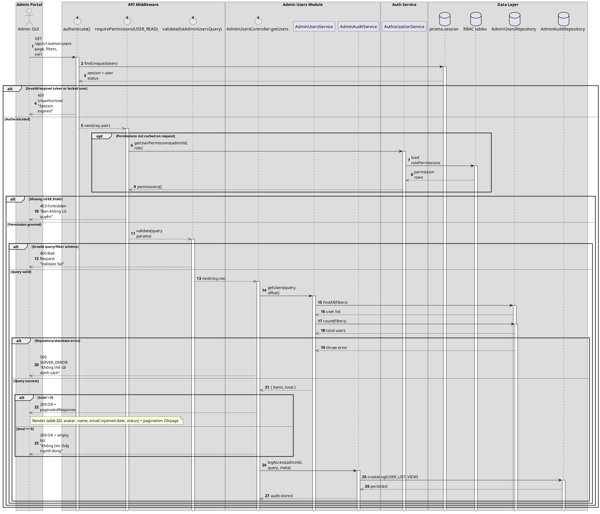

# Template Đặc Tả SEQUENCE DIAGRAM (SD)

## I. Thông Tin Tổng Quan (Header Information)

| Trường (Field) | Nội dung | Ghi chú/Ví dụ |
| :--- | :--- | :--- |
| **SD ID** | SD-UCA01-1 | Tương ứng UCA01-1 |
| **Related UC ID** | UCA01-1 | Xem danh sách người dùng |
| **SD Name** | Luồng xem danh sách người dùng | - |
| **Description** | Admin truy cập trang quản lý người dùng, hệ thống truy vấn, phân trang, lọc và hiển thị danh sách để quản trị. | - |
| **Primary Actor** | Admin | - |
| **Phiên bản (Version)** | 0.1.0 | - |
| **Trạng thái (Status)** | Draft | - |
| **Tác giả (Author)** |  | - |
| **Ngày (Date)** |  | Ngày cập nhật gần nhất |
| **Liên kết UC/BR/NFR** | `UC/UC-A1/UCA01-1_Xem_danh_sach_nguoi_dung.md` | BR/NFR trong UC |
| **Nguồn biểu đồ (Diagram Source)** | Mermaid | Lưu kèm trong file |
| **Tài liệu liên quan (Related Artifacts)** | API Spec, DB Schema `User` | - |

---

## II. Danh Sách Đối Tượng Tham Gia (Participants / Lifelines)

| ID | Tên Đối tượng (Lifeline) | Vai trò/Loại (Stereotype) | Chủ quản (Ownership) | Giao thức/Interface (Protocol) | Phiên bản API | Mô tả chi tiết |
| :--- | :--- | :--- | :--- | :--- | :--- | :--- |
| L1 | Admin GUI | Boundary | Web Admin | HTTP | n/a | Giao diện trang "Quản lý Người dùng" |
| L2 | UserListController | Control | Core | Internal | v1 | Điều phối request/response, xác thực quyền |
| L3 | UserQueryService | Service | Core | Internal | v1 | Nghiệp vụ truy vấn danh sách, áp dụng filter/sort/paging |
| L4 | AuthZService | Service | Core | Internal | v1 | Kiểm tra quyền `User.Read` |
| L5 | UserRepository | Entity/DAO | Data | SQL | n/a | Truy cập bảng `User`, truy vấn theo tiêu chí |

---

## III. Biểu Đồ Sequence Diagram (Visual Model)

---

## IV. Đặc Tả Chi Tiết Luồng Tương Tác (Interaction Flow Specification)

### A. Luồng Thành công Chính (Basic Success Flow)

| STT | Hành động | Thông điệp (Message) | Sync/Async | Định nghĩa Input | Định nghĩa Output | Nguồn (Source) | Đích (Target) | Lỗi/Timeout | Giao dịch (Txn) |
| :--- | :--- | :--- | :--- | :--- | :--- | :--- | :--- | :--- | :--- |
| 1 | Admin mở trang danh sách | `openUserList(page, filters, sort)` | Sync | `{ page:number, filters:object, sort:string }` | `200 OK` | L1 | L2 | 401 | N/A |
| 2 | Kiểm tra quyền | `checkPermission(adminId, "User.Read")` | Sync | `{ adminId:string }` | `{ allowed:boolean }` | L2 | L4 | 403 | N/A |
| 3 | Gọi service truy vấn | `getUsers(query)` | Sync | `{ page, filters, sort }` | `{ items[], total }` | L2 | L3 | 5xx | Đọc |
| 4 | Truy vấn CSDL | `findUsers(query)` | Sync | `{ ... }` | `{ items[], total }` | L3 | L5 | 5xx | Đọc |
| 5 | Trả kết quả và hiển thị | `renderTable(items, total)` | Sync | `{ items[], total }` | UI updated | L2 | L1 | - | N/A |

### B. Luồng Thay thế / Ngoại lệ (Alternative / Exception Flows)

| Fragment ID | Loại | Guard Condition | Ảnh hưởng bước | Error Code/Type | Chiến lược khôi phục | Thông điệp hiển thị | Telemetry |
| :--- | :--- | :--- | :--- | :--- | :--- | :--- | :--- |
| AF-1 | [alt] | Không có dữ liệu | Thay thế bước 5 | EMPTY | Hiển thị bảng rỗng | "Không tìm thấy người dùng" | log: info |
| EF-1 | [alt] | Thiếu quyền | Thay thế 3-5 | PERMISSION_DENIED | Dừng luồng | "Bạn không có quyền" | log: warn |
| EF-2 | [alt] | Lỗi tải dữ liệu | Thay thế 5 | SERVER_ERROR | Cho phép thử lại | "Không thể tải danh sách" | log: error |

---

## V. Ghi Chú và Ràng Buộc (Additional Information)

| Trường | Chi tiết |
| :--- | :--- |
| Timing Constraint | Tải trang < 2s với server-side paging |
| Reliability | Phân trang ổn định; giới hạn export tối đa 1000 mục |
| Idempotency | Truy vấn là idempotent |
| Security | Chỉ Admin có `User.Read`; audit truy cập |
| Observability | Metrics: `userlist_latency_ms`, `userlist_error_rate` |
| Business Rules | Tìm kiếm không phân biệt hoa thường, hỗ trợ không dấu |

---

## VI. Tác Động Dữ Liệu (Data Impact)

| Entity/Bảng | Hành động | Trường bị ảnh hưởng | Ràng buộc/Quy tắc |
| :--- | :--- | :--- | :--- |
| `User` | READ | n/a | Lọc/sort theo tiêu chí |

---

## VII. Giả Định & Câu Hỏi Mở (Assumptions & Open Questions)

- Giả định: Chỉ thị sort hợp lệ và được whitelist.
- Câu hỏi mở: Có cần lưu preset bộ lọc theo người dùng quản trị?

---

## VIII. Nguồn Biểu Đồ (Diagram Source)

- Mermaid embedded ở mục III.

