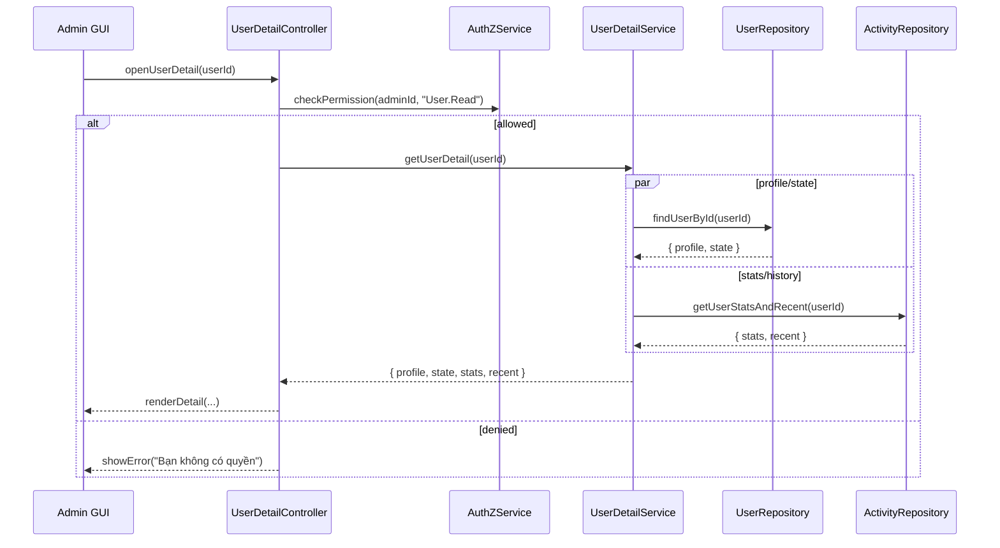

# Template Đặc Tả SEQUENCE DIAGRAM (SD)

## I. Thông Tin Tổng Quan (Header Information)

| Trường (Field) | Nội dung | Ghi chú/Ví dụ |
| :--- | :--- | :--- |
| **SD ID** | SD-UCA01-2 | Tương ứng UCA01-2 |
| **Related UC ID** | UCA01-2 | Xem chi tiết người dùng |
| **SD Name** | Luồng xem chi tiết người dùng | - |
| **Description** | Admin mở trang chi tiết người dùng; hệ thống kiểm tra quyền, tải hồ sơ, trạng thái, thống kê và lịch sử. | - |
| **Primary Actor** | Admin | - |
| **Phiên bản (Version)** | 0.1.0 | - |
| **Trạng thái (Status)** | Draft | - |
| **Tác giả (Author)** |  | - |
| **Ngày (Date)** |  | Ngày cập nhật gần nhất |
| **Liên kết UC/BR/NFR** | `UC/UC-A1/UCA01-2_Xem_chi_tiet_nguoi_dung.md` | BR/NFR trong UC |
| **Nguồn biểu đồ (Diagram Source)** | Mermaid | Lưu kèm trong file |
| **Tài liệu liên quan (Related Artifacts)** | API Spec, DB Schema `User`, `Recipe` | - |

---

## II. Danh Sách Đối Tượng Tham Gia (Participants / Lifelines)

| ID | Tên Đối tượng (Lifeline) | Vai trò/Loại (Stereotype) | Chủ quản (Ownership) | Giao thức/Interface (Protocol) | Phiên bản API | Mô tả chi tiết |
| :--- | :--- | :--- | :--- | :--- | :--- | :--- |
| L1 | Admin GUI | Boundary | Web Admin | HTTP | n/a | Giao diện trang chi tiết người dùng |
| L2 | UserDetailController | Control | Core | Internal | v1 | Điều phối request/response, breadcrumb |
| L3 | UserDetailService | Service | Core | Internal | v1 | Nghiệp vụ tổng hợp dữ liệu chi tiết |
| L4 | AuthZService | Service | Core | Internal | v1 | Kiểm tra quyền `User.Read` |
| L5 | UserRepository | Entity/DAO | Data | SQL | n/a | Đọc hồ sơ và trạng thái người dùng |
| L6 | ActivityRepository | Entity/DAO | Data | SQL | n/a | Lịch sử hoạt động, thống kê |

---

## III. Biểu Đồ Sequence Diagram (Visual Model)

---

## IV. Đặc Tả Chi Tiết Luồng Tương Tác (Interaction Flow Specification)

### A. Luồng Thành công Chính (Basic Success Flow)

| STT | Hành động | Thông điệp (Message) | Sync/Async | Định nghĩa Input | Định nghĩa Output | Nguồn (Source) | Đích (Target) | Lỗi/Timeout | Giao dịch (Txn) |
| :--- | :--- | :--- | :--- | :--- | :--- | :--- | :--- | :--- | :--- |
| 1 | Admin mở trang chi tiết | `openUserDetail(userId)` | Sync | `{ userId:string }` | `200 OK` | L1 | L2 | 401 | N/A |
| 2 | Kiểm tra quyền | `checkPermission(adminId, "User.Read")` | Sync | `{ adminId:string }` | `{ allowed:boolean }` | L2 | L4 | 403 | N/A |
| 3 | Tổng hợp dữ liệu | `getUserDetail(userId)` | Sync | `{ userId }` | `{ profile, state, stats, recent }` | L2 | L3 | 5xx | Đọc |
| 4 | Đọc hồ sơ | `findUserById(userId)` | Sync | `{ userId }` | `{ profile, state }` | L3 | L5 | 404/5xx | Đọc |
| 5 | Đọc thống kê/lịch sử | `getUserStatsAndRecent(userId)` | Sync | `{ userId }` | `{ stats, recent }` | L3 | L6 | 5xx | Đọc |
| 6 | Trả kết quả và hiển thị | `renderDetail(...)` | Sync | `{ all }` | UI updated | L2 | L1 | - | N/A |

### B. Luồng Thay thế / Ngoại lệ (Alternative / Exception Flows)

| Fragment ID | Loại | Guard Condition | Ảnh hưởng bước | Error Code/Type | Chiến lược khôi phục | Thông điệp hiển thị | Telemetry |
| :--- | :--- | :--- | :--- | :--- | :--- | :--- | :--- |
| EF-1 | [alt] | Người dùng không tồn tại | Thay thế 4-6 | NOT_FOUND | Dừng luồng | "Người dùng không tồn tại" | log: warn |
| EF-2 | [alt] | Thiếu quyền | Thay thế 3-6 | PERMISSION_DENIED | Dừng luồng | "Bạn không có quyền" | log: warn |
| EF-3 | [alt] | Lỗi tải dữ liệu | Thay thế 6 | SERVER_ERROR | Cho phép thử lại | "Không thể tải thông tin" | log: error |

---

## V. Ghi Chú và Ràng Buộc (Additional Information)

| Trường | Chi tiết |
| :--- | :--- |
| Timing Constraint | Tải trang chi tiết < 2s |
| Security | Bảo vệ PII; audit truy cập |
| Observability | Metrics: `userdetail_latency_ms`, `userdetail_error_rate` |
| Business Rules | Chỉ Admin/Super Admin xem đủ thống kê |

---

## VI. Tác Động Dữ Liệu (Data Impact)

| Entity/Bảng | Hành động | Trường bị ảnh hưởng | Ràng buộc/Quy tắc |
| :--- | :--- | :--- | :--- |
| `User` | READ | n/a | - |
| `Recipe` | READ | n/a | Lịch sử gần đây/liên quan |

---

## VII. Giả Định & Câu Hỏi Mở (Assumptions & Open Questions)

- Giả định: Breadcrumb khả dụng để quay lại danh sách.
- Câu hỏi mở: Có cần export PDF trực tiếp từ trang?

---

## VIII. Nguồn Biểu Đồ (Diagram Source)

- Mermaid embedded ở mục III.

