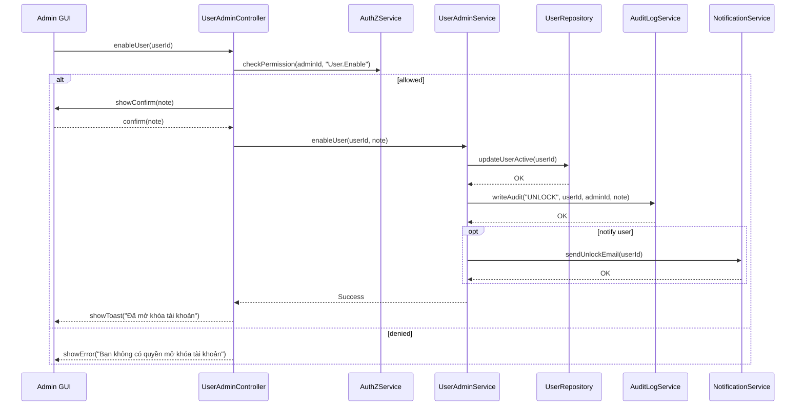

# Template Đặc Tả SEQUENCE DIAGRAM (SD)

## I. Thông Tin Tổng Quan (Header Information)

| Trường (Field) | Nội dung | Ghi chú/Ví dụ |
| :--- | :--- | :--- |
| **SD ID** | SD-UCA01-4 | Tương ứng UCA01-4 |
| **Related UC ID** | UCA01-4 | Kích hoạt lại tài khoản người dùng |
| **SD Name** | Luồng mở khóa tài khoản người dùng | - |
| **Description** | Admin thực hiện mở khóa tài khoản: xác nhận, cập nhật trạng thái, audit và thông báo. | - |
| **Primary Actor** | Admin | - |
| **Phiên bản (Version)** | 0.1.0 | - |
| **Trạng thái (Status)** | Draft | - |
| **Tác giả (Author)** |  | - |
| **Ngày (Date)** |  | Ngày cập nhật gần nhất |
| **Liên kết UC/BR/NFR** | `UC/UC-A1/UCA01-4_Kich_hoat_lai_tai_khoan_nguoi_dung.md` | BR/NFR trong UC |
| **Nguồn biểu đồ (Diagram Source)** | Mermaid | Lưu kèm trong file |
| **Tài liệu liên quan (Related Artifacts)** | API Spec, DB Schema `User`, `AuditLog` | - |

---

## II. Danh Sách Đối Tượng Tham Gia (Participants / Lifelines)

| ID | Tên Đối tượng (Lifeline) | Vai trò/Loại (Stereotype) | Chủ quản (Ownership) | Giao thức/Interface (Protocol) | Phiên bản API | Mô tả chi tiết |
| :--- | :--- | :--- | :--- | :--- | :--- | :--- |
| L1 | Admin GUI | Boundary | Web Admin | HTTP | n/a | Giao diện hành động mở khóa |
| L2 | UserAdminController | Control | Core | Internal | v1 | Điều phối xác nhận và gọi service |
| L3 | UserAdminService | Service | Core | Internal | v1 | Nghiệp vụ mở khóa tài khoản |
| L4 | AuthZService | Service | Core | Internal | v1 | Kiểm tra quyền `User.Enable` |
| L5 | UserRepository | Entity/DAO | Data | SQL | n/a | Cập nhật trạng thái `active`, ghi chú |
| L6 | AuditLogService | Service | Core | Internal | v1 | Ghi nhận sự kiện mở khóa |
| L7 | NotificationService | Service | Core | Internal | v1 | Gửi email thông báo (tuỳ chọn) |

---

## III. Biểu Đồ Sequence Diagram (Visual Model)

---

## IV. Đặc Tả Chi Tiết Luồng Tương Tác (Interaction Flow Specification)

### A. Luồng Thành công Chính (Basic Success Flow)

| STT | Hành động | Thông điệp (Message) | Sync/Async | Định nghĩa Input | Định nghĩa Output | Nguồn (Source) | Đích (Target) | Lỗi/Timeout | Giao dịch (Txn) |
| :--- | :--- | :--- | :--- | :--- | :--- | :--- | :--- | :--- | :--- |
| 1 | Admin yêu cầu mở khóa | `enableUser(userId)` | Sync | `{ userId }` | `200 OK` | L1 | L2 | 401 | N/A |
| 2 | Kiểm tra quyền | `checkPermission(adminId, "User.Enable")` | Sync | `{ adminId }` | `{ allowed }` | L2 | L4 | 403 | N/A |
| 3 | Xác nhận | `showConfirm(note)` | Sync | `{ note? }` | `confirm` | L2 | L1 | - | N/A |
| 4 | Gọi service mở khóa | `enableUser(userId, note)` | Sync | `{ userId, note }` | `OK` | L2 | L3 | 5xx | Bắt đầu |
| 5 | Cập nhật DB | `updateUserActive(userId)` | Sync | `{ userId }` | `OK` | L3 | L5 | 5xx | Ghi |
| 6 | Audit | `writeAudit("UNLOCK", ...)` | Sync | `{ ... }` | `OK` | L3 | L6 | 5xx | Ghi |
| 7 | Thông báo (opt) | `sendUnlockEmail(...)` | Async | `{ userId }` | `Accepted` | L3 | L7 | timeout | N/A |
| 8 | Trả về UI | `showToast("Đã mở khóa tài khoản")` | Sync | `-` | UI updated | L2 | L1 | - | Kết thúc |

### B. Luồng Thay thế / Ngoại lệ (Alternative / Exception Flows)

| Fragment ID | Loại | Guard Condition | Ảnh hưởng bước | Error Code/Type | Chiến lược khôi phục | Thông điệp hiển thị | Telemetry |
| :--- | :--- | :--- | :--- | :--- | :--- | :--- | :--- |
| EF-1 | [alt] | Thiếu quyền | Thay thế 3-8 | PERMISSION_DENIED | Dừng luồng | "Bạn không có quyền mở khóa tài khoản" | log: warn |
| EF-2 | [alt] | Tài khoản đang hoạt động | Thay thế 4-8 | ALREADY_ACTIVE | Dừng luồng | "Tài khoản đang hoạt động" | log: info |
| EF-3 | [alt] | Lỗi cập nhật CSDL | Thay thế 6-8 | DB_ERROR | Cho phép thử lại | "Không thể cập nhật trạng thái" | log: error |

---

## V. Ghi Chú và Ràng Buộc (Additional Information)

| Trường | Chi tiết |
| :--- | :--- |
| Security | Chỉ Super Admin mở khóa vi phạm nghiêm trọng; audit bắt buộc |
| Performance | Cập nhật trạng thái < 1s |
| Reliability | Trạng thái đồng bộ trên tất cả phiên |

---

## VI. Tác Động Dữ Liệu (Data Impact)

| Entity/Bảng | Hành động | Trường bị ảnh hưởng | Ràng buộc/Quy tắc |
| :--- | :--- | :--- | :--- |
| `User` | UPDATE | `status`, `unlockNote` | - |
| `AuditLog` | INSERT | `action`, `actor`, `target`, `note` | - |

---

## VII. Giả Định & Câu Hỏi Mở (Assumptions & Open Questions)

- Giả định: Quyền `User.Enable` tách biệt với `User.Disable`.
- Câu hỏi mở: Có yêu cầu bắt buộc ghi chú khi mở khóa?

---

## VIII. Nguồn Biểu Đồ (Diagram Source)

- Mermaid embedded ở mục III.

