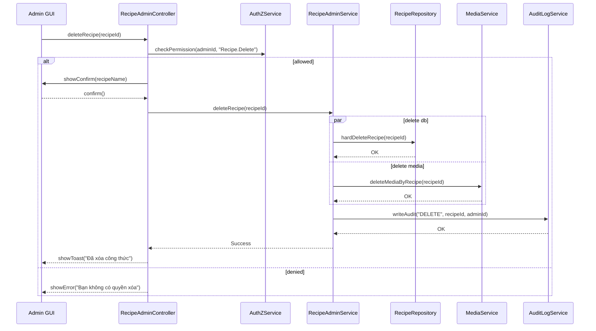

# Template Đặc Tả SEQUENCE DIAGRAM (SD)

## I. Thông Tin Tổng Quan (Header Information)

| Trường (Field) | Nội dung | Ghi chú/Ví dụ |
| :--- | :--- | :--- |
| **SD ID** | SD-UCA02-4 | Tương ứng UCA02-4 |
| **Related UC ID** | UCA02-4 | Xóa công thức hệ thống |
| **SD Name** | Luồng xóa công thức hệ thống | - |
| **Description** | Admin xác nhận xóa, hệ thống xóa khỏi CSDL và storage, audit hành động. | - |
| **Primary Actor** | Admin | - |
| **Phiên bản (Version)** | 0.1.0 | - |
| **Trạng thái (Status)** | Draft | - |
| **Tác giả (Author)** |  | - |
| **Ngày (Date)** |  | Ngày cập nhật gần nhất |
| **Liên kết UC/BR/NFR** | `UC/UC-A2/UCA02-4_Xoa_cong_thuc_he_thong.md` | BR/NFR trong UC |
| **Nguồn biểu đồ (Diagram Source)** | Mermaid | Lưu kèm trong file |
| **Tài liệu liên quan (Related Artifacts)** | API Spec, DB `Recipe`, Storage | - |

---

## II. Danh Sách Đối Tượng Tham Gia (Participants / Lifelines)

| ID | Tên Đối tượng (Lifeline) | Vai trò/Loại (Stereotype) | Chủ quản (Ownership) | Giao thức/Interface (Protocol) | Phiên bản API | Mô tả chi tiết |
| :--- | :--- | :--- | :--- | :--- | :--- | :--- |
| L1 | Admin GUI | Boundary | Web Admin | HTTP | n/a | UI xác nhận xóa |
| L2 | RecipeAdminController | Control | Core | Internal | v1 | Điều phối |
| L3 | RecipeAdminService | Service | Core | Internal | v1 | Nghiệp vụ xóa |
| L4 | AuthZService | Service | Core | Internal | v1 | Quyền `Recipe.Delete` |
| L5 | RecipeRepository | Entity/DAO | Data | SQL | n/a | Xóa bản ghi |
| L6 | MediaService | Service | Core | Internal | v1 | Xóa file media |
| L7 | AuditLogService | Service | Core | Internal | v1 | Ghi audit |

---

## III. Biểu Đồ Sequence Diagram (Visual Model)

---

## IV. Đặc Tả Chi Tiết Luồng Tương Tác (Interaction Flow Specification)

### A. Luồng Thành công Chính (Basic Success Flow)

| STT | Hành động | Thông điệp (Message) | Sync/Async | Input | Output | Nguồn | Đích | Lỗi/Timeout | Txn |
| :--- | :--- | :--- | :--- | :--- | :--- | :--- | :--- | :--- | :--- |
| 1 | Yêu cầu xóa | `deleteRecipe(recipeId)` | Sync | `{ recipeId }` | `200` | L1 | L2 | 401 | N/A |
| 2 | Kiểm tra quyền | `checkPermission(..., "Recipe.Delete")` | Sync | `{ adminId }` | `{ allowed }` | L2 | L4 | 403 | N/A |
| 3 | Xác nhận | `showConfirm(name)` | Sync | `{ name }` | `confirm` | L2 | L1 | - | N/A |
| 4 | Xóa DB | `hardDeleteRecipe(recipeId)` | Sync | `{ recipeId }` | `OK` | L3 | L5 | 5xx | Ghi |
| 5 | Xóa media | `deleteMediaByRecipe(recipeId)` | Sync | `{ recipeId }` | `OK` | L3 | L6 | timeout | Ghi |
| 6 | Audit | `writeAudit("DELETE", ...)` | Sync | `{ ... }` | `OK` | L3 | L7 | 5xx | Ghi |
| 7 | Phản hồi UI | `showToast(...)` | Sync | `{ message }` | UI updated | L2 | L1 | - | Kết thúc |

### B. Luồng Thay thế / Ngoại lệ (Alternative / Exception Flows)

| Fragment ID | Loại | Guard Condition | Ảnh hưởng bước | Error Code/Type | Chiến lược khôi phục | Thông điệp hiển thị | Telemetry |
| :--- | :--- | :--- | :--- | :--- | :--- | :--- | :--- |
| AF-1 | [opt] | Soft delete | Thay thế 4 | SOFT_DELETE | Cho phép khôi phục | "Đã ẩn công thức" | log: info |
| EF-1 | [alt] | Thiếu quyền | Thay thế 3-7 | PERMISSION_DENIED | Dừng | "Bạn không có quyền" | log: warn |
| EF-2 | [alt] | Không tồn tại | Thay thế 4-7 | NOT_FOUND | Dừng | "Công thức không tồn tại" | log: warn |
| EF-3 | [alt] | Lỗi CSDL/Storage | Thay thế 6-7 | SYSTEM_ERROR | Retry | "Không thể xóa" | log: error |

---

## V. Ghi Chú và Ràng Buộc (Additional Information)

| Trường | Chi tiết |
| :--- | :--- |
| Security | Audit hành động xóa |
| Reliability | Không để dữ liệu mồ côi |

---

## VI. Tác Động Dữ Liệu (Data Impact)

| Entity/Bảng | Hành động | Trường bị ảnh hưởng | Ràng buộc |
| :--- | :--- | :--- | :--- |
| `Recipe` | DELETE | all | Hard/soft delete |
| `Media` | DELETE | by recipeId | - |
| `AuditLog` | INSERT | delete action | - |

---

## VII. Giả Định & Câu Hỏi Mở (Assumptions & Open Questions)

- Giả định: MediaService chịu trách nhiệm dọn dẹp file.
- Câu hỏi mở: Có bắt nhập lại tên để xác nhận xóa?

---

## VIII. Nguồn Biểu Đồ (Diagram Source)

- Mermaid embedded ở mục III.

