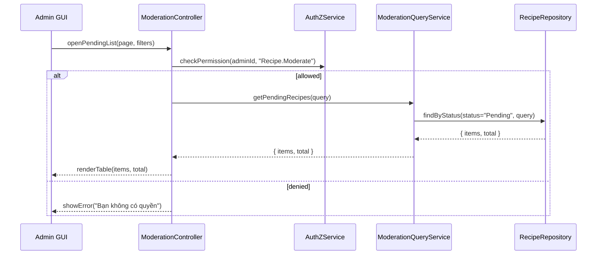

# Template Đặc Tả SEQUENCE DIAGRAM (SD)

## I. Thông Tin Tổng Quan (Header Information)

| Trường (Field) | Nội dung | Ghi chú/Ví dụ |
| :--- | :--- | :--- |
| **SD ID** | SD-UCA02-5 | Tương ứng UCA02-5 |
| **Related UC ID** | UCA02-5 | Xem danh sách công thức chờ duyệt |
| **SD Name** | Luồng xem danh sách chờ duyệt | - |
| **Description** | Admin xem danh sách công thức ở trạng thái "Chờ duyệt", hỗ trợ tìm kiếm, lọc, phân trang. | - |
| **Primary Actor** | Admin | - |
| **Phiên bản (Version)** | 0.1.0 | - |
| **Trạng thái (Status)** | Draft | - |
| **Tác giả (Author)** |  | - |
| **Ngày (Date)** |  | Ngày cập nhật gần nhất |
| **Liên kết UC/BR/NFR** | `UC/UC-A2/UCA02-5_Xem_danh_sach_cong_thuc_cho_duyet.md` | BR/NFR trong UC |
| **Nguồn biểu đồ (Diagram Source)** | Mermaid | Lưu kèm trong file |
| **Tài liệu liên quan (Related Artifacts)** | API Spec, DB `Recipe` | - |

---

## II. Danh Sách Đối Tượng Tham Gia (Participants / Lifelines)

| ID | Tên Đối tượng (Lifeline) | Vai trò/Loại (Stereotype) | Chủ quản (Ownership) | Giao thức/Interface (Protocol) | Phiên bản API | Mô tả chi tiết |
| :--- | :--- | :--- | :--- | :--- | :--- | :--- |
| L1 | Admin GUI | Boundary | Web Admin | HTTP | n/a | Trang "Công thức chờ duyệt" |
| L2 | ModerationController | Control | Core | Internal | v1 | Điều phối kiểm duyệt |
| L3 | ModerationQueryService | Service | Core | Internal | v1 | Truy vấn danh sách chờ duyệt |
| L4 | AuthZService | Service | Core | Internal | v1 | Quyền `Recipe.Moderate` |
| L5 | RecipeRepository | Entity/DAO | Data | SQL | n/a | Truy vấn theo trạng thái |

---

## III. Biểu Đồ Sequence Diagram (Visual Model)

---

## IV. Đặc Tả Chi Tiết Luồng Tương Tác (Interaction Flow Specification)

### A. Luồng Thành công Chính (Basic Success Flow)

| STT | Hành động | Thông điệp (Message) | Sync/Async | Input | Output | Nguồn | Đích | Lỗi/Timeout | Txn |
| :--- | :--- | :--- | :--- | :--- | :--- | :--- | :--- | :--- | :--- |
| 1 | Mở danh sách | `openPendingList(...)` | Sync | `{ page, filters }` | `200` | L1 | L2 | 401 | N/A |
| 2 | Kiểm tra quyền | `checkPermission(..., "Recipe.Moderate")` | Sync | `{ adminId }` | `{ allowed }` | L2 | L4 | 403 | N/A |
| 3 | Gọi service | `getPendingRecipes(query)` | Sync | `{ ... }` | `{ items, total }` | L2 | L3 | 5xx | Đọc |
| 4 | Truy vấn DB | `findByStatus("Pending", ...)` | Sync | `{ ... }` | `{ items, total }` | L3 | L5 | 5xx | Đọc |
| 5 | Render UI | `renderTable(...)` | Sync | `{ items, total }` | UI updated | L2 | L1 | - | N/A |

### B. Luồng Thay thế / Ngoại lệ (Alternative / Exception Flows)

| Fragment ID | Loại | Guard Condition | Ảnh hưởng bước | Error Code/Type | Chiến lược khôi phục | Thông điệp hiển thị | Telemetry |
| :--- | :--- | :--- | :--- | :--- | :--- | :--- | :--- |
| AF-1 | [alt] | Không có công thức chờ duyệt | Thay thế 5 | EMPTY | Hiển thị bảng rỗng | "Không có công thức nào trong hàng đợi" | log: info |
| EF-1 | [alt] | Thiếu quyền | Thay thế 3-5 | PERMISSION_DENIED | Dừng | "Bạn không có quyền" | log: warn |
| EF-2 | [alt] | Lỗi tải dữ liệu | Thay thế 5 | SERVER_ERROR | Retry | "Không thể tải danh sách" | log: error |

---

## V. Ghi Chú và Ràng Buộc (Additional Information)

| Trường | Chi tiết |
| :--- | :--- |
| Business Rules | Chỉ recipe user gửi mới ở trạng thái Pending; lock by owner |
| Security | Chỉ quyền kiểm duyệt truy cập |

---

## VI. Tác Động Dữ Liệu (Data Impact)

| Entity/Bảng | Hành động | Trường bị ảnh hưởng | Ràng buộc |
| :--- | :--- | :--- | :--- |
| `Recipe` | READ | where status=Pending | - |

---

## VII. Giả Định & Câu Hỏi Mở (Assumptions & Open Questions)

- Giả định: Có cơ chế lock một admin/lần.
- Câu hỏi mở: Có cần phân công kiểm duyệt viên?

---

## VIII. Nguồn Biểu Đồ (Diagram Source)

- Mermaid embedded ở mục III.

