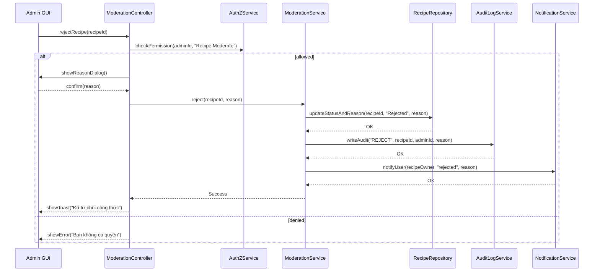

# Template Đặc Tả SEQUENCE DIAGRAM (SD)

## I. Thông Tin Tổng Quan (Header Information)

| Trường (Field) | Nội dung | Ghi chú/Ví dụ |
| :--- | :--- | :--- |
| **SD ID** | SD-UCA02-7 | Tương ứng UCA02-7 |
| **Related UC ID** | UCA02-7 | Từ chối công thức |
| **SD Name** | Luồng từ chối công thức | - |
| **Description** | Admin từ chối công thức chờ duyệt: nhập lý do, cập nhật trạng thái, lưu lý do, ghi log và thông báo. | - |
| **Primary Actor** | Admin | - |
| **Phiên bản (Version)** | 0.1.0 | - |
| **Trạng thái (Status)** | Draft | - |
| **Tác giả (Author)** |  | - |
| **Ngày (Date)** |  | Ngày cập nhật gần nhất |
| **Liên kết UC/BR/NFR** | `UC/UC-A2/UCA02-7_Tu_choi_cong_thuc.md` | BR/NFR trong UC |
| **Nguồn biểu đồ (Diagram Source)** | Mermaid | Lưu kèm trong file |
| **Tài liệu liên quan (Related Artifacts)** | API Spec, DB `Recipe`, `AuditLog`, Notification | - |

---

## II. Danh Sách Đối Tượng Tham Gia (Participants / Lifelines)

| ID | Tên Đối tượng (Lifeline) | Vai trò/Loại (Stereotype) | Chủ quản (Ownership) | Giao thức/Interface (Protocol) | Phiên bản API | Mô tả chi tiết |
| :--- | :--- | :--- | :--- | :--- | :--- | :--- |
| L1 | Admin GUI | Boundary | Web Admin | HTTP | n/a | UI chi tiết công thức |
| L2 | ModerationController | Control | Core | Internal | v1 | Điều phối |
| L3 | ModerationService | Service | Core | Internal | v1 | Nghiệp vụ từ chối |
| L4 | AuthZService | Service | Core | Internal | v1 | Quyền `Recipe.Moderate` |
| L5 | RecipeRepository | Entity/DAO | Data | SQL | n/a | Cập nhật trạng thái và lý do |
| L6 | AuditLogService | Service | Core | Internal | v1 | Ghi log kiểm duyệt |
| L7 | NotificationService | Service | Core | Internal | v1 | Gửi thông báo |

---

## III. Biểu Đồ Sequence Diagram (Visual Model)

---

## IV. Đặc Tả Chi Tiết Luồng Tương Tác (Interaction Flow Specification)

### A. Luồng Thành công Chính (Basic Success Flow)

| STT | Hành động | Thông điệp (Message) | Sync/Async | Input | Output | Nguồn | Đích | Lỗi/Timeout | Txn |
| :--- | :--- | :--- | :--- | :--- | :--- | :--- | :--- | :--- | :--- |
| 1 | Yêu cầu từ chối | `rejectRecipe(recipeId)` | Sync | `{ recipeId }` | `200` | L1 | L2 | 401 | N/A |
| 2 | Kiểm tra quyền | `checkPermission(..., "Recipe.Moderate")` | Sync | `{ adminId }` | `{ allowed }` | L2 | L4 | 403 | N/A |
| 3 | Hộp thoại lý do | `showReasonDialog()` | Sync | `-` | `confirm(reason)` | L2 | L1 | - | N/A |
| 4 | Cập nhật trạng thái+lý do | `updateStatusAndReason(...)` | Sync | `{ recipeId, reason }` | `OK` | L3 | L5 | 5xx | Ghi |
| 5 | Audit | `writeAudit("REJECT", ...)` | Sync | `{ ... }` | `OK` | L3 | L6 | 5xx | Ghi |
| 6 | Thông báo | `notifyUser(...)` | Async | `{ userId, type, reason }` | `Accepted` | L3 | L7 | timeout | N/A |
| 7 | Phản hồi UI | `showToast(...)` | Sync | `{ message }` | UI updated | L2 | L1 | - | Kết thúc |

### B. Luồng Thay thế / Ngoại lệ (Alternative / Exception Flows)

| Fragment ID | Loại | Guard Condition | Ảnh hưởng bước | Error Code/Type | Chiến lược khôi phục | Thông điệp hiển thị | Telemetry |
| :--- | :--- | :--- | :--- | :--- | :--- | :--- | :--- |
| EF-1 | [alt] | Thiếu quyền | Thay thế 3-7 | PERMISSION_DENIED | Dừng | "Bạn không có quyền" | log: warn |
| EF-2 | [alt] | Trạng thái không hợp lệ | Thay thế 4-7 | INVALID_STATE | Dừng | "Trạng thái không hợp lệ" | log: warn |
| EF-3 | [alt] | Lỗi CSDL | Thay thế 5-7 | DB_ERROR | Retry | "Không thể cập nhật" | log: error |

---

## V. Ghi Chú và Ràng Buộc (Additional Information)

| Trường | Chi tiết |
| :--- | :--- |
| Business Rules | Lý do từ chối phải rõ ràng, tôn trọng |
| Security | Audit đầy đủ; thông báo người gửi |

---

## VI. Tác Động Dữ Liệu (Data Impact)

| Entity/Bảng | Hành động | Trường bị ảnh hưởng | Ràng buộc |
| :--- | :--- | :--- | :--- |
| `Recipe` | UPDATE | `status`, `rejectReason` | - |
| `AuditLog` | INSERT | reject action | - |

---

## VII. Giả Định & Câu Hỏi Mở (Assumptions & Open Questions)

- Giả định: NotificationService hỗ trợ template lý do.
- Câu hỏi mở: Có lưu mẫu lý do nhanh trong hệ thống?

---

## VIII. Nguồn Biểu Đồ (Diagram Source)

- Mermaid embedded ở mục III.

