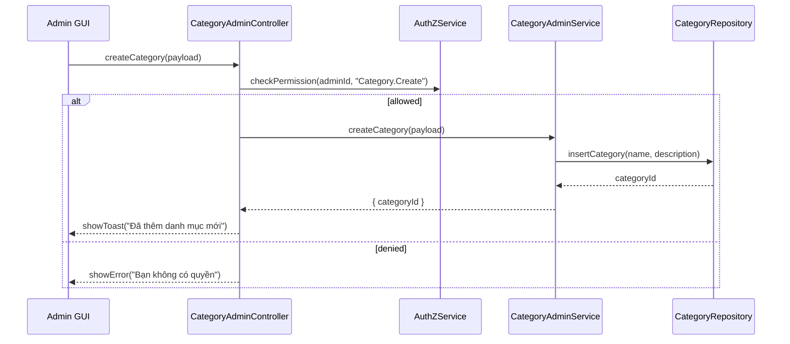

# Template Đặc Tả SEQUENCE DIAGRAM (SD)

## I. Thông Tin Tổng Quan (Header Information)

| Trường (Field) | Nội dung | Ghi chú/Ví dụ |
| :--- | :--- | :--- |
| **SD ID** | SD-UCA03-2 | Tương ứng UCA03-2 |
| **Related UC ID** | UCA03-2 | Thêm danh mục mới |
| **SD Name** | Luồng thêm danh mục mới | - |
| **Description** | Admin tạo danh mục: nhập liệu, validate tên duy nhất, lưu vào CSDL. | - |
| **Primary Actor** | Admin | - |
| **Phiên bản (Version)** | 0.1.0 | - |
| **Trạng thái (Status)** | Draft | - |
| **Tác giả (Author)** |  | - |
| **Ngày (Date)** |  | Ngày cập nhật gần nhất |
| **Liên kết UC/BR/NFR** | `UC/UC-A3/UCA03-2_Them_danh_muc_moi.md` | BR/NFR trong UC |
| **Nguồn biểu đồ (Diagram Source)** | Mermaid | Lưu kèm trong file |
| **Tài liệu liên quan (Related Artifacts)** | API Spec, DB `Category` | - |

---

## II. Danh Sách Đối Tượng Tham Gia (Participants / Lifelines)

| ID | Tên Đối tượng (Lifeline) | Vai trò/Loại (Stereotype) | Chủ quản (Ownership) | Giao thức/Interface (Protocol) | Phiên bản API | Mô tả chi tiết |
| :--- | :--- | :--- | :--- | :--- | :--- | :--- |
| L1 | Admin GUI | Boundary | Web Admin | HTTP | n/a | Form tạo danh mục |
| L2 | CategoryAdminController | Control | Core | Internal | v1 | Điều phối |
| L3 | CategoryAdminService | Service | Core | Internal | v1 | Nghiệp vụ tạo |
| L4 | AuthZService | Service | Core | Internal | v1 | Quyền `Category.Create` |
| L5 | CategoryRepository | Entity/DAO | Data | SQL | n/a | Lưu danh mục |

---

## III. Biểu Đồ Sequence Diagram (Visual Model)

---

## IV. Đặc Tả Chi Tiết Luồng Tương Tác (Interaction Flow Specification)

### A. Luồng Thành công Chính (Basic Success Flow)

| STT | Hành động | Thông điệp (Message) | Sync/Async | Input | Output | Nguồn | Đích | Lỗi/Timeout | Txn |
| :--- | :--- | :--- | :--- | :--- | :--- | :--- | :--- | :--- | :--- |
| 1 | Submit tạo | `createCategory(payload)` | Sync | `{ name, description? }` | `200` | L1 | L2 | 401 | N/A |
| 2 | Kiểm tra quyền | `checkPermission(..., "Category.Create")` | Sync | `{ adminId }` | `{ allowed }` | L2 | L4 | 403 | N/A |
| 3 | Ghi DB | `insertCategory(...)` | Sync | `{ name, description }` | `{ categoryId }` | L3 | L5 | 409/5xx | Ghi |
| 4 | Phản hồi UI | `showToast(...)` | Sync | `{ message }` | UI updated | L2 | L1 | - | Kết thúc |

### B. Luồng Thay thế / Ngoại lệ (Alternative / Exception Flows)

| Fragment ID | Loại | Guard Condition | Ảnh hưởng bước | Error Code/Type | Chiến lược khôi phục | Thông điệp hiển thị | Telemetry |
| :--- | :--- | :--- | :--- | :--- | :--- | :--- | :--- |
| EF-1 | [alt] | Thiếu quyền | Thay thế 3-4 | PERMISSION_DENIED | Dừng | "Bạn không có quyền" | log: warn |
| EF-2 | [alt] | Tên trùng | Thay thế 3-4 | DUPLICATE_NAME | Sửa tên | "Tên danh mục đã tồn tại" | log: warn |
| EF-3 | [alt] | Lỗi CSDL | Thay thế 4 | DB_ERROR | Retry | "Không thể lưu" | log: error |

---

## V. Ghi Chú và Ràng Buộc (Additional Information)

| Trường | Chi tiết |
| :--- | :--- |
| Business Rules | Tên duy nhất, case-insensitive |
| Performance | Lưu < 1s |

---

## VI. Tác Động Dữ Liệu (Data Impact)

| Entity/Bảng | Hành động | Trường bị ảnh hưởng | Ràng buộc |
| :--- | :--- | :--- | :--- |
| `Category` | INSERT | `name`, `description` | `name` unique |

---

## VII. Giả Định & Câu Hỏi Mở (Assumptions & Open Questions)

- Giả định: Validation tên không dấu.
- Câu hỏi mở: Có hỗ trợ import CSV?

---

## VIII. Nguồn Biểu Đồ (Diagram Source)

- Mermaid embedded ở mục III.

