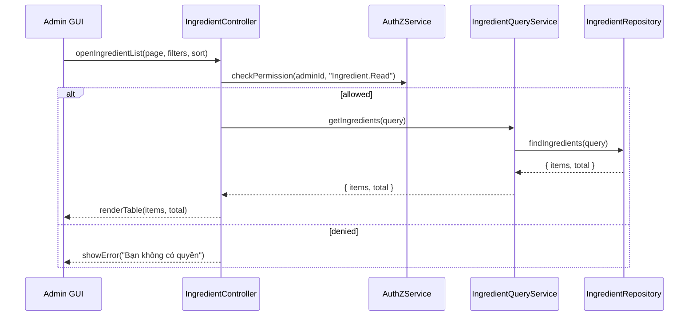

# Template Đặc Tả SEQUENCE DIAGRAM (SD)

## I. Thông Tin Tổng Quan (Header Information)

| Trường (Field) | Nội dung | Ghi chú/Ví dụ |
| :--- | :--- | :--- |
| **SD ID** | SD-UCA03-5 | Tương ứng UCA03-5 |
| **Related UC ID** | UCA03-5 | Xem danh sách nguyên liệu |
| **SD Name** | Luồng xem danh sách nguyên liệu |
| **Description** | Admin mở trang nguyên liệu; kiểm tra quyền, truy vấn, lọc, phân trang và hiển thị. |
| **Primary Actor** | Admin |
| **Phiên bản (Version)** | 0.1.0 |
| **Trạng thái (Status)** | Draft |
| **Tác giả (Author)** |  |
| **Ngày (Date)** |  |
| **Liên kết UC/BR/NFR** | `UC/UC-A3/UCA03-5_Xem_danh_sach_nguyen_lieu.md` |
| **Nguồn biểu đồ (Diagram Source)** | Mermaid |
| **Tài liệu liên quan (Related Artifacts)** | API Spec, DB `Ingredient` |

---

## II. Danh Sách Đối Tượng Tham Gia (Participants / Lifelines)

| ID | Tên Đối tượng | Stereotype | Ownership | Protocol | API Ver | Mô tả |
| :--- | :--- | :--- | :--- | :--- | :--- | :--- |
| L1 | Admin GUI | Boundary | Web Admin | HTTP | n/a | Trang "Quản lý Nguyên liệu" |
| L2 | IngredientController | Control | Core | Internal | v1 | Điều phối |
| L3 | IngredientQueryService | Service | Core | Internal | v1 | Truy vấn nguyên liệu |
| L4 | AuthZService | Service | Core | Internal | v1 | Quyền `Ingredient.Read` |
| L5 | IngredientRepository | Entity/DAO | Data | SQL | n/a | Truy cập `Ingredient` |

---

## III. Biểu Đồ Sequence Diagram (Visual Model)

---

## IV. Đặc Tả Chi Tiết Luồng Tương Tác (Interaction Flow Specification)

### A. Luồng Thành công Chính (Basic Success Flow)

| STT | Hành động | Message | Sync/Async | Input | Output | Source | Target | Error/Timeout | Txn |
| :--- | :--- | :--- | :--- | :--- | :--- | :--- | :--- | :--- | :--- |
| 1 | Mở danh sách | `openIngredientList(...)` | Sync | `{ page, filters, sort }` | `200` | L1 | L2 | 401 | N/A |
| 2 | Kiểm tra quyền | `checkPermission(..., "Ingredient.Read")` | Sync | `{ adminId }` | `{ allowed }` | L2 | L4 | 403 | N/A |
| 3 | Gọi service | `getIngredients(query)` | Sync | `{ ... }` | `{ items, total }` | L2 | L3 | 5xx | Đọc |
| 4 | Truy vấn DB | `findIngredients(query)` | Sync | `{ ... }` | `{ items, total }` | L3 | L5 | 5xx | Đọc |
| 5 | Render UI | `renderTable(...)` | Sync | `{ items, total }` | UI updated | L2 | L1 | - | N/A |

### B. Alternative/Exception Flows

| ID | Type | Guard | Affect | Error | Recovery | UI Message | Telemetry |
| :--- | :--- | :--- | :--- | :--- | :--- | :--- | :--- |
| AF-1 | [alt] | Không có dữ liệu | Thay thế 5 | EMPTY | Bảng rỗng | "Chưa có nguyên liệu" | log: info |
| EF-1 | [alt] | Thiếu quyền | Thay thế 3-5 | PERMISSION_DENIED | Dừng | "Bạn không có quyền" | log: warn |
| EF-2 | [alt] | Lỗi tải dữ liệu | Thay thế 5 | SERVER_ERROR | Retry | "Không thể tải danh sách" | log: error |

---

## V. Ghi Chú & Ràng Buộc

| Trường | Chi tiết |
| :--- | :--- |
| Business Rules | Tên nguyên liệu duy nhất; hỗ trợ alias |
| Performance | Tải < 2s với 10k bản ghi (paging) |

---

## VI. Tác Động Dữ Liệu

| Bảng | Hành động | Trường |
| :--- | :--- | :--- |
| `Ingredient` | READ | n/a |

---

## VII. Giả Định & Câu Hỏi Mở

- Giả định: Có gợi ý tìm kiếm theo alias.
- Câu hỏi mở: Có export CSV đồng bộ hệ khác?

---

## VIII. Nguồn Biểu Đồ

- Mermaid embedded ở mục III.

