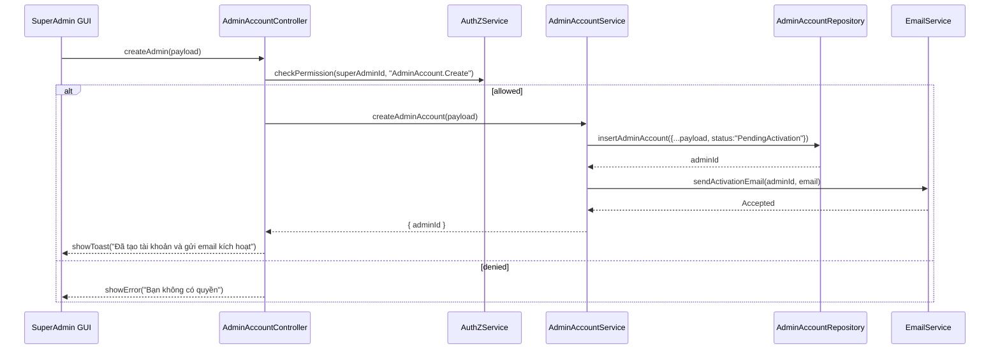

# Template Đặc Tả SEQUENCE DIAGRAM (SD)

## I. Thông Tin Tổng Quan (Header Information)

| Trường (Field) | Nội dung | Ghi chú/Ví dụ |
| :--- | :--- | :--- |
| **SD ID** | SD-UCA04-2 | Tương ứng UCA04-2 |
| **Related UC ID** | UCA04-2 | Tạo tài khoản Admin mới |
| **SD Name** | Luồng tạo tài khoản Admin |
| **Description** | Super Admin tạo tài khoản Admin: nhập liệu, validate email, tạo tài khoản chờ kích hoạt, gửi email kích hoạt. |
| **Primary Actor** | Super Admin |
| **Phiên bản (Version)** | 0.1.0 |
| **Trạng thái (Status)** | Draft |
| **Tác giả (Author)** |  |
| **Ngày (Date)** |  |
| **Liên kết UC/BR/NFR** | `UC/UC-A4/UCA04-2_Tao_tai_khoan_admin_moi.md` |
| **Nguồn biểu đồ (Diagram Source)** | Mermaid |
| **Tài liệu liên quan (Related Artifacts)** | API Spec, DB `AdminAccount`, Email Service |

---

## II. Danh Sách Đối Tượng Tham Gia (Participants / Lifelines)

| ID | Tên Đối tượng | Stereotype | Ownership | Protocol | API Ver | Mô tả |
| :--- | :--- | :--- | :--- | :--- | :--- | :--- |
| L1 | SuperAdmin GUI | Boundary | Web Admin | HTTP | n/a | Form tạo admin |
| L2 | AdminAccountController | Control | Core | Internal | v1 | Điều phối |
| L3 | AdminAccountService | Service | Core | Internal | v1 | Nghiệp vụ tạo tài khoản |
| L4 | AuthZService | Service | Core | Internal | v1 | Quyền `AdminAccount.Create` |
| L5 | AdminAccountRepository | Entity/DAO | Data | SQL | n/a | Lưu tài khoản |
| L6 | EmailService | Service | Core | External | v1 | Gửi email kích hoạt |

---

## III. Biểu Đồ Sequence Diagram (Visual Model)

---

## IV. Đặc Tả Chi Tiết Luồng Tương Tác (Interaction Flow Specification)

### A. Luồng Thành công Chính (Basic Success Flow)

| STT | Hành động | Message | Sync/Async | Input | Output | Source | Target | Error/Timeout | Txn |
| :--- | :--- | :--- | :--- | :--- | :--- | :--- | :--- | :--- | :--- |
| 1 | Submit tạo | `createAdmin(payload)` | Sync | `{ name, email, role? }` | `200` | L1 | L2 | 401 | N/A |
| 2 | Kiểm tra quyền | `checkPermission(..., "AdminAccount.Create")` | Sync | `{ superAdminId }` | `{ allowed }` | L2 | L4 | 403 | N/A |
| 3 | Ghi DB | `insertAdminAccount(...)` | Sync | `{ ... }` | `{ adminId }` | L3 | L5 | 409/5xx | Ghi |
| 4 | Gửi email | `sendActivationEmail(...)` | Async | `{ adminId, email }` | `Accepted` | L3 | L6 | timeout | N/A |
| 5 | Phản hồi UI | `showToast(...)` | Sync | `{ message }` | UI updated | L2 | L1 | - | Kết thúc |

### B. Alternative/Exception Flows

| ID | Type | Guard | Affect | Error | Recovery | UI Message | Telemetry |
| :--- | :--- | :--- | :--- | :--- | :--- | :--- | :--- |
| EF-1 | [alt] | Thiếu quyền | Thay thế 3-5 | PERMISSION_DENIED | Dừng | "Bạn không có quyền" | log: warn |
| EF-2 | [alt] | Email trùng | Thay thế 3-5 | DUPLICATE_EMAIL | Sửa email | "Email đã tồn tại" | log: warn |
| EF-3 | [opt] | Lỗi gửi email | Thay thế 5 | EMAIL_ERROR | Cho phép gửi lại | "Không gửi được email kích hoạt" | log: error |

---

## V. Ghi Chú & Ràng Buộc

| Trường | Chi tiết |
| :--- | :--- |
| Business Rules | Email đăng nhập duy nhất; kích hoạt qua email |
| Security | Chỉ Super Admin tạo |

---

## VI. Tác Động Dữ Liệu

| Bảng | Hành động | Trường |
| :--- | :--- | :--- |
| `AdminAccount` | INSERT | `name`, `email`, `role`, `status` |
| `EmailQueue` | INSERT | activation mail |

---

## VII. Giả Định & Câu Hỏi Mở

- Giả định: Có endpoint kích hoạt qua token email.
- Câu hỏi mở: Có hỗ trợ import CSV?

---

## VIII. Nguồn Biểu Đồ

- Mermaid embedded ở mục III.

