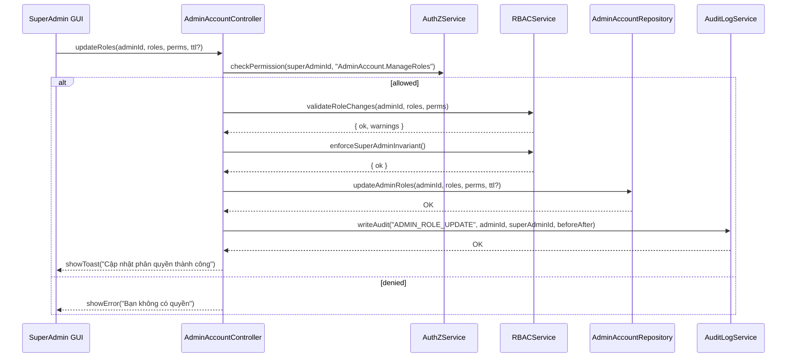

# Template Đặc Tả SEQUENCE DIAGRAM (SD)

## I. Thông Tin Tổng Quan (Header Information)

| Trường (Field) | Nội dung | Ghi chú/Ví dụ |
| :--- | :--- | :--- |
| **SD ID** | SD-UCA04-3 | Tương ứng UCA04-3 |
| **Related UC ID** | UCA04-3 | Phân quyền cho tài khoản Admin |
| **SD Name** | Luồng phân quyền cho tài khoản Admin |
| **Description** | Super Admin gán/thay đổi roles/permissions cho Admin, kiểm tra ràng buộc Super Admin cuối cùng, cập nhật CSDL và audit. |
| **Primary Actor** | Super Admin |
| **Phiên bản (Version)** | 0.1.0 |
| **Trạng thái (Status)** | Draft |
| **Tác giả (Author)** |  |
| **Ngày (Date)** |  |
| **Liên kết UC/BR/NFR** | `UC/UC-A4/UCA04-3_Phan_quyen_cho_tai_khoan_admin.md` |
| **Nguồn biểu đồ (Diagram Source)** | Mermaid |
| **Tài liệu liên quan (Related Artifacts)** | API Spec, DB `AdminAccount`, RBAC Store, `AuditLog` |

---

## II. Danh Sách Đối Tượng Tham Gia (Participants / Lifelines)

| ID | Tên Đối tượng | Stereotype | Ownership | Protocol | API Ver | Mô tả |
| :--- | :--- | :--- | :--- | :--- | :--- | :--- |
| L1 | SuperAdmin GUI | Boundary | Web Admin | HTTP | n/a | UI phân quyền |
| L2 | AdminAccountController | Control | Core | Internal | v1 | Điều phối |
| L3 | RBACService | Service | Core | Internal | v1 | Quản lý roles/permissions |
| L4 | AuthZService | Service | Core | Internal | v1 | Quyền `AdminAccount.ManageRoles` |
| L5 | AdminAccountRepository | Entity/DAO | Data | SQL | n/a | Cập nhật role mapping |
| L6 | AuditLogService | Service | Core | Internal | v1 | Audit thay đổi quyền |

---

## III. Biểu Đồ Sequence Diagram (Visual Model)

---

## IV. Đặc Tả Chi Tiết Luồng Tương Tác (Interaction Flow Specification)

### A. Luồng Thành công Chính (Basic Success Flow)

| STT | Hành động | Message | Sync/Async | Input | Output | Source | Target | Error/Timeout | Txn |
| :--- | :--- | :--- | :--- | :--- | :--- | :--- | :--- | :--- | :--- |
| 1 | Submit phân quyền | `updateRoles(...)` | Sync | `{ adminId, roles[], perms[], ttl? }` | `200` | L1 | L2 | 401 | N/A |
| 2 | Kiểm tra quyền | `checkPermission(..., "AdminAccount.ManageRoles")` | Sync | `{ superAdminId }` | `{ allowed }` | L2 | L4 | 403 | N/A |
| 3 | Validate | `validateRoleChanges(...)` | Sync | `{ ... }` | `{ ok }` | L2 | L3 | 409 | Đang mở |
| 4 | Bảo toàn Super Admin | `enforceSuperAdminInvariant()` | Sync | `-` | `{ ok }` | L2 | L3 | 409 | Đang mở |
| 5 | Cập nhật DB | `updateAdminRoles(...)` | Sync | `{ ... }` | `OK` | L2 | L5 | 5xx | Ghi |
| 6 | Audit | `writeAudit(...)` | Sync | `{ ... }` | `OK` | L2 | L6 | 5xx | Ghi |
| 7 | Phản hồi UI | `showToast(...)` | Sync | `{ message }` | UI updated | L2 | L1 | - | Kết thúc |

### B. Alternative/Exception Flows

| ID | Type | Guard | Affect | Error | Recovery | UI Message | Telemetry |
| :--- | :--- | :--- | :--- | :--- | :--- | :--- | :--- |
| EF-1 | [alt] | Thiếu quyền | Thay thế 3-7 | PERMISSION_DENIED | Dừng | "Bạn không có quyền" | log: warn |
| EF-2 | [alt] | Xung đột vai trò | Thay thế 5-7 | ROLE_CONFLICT | Điều chỉnh | "Vai trò mâu thuẫn" | log: warn |
| EF-3 | [alt] | Hạ quyền Super Admin cuối | Thay thế 5-7 | SUPERADMIN_LAST | Chặn | "Không thể hạ quyền Super Admin cuối" | log: error |

---

## V. Ghi Chú & Ràng Buộc

| Trường | Chi tiết |
| :--- | :--- |
| Security | RBAC/ABAC; audit đầy đủ |
| Reliability | Áp quyền hiệu lực ngay |

---

## VI. Tác Động Dữ Liệu

| Bảng | Hành động | Trường |
| :--- | :--- | :--- |
| `AdminAccountRoles` | UPSERT | mapping roles/perms |
| `AuditLog` | INSERT | role update event |

---

## VII. Giả Định & Câu Hỏi Mở

- Giả định: Có template role và TTL cho quyền tạm thời.
- Câu hỏi mở: Cần xem trước effective permissions trước khi lưu?

---

## VIII. Nguồn Biểu Đồ

- Mermaid embedded ở mục III.

