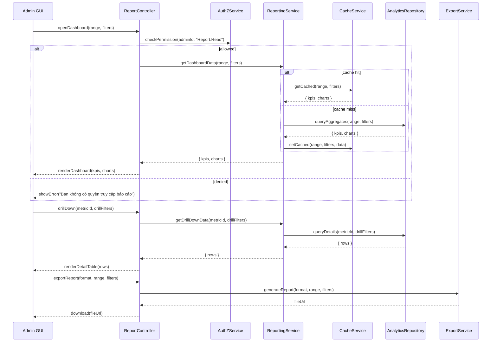

# Template Đặc Tả SEQUENCE DIAGRAM (SD)

## I. Thông Tin Tổng Quan (Header Information)

| Trường (Field) | Nội dung | Ghi chú/Ví dụ |
| :--- | :--- | :--- |
| **SD ID** | SD-UCA05-1 | Tương ứng UCA05-1 |
| **Related UC ID** | UCA05-1 | Xem báo cáo, thống kê |
| **SD Name** | Luồng xem báo cáo thống kê |
| **Description** | Admin mở dashboard; hệ thống kiểm tra quyền, truy vấn dữ liệu tổng hợp (agg) theo bộ lọc thời gian, hiển thị KPI/biểu đồ; hỗ trợ drill-down và export. |
| **Primary Actor** | Admin |
| **Phiên bản (Version)** | 0.1.0 |
| **Trạng thái (Status)** | Draft |
| **Tác giả (Author)** |  |
| **Ngày (Date)** |  |
| **Liên kết UC/BR/NFR** | `UC/UC-A5/UCA05-1_Xem_bao_cao_thong_ke.md` |
| **Nguồn biểu đồ (Diagram Source)** | Mermaid |
| **Tài liệu liên quan (Related Artifacts)** | API Spec, Analytics DB/Warehouse, Cache, Report Exporter |

---

## II. Danh Sách Đối Tượng Tham Gia (Participants / Lifelines)

| ID | Tên Đối tượng | Stereotype | Ownership | Protocol | API Ver | Mô tả |
| :--- | :--- | :--- | :--- | :--- | :--- | :--- |
| L1 | Admin GUI | Boundary | Web Admin | HTTP | n/a | Dashboard & Thống kê |
| L2 | ReportController | Control | Core | Internal | v1 | Điều phối yêu cầu báo cáo |
| L3 | AuthZService | Service | Core | Internal | v1 | Quyền `Report.Read` |
| L4 | ReportingService | Service | Analytics | Internal | v1 | Nghiệp vụ tổng hợp, drill-down |
| L5 | CacheService | Service | Core | Internal | v1 | Cache kết quả KPI/biểu đồ |
| L6 | AnalyticsRepository | Entity/DAO | Data | SQL/OLAP | n/a | Truy vấn bảng tổng hợp |
| L7 | ExportService | Service | Core | Internal | v1 | Xuất PDF/CSV |

---

## III. Biểu Đồ Sequence Diagram (Visual Model)

---

## IV. Đặc Tả Chi Tiết Luồng Tương Tác (Interaction Flow Specification)

### A. Luồng Thành công Chính (Basic Success Flow)

| STT | Hành động | Message | Sync/Async | Input | Output | Source | Target | Error/Timeout | Txn |
| :--- | :--- | :--- | :--- | :--- | :--- | :--- | :--- | :--- | :--- |
| 1 | Mở dashboard | `openDashboard(range, filters)` | Sync | `{ range, filters }` | `200` | L1 | L2 | 401 | N/A |
| 2 | Kiểm tra quyền | `checkPermission(..., "Report.Read")` | Sync | `{ adminId }` | `{ allowed }` | L2 | L3 | 403 | N/A |
| 3 | Lấy dữ liệu | `getDashboardData(...)` | Sync | `{ range, filters }` | `{ kpis, charts }` | L2 | L4 | 5xx | Đọc |
| 4 | Cache | `getCached/setCached` | Sync | `{ key }` | `{ data }` | L4 | L5 | timeout | Đang mở |
| 5 | Truy vấn OLAP | `queryAggregates(...)` | Sync | `{ ... }` | `{ kpis, charts }` | L4 | L6 | 5xx | Đọc |
| 6 | Hiển thị | `renderDashboard(...)` | Sync | `{ data }` | UI updated | L2 | L1 | - | N/A |

### B. Drill-down & Export

| STT | Hành động | Message | Sync/Async | Input | Output | Source | Target | Error/Timeout | Txn |
| :--- | :--- | :--- | :--- | :--- | :--- | :--- | :--- | :--- | :--- |
| D1 | Drill-down | `getDrillDownData(...)` | Sync | `{ metricId, filters }` | `{ rows }` | L2 | L4 | 5xx | Đọc |
| D2 | Truy vấn chi tiết | `queryDetails(...)` | Sync | `{ metricId, filters }` | `{ rows }` | L4 | L6 | 5xx | Đọc |
| E1 | Export | `generateReport(format, ...)` | Async | `{ format, range, filters }` | `{ fileUrl }` | L2 | L7 | timeout | N/A |

### C. Luồng Thay thế / Ngoại lệ (Alternative / Exception Flows)

| ID | Type | Guard | Affect | Error | Recovery | UI Message | Telemetry |
| :--- | :--- | :--- | :--- | :--- | :--- | :--- | :--- |
| EF-1 | [alt] | Thiếu quyền | Thay thế 3-6 | PERMISSION_DENIED | Dừng | "Bạn không có quyền truy cập báo cáo" | log: warn |
| EF-2 | [alt] | Không có dữ liệu | Thay thế 6 | EMPTY | Gợi ý đổi phạm vi | "Không có dữ liệu" | log: info |
| EF-3 | [alt] | Lỗi OLAP/Service | Thay thế 6 | UPSTREAM_ERROR | Fallback cache | "Không thể tải dữ liệu" | log: error |

---

## V. Ghi Chú & Ràng Buộc

| Trường | Chi tiết |
| :--- | :--- |
| Performance | p95 < 3s với dữ liệu tổng hợp; cache 5-15 phút |
| Reliability | Fallback cache khi analytics lỗi; circuit breaker |
| Security | Phân quyền theo vai trò; audit truy cập |

---

## VI. Tác Động Dữ Liệu (Data Impact)

| Bảng/Kho | Hành động | Trường | Ràng buộc |
| :--- | :--- | :--- | :--- |
| Warehouse/OLAP | READ | aggregates | Consistency với nguồn chính |
| Cache | UPSERT | dashboard data | TTL 5-15 phút |
| ExportStore | INSERT | report artifact | Liên kết bộ lọc/timestamp |

---

## VII. Giả Định & Câu Hỏi Mở

- Giả định: Có pipeline ETL định kỳ; một số KPI realtime.
- Câu hỏi mở: Phạm vi lưu preset bộ lọc theo user hay toàn cục?

---

## VIII. Nguồn Biểu Đồ

- Mermaid embedded ở mục III.

