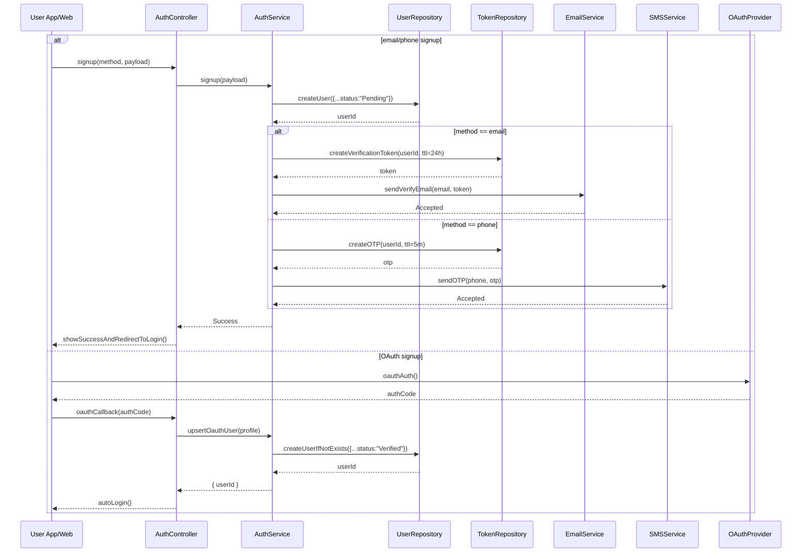

# Template Đặc Tả SEQUENCE DIAGRAM (SD)

## I. Thông Tin Tổng Quan (Header Information)

| Trường (Field) | Nội dung | Ghi chú/Ví dụ |
| :--- | :--- | :--- |
| **SD ID** | SD-UCS01-1 | Tương ứng UCS01-1 |
| **Related UC ID** | UCS01-1 | Đăng ký tài khoản |
| **SD Name** | Luồng đăng ký tài khoản |
| **Description** | Người dùng đăng ký bằng email/SĐT hoặc OAuth; hệ thống validate, tạo tài khoản (Pending), gửi email/OTP xác thực. |
| **Primary Actor** | User |
| **Phiên bản (Version)** | 0.1.0 |
| **Trạng thái (Status)** | Draft |
| **Tác giả (Author)** |  |
| **Ngày (Date)** |  |
| **Liên kết UC/BR/NFR** | `UC/UC1/UCS01-1_Dang_ky_tai_khoan.md` |
| **Nguồn biểu đồ (Diagram Source)** | Mermaid |
| **Tài liệu liên quan (Related Artifacts)** | API Spec, DB `User`, `VerificationToken`, Email/SMS Service |

---

## II. Danh Sách Đối Tượng Tham Gia (Participants / Lifelines)

| ID | Tên Đối tượng | Stereotype | Ownership | Protocol | API Ver | Mô tả |
| :--- | :--- | :--- | :--- | :--- | :--- | :--- |
| L1 | User App/Web | Boundary | Client | HTTP | n/a | UI đăng ký |
| L2 | AuthController | Control | Core | Internal | v1 | Điều phối đăng ký |
| L3 | AuthService | Service | Core | Internal | v1 | Nghiệp vụ đăng ký/verify |
| L4 | UserRepository | Entity/DAO | Data | SQL | n/a | Lưu tài khoản |
| L5 | TokenRepository | Entity/DAO | Data | SQL | n/a | Lưu token verify/OTP |
| L6 | EmailService | Service | Core | External | v1 | Gửi email verify |
| L7 | SMSService | Service | Core | External | v1 | Gửi OTP SMS |
| L8 | OAuthProvider | External Service | Third-party | OAuth | v2 | Google/Facebook |

---

## III. Biểu Đồ Sequence Diagram (Visual Model)

---

## IV. Đặc Tả Chi Tiết Luồng Tương Tác (Interaction Flow Specification)

### A. Luồng Thành công Chính (Basic Success Flow)

| STT | Hành động | Message | Sync/Async | Input | Output | Source | Target | Error/Timeout | Txn |
| :--- | :--- | :--- | :--- | :--- | :--- | :--- | :--- | :--- | :--- |
| 1 | Gửi form đăng ký | `signup(method, payload)` | Sync | `{ email/phone, password, name }` | `200` | L1 | L2 | 4xx | N/A |
| 2 | Tạo user | `createUser(...)` | Sync | `{ ... }` | `{ userId }` | L3 | L4 | 409/5xx | Ghi |
| 3 | Tạo token/OTP | `createVerificationToken/createOTP` | Sync | `{ userId }` | `{ token/otp }` | L3 | L5 | 5xx | Ghi |
| 4 | Gửi verify | `sendVerifyEmail/sendOTP` | Async | `{ email/phone, token }` | `Accepted` | L3 | L6/L7 | timeout | N/A |
| 5 | Phản hồi UI | `showSuccessAndRedirectToLogin()` | Sync | `-` | UI updated | L2 | L1 | - | Kết thúc |

### B. Alternative/Exception Flows

| ID | Type | Guard | Affect | Error | Recovery | UI Message | Telemetry |
| :--- | :--- | :--- | :--- | :--- | :--- | :--- | :--- |
| AF-1 | [alt] | OAuth signup | Thay thế 2-5 | - | Auto-verify | Auto login | log: info |
| EF-1 | [alt] | Email/SĐT tồn tại | Thay thế 2-5 | DUPLICATE | Chỉnh thông tin | Thông báo trùng | log: warn |
| EF-2 | [alt] | Mật khẩu yếu | Thay thế 2-5 | WEAK_PASSWORD | Sửa mật khẩu | Nhắc yêu cầu | log: warn |
| EF-3 | [alt] | Lỗi gửi email/SMS | Thay thế 5 | SEND_ERROR | Cho gửi lại | Thông báo gửi lỗi | log: error |

---

## V. Ghi Chú & Ràng Buộc

| Trường | Chi tiết |
| :--- | :--- |
| Security | Bcrypt mật khẩu; token/OTP TTL; HTTPS |
| Reliability | Cho phép resend verify; idempotent signup với email/phone |

---

## VI. Tác Động Dữ Liệu

| Bảng | Hành động | Trường |
| :--- | :--- | :--- |
| `User` | INSERT | profile, passwordHash, status |
| `VerificationToken` | INSERT | token, userId, expiresAt |

---

## VII. Giả Định & Câu Hỏi Mở

- Giả định: OTP có rate-limit gửi lại.
- Câu hỏi mở: Hỗ trợ thêm Apple ID?

---

## VIII. Nguồn Biểu Đồ

- Mermaid embedded ở mục III.

