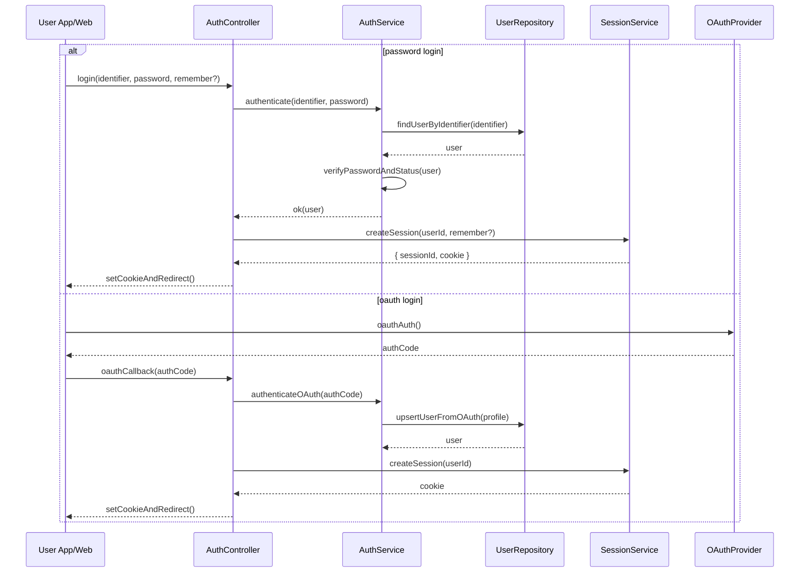

# Template Đặc Tả SEQUENCE DIAGRAM (SD)

## I. Thông Tin Tổng Quan (Header Information)

| Trường (Field) | Nội dung | Ghi chú/Ví dụ |
| :--- | :--- | :--- |
| **SD ID** | SD-UCS01-2 | Tương ứng UCS01-2 |
| **Related UC ID** | UCS01-2 | Đăng nhập vào hệ thống |
| **SD Name** | Luồng đăng nhập |
| **Description** | Người dùng đăng nhập bằng email/SĐT + mật khẩu hoặc OAuth; hệ thống xác thực, kiểm tra trạng thái, tạo session/cookie và chuyển hướng. |
| **Primary Actor** | User |
| **Phiên bản (Version)** | 0.1.0 |
| **Trạng thái (Status)** | Draft |
| **Tác giả (Author)** |  |
| **Ngày (Date)** |  |
| **Liên kết UC/BR/NFR** | `UC/UC1/UCS01-2_Dang_nhap_he_thong.md` |
| **Nguồn biểu đồ (Diagram Source)** | Mermaid |
| **Tài liệu liên quan (Related Artifacts)** | API Spec, DB `User`, `Session` |

---

## II. Danh Sách Đối Tượng Tham Gia (Participants / Lifelines)

| ID | Tên Đối tượng | Stereotype | Ownership | Protocol | API Ver | Mô tả |
| :--- | :--- | :--- | :--- | :--- | :--- | :--- |
| L1 | User App/Web | Boundary | Client | HTTP | n/a | UI đăng nhập |
| L2 | AuthController | Control | Core | Internal | v1 | Điều phối đăng nhập |
| L3 | AuthService | Service | Core | Internal | v1 | Xác thực/kiểm tra trạng thái |
| L4 | UserRepository | Entity/DAO | Data | SQL | n/a | Đọc user |
| L5 | SessionService | Service | Core | Internal | v1 | Tạo/quản lý session |
| L6 | OAuthProvider | External | Third-party | OAuth | v2 | Google/Facebook |

---

## III. Biểu Đồ Sequence Diagram (Visual Model)

---

## IV. Đặc Tả Chi Tiết Luồng Tương Tác (Interaction Flow Specification)

### A. Luồng Thành công Chính (Basic Success Flow)

| STT | Hành động | Message | Sync/Async | Input | Output | Source | Target | Error/Timeout | Txn |
| :--- | :--- | :--- | :--- | :--- | :--- | :--- | :--- | :--- | :--- |
| 1 | Gửi form | `login(...)` | Sync | `{ id, password, remember? }` | `200` | L1 | L2 | 4xx | N/A |
| 2 | Tìm user | `findUserByIdentifier(...)` | Sync | `{ id }` | `{ user }` | L3 | L4 | 404/5xx | Đọc |
| 3 | Kiểm tra | `verifyPasswordAndStatus` | Sync | `{ user }` | `ok` | L3 | L3 | 4xx | - |
| 4 | Tạo session | `createSession(...)` | Sync | `{ userId, remember? }` | `{ cookie }` | L2 | L5 | 5xx | Ghi |
| 5 | Chuyển hướng | `setCookieAndRedirect()` | Sync | `-` | UI updated | L2 | L1 | - | N/A |

### B. Alternative/Exception Flows

| ID | Type | Guard | Affect | Error | Recovery | UI Message | Telemetry |
| :--- | :--- | :--- | :--- | :--- | :--- | :--- | :--- |
| EF-1 | [alt] | Sai thông tin | Thay thế 4-5 | INVALID_CREDENTIALS | Nhập lại | "Sai thông tin đăng nhập" | log: warn |
| EF-2 | [alt] | Chưa xác thực | Thay thế 4-5 | UNVERIFIED | Gợi ý verify | "Tài khoản chưa xác thực" | log: info |
| EF-3 | [alt] | Tài khoản khóa | Thay thế 4-5 | LOCKED | Hỗ trợ | "Tài khoản bị khóa" | log: warn |
| AF-1 | [alt] | OAuth | Thay thế 1-5 | - | Auto upsert | Auto redirect | log: info |

---

## V. Ghi Chú & Ràng Buộc

| Trường | Chi tiết |
| :--- | :--- |
| Security | HTTPS, bcrypt verify, secure httpOnly cookies |
| Reliability | Single active session per account |

---

## VI. Tác Động Dữ Liệu

| Bảng | Hành động | Trường |
| :--- | :--- | :--- |
| `User` | UPDATE | lastLoginAt |
| `Session` | INSERT | userId, expiresAt, remember |

---

## VII. Giả Định & Câu Hỏi Mở

- Giả định: Rate-limit login attempts.
- Câu hỏi mở: Có bật MFA?

---

## VIII. Nguồn Biểu Đồ

- Mermaid embedded ở mục III.

