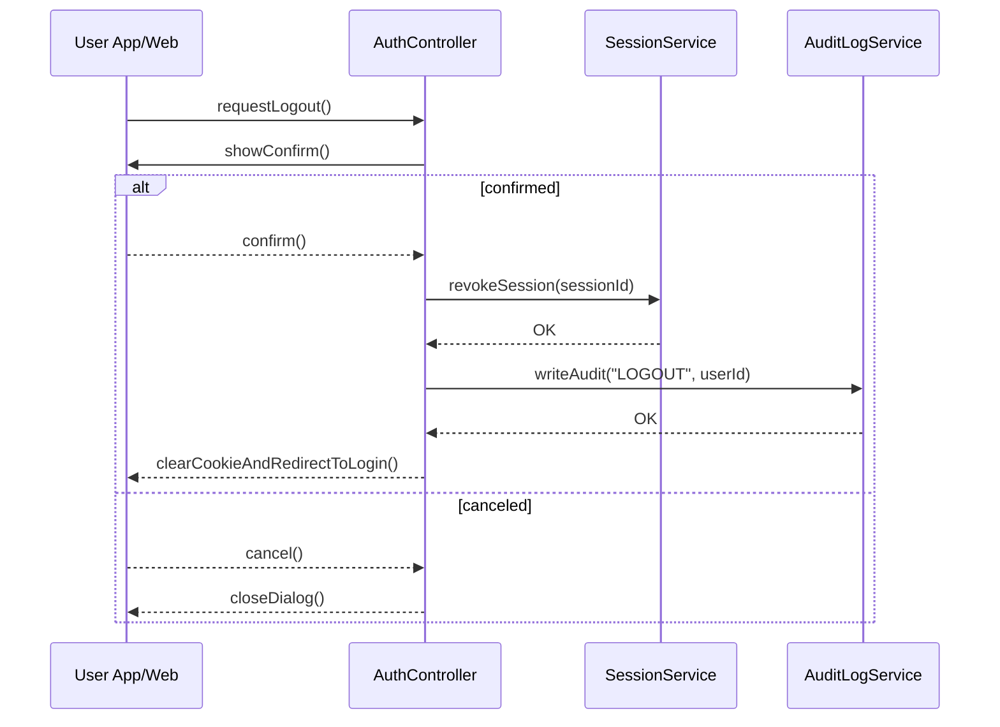

# Template Đặc Tả SEQUENCE DIAGRAM (SD)

## I. Thông Tin Tổng Quan (Header Information)

| Trường (Field) | Nội dung | Ghi chú/Ví dụ |
| :--- | :--- | :--- |
| **SD ID** | SD-UCS01-3 | Tương ứng UCS01-3 |
| **Related UC ID** | UCS01-3 | Đăng xuất khỏi hệ thống |
| **SD Name** | Luồng đăng xuất |
| **Description** | Người dùng đăng xuất; hệ thống xác nhận, hủy session, xóa cookie, ghi log và chuyển hướng. |
| **Primary Actor** | User |
| **Phiên bản (Version)** | 0.1.0 |
| **Trạng thái (Status)** | Draft |
| **Tác giả (Author)** |  |
| **Ngày (Date)** |  |
| **Liên kết UC/BR/NFR** | `UC/UC1/UCS01-3_Dang_xuat_he_thong.md` |
| **Nguồn biểu đồ (Diagram Source)** | Mermaid |
| **Tài liệu liên quan (Related Artifacts)** | API Spec, DB `Session`, Audit |

---

## II. Danh Sách Đối Tượng Tham Gia (Participants / Lifelines)

| ID | Tên Đối tượng | Stereotype | Ownership | Protocol | API Ver | Mô tả |
| :--- | :--- | :--- | :--- | :--- | :--- | :--- |
| L1 | User App/Web | Boundary | Client | HTTP | n/a | UI đăng xuất |
| L2 | AuthController | Control | Core | Internal | v1 | Điều phối |
| L3 | SessionService | Service | Core | Internal | v1 | Hủy session |
| L4 | AuditLogService | Service | Core | Internal | v1 | Ghi log |

---

## III. Biểu Đồ Sequence Diagram (Visual Model)

---

## IV. Đặc Tả Chi Tiết Luồng Tương Tác (Interaction Flow Specification)

### A. Luồng Thành công Chính (Basic Success Flow)

| STT | Hành động | Message | Sync/Async | Input | Output | Source | Target | Error/Timeout | Txn |
| :--- | :--- | :--- | :--- | :--- | :--- | :--- | :--- | :--- | :--- |
| 1 | Yêu cầu đăng xuất | `requestLogout()` | Sync | `-` | `200` | L1 | L2 | - | N/A |
| 2 | Xác nhận | `showConfirm()` | Sync | `-` | `confirm` | L2 | L1 | - | N/A |
| 3 | Hủy session | `revokeSession(sessionId)` | Sync | `{ sessionId }` | `OK` | L2 | L3 | 5xx | Ghi |
| 4 | Audit | `writeAudit("LOGOUT", ...)` | Sync | `{ userId }` | `OK` | L2 | L4 | 5xx | Ghi |
| 5 | Xóa cookie & điều hướng | `clearCookieAndRedirectToLogin()` | Sync | `-` | UI updated | L2 | L1 | - | Kết thúc |

### B. Alternative/Exception Flows

| ID | Type | Guard | Affect | Error | Recovery | UI Message | Telemetry |
| :--- | :--- | :--- | :--- | :--- | :--- | :--- | :--- |
| AF-1 | [opt] | Người dùng hủy | Thay thế 3-5 | - | Đóng hộp thoại | "Đã hủy" | log: info |
| EF-1 | [alt] | Lỗi hủy session | Thay thế 4-5 | SESSION_ERROR | Thử lại | "Đăng xuất lỗi, thử lại" | log: error |

---

## V. Ghi Chú & Ràng Buộc

| Trường | Chi tiết |
| :--- | :--- |
| Security | Xóa hoàn toàn session và cookie |
| Reliability | Logout tất cả tab đồng bộ |

---

## VI. Tác Động Dữ Liệu

| Bảng | Hành động | Trường |
| :--- | :--- | :--- |
| `Session` | DELETE | by sessionId |
| `AuditLog` | INSERT | logout event |

---

## VII. Giả Định & Câu Hỏi Mở

- Giả định: Có cơ chế broadcast logout đa tab.
- Câu hỏi mở: Có hỗ trợ logout tất cả thiết bị?

---

## VIII. Nguồn Biểu Đồ

- Mermaid embedded ở mục III.

