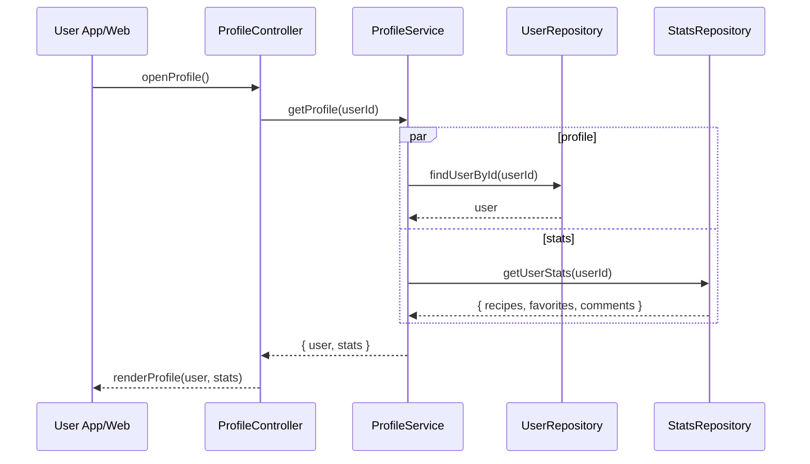

# Template Đặc Tả SEQUENCE DIAGRAM (SD)

## I. Thông Tin Tổng Quan (Header Information)

| Trường (Field) | Nội dung | Ghi chú/Ví dụ |
| :--- | :--- | :--- |
| **SD ID** | SD-UCS01-4 | Tương ứng UCS01-4 |
| **Related UC ID** | UCS01-4 | Xem thông tin cá nhân |
| **SD Name** | Luồng xem thông tin cá nhân |
| **Description** | Người dùng xem trang profile; hệ thống kiểm tra session, truy vấn thông tin cá nhân và thống kê cơ bản. |
| **Primary Actor** | User |
| **Phiên bản (Version)** | 0.1.0 |
| **Trạng thái (Status)** | Draft |
| **Tác giả (Author)** |  |
| **Ngày (Date)** |  |
| **Liên kết UC/BR/NFR** | `UC/UC1/UCS01-4_Xem_thong_tin_ca_nhan.md` |
| **Nguồn biểu đồ (Diagram Source)** | Mermaid |
| **Tài liệu liên quan (Related Artifacts)** | API Spec, DB `User`, `Recipe`, `Favorite`, `Comment` |

---

## II. Danh Sách Đối Tượng Tham Gia (Participants / Lifelines)

| ID | Tên Đối tượng | Stereotype | Ownership | Protocol | API Ver | Mô tả |
| :--- | :--- | :--- | :--- | :--- | :--- | :--- |
| L1 | User App/Web | Boundary | Client | HTTP | n/a | UI profile |
| L2 | ProfileController | Control | Core | Internal | v1 | Điều phối |
| L3 | ProfileService | Service | Core | Internal | v1 | Tổng hợp dữ liệu profile |
| L4 | UserRepository | Entity/DAO | Data | SQL | n/a | Đọc thông tin user |
| L5 | StatsRepository | Entity/DAO | Data | SQL | n/a | Thống kê hoạt động |

---

## III. Biểu Đồ Sequence Diagram (Visual Model)

---

## IV. Đặc Tả Chi Tiết Luồng Tương Tác (Interaction Flow Specification)

### A. Luồng Thành công Chính (Basic Success Flow)

| STT | Hành động | Message | Sync/Async | Input | Output | Source | Target | Error/Timeout | Txn |
| :--- | :--- | :--- | :--- | :--- | :--- | :--- | :--- | :--- | :--- |
| 1 | Mở profile | `openProfile()` | Sync | `-` | `200` | L1 | L2 | 401 | N/A |
| 2 | Lấy profile | `getProfile(userId)` | Sync | `{ userId }` | `{ user, stats }` | L2 | L3 | 5xx | Đọc |
| 3 | Đọc user | `findUserById(userId)` | Sync | `{ userId }` | `{ user }` | L3 | L4 | 404/5xx | Đọc |
| 4 | Đọc stats | `getUserStats(userId)` | Sync | `{ userId }` | `{ counts }` | L3 | L5 | 5xx | Đọc |
| 5 | Render UI | `renderProfile(...)` | Sync | `{ user, stats }` | UI updated | L2 | L1 | - | N/A |

### B. Alternative/Exception Flows

| ID | Type | Guard | Affect | Error | Recovery | UI Message | Telemetry |
| :--- | :--- | :--- | :--- | :--- | :--- | :--- | :--- |
| EF-1 | [alt] | Không tìm thấy user | Thay thế 5 | NOT_FOUND | Thử lại | "Không thể tải thông tin" | log: warn |
| EF-2 | [alt] | Session hết hạn | Thay thế 2-5 | UNAUTHORIZED | Login lại | "Phiên hết hạn" | log: info |

---

## V. Ghi Chú & Ràng Buộc

| Trường | Chi tiết |
| :--- | :--- |
| Security | Chỉ chủ tài khoản xem được |
| Usability | Avatar fallback khi lỗi ảnh |

---

## VI. Tác Động Dữ Liệu

| Bảng | Hành động | Trường |
| :--- | :--- | :--- |
| `User` | READ | profile |
| `Recipe/Favorite/Comment` | READ | counts |

---

## VII. Giả Định & Câu Hỏi Mở

- Giả định: Stats cập nhật realtime.
- Câu hỏi mở: Có breadcrumb từ trang nào?

---

## VIII. Nguồn Biểu Đồ

- Mermaid embedded ở mục III.

