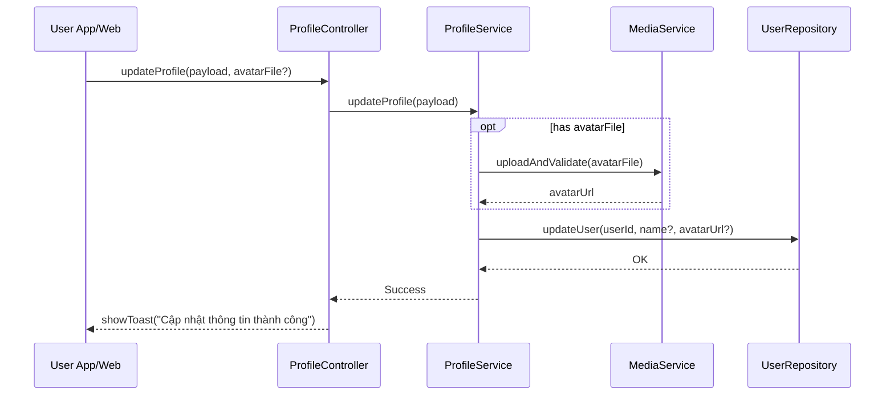

# Template Đặc Tả SEQUENCE DIAGRAM (SD)

## I. Thông Tin Tổng Quan (Header Information)

| Trường (Field) | Nội dung | Ghi chú/Ví dụ |
| :--- | :--- | :--- |
| **SD ID** | SD-UCS01-5 | Tương ứng UCS01-5 |
| **Related UC ID** | UCS01-5 | Cập nhật thông tin cá nhân |
| **SD Name** | Luồng cập nhật thông tin cá nhân |
| **Description** | Người dùng sửa tên/ảnh; hệ thống validate, upload ảnh (nếu có), cập nhật DB, hiển thị thành công. |
| **Primary Actor** | User |
| **Phiên bản (Version)** | 0.1.0 |
| **Trạng thái (Status)** | Draft |
| **Tác giả (Author)** |  |
| **Ngày (Date)** |  |
| **Liên kết UC/BR/NFR** | `UC/UC1/UCS01-5_Cap_nhat_thong_tin_ca_nhan.md` |
| **Nguồn biểu đồ (Diagram Source)** | Mermaid |
| **Tài liệu liên quan (Related Artifacts)** | API Spec, DB `User`, Media Service |

---

## II. Danh Sách Đối Tượng Tham Gia (Participants / Lifelines)

| ID | Tên Đối tượng | Stereotype | Ownership | Protocol | API Ver | Mô tả |
| :--- | :--- | :--- | :--- | :--- | :--- | :--- |
| L1 | User App/Web | Boundary | Client | HTTP | n/a | UI chỉnh sửa |
| L2 | ProfileController | Control | Core | Internal | v1 | Điều phối |
| L3 | ProfileService | Service | Core | Internal | v1 | Nghiệp vụ cập nhật |
| L4 | MediaService | Service | Core | Internal | v1 | Upload/validate ảnh |
| L5 | UserRepository | Entity/DAO | Data | SQL | n/a | Cập nhật user |

---

## III. Biểu Đồ Sequence Diagram (Visual Model)

---

## IV. Đặc Tả Chi Tiết Luồng Tương Tác (Interaction Flow Specification)

### A. Luồng Thành công Chính (Basic Success Flow)

| STT | Hành động | Message | Sync/Async | Input | Output | Source | Target | Error/Timeout | Txn |
| :--- | :--- | :--- | :--- | :--- | :--- | :--- | :--- | :--- | :--- |
| 1 | Submit cập nhật | `updateProfile(...)` | Sync | `{ name?, avatarFile? }` | `200` | L1 | L2 | 401 | N/A |
| 2 | Upload ảnh | `uploadAndValidate(...)` | Sync | `{ file }` | `{ url }` | L3 | L4 | timeout | Đang mở |
| 3 | Cập nhật DB | `updateUser(...)` | Sync | `{ fields }` | `OK` | L3 | L5 | 5xx | Ghi |
| 4 | Phản hồi UI | `showToast(...)` | Sync | `{ message }` | UI updated | L2 | L1 | - | Kết thúc |

### B. Alternative/Exception Flows

| ID | Type | Guard | Affect | Error | Recovery | UI Message | Telemetry |
| :--- | :--- | :--- | :--- | :--- | :--- | :--- | :--- |
| AF-1 | [opt] | Chỉ đổi tên/ảnh | Thay thế 2-3 | - | Bỏ bước không cần | - | log: info |
| EF-1 | [alt] | Tên không hợp lệ | Thay thế 3-4 | VALIDATION_ERROR | Sửa tên | "Tên hiển thị không hợp lệ" | log: warn |
| EF-2 | [alt] | Ảnh không hợp lệ | Thay thế 3-4 | MEDIA_INVALID | Chọn lại | "Ảnh không hợp lệ" | log: warn |
| EF-3 | [alt] | Lỗi upload | Thay thế 3-4 | UPLOAD_ERROR | Thử lại | "Upload ảnh thất bại" | log: error |
| EF-4 | [alt] | Lỗi DB | Thay thế 4 | DB_ERROR | Retry | "Không thể cập nhật" | log: error |

---

## V. Ghi Chú & Ràng Buộc

| Trường | Chi tiết |
| :--- | :--- |
| Business Rules | Tên ≥ 2 ký tự, không ký tự đặc biệt |
| Security | Quét virus ảnh, giới hạn 5MB, định dạng JPG/PNG |

---

## VI. Tác Động Dữ Liệu

| Bảng | Hành động | Trường |
| :--- | :--- | :--- |
| `User` | UPDATE | `displayName`, `avatarUrl`, `updatedAt` |

---

## VII. Giả Định & Câu Hỏi Mở

- Giả định: Tự động resize avatar 150x150.
- Câu hỏi mở: Có cho phép thay đổi email/số điện thoại tại đây?

---

## VIII. Nguồn Biểu Đồ

- Mermaid embedded ở mục III.

