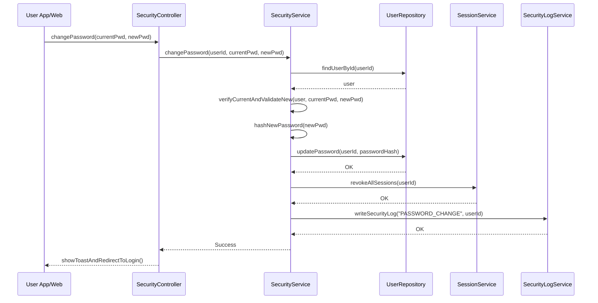

# Template Đặc Tả SEQUENCE DIAGRAM (SD)

## I. Thông Tin Tổng Quan (Header Information)

| Trường (Field) | Nội dung | Ghi chú/Ví dụ |
| :--- | :--- | :--- |
| **SD ID** | SD-UCS01-6 | Tương ứng UCS01-6 |
| **Related UC ID** | UCS01-6 | Đổi mật khẩu |
| **SD Name** | Luồng đổi mật khẩu |
| **Description** | Người dùng đổi mật khẩu: nhập mật khẩu cũ/mới, hệ thống xác thực, validate, hash và cập nhật; hủy toàn bộ session. |
| **Primary Actor** | User |
| **Phiên bản (Version)** | 0.1.0 |
| **Trạng thái (Status)** | Draft |
| **Tác giả (Author)** |  |
| **Ngày (Date)** |  |
| **Liên kết UC/BR/NFR** | `UC/UC1/UCS01-6_Doi_mat_khau.md` |
| **Nguồn biểu đồ (Diagram Source)** | Mermaid |
| **Tài liệu liên quan (Related Artifacts)** | API Spec, DB `User`, `Session`, Security Log |

---

## II. Danh Sách Đối Tượng Tham Gia (Participants / Lifelines)

| ID | Tên Đối tượng | Stereotype | Ownership | Protocol | API Ver | Mô tả |
| :--- | :--- | :--- | :--- | :--- | :--- | :--- |
| L1 | User App/Web | Boundary | Client | HTTP | n/a | UI đổi mật khẩu |
| L2 | SecurityController | Control | Core | Internal | v1 | Điều phối |
| L3 | SecurityService | Service | Core | Internal | v1 | Xác thực và cập nhật mật khẩu |
| L4 | UserRepository | Entity/DAO | Data | SQL | n/a | Đọc/cập nhật user |
| L5 | SessionService | Service | Core | Internal | v1 | Thu hồi session |
| L6 | SecurityLogService | Service | Core | Internal | v1 | Ghi log bảo mật |

---

## III. Biểu Đồ Sequence Diagram (Visual Model)

---

## IV. Đặc Tả Chi Tiết Luồng Tương Tác (Interaction Flow Specification)

### A. Luồng Thành công Chính (Basic Success Flow)

| STT | Hành động | Message | Sync/Async | Input | Output | Source | Target | Error/Timeout | Txn |
| :--- | :--- | :--- | :--- | :--- | :--- | :--- | :--- | :--- | :--- |
| 1 | Submit | `changePassword(...)` | Sync | `{ currentPwd, newPwd }` | `200` | L1 | L2 | 401 | N/A |
| 2 | Đọc user | `findUserById(...)` | Sync | `{ userId }` | `{ user }` | L3 | L4 | 404/5xx | Đọc |
| 3 | Xác thực/validate | `verifyCurrentAndValidateNew(...)` | Sync | `{ ... }` | `ok` | L3 | L3 | 4xx | - |
| 4 | Cập nhật DB | `updatePassword(...)` | Sync | `{ userId, hash }` | `OK` | L3 | L4 | 5xx | Ghi |
| 5 | Thu hồi session | `revokeAllSessions(...)` | Sync | `{ userId }` | `OK` | L3 | L5 | 5xx | Ghi |
| 6 | Log bảo mật | `writeSecurityLog(...)` | Sync | `{ ... }` | `OK` | L3 | L6 | 5xx | Ghi |
| 7 | Phản hồi UI | `showToastAndRedirectToLogin()` | Sync | `-` | UI updated | L2 | L1 | - | Kết thúc |

### B. Alternative/Exception Flows

| ID | Type | Guard | Affect | Error | Recovery | UI Message | Telemetry |
| :--- | :--- | :--- | :--- | :--- | :--- | :--- | :--- |
| EF-1 | [alt] | Sai mật khẩu hiện tại | Thay thế 4-7 | INVALID_CURRENT | Nhập lại | "Mật khẩu hiện tại không đúng" | log: warn |
| EF-2 | [alt] | Mật khẩu mới yếu | Thay thế 4-7 | WEAK_PASSWORD | Sửa mật khẩu | "Mật khẩu không đủ mạnh" | log: warn |
| EF-3 | [alt] | Lỗi DB | Thay thế 5-7 | DB_ERROR | Retry | "Không thể cập nhật" | log: error |

---

## V. Ghi Chú & Ràng Buộc

| Trường | Chi tiết |
| :--- | :--- |
| Security | Bcrypt + salt; revoke all sessions; HTTPS |
| Reliability | Ghi log bảo mật bắt buộc |

---

## VI. Tác Động Dữ Liệu

| Bảng | Hành động | Trường |
| :--- | :--- | :--- |
| `User` | UPDATE | passwordHash, passwordChangedAt |
| `Session` | DELETE | by userId |
| `SecurityLog` | INSERT | password change |

---

## VII. Giả Định & Câu Hỏi Mở

- Giả định: Có rate-limit đổi mật khẩu.
- Câu hỏi mở: Có yêu cầu MFA khi đổi mật khẩu?

---

## VIII. Nguồn Biểu Đồ

- Mermaid embedded ở mục III.

