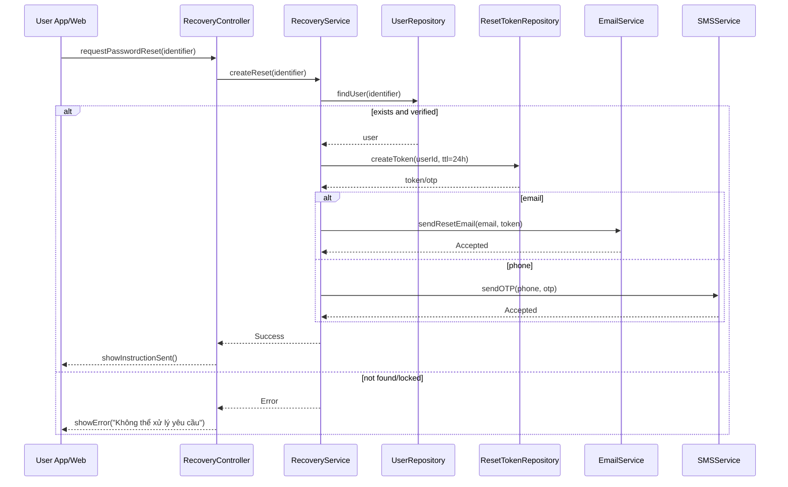

# Template Đặc Tả SEQUENCE DIAGRAM (SD)

## I. Thông Tin Tổng Quan (Header Information)

| Trường (Field) | Nội dung | Ghi chú/Ví dụ |
| :--- | :--- | :--- |
| **SD ID** | SD-UCS01-7 | Tương ứng UCS01-7 |
| **Related UC ID** | UCS01-7 | Yêu cầu đặt lại mật khẩu |
| **SD Name** | Luồng yêu cầu đặt lại mật khẩu |
| **Description** | Người dùng gửi yêu cầu reset; hệ thống tạo token/OTP 24h, lưu DB, gửi email/SMS, ghi log. |
| **Primary Actor** | User |
| **Phiên bản (Version)** | 0.1.0 |
| **Trạng thái (Status)** | Draft |
| **Tác giả (Author)** |  |
| **Ngày (Date)** |  |
| **Liên kết UC/BR/NFR** | `UC/UC1/UCS01-7_Dat_lai_mat_khau.md` |
| **Nguồn biểu đồ (Diagram Source)** | Mermaid |
| **Tài liệu liên quan (Related Artifacts)** | API Spec, DB `PasswordResetToken`, Email/SMS Service |

---

## II. Danh Sách Đối Tượng Tham Gia (Participants / Lifelines)

| ID | Tên Đối tượng | Stereotype | Ownership | Protocol | API Ver | Mô tả |
| :--- | :--- | :--- | :--- | :--- | :--- | :--- |
| L1 | User App/Web | Boundary | Client | HTTP | n/a | UI quên mật khẩu |
| L2 | RecoveryController | Control | Core | Internal | v1 | Điều phối |
| L3 | RecoveryService | Service | Core | Internal | v1 | Tạo token/OTP và gửi |
| L4 | UserRepository | Entity/DAO | Data | SQL | n/a | Tra cứu user |
| L5 | ResetTokenRepository | Entity/DAO | Data | SQL | n/a | Lưu token reset |
| L6 | EmailService | Service | Core | External | v1 | Gửi email |
| L7 | SMSService | Service | Core | External | v1 | Gửi SMS OTP |

---

## III. Biểu Đồ Sequence Diagram (Visual Model)

---

## IV. Đặc Tả Chi Tiết Luồng Tương Tác (Interaction Flow Specification)

### A. Luồng Thành công Chính (Basic Success Flow)

| STT | Hành động | Message | Sync/Async | Input | Output | Source | Target | Error/Timeout | Txn |
| :--- | :--- | :--- | :--- | :--- | :--- | :--- | :--- | :--- | :--- |
| 1 | Yêu cầu reset | `requestPasswordReset(identifier)` | Sync | `{ email/phone }` | `200` | L1 | L2 | 4xx | N/A |
| 2 | Tìm user | `findUser(identifier)` | Sync | `{ id }` | `{ user }` | L3 | L4 | 404 | Đọc |
| 3 | Tạo token | `createToken(userId)` | Sync | `{ userId }` | `{ token }` | L3 | L5 | 5xx | Ghi |
| 4 | Gửi hướng dẫn | `sendResetEmail/sendOTP` | Async | `{ email/phone, token }` | `Accepted` | L3 | L6/L7 | timeout | N/A |
| 5 | Phản hồi UI | `showInstructionSent()` | Sync | `-` | UI updated | L2 | L1 | - | Kết thúc |

### B. Alternative/Exception Flows

| ID | Type | Guard | Affect | Error | Recovery | UI Message | Telemetry |
| :--- | :--- | :--- | :--- | :--- | :--- | :--- | :--- |
| EF-1 | [alt] | Không tồn tại | Thay thế 3-5 | NOT_FOUND | Nhắc đăng ký | "Email/SĐT không tồn tại" | log: warn |
| EF-2 | [alt] | Tài khoản khóa | Thay thế 3-5 | LOCKED | Hỗ trợ | "Tài khoản bị khóa" | log: warn |
| EF-3 | [alt] | Quá nhiều yêu cầu | Thay thế 3-5 | RATE_LIMIT | Chờ | "Thử lại sau" | log: warn |
| EF-4 | [alt] | Lỗi gửi | Thay thế 5 | SEND_ERROR | Cho gửi lại | "Không thể gửi" | log: error |

---

## V. Ghi Chú & Ràng Buộc

| Trường | Chi tiết |
| :--- | :--- |
| Security | Token 24h, single-use, HTTPS |
| Reliability | Vô hiệu hóa token cũ khi gửi lại |

---

## VI. Tác Động Dữ Liệu

| Bảng | Hành động | Trường |
| :--- | :--- | :--- |
| `PasswordResetToken` | INSERT | token, userId, expiresAt, used |

---

## VII. Giả Định & Câu Hỏi Mở

- Giả định: SMS OTP 6 số, TTL 5 phút.
- Câu hỏi mở: Có CAPTCHA chống spam?

---

## VIII. Nguồn Biểu Đồ

- Mermaid embedded ở mục III.

