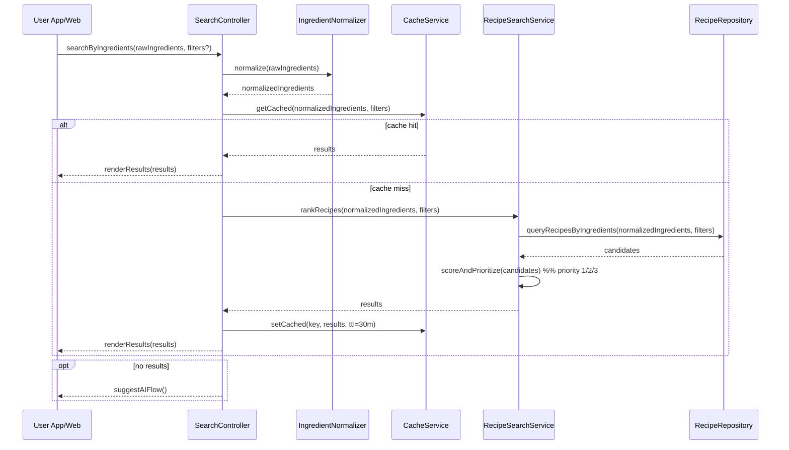

# Template Đặc Tả SEQUENCE DIAGRAM (SD)

## I. Thông Tin Tổng Quan (Header Information)

| Trường (Field) | Nội dung | Ghi chú/Ví dụ |
| :--- | :--- | :--- |
| **SD ID** | SD-UCS02-1 | Tương ứng UCS02-1 |
| **Related UC ID** | UCS02-1 | Tìm kiếm theo Nguyên liệu |
| **SD Name** | Luồng tìm kiếm theo nguyên liệu |
| **Description** | Người dùng nhập danh sách nguyên liệu; hệ thống chuẩn hóa, chạy thuật toán ưu tiên, sắp xếp và hiển thị kết quả; gợi ý AI nếu không có kết quả. |
| **Primary Actor** | User |
| **Phiên bản (Version)** | 0.1.0 |
| **Trạng thái (Status)** | Draft |
| **Tác giả (Author)** |  |
| **Ngày (Date)** |  |
| **Liên kết UC/BR/NFR** | `UC/UC2/UCS02-1_Tim_kiem_theo_nguyen_lieu.md` |
| **Nguồn biểu đồ (Diagram Source)** | Mermaid |
| **Tài liệu liên quan (Related Artifacts)** | API Spec, DB `Recipe`, `Ingredient`, Search/Ranking Service, Cache |

---

## II. Danh Sách Đối Tượng Tham Gia (Participants / Lifelines)

| ID | Tên Đối tượng | Stereotype | Ownership | Protocol | API Ver | Mô tả |
| :--- | :--- | :--- | :--- | :--- | :--- | :--- |
| L1 | User App/Web | Boundary | Client | HTTP | n/a | UI tìm kiếm |
| L2 | SearchController | Control | Core | Internal | v1 | Điều phối tìm kiếm |
| L3 | IngredientNormalizer | Service | Core | Internal | v1 | Chuẩn hóa danh sách nguyên liệu |
| L4 | RecipeSearchService | Service | Core | Internal | v1 | Thuật toán matching/ranking |
| L5 | CacheService | Service | Core | Internal | v1 | Cache kết quả tìm kiếm |
| L6 | RecipeRepository | Entity/DAO | Data | SQL | n/a | Truy vấn công thức |

---

## III. Biểu Đồ Sequence Diagram (Visual Model)

---

## IV. Đặc Tả Chi Tiết Luồng Tương Tác (Interaction Flow Specification)

### A. Luồng Thành công Chính (Basic Success Flow)

| STT | Hành động | Message | Sync/Async | Input | Output | Source | Target | Error/Timeout | Txn |
| :--- | :--- | :--- | :--- | :--- | :--- | :--- | :--- | :--- | :--- |
| 1 | Gửi tìm kiếm | `searchByIngredients(...)` | Sync | `{ ingredients[], filters? }` | `200` | L1 | L2 | 4xx | N/A |
| 2 | Chuẩn hóa | `normalize(...)` | Sync | `{ raw }` | `{ normalized }` | L2 | L3 | 4xx | - |
| 3 | Cache | `getCached/setCached` | Sync | `{ key }` | `{ results }` | L2 | L5 | timeout | Đang mở |
| 4 | Truy vấn | `queryRecipesByIngredients(...)` | Sync | `{ normalized, filters }` | `{ candidates }` | L4 | L6 | 5xx | Đọc |
| 5 | Xếp hạng | `scoreAndPrioritize(...)` | Sync | `{ candidates }` | `{ results }` | L4 | L4 | 5xx | - |
| 6 | Hiển thị | `renderResults(...)` | Sync | `{ results }` | UI updated | L2 | L1 | - | N/A |

### B. Alternative/Exception Flows

| ID | Type | Guard | Affect | Error | Recovery | UI Message | Telemetry |
| :--- | :--- | :--- | :--- | :--- | :--- | :--- | :--- |
| AF-1 | [opt] | Import từ Tủ lạnh ảo | Thay thế 1 | - | Prefill | Prefill form | log: info |
| EF-1 | [alt] | Không tìm thấy | Thay thế 6 | EMPTY | Gợi ý AI | "Không tìm thấy" | log: info |
| EF-2 | [alt] | Nguyên liệu không hợp lệ | Thay thế 2 | INVALID_INGREDIENT | Gợi ý gần đúng | Thông báo gợi ý | log: warn |
| EF-3 | [alt] | Timeout | Thay thế 6 | TIMEOUT | Gợi ý giảm input | "Quá lâu, thử ít nguyên liệu" | log: warn |

---

## V. Ghi Chú & Ràng Buộc

| Trường | Chi tiết |
| :--- | :--- |
| Business Rules | Ưu tiên 1: đủ tất cả; 2: thiếu 1; 3: thiếu 2 |
| Performance | p95 < 5s với ≤20 nguyên liệu |
| Security | Sanitize input, chống SQL injection |

---

## VI. Tác Động Dữ Liệu

| Bảng | Hành động | Trường |
| :--- | :--- | :--- |
| `Recipe` | READ | by ingredients |
| `SearchCache` | UPSERT | key, results, ttl |

---

## VII. Giả Định & Câu Hỏi Mở

- Giả định: Danh mục gia vị ưu tiên thấp.
- Câu hỏi mở: Có giới hạn số nguyên liệu nhập tối đa?

---

## VIII. Nguồn Biểu Đồ

- Mermaid embedded ở mục III.

