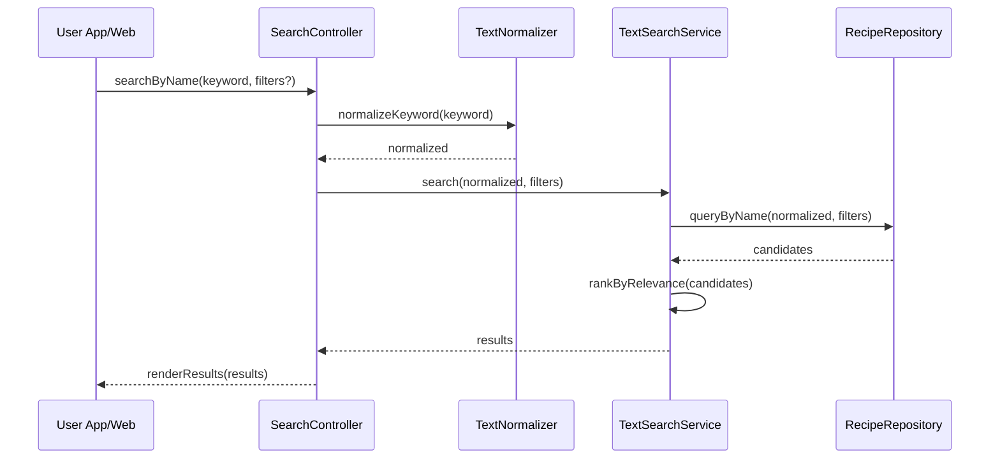

# Template Đặc Tả SEQUENCE DIAGRAM (SD)

## I. Thông Tin Tổng Quan (Header Information)

| Trường (Field) | Nội dung | Ghi chú/Ví dụ |
| :--- | :--- | :--- |
| **SD ID** | SD-UCS02-2 | Tương ứng UCS02-2 |
| **Related UC ID** | UCS02-2 | Tìm kiếm theo Tên món ăn |
| **SD Name** | Luồng tìm kiếm theo tên món |
| **Description** | Người dùng nhập từ khóa; hệ thống normalize (có/không dấu), thực hiện exact/partial/fuzzy, sắp xếp theo liên quan, hiển thị kết quả. |
| **Primary Actor** | User |
| **Phiên bản (Version)** | 0.1.0 |
| **Trạng thái (Status)** | Draft |
| **Tác giả (Author)** |  |
| **Ngày (Date)** |  |
| **Liên kết UC/BR/NFR** | `UC/UC2/UCS02-2_Tim_kiem_theo_ten_mon_an.md` |
| **Nguồn biểu đồ (Diagram Source)** | Mermaid |
| **Tài liệu liên quan (Related Artifacts)** | API Spec, Search Service, DB `Recipe` |

---

## II. Danh Sách Đối Tượng Tham Gia (Participants / Lifelines)

| ID | Tên Đối tượng | Stereotype | Ownership | Protocol | API Ver | Mô tả |
| :--- | :--- | :--- | :--- | :--- | :--- | :--- |
| L1 | User App/Web | Boundary | Client | HTTP | n/a | UI tìm kiếm |
| L2 | SearchController | Control | Core | Internal | v1 | Điều phối tìm kiếm |
| L3 | TextNormalizer | Service | Core | Internal | v1 | Chuẩn hóa từ khóa (VN có/không dấu, lower) |
| L4 | TextSearchService | Service | Core | Internal | v1 | Exact/partial/fuzzy search |
| L5 | RecipeRepository | Entity/DAO | Data | SQL | n/a | Truy vấn công thức |

---

## III. Biểu Đồ Sequence Diagram (Visual Model)

---

## IV. Đặc Tả Chi Tiết Luồng Tương Tác (Interaction Flow Specification)

### A. Luồng Thành công Chính (Basic Success Flow)

| STT | Hành động | Message | Sync/Async | Input | Output | Source | Target | Error/Timeout | Txn |
| :--- | :--- | :--- | :--- | :--- | :--- | :--- | :--- | :--- | :--- |
| 1 | Gửi tìm kiếm | `searchByName(...)` | Sync | `{ keyword, filters? }` | `200` | L1 | L2 | 4xx | N/A |
| 2 | Chuẩn hóa | `normalizeKeyword(...)` | Sync | `{ keyword }` | `{ normalized }` | L2 | L3 | 4xx | - |
| 3 | Truy vấn | `queryByName(...)` | Sync | `{ normalized, filters }` | `{ candidates }` | L4 | L5 | 5xx | Đọc |
| 4 | Xếp hạng | `rankByRelevance(...)` | Sync | `{ candidates }` | `{ results }` | L4 | L4 | 5xx | - |
| 5 | Hiển thị | `renderResults(...)` | Sync | `{ results }` | UI updated | L2 | L1 | - | N/A |

### B. Alternative/Exception Flows

| ID | Type | Guard | Affect | Error | Recovery | UI Message | Telemetry |
| :--- | :--- | :--- | :--- | :--- | :--- | :--- | :--- |
| EF-1 | [alt] | Không có kết quả | Thay thế 5 | EMPTY | Gợi ý phổ biến | "Không tìm thấy kết quả" | log: info |
| EF-2 | [alt] | Từ khóa quá ngắn | Thay thế 1-5 | KEYWORD_TOO_SHORT | Nhắc ≥3 ký tự | "Từ khóa quá ngắn" | log: warn |
| EF-3 | [alt] | Lỗi hệ thống | Thay thế 5 | SERVER_ERROR | Retry | "Đã xảy ra lỗi" | log: error |

---

## V. Ghi Chú & Ràng Buộc

| Trường | Chi tiết |
| :--- | :--- |
| Business Rules | Không phân biệt hoa thường; hỗ trợ có/không dấu |
| Performance | Autocomplete ≤300ms; tìm kiếm ≤2s |
| Security | Sanitize & escape input |

---

## VI. Tác Động Dữ Liệu

| Bảng | Hành động | Trường |
| :--- | :--- | :--- |
| `Recipe` | READ | by name |
| `SearchHistory` | INSERT | keyword, userId |

---

## VII. Giả Định & Câu Hỏi Mở

- Giả định: Lưu tối đa 50 từ khóa gần nhất.
- Câu hỏi mở: Có hỗ trợ voice search trên mobile?

---

## VIII. Nguồn Biểu Đồ

- Mermaid embedded ở mục III.

