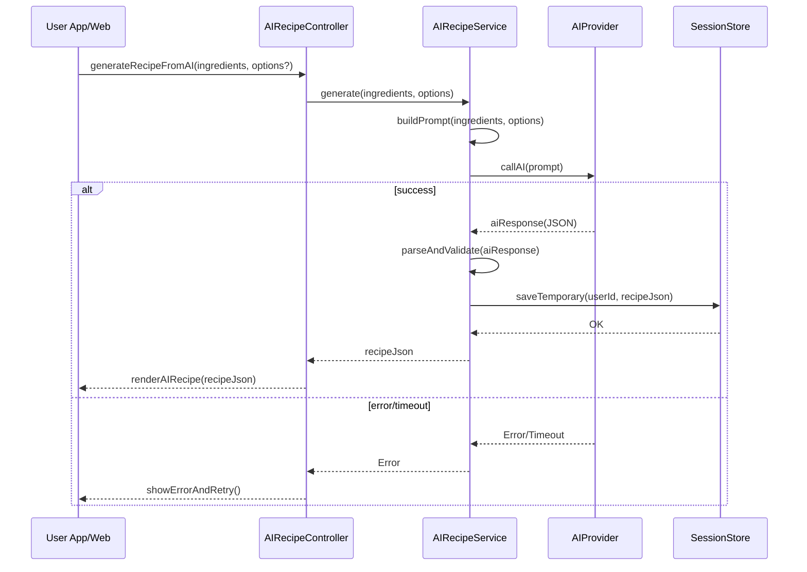

# Template Đặc Tả SEQUENCE DIAGRAM (SD)

## I. Thông Tin Tổng Quan (Header Information)

| Trường (Field) | Nội dung | Ghi chú/Ví dụ |
| :--- | :--- | :--- |
| **SD ID** | SD-UCS02-3 | Tương ứng UCS02-3 |
| **Related UC ID** | UCS02-3 | Tạo công thức bằng AI |
| **SD Name** | Luồng tạo công thức bằng AI |
| **Description** | Người dùng kích hoạt AI sau tìm kiếm không có kết quả; hệ thống chuẩn bị prompt, gọi AI, parse/validate phản hồi, hiển thị công thức và cho phép hành động tiếp theo. |
| **Primary Actor** | User |
| **Phiên bản (Version)** | 0.1.0 |
| **Trạng thái (Status)** | Draft |
| **Tác giả (Author)** |  |
| **Ngày (Date)** |  |
| **Liên kết UC/BR/NFR** | `UC/UC2/UCS02-3_Tao_cong_thuc_bang_AI.md` |
| **Nguồn biểu đồ (Diagram Source)** | Mermaid |
| **Tài liệu liên quan (Related Artifacts)** | API Spec, AI Provider, Session Store |

---

## II. Danh Sách Đối Tượng Tham Gia (Participants / Lifelines)

| ID | Tên Đối tượng | Stereotype | Ownership | Protocol | API Ver | Mô tả |
| :--- | :--- | :--- | :--- | :--- | :--- | :--- |
| L1 | User App/Web | Boundary | Client | HTTP | n/a | UI AI recipe |
| L2 | AIRecipeController | Control | Core | Internal | v1 | Điều phối |
| L3 | AIRecipeService | Service | Core | Internal | v1 | Chuẩn bị prompt, gọi AI, parse/validate |
| L4 | AIProvider | External Service | AI Platform | HTTPS | v1 | GPT/LLM API |
| L5 | SessionStore | Entity | Core | Internal | n/a | Lưu công thức AI tạm thời |

---

## III. Biểu Đồ Sequence Diagram (Visual Model)

---

## IV. Đặc Tả Chi Tiết Luồng Tương Tác (Interaction Flow Specification)

### A. Luồng Thành công Chính (Basic Success Flow)

| STT | Hành động | Message | Sync/Async | Input | Output | Source | Target | Error/Timeout | Txn |
| :--- | :--- | :--- | :--- | :--- | :--- | :--- | :--- | :--- | :--- |
| 1 | Kích hoạt AI | `generateRecipeFromAI(...)` | Sync | `{ ingredients[], options? }` | `202/200` | L1 | L2 | 4xx | N/A |
| 2 | Gọi AI | `callAI(prompt)` | Async | `{ prompt }` | `{ aiResponse }` | L3 | L4 | timeout | Đang mở |
| 3 | Parse/validate | `parseAndValidate(...)` | Sync | `{ aiResponse }` | `{ recipeJson }` | L3 | L3 | 4xx | - |
| 4 | Lưu tạm | `saveTemporary(...)` | Sync | `{ userId, json }` | `OK` | L3 | L5 | 5xx | Ghi |
| 5 | Hiển thị | `renderAIRecipe(...)` | Sync | `{ json }` | UI updated | L2 | L1 | - | N/A |

### B. Alternative/Exception Flows

| ID | Type | Guard | Affect | Error | Recovery | UI Message | Telemetry |
| :--- | :--- | :--- | :--- | :--- | :--- | :--- | :--- |
| EF-1 | [alt] | AI quá tải | Thay thế 3-5 | UPSTREAM_TIMEOUT | Retry/backoff | "AI quá tải" | log: error |
| EF-2 | [alt] | JSON không hợp lệ | Thay thế 4-5 | INVALID_JSON | Prompt khác | "Không thể xử lý kết quả" | log: warn |
| EF-3 | [alt] | Kết quả không hợp lý | Thay thế 5 | LOW_QUALITY | Cho báo cáo | "Kết quả có thể cần chỉnh" | log: info |

---

## V. Ghi Chú & Ràng Buộc

| Trường | Chi tiết |
| :--- | :--- |
| Security | Giấu API key; validate dữ liệu trước khi hiển thị |
| Reliability | Backoff, circuit breaker khi AI lỗi |

---

## VI. Tác Động Dữ Liệu

| Bảng | Hành động | Trường |
| :--- | :--- | :--- |
| `SessionStore` | UPSERT | userId, recipeJson, expiresAt |

---

## VII. Giả Định & Câu Hỏi Mở

- Giả định: Giới hạn 5 lần/ngày/người dùng.
- Câu hỏi mở: Có cho lưu công thức AI vào kho cá nhân?

---

## VIII. Nguồn Biểu Đồ

- Mermaid embedded ở mục III.

