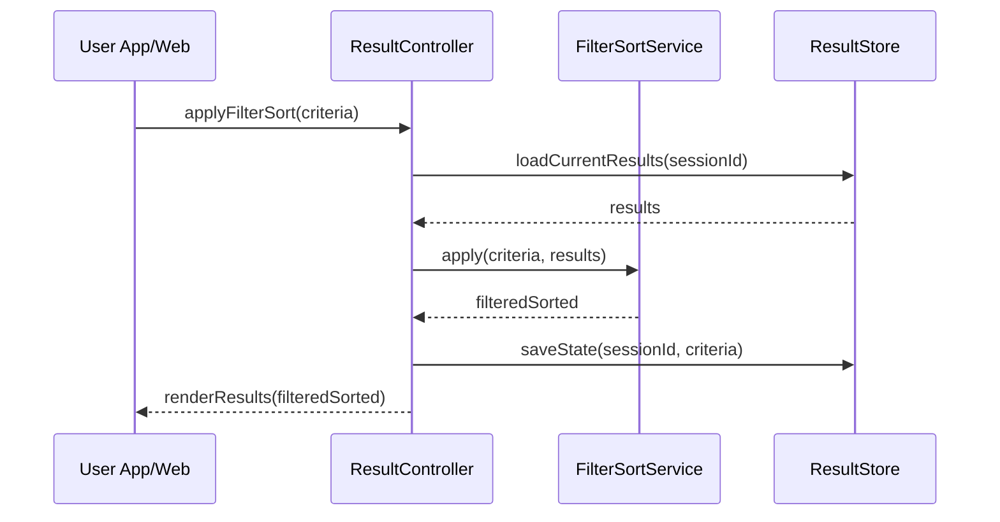

# Template Đặc Tả SEQUENCE DIAGRAM (SD)

## I. Thông Tin Tổng Quan (Header Information)

| Trường (Field) | Nội dung | Ghi chú/Ví dụ |
| :--- | :--- | :--- |
| **SD ID** | SD-UCS02-4 | Tương ứng UCS02-4 |
| **Related UC ID** | UCS02-4 | Lọc và Sắp xếp kết quả |
| **SD Name** | Luồng lọc và sắp xếp kết quả |
| **Description** | Người dùng áp dụng bộ lọc/sắp xếp trên kết quả tìm kiếm đã có; hệ thống áp dụng tiêu chí, cập nhật danh sách và lưu trạng thái. |
| **Primary Actor** | User |
| **Phiên bản (Version)** | 0.1.0 |
| **Trạng thái (Status)** | Draft |
| **Tác giả (Author)** |  |
| **Ngày (Date)** |  |
| **Liên kết UC/BR/NFR** | `UC/UC2/UCS02-4_Loc_va_sap_xep_ket_qua.md` |
| **Nguồn biểu đồ (Diagram Source)** | Mermaid |
| **Tài liệu liên quan (Related Artifacts)** | API Spec, Result Store/Session, Filter Engine |

---

## II. Danh Sách Đối Tượng Tham Gia (Participants / Lifelines)

| ID | Tên Đối tượng | Stereotype | Ownership | Protocol | API Ver | Mô tả |
| :--- | :--- | :--- | :--- | :--- | :--- | :--- |
| L1 | User App/Web | Boundary | Client | HTTP | n/a | UI kết quả |
| L2 | ResultController | Control | Core | Internal | v1 | Điều phối |
| L3 | FilterSortService | Service | Core | Internal | v1 | Áp dụng filter/sort |
| L4 | ResultStore | Entity | Core | Internal | n/a | Lưu kết quả và trạng thái |

---

## III. Biểu Đồ Sequence Diagram (Visual Model)

---

## IV. Đặc Tả Chi Tiết Luồng Tương Tác (Interaction Flow Specification)

### A. Luồng Thành công Chính (Basic Success Flow)

| STT | Hành động | Message | Sync/Async | Input | Output | Source | Target | Error/Timeout | Txn |
| :--- | :--- | :--- | :--- | :--- | :--- | :--- | :--- | :--- | :--- |
| 1 | Áp dụng tiêu chí | `applyFilterSort(criteria)` | Sync | `{ filters, sort }` | `200` | L1 | L2 | 4xx | N/A |
| 2 | Tải kết quả hiện tại | `loadCurrentResults(sessionId)` | Sync | `{ sessionId }` | `{ results }` | L2 | L4 | 404 | Đọc |
| 3 | Lọc & sắp xếp | `apply(criteria, results)` | Sync | `{ criteria, results }` | `{ newResults }` | L2 | L3 | 5xx | - |
| 4 | Lưu trạng thái | `saveState(sessionId, criteria)` | Sync | `{ sessionId, criteria }` | `OK` | L2 | L4 | 5xx | Ghi |
| 5 | Hiển thị | `renderResults(newResults)` | Sync | `{ newResults }` | UI updated | L2 | L1 | - | N/A |

### B. Alternative/Exception Flows

| ID | Type | Guard | Affect | Error | Recovery | UI Message | Telemetry |
| :--- | :--- | :--- | :--- | :--- | :--- | :--- | :--- |
| EF-1 | [alt] | Không có kết quả | Thay thế 5 | EMPTY | Gợi ý xóa filter | "Không có kết quả" | log: info |
| EF-2 | [alt] | Bộ lọc mâu thuẫn | Thay thế 3 | INVALID_FILTER | Nhắc sửa | "Bộ lọc không hợp lệ" | log: warn |
| EF-3 | [alt] | Session hết hạn | Thay thế 2-5 | EXPIRED | Làm mới | "Phiên hết hạn" | log: info |

---

## V. Ghi Chú & Ràng Buộc

| Trường | Chi tiết |
| :--- | :--- |
| Performance | Lọc/sắp xếp < 1s |
| Persistence | Lưu bộ lọc tối đa 2 giờ; lưu preset tối đa 5 |

---

## VI. Tác Động Dữ Liệu

| Bảng | Hành động | Trường |
| :--- | :--- | :--- |
| `ResultStore` | UPSERT | sessionId, results, criteria |

---

## VII. Giả Định & Câu Hỏi Mở

- Giả định: Có các nút lọc nhanh.
- Câu hỏi mở: Có đồng bộ preset giữa thiết bị?

---

## VIII. Nguồn Biểu Đồ

- Mermaid embedded ở mục III.

