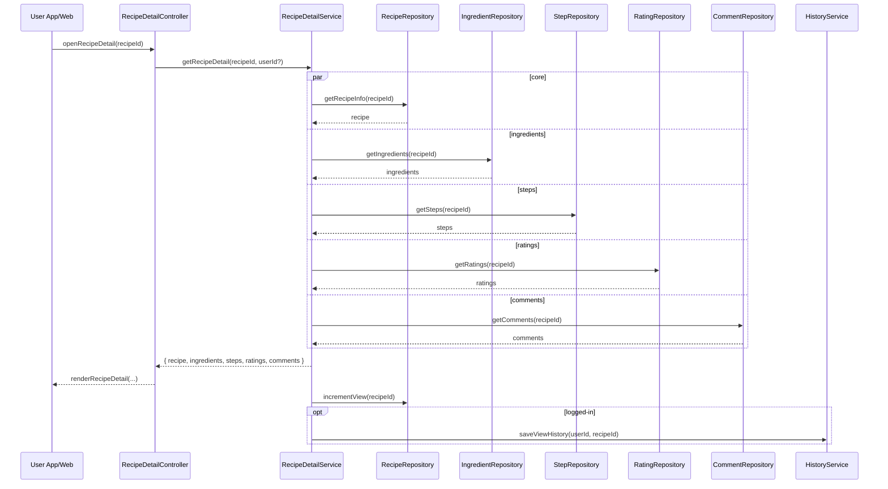

# Template Đặc Tả SEQUENCE DIAGRAM (SD)

## I. Thông Tin Tổng Quan (Header Information)

| Trường (Field) | Nội dung | Ghi chú/Ví dụ |
| :--- | :--- | :--- |
| **SD ID** | SD-UCS02-5 | Tương ứng UCS02-5 |
| **Related UC ID** | UCS02-5 | Xem chi tiết Công thức |
| **SD Name** | Luồng xem chi tiết công thức |
| **Description** | Người dùng mở chi tiết; hệ thống truy vấn full dữ liệu (thông tin, nguyên liệu, bước, tác giả, đánh giá/bình luận), tăng view, lưu lịch sử (nếu đăng nhập). |
| **Primary Actor** | User |
| **Phiên bản (Version)** | 0.1.0 |
| **Trạng thái (Status)** | Draft |
| **Tác giả (Author)** |  |
| **Ngày (Date)** |  |
| **Liên kết UC/BR/NFR** | `UC/UC2/UCS02-5_Xem_chi_tiet_cong_thuc.md` |
| **Nguồn biểu đồ (Diagram Source)** | Mermaid |
| **Tài liệu liên quan (Related Artifacts)** | API Spec, DB `Recipe`, `Ingredient`, `Step`, `Rating`, `Comment`, `ViewHistory` |

---

## II. Danh Sách Đối Tượng Tham Gia (Participants / Lifelines)

| ID | Tên Đối tượng | Stereotype | Ownership | Protocol | API Ver | Mô tả |
| :--- | :--- | :--- | :--- | :--- | :--- | :--- |
| L1 | User App/Web | Boundary | Client | HTTP | n/a | UI chi tiết |
| L2 | RecipeDetailController | Control | Core | Internal | v1 | Điều phối |
| L3 | RecipeDetailService | Service | Core | Internal | v1 | Tổng hợp chi tiết |
| L4 | RecipeRepository | Entity/DAO | Data | SQL | n/a | Thông tin cơ bản |
| L5 | IngredientRepository | Entity/DAO | Data | SQL | n/a | Nguyên liệu |
| L6 | StepRepository | Entity/DAO | Data | SQL | n/a | Các bước |
| L7 | RatingRepository | Entity/DAO | Data | SQL | n/a | Đánh giá |
| L8 | CommentRepository | Entity/DAO | Data | SQL | n/a | Bình luận |
| L9 | HistoryService | Service | Core | Internal | v1 | Lưu lịch sử xem |

---

## III. Biểu Đồ Sequence Diagram (Visual Model)

---

## IV. Đặc Tả Chi Tiết Luồng Tương Tác (Interaction Flow Specification)

### A. Luồng Thành công Chính (Basic Success Flow)

| STT | Hành động | Message | Sync/Async | Input | Output | Source | Target | Error/Timeout | Txn |
| :--- | :--- | :--- | :--- | :--- | :--- | :--- | :--- | :--- | :--- |
| 1 | Mở chi tiết | `openRecipeDetail(recipeId)` | Sync | `{ recipeId }` | `200` | L1 | L2 | 4xx | N/A |
| 2 | Tổng hợp | `getRecipeDetail(...)` | Sync | `{ recipeId, userId? }` | `{ detail }` | L2 | L3 | 5xx | Đọc |
| 3 | Đọc dữ liệu | `getRecipeInfo/...` | Sync | `{ ids }` | `{ data }` | L3 | L4-8 | 404/5xx | Đọc |
| 4 | Hiển thị | `renderRecipeDetail(...)` | Sync | `{ detail }` | UI updated | L2 | L1 | - | N/A |
| 5 | Tăng view | `incrementView(...)` | Async | `{ recipeId }` | `OK` | L3 | L4 | 5xx | Ghi |
| 6 | Lưu lịch sử | `saveViewHistory(...)` | Async | `{ userId, recipeId }` | `OK` | L3 | L9 | 5xx | Ghi |

### B. Alternative/Exception Flows

| ID | Type | Guard | Affect | Error | Recovery | UI Message | Telemetry |
| :--- | :--- | :--- | :--- | :--- | :--- | :--- | :--- |
| EF-1 | [alt] | Không tồn tại | Thay thế 4-6 | NOT_FOUND | Quay lại | "Công thức không tồn tại" | log: warn |
| EF-2 | [alt] | Chưa duyệt | Thay thế 4-6 | NOT_APPROVED | Ẩn nội dung | "Chưa được duyệt" | log: info |
| EF-3 | [alt] | Lỗi tải dữ liệu | Thay thế 4-6 | SERVER_ERROR | Retry | "Không thể tải thông tin" | log: error |

---

## V. Ghi Chú & Ràng Buộc

| Trường | Chi tiết |
| :--- | :--- |
| Business Rules | Chỉ hiển thị công thức đã duyệt |
| Performance | Tải chi tiết < 3s |

---

## VI. Tác Động Dữ Liệu

| Bảng | Hành động | Trường |
| :--- | :--- | :--- |
| `Recipe` | UPDATE | views |
| `ViewHistory` | INSERT | userId, recipeId, viewedAt |

---

## VII. Giả Định & Câu Hỏi Mở

- Giả định: Có phiên bản in ấn và dark mode.
- Câu hỏi mở: Lưu lịch sử tối đa bao nhiêu mục?

---

## VIII. Nguồn Biểu Đồ

- Mermaid embedded ở mục III.

